# Compiler results data
## MOTION Benchmark Data

### BooleanGmw
| Benchmark | Total # Gates | # SIMD gates | # Non-SIMD gates | # messages sent (party 0) | Sent size (party 0) | # messages received (party 0) | Received Size (party 0) | Runtime | Circuit Generation Time |
| - | - | - | - | - | - | - | - | - | - |
|biometric|9999|8352|1647|4947|0.615 MiB |4946|0.615 MiB |2807.633 ms |337.0 ms |
|biometric_fast|10632|8974|1658|5265|0.611 MiB |5264|0.611 MiB |3028.456 ms |322.0 ms |
|chapterfour_figure_12|805|0|805|752|0.048 MiB |751|0.048 MiB |371.519 ms |31.0 ms |
|convex_hull|2106|2063|43|1381|0.122 MiB |1380|0.122 MiB |583.665 ms |63.0 ms |
|count_102|6610|297|6313|3820|0.237 MiB |3819|0.237 MiB |3360.993 ms |203.0 ms |
|count_10s|4720|298|4422|2848|0.177 MiB |2847|0.177 MiB |2267.999 ms |139.0 ms |
|count_123|4729|305|4424|2850|0.177 MiB |2849|0.177 MiB |2343.511 ms |139.0 ms |
|cryptonets_max_pooling|1349|1217|132|951|0.139 MiB |950|0.138 MiB |917.9 ms |42.0 ms |
|db_cross_join_trivial|21900|116|21784|14486|0.877 MiB |14485|0.876 MiB |2342.174 ms |686.0 ms |
|db_variance|29520|5864|23656|13646|0.926 MiB |13645|0.926 MiB |50646.379 ms |869.0 ms |
|inner_product|7075|5207|1868|3582|0.245 MiB |3581|0.245 MiB |1303.119 ms |235.0 ms |
|longest_102|10649|305|10344|5642|0.341 MiB |5641|0.341 MiB |4501.542 ms |326.0 ms |
|longest_odd_10|8518|304|8214|4614|0.283 MiB |4613|0.283 MiB |4750.211 ms |264.0 ms |
|max_dist_between_syms|8276|100|8176|4454|0.263 MiB |4453|0.263 MiB |2574.233 ms |244.0 ms |
|max_sum_between_syms|8275|100|8175|4454|0.263 MiB |4453|0.263 MiB |2617.859 ms |257.0 ms |
|minimal_points|882|847|35|765|0.071 MiB |764|0.071 MiB |498.291 ms |26.0 ms |
|mnist_relu|1014|407|607|771|0.33 MiB |770|0.33 MiB |394.328 ms |57.0 ms |
|psi|182|138|44|474|0.05 MiB |473|0.05 MiB |579.598 ms |9.0 ms |

### Bmr
| Benchmark | Total # Gates | # SIMD gates | # Non-SIMD gates | # messages sent (party 0) | Sent size (party 0) | # messages received (party 0) | Received Size (party 0) | Runtime | Circuit Generation Time |
| - | - | - | - | - | - | - | - | - | - |
|biometric|4486|3645|841|7843|4.37 MiB |7846|4.37 MiB |460.543 ms |369.0 ms |
|biometric_fast|4654|3802|852|8024|4.326 MiB |8002|4.324 MiB |451.29 ms |386.0 ms |
|chapterfour_figure_12|398|0|398|975|0.087 MiB |972|0.087 MiB |43.9 ms |26.0 ms |
|convex_hull|1040|991|49|1992|0.514 MiB |1981|0.513 MiB |112.009 ms |83.0 ms |
|count_102|1753|109|1644|3831|0.569 MiB |3819|0.569 MiB |185.34 ms |141.0 ms |
|count_10s|1264|110|1154|2942|0.415 MiB |2932|0.414 MiB |155.92 ms |108.0 ms |
|count_123|1271|115|1156|2948|0.417 MiB |2939|0.416 MiB |155.735 ms |109.0 ms |
|cryptonets_max_pooling|757|605|152|1484|1.013 MiB |1379|1.007 MiB |129.048 ms |59.0 ms |
|db_cross_join_trivial|7971|62|7909|36652|6.318 MiB |36345|6.302 MiB |717.724 ms |1166.0 ms |
|db_variance|13352|3017|10335|20698|3.612 MiB |20695|3.611 MiB |1189.153 ms |937.0 ms |
|inner_product|3301|2827|474|5833|1.004 MiB |5830|1.004 MiB |325.618 ms |245.0 ms |
|longest_102|3730|115|3615|6776|0.867 MiB |6764|0.866 MiB |391.009 ms |278.0 ms |
|longest_odd_10|2993|114|2879|6671|0.869 MiB |6660|0.868 MiB |316.244 ms |250.0 ms |
|max_dist_between_syms|2879|38|2841|5152|0.559 MiB |5141|0.558 MiB |306.637 ms |215.0 ms |
|max_sum_between_syms|2878|38|2840|5150|0.558 MiB |5140|0.557 MiB |307.028 ms |220.0 ms |
|minimal_points|472|431|41|1015|0.244 MiB |1012|0.244 MiB |95.079 ms |41.0 ms |
|mnist_relu|1010|203|807|1684|3.225 MiB |1280|3.205 MiB |251.836 ms |97.0 ms |
|psi|141|92|49|748|0.348 MiB |740|0.348 MiB |51.909 ms |15.0 ms |

### mixed
| Benchmark | Total # Gates | # SIMD gates | # Non-SIMD gates | # messages sent (party 0) | Sent size (party 0) | # messages received (party 0) | Received Size (party 0) | Runtime | Circuit Generation Time |
| - | - | - | - | - | - | - | - | - | - |
|biometric|1026|185|841|2237|0.252 MiB |2230|0.252 MiB |163.036 ms |81.0 ms |
|biometric_fast|1041|189|852|2237|0.252 MiB |2230|0.252 MiB |164.658 ms |80.0 ms |
|chapterfour_figure_12|17|0|17|1434|0.11 MiB |1176|0.098 MiB |5.281 ms |12.0 ms |
|convex_hull|1039|991|48|1990|0.513 MiB |1980|0.513 MiB |95.785 ms |82.0 ms |
|count_102|1752|109|1643|3829|0.569 MiB |3818|0.568 MiB |190.098 ms |144.0 ms |
|count_10s|1263|110|1153|2940|0.414 MiB |2931|0.414 MiB |129.999 ms |103.0 ms |
|count_123|1270|115|1155|2946|0.416 MiB |2938|0.416 MiB |131.7 ms |101.0 ms |
|cryptonets_max_pooling|753|605|148|1476|1.01 MiB |1375|1.005 MiB |133.225 ms |59.0 ms |
|db_cross_join_trivial|7968|62|7906|36646|6.316 MiB |36342|6.301 MiB |684.206 ms |1135.0 ms |
|db_variance|8215|11|8204|13396|1.306 MiB |13394|1.29 MiB |894.771 ms |592.0 ms |
|inner_product|19|6|13|394|0.029 MiB |393|0.029 MiB |41.758 ms |0.0 ms |
|longest_102|3729|115|3614|6774|0.866 MiB |6763|0.866 MiB |386.31 ms |277.0 ms |
|longest_odd_10|2992|114|2878|6669|0.868 MiB |6659|0.868 MiB |339.511 ms |249.0 ms |
|max_dist_between_syms|2878|38|2840|5150|0.558 MiB |5140|0.557 MiB |302.573 ms |210.0 ms |
|max_sum_between_syms|2877|38|2839|5148|0.557 MiB |5139|0.557 MiB |303.67 ms |212.0 ms |
|minimal_points|411|367|44|1782|0.214 MiB |1525|0.201 MiB |100.611 ms |39.0 ms |
|mnist_relu|813|205|608|755|1.616 MiB |753|1.616 MiB |192.177 ms |78.0 ms |
|psi|139|92|47|744|0.347 MiB |738|0.347 MiB |51.817 ms |18.0 ms |

## MP-SPDZ Benchmark Data
### Arithmetic protocol compilation
| Benchmark | Compile time (seconds) | # int triples | # int opens | # VM rounds |
| - | - | - | - | - |
|biometric|0.373|504|6|38|
|biometric (Non-Vectorized)|0.191|504|6|38|
|biometric_fast|0.19|504|6|38|
|biometric_fast (Non-Vectorized)|0.182|504|6|38|
|chapterfour_figure_12|0.17|242|3|11|
|chapterfour_figure_12 (Non-Vectorized)|0.174|242|3|11|
|convex_hull|0.19|2910|30|15|
|convex_hull (Non-Vectorized)|0.195|2910|30|15|
|count_102|0.185|1930|31|38|
|count_102 (Non-Vectorized)|0.187|1930|31|29|
|count_10s|0.182|1351|22|29|
|count_10s (Non-Vectorized)|0.176|1351|22|23|
|count_123|0.186|1358|22|30|
|count_123 (Non-Vectorized)|0.188|1358|22|24|
|cryptonets_max_pooling|0.217|7260|80|28|
|cryptonets_max_pooling (Non-Vectorized)|0.208|7260|80|28|
|db_cross_join_trivial|0.383|19389|378|13|
|db_cross_join_trivial (Non-Vectorized)|0.359|19200|375|13|
|db_variance|2.102|4002|29|190|
|db_variance (Non-Vectorized)|2.056|4002|29|190|
|inner_product|0.093|3|1|2|
|inner_product (Non-Vectorized)|0.089|3|1|2|
|longest_102|0.286|3160|41|140|
|longest_102 (Non-Vectorized)|0.294|3160|41|113|
|longest_odd_10|0.333|2520|33|114|
|longest_odd_10 (Non-Vectorized)|0.335|2520|33|156|
|max_dist_between_syms|0.266|1480|17|89|
|max_dist_between_syms (Non-Vectorized)|0.266|1480|17|82|
|max_sum_between_syms|0.266|1480|17|89|
|max_sum_between_syms (Non-Vectorized)|0.273|1480|17|82|
|minimal_points|0.194|2184|24|14|
|minimal_points (Non-Vectorized)|0.182|2184|24|14|
|mnist_relu|0.305|24200|400|10|
|mnist_relu (Non-Vectorized)|0.331|24200|400|10|
|psi|0.191|2245|40|17|
|psi (Non-Vectorized)|0.19|2245|40|17|
### Binary protocol compilation (32 bit default)
| Benchmark | Compile time (seconds) | # bit triples | # VM rounds |
| - | - | - | - |
|biometric|0.926|24824|91|
|biometric_fast|0.997|21956|100|
|chapterfour_figure_12|0.145|190|9|
|convex_hull|0.675|2916|23|
|count_102|0.603|2270|79|
|count_10s|0.456|1589|66|
|count_123|0.448|1596|67|
|cryptonets_max_pooling|0.178|5700|22|
|db_cross_join_trivial|1.902|18993|10|
|inner_product|0.495|3669|28|
|longest_102|0.961|3240|112|
|longest_odd_10|0.88|3080|121|
|max_dist_between_syms|0.784|2056|72|
|max_sum_between_syms|0.73|2056|72|
|minimal_points|0.137|1344|12|
|mnist_relu|0.52|19000|8|
|psi|0.121|1280|14|
### Mixed protocols compilation
| Benchmark | Compile time (seconds) | # int triples | # int opens | # bit triples | # VM rounds |
| - | - | - | - | - | - |
|biometric mixed|0.557|16|8|1300|41|
|biometric_fast mixed|0.772|16|12|1696|41|
|chapterfour_figure_12 mixed|0.145|0|0|190|9|
|convex_hull mixed|0.708|0|12|2916|23|
|count_102 mixed|0.593|0|0|2270|79|
|count_10s mixed|0.458|0|0|1589|66|
|count_123 mixed|0.432|0|0|1596|67|
|cryptonets_max_pooling mixed|0.184|0|0|5700|22|
|db_cross_join_trivial mixed|1.925|0|0|18993|10|
|db_variance mixed|1.107|38|29|4106|6|
|inner_product mixed|0.09|3|1|0|2|
|longest_102 mixed|0.935|0|0|3240|112|
|longest_odd_10 mixed|0.897|0|0|3080|121|
|max_dist_between_syms mixed|0.757|0|0|2056|72|
|max_sum_between_syms mixed|0.737|0|0|2056|72|
|minimal_points mixed|0.134|0|0|1344|12|
|mnist_relu mixed|0.521|0|0|19000|8|
|psi mixed|0.123|0|0|1280|14|

### Semi protocol
| Benchmark | Time (seconds) | Data sent (MB) | Communication rounds |
| - | - | - | - |
|biometric A|0.0373258|1.57851|84|
|biometric B|0.0344776|0.293357|480|
|biometric X|0.0127885|0.09864|103|
|biometric Y|0.0285651|0.161896|346|
|biometric mixed|0.030866|0.147091|353|
|biometric_fast A|0.0275897|1.57851|84|
|biometric_fast B|0.0349613|0.26976|498|
|biometric_fast X|0.0132373|0.09864|103|
|biometric_fast Y|0.0302836|0.161896|346|
|biometric_fast mixed|0.0293796|0.150374|353|
|chapterfour_figure_12 A|0.0168098|0.761113|37|
|chapterfour_figure_12 B|0.00484731|0.006839|29|
|chapterfour_figure_12 X|0.0106714|0.024039|50|
|chapterfour_figure_12 Y|0.0254133|0.091391|292|
|chapterfour_figure_12 mixed|0.00504662|0.006839|29|
|convex_hull A|0.101696|9.09347|73|
|convex_hull B|0.0253728|0.105986|308|
|convex_hull X|0.0153455|0.171892|68|
|convex_hull Y|0.0272259|0.2002|300|
|convex_hull mixed|0.0246873|0.105986|308|
|count_102 A|0.0786251|6.06026|115|
|count_102 B|0.00855856|0.025203|169|
|count_102 X|0.0180229|0.209846|119|
|count_102 Y|0.0280427|0.223728|344|
|count_102 mixed|0.00873837|0.025203|169|
|count_10s A|0.0608653|4.24543|92|
|count_10s B|0.00762462|0.018679|143|
|count_10s X|0.0166223|0.14659|96|
|count_10s Y|0.0278424|0.181018|326|
|count_10s mixed|0.00805629|0.018679|143|
|count_123 A|0.0558486|4.26408|94|
|count_123 B|0.00786038|0.018681|145|
|count_123 X|0.0175949|0.168318|98|
|count_123 Y|0.0273726|0.202746|328|
|count_123 mixed|0.00776264|0.018681|145|
|cryptonets_max_pooling A|0.232088|22.7094|160|
|cryptonets_max_pooling B|0.00944836|0.060008|63|
|cryptonets_max_pooling X|0.026559|0.374572|114|
|cryptonets_max_pooling Y|0.0307526|0.330936|326|
|cryptonets_max_pooling mixed|0.00942601|0.060008|63|
|db_cross_join_trivial A|0.612534|62.6905|362|
|db_cross_join_trivial B|0.0111959|0.172801|39|
|db_cross_join_trivial X|0.0900191|1.63491|209|
|db_cross_join_trivial Y|0.0447732|1.41745|299|
|db_cross_join_trivial mixed|0.0115501|0.172801|39|
|db_variance A|0.205071|24.941|445|
|db_variance X|0.0337727|0.395394|480|
|db_variance Y|0.149204|0.94451|2799|
|db_variance mixed|0.14735|0.94451|2799|
|inner_product A|0.00465099|0.015063|15|
|inner_product B|0.0105448|0.04377|111|
|inner_product X|0.00440964|0.015063|15|
|inner_product Y|0.00466221|0.015063|15|
|inner_product mixed|0.00471788|0.015063|15|
|longest_102 A|0.11599|9.90415|322|
|longest_102 B|0.0102881|0.032745|235|
|longest_102 X|0.0304952|0.327296|328|
|longest_102 Y|0.0415848|0.353983|643|
|longest_102 mixed|0.0105038|0.032745|235|
|longest_odd_10 A|0.0983101|7.89736|258|
|longest_odd_10 B|0.010668|0.031516|253|
|longest_odd_10 X|0.0232223|0.23908|271|
|longest_odd_10 Y|0.0382308|0.280169|591|
|longest_odd_10 mixed|0.0105983|0.031516|253|
|max_dist_between_syms A|0.0632589|4.63443|191|
|max_dist_between_syms B|0.00822172|0.022928|155|
|max_dist_between_syms X|0.017253|0.102112|211|
|max_dist_between_syms Y|0.0350063|0.172005|541|
|max_dist_between_syms mixed|0.00809036|0.022928|155|
|max_sum_between_syms A|0.0627789|4.63443|191|
|max_sum_between_syms B|0.0084677|0.022928|155|
|max_sum_between_syms X|0.0173826|0.102112|211|
|max_sum_between_syms Y|0.0348442|0.172005|541|
|max_sum_between_syms mixed|0.00939305|0.022928|155|
|minimal_points A|0.0807376|6.82956|66|
|minimal_points B|0.00845196|0.022449|43|
|minimal_points X|0.0148671|0.137658|61|
|minimal_points Y|0.0281155|0.176272|298|
|minimal_points mixed|0.00881026|0.022449|43|
|mnist_relu A|0.734441|78.0689|351|
|mnist_relu B|0.011807|0.173764|35|
|mnist_relu X|0.0691583|1.18464|148|
|mnist_relu Y|0.0415146|1.08836|295|
|mnist_relu mixed|0.0106483|0.173764|35|
|psi A|0.0871937|7.05821|82|
|psi B|0.00824702|0.022238|47|
|psi X|0.0181602|0.220396|77|
|psi Y|0.0268939|0.226086|302|
|psi mixed|0.00866358|0.022238|47|

## Compiler stages with different benchmarks
### `biometric`
#### Input
```python
from UTIL import shared

# Biometric matching
# D is the number of features we are matching. Usually small, e.g., D=4
# N is the size of the database S
# C is the vector of features we are tryign to match.
# S is the (originally two dimentional) database array: S[0,0],S[0,1],..S[0,D-1],S[1,0]... S[N-1,D-1]
def biometric(
    C: shared[list[int]], D: int, S: shared[list[int]], N: int
) -> tuple[shared[int], shared[int]]:
    min_sum: int = 10000
    min_index = 0  # -1 (compiler doesn't support negative constants)
    for i in range(N):
        sum = 0
        for j in range(D):
            d = S[i * D + j] - C[j]
            p = d * d
            sum = sum + p
        if sum < min_sum:
            min_sum = sum
            min_index = i

    return (min_sum, min_index)


C = [1, 2, 3, 4]
D = 4
S = [4, 5, 2, 10, 2, 120, 4, 10, 99, 88, 77, 66, 55, 44, 33, 22]
N = 4
print(biometric(C, D, S, N))

```
#### Restricted AST
```python
def biometric(C: shared[list[int; ?]], D: plaintext[int], S: shared[list[int; ?]], N: plaintext[int]) -> tuple[shared[int], shared[int]]:
    min_sum = 10000
    min_index = 0
    for i: plaintext[int] in range(0, N):
        sum = 0
        for j: plaintext[int] in range(0, D):
            d = (S[((i * D) + j)] - C[j])
            p = (d * d)
            sum = (sum + p)
        if (sum < min_sum):
            min_sum = sum
            min_index = i
    return (min_sum, min_index)
```
#### Three-address code CFG
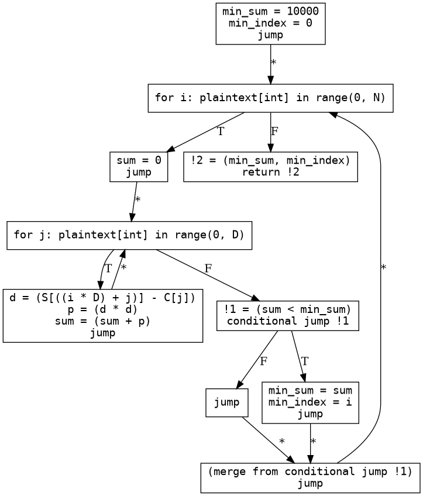
#### SSA
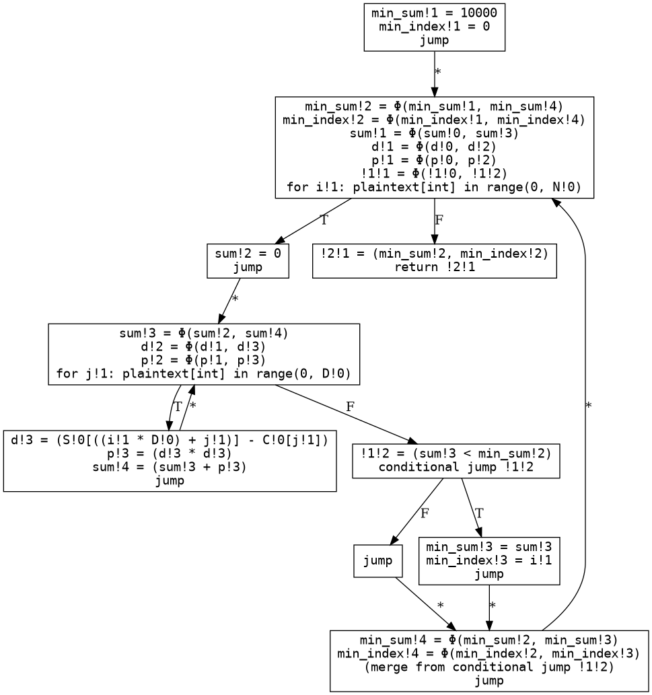
#### SSA ϕ→MUX
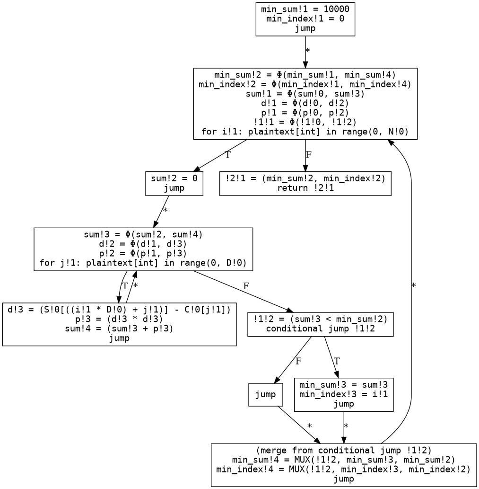
#### Dead code elimination
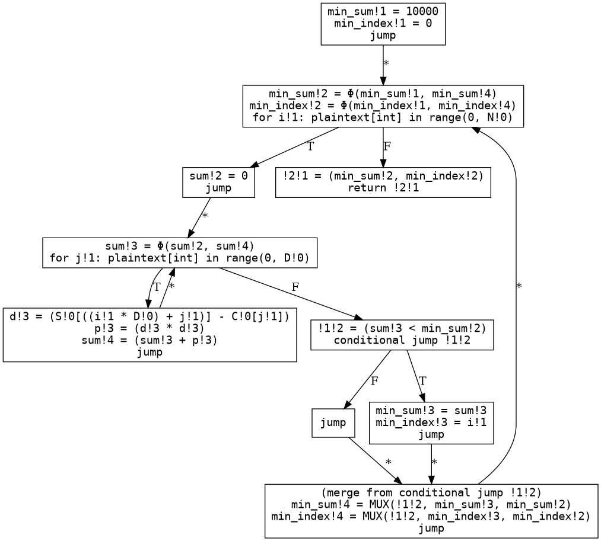
#### Linear code with loops
```python
def biometric(C!0: shared[list[int; ?]], D!0: plaintext[int], S!0: shared[list[int; ?]], N!0: plaintext[int]) -> tuple[shared[int], shared[int]]:
    min_sum!1 = 10000
    min_index!1 = 0
    for i!1 in range(0, N!0):
        min_sum!2 = Φ(min_sum!1, min_sum!4)
        min_index!2 = Φ(min_index!1, min_index!4)
        sum!2 = 0
        for j!1 in range(0, D!0):
            sum!3 = Φ(sum!2, sum!4)
            d!3 = (S!0[((i!1 * D!0) + j!1)] - C!0[j!1])
            p!3 = (d!3 * d!3)
            sum!4 = (sum!3 + p!3)
        !1!2 = (sum!3 < min_sum!2)
        min_sum!3 = sum!3
        min_index!3 = i!1
        min_sum!4 = MUX(!1!2, min_sum!3, min_sum!2)
        min_index!4 = MUX(!1!2, min_index!3, min_index!2)
    !2!1 = (min_sum!2, min_index!2)
    return !2!1
```
#### Dependency graph
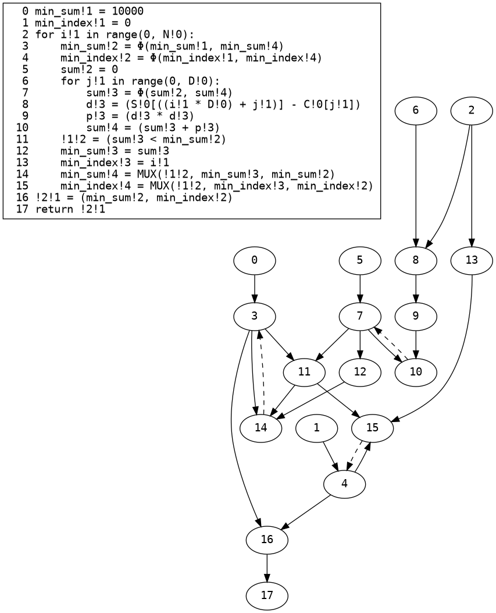
#### Removal of infeasible edges

#### Type Environment Before Vectorization
| Variable | Type |
| - | - |
| `C!0` | `shared[list[int; ?]]` |
| `D!0` | `plaintext[int]` |
| `S!0` | `shared[list[int; ?]]` |
| `N!0` | `plaintext[int]` |
| `i!1` | `plaintext[int]` |
| `j!1` | `plaintext[int]` |
| `!2!1` | `tuple[shared[int], shared[int]]` |
| `min_index!4` | `shared[int]` |
| `min_index!2` | `shared[int]` |
| `min_sum!4` | `shared[int]` |
| `min_sum!2` | `shared[int]` |
| `!1!2` | `shared[bool]` |
| `min_index!3` | `plaintext[int]` |
| `min_sum!3` | `shared[int]` |
| `sum!4` | `shared[int]` |
| `sum!3` | `shared[int]` |
| `p!3` | `shared[int]` |
| `d!3` | `shared[int]` |
| `sum!2` | `plaintext[int]` |
| `min_index!1` | `plaintext[int]` |
| `min_sum!1` | `plaintext[int]` |
#### Basic Vectorization Phase 1
```python
def biometric(C!0: shared[list[int; ?]], D!0: plaintext[int], S!0: shared[list[int; ?]], N!0: plaintext[int]) -> tuple[shared[int], shared[int]]:
    min_sum!1 = 10000
    min_index!1 = 0
    !3!0{N!0}[] = lift(min_sum!1, (i!1:N!0))
    !4!0{N!0}[] = lift(min_index!1, (i!1:N!0))
    for i!1 in range(0, N!0):
        min_sum!2{N!0}[] = Φ(!3!0{N!0}[], min_sum!4{N!0}[])
        min_index!2{N!0}[] = Φ(!4!0{N!0}[], min_index!4{N!0}[])
        sum!2 = 0
        !5!0{N!0, D!0}[] = lift(sum!2, (i!1:N!0, j!1:D!0))
        !6!0{N!0, D!0}[] = lift(S!0[((i!1 * D!0) + j!1)], (i!1:N!0, j!1:D!0))
        !7!0{N!0, D!0}[] = lift(C!0[j!1], (i!1:N!0, j!1:D!0))
        for j!1 in range(0, D!0):
            sum!3{N!0, D!0}[] = Φ(!5!0{N!0, D!0}[], sum!4{N!0, D!0}[])
            d!3{N!0, D!0}[] = (!6!0{N!0, D!0}[] - !7!0{N!0, D!0}[])
            p!3{N!0, D!0}[] = (d!3{N!0, D!0}[] * d!3{N!0, D!0}[])
            sum!4{N!0, D!0}[] = (sum!3{N!0, D!0}[] + p!3{N!0, D!0}[])
        !8!0{N!0}[] = drop_dim(sum!4{N!0, D!0}[])
        !1!2{N!0}[] = (!8!0{N!0}[] < min_sum!2{N!0}[])
        !9!0{N!0}[] = drop_dim(sum!4{N!0, D!0}[])
        min_sum!3{N!0}[] = !9!0{N!0}[]
        min_index!3 = i!1
        min_sum!4{N!0}[] = MUX(!1!2{N!0}[], min_sum!3{N!0}[], min_sum!2{N!0}[])
        min_index!4{N!0}[] = MUX(!1!2{N!0}[], min_index!3, min_index!2{N!0}[])
    !10!0 = drop_dim(min_sum!4{N!0}[])
    !11!0 = drop_dim(min_index!4{N!0}[])
    !2!1 = (!10!0, !11!0)
    return !2!1
```
#### Basic Vectorization Phase 1 (dependence graph)
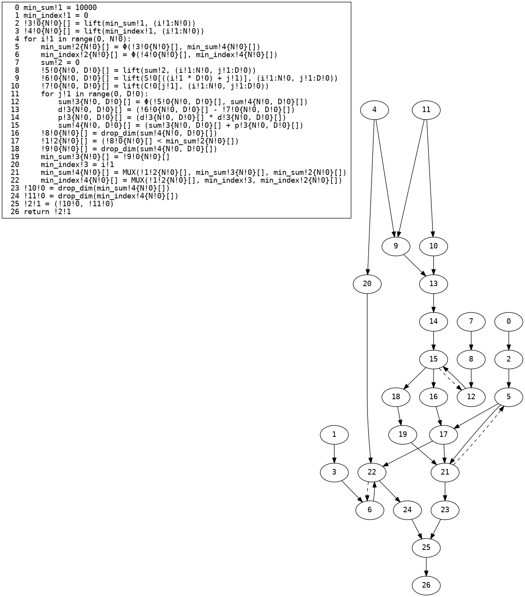
#### Basic Vectorization Phase 2
```python
def biometric(C!0: shared[list[int; ?]], D!0: plaintext[int], S!0: shared[list[int; ?]], N!0: plaintext[int]) -> tuple[shared[int], shared[int]]:
    min_sum!1 = 10000
    min_index!1 = 0
    sum!2 = 0
    !6!0{N!0, D!0}[] = lift(S!0[((i!1 * D!0) + j!1)], (i!1:N!0, j!1:D!0))
    !7!0{N!0, D!0}[] = lift(C!0[j!1], (i!1:N!0, j!1:D!0))
    !13!0{N!0}[] = lift(i!1, (i!1:N!0))
    !3!0{N!0}[] = lift(min_sum!1, (i!1:N!0))
    !4!0{N!0}[] = lift(min_index!1, (i!1:N!0))
    !5!0{N!0, D!0}[] = lift(sum!2, (i!1:N!0, j!1:D!0))
    d!3{N!0, D!0}[] = (!6!0{N!0, D!0}[] - !7!0{N!0, D!0}[])
    p!3{N!0, D!0}[] = (d!3{N!0, D!0}[] * d!3{N!0, D!0}[])
    for !12!0 in range(0, D!0): (monolithic)
        sum!3{N!0}[!12!0] = Φ(!5!0{N!0}[!12!0], sum!4{N!0}[(!12!0 - 1)])
        sum!4{N!0}[!12!0] = (sum!3{N!0}[!12!0] + p!3{N!0}[!12!0])
    !8!0{N!0}[] = drop_dim(sum!4{N!0, D!0}[])
    !9!0{N!0}[] = drop_dim(sum!4{N!0, D!0}[])
    min_sum!3{N!0}[] = !9!0{N!0}[]
    for !14!0 in range(0, N!0): (monolithic)
        min_sum!2{}[!14!0] = Φ(!3!0{}[!14!0], min_sum!4{}[(!14!0 - 1)])
        !1!2{}[!14!0] = (!8!0{}[!14!0] < min_sum!2{}[!14!0])
        min_sum!4{}[!14!0] = MUX(!1!2{}[!14!0], min_sum!3{}[!14!0], min_sum!2{}[!14!0])
    for !15!0 in range(0, N!0): (monolithic)
        min_index!2{}[!15!0] = Φ(!4!0{}[!15!0], min_index!4{}[(!15!0 - 1)])
        min_index!4{}[!15!0] = MUX(!1!2{}[!15!0], !13!0{}[!15!0], min_index!2{}[!15!0])
    !10!0 = drop_dim(min_sum!4{N!0}[])
    !11!0 = drop_dim(min_index!4{N!0}[])
    !2!1 = (!10!0, !11!0)
    return !2!1
```
#### Basic Vectorization Phase 2 (dependence graph)
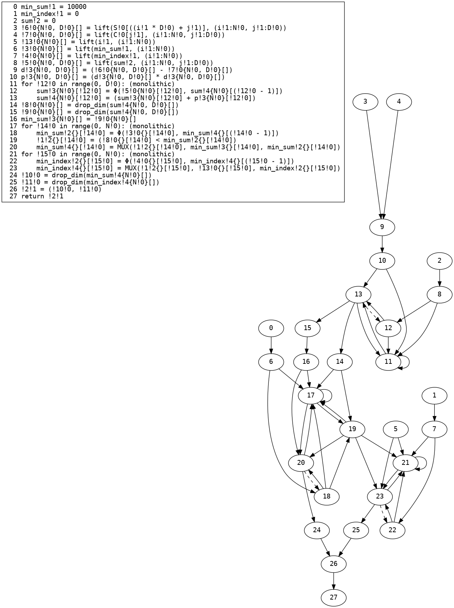
#### Type Environment After Vectorization
| Variable | Type |
| - | - |
| `C!0` | `shared[list[int; ?]]` |
| `D!0` | `plaintext[int]` |
| `S!0` | `shared[list[int; ?]]` |
| `N!0` | `plaintext[int]` |
| `!12!0` | `plaintext[int]` |
| `!14!0` | `plaintext[int]` |
| `!15!0` | `plaintext[int]` |
| `!2!1` | `tuple[shared[int], shared[int]]` |
| `!11!0` | `shared[int]` |
| `!10!0` | `shared[int]` |
| `min_index!4` | `shared[list[int; (N!0)]]` |
| `min_index!2` | `shared[list[int; (N!0)]]` |
| `min_sum!4` | `shared[list[int; (N!0)]]` |
| `min_sum!2` | `shared[list[int; (N!0)]]` |
| `!1!2` | `shared[list[bool; (N!0)]]` |
| `min_sum!3` | `shared[list[int; (N!0)]]` |
| `!9!0` | `shared[list[int; (N!0)]]` |
| `!8!0` | `shared[list[int; (N!0)]]` |
| `sum!4` | `shared[list[list[int; (N!0)]; (D!0)]]` |
| `sum!3` | `shared[list[list[int; (N!0)]; (D!0)]]` |
| `p!3` | `shared[list[list[int; (N!0)]; (D!0)]]` |
| `d!3` | `shared[list[list[int; (N!0)]; (D!0)]]` |
| `!5!0` | `shared[list[list[int; (N!0)]; (D!0)]]` |
| `!4!0` | `shared[list[int; (N!0)]]` |
| `!3!0` | `shared[list[int; (N!0)]]` |
| `!13!0` | `shared[list[int; (N!0)]]` |
| `!7!0` | `shared[list[list[int; (N!0)]; (D!0)]]` |
| `!6!0` | `shared[list[list[int; (N!0)]; (D!0)]]` |
| `sum!2` | `plaintext[int]` |
| `min_index!1` | `plaintext[int]` |
| `min_sum!1` | `plaintext[int]` |
#### Copy propagation
```python
def biometric(C!0: shared[list[int; ?]], D!0: plaintext[int], S!0: shared[list[int; ?]], N!0: plaintext[int]) -> tuple[shared[int], shared[int]]:
    min_sum!1 = 10000
    min_index!1 = 0
    sum!2 = 0
    !6!0{N!0, D!0}[] = lift(S!0[((i!1 * D!0) + j!1)], (i!1:N!0, j!1:D!0))
    !7!0{N!0, D!0}[] = lift(C!0[j!1], (i!1:N!0, j!1:D!0))
    !13!0{N!0}[] = lift(i!1, (i!1:N!0))
    !3!0{N!0}[] = lift(min_sum!1, (i!1:N!0))
    !4!0{N!0}[] = lift(min_index!1, (i!1:N!0))
    !5!0{N!0, D!0}[] = lift(sum!2, (i!1:N!0, j!1:D!0))
    d!3{N!0, D!0}[] = (!6!0{N!0, D!0}[] - !7!0{N!0, D!0}[])
    p!3{N!0, D!0}[] = (d!3{N!0, D!0}[] * d!3{N!0, D!0}[])
    for !12!0 in range(0, D!0): (monolithic)
        sum!3{N!0}[!12!0] = Φ(!5!0{N!0}[!12!0], sum!4{N!0}[(!12!0 - 1)])
        sum!4{N!0}[!12!0] = (sum!3{N!0}[!12!0] + p!3{N!0}[!12!0])
    !8!0{N!0}[] = drop_dim(sum!4{N!0, D!0}[])
    !9!0{N!0}[] = drop_dim(sum!4{N!0, D!0}[])
    for !14!0 in range(0, N!0): (monolithic)
        min_sum!2{}[!14!0] = Φ(!3!0{}[!14!0], min_sum!4{}[(!14!0 - 1)])
        !1!2{}[!14!0] = (!8!0{}[!14!0] < min_sum!2{}[!14!0])
        min_sum!4{}[!14!0] = MUX(!1!2{}[!14!0], !9!0{}[!14!0], min_sum!2{}[!14!0])
    for !15!0 in range(0, N!0): (monolithic)
        min_index!2{}[!15!0] = Φ(!4!0{}[!15!0], min_index!4{}[(!15!0 - 1)])
        min_index!4{}[!15!0] = MUX(!1!2{}[!15!0], !13!0{}[!15!0], min_index!2{}[!15!0])
    !10!0 = drop_dim(min_sum!4{N!0}[])
    !11!0 = drop_dim(min_index!4{N!0}[])
    !2!1 = (!10!0, !11!0)
    return !2!1
```
#### Common subexpression elimination
```python
def biometric(C!0: shared[list[int; ?]], D!0: plaintext[int], S!0: shared[list[int; ?]], N!0: plaintext[int]) -> tuple[shared[int], shared[int]]:
    min_sum!1 = 10000
    min_index!1 = 0
    sum!2 = 0
    !6!0{N!0, D!0}[] = lift(S!0[((i!1 * D!0) + j!1)], (i!1:N!0, j!1:D!0))
    !7!0{N!0, D!0}[] = lift(C!0[j!1], (i!1:N!0, j!1:D!0))
    !13!0{N!0}[] = lift(i!1, (i!1:N!0))
    !3!0{N!0}[] = lift(min_sum!1, (i!1:N!0))
    !4!0{N!0}[] = lift(min_index!1, (i!1:N!0))
    !5!0{N!0, D!0}[] = lift(sum!2, (i!1:N!0, j!1:D!0))
    d!3{N!0, D!0}[] = (!6!0{N!0, D!0}[] - !7!0{N!0, D!0}[])
    p!3{N!0, D!0}[] = (d!3{N!0, D!0}[] * d!3{N!0, D!0}[])
    for !12!0 in range(0, D!0): (monolithic)
        sum!3{N!0}[!12!0] = Φ(!5!0{N!0}[!12!0], sum!4{N!0}[(!12!0 - 1)])
        sum!4{N!0}[!12!0] = (sum!3{N!0}[!12!0] + p!3{N!0}[!12!0])
    !8!0{N!0}[] = drop_dim(sum!4{N!0, D!0}[])
    for !14!0 in range(0, N!0): (monolithic)
        min_sum!2{}[!14!0] = Φ(!3!0{}[!14!0], min_sum!4{}[(!14!0 - 1)])
        !1!2{}[!14!0] = (!8!0{}[!14!0] < min_sum!2{}[!14!0])
        min_sum!4{}[!14!0] = MUX(!1!2{}[!14!0], !8!0{}[!14!0], min_sum!2{}[!14!0])
    for !15!0 in range(0, N!0): (monolithic)
        min_index!2{}[!15!0] = Φ(!4!0{}[!15!0], min_index!4{}[(!15!0 - 1)])
        min_index!4{}[!15!0] = MUX(!1!2{}[!15!0], !13!0{}[!15!0], min_index!2{}[!15!0])
    !10!0 = drop_dim(min_sum!4{N!0}[])
    !11!0 = drop_dim(min_index!4{N!0}[])
    !2!1 = (!10!0, !11!0)
    return !2!1
```
#### MOTION mixed configuration
```Total cost:	0.20493
Input vars:	{C!0: ['A'], S!0: ['A']}
Constants:	{10000: ['Y'], 0: ['A', 'Y']}
Plaintext vars:	{}
Flags:		{}
min_sum!1 = 10000: _ -> ['Y'] for 0.00000 * 1 = 0.00
min_index!1 = 0: _ -> ['Y'] for 0.00000 * 1 = 0.00
sum!2 = 0: _ -> ['A'] for 0.00000 * 1 = 0.00
!6!0{N!0, D!0}[] = lift(S!0[((i!1 * D!0) + j!1)], (i!1:N!0, j!1:D!0)): _ -> ['A'] for 0.00000 * 1 = 0.00
!7!0{N!0, D!0}[] = lift(C!0[j!1], (i!1:N!0, j!1:D!0)): _ -> ['A'] for 0.00000 * 1 = 0.00
!13!0{N!0}[] = lift(i!1, (i!1:N!0)): _ -> ['Y'] for 0.00000 * 1 = 0.00
!3!0{N!0}[] = lift(min_sum!1, (i!1:N!0)): _ -> ['Y'] for 0.00000 * 1 = 0.00
!4!0{N!0}[] = lift(min_index!1, (i!1:N!0)): _ -> ['Y'] for 0.00000 * 1 = 0.00
!5!0{N!0, D!0}[] = lift(sum!2, (i!1:N!0, j!1:D!0)): _ -> ['A'] for 0.00000 * 1 = 0.00
d!3{N!0, D!0}[] = (!6!0{N!0, D!0}[] - !7!0{N!0, D!0}[]): A -> {} for 0.00028 * 1 = 0.00
p!3{N!0, D!0}[] = (d!3{N!0, D!0}[] * d!3{N!0, D!0}[]): A -> {} for 0.00716 * 1 = 0.01
	sum!3{N!0}[!12!0] = Φ(!5!0{N!0}[!12!0], sum!4{N!0}[(!12!0 - 1)]): A -> {} for 0.00000 * 4 = 0.00
	sum!4{N!0}[!12!0] = (sum!3{N!0}[!12!0] + p!3{N!0}[!12!0]): A -> {} for 0.00000 * 4 = 0.00
!8!0{N!0}[] = drop_dim(sum!4{N!0, D!0}[]): _ -> ['A', 'Y'] for 0.03052 * 1 = 0.03 (A->Y)
	min_sum!2{}[!14!0] = Φ(!3!0{}[!14!0], min_sum!4{}[(!14!0 - 1)]): Y -> {} for 0.00000 * 4 = 0.00
	!1!2{}[!14!0] = (!8!0{}[!14!0] < min_sum!2{}[!14!0]): Y -> {} for 0.02979 * 4 = 0.12
	min_sum!4{}[!14!0] = MUX(!1!2{}[!14!0], !8!0{}[!14!0], min_sum!2{}[!14!0]): Y -> {} for 0.00597 * 4 = 0.02
	min_index!2{}[!15!0] = Φ(!4!0{}[!15!0], min_index!4{}[(!15!0 - 1)]): Y -> {} for 0.00000 * 4 = 0.00
	min_index!4{}[!15!0] = MUX(!1!2{}[!15!0], !13!0{}[!15!0], min_index!2{}[!15!0]): Y -> {} for 0.00597 * 4 = 0.02
!10!0 = drop_dim(min_sum!4{N!0}[]): _ -> ['Y'] for 0.00000 * 1 = 0.00
!11!0 = drop_dim(min_index!4{N!0}[]): _ -> ['Y'] for 0.00000 * 1 = 0.00
!2!1 = (!10!0, !11!0)
return !2!1
Output vars:	{!11!0: ['Y'], !10!0: ['Y']}

```
#### MOTION code
```cpp
template <encrypto::motion::MpcProtocol Protocol>
std::tuple<encrypto::motion::SecureUnsignedInteger, encrypto::motion::SecureUnsignedInteger> biometric(
    encrypto::motion::PartyPointer &party,
    std::vector<encrypto::motion::SecureUnsignedInteger> C_0,
    std::uint32_t _MPC_PLAINTEXT_D_0,
    std::vector<encrypto::motion::SecureUnsignedInteger> S_0,
    std::uint32_t _MPC_PLAINTEXT_N_0
) {
    // Shared variable declarations
    std::vector<encrypto::motion::ShareWrapper> _1_2((_MPC_PLAINTEXT_N_0));
    encrypto::motion::SecureUnsignedInteger _10_0;
    encrypto::motion::SecureUnsignedInteger _11_0;
    encrypto::motion::SecureUnsignedInteger _12_0;
    std::vector<encrypto::motion::SecureUnsignedInteger> _13_0((_MPC_PLAINTEXT_N_0));
    encrypto::motion::SecureUnsignedInteger _14_0;
    encrypto::motion::SecureUnsignedInteger _15_0;
    std::tuple<encrypto::motion::SecureUnsignedInteger, encrypto::motion::SecureUnsignedInteger> _2_1;
    std::vector<encrypto::motion::SecureUnsignedInteger> _3_0((_MPC_PLAINTEXT_N_0));
    std::vector<encrypto::motion::SecureUnsignedInteger> _4_0((_MPC_PLAINTEXT_N_0));
    std::vector<encrypto::motion::SecureUnsignedInteger> _5_0((_MPC_PLAINTEXT_N_0) * (_MPC_PLAINTEXT_D_0));
    std::vector<encrypto::motion::SecureUnsignedInteger> _6_0((_MPC_PLAINTEXT_N_0) * (_MPC_PLAINTEXT_D_0));
    std::vector<encrypto::motion::SecureUnsignedInteger> _7_0((_MPC_PLAINTEXT_N_0) * (_MPC_PLAINTEXT_D_0));
    std::vector<encrypto::motion::SecureUnsignedInteger> _8_0((_MPC_PLAINTEXT_N_0));
    encrypto::motion::SecureUnsignedInteger D_0;
    encrypto::motion::SecureUnsignedInteger N_0;
    std::vector<encrypto::motion::SecureUnsignedInteger> d_3((_MPC_PLAINTEXT_N_0) * (_MPC_PLAINTEXT_D_0));
    encrypto::motion::SecureUnsignedInteger min_index_1;
    std::vector<encrypto::motion::SecureUnsignedInteger> min_index_2((_MPC_PLAINTEXT_N_0));
    std::vector<encrypto::motion::SecureUnsignedInteger> min_index_4((_MPC_PLAINTEXT_N_0));
    encrypto::motion::SecureUnsignedInteger min_sum_1;
    std::vector<encrypto::motion::SecureUnsignedInteger> min_sum_2((_MPC_PLAINTEXT_N_0));
    std::vector<encrypto::motion::SecureUnsignedInteger> min_sum_4((_MPC_PLAINTEXT_N_0));
    std::vector<encrypto::motion::SecureUnsignedInteger> p_3((_MPC_PLAINTEXT_N_0) * (_MPC_PLAINTEXT_D_0));
    encrypto::motion::SecureUnsignedInteger sum_2;
    std::vector<encrypto::motion::SecureUnsignedInteger> sum_3((_MPC_PLAINTEXT_N_0) * (_MPC_PLAINTEXT_D_0));
    std::vector<encrypto::motion::SecureUnsignedInteger> sum_4((_MPC_PLAINTEXT_N_0) * (_MPC_PLAINTEXT_D_0));

    // Plaintext variable declarations
    std::uint32_t _MPC_PLAINTEXT__12_0;
    std::uint32_t _MPC_PLAINTEXT__14_0;
    std::uint32_t _MPC_PLAINTEXT__15_0;
    std::tuple<std::uint32_t, std::uint32_t> _MPC_PLAINTEXT__2_1;
    std::uint32_t _MPC_PLAINTEXT_min_index_1;
    std::uint32_t _MPC_PLAINTEXT_min_sum_1;
    std::uint32_t _MPC_PLAINTEXT_sum_2;

    // Constant initializations
    encrypto::motion::SecureUnsignedInteger _MPC_CONSTANT_0 = party->In<Protocol>(encrypto::motion::ToInput(std::uint32_t(0)), 0);
    encrypto::motion::SecureUnsignedInteger _MPC_CONSTANT_10000 = party->In<Protocol>(encrypto::motion::ToInput(std::uint32_t(10000)), 0);

    // Plaintext parameter assignments
    D_0 = party->In<Protocol>(encrypto::motion::ToInput(_MPC_PLAINTEXT_D_0), 0);
    N_0 = party->In<Protocol>(encrypto::motion::ToInput(_MPC_PLAINTEXT_N_0), 0);

    // Function body
    min_sum_1 = _MPC_CONSTANT_10000;
    _MPC_PLAINTEXT_min_sum_1 = std::uint32_t(10000);
    min_index_1 = _MPC_CONSTANT_0;
    _MPC_PLAINTEXT_min_index_1 = std::uint32_t(0);
    sum_2 = _MPC_CONSTANT_0;
    _MPC_PLAINTEXT_sum_2 = std::uint32_t(0);
    vectorized_assign(_6_0, {_MPC_PLAINTEXT_N_0, _MPC_PLAINTEXT_D_0}, {true, true}, {}, lift(std::function([&](const std::vector<std::uint32_t> &indices){return S_0[((indices[0] * _MPC_PLAINTEXT_D_0) + indices[1])];}), {_MPC_PLAINTEXT_N_0, _MPC_PLAINTEXT_D_0}));
    vectorized_assign(_7_0, {_MPC_PLAINTEXT_N_0, _MPC_PLAINTEXT_D_0}, {true, true}, {}, lift(std::function([&](const std::vector<std::uint32_t> &indices){return C_0[indices[1]];}), {_MPC_PLAINTEXT_N_0, _MPC_PLAINTEXT_D_0}));
    vectorized_assign(_13_0, {_MPC_PLAINTEXT_N_0}, {true}, {}, lift(std::function([&](const std::vector<std::uint32_t> &indices){return encrypto::motion::SecureUnsignedInteger(party->In<Protocol>(encrypto::motion::ToInput(indices[0]), 0));}), {_MPC_PLAINTEXT_N_0}));
    vectorized_assign(_3_0, {_MPC_PLAINTEXT_N_0}, {true}, {}, lift(std::function([&](const std::vector<std::uint32_t> &indices){return min_sum_1;}), {_MPC_PLAINTEXT_N_0}));
    vectorized_assign(_4_0, {_MPC_PLAINTEXT_N_0}, {true}, {}, lift(std::function([&](const std::vector<std::uint32_t> &indices){return min_index_1;}), {_MPC_PLAINTEXT_N_0}));
    vectorized_assign(_5_0, {_MPC_PLAINTEXT_N_0, _MPC_PLAINTEXT_D_0}, {true, true}, {}, lift(std::function([&](const std::vector<std::uint32_t> &indices){return sum_2;}), {_MPC_PLAINTEXT_N_0, _MPC_PLAINTEXT_D_0}));
    vectorized_assign(d_3, {_MPC_PLAINTEXT_N_0, _MPC_PLAINTEXT_D_0}, {true, true}, {}, (vectorized_access(_6_0, {_MPC_PLAINTEXT_N_0, _MPC_PLAINTEXT_D_0}, {true, true}, {}) - vectorized_access(_7_0, {_MPC_PLAINTEXT_N_0, _MPC_PLAINTEXT_D_0}, {true, true}, {})));
    vectorized_assign(p_3, {_MPC_PLAINTEXT_N_0, _MPC_PLAINTEXT_D_0}, {true, true}, {}, (vectorized_access(d_3, {_MPC_PLAINTEXT_N_0, _MPC_PLAINTEXT_D_0}, {true, true}, {}) * vectorized_access(d_3, {_MPC_PLAINTEXT_N_0, _MPC_PLAINTEXT_D_0}, {true, true}, {})));

    // Initialize loop counter
    _MPC_PLAINTEXT__12_0 = std::uint32_t(0);
    // Initialize phi values
    vectorized_assign(sum_3, {_MPC_PLAINTEXT_N_0, _MPC_PLAINTEXT_D_0}, {true, false}, {_MPC_PLAINTEXT__12_0}, vectorized_access(_5_0, {_MPC_PLAINTEXT_N_0, _MPC_PLAINTEXT_D_0}, {true, false}, {_MPC_PLAINTEXT__12_0}));
    for (; _MPC_PLAINTEXT__12_0 < _MPC_PLAINTEXT_D_0; _MPC_PLAINTEXT__12_0++) {
        // Update phi values
        if (_MPC_PLAINTEXT__12_0 != std::uint32_t(0)) {
            vectorized_assign(sum_3, {_MPC_PLAINTEXT_N_0, _MPC_PLAINTEXT_D_0}, {true, false}, {_MPC_PLAINTEXT__12_0}, vectorized_access(sum_4, {_MPC_PLAINTEXT_N_0, _MPC_PLAINTEXT_D_0}, {true, false}, {(_MPC_PLAINTEXT__12_0 - std::uint32_t(1))}));
        }

        vectorized_assign(sum_4, {_MPC_PLAINTEXT_N_0, _MPC_PLAINTEXT_D_0}, {true, false}, {_MPC_PLAINTEXT__12_0}, (vectorized_access(sum_3, {_MPC_PLAINTEXT_N_0, _MPC_PLAINTEXT_D_0}, {true, false}, {_MPC_PLAINTEXT__12_0}) + vectorized_access(p_3, {_MPC_PLAINTEXT_N_0, _MPC_PLAINTEXT_D_0}, {true, false}, {_MPC_PLAINTEXT__12_0})));

    }

    vectorized_assign(_8_0, {_MPC_PLAINTEXT_N_0}, {true}, {}, drop_dim(vectorized_access(sum_4, {_MPC_PLAINTEXT_N_0, _MPC_PLAINTEXT_D_0}, {true, true}, {}).Unsimdify(), {_MPC_PLAINTEXT_N_0, _MPC_PLAINTEXT_D_0}));

    // Initialize loop counter
    _MPC_PLAINTEXT__14_0 = std::uint32_t(0);
    // Initialize phi values
    min_sum_2[_MPC_PLAINTEXT__14_0] = _3_0[_MPC_PLAINTEXT__14_0];
    for (; _MPC_PLAINTEXT__14_0 < _MPC_PLAINTEXT_N_0; _MPC_PLAINTEXT__14_0++) {
        // Update phi values
        if (_MPC_PLAINTEXT__14_0 != std::uint32_t(0)) {
            min_sum_2[_MPC_PLAINTEXT__14_0] = min_sum_4[(_MPC_PLAINTEXT__14_0 - std::uint32_t(1))];
        }

        _1_2[_MPC_PLAINTEXT__14_0] = (min_sum_2[_MPC_PLAINTEXT__14_0] > _8_0[_MPC_PLAINTEXT__14_0]);
        min_sum_4[_MPC_PLAINTEXT__14_0] = _1_2[_MPC_PLAINTEXT__14_0].Mux(_8_0[_MPC_PLAINTEXT__14_0].Get(), min_sum_2[_MPC_PLAINTEXT__14_0].Get());

    }


    // Initialize loop counter
    _MPC_PLAINTEXT__15_0 = std::uint32_t(0);
    // Initialize phi values
    min_index_2[_MPC_PLAINTEXT__15_0] = _4_0[_MPC_PLAINTEXT__15_0];
    for (; _MPC_PLAINTEXT__15_0 < _MPC_PLAINTEXT_N_0; _MPC_PLAINTEXT__15_0++) {
        // Update phi values
        if (_MPC_PLAINTEXT__15_0 != std::uint32_t(0)) {
            min_index_2[_MPC_PLAINTEXT__15_0] = min_index_4[(_MPC_PLAINTEXT__15_0 - std::uint32_t(1))];
        }

        min_index_4[_MPC_PLAINTEXT__15_0] = _1_2[_MPC_PLAINTEXT__15_0].Mux(_13_0[_MPC_PLAINTEXT__15_0].Get(), min_index_2[_MPC_PLAINTEXT__15_0].Get());

    }

    _10_0 = drop_dim_monoreturn(vectorized_access(min_sum_4, {_MPC_PLAINTEXT_N_0}, {true}, {}).Unsimdify(), {_MPC_PLAINTEXT_N_0});
    _11_0 = drop_dim_monoreturn(vectorized_access(min_index_4, {_MPC_PLAINTEXT_N_0}, {true}, {}).Unsimdify(), {_MPC_PLAINTEXT_N_0});
    _2_1 = std::make_tuple(_10_0, _11_0);
    return _2_1;

}
```
#### MOTION mixed code
```cpp
std::tuple<encrypto::motion::SecureUnsignedInteger, encrypto::motion::SecureUnsignedInteger> biometric(
    encrypto::motion::PartyPointer &party,
    std::vector<encrypto::motion::SecureUnsignedInteger> C_0,
    std::uint32_t _MPC_PLAINTEXT_D_0,
    std::vector<encrypto::motion::SecureUnsignedInteger> S_0,
    std::uint32_t _MPC_PLAINTEXT_N_0
) {
    // Shared variable declarations
    std::vector<encrypto::motion::ShareWrapper> _1_2((_MPC_PLAINTEXT_N_0));
    encrypto::motion::SecureUnsignedInteger _10_0;
    encrypto::motion::SecureUnsignedInteger _11_0;
    encrypto::motion::SecureUnsignedInteger _12_0;
    std::vector<encrypto::motion::SecureUnsignedInteger> _13_0((_MPC_PLAINTEXT_N_0));
    encrypto::motion::SecureUnsignedInteger _14_0;
    encrypto::motion::SecureUnsignedInteger _15_0;
    std::tuple<encrypto::motion::SecureUnsignedInteger, encrypto::motion::SecureUnsignedInteger> _2_1;
    std::vector<encrypto::motion::SecureUnsignedInteger> _3_0((_MPC_PLAINTEXT_N_0));
    std::vector<encrypto::motion::SecureUnsignedInteger> _4_0((_MPC_PLAINTEXT_N_0));
    std::vector<encrypto::motion::SecureUnsignedInteger> _5_0((_MPC_PLAINTEXT_N_0) * (_MPC_PLAINTEXT_D_0));
    std::vector<encrypto::motion::SecureUnsignedInteger> _6_0((_MPC_PLAINTEXT_N_0) * (_MPC_PLAINTEXT_D_0));
    std::vector<encrypto::motion::SecureUnsignedInteger> _7_0((_MPC_PLAINTEXT_N_0) * (_MPC_PLAINTEXT_D_0));
    std::vector<encrypto::motion::SecureUnsignedInteger> _8_0((_MPC_PLAINTEXT_N_0));
    encrypto::motion::SecureUnsignedInteger D_0;
    encrypto::motion::SecureUnsignedInteger N_0;
    std::vector<encrypto::motion::SecureUnsignedInteger> d_3((_MPC_PLAINTEXT_N_0) * (_MPC_PLAINTEXT_D_0));
    encrypto::motion::SecureUnsignedInteger min_index_1;
    std::vector<encrypto::motion::SecureUnsignedInteger> min_index_2((_MPC_PLAINTEXT_N_0));
    std::vector<encrypto::motion::SecureUnsignedInteger> min_index_4((_MPC_PLAINTEXT_N_0));
    encrypto::motion::SecureUnsignedInteger min_sum_1;
    std::vector<encrypto::motion::SecureUnsignedInteger> min_sum_2((_MPC_PLAINTEXT_N_0));
    std::vector<encrypto::motion::SecureUnsignedInteger> min_sum_4((_MPC_PLAINTEXT_N_0));
    std::vector<encrypto::motion::SecureUnsignedInteger> p_3((_MPC_PLAINTEXT_N_0) * (_MPC_PLAINTEXT_D_0));
    encrypto::motion::SecureUnsignedInteger sum_2;
    std::vector<encrypto::motion::SecureUnsignedInteger> sum_3((_MPC_PLAINTEXT_N_0) * (_MPC_PLAINTEXT_D_0));
    std::vector<encrypto::motion::SecureUnsignedInteger> sum_4((_MPC_PLAINTEXT_N_0) * (_MPC_PLAINTEXT_D_0));

    // Plaintext variable declarations
    std::uint32_t _MPC_PLAINTEXT__12_0;
    std::uint32_t _MPC_PLAINTEXT__14_0;
    std::uint32_t _MPC_PLAINTEXT__15_0;
    std::tuple<std::uint32_t, std::uint32_t> _MPC_PLAINTEXT__2_1;
    std::uint32_t _MPC_PLAINTEXT_min_index_1;
    std::uint32_t _MPC_PLAINTEXT_min_sum_1;
    std::uint32_t _MPC_PLAINTEXT_sum_2;

    // Constant initializations
    encrypto::motion::SecureUnsignedInteger _MPC_CONSTANT_0 = party->In<encrypto::motion::MpcProtocol::kArithmeticGmw>(std::uint32_t(0), 0);
    encrypto::motion::SecureUnsignedInteger _MPC_CONSTANT_0_Y = party->In<encrypto::motion::MpcProtocol::kBmr>(encrypto::motion::ToInput(std::uint32_t(0)), 0);
    encrypto::motion::SecureUnsignedInteger _MPC_CONSTANT_10000 = party->In<encrypto::motion::MpcProtocol::kBmr>(encrypto::motion::ToInput(std::uint32_t(10000)), 0);

    // Input Protocol Convertions

    // Plaintext parameter assignments

    // Function body
    min_sum_1 = _MPC_CONSTANT_10000;
    _MPC_PLAINTEXT_min_sum_1 = std::uint32_t(10000);
    min_index_1 = _MPC_CONSTANT_0_Y;
    _MPC_PLAINTEXT_min_index_1 = std::uint32_t(0);
    sum_2 = _MPC_CONSTANT_0;
    _MPC_PLAINTEXT_sum_2 = std::uint32_t(0);
    vectorized_assign(_6_0, {_MPC_PLAINTEXT_N_0, _MPC_PLAINTEXT_D_0}, {true, true}, {}, lift(std::function([&](const std::vector<std::uint32_t> &indices){return S_0[((indices[0] * _MPC_PLAINTEXT_D_0) + indices[1])];}), {_MPC_PLAINTEXT_N_0, _MPC_PLAINTEXT_D_0}));
    vectorized_assign(_7_0, {_MPC_PLAINTEXT_N_0, _MPC_PLAINTEXT_D_0}, {true, true}, {}, lift(std::function([&](const std::vector<std::uint32_t> &indices){return C_0[indices[1]];}), {_MPC_PLAINTEXT_N_0, _MPC_PLAINTEXT_D_0}));
    vectorized_assign(_13_0, {_MPC_PLAINTEXT_N_0}, {true}, {}, lift(std::function([&](const std::vector<std::uint32_t> &indices){return encrypto::motion::SecureUnsignedInteger(party->In<encrypto::motion::MpcProtocol::kBmr>(encrypto::motion::ToInput(indices[0]), 0));}), {_MPC_PLAINTEXT_N_0}));
    vectorized_assign(_3_0, {_MPC_PLAINTEXT_N_0}, {true}, {}, lift(std::function([&](const std::vector<std::uint32_t> &indices){return min_sum_1;}), {_MPC_PLAINTEXT_N_0}));
    vectorized_assign(_4_0, {_MPC_PLAINTEXT_N_0}, {true}, {}, lift(std::function([&](const std::vector<std::uint32_t> &indices){return min_index_1;}), {_MPC_PLAINTEXT_N_0}));
    vectorized_assign(_5_0, {_MPC_PLAINTEXT_N_0, _MPC_PLAINTEXT_D_0}, {true, true}, {}, lift(std::function([&](const std::vector<std::uint32_t> &indices){return sum_2;}), {_MPC_PLAINTEXT_N_0, _MPC_PLAINTEXT_D_0}));
    vectorized_assign(d_3, {_MPC_PLAINTEXT_N_0, _MPC_PLAINTEXT_D_0}, {true, true}, {}, (vectorized_access(_6_0, {_MPC_PLAINTEXT_N_0, _MPC_PLAINTEXT_D_0}, {true, true}, {}) - vectorized_access(_7_0, {_MPC_PLAINTEXT_N_0, _MPC_PLAINTEXT_D_0}, {true, true}, {})));
    vectorized_assign(p_3, {_MPC_PLAINTEXT_N_0, _MPC_PLAINTEXT_D_0}, {true, true}, {}, (vectorized_access(d_3, {_MPC_PLAINTEXT_N_0, _MPC_PLAINTEXT_D_0}, {true, true}, {}) * vectorized_access(d_3, {_MPC_PLAINTEXT_N_0, _MPC_PLAINTEXT_D_0}, {true, true}, {})));

    // Initialize loop counter
    _MPC_PLAINTEXT__12_0 = std::uint32_t(0);
    // Initialize phi values
    vectorized_assign(sum_3, {_MPC_PLAINTEXT_N_0, _MPC_PLAINTEXT_D_0}, {true, false}, {_MPC_PLAINTEXT__12_0}, vectorized_access(_5_0, {_MPC_PLAINTEXT_N_0, _MPC_PLAINTEXT_D_0}, {true, false}, {_MPC_PLAINTEXT__12_0}));
    for (; _MPC_PLAINTEXT__12_0 < _MPC_PLAINTEXT_D_0; _MPC_PLAINTEXT__12_0++) {
        // Update phi values
        if (_MPC_PLAINTEXT__12_0 != std::uint32_t(0)) {
            vectorized_assign(sum_3, {_MPC_PLAINTEXT_N_0, _MPC_PLAINTEXT_D_0}, {true, false}, {_MPC_PLAINTEXT__12_0}, vectorized_access(sum_4, {_MPC_PLAINTEXT_N_0, _MPC_PLAINTEXT_D_0}, {true, false}, {(_MPC_PLAINTEXT__12_0 - std::uint32_t(1))}));
        }

        vectorized_assign(sum_4, {_MPC_PLAINTEXT_N_0, _MPC_PLAINTEXT_D_0}, {true, false}, {_MPC_PLAINTEXT__12_0}, (vectorized_access(sum_3, {_MPC_PLAINTEXT_N_0, _MPC_PLAINTEXT_D_0}, {true, false}, {_MPC_PLAINTEXT__12_0}) + vectorized_access(p_3, {_MPC_PLAINTEXT_N_0, _MPC_PLAINTEXT_D_0}, {true, false}, {_MPC_PLAINTEXT__12_0})));

    }

    vectorized_assign(_8_0, {_MPC_PLAINTEXT_N_0}, {true}, {}, drop_dim(vectorized_access(sum_4, {_MPC_PLAINTEXT_N_0, _MPC_PLAINTEXT_D_0}, {true, true}, {}).Unsimdify(), {_MPC_PLAINTEXT_N_0, _MPC_PLAINTEXT_D_0}));
    std::vector<encrypto::motion::SecureUnsignedInteger> _8_0_Y((_MPC_PLAINTEXT_N_0));
    vectorized_assign(_8_0_Y, {_MPC_PLAINTEXT_N_0}, {true}, {}, (vectorized_access(_8_0, {_MPC_PLAINTEXT_N_0}, {true}, {}).Get().Convert<encrypto::motion::MpcProtocol::kBmr>()));


    // Initialize loop counter
    _MPC_PLAINTEXT__14_0 = std::uint32_t(0);
    // Initialize phi values
    min_sum_2[_MPC_PLAINTEXT__14_0] = _3_0[_MPC_PLAINTEXT__14_0];
    for (; _MPC_PLAINTEXT__14_0 < _MPC_PLAINTEXT_N_0; _MPC_PLAINTEXT__14_0++) {
        // Update phi values
        if (_MPC_PLAINTEXT__14_0 != std::uint32_t(0)) {
            min_sum_2[_MPC_PLAINTEXT__14_0] = min_sum_4[(_MPC_PLAINTEXT__14_0 - std::uint32_t(1))];
        }

        _1_2[_MPC_PLAINTEXT__14_0] = (min_sum_2[_MPC_PLAINTEXT__14_0] > _8_0_Y[_MPC_PLAINTEXT__14_0]);
        min_sum_4[_MPC_PLAINTEXT__14_0] = _1_2[_MPC_PLAINTEXT__14_0].Mux(_8_0_Y[_MPC_PLAINTEXT__14_0].Get(), min_sum_2[_MPC_PLAINTEXT__14_0].Get());

    }


    // Initialize loop counter
    _MPC_PLAINTEXT__15_0 = std::uint32_t(0);
    // Initialize phi values
    min_index_2[_MPC_PLAINTEXT__15_0] = _4_0[_MPC_PLAINTEXT__15_0];
    for (; _MPC_PLAINTEXT__15_0 < _MPC_PLAINTEXT_N_0; _MPC_PLAINTEXT__15_0++) {
        // Update phi values
        if (_MPC_PLAINTEXT__15_0 != std::uint32_t(0)) {
            min_index_2[_MPC_PLAINTEXT__15_0] = min_index_4[(_MPC_PLAINTEXT__15_0 - std::uint32_t(1))];
        }

        min_index_4[_MPC_PLAINTEXT__15_0] = _1_2[_MPC_PLAINTEXT__15_0].Mux(_13_0[_MPC_PLAINTEXT__15_0].Get(), min_index_2[_MPC_PLAINTEXT__15_0].Get());

    }

    _10_0 = drop_dim_monoreturn(vectorized_access(min_sum_4, {_MPC_PLAINTEXT_N_0}, {true}, {}).Unsimdify(), {_MPC_PLAINTEXT_N_0});
    _11_0 = drop_dim_monoreturn(vectorized_access(min_index_4, {_MPC_PLAINTEXT_N_0}, {true}, {}).Unsimdify(), {_MPC_PLAINTEXT_N_0});
    _2_1 = std::make_tuple(_10_0, _11_0);
    return _2_1;

}
```
#### MP-SPDZ mixed configuration
```Total cost:	0.00111
Input vars:	{C!0: ['A'], S!0: ['A']}
Constants:	{10000: ['B'], 0: ['A', 'B']}
Plaintext vars:	{}
Flags:		{X}
min_sum!1 = 10000: _ -> ['B'] for 0.00000 * 1 = 0.00
min_index!1 = 0: _ -> ['B'] for 0.00000 * 1 = 0.00
sum!2 = 0: _ -> ['A'] for 0.00000 * 1 = 0.00
!6!0{N!0, D!0}[] = lift(S!0[((i!1 * D!0) + j!1)], (i!1:N!0, j!1:D!0)): _ -> ['A'] for 0.00000 * 1 = 0.00
!7!0{N!0, D!0}[] = lift(C!0[j!1], (i!1:N!0, j!1:D!0)): _ -> ['A'] for 0.00000 * 1 = 0.00
!13!0{N!0}[] = lift(i!1, (i!1:N!0)): _ -> ['B'] for 0.00000 * 1 = 0.00
!3!0{N!0}[] = lift(min_sum!1, (i!1:N!0)): _ -> ['B'] for 0.00000 * 1 = 0.00
!4!0{N!0}[] = lift(min_index!1, (i!1:N!0)): _ -> ['B'] for 0.00000 * 1 = 0.00
!5!0{N!0, D!0}[] = lift(sum!2, (i!1:N!0, j!1:D!0)): _ -> ['A'] for 0.00000 * 1 = 0.00
d!3{N!0, D!0}[] = (!6!0{N!0, D!0}[] - !7!0{N!0, D!0}[]): A -> {} for 0.00000 * 1 = 0.00
p!3{N!0, D!0}[] = (d!3{N!0, D!0}[] * d!3{N!0, D!0}[]): A -> {} for 0.00073 * 1 = 0.00
	sum!3{N!0}[!12!0] = Φ(!5!0{N!0}[!12!0], sum!4{N!0}[(!12!0 - 1)]): A -> {} for 0.00000 * 4 = 0.00
	sum!4{N!0}[!12!0] = (sum!3{N!0}[!12!0] + p!3{N!0}[!12!0]): A -> {} for 0.00000 * 4 = 0.00
!8!0{N!0}[] = drop_dim(sum!4{N!0, D!0}[]): _ -> ['A', 'B'] for 0.00025 * 1 = 0.00 (A->B)
	min_sum!2{}[!14!0] = Φ(!3!0{}[!14!0], min_sum!4{}[(!14!0 - 1)]): B -> {} for 0.00000 * 4 = 0.00
	!1!2{}[!14!0] = (!8!0{}[!14!0] < min_sum!2{}[!14!0]): B -> {} for 0.00003 * 4 = 0.00
	min_sum!4{}[!14!0] = MUX(!1!2{}[!14!0], !8!0{}[!14!0], min_sum!2{}[!14!0]): B -> {} for 0.00000 * 4 = 0.00
	min_index!2{}[!15!0] = Φ(!4!0{}[!15!0], min_index!4{}[(!15!0 - 1)]): B -> {} for 0.00000 * 4 = 0.00
	min_index!4{}[!15!0] = MUX(!1!2{}[!15!0], !13!0{}[!15!0], min_index!2{}[!15!0]): B -> {} for 0.00000 * 4 = 0.00
!10!0 = drop_dim(min_sum!4{N!0}[]): _ -> ['B'] for 0.00000 * 1 = 0.00
!11!0 = drop_dim(min_index!4{N!0}[]): _ -> ['B'] for 0.00000 * 1 = 0.00
!2!1 = (!10!0, !11!0)
return !2!1
Output vars:	{!11!0: ['B'], !10!0: ['B']}

```
#### MP-SPDZ code
```py
def biometric(C_0, D_0, S_0, N_0):
    # Shared array declarations
    _1_2 = [None] * (N_0)
    _13_0 = [None] * (N_0)
    _3_0 = [None] * (N_0)
    _4_0 = [None] * (N_0)
    _5_0 = [None] * (N_0 * D_0)
    _6_0 = [None] * (N_0 * D_0)
    _7_0 = [None] * (N_0 * D_0)
    _8_0 = [None] * (N_0)
    d_3 = [None] * (N_0 * D_0)
    min_index_2 = [None] * (N_0)
    min_index_4 = [None] * (N_0)
    min_sum_2 = [None] * (N_0)
    min_sum_4 = [None] * (N_0)
    p_3 = [None] * (N_0 * D_0)
    sum_3 = [None] * (N_0 * D_0)
    sum_4 = [None] * (N_0 * D_0)
    # Function body
    min_sum_1 = sint(10000)
    min_index_1 = sint(0)
    sum_2 = sint(0)
    _6_0 = _v.lift(lambda indices: (S_0[((indices[0] * D_0) + indices[1])]), [N_0, D_0])
    _7_0 = _v.lift(lambda indices: (C_0[indices[1]]), [N_0, D_0])
    _13_0 = _v.lift(lambda indices: indices[0], [N_0])
    _3_0 = _v.lift(lambda indices: min_sum_1, [N_0])
    _4_0 = _v.lift(lambda indices: min_index_1, [N_0])
    _5_0 = _v.lift(lambda indices: sum_2, [N_0, D_0])
    _v.vectorized_assign(d_3, [N_0, D_0], [None, None], (_v.vectorized_access_simd(_6_0, [N_0, D_0], [None, None]) - _v.vectorized_access_simd(_7_0, [N_0, D_0], [None, None])))
    _v.vectorized_assign(p_3, [N_0, D_0], [None, None], (_v.vectorized_access_simd(d_3, [N_0, D_0], [None, None]) * _v.vectorized_access_simd(d_3, [N_0, D_0], [None, None])))
    for _12_0 in range(0, D_0):
        # Set ϕ value
        if _12_0 == 0:
            _v.vectorized_assign(sum_3, [N_0, D_0], [None, _12_0], _v.vectorized_access(_5_0, [N_0, D_0], [None, _12_0]))
        else:
            _v.vectorized_assign(sum_3, [N_0, D_0], [None, _12_0], _v.vectorized_access(sum_4, [N_0, D_0], [None, (_12_0 - 1)]))
        _v.vectorized_assign(sum_4, [N_0, D_0], [None, _12_0], (_v.vectorized_access_simd(sum_3, [N_0, D_0], [None, _12_0]) + _v.vectorized_access_simd(p_3, [N_0, D_0], [None, _12_0])))
    # Loop exit ϕ values
    _v.vectorized_assign(sum_3, [N_0, D_0], [None, _12_0], _v.vectorized_access(sum_4, [N_0, D_0], [None, (_12_0 - 1)]))
    _v.vectorized_assign(_8_0, [N_0], [None], _v.drop_dim(sum_4, [N_0, D_0]))
    for _14_0 in range(0, N_0):
        # Set ϕ value
        if _14_0 == 0:
            _v.vectorized_assign(min_sum_2, [N_0], [_14_0], _v.vectorized_access(_3_0, [N_0], [_14_0]))
        else:
            _v.vectorized_assign(min_sum_2, [N_0], [_14_0], _v.vectorized_access(min_sum_4, [N_0], [(_14_0 - 1)]))
        _v.vectorized_assign(_1_2, [N_0], [_14_0], (_v.vectorized_access_simd(_8_0, [N_0], [_14_0]) < _v.vectorized_access_simd(min_sum_2, [N_0], [_14_0])))
        _v.iterative_mux(min_sum_4,_1_2,_8_0,min_sum_2,[N_0],[_14_0])
    # Loop exit ϕ values
    _v.vectorized_assign(min_sum_2, [N_0], [_14_0], _v.vectorized_access(min_sum_4, [N_0], [(_14_0 - 1)]))
    for _15_0 in range(0, N_0):
        # Set ϕ value
        if _15_0 == 0:
            _v.vectorized_assign(min_index_2, [N_0], [_15_0], _v.vectorized_access(_4_0, [N_0], [_15_0]))
        else:
            _v.vectorized_assign(min_index_2, [N_0], [_15_0], _v.vectorized_access(min_index_4, [N_0], [(_15_0 - 1)]))
        _v.iterative_mux(min_index_4,_1_2,_13_0,min_index_2,[N_0],[_15_0])
    # Loop exit ϕ values
    _v.vectorized_assign(min_index_2, [N_0], [_15_0], _v.vectorized_access(min_index_4, [N_0], [(_15_0 - 1)]))
    _10_0 = _v.drop_dim(min_sum_4, [N_0])
    _11_0 = _v.drop_dim(min_index_4, [N_0])
    _2_1 = (_10_0,_11_0,)
    return _2_1
```
#### MP-SPDZ mixed code
```py
program.options.binary = 32
program.use_dabit = True
def biometric(C_0, D_0, S_0, N_0):
    # Convertion functions
    siv32 = sbitintvec.get_type(32)
    sb32 = sbits.get_type(32)
    
    
    # Shared array declarations
    _1_2 = [None] * (N_0)
    _13_0 = [None] * (N_0)
    _3_0 = [None] * (N_0)
    _4_0 = [None] * (N_0)
    _5_0 = [None] * (N_0 * D_0)
    _6_0 = [None] * (N_0 * D_0)
    _7_0 = [None] * (N_0 * D_0)
    _8_0 = [None] * (N_0)
    d_3 = [None] * (N_0 * D_0)
    min_index_2 = [None] * (N_0)
    min_index_4 = [None] * (N_0)
    min_sum_2 = [None] * (N_0)
    min_sum_4 = [None] * (N_0)
    p_3 = [None] * (N_0 * D_0)
    sum_3 = [None] * (N_0 * D_0)
    sum_4 = [None] * (N_0 * D_0)
    # Shared array convertion declarations
    _8_0_B = [None] * (N_0)
    # Function body
    min_sum_1 = siv32(10000)
    min_index_1 = siv32(0)
    sum_2 = sint(0)
    _6_0 = _v.lift(lambda indices: (S_0[((indices[0] * D_0) + indices[1])]), [N_0, D_0])
    _7_0 = _v.lift(lambda indices: (C_0[indices[1]]), [N_0, D_0])
    _13_0 = _v.lift(lambda indices: indices[0], [N_0])
    _3_0 = _v.lift(lambda indices: min_sum_1, [N_0])
    _4_0 = _v.lift(lambda indices: min_index_1, [N_0])
    _5_0 = _v.lift(lambda indices: sum_2, [N_0, D_0])
    _v.vectorized_assign(d_3, [N_0, D_0], [None, None], (_v.vectorized_access_simd(_6_0, [N_0, D_0], [None, None]) - _v.vectorized_access_simd(_7_0, [N_0, D_0], [None, None])))
    _v.vectorized_assign(p_3, [N_0, D_0], [None, None], (_v.vectorized_access_simd(d_3, [N_0, D_0], [None, None]) * _v.vectorized_access_simd(d_3, [N_0, D_0], [None, None])))
    for _12_0 in range(0, D_0):
        # Set ϕ value
        if _12_0 == 0:
            _v.vectorized_assign(sum_3, [N_0, D_0], [None, _12_0], _v.vectorized_access(_5_0, [N_0, D_0], [None, _12_0]))
        else:
            _v.vectorized_assign(sum_3, [N_0, D_0], [None, _12_0], _v.vectorized_access(sum_4, [N_0, D_0], [None, (_12_0 - 1)]))
        _v.vectorized_assign(sum_4, [N_0, D_0], [None, _12_0], (_v.vectorized_access_simd(sum_3, [N_0, D_0], [None, _12_0]) + _v.vectorized_access_simd(p_3, [N_0, D_0], [None, _12_0])))
    # Loop exit ϕ values
    _v.vectorized_assign(sum_3, [N_0, D_0], [None, _12_0], _v.vectorized_access(sum_4, [N_0, D_0], [None, (_12_0 - 1)]))
    _v.vectorized_assign(_8_0, [N_0], [None], _v.drop_dim(sum_4, [N_0, D_0]))
    for _random_iter in range(0,len(_8_0)):
      _8_0_B[_random_iter] = _v.convertion_check(_8_0[_random_iter])
    _8_0_B = siv32(_8_0_B)
    for _14_0 in range(0, N_0):
        # Set ϕ value
        if _14_0 == 0:
            _v.vectorized_assign(min_sum_2, [N_0], [_14_0], _v.vectorized_access(_3_0, [N_0], [_14_0]))
        else:
            _v.vectorized_assign(min_sum_2, [N_0], [_14_0], _v.vectorized_access(min_sum_4, [N_0], [(_14_0 - 1)]))
        _v.vectorized_assign(_1_2, [N_0], [_14_0], (_v.vectorized_access_simd(_8_0_B, [N_0], [_14_0]) < _v.vectorized_access_simd(min_sum_2, [N_0], [_14_0])))
        _v.iterative_mux(min_sum_4,_1_2,_8_0_B,min_sum_2,[N_0],[_14_0])
    # Loop exit ϕ values
    _v.vectorized_assign(min_sum_2, [N_0], [_14_0], _v.vectorized_access(min_sum_4, [N_0], [(_14_0 - 1)]))
    for _15_0 in range(0, N_0):
        # Set ϕ value
        if _15_0 == 0:
            _v.vectorized_assign(min_index_2, [N_0], [_15_0], _v.vectorized_access(_4_0, [N_0], [_15_0]))
        else:
            _v.vectorized_assign(min_index_2, [N_0], [_15_0], _v.vectorized_access(min_index_4, [N_0], [(_15_0 - 1)]))
        _v.iterative_mux(min_index_4,_1_2,_13_0,min_index_2,[N_0],[_15_0])
    # Loop exit ϕ values
    _v.vectorized_assign(min_index_2, [N_0], [_15_0], _v.vectorized_access(min_index_4, [N_0], [(_15_0 - 1)]))
    _10_0 = _v.drop_dim(min_sum_4, [N_0])
    _11_0 = _v.drop_dim(min_index_4, [N_0])
    _2_1 = (_10_0,_11_0,)
    return _2_1
```
### `biometric_fast`
#### Input
```python
from UTIL import shared


def biometric_fast(
    D: int,
    N: int,
    C_sqr_sum: shared[int],
    two_C: shared[list[int]],
    S: shared[list[int]],
    S_sqr_sum: shared[list[int]],
    differences: shared[list[int]],
) -> tuple[shared[int], shared[int]]:
    """
    Computes biometric matching

    This version uses some preprocessed data from parties to provide faster biometric matching

    :param int D: the cardinality of a feature vector, Usually small, e.g. 4
    :param int N: number of features in the database e.g. usually 1024, 2048, 4096, etc
    :param list[int] C: query feature vector, we need to find closest match to this vector in the DB, comes from client (Alice)
    :param int C_sqr_sum: sum of squares of elements of `C` e.g. if `C={1, 2, 3, 4}`, then `C_sqr_sum is: 1*1 + 2*2 + 3*3 + 4*4 = 30`
     client passes it pre-processed to to save gates in circuit
    :param list[int] two_C: same as `C` except that each element is multipled by 2, e.g. if `C={1, 2, 3, 4}`, then
     `two_C = {2, 4, 6, 8}`. client passes it preprocessed to save gates
    :param list[int] S: the database of features, it has N * D elements i.e. N features and each feature vector has D elements,
     this comes from server (Bob)
    :param list[int] S_sqr_sum: has N elements, each element is sum of squares of corresponding feature elements e.g. say
     S=[[1, 2, 3, 4], [5, 6, 7, 8]], then S_sqr_sum={1*1 + 2*2 + 3*3 + 4*4, 5*5 + 6*6 + 7*7 + 8*8} = {30, 174}

    """

    min_index: int = 0
    for i in range(N):
        a_sqr_plus_b_sqr: int = S_sqr_sum[i] + C_sqr_sum
        two_a_b: int = 0

        for j in range(D):
            tmp: int = S[i * D + j] * two_C[j]
            two_a_b = two_a_b + tmp

        this_diff: int = a_sqr_plus_b_sqr - two_a_b
        differences[i] = this_diff

        min_index = 0

    min_diff: int = 99999
    for i in range(N):
        if differences[i] < min_diff:
            min_diff = differences[i]
            min_index = i

    return (min_diff, min_index)


D = 4
N = 4
C = [1, 2, 3, 4]
S = [4, 5, 2, 10, 2, 120, 4, 10, 99, 88, 77, 66, 55, 44, 33, 22]
two_C = [2 * C[i] for i in range(D)]
C_sqr_sum = sum(val * val for val in C)
S_sqr_sum = [sum(S[i * D + j] * S[i * D + j] for j in range(D)) for i in range(N)]
differences = [0] * D
print(biometric_fast(D, N, C_sqr_sum, two_C, S, S_sqr_sum, differences))

```
#### Restricted AST
```python
def biometric_fast(D: plaintext[int], N: plaintext[int], C_sqr_sum: shared[int], two_C: shared[list[int; ?]], S: shared[list[int; ?]], S_sqr_sum: shared[list[int; ?]], differences: shared[list[int; ?]]) -> tuple[shared[int], shared[int]]:
    min_index = 0
    for i: plaintext[int] in range(0, N):
        a_sqr_plus_b_sqr = (S_sqr_sum[i] + C_sqr_sum)
        two_a_b = 0
        for j: plaintext[int] in range(0, D):
            tmp = (S[((i * D) + j)] * two_C[j])
            two_a_b = (two_a_b + tmp)
        this_diff = (a_sqr_plus_b_sqr - two_a_b)
        differences[i] = this_diff
        min_index = 0
    min_diff = 99999
    for i: plaintext[int] in range(0, N):
        if (differences[i] < min_diff):
            min_diff = differences[i]
            min_index = i
    return (min_diff, min_index)
```
#### Three-address code CFG
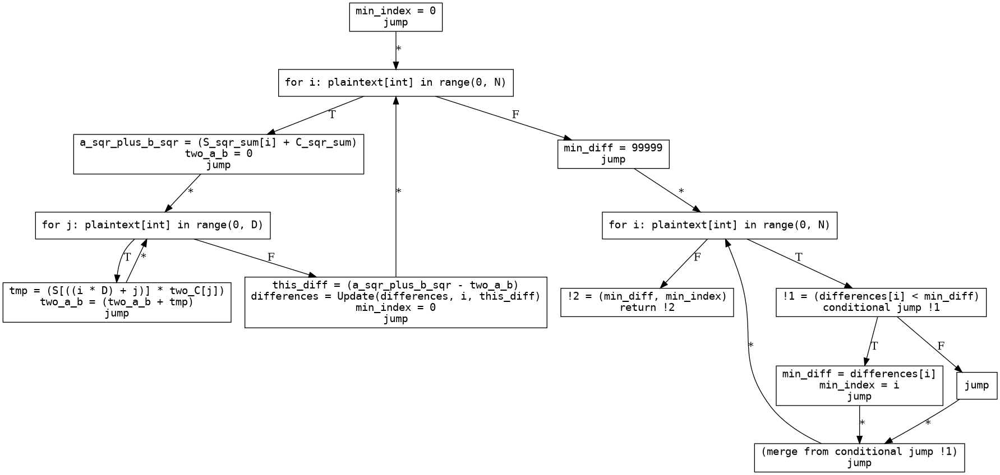
#### SSA
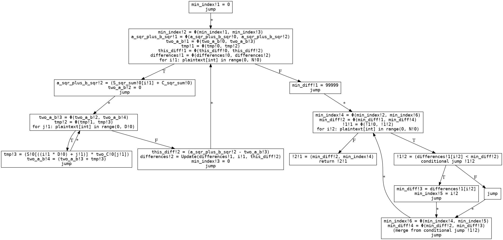
#### SSA ϕ→MUX
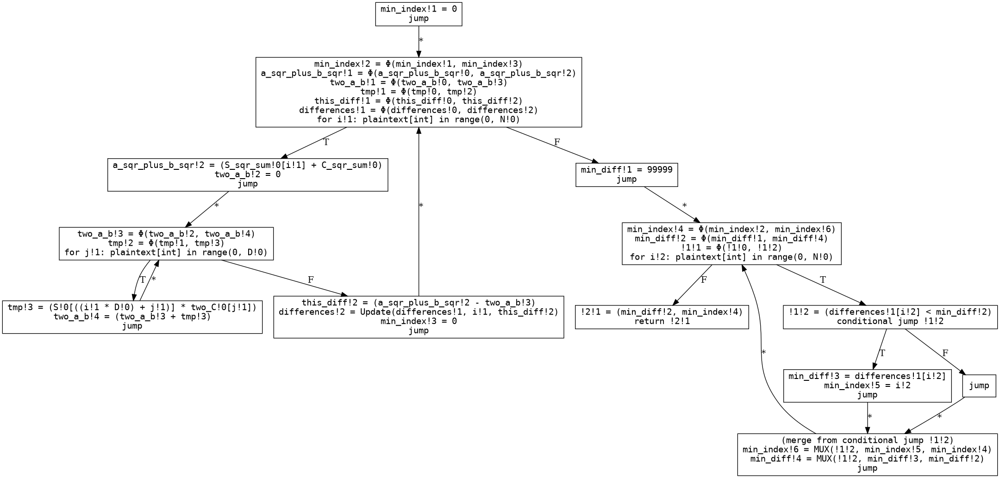
#### Dead code elimination
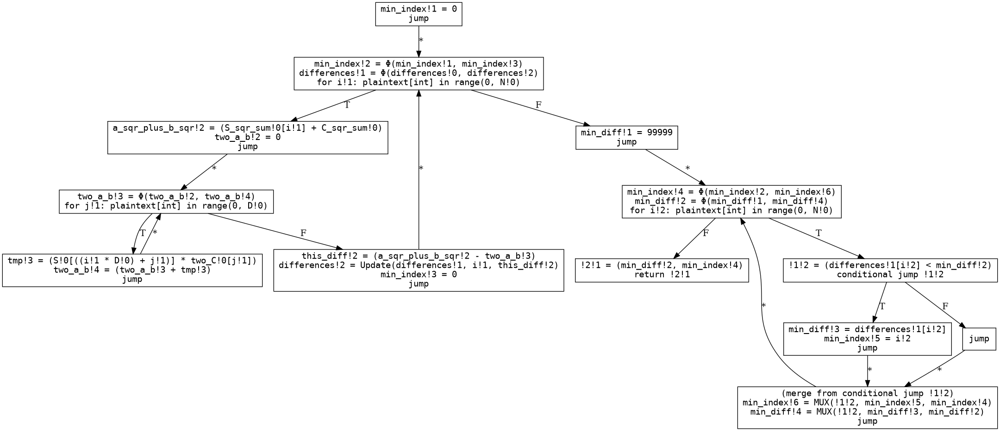
#### Linear code with loops
```python
def biometric_fast(D!0: plaintext[int], N!0: plaintext[int], C_sqr_sum!0: shared[int], two_C!0: shared[list[int; ?]], S!0: shared[list[int; ?]], S_sqr_sum!0: shared[list[int; ?]], differences!0: shared[list[int; ?]]) -> tuple[shared[int], shared[int]]:
    min_index!1 = 0
    for i!1 in range(0, N!0):
        min_index!2 = Φ(min_index!1, min_index!3)
        differences!1 = Φ(differences!0, differences!2)
        a_sqr_plus_b_sqr!2 = (S_sqr_sum!0[i!1] + C_sqr_sum!0)
        two_a_b!2 = 0
        for j!1 in range(0, D!0):
            two_a_b!3 = Φ(two_a_b!2, two_a_b!4)
            tmp!3 = (S!0[((i!1 * D!0) + j!1)] * two_C!0[j!1])
            two_a_b!4 = (two_a_b!3 + tmp!3)
        this_diff!2 = (a_sqr_plus_b_sqr!2 - two_a_b!3)
        differences!2 = Update(differences!1, i!1, this_diff!2)
        min_index!3 = 0
    min_diff!1 = 99999
    for i!2 in range(0, N!0):
        min_index!4 = Φ(min_index!2, min_index!6)
        min_diff!2 = Φ(min_diff!1, min_diff!4)
        !1!2 = (differences!1[i!2] < min_diff!2)
        min_diff!3 = differences!1[i!2]
        min_index!5 = i!2
        min_index!6 = MUX(!1!2, min_index!5, min_index!4)
        min_diff!4 = MUX(!1!2, min_diff!3, min_diff!2)
    !2!1 = (min_diff!2, min_index!4)
    return !2!1
```
#### Dependency graph
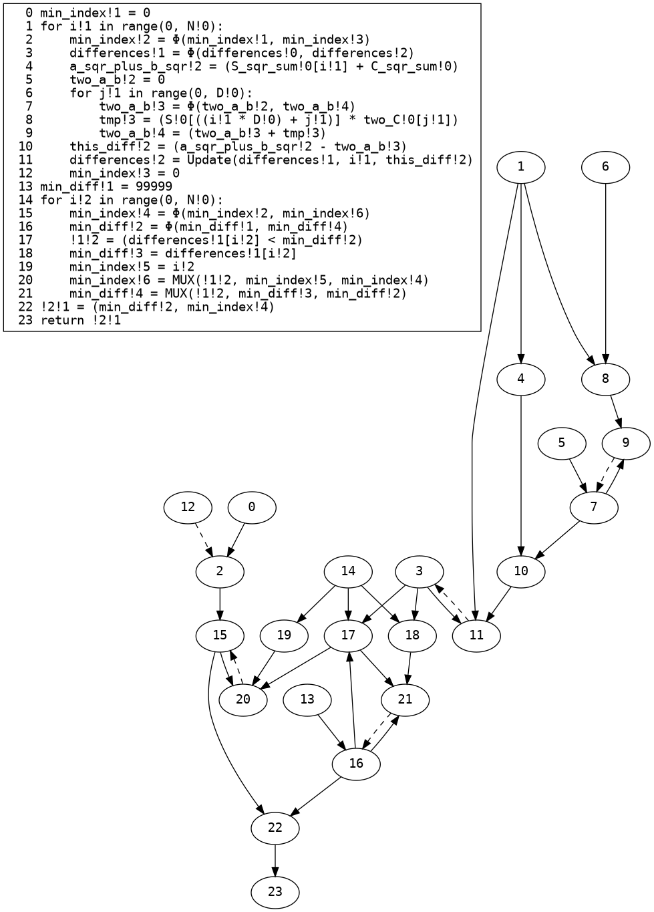
#### Removal of infeasible edges
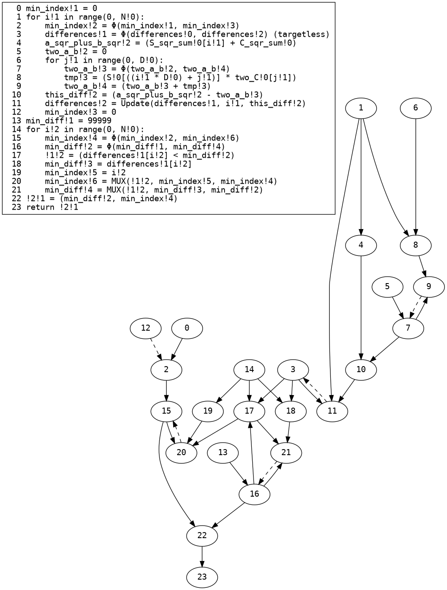
#### Type Environment Before Vectorization
| Variable | Type |
| - | - |
| `D!0` | `plaintext[int]` |
| `N!0` | `plaintext[int]` |
| `C_sqr_sum!0` | `shared[int]` |
| `two_C!0` | `shared[list[int; ?]]` |
| `S!0` | `shared[list[int; ?]]` |
| `S_sqr_sum!0` | `shared[list[int; ?]]` |
| `differences!0` | `shared[list[int; ?]]` |
| `i!1` | `plaintext[int]` |
| `j!1` | `plaintext[int]` |
| `i!2` | `plaintext[int]` |
| `!2!1` | `tuple[shared[int], shared[int]]` |
| `min_diff!4` | `shared[int]` |
| `min_diff!2` | `shared[int]` |
| `differences!1` | `shared[list[int; (N!0)]]` |
| `!1!2` | `shared[bool]` |
| `min_index!6` | `shared[int]` |
| `min_index!4` | `shared[int]` |
| `min_index!5` | `plaintext[int]` |
| `min_diff!3` | `shared[int]` |
| `min_diff!1` | `plaintext[int]` |
| `min_index!3` | `plaintext[int]` |
| `min_index!2` | `plaintext[int]` |
| `differences!2` | `shared[list[int; (N!0)]]` |
| `this_diff!2` | `shared[int]` |
| `two_a_b!4` | `shared[int]` |
| `two_a_b!3` | `shared[int]` |
| `tmp!3` | `shared[int]` |
| `two_a_b!2` | `plaintext[int]` |
| `a_sqr_plus_b_sqr!2` | `shared[int]` |
| `min_index!1` | `plaintext[int]` |
#### Basic Vectorization Phase 1
```python
def biometric_fast(D!0: plaintext[int], N!0: plaintext[int], C_sqr_sum!0: shared[int], two_C!0: shared[list[int; ?]], S!0: shared[list[int; ?]], S_sqr_sum!0: shared[list[int; ?]], differences!0: shared[list[int; ?]]) -> tuple[shared[int], shared[int]]:
    min_index!1 = 0
    !3!0{N!0}[] = lift(min_index!1, (i!1:N!0))
    !4!0{N!0}[] = lift(differences!0, (i!1:N!0))
    !5!0{N!0}[] = lift(S_sqr_sum!0[i!1], (i!1:N!0))
    !6!0{N!0}[] = lift(C_sqr_sum!0, (i!1:N!0))
    for i!1 in range(0, N!0):
        min_index!2{N!0}[] = Φ(!3!0{N!0}[], min_index!3)
        differences!1{N!0}[] = Φ(!4!0{N!0}[], differences!2{N!0}[]) (targetless)
        a_sqr_plus_b_sqr!2{N!0}[] = (!5!0{N!0}[] + !6!0{N!0}[])
        two_a_b!2 = 0
        !7!0{N!0, D!0}[] = lift(two_a_b!2, (i!1:N!0, j!1:D!0))
        !8!0{N!0, D!0}[] = lift(S!0[((i!1 * D!0) + j!1)], (i!1:N!0, j!1:D!0))
        !9!0{N!0, D!0}[] = lift(two_C!0[j!1], (i!1:N!0, j!1:D!0))
        for j!1 in range(0, D!0):
            two_a_b!3{N!0, D!0}[] = Φ(!7!0{N!0, D!0}[], two_a_b!4{N!0, D!0}[])
            tmp!3{N!0, D!0}[] = (!8!0{N!0, D!0}[] * !9!0{N!0, D!0}[])
            two_a_b!4{N!0, D!0}[] = (two_a_b!3{N!0, D!0}[] + tmp!3{N!0, D!0}[])
        !10!0{N!0}[] = drop_dim(two_a_b!4{N!0, D!0}[])
        this_diff!2{N!0}[] = (a_sqr_plus_b_sqr!2{N!0}[] - !10!0{N!0}[])
        differences!2{N!0}[] = VectorizedUpdate(differences!1{N!0}[], [I!1], this_diff!2{N!0}[])
        min_index!3 = 0
    min_diff!1 = 99999
    !11!0{N!0}[] = lift(min_diff!1, (i!2:N!0))
    for i!2 in range(0, N!0):
        min_index!4{N!0}[] = Φ(min_index!2{N!0}[], min_index!6{N!0}[])
        min_diff!2{N!0}[] = Φ(!11!0{N!0}[], min_diff!4{N!0}[])
        !1!2{N!0}[] = (differences!1{N!0}[] < min_diff!2{N!0}[])
        min_diff!3{N!0}[] = differences!1{N!0}[]
        min_index!5 = i!2
        min_index!6{N!0}[] = MUX(!1!2{N!0}[], min_index!5, min_index!4{N!0}[])
        min_diff!4{N!0}[] = MUX(!1!2{N!0}[], min_diff!3{N!0}[], min_diff!2{N!0}[])
    !12!0 = drop_dim(min_diff!4{N!0}[])
    !13!0 = drop_dim(min_index!6{N!0}[])
    !2!1 = (!12!0, !13!0)
    return !2!1
```
#### Basic Vectorization Phase 1 (dependence graph)
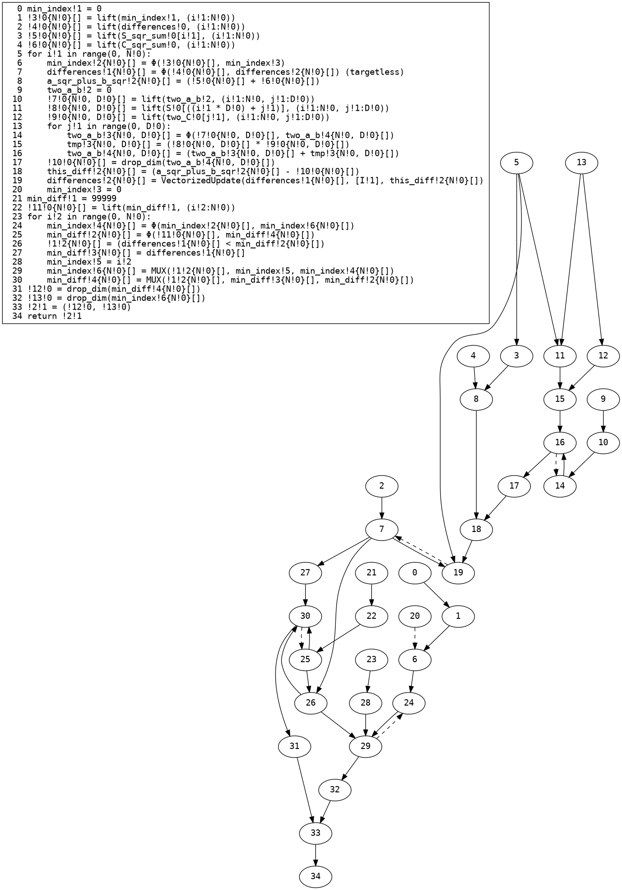
#### Basic Vectorization Phase 2
```python
def biometric_fast(D!0: plaintext[int], N!0: plaintext[int], C_sqr_sum!0: shared[int], two_C!0: shared[list[int; ?]], S!0: shared[list[int; ?]], S_sqr_sum!0: shared[list[int; ?]], differences!0: shared[list[int; ?]]) -> tuple[shared[int], shared[int]]:
    min_index!1 = 0
    !4!0{N!0}[] = lift(differences!0, (i!1:N!0))
    !5!0{N!0}[] = lift(S_sqr_sum!0[i!1], (i!1:N!0))
    !6!0{N!0}[] = lift(C_sqr_sum!0, (i!1:N!0))
    two_a_b!2 = 0
    !8!0{N!0, D!0}[] = lift(S!0[((i!1 * D!0) + j!1)], (i!1:N!0, j!1:D!0))
    !9!0{N!0, D!0}[] = lift(two_C!0[j!1], (i!1:N!0, j!1:D!0))
    min_index!3 = 0
    min_diff!1 = 99999
    !16!0{N!0}[] = lift(i!2, (i!2:N!0))
    !3!0{N!0}[] = lift(min_index!1, (i!1:N!0))
    a_sqr_plus_b_sqr!2{N!0}[] = (!5!0{N!0}[] + !6!0{N!0}[])
    !7!0{N!0, D!0}[] = lift(two_a_b!2, (i!1:N!0, j!1:D!0))
    tmp!3{N!0, D!0}[] = (!8!0{N!0, D!0}[] * !9!0{N!0, D!0}[])
    !11!0{N!0}[] = lift(min_diff!1, (i!2:N!0))
    for !15!0 in range(0, N!0): (monolithic)
        min_index!2{}[!15!0] = Φ(!3!0{}[!15!0], min_index!3)
    for !14!0 in range(0, D!0): (monolithic)
        two_a_b!3{N!0}[!14!0] = Φ(!7!0{N!0}[!14!0], two_a_b!4{N!0}[(!14!0 - 1)])
        two_a_b!4{N!0}[!14!0] = (two_a_b!3{N!0}[!14!0] + tmp!3{N!0}[!14!0])
    !10!0{N!0}[] = drop_dim(two_a_b!4{N!0, D!0}[])
    this_diff!2{N!0}[] = (a_sqr_plus_b_sqr!2{N!0}[] - !10!0{N!0}[])
    differences!2{N!0}[] = VectorizedUpdate(!4!0{N!0}[], [I!1], this_diff!2{N!0}[])
    min_diff!3{N!0}[] = differences!2{N!0}[]
    for !17!0 in range(0, N!0): (monolithic)
        min_diff!2{}[!17!0] = Φ(!11!0{}[!17!0], min_diff!4{}[(!17!0 - 1)])
        !1!2{}[!17!0] = (differences!2{}[!17!0] < min_diff!2{}[!17!0])
        min_diff!4{}[!17!0] = MUX(!1!2{}[!17!0], min_diff!3{}[!17!0], min_diff!2{}[!17!0])
    for !18!0 in range(0, N!0): (monolithic)
        min_index!4{}[!18!0] = Φ(min_index!2{}[!18!0], min_index!6{}[(!18!0 - 1)])
        min_index!6{}[!18!0] = MUX(!1!2{}[!18!0], !16!0{}[!18!0], min_index!4{}[!18!0])
    !12!0 = drop_dim(min_diff!4{N!0}[])
    !13!0 = drop_dim(min_index!6{N!0}[])
    !2!1 = (!12!0, !13!0)
    return !2!1
```
#### Basic Vectorization Phase 2 (dependence graph)
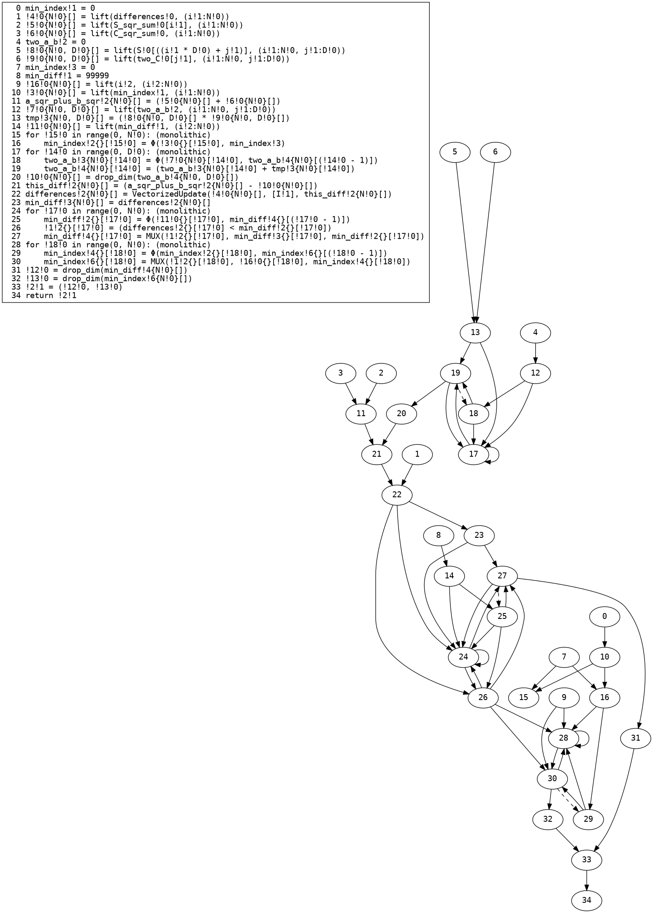
#### Type Environment After Vectorization
| Variable | Type |
| - | - |
| `D!0` | `plaintext[int]` |
| `N!0` | `plaintext[int]` |
| `C_sqr_sum!0` | `shared[int]` |
| `two_C!0` | `shared[list[int; ?]]` |
| `S!0` | `shared[list[int; ?]]` |
| `S_sqr_sum!0` | `shared[list[int; ?]]` |
| `differences!0` | `shared[list[int; ?]]` |
| `!15!0` | `plaintext[int]` |
| `!14!0` | `plaintext[int]` |
| `!17!0` | `plaintext[int]` |
| `!18!0` | `plaintext[int]` |
| `!2!1` | `tuple[shared[int], shared[int]]` |
| `!13!0` | `shared[int]` |
| `!12!0` | `shared[int]` |
| `min_index!6` | `shared[list[int; (N!0)]]` |
| `min_index!4` | `shared[list[int; (N!0)]]` |
| `min_diff!4` | `shared[list[int; (N!0)]]` |
| `min_diff!2` | `shared[list[int; (N!0)]]` |
| `!1!2` | `shared[list[bool; (N!0)]]` |
| `min_diff!3` | `shared[list[int; (N!0)]]` |
| `differences!2` | `shared[list[int; (N!0)]]` |
| `this_diff!2` | `shared[list[int; (N!0)]]` |
| `!10!0` | `shared[list[int; (N!0)]]` |
| `two_a_b!4` | `shared[list[list[int; (N!0)]; (D!0)]]` |
| `two_a_b!3` | `shared[list[list[int; (N!0)]; (D!0)]]` |
| `min_index!2` | `shared[list[int; (N!0)]]` |
| `!11!0` | `shared[list[int; (N!0)]]` |
| `tmp!3` | `shared[list[list[int; (N!0)]; (D!0)]]` |
| `!7!0` | `shared[list[list[int; (N!0)]; (D!0)]]` |
| `a_sqr_plus_b_sqr!2` | `shared[list[int; (N!0)]]` |
| `!3!0` | `shared[list[int; (N!0)]]` |
| `!16!0` | `shared[list[int; (N!0)]]` |
| `min_diff!1` | `plaintext[int]` |
| `min_index!3` | `plaintext[int]` |
| `!9!0` | `shared[list[list[int; (N!0)]; (D!0)]]` |
| `!8!0` | `shared[list[list[int; (N!0)]; (D!0)]]` |
| `two_a_b!2` | `plaintext[int]` |
| `!6!0` | `shared[list[int; (N!0)]]` |
| `!5!0` | `shared[list[int; (N!0)]]` |
| `!4!0` | `shared[list[int; (N!0)]]` |
| `min_index!1` | `plaintext[int]` |
#### Copy propagation
```python
def biometric_fast(D!0: plaintext[int], N!0: plaintext[int], C_sqr_sum!0: shared[int], two_C!0: shared[list[int; ?]], S!0: shared[list[int; ?]], S_sqr_sum!0: shared[list[int; ?]], differences!0: shared[list[int; ?]]) -> tuple[shared[int], shared[int]]:
    min_index!1 = 0
    !4!0{N!0}[] = lift(differences!0, (i!1:N!0))
    !5!0{N!0}[] = lift(S_sqr_sum!0[i!1], (i!1:N!0))
    !6!0{N!0}[] = lift(C_sqr_sum!0, (i!1:N!0))
    two_a_b!2 = 0
    !8!0{N!0, D!0}[] = lift(S!0[((i!1 * D!0) + j!1)], (i!1:N!0, j!1:D!0))
    !9!0{N!0, D!0}[] = lift(two_C!0[j!1], (i!1:N!0, j!1:D!0))
    min_index!3 = 0
    min_diff!1 = 99999
    !16!0{N!0}[] = lift(i!2, (i!2:N!0))
    !3!0{N!0}[] = lift(min_index!1, (i!1:N!0))
    a_sqr_plus_b_sqr!2{N!0}[] = (!5!0{N!0}[] + !6!0{N!0}[])
    !7!0{N!0, D!0}[] = lift(two_a_b!2, (i!1:N!0, j!1:D!0))
    tmp!3{N!0, D!0}[] = (!8!0{N!0, D!0}[] * !9!0{N!0, D!0}[])
    !11!0{N!0}[] = lift(min_diff!1, (i!2:N!0))
    for !15!0 in range(0, N!0): (monolithic)
        min_index!2{}[!15!0] = Φ(!3!0{}[!15!0], min_index!3)
    for !14!0 in range(0, D!0): (monolithic)
        two_a_b!3{N!0}[!14!0] = Φ(!7!0{N!0}[!14!0], two_a_b!4{N!0}[(!14!0 - 1)])
        two_a_b!4{N!0}[!14!0] = (two_a_b!3{N!0}[!14!0] + tmp!3{N!0}[!14!0])
    !10!0{N!0}[] = drop_dim(two_a_b!4{N!0, D!0}[])
    this_diff!2{N!0}[] = (a_sqr_plus_b_sqr!2{N!0}[] - !10!0{N!0}[])
    differences!2{N!0}[] = VectorizedUpdate(!4!0{N!0}[], [I!1], this_diff!2{N!0}[])
    for !17!0 in range(0, N!0): (monolithic)
        min_diff!2{}[!17!0] = Φ(!11!0{}[!17!0], min_diff!4{}[(!17!0 - 1)])
        !1!2{}[!17!0] = (differences!2{}[!17!0] < min_diff!2{}[!17!0])
        min_diff!4{}[!17!0] = MUX(!1!2{}[!17!0], differences!2{}[!17!0], min_diff!2{}[!17!0])
    for !18!0 in range(0, N!0): (monolithic)
        min_index!4{}[!18!0] = Φ(min_index!2{}[!18!0], min_index!6{}[(!18!0 - 1)])
        min_index!6{}[!18!0] = MUX(!1!2{}[!18!0], !16!0{}[!18!0], min_index!4{}[!18!0])
    !12!0 = drop_dim(min_diff!4{N!0}[])
    !13!0 = drop_dim(min_index!6{N!0}[])
    !2!1 = (!12!0, !13!0)
    return !2!1
```
#### Common subexpression elimination
```python
def biometric_fast(D!0: plaintext[int], N!0: plaintext[int], C_sqr_sum!0: shared[int], two_C!0: shared[list[int; ?]], S!0: shared[list[int; ?]], S_sqr_sum!0: shared[list[int; ?]], differences!0: shared[list[int; ?]]) -> tuple[shared[int], shared[int]]:
    min_index!1 = 0
    !4!0{N!0}[] = lift(differences!0, (i!1:N!0))
    !5!0{N!0}[] = lift(S_sqr_sum!0[i!1], (i!1:N!0))
    !6!0{N!0}[] = lift(C_sqr_sum!0, (i!1:N!0))
    two_a_b!2 = 0
    !8!0{N!0, D!0}[] = lift(S!0[((i!1 * D!0) + j!1)], (i!1:N!0, j!1:D!0))
    !9!0{N!0, D!0}[] = lift(two_C!0[j!1], (i!1:N!0, j!1:D!0))
    min_index!3 = 0
    min_diff!1 = 99999
    !16!0{N!0}[] = lift(i!2, (i!2:N!0))
    !3!0{N!0}[] = lift(min_index!1, (i!1:N!0))
    a_sqr_plus_b_sqr!2{N!0}[] = (!5!0{N!0}[] + !6!0{N!0}[])
    !7!0{N!0, D!0}[] = lift(two_a_b!2, (i!1:N!0, j!1:D!0))
    tmp!3{N!0, D!0}[] = (!8!0{N!0, D!0}[] * !9!0{N!0, D!0}[])
    !11!0{N!0}[] = lift(min_diff!1, (i!2:N!0))
    for !15!0 in range(0, N!0): (monolithic)
        min_index!2{}[!15!0] = Φ(!3!0{}[!15!0], min_index!3)
    for !14!0 in range(0, D!0): (monolithic)
        two_a_b!3{N!0}[!14!0] = Φ(!7!0{N!0}[!14!0], two_a_b!4{N!0}[(!14!0 - 1)])
        two_a_b!4{N!0}[!14!0] = (two_a_b!3{N!0}[!14!0] + tmp!3{N!0}[!14!0])
    !10!0{N!0}[] = drop_dim(two_a_b!4{N!0, D!0}[])
    this_diff!2{N!0}[] = (a_sqr_plus_b_sqr!2{N!0}[] - !10!0{N!0}[])
    differences!2{N!0}[] = VectorizedUpdate(!4!0{N!0}[], [I!1], this_diff!2{N!0}[])
    for !17!0 in range(0, N!0): (monolithic)
        min_diff!2{}[!17!0] = Φ(!11!0{}[!17!0], min_diff!4{}[(!17!0 - 1)])
        !1!2{}[!17!0] = (differences!2{}[!17!0] < min_diff!2{}[!17!0])
        min_diff!4{}[!17!0] = MUX(!1!2{}[!17!0], differences!2{}[!17!0], min_diff!2{}[!17!0])
    for !18!0 in range(0, N!0): (monolithic)
        min_index!4{}[!18!0] = Φ(min_index!2{}[!18!0], min_index!6{}[(!18!0 - 1)])
        min_index!6{}[!18!0] = MUX(!1!2{}[!18!0], !16!0{}[!18!0], min_index!4{}[!18!0])
    !12!0 = drop_dim(min_diff!4{N!0}[])
    !13!0 = drop_dim(min_index!6{N!0}[])
    !2!1 = (!12!0, !13!0)
    return !2!1
```
#### MOTION mixed configuration
```Total cost:	0.20481
Input vars:	{two_C!0: ['A'], S!0: ['A'], C_sqr_sum!0: ['A'], S_sqr_sum!0: ['A'], differences!0: ['A']}
Constants:	{0: ['A', 'Y'], 99999: ['Y']}
Plaintext vars:	{}
Flags:		{}
min_index!1 = 0: _ -> ['Y'] for 0.00000 * 1 = 0.00
!4!0{N!0}[] = lift(differences!0, (i!1:N!0)): _ -> ['A'] for 0.00000 * 1 = 0.00
!5!0{N!0}[] = lift(S_sqr_sum!0[i!1], (i!1:N!0)): _ -> ['A'] for 0.00000 * 1 = 0.00
!6!0{N!0}[] = lift(C_sqr_sum!0, (i!1:N!0)): _ -> ['A'] for 0.00000 * 1 = 0.00
two_a_b!2 = 0: _ -> ['A'] for 0.00000 * 1 = 0.00
!8!0{N!0, D!0}[] = lift(S!0[((i!1 * D!0) + j!1)], (i!1:N!0, j!1:D!0)): _ -> ['A'] for 0.00000 * 1 = 0.00
!9!0{N!0, D!0}[] = lift(two_C!0[j!1], (i!1:N!0, j!1:D!0)): _ -> ['A'] for 0.00000 * 1 = 0.00
min_index!3 = 0: _ -> ['Y'] for 0.00000 * 1 = 0.00
min_diff!1 = 99999: _ -> ['Y'] for 0.00000 * 1 = 0.00
!16!0{N!0}[] = lift(i!2, (i!2:N!0)): _ -> ['Y'] for 0.00000 * 1 = 0.00
!3!0{N!0}[] = lift(min_index!1, (i!1:N!0)): _ -> ['Y'] for 0.00000 * 1 = 0.00
a_sqr_plus_b_sqr!2{N!0}[] = (!5!0{N!0}[] + !6!0{N!0}[]): A -> {} for 0.00000 * 1 = 0.00
!7!0{N!0, D!0}[] = lift(two_a_b!2, (i!1:N!0, j!1:D!0)): _ -> ['A'] for 0.00000 * 1 = 0.00
tmp!3{N!0, D!0}[] = (!8!0{N!0, D!0}[] * !9!0{N!0, D!0}[]): A -> {} for 0.00716 * 1 = 0.01
!11!0{N!0}[] = lift(min_diff!1, (i!2:N!0)): _ -> ['Y'] for 0.00000 * 1 = 0.00
	min_index!2{}[!15!0] = Φ(!3!0{}[!15!0], min_index!3): Y -> {} for 0.00000 * 4 = 0.00
	two_a_b!3{N!0}[!14!0] = Φ(!7!0{N!0}[!14!0], two_a_b!4{N!0}[(!14!0 - 1)]): A -> {} for 0.00000 * 4 = 0.00
	two_a_b!4{N!0}[!14!0] = (two_a_b!3{N!0}[!14!0] + tmp!3{N!0}[!14!0]): A -> {} for 0.00000 * 4 = 0.00
!10!0{N!0}[] = drop_dim(two_a_b!4{N!0, D!0}[]): _ -> ['A'] for 0.00000 * 1 = 0.00
this_diff!2{N!0}[] = (a_sqr_plus_b_sqr!2{N!0}[] - !10!0{N!0}[]): A -> {} for 0.00016 * 1 = 0.00
differences!2{N!0}[] = VectorizedUpdate(!4!0{N!0}[], [I!1], this_diff!2{N!0}[]): A -> ['Y'] for 0.03052 * 1 = 0.03 (A->Y)
	min_diff!2{}[!17!0] = Φ(!11!0{}[!17!0], min_diff!4{}[(!17!0 - 1)]): Y -> {} for 0.00000 * 4 = 0.00
	!1!2{}[!17!0] = (differences!2{}[!17!0] < min_diff!2{}[!17!0]): Y -> {} for 0.02979 * 4 = 0.12
	min_diff!4{}[!17!0] = MUX(!1!2{}[!17!0], differences!2{}[!17!0], min_diff!2{}[!17!0]): Y -> {} for 0.00597 * 4 = 0.02
	min_index!4{}[!18!0] = Φ(min_index!2{}[!18!0], min_index!6{}[(!18!0 - 1)]): Y -> {} for 0.00000 * 4 = 0.00
	min_index!6{}[!18!0] = MUX(!1!2{}[!18!0], !16!0{}[!18!0], min_index!4{}[!18!0]): Y -> {} for 0.00597 * 4 = 0.02
!12!0 = drop_dim(min_diff!4{N!0}[]): _ -> ['Y'] for 0.00000 * 1 = 0.00
!13!0 = drop_dim(min_index!6{N!0}[]): _ -> ['Y'] for 0.00000 * 1 = 0.00
!2!1 = (!12!0, !13!0)
return !2!1
Output vars:	{!13!0: ['Y'], !12!0: ['Y']}

```
#### MOTION code
```cpp
template <encrypto::motion::MpcProtocol Protocol>
std::tuple<encrypto::motion::SecureUnsignedInteger, encrypto::motion::SecureUnsignedInteger> biometric_fast(
    encrypto::motion::PartyPointer &party,
    std::uint32_t _MPC_PLAINTEXT_D_0,
    std::uint32_t _MPC_PLAINTEXT_N_0,
    encrypto::motion::SecureUnsignedInteger C_sqr_sum_0,
    std::vector<encrypto::motion::SecureUnsignedInteger> two_C_0,
    std::vector<encrypto::motion::SecureUnsignedInteger> S_0,
    std::vector<encrypto::motion::SecureUnsignedInteger> S_sqr_sum_0,
    std::vector<encrypto::motion::SecureUnsignedInteger> differences_0
) {
    // Shared variable declarations
    std::vector<encrypto::motion::ShareWrapper> _1_2((_MPC_PLAINTEXT_N_0));
    std::vector<encrypto::motion::SecureUnsignedInteger> _10_0((_MPC_PLAINTEXT_N_0));
    std::vector<encrypto::motion::SecureUnsignedInteger> _11_0((_MPC_PLAINTEXT_N_0));
    encrypto::motion::SecureUnsignedInteger _12_0;
    encrypto::motion::SecureUnsignedInteger _13_0;
    encrypto::motion::SecureUnsignedInteger _14_0;
    encrypto::motion::SecureUnsignedInteger _15_0;
    std::vector<encrypto::motion::SecureUnsignedInteger> _16_0((_MPC_PLAINTEXT_N_0));
    encrypto::motion::SecureUnsignedInteger _17_0;
    encrypto::motion::SecureUnsignedInteger _18_0;
    std::tuple<encrypto::motion::SecureUnsignedInteger, encrypto::motion::SecureUnsignedInteger> _2_1;
    std::vector<encrypto::motion::SecureUnsignedInteger> _3_0((_MPC_PLAINTEXT_N_0));
    std::vector<encrypto::motion::SecureUnsignedInteger> _4_0((_MPC_PLAINTEXT_N_0));
    std::vector<encrypto::motion::SecureUnsignedInteger> _5_0((_MPC_PLAINTEXT_N_0));
    std::vector<encrypto::motion::SecureUnsignedInteger> _6_0((_MPC_PLAINTEXT_N_0));
    std::vector<encrypto::motion::SecureUnsignedInteger> _7_0((_MPC_PLAINTEXT_N_0) * (_MPC_PLAINTEXT_D_0));
    std::vector<encrypto::motion::SecureUnsignedInteger> _8_0((_MPC_PLAINTEXT_N_0) * (_MPC_PLAINTEXT_D_0));
    std::vector<encrypto::motion::SecureUnsignedInteger> _9_0((_MPC_PLAINTEXT_N_0) * (_MPC_PLAINTEXT_D_0));
    encrypto::motion::SecureUnsignedInteger D_0;
    encrypto::motion::SecureUnsignedInteger N_0;
    std::vector<encrypto::motion::SecureUnsignedInteger> a_sqr_plus_b_sqr_2((_MPC_PLAINTEXT_N_0));
    std::vector<encrypto::motion::SecureUnsignedInteger> differences_2((_MPC_PLAINTEXT_N_0));
    encrypto::motion::SecureUnsignedInteger min_diff_1;
    std::vector<encrypto::motion::SecureUnsignedInteger> min_diff_2((_MPC_PLAINTEXT_N_0));
    std::vector<encrypto::motion::SecureUnsignedInteger> min_diff_4((_MPC_PLAINTEXT_N_0));
    encrypto::motion::SecureUnsignedInteger min_index_1;
    std::vector<encrypto::motion::SecureUnsignedInteger> min_index_2((_MPC_PLAINTEXT_N_0));
    encrypto::motion::SecureUnsignedInteger min_index_3;
    std::vector<encrypto::motion::SecureUnsignedInteger> min_index_4((_MPC_PLAINTEXT_N_0));
    std::vector<encrypto::motion::SecureUnsignedInteger> min_index_6((_MPC_PLAINTEXT_N_0));
    std::vector<encrypto::motion::SecureUnsignedInteger> this_diff_2((_MPC_PLAINTEXT_N_0));
    std::vector<encrypto::motion::SecureUnsignedInteger> tmp_3((_MPC_PLAINTEXT_N_0) * (_MPC_PLAINTEXT_D_0));
    encrypto::motion::SecureUnsignedInteger two_a_b_2;
    std::vector<encrypto::motion::SecureUnsignedInteger> two_a_b_3((_MPC_PLAINTEXT_N_0) * (_MPC_PLAINTEXT_D_0));
    std::vector<encrypto::motion::SecureUnsignedInteger> two_a_b_4((_MPC_PLAINTEXT_N_0) * (_MPC_PLAINTEXT_D_0));

    // Plaintext variable declarations
    std::uint32_t _MPC_PLAINTEXT__14_0;
    std::uint32_t _MPC_PLAINTEXT__15_0;
    std::uint32_t _MPC_PLAINTEXT__17_0;
    std::uint32_t _MPC_PLAINTEXT__18_0;
    std::tuple<std::uint32_t, std::uint32_t> _MPC_PLAINTEXT__2_1;
    std::uint32_t _MPC_PLAINTEXT_min_diff_1;
    std::uint32_t _MPC_PLAINTEXT_min_index_1;
    std::uint32_t _MPC_PLAINTEXT_min_index_3;
    std::uint32_t _MPC_PLAINTEXT_two_a_b_2;

    // Constant initializations
    encrypto::motion::SecureUnsignedInteger _MPC_CONSTANT_0 = party->In<Protocol>(encrypto::motion::ToInput(std::uint32_t(0)), 0);
    encrypto::motion::SecureUnsignedInteger _MPC_CONSTANT_99999 = party->In<Protocol>(encrypto::motion::ToInput(std::uint32_t(99999)), 0);

    // Plaintext parameter assignments
    D_0 = party->In<Protocol>(encrypto::motion::ToInput(_MPC_PLAINTEXT_D_0), 0);
    N_0 = party->In<Protocol>(encrypto::motion::ToInput(_MPC_PLAINTEXT_N_0), 0);

    // Function body
    min_index_1 = _MPC_CONSTANT_0;
    _MPC_PLAINTEXT_min_index_1 = std::uint32_t(0);
    vectorized_assign(_4_0, {_MPC_PLAINTEXT_N_0}, {true}, {}, lift(std::function([&](const std::vector<std::uint32_t> &indices){return differences_0;}), {_MPC_PLAINTEXT_N_0}));
    vectorized_assign(_5_0, {_MPC_PLAINTEXT_N_0}, {true}, {}, lift(std::function([&](const std::vector<std::uint32_t> &indices){return S_sqr_sum_0[indices[0]];}), {_MPC_PLAINTEXT_N_0}));
    vectorized_assign(_6_0, {_MPC_PLAINTEXT_N_0}, {true}, {}, lift(std::function([&](const std::vector<std::uint32_t> &indices){return C_sqr_sum_0;}), {_MPC_PLAINTEXT_N_0}));
    two_a_b_2 = _MPC_CONSTANT_0;
    _MPC_PLAINTEXT_two_a_b_2 = std::uint32_t(0);
    vectorized_assign(_8_0, {_MPC_PLAINTEXT_N_0, _MPC_PLAINTEXT_D_0}, {true, true}, {}, lift(std::function([&](const std::vector<std::uint32_t> &indices){return S_0[((indices[0] * _MPC_PLAINTEXT_D_0) + indices[1])];}), {_MPC_PLAINTEXT_N_0, _MPC_PLAINTEXT_D_0}));
    vectorized_assign(_9_0, {_MPC_PLAINTEXT_N_0, _MPC_PLAINTEXT_D_0}, {true, true}, {}, lift(std::function([&](const std::vector<std::uint32_t> &indices){return two_C_0[indices[1]];}), {_MPC_PLAINTEXT_N_0, _MPC_PLAINTEXT_D_0}));
    min_index_3 = _MPC_CONSTANT_0;
    _MPC_PLAINTEXT_min_index_3 = std::uint32_t(0);
    min_diff_1 = _MPC_CONSTANT_99999;
    _MPC_PLAINTEXT_min_diff_1 = std::uint32_t(99999);
    vectorized_assign(_16_0, {_MPC_PLAINTEXT_N_0}, {true}, {}, lift(std::function([&](const std::vector<std::uint32_t> &indices){return encrypto::motion::SecureUnsignedInteger(party->In<Protocol>(encrypto::motion::ToInput(indices[0]), 0));}), {_MPC_PLAINTEXT_N_0}));
    vectorized_assign(_3_0, {_MPC_PLAINTEXT_N_0}, {true}, {}, lift(std::function([&](const std::vector<std::uint32_t> &indices){return min_index_1;}), {_MPC_PLAINTEXT_N_0}));
    vectorized_assign(a_sqr_plus_b_sqr_2, {_MPC_PLAINTEXT_N_0}, {true}, {}, (vectorized_access(_5_0, {_MPC_PLAINTEXT_N_0}, {true}, {}) + vectorized_access(_6_0, {_MPC_PLAINTEXT_N_0}, {true}, {})));
    vectorized_assign(_7_0, {_MPC_PLAINTEXT_N_0, _MPC_PLAINTEXT_D_0}, {true, true}, {}, lift(std::function([&](const std::vector<std::uint32_t> &indices){return two_a_b_2;}), {_MPC_PLAINTEXT_N_0, _MPC_PLAINTEXT_D_0}));
    vectorized_assign(tmp_3, {_MPC_PLAINTEXT_N_0, _MPC_PLAINTEXT_D_0}, {true, true}, {}, (vectorized_access(_8_0, {_MPC_PLAINTEXT_N_0, _MPC_PLAINTEXT_D_0}, {true, true}, {}) * vectorized_access(_9_0, {_MPC_PLAINTEXT_N_0, _MPC_PLAINTEXT_D_0}, {true, true}, {})));
    vectorized_assign(_11_0, {_MPC_PLAINTEXT_N_0}, {true}, {}, lift(std::function([&](const std::vector<std::uint32_t> &indices){return min_diff_1;}), {_MPC_PLAINTEXT_N_0}));

    // Initialize loop counter
    _MPC_PLAINTEXT__15_0 = std::uint32_t(0);
    // Initialize phi values
    min_index_2[_MPC_PLAINTEXT__15_0] = _3_0[_MPC_PLAINTEXT__15_0];
    for (; _MPC_PLAINTEXT__15_0 < _MPC_PLAINTEXT_N_0; _MPC_PLAINTEXT__15_0++) {
        // Update phi values
        if (_MPC_PLAINTEXT__15_0 != std::uint32_t(0)) {
            min_index_2[_MPC_PLAINTEXT__15_0] = min_index_3;
        }


    }


    // Initialize loop counter
    _MPC_PLAINTEXT__14_0 = std::uint32_t(0);
    // Initialize phi values
    vectorized_assign(two_a_b_3, {_MPC_PLAINTEXT_N_0, _MPC_PLAINTEXT_D_0}, {true, false}, {_MPC_PLAINTEXT__14_0}, vectorized_access(_7_0, {_MPC_PLAINTEXT_N_0, _MPC_PLAINTEXT_D_0}, {true, false}, {_MPC_PLAINTEXT__14_0}));
    for (; _MPC_PLAINTEXT__14_0 < _MPC_PLAINTEXT_D_0; _MPC_PLAINTEXT__14_0++) {
        // Update phi values
        if (_MPC_PLAINTEXT__14_0 != std::uint32_t(0)) {
            vectorized_assign(two_a_b_3, {_MPC_PLAINTEXT_N_0, _MPC_PLAINTEXT_D_0}, {true, false}, {_MPC_PLAINTEXT__14_0}, vectorized_access(two_a_b_4, {_MPC_PLAINTEXT_N_0, _MPC_PLAINTEXT_D_0}, {true, false}, {(_MPC_PLAINTEXT__14_0 - std::uint32_t(1))}));
        }

        vectorized_assign(two_a_b_4, {_MPC_PLAINTEXT_N_0, _MPC_PLAINTEXT_D_0}, {true, false}, {_MPC_PLAINTEXT__14_0}, (vectorized_access(two_a_b_3, {_MPC_PLAINTEXT_N_0, _MPC_PLAINTEXT_D_0}, {true, false}, {_MPC_PLAINTEXT__14_0}) + vectorized_access(tmp_3, {_MPC_PLAINTEXT_N_0, _MPC_PLAINTEXT_D_0}, {true, false}, {_MPC_PLAINTEXT__14_0})));

    }

    vectorized_assign(_10_0, {_MPC_PLAINTEXT_N_0}, {true}, {}, drop_dim(vectorized_access(two_a_b_4, {_MPC_PLAINTEXT_N_0, _MPC_PLAINTEXT_D_0}, {true, true}, {}).Unsimdify(), {_MPC_PLAINTEXT_N_0, _MPC_PLAINTEXT_D_0}));
    vectorized_assign(this_diff_2, {_MPC_PLAINTEXT_N_0}, {true}, {}, (vectorized_access(a_sqr_plus_b_sqr_2, {_MPC_PLAINTEXT_N_0}, {true}, {}) - vectorized_access(_10_0, {_MPC_PLAINTEXT_N_0}, {true}, {})));
    vectorized_assign(differences_2, {_MPC_PLAINTEXT_N_0}, {true}, {}, vectorized_update(_4_0, {_MPC_PLAINTEXT_N_0}, {true}, {}, vectorized_access(this_diff_2, {_MPC_PLAINTEXT_N_0}, {true}, {})));

    // Initialize loop counter
    _MPC_PLAINTEXT__17_0 = std::uint32_t(0);
    // Initialize phi values
    min_diff_2[_MPC_PLAINTEXT__17_0] = _11_0[_MPC_PLAINTEXT__17_0];
    for (; _MPC_PLAINTEXT__17_0 < _MPC_PLAINTEXT_N_0; _MPC_PLAINTEXT__17_0++) {
        // Update phi values
        if (_MPC_PLAINTEXT__17_0 != std::uint32_t(0)) {
            min_diff_2[_MPC_PLAINTEXT__17_0] = min_diff_4[(_MPC_PLAINTEXT__17_0 - std::uint32_t(1))];
        }

        _1_2[_MPC_PLAINTEXT__17_0] = (min_diff_2[_MPC_PLAINTEXT__17_0] > differences_2[_MPC_PLAINTEXT__17_0]);
        min_diff_4[_MPC_PLAINTEXT__17_0] = _1_2[_MPC_PLAINTEXT__17_0].Mux(differences_2[_MPC_PLAINTEXT__17_0].Get(), min_diff_2[_MPC_PLAINTEXT__17_0].Get());

    }


    // Initialize loop counter
    _MPC_PLAINTEXT__18_0 = std::uint32_t(0);
    // Initialize phi values
    min_index_4[_MPC_PLAINTEXT__18_0] = min_index_2[_MPC_PLAINTEXT__18_0];
    for (; _MPC_PLAINTEXT__18_0 < _MPC_PLAINTEXT_N_0; _MPC_PLAINTEXT__18_0++) {
        // Update phi values
        if (_MPC_PLAINTEXT__18_0 != std::uint32_t(0)) {
            min_index_4[_MPC_PLAINTEXT__18_0] = min_index_6[(_MPC_PLAINTEXT__18_0 - std::uint32_t(1))];
        }

        min_index_6[_MPC_PLAINTEXT__18_0] = _1_2[_MPC_PLAINTEXT__18_0].Mux(_16_0[_MPC_PLAINTEXT__18_0].Get(), min_index_4[_MPC_PLAINTEXT__18_0].Get());

    }

    _12_0 = drop_dim_monoreturn(vectorized_access(min_diff_4, {_MPC_PLAINTEXT_N_0}, {true}, {}).Unsimdify(), {_MPC_PLAINTEXT_N_0});
    _13_0 = drop_dim_monoreturn(vectorized_access(min_index_6, {_MPC_PLAINTEXT_N_0}, {true}, {}).Unsimdify(), {_MPC_PLAINTEXT_N_0});
    _2_1 = std::make_tuple(_12_0, _13_0);
    return _2_1;

}
```
#### MOTION mixed code
```cpp
std::tuple<encrypto::motion::SecureUnsignedInteger, encrypto::motion::SecureUnsignedInteger> biometric_fast(
    encrypto::motion::PartyPointer &party,
    std::uint32_t _MPC_PLAINTEXT_D_0,
    std::uint32_t _MPC_PLAINTEXT_N_0,
    encrypto::motion::SecureUnsignedInteger C_sqr_sum_0,
    std::vector<encrypto::motion::SecureUnsignedInteger> two_C_0,
    std::vector<encrypto::motion::SecureUnsignedInteger> S_0,
    std::vector<encrypto::motion::SecureUnsignedInteger> S_sqr_sum_0,
    std::vector<encrypto::motion::SecureUnsignedInteger> differences_0
) {
    // Shared variable declarations
    std::vector<encrypto::motion::ShareWrapper> _1_2((_MPC_PLAINTEXT_N_0));
    std::vector<encrypto::motion::SecureUnsignedInteger> _10_0((_MPC_PLAINTEXT_N_0));
    std::vector<encrypto::motion::SecureUnsignedInteger> _11_0((_MPC_PLAINTEXT_N_0));
    encrypto::motion::SecureUnsignedInteger _12_0;
    encrypto::motion::SecureUnsignedInteger _13_0;
    encrypto::motion::SecureUnsignedInteger _14_0;
    encrypto::motion::SecureUnsignedInteger _15_0;
    std::vector<encrypto::motion::SecureUnsignedInteger> _16_0((_MPC_PLAINTEXT_N_0));
    encrypto::motion::SecureUnsignedInteger _17_0;
    encrypto::motion::SecureUnsignedInteger _18_0;
    std::tuple<encrypto::motion::SecureUnsignedInteger, encrypto::motion::SecureUnsignedInteger> _2_1;
    std::vector<encrypto::motion::SecureUnsignedInteger> _3_0((_MPC_PLAINTEXT_N_0));
    std::vector<encrypto::motion::SecureUnsignedInteger> _4_0((_MPC_PLAINTEXT_N_0));
    std::vector<encrypto::motion::SecureUnsignedInteger> _5_0((_MPC_PLAINTEXT_N_0));
    std::vector<encrypto::motion::SecureUnsignedInteger> _6_0((_MPC_PLAINTEXT_N_0));
    std::vector<encrypto::motion::SecureUnsignedInteger> _7_0((_MPC_PLAINTEXT_N_0) * (_MPC_PLAINTEXT_D_0));
    std::vector<encrypto::motion::SecureUnsignedInteger> _8_0((_MPC_PLAINTEXT_N_0) * (_MPC_PLAINTEXT_D_0));
    std::vector<encrypto::motion::SecureUnsignedInteger> _9_0((_MPC_PLAINTEXT_N_0) * (_MPC_PLAINTEXT_D_0));
    encrypto::motion::SecureUnsignedInteger D_0;
    encrypto::motion::SecureUnsignedInteger N_0;
    std::vector<encrypto::motion::SecureUnsignedInteger> a_sqr_plus_b_sqr_2((_MPC_PLAINTEXT_N_0));
    std::vector<encrypto::motion::SecureUnsignedInteger> differences_2((_MPC_PLAINTEXT_N_0));
    encrypto::motion::SecureUnsignedInteger min_diff_1;
    std::vector<encrypto::motion::SecureUnsignedInteger> min_diff_2((_MPC_PLAINTEXT_N_0));
    std::vector<encrypto::motion::SecureUnsignedInteger> min_diff_4((_MPC_PLAINTEXT_N_0));
    encrypto::motion::SecureUnsignedInteger min_index_1;
    std::vector<encrypto::motion::SecureUnsignedInteger> min_index_2((_MPC_PLAINTEXT_N_0));
    encrypto::motion::SecureUnsignedInteger min_index_3;
    std::vector<encrypto::motion::SecureUnsignedInteger> min_index_4((_MPC_PLAINTEXT_N_0));
    std::vector<encrypto::motion::SecureUnsignedInteger> min_index_6((_MPC_PLAINTEXT_N_0));
    std::vector<encrypto::motion::SecureUnsignedInteger> this_diff_2((_MPC_PLAINTEXT_N_0));
    std::vector<encrypto::motion::SecureUnsignedInteger> tmp_3((_MPC_PLAINTEXT_N_0) * (_MPC_PLAINTEXT_D_0));
    encrypto::motion::SecureUnsignedInteger two_a_b_2;
    std::vector<encrypto::motion::SecureUnsignedInteger> two_a_b_3((_MPC_PLAINTEXT_N_0) * (_MPC_PLAINTEXT_D_0));
    std::vector<encrypto::motion::SecureUnsignedInteger> two_a_b_4((_MPC_PLAINTEXT_N_0) * (_MPC_PLAINTEXT_D_0));

    // Plaintext variable declarations
    std::uint32_t _MPC_PLAINTEXT__14_0;
    std::uint32_t _MPC_PLAINTEXT__15_0;
    std::uint32_t _MPC_PLAINTEXT__17_0;
    std::uint32_t _MPC_PLAINTEXT__18_0;
    std::tuple<std::uint32_t, std::uint32_t> _MPC_PLAINTEXT__2_1;
    std::uint32_t _MPC_PLAINTEXT_min_diff_1;
    std::uint32_t _MPC_PLAINTEXT_min_index_1;
    std::uint32_t _MPC_PLAINTEXT_min_index_3;
    std::uint32_t _MPC_PLAINTEXT_two_a_b_2;

    // Constant initializations
    encrypto::motion::SecureUnsignedInteger _MPC_CONSTANT_0 = party->In<encrypto::motion::MpcProtocol::kArithmeticGmw>(std::uint32_t(0), 0);
    encrypto::motion::SecureUnsignedInteger _MPC_CONSTANT_0_Y = party->In<encrypto::motion::MpcProtocol::kBmr>(encrypto::motion::ToInput(std::uint32_t(0)), 0);
    encrypto::motion::SecureUnsignedInteger _MPC_CONSTANT_99999 = party->In<encrypto::motion::MpcProtocol::kBmr>(encrypto::motion::ToInput(std::uint32_t(99999)), 0);

    // Input Protocol Convertions

    // Plaintext parameter assignments

    // Function body
    min_index_1 = _MPC_CONSTANT_0_Y;
    _MPC_PLAINTEXT_min_index_1 = std::uint32_t(0);
    vectorized_assign(_4_0, {_MPC_PLAINTEXT_N_0}, {true}, {}, lift(std::function([&](const std::vector<std::uint32_t> &indices){return differences_0;}), {_MPC_PLAINTEXT_N_0}));
    vectorized_assign(_5_0, {_MPC_PLAINTEXT_N_0}, {true}, {}, lift(std::function([&](const std::vector<std::uint32_t> &indices){return S_sqr_sum_0[indices[0]];}), {_MPC_PLAINTEXT_N_0}));
    vectorized_assign(_6_0, {_MPC_PLAINTEXT_N_0}, {true}, {}, lift(std::function([&](const std::vector<std::uint32_t> &indices){return C_sqr_sum_0;}), {_MPC_PLAINTEXT_N_0}));
    two_a_b_2 = _MPC_CONSTANT_0;
    _MPC_PLAINTEXT_two_a_b_2 = std::uint32_t(0);
    vectorized_assign(_8_0, {_MPC_PLAINTEXT_N_0, _MPC_PLAINTEXT_D_0}, {true, true}, {}, lift(std::function([&](const std::vector<std::uint32_t> &indices){return S_0[((indices[0] * _MPC_PLAINTEXT_D_0) + indices[1])];}), {_MPC_PLAINTEXT_N_0, _MPC_PLAINTEXT_D_0}));
    vectorized_assign(_9_0, {_MPC_PLAINTEXT_N_0, _MPC_PLAINTEXT_D_0}, {true, true}, {}, lift(std::function([&](const std::vector<std::uint32_t> &indices){return two_C_0[indices[1]];}), {_MPC_PLAINTEXT_N_0, _MPC_PLAINTEXT_D_0}));
    min_index_3 = _MPC_CONSTANT_0_Y;
    _MPC_PLAINTEXT_min_index_3 = std::uint32_t(0);
    min_diff_1 = _MPC_CONSTANT_99999;
    _MPC_PLAINTEXT_min_diff_1 = std::uint32_t(99999);
    vectorized_assign(_16_0, {_MPC_PLAINTEXT_N_0}, {true}, {}, lift(std::function([&](const std::vector<std::uint32_t> &indices){return encrypto::motion::SecureUnsignedInteger(party->In<encrypto::motion::MpcProtocol::kBmr>(encrypto::motion::ToInput(indices[0]), 0));}), {_MPC_PLAINTEXT_N_0}));
    vectorized_assign(_3_0, {_MPC_PLAINTEXT_N_0}, {true}, {}, lift(std::function([&](const std::vector<std::uint32_t> &indices){return min_index_1;}), {_MPC_PLAINTEXT_N_0}));
    vectorized_assign(a_sqr_plus_b_sqr_2, {_MPC_PLAINTEXT_N_0}, {true}, {}, (vectorized_access(_5_0, {_MPC_PLAINTEXT_N_0}, {true}, {}) + vectorized_access(_6_0, {_MPC_PLAINTEXT_N_0}, {true}, {})));
    vectorized_assign(_7_0, {_MPC_PLAINTEXT_N_0, _MPC_PLAINTEXT_D_0}, {true, true}, {}, lift(std::function([&](const std::vector<std::uint32_t> &indices){return two_a_b_2;}), {_MPC_PLAINTEXT_N_0, _MPC_PLAINTEXT_D_0}));
    vectorized_assign(tmp_3, {_MPC_PLAINTEXT_N_0, _MPC_PLAINTEXT_D_0}, {true, true}, {}, (vectorized_access(_8_0, {_MPC_PLAINTEXT_N_0, _MPC_PLAINTEXT_D_0}, {true, true}, {}) * vectorized_access(_9_0, {_MPC_PLAINTEXT_N_0, _MPC_PLAINTEXT_D_0}, {true, true}, {})));
    vectorized_assign(_11_0, {_MPC_PLAINTEXT_N_0}, {true}, {}, lift(std::function([&](const std::vector<std::uint32_t> &indices){return min_diff_1;}), {_MPC_PLAINTEXT_N_0}));

    // Initialize loop counter
    _MPC_PLAINTEXT__15_0 = std::uint32_t(0);
    // Initialize phi values
    min_index_2[_MPC_PLAINTEXT__15_0] = _3_0[_MPC_PLAINTEXT__15_0];
    for (; _MPC_PLAINTEXT__15_0 < _MPC_PLAINTEXT_N_0; _MPC_PLAINTEXT__15_0++) {
        // Update phi values
        if (_MPC_PLAINTEXT__15_0 != std::uint32_t(0)) {
            min_index_2[_MPC_PLAINTEXT__15_0] = min_index_3;
        }


    }


    // Initialize loop counter
    _MPC_PLAINTEXT__14_0 = std::uint32_t(0);
    // Initialize phi values
    vectorized_assign(two_a_b_3, {_MPC_PLAINTEXT_N_0, _MPC_PLAINTEXT_D_0}, {true, false}, {_MPC_PLAINTEXT__14_0}, vectorized_access(_7_0, {_MPC_PLAINTEXT_N_0, _MPC_PLAINTEXT_D_0}, {true, false}, {_MPC_PLAINTEXT__14_0}));
    for (; _MPC_PLAINTEXT__14_0 < _MPC_PLAINTEXT_D_0; _MPC_PLAINTEXT__14_0++) {
        // Update phi values
        if (_MPC_PLAINTEXT__14_0 != std::uint32_t(0)) {
            vectorized_assign(two_a_b_3, {_MPC_PLAINTEXT_N_0, _MPC_PLAINTEXT_D_0}, {true, false}, {_MPC_PLAINTEXT__14_0}, vectorized_access(two_a_b_4, {_MPC_PLAINTEXT_N_0, _MPC_PLAINTEXT_D_0}, {true, false}, {(_MPC_PLAINTEXT__14_0 - std::uint32_t(1))}));
        }

        vectorized_assign(two_a_b_4, {_MPC_PLAINTEXT_N_0, _MPC_PLAINTEXT_D_0}, {true, false}, {_MPC_PLAINTEXT__14_0}, (vectorized_access(two_a_b_3, {_MPC_PLAINTEXT_N_0, _MPC_PLAINTEXT_D_0}, {true, false}, {_MPC_PLAINTEXT__14_0}) + vectorized_access(tmp_3, {_MPC_PLAINTEXT_N_0, _MPC_PLAINTEXT_D_0}, {true, false}, {_MPC_PLAINTEXT__14_0})));

    }

    vectorized_assign(_10_0, {_MPC_PLAINTEXT_N_0}, {true}, {}, drop_dim(vectorized_access(two_a_b_4, {_MPC_PLAINTEXT_N_0, _MPC_PLAINTEXT_D_0}, {true, true}, {}).Unsimdify(), {_MPC_PLAINTEXT_N_0, _MPC_PLAINTEXT_D_0}));
    vectorized_assign(this_diff_2, {_MPC_PLAINTEXT_N_0}, {true}, {}, (vectorized_access(a_sqr_plus_b_sqr_2, {_MPC_PLAINTEXT_N_0}, {true}, {}) - vectorized_access(_10_0, {_MPC_PLAINTEXT_N_0}, {true}, {})));
    vectorized_assign(differences_2, {_MPC_PLAINTEXT_N_0}, {true}, {}, vectorized_update(_4_0, {_MPC_PLAINTEXT_N_0}, {true}, {}, vectorized_access(this_diff_2, {_MPC_PLAINTEXT_N_0}, {true}, {})));
    std::vector<encrypto::motion::SecureUnsignedInteger> differences_2_Y((_MPC_PLAINTEXT_N_0));
    vectorized_assign(differences_2_Y, {_MPC_PLAINTEXT_N_0}, {true}, {}, (vectorized_access(differences_2, {_MPC_PLAINTEXT_N_0}, {true}, {}).Get().Convert<encrypto::motion::MpcProtocol::kBmr>()));


    // Initialize loop counter
    _MPC_PLAINTEXT__17_0 = std::uint32_t(0);
    // Initialize phi values
    min_diff_2[_MPC_PLAINTEXT__17_0] = _11_0[_MPC_PLAINTEXT__17_0];
    for (; _MPC_PLAINTEXT__17_0 < _MPC_PLAINTEXT_N_0; _MPC_PLAINTEXT__17_0++) {
        // Update phi values
        if (_MPC_PLAINTEXT__17_0 != std::uint32_t(0)) {
            min_diff_2[_MPC_PLAINTEXT__17_0] = min_diff_4[(_MPC_PLAINTEXT__17_0 - std::uint32_t(1))];
        }

        _1_2[_MPC_PLAINTEXT__17_0] = (min_diff_2[_MPC_PLAINTEXT__17_0] > differences_2_Y[_MPC_PLAINTEXT__17_0]);
        min_diff_4[_MPC_PLAINTEXT__17_0] = _1_2[_MPC_PLAINTEXT__17_0].Mux(differences_2_Y[_MPC_PLAINTEXT__17_0].Get(), min_diff_2[_MPC_PLAINTEXT__17_0].Get());

    }


    // Initialize loop counter
    _MPC_PLAINTEXT__18_0 = std::uint32_t(0);
    // Initialize phi values
    min_index_4[_MPC_PLAINTEXT__18_0] = min_index_2[_MPC_PLAINTEXT__18_0];
    for (; _MPC_PLAINTEXT__18_0 < _MPC_PLAINTEXT_N_0; _MPC_PLAINTEXT__18_0++) {
        // Update phi values
        if (_MPC_PLAINTEXT__18_0 != std::uint32_t(0)) {
            min_index_4[_MPC_PLAINTEXT__18_0] = min_index_6[(_MPC_PLAINTEXT__18_0 - std::uint32_t(1))];
        }

        min_index_6[_MPC_PLAINTEXT__18_0] = _1_2[_MPC_PLAINTEXT__18_0].Mux(_16_0[_MPC_PLAINTEXT__18_0].Get(), min_index_4[_MPC_PLAINTEXT__18_0].Get());

    }

    _12_0 = drop_dim_monoreturn(vectorized_access(min_diff_4, {_MPC_PLAINTEXT_N_0}, {true}, {}).Unsimdify(), {_MPC_PLAINTEXT_N_0});
    _13_0 = drop_dim_monoreturn(vectorized_access(min_index_6, {_MPC_PLAINTEXT_N_0}, {true}, {}).Unsimdify(), {_MPC_PLAINTEXT_N_0});
    _2_1 = std::make_tuple(_12_0, _13_0);
    return _2_1;

}
```
#### MP-SPDZ mixed configuration
```Total cost:	0.00111
Input vars:	{two_C!0: ['A'], S!0: ['A'], C_sqr_sum!0: ['A'], S_sqr_sum!0: ['A'], differences!0: ['A']}
Constants:	{0: ['A', 'B'], 99999: ['B']}
Plaintext vars:	{}
Flags:		{X}
min_index!1 = 0: _ -> ['B'] for 0.00000 * 1 = 0.00
!4!0{N!0}[] = lift(differences!0, (i!1:N!0)): _ -> ['A'] for 0.00000 * 1 = 0.00
!5!0{N!0}[] = lift(S_sqr_sum!0[i!1], (i!1:N!0)): _ -> ['A'] for 0.00000 * 1 = 0.00
!6!0{N!0}[] = lift(C_sqr_sum!0, (i!1:N!0)): _ -> ['A'] for 0.00000 * 1 = 0.00
two_a_b!2 = 0: _ -> ['A'] for 0.00000 * 1 = 0.00
!8!0{N!0, D!0}[] = lift(S!0[((i!1 * D!0) + j!1)], (i!1:N!0, j!1:D!0)): _ -> ['A'] for 0.00000 * 1 = 0.00
!9!0{N!0, D!0}[] = lift(two_C!0[j!1], (i!1:N!0, j!1:D!0)): _ -> ['A'] for 0.00000 * 1 = 0.00
min_index!3 = 0: _ -> ['B'] for 0.00000 * 1 = 0.00
min_diff!1 = 99999: _ -> ['B'] for 0.00000 * 1 = 0.00
!16!0{N!0}[] = lift(i!2, (i!2:N!0)): _ -> ['B'] for 0.00000 * 1 = 0.00
!3!0{N!0}[] = lift(min_index!1, (i!1:N!0)): _ -> ['B'] for 0.00000 * 1 = 0.00
a_sqr_plus_b_sqr!2{N!0}[] = (!5!0{N!0}[] + !6!0{N!0}[]): A -> {} for 0.00000 * 1 = 0.00
!7!0{N!0, D!0}[] = lift(two_a_b!2, (i!1:N!0, j!1:D!0)): _ -> ['A'] for 0.00000 * 1 = 0.00
tmp!3{N!0, D!0}[] = (!8!0{N!0, D!0}[] * !9!0{N!0, D!0}[]): A -> {} for 0.00073 * 1 = 0.00
!11!0{N!0}[] = lift(min_diff!1, (i!2:N!0)): _ -> ['B'] for 0.00000 * 1 = 0.00
	min_index!2{}[!15!0] = Φ(!3!0{}[!15!0], min_index!3): B -> {} for 0.00000 * 4 = 0.00
	two_a_b!3{N!0}[!14!0] = Φ(!7!0{N!0}[!14!0], two_a_b!4{N!0}[(!14!0 - 1)]): A -> {} for 0.00000 * 4 = 0.00
	two_a_b!4{N!0}[!14!0] = (two_a_b!3{N!0}[!14!0] + tmp!3{N!0}[!14!0]): A -> {} for 0.00000 * 4 = 0.00
!10!0{N!0}[] = drop_dim(two_a_b!4{N!0, D!0}[]): _ -> ['A'] for 0.00000 * 1 = 0.00
this_diff!2{N!0}[] = (a_sqr_plus_b_sqr!2{N!0}[] - !10!0{N!0}[]): A -> {} for 0.00000 * 1 = 0.00
differences!2{N!0}[] = VectorizedUpdate(!4!0{N!0}[], [I!1], this_diff!2{N!0}[]): A -> ['B'] for 0.00025 * 1 = 0.00 (A->B)
	min_diff!2{}[!17!0] = Φ(!11!0{}[!17!0], min_diff!4{}[(!17!0 - 1)]): B -> {} for 0.00000 * 4 = 0.00
	!1!2{}[!17!0] = (differences!2{}[!17!0] < min_diff!2{}[!17!0]): B -> {} for 0.00003 * 4 = 0.00
	min_diff!4{}[!17!0] = MUX(!1!2{}[!17!0], differences!2{}[!17!0], min_diff!2{}[!17!0]): B -> {} for 0.00000 * 4 = 0.00
	min_index!4{}[!18!0] = Φ(min_index!2{}[!18!0], min_index!6{}[(!18!0 - 1)]): B -> {} for 0.00000 * 4 = 0.00
	min_index!6{}[!18!0] = MUX(!1!2{}[!18!0], !16!0{}[!18!0], min_index!4{}[!18!0]): B -> {} for 0.00000 * 4 = 0.00
!12!0 = drop_dim(min_diff!4{N!0}[]): _ -> ['B'] for 0.00000 * 1 = 0.00
!13!0 = drop_dim(min_index!6{N!0}[]): _ -> ['B'] for 0.00000 * 1 = 0.00
!2!1 = (!12!0, !13!0)
return !2!1
Output vars:	{!13!0: ['B'], !12!0: ['B']}

```
#### MP-SPDZ code
```py
def biometric_fast(D_0, N_0, C_sqr_sum_0, two_C_0, S_0, S_sqr_sum_0, differences_0):
    # Shared array declarations
    _1_2 = [None] * (N_0)
    _10_0 = [None] * (N_0)
    _11_0 = [None] * (N_0)
    _16_0 = [None] * (N_0)
    _3_0 = [None] * (N_0)
    _4_0 = [None] * (N_0)
    _5_0 = [None] * (N_0)
    _6_0 = [None] * (N_0)
    _7_0 = [None] * (N_0 * D_0)
    _8_0 = [None] * (N_0 * D_0)
    _9_0 = [None] * (N_0 * D_0)
    a_sqr_plus_b_sqr_2 = [None] * (N_0)
    differences_2 = [None] * (N_0)
    min_diff_2 = [None] * (N_0)
    min_diff_4 = [None] * (N_0)
    min_index_2 = [None] * (N_0)
    min_index_4 = [None] * (N_0)
    min_index_6 = [None] * (N_0)
    this_diff_2 = [None] * (N_0)
    tmp_3 = [None] * (N_0 * D_0)
    two_a_b_3 = [None] * (N_0 * D_0)
    two_a_b_4 = [None] * (N_0 * D_0)
    # Function body
    min_index_1 = sint(0)
    _4_0 = _v.lift(lambda indices: differences_0, [N_0])
    _5_0 = _v.lift(lambda indices: (S_sqr_sum_0[indices[0]]), [N_0])
    _6_0 = _v.lift(lambda indices: C_sqr_sum_0, [N_0])
    two_a_b_2 = sint(0)
    _8_0 = _v.lift(lambda indices: (S_0[((indices[0] * D_0) + indices[1])]), [N_0, D_0])
    _9_0 = _v.lift(lambda indices: (two_C_0[indices[1]]), [N_0, D_0])
    min_index_3 = sint(0)
    min_diff_1 = sint(99999)
    _16_0 = _v.lift(lambda indices: indices[0], [N_0])
    _3_0 = _v.lift(lambda indices: min_index_1, [N_0])
    _v.vectorized_assign(a_sqr_plus_b_sqr_2, [N_0], [None], (_v.vectorized_access_simd(_5_0, [N_0], [None]) + _v.vectorized_access_simd(_6_0, [N_0], [None])))
    _7_0 = _v.lift(lambda indices: two_a_b_2, [N_0, D_0])
    _v.vectorized_assign(tmp_3, [N_0, D_0], [None, None], (_v.vectorized_access_simd(_8_0, [N_0, D_0], [None, None]) * _v.vectorized_access_simd(_9_0, [N_0, D_0], [None, None])))
    _11_0 = _v.lift(lambda indices: min_diff_1, [N_0])
    for _15_0 in range(0, N_0):
        # Set ϕ value
        if _15_0 == 0:
            _v.vectorized_assign(min_index_2, [N_0], [_15_0], _v.vectorized_access(_3_0, [N_0], [_15_0]))
        else:
            _v.vectorized_assign(min_index_2, [N_0], [_15_0], min_index_3)
    # Loop exit ϕ values
    _v.vectorized_assign(min_index_2, [N_0], [_15_0], min_index_3)
    for _14_0 in range(0, D_0):
        # Set ϕ value
        if _14_0 == 0:
            _v.vectorized_assign(two_a_b_3, [N_0, D_0], [None, _14_0], _v.vectorized_access(_7_0, [N_0, D_0], [None, _14_0]))
        else:
            _v.vectorized_assign(two_a_b_3, [N_0, D_0], [None, _14_0], _v.vectorized_access(two_a_b_4, [N_0, D_0], [None, (_14_0 - 1)]))
        _v.vectorized_assign(two_a_b_4, [N_0, D_0], [None, _14_0], (_v.vectorized_access_simd(two_a_b_3, [N_0, D_0], [None, _14_0]) + _v.vectorized_access_simd(tmp_3, [N_0, D_0], [None, _14_0])))
    # Loop exit ϕ values
    _v.vectorized_assign(two_a_b_3, [N_0, D_0], [None, _14_0], _v.vectorized_access(two_a_b_4, [N_0, D_0], [None, (_14_0 - 1)]))
    _v.vectorized_assign(_10_0, [N_0], [None], _v.drop_dim(two_a_b_4, [N_0, D_0]))
    _v.vectorized_assign(this_diff_2, [N_0], [None], (_v.vectorized_access_simd(a_sqr_plus_b_sqr_2, [N_0], [None]) - _v.vectorized_access_simd(_10_0, [N_0], [None])))
    _v.vectorized_assign(_4_0, [N_0], [None], _v.vectorized_access(this_diff_2, [N_0], [None])); _v.vectorized_assign(differences_2, [N_0], [None], _v.vectorized_access(_4_0, [N_0], [None]))
    for _17_0 in range(0, N_0):
        # Set ϕ value
        if _17_0 == 0:
            _v.vectorized_assign(min_diff_2, [N_0], [_17_0], _v.vectorized_access(_11_0, [N_0], [_17_0]))
        else:
            _v.vectorized_assign(min_diff_2, [N_0], [_17_0], _v.vectorized_access(min_diff_4, [N_0], [(_17_0 - 1)]))
        _v.vectorized_assign(_1_2, [N_0], [_17_0], (_v.vectorized_access_simd(differences_2, [N_0], [_17_0]) < _v.vectorized_access_simd(min_diff_2, [N_0], [_17_0])))
        _v.iterative_mux(min_diff_4,_1_2,differences_2,min_diff_2,[N_0],[_17_0])
    # Loop exit ϕ values
    _v.vectorized_assign(min_diff_2, [N_0], [_17_0], _v.vectorized_access(min_diff_4, [N_0], [(_17_0 - 1)]))
    for _18_0 in range(0, N_0):
        # Set ϕ value
        if _18_0 == 0:
            _v.vectorized_assign(min_index_4, [N_0], [_18_0], _v.vectorized_access(min_index_2, [N_0], [_18_0]))
        else:
            _v.vectorized_assign(min_index_4, [N_0], [_18_0], _v.vectorized_access(min_index_6, [N_0], [(_18_0 - 1)]))
        _v.iterative_mux(min_index_6,_1_2,_16_0,min_index_4,[N_0],[_18_0])
    # Loop exit ϕ values
    _v.vectorized_assign(min_index_4, [N_0], [_18_0], _v.vectorized_access(min_index_6, [N_0], [(_18_0 - 1)]))
    _12_0 = _v.drop_dim(min_diff_4, [N_0])
    _13_0 = _v.drop_dim(min_index_6, [N_0])
    _2_1 = (_12_0,_13_0,)
    return _2_1
```
#### MP-SPDZ mixed code
```py
program.options.binary = 32
program.use_dabit = True
def biometric_fast(D_0, N_0, C_sqr_sum_0, two_C_0, S_0, S_sqr_sum_0, differences_0):
    # Convertion functions
    siv32 = sbitintvec.get_type(32)
    sb32 = sbits.get_type(32)
    
    
    # Shared array declarations
    _1_2 = [None] * (N_0)
    _10_0 = [None] * (N_0)
    _11_0 = [None] * (N_0)
    _16_0 = [None] * (N_0)
    _3_0 = [None] * (N_0)
    _4_0 = [None] * (N_0)
    _5_0 = [None] * (N_0)
    _6_0 = [None] * (N_0)
    _7_0 = [None] * (N_0 * D_0)
    _8_0 = [None] * (N_0 * D_0)
    _9_0 = [None] * (N_0 * D_0)
    a_sqr_plus_b_sqr_2 = [None] * (N_0)
    differences_2 = [None] * (N_0)
    min_diff_2 = [None] * (N_0)
    min_diff_4 = [None] * (N_0)
    min_index_2 = [None] * (N_0)
    min_index_4 = [None] * (N_0)
    min_index_6 = [None] * (N_0)
    this_diff_2 = [None] * (N_0)
    tmp_3 = [None] * (N_0 * D_0)
    two_a_b_3 = [None] * (N_0 * D_0)
    two_a_b_4 = [None] * (N_0 * D_0)
    # Shared array convertion declarations
    differences_2_B = [None] * (N_0)
    # Function body
    min_index_1 = siv32(0)
    _4_0 = _v.lift(lambda indices: differences_0, [N_0])
    _5_0 = _v.lift(lambda indices: (S_sqr_sum_0[indices[0]]), [N_0])
    _6_0 = _v.lift(lambda indices: C_sqr_sum_0, [N_0])
    two_a_b_2 = sint(0)
    _8_0 = _v.lift(lambda indices: (S_0[((indices[0] * D_0) + indices[1])]), [N_0, D_0])
    _9_0 = _v.lift(lambda indices: (two_C_0[indices[1]]), [N_0, D_0])
    min_index_3 = siv32(0)
    min_diff_1 = siv32(99999)
    _16_0 = _v.lift(lambda indices: indices[0], [N_0])
    _3_0 = _v.lift(lambda indices: min_index_1, [N_0])
    _v.vectorized_assign(a_sqr_plus_b_sqr_2, [N_0], [None], (_v.vectorized_access_simd(_5_0, [N_0], [None]) + _v.vectorized_access_simd(_6_0, [N_0], [None])))
    _7_0 = _v.lift(lambda indices: two_a_b_2, [N_0, D_0])
    _v.vectorized_assign(tmp_3, [N_0, D_0], [None, None], (_v.vectorized_access_simd(_8_0, [N_0, D_0], [None, None]) * _v.vectorized_access_simd(_9_0, [N_0, D_0], [None, None])))
    _11_0 = _v.lift(lambda indices: min_diff_1, [N_0])
    for _15_0 in range(0, N_0):
        # Set ϕ value
        if _15_0 == 0:
            _v.vectorized_assign(min_index_2, [N_0], [_15_0], _v.vectorized_access(_3_0, [N_0], [_15_0]))
        else:
            _v.vectorized_assign(min_index_2, [N_0], [_15_0], min_index_3)
    # Loop exit ϕ values
    _v.vectorized_assign(min_index_2, [N_0], [_15_0], min_index_3)
    for _14_0 in range(0, D_0):
        # Set ϕ value
        if _14_0 == 0:
            _v.vectorized_assign(two_a_b_3, [N_0, D_0], [None, _14_0], _v.vectorized_access(_7_0, [N_0, D_0], [None, _14_0]))
        else:
            _v.vectorized_assign(two_a_b_3, [N_0, D_0], [None, _14_0], _v.vectorized_access(two_a_b_4, [N_0, D_0], [None, (_14_0 - 1)]))
        _v.vectorized_assign(two_a_b_4, [N_0, D_0], [None, _14_0], (_v.vectorized_access_simd(two_a_b_3, [N_0, D_0], [None, _14_0]) + _v.vectorized_access_simd(tmp_3, [N_0, D_0], [None, _14_0])))
    # Loop exit ϕ values
    _v.vectorized_assign(two_a_b_3, [N_0, D_0], [None, _14_0], _v.vectorized_access(two_a_b_4, [N_0, D_0], [None, (_14_0 - 1)]))
    _v.vectorized_assign(_10_0, [N_0], [None], _v.drop_dim(two_a_b_4, [N_0, D_0]))
    _v.vectorized_assign(this_diff_2, [N_0], [None], (_v.vectorized_access_simd(a_sqr_plus_b_sqr_2, [N_0], [None]) - _v.vectorized_access_simd(_10_0, [N_0], [None])))
    _v.vectorized_assign(_4_0, [N_0], [None], _v.vectorized_access(this_diff_2, [N_0], [None])); _v.vectorized_assign(differences_2, [N_0], [None], _v.vectorized_access(_4_0, [N_0], [None]))
    for _random_iter in range(0,len(differences_2)):
      differences_2_B[_random_iter] = _v.convertion_check(differences_2[_random_iter])
    differences_2_B = siv32(differences_2_B);
    differences_2_B = [None] * (N_0)
    for _random_iter in range(0,len(differences_2)):
      differences_2_B[_random_iter] = _v.convertion_check(differences_2[_random_iter])
    differences_2_B = siv32(differences_2_B)
    for _17_0 in range(0, N_0):
        # Set ϕ value
        if _17_0 == 0:
            _v.vectorized_assign(min_diff_2, [N_0], [_17_0], _v.vectorized_access(_11_0, [N_0], [_17_0]))
        else:
            _v.vectorized_assign(min_diff_2, [N_0], [_17_0], _v.vectorized_access(min_diff_4, [N_0], [(_17_0 - 1)]))
        _v.vectorized_assign(_1_2, [N_0], [_17_0], (_v.vectorized_access_simd(differences_2_B, [N_0], [_17_0]) < _v.vectorized_access_simd(min_diff_2, [N_0], [_17_0])))
        _v.iterative_mux(min_diff_4,_1_2,differences_2_B,min_diff_2,[N_0],[_17_0])
    # Loop exit ϕ values
    _v.vectorized_assign(min_diff_2, [N_0], [_17_0], _v.vectorized_access(min_diff_4, [N_0], [(_17_0 - 1)]))
    for _18_0 in range(0, N_0):
        # Set ϕ value
        if _18_0 == 0:
            _v.vectorized_assign(min_index_4, [N_0], [_18_0], _v.vectorized_access(min_index_2, [N_0], [_18_0]))
        else:
            _v.vectorized_assign(min_index_4, [N_0], [_18_0], _v.vectorized_access(min_index_6, [N_0], [(_18_0 - 1)]))
        _v.iterative_mux(min_index_6,_1_2,_16_0,min_index_4,[N_0],[_18_0])
    # Loop exit ϕ values
    _v.vectorized_assign(min_index_4, [N_0], [_18_0], _v.vectorized_access(min_index_6, [N_0], [(_18_0 - 1)]))
    _12_0 = _v.drop_dim(min_diff_4, [N_0])
    _13_0 = _v.drop_dim(min_index_6, [N_0])
    _2_1 = (_12_0,_13_0,)
    return _2_1
```
### `chapterfour_figure_12`
#### Input
```python
from UTIL import shared


def chapterfour_figure_12(x: shared[int], y: shared[int]) -> shared[int]:
    z = 0
    if x > 0:
        if y > 0:
            z = 1
        else:
            z = 0
    return z

x = 1
y = 1
print(chapterfour_figure_12(x, y))

```
#### Restricted AST
```python
def chapterfour_figure_12(x: shared[int], y: shared[int]) -> shared[int]:
    z = 0
    if (x > 0):
        if (y > 0):
            z = 1
        else:
            z = 0
    return z
```
#### Three-address code CFG
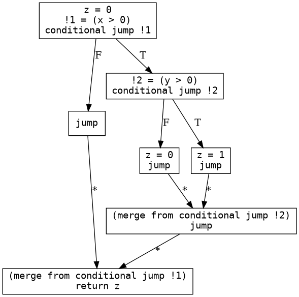
#### SSA
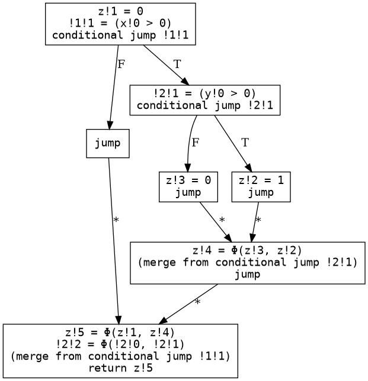
#### SSA ϕ→MUX
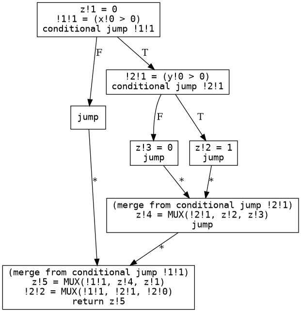
#### Dead code elimination
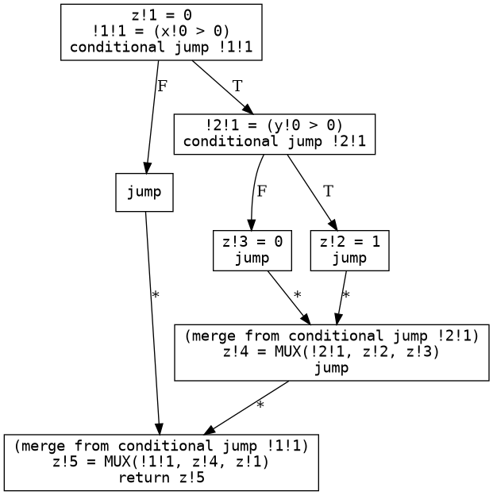
#### Linear code with loops
```python
def chapterfour_figure_12(x!0: shared[int], y!0: shared[int]) -> shared[int]:
    z!1 = 0
    !1!1 = (x!0 > 0)
    !2!1 = (y!0 > 0)
    z!3 = 0
    z!2 = 1
    z!4 = MUX(!2!1, z!2, z!3)
    z!5 = MUX(!1!1, z!4, z!1)
    return z!5
```
#### Dependency graph

#### Removal of infeasible edges
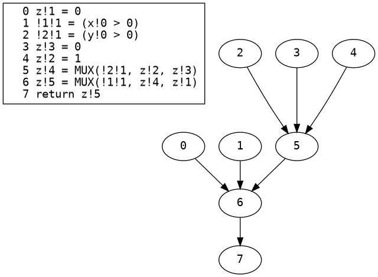
#### Type Environment Before Vectorization
| Variable | Type |
| - | - |
| `x!0` | `shared[int]` |
| `y!0` | `shared[int]` |
| `z!5` | `shared[int]` |
| `z!4` | `shared[int]` |
| `z!2` | `plaintext[int]` |
| `z!3` | `plaintext[int]` |
| `!2!1` | `shared[bool]` |
| `!1!1` | `shared[bool]` |
| `z!1` | `plaintext[int]` |
#### Basic Vectorization Phase 1
```python
def chapterfour_figure_12(x!0: shared[int], y!0: shared[int]) -> shared[int]:
    z!1 = 0
    !1!1 = (x!0 > 0)
    !2!1 = (y!0 > 0)
    z!3 = 0
    z!2 = 1
    z!4 = MUX(!2!1, z!2, z!3)
    z!5 = MUX(!1!1, z!4, z!1)
    return z!5
```
#### Basic Vectorization Phase 1 (dependence graph)

#### Basic Vectorization Phase 2
```python
def chapterfour_figure_12(x!0: shared[int], y!0: shared[int]) -> shared[int]:
    z!1 = 0
    !1!1 = (x!0 > 0)
    !2!1 = (y!0 > 0)
    z!3 = 0
    z!2 = 1
    z!4 = MUX(!2!1, z!2, z!3)
    z!5 = MUX(!1!1, z!4, z!1)
    return z!5
```
#### Basic Vectorization Phase 2 (dependence graph)

#### Type Environment After Vectorization
| Variable | Type |
| - | - |
| `x!0` | `shared[int]` |
| `y!0` | `shared[int]` |
| `z!5` | `shared[int]` |
| `z!4` | `shared[int]` |
| `z!2` | `plaintext[int]` |
| `z!3` | `plaintext[int]` |
| `!2!1` | `shared[bool]` |
| `!1!1` | `shared[bool]` |
| `z!1` | `plaintext[int]` |
#### Copy propagation
```python
def chapterfour_figure_12(x!0: shared[int], y!0: shared[int]) -> shared[int]:
    z!1 = 0
    !1!1 = (x!0 > 0)
    !2!1 = (y!0 > 0)
    z!3 = 0
    z!2 = 1
    z!4 = MUX(!2!1, z!2, z!3)
    z!5 = MUX(!1!1, z!4, z!1)
    return z!5
```
#### Common subexpression elimination
```python
def chapterfour_figure_12(x!0: shared[int], y!0: shared[int]) -> shared[int]:
    z!1 = 0
    !1!1 = (x!0 > 0)
    !2!1 = (y!0 > 0)
    z!3 = 0
    z!2 = 1
    z!4 = MUX(!2!1, z!2, z!3)
    z!5 = MUX(!1!1, z!4, z!1)
    return z!5
```
#### MOTION mixed configuration
```Total cost:	0.06378
Input vars:	{y!0: ['A'], x!0: ['A']}
Constants:	{0: ['A', 'Y'], 1: ['Y']}
Plaintext vars:	{}
Flags:		{}
z!1 = 0: _ -> ['Y'] for 0.00000 * 1 = 0.00
!1!1 = (x!0 > 0): A -> ['Y'] for 0.02592 * 1 = 0.03 (A->Y)
!2!1 = (y!0 > 0): A -> ['Y'] for 0.02592 * 1 = 0.03 (A->Y)
z!3 = 0: _ -> ['Y'] for 0.00000 * 1 = 0.00
z!2 = 1: _ -> ['Y'] for 0.00000 * 1 = 0.00
z!4 = MUX(!2!1, z!2, z!3): Y -> {} for 0.00597 * 1 = 0.01
z!5 = MUX(!1!1, z!4, z!1): Y -> {} for 0.00597 * 1 = 0.01
return z!5
Output vars:	{z!5: ['Y']}

```
#### MOTION code
```cpp
template <encrypto::motion::MpcProtocol Protocol>
encrypto::motion::SecureUnsignedInteger chapterfour_figure_12(
    encrypto::motion::PartyPointer &party,
    encrypto::motion::SecureUnsignedInteger x_0,
    encrypto::motion::SecureUnsignedInteger y_0
) {
    // Shared variable declarations
    encrypto::motion::ShareWrapper _1_1;
    encrypto::motion::ShareWrapper _2_1;
    encrypto::motion::SecureUnsignedInteger z_1;
    encrypto::motion::SecureUnsignedInteger z_2;
    encrypto::motion::SecureUnsignedInteger z_3;
    encrypto::motion::SecureUnsignedInteger z_4;
    encrypto::motion::SecureUnsignedInteger z_5;

    // Plaintext variable declarations
    std::uint32_t _MPC_PLAINTEXT_z_1;
    std::uint32_t _MPC_PLAINTEXT_z_2;
    std::uint32_t _MPC_PLAINTEXT_z_3;

    // Constant initializations
    encrypto::motion::SecureUnsignedInteger _MPC_CONSTANT_0 = party->In<Protocol>(encrypto::motion::ToInput(std::uint32_t(0)), 0);
    encrypto::motion::SecureUnsignedInteger _MPC_CONSTANT_1 = party->In<Protocol>(encrypto::motion::ToInput(std::uint32_t(1)), 0);

    // Plaintext parameter assignments


    // Function body
    z_1 = _MPC_CONSTANT_0;
    _MPC_PLAINTEXT_z_1 = std::uint32_t(0);
    _1_1 = (x_0 > _MPC_CONSTANT_0);
    _2_1 = (y_0 > _MPC_CONSTANT_0);
    z_3 = _MPC_CONSTANT_0;
    _MPC_PLAINTEXT_z_3 = std::uint32_t(0);
    z_2 = _MPC_CONSTANT_1;
    _MPC_PLAINTEXT_z_2 = std::uint32_t(1);
    z_4 = _2_1.Mux(z_2.Get(), z_3.Get());
    z_5 = _1_1.Mux(z_4.Get(), z_1.Get());
    return z_5;

}
```
#### MOTION mixed code
```cpp
encrypto::motion::SecureUnsignedInteger chapterfour_figure_12(
    encrypto::motion::PartyPointer &party,
    encrypto::motion::SecureUnsignedInteger x_0,
    encrypto::motion::SecureUnsignedInteger y_0
) {
    // Shared variable declarations
    encrypto::motion::ShareWrapper _1_1;
    encrypto::motion::ShareWrapper _2_1;
    encrypto::motion::SecureUnsignedInteger z_1;
    encrypto::motion::SecureUnsignedInteger z_2;
    encrypto::motion::SecureUnsignedInteger z_3;
    encrypto::motion::SecureUnsignedInteger z_4;
    encrypto::motion::SecureUnsignedInteger z_5;

    // Plaintext variable declarations
    std::uint32_t _MPC_PLAINTEXT_z_1;
    std::uint32_t _MPC_PLAINTEXT_z_2;
    std::uint32_t _MPC_PLAINTEXT_z_3;

    // Constant initializations
    encrypto::motion::SecureUnsignedInteger _MPC_CONSTANT_0 = party->In<encrypto::motion::MpcProtocol::kArithmeticGmw>(std::uint32_t(0), 0);
    encrypto::motion::SecureUnsignedInteger _MPC_CONSTANT_0_Y = party->In<encrypto::motion::MpcProtocol::kBmr>(encrypto::motion::ToInput(std::uint32_t(0)), 0);
    encrypto::motion::SecureUnsignedInteger _MPC_CONSTANT_1 = party->In<encrypto::motion::MpcProtocol::kBmr>(encrypto::motion::ToInput(std::uint32_t(1)), 0);

    // Input Protocol Convertions

    // Plaintext parameter assignments

    // Function body
    z_1 = _MPC_CONSTANT_0_Y;
    _MPC_PLAINTEXT_z_1 = std::uint32_t(0);
    _1_1 = (x_0 > _MPC_CONSTANT_0);
    encrypto::motion::ShareWrapper _1_1_Y;
    _1_1_Y = _1_1.Convert<encrypto::motion::MpcProtocol::kBmr>();
    _2_1 = (y_0 > _MPC_CONSTANT_0);
    encrypto::motion::ShareWrapper _2_1_Y;
    _2_1_Y = _2_1.Convert<encrypto::motion::MpcProtocol::kBmr>();
    z_3 = _MPC_CONSTANT_0_Y;
    _MPC_PLAINTEXT_z_3 = std::uint32_t(0);
    z_2 = _MPC_CONSTANT_1;
    _MPC_PLAINTEXT_z_2 = std::uint32_t(1);
    z_4 = _2_1_Y.Mux(z_2.Get(), z_3.Get());
    z_5 = _1_1_Y.Mux(z_4.Get(), z_1.Get());
    return z_5;

}
```
#### MP-SPDZ mixed configuration
```Total cost:	0.00002
Input vars:	{y!0: ['B'], x!0: ['B']}
Constants:	{0: ['B'], 1: ['B']}
Plaintext vars:	{}
Flags:		{X}
z!1 = 0: _ -> ['B'] for 0.00000 * 1 = 0.00
!1!1 = (x!0 > 0): B -> {} for 0.00001 * 1 = 0.00
!2!1 = (y!0 > 0): B -> {} for 0.00001 * 1 = 0.00
z!3 = 0: _ -> ['B'] for 0.00000 * 1 = 0.00
z!2 = 1: _ -> ['B'] for 0.00000 * 1 = 0.00
z!4 = MUX(!2!1, z!2, z!3): B -> {} for 0.00000 * 1 = 0.00
z!5 = MUX(!1!1, z!4, z!1): B -> {} for 0.00000 * 1 = 0.00
return z!5
Output vars:	{z!5: ['B']}

```
#### MP-SPDZ code
```py
def chapterfour_figure_12(x_0, y_0):
    # Shared array declarations

    # Function body
    z_1 = sint(0)
    _1_1 = (x_0 > sint(0))
    _2_1 = (y_0 > sint(0))
    z_3 = sint(0)
    z_2 = sint(1)
    z_4 = _2_1.if_else(z_2, z_3)
    z_5 = _1_1.if_else(z_4, z_1)
    return z_5
```
#### MP-SPDZ mixed code
```py
program.options.binary = 32
program.use_dabit = True
def chapterfour_figure_12(x_0, y_0):
    # Convertion functions
    siv32 = sbitintvec.get_type(32)
    sb32 = sbits.get_type(32)
    
    
    # Shared array declarations

    # Shared array convertion declarations
    
    # Function body
    z_1 = siv32(0)
    _1_1 = (x_0 > siv32(0))
    _2_1 = (y_0 > siv32(0))
    z_3 = siv32(0)
    z_2 = siv32(1)
    z_4 = _2_1.if_else(z_2, z_3)
    z_5 = _1_1.if_else(z_4, z_1)
    return z_5
```
### `convex_hull`
#### Input
```python
from UTIL import shared


def convex_hull(
    X_coords: shared[list[int]],
    Y_coords: shared[list[int]],
    N: int,
    result_X: list[int],
    result_Y: list[int],
) -> tuple[shared[list[int]], shared[list[int]]]:
    for i in range(0, N):
        is_hull = True
        p1_X = X_coords[i]
        p1_Y = Y_coords[i]

        if p1_X <= 0 and p1_Y >= 0:
            for j in range(0, N):
                p2_X = X_coords[j]
                p2_Y = Y_coords[j]

                if not (p1_X <= p2_X or p1_Y >= p2_Y):
                    is_hull = False
        val_X = result_X[i]
        val_Y = result_Y[i]

        if is_hull:
            val_X = p1_X
            val_Y = p1_Y
        result_X[i] = val_X
        result_Y[i] = val_Y

    return (result_X, result_Y)


X_coords = [1, 2, 3]
Y_coords = [4, 5, 6]
N = 3
result_X = [0 for i in range(len(X_coords))]
result_Y = [0 for i in range(len(Y_coords))]
print(convex_hull(X_coords, Y_coords, N, result_X, result_Y))

```
#### Restricted AST
```python
def convex_hull(X_coords: shared[list[int; ?]], Y_coords: shared[list[int; ?]], N: plaintext[int], result_X: plaintext[list[int; ?]], result_Y: plaintext[list[int; ?]]) -> tuple[shared[list[int; ?]], shared[list[int; ?]]]:
    for i: plaintext[int] in range(0, N):
        is_hull = True
        p1_X = X_coords[i]
        p1_Y = Y_coords[i]
        if ((p1_X <= 0) and (p1_Y >= 0)):
            for j: plaintext[int] in range(0, N):
                p2_X = X_coords[j]
                p2_Y = Y_coords[j]
                if not ((p1_X <= p2_X) or (p1_Y >= p2_Y)):
                    is_hull = False
        val_X = result_X[i]
        val_Y = result_Y[i]
        if is_hull:
            val_X = p1_X
            val_Y = p1_Y
        result_X[i] = val_X
        result_Y[i] = val_Y
    return (result_X, result_Y)
```
#### Three-address code CFG
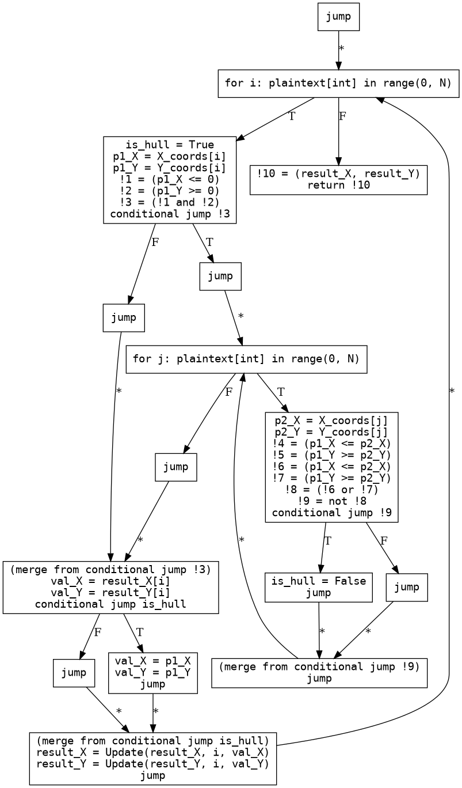
#### SSA
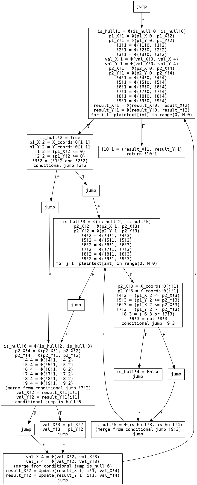
#### SSA ϕ→MUX
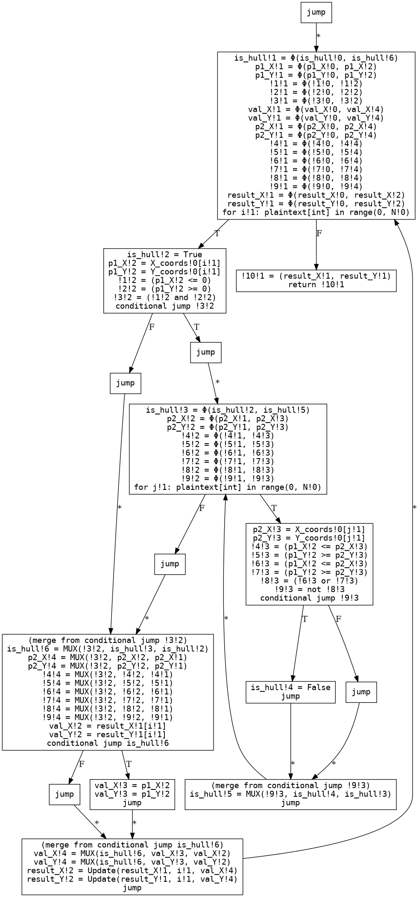
#### Dead code elimination
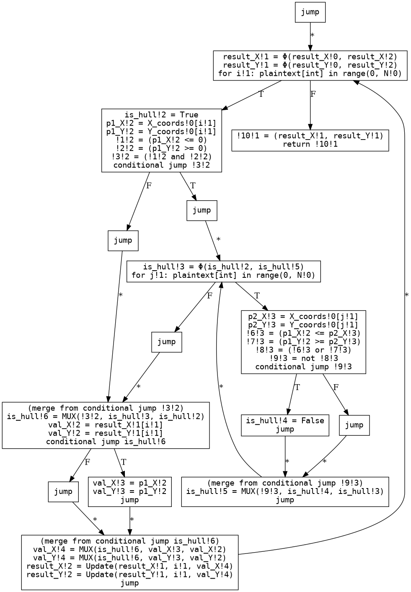
#### Linear code with loops
```python
def convex_hull(X_coords!0: shared[list[int; ?]], Y_coords!0: shared[list[int; ?]], N!0: plaintext[int], result_X!0: plaintext[list[int; ?]], result_Y!0: plaintext[list[int; ?]]) -> tuple[shared[list[int; ?]], shared[list[int; ?]]]:
    for i!1 in range(0, N!0):
        result_X!1 = Φ(result_X!0, result_X!2)
        result_Y!1 = Φ(result_Y!0, result_Y!2)
        is_hull!2 = True
        p1_X!2 = X_coords!0[i!1]
        p1_Y!2 = Y_coords!0[i!1]
        !1!2 = (p1_X!2 <= 0)
        !2!2 = (p1_Y!2 >= 0)
        !3!2 = (!1!2 and !2!2)
        for j!1 in range(0, N!0):
            is_hull!3 = Φ(is_hull!2, is_hull!5)
            p2_X!3 = X_coords!0[j!1]
            p2_Y!3 = Y_coords!0[j!1]
            !6!3 = (p1_X!2 <= p2_X!3)
            !7!3 = (p1_Y!2 >= p2_Y!3)
            !8!3 = (!6!3 or !7!3)
            !9!3 = not !8!3
            is_hull!4 = False
            is_hull!5 = MUX(!9!3, is_hull!4, is_hull!3)
        is_hull!6 = MUX(!3!2, is_hull!3, is_hull!2)
        val_X!2 = result_X!1[i!1]
        val_Y!2 = result_Y!1[i!1]
        val_X!3 = p1_X!2
        val_Y!3 = p1_Y!2
        val_X!4 = MUX(is_hull!6, val_X!3, val_X!2)
        val_Y!4 = MUX(is_hull!6, val_Y!3, val_Y!2)
        result_X!2 = Update(result_X!1, i!1, val_X!4)
        result_Y!2 = Update(result_Y!1, i!1, val_Y!4)
    !10!1 = (result_X!1, result_Y!1)
    return !10!1
```
#### Dependency graph
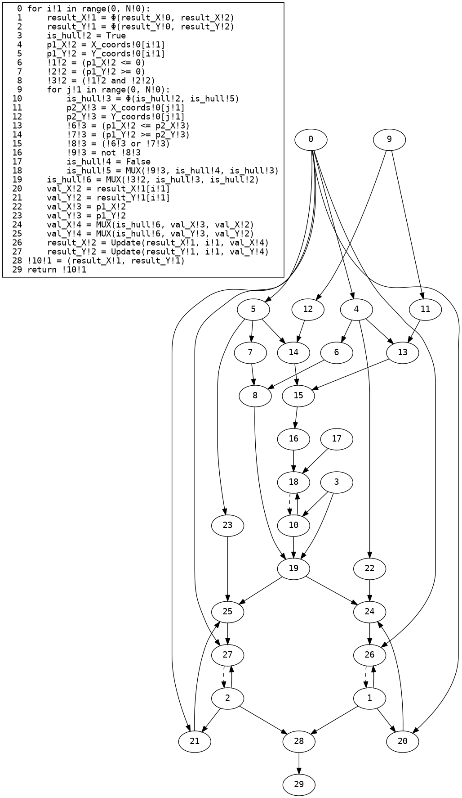
#### Removal of infeasible edges
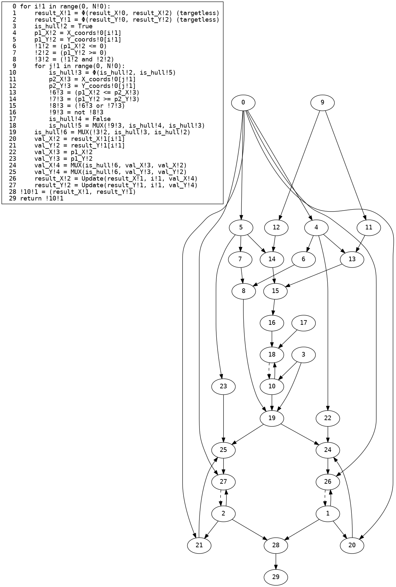
#### Type Environment Before Vectorization
| Variable | Type |
| - | - |
| `X_coords!0` | `shared[list[int; ?]]` |
| `Y_coords!0` | `shared[list[int; ?]]` |
| `N!0` | `plaintext[int]` |
| `result_X!0` | `plaintext[list[int; ?]]` |
| `result_Y!0` | `plaintext[list[int; ?]]` |
| `i!1` | `plaintext[int]` |
| `j!1` | `plaintext[int]` |
| `!10!1` | `tuple[shared[list[int; (N!0)]], shared[list[int; (N!0)]]]` |
| `result_Y!2` | `shared[list[int; (N!0)]]` |
| `result_Y!1` | `shared[list[int; (N!0)]]` |
| `val_Y!2` | `shared[int]` |
| `val_Y!4` | `shared[int]` |
| `result_X!2` | `shared[list[int; (N!0)]]` |
| `result_X!1` | `shared[list[int; (N!0)]]` |
| `val_X!2` | `shared[int]` |
| `val_X!4` | `shared[int]` |
| `val_Y!3` | `shared[int]` |
| `val_X!3` | `shared[int]` |
| `is_hull!6` | `shared[bool]` |
| `is_hull!5` | `shared[bool]` |
| `is_hull!3` | `shared[bool]` |
| `is_hull!4` | `plaintext[bool]` |
| `!9!3` | `shared[bool]` |
| `!8!3` | `shared[bool]` |
| `!7!3` | `shared[bool]` |
| `!6!3` | `shared[bool]` |
| `p2_Y!3` | `shared[int]` |
| `p2_X!3` | `shared[int]` |
| `!3!2` | `shared[bool]` |
| `!2!2` | `shared[bool]` |
| `!1!2` | `shared[bool]` |
| `p1_Y!2` | `shared[int]` |
| `p1_X!2` | `shared[int]` |
| `is_hull!2` | `plaintext[bool]` |
#### Basic Vectorization Phase 1
```python
def convex_hull(X_coords!0: shared[list[int; ?]], Y_coords!0: shared[list[int; ?]], N!0: plaintext[int], result_X!0: plaintext[list[int; ?]], result_Y!0: plaintext[list[int; ?]]) -> tuple[shared[list[int; ?]], shared[list[int; ?]]]:
    !11!0{N!0}[] = lift(result_X!0, (i!1:N!0))
    !12!0{N!0}[] = lift(result_Y!0, (i!1:N!0))
    !13!0{N!0}[] = lift(X_coords!0[i!1], (i!1:N!0))
    !14!0{N!0}[] = lift(Y_coords!0[i!1], (i!1:N!0))
    for i!1 in range(0, N!0):
        result_X!1{N!0}[] = Φ(!11!0{N!0}[], result_X!2{N!0}[]) (targetless)
        result_Y!1{N!0}[] = Φ(!12!0{N!0}[], result_Y!2{N!0}[]) (targetless)
        is_hull!2 = True
        p1_X!2{N!0}[] = !13!0{N!0}[]
        p1_Y!2{N!0}[] = !14!0{N!0}[]
        !1!2{N!0}[] = (p1_X!2{N!0}[] <= 0)
        !2!2{N!0}[] = (p1_Y!2{N!0}[] >= 0)
        !3!2{N!0}[] = (!1!2{N!0}[] and !2!2{N!0}[])
        !15!0{N!0, N!0}[] = lift(is_hull!2, (i!1:N!0, j!1:N!0))
        !16!0{N!0, N!0}[] = lift(X_coords!0[j!1], (i!1:N!0, j!1:N!0))
        !17!0{N!0, N!0}[] = lift(Y_coords!0[j!1], (i!1:N!0, j!1:N!0))
        !18!0{N!0, N!0}[] = lift(p1_X!2{N!0}[], (i!1:N!0, j!1:N!0))
        !19!0{N!0, N!0}[] = lift(p1_Y!2{N!0}[], (i!1:N!0, j!1:N!0))
        for j!1 in range(0, N!0):
            is_hull!3{N!0, N!0}[] = Φ(!15!0{N!0, N!0}[], is_hull!5{N!0, N!0}[])
            p2_X!3{N!0, N!0}[] = !16!0{N!0, N!0}[]
            p2_Y!3{N!0, N!0}[] = !17!0{N!0, N!0}[]
            !6!3{N!0, N!0}[] = (!18!0{N!0, N!0}[] <= p2_X!3{N!0, N!0}[])
            !7!3{N!0, N!0}[] = (!19!0{N!0, N!0}[] >= p2_Y!3{N!0, N!0}[])
            !8!3{N!0, N!0}[] = (!6!3{N!0, N!0}[] or !7!3{N!0, N!0}[])
            !9!3{N!0, N!0}[] = not !8!3{N!0, N!0}[]
            is_hull!4 = False
            is_hull!5{N!0, N!0}[] = MUX(!9!3{N!0, N!0}[], is_hull!4, is_hull!3{N!0, N!0}[])
        !20!0{N!0}[] = drop_dim(is_hull!5{N!0, N!0}[])
        is_hull!6{N!0}[] = MUX(!3!2{N!0}[], !20!0{N!0}[], is_hull!2)
        val_X!2{N!0}[] = result_X!1{N!0}[]
        val_Y!2{N!0}[] = result_Y!1{N!0}[]
        val_X!3{N!0}[] = p1_X!2{N!0}[]
        val_Y!3{N!0}[] = p1_Y!2{N!0}[]
        val_X!4{N!0}[] = MUX(is_hull!6{N!0}[], val_X!3{N!0}[], val_X!2{N!0}[])
        val_Y!4{N!0}[] = MUX(is_hull!6{N!0}[], val_Y!3{N!0}[], val_Y!2{N!0}[])
        result_X!2{N!0}[] = VectorizedUpdate(result_X!1{N!0}[], [I!1], val_X!4{N!0}[])
        result_Y!2{N!0}[] = VectorizedUpdate(result_Y!1{N!0}[], [I!1], val_Y!4{N!0}[])
    !10!1 = (result_X!1, result_Y!1)
    return !10!1
```
#### Basic Vectorization Phase 1 (dependence graph)
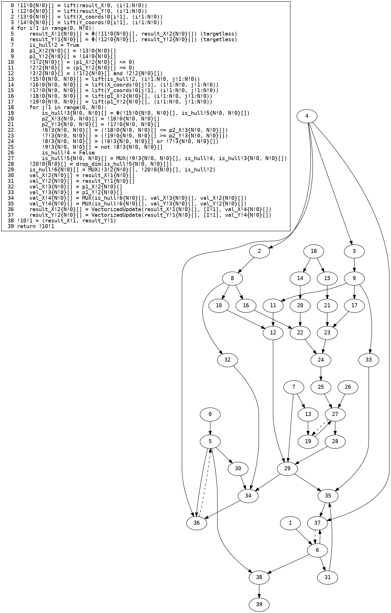
#### Basic Vectorization Phase 2
```python
def convex_hull(X_coords!0: shared[list[int; ?]], Y_coords!0: shared[list[int; ?]], N!0: plaintext[int], result_X!0: plaintext[list[int; ?]], result_Y!0: plaintext[list[int; ?]]) -> tuple[shared[list[int; ?]], shared[list[int; ?]]]:
    !11!0{N!0}[] = lift(result_X!0, (i!1:N!0))
    !12!0{N!0}[] = lift(result_Y!0, (i!1:N!0))
    !13!0{N!0}[] = lift(X_coords!0[i!1], (i!1:N!0))
    !14!0{N!0}[] = lift(Y_coords!0[i!1], (i!1:N!0))
    is_hull!2 = True
    !16!0{N!0, N!0}[] = lift(X_coords!0[j!1], (i!1:N!0, j!1:N!0))
    !17!0{N!0, N!0}[] = lift(Y_coords!0[j!1], (i!1:N!0, j!1:N!0))
    is_hull!4 = False
    val_X!2{N!0}[] = !11!0{N!0}[]
    val_Y!2{N!0}[] = !12!0{N!0}[]
    p1_X!2{N!0}[] = !13!0{N!0}[]
    p1_Y!2{N!0}[] = !14!0{N!0}[]
    !15!0{N!0, N!0}[] = lift(is_hull!2, (i!1:N!0, j!1:N!0))
    p2_X!3{N!0, N!0}[] = !16!0{N!0, N!0}[]
    p2_Y!3{N!0, N!0}[] = !17!0{N!0, N!0}[]
    !1!2{N!0}[] = (p1_X!2{N!0}[] <= 0)
    !18!0{N!0, N!0}[] = lift(p1_X!2{N!0}[], (i!1:N!0, j!1:N!0))
    val_X!3{N!0}[] = p1_X!2{N!0}[]
    !2!2{N!0}[] = (p1_Y!2{N!0}[] >= 0)
    !19!0{N!0, N!0}[] = lift(p1_Y!2{N!0}[], (i!1:N!0, j!1:N!0))
    val_Y!3{N!0}[] = p1_Y!2{N!0}[]
    !6!3{N!0, N!0}[] = (!18!0{N!0, N!0}[] <= p2_X!3{N!0, N!0}[])
    !3!2{N!0}[] = (!1!2{N!0}[] and !2!2{N!0}[])
    !7!3{N!0, N!0}[] = (!19!0{N!0, N!0}[] >= p2_Y!3{N!0, N!0}[])
    !8!3{N!0, N!0}[] = (!6!3{N!0, N!0}[] or !7!3{N!0, N!0}[])
    !9!3{N!0, N!0}[] = not !8!3{N!0, N!0}[]
    for !21!0 in range(0, N!0): (monolithic)
        is_hull!3{N!0}[!21!0] = Φ(!15!0{N!0}[!21!0], is_hull!5{N!0}[(!21!0 - 1)])
        is_hull!5{N!0}[!21!0] = MUX(!9!3{N!0}[!21!0], is_hull!4, is_hull!3{N!0}[!21!0])
    !20!0{N!0}[] = drop_dim(is_hull!5{N!0, N!0}[])
    is_hull!6{N!0}[] = MUX(!3!2{N!0}[], !20!0{N!0}[], is_hull!2)
    val_X!4{N!0}[] = MUX(is_hull!6{N!0}[], val_X!3{N!0}[], val_X!2{N!0}[])
    val_Y!4{N!0}[] = MUX(is_hull!6{N!0}[], val_Y!3{N!0}[], val_Y!2{N!0}[])
    result_X!2{N!0}[] = VectorizedUpdate(!11!0{N!0}[], [I!1], val_X!4{N!0}[])
    result_Y!2{N!0}[] = VectorizedUpdate(!12!0{N!0}[], [I!1], val_Y!4{N!0}[])
    !10!1 = (result_X!2, result_Y!2)
    return !10!1
```
#### Basic Vectorization Phase 2 (dependence graph)
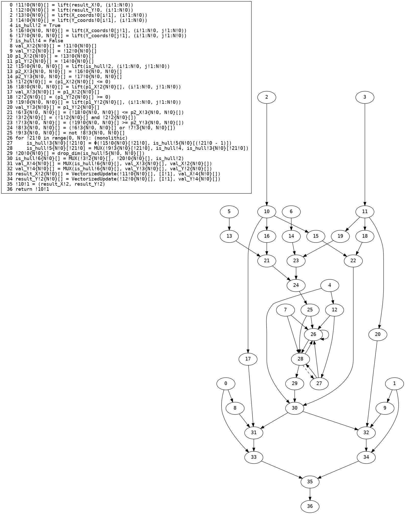
#### Type Environment After Vectorization
| Variable | Type |
| - | - |
| `X_coords!0` | `shared[list[int; ?]]` |
| `Y_coords!0` | `shared[list[int; ?]]` |
| `N!0` | `plaintext[int]` |
| `result_X!0` | `plaintext[list[int; ?]]` |
| `result_Y!0` | `plaintext[list[int; ?]]` |
| `!21!0` | `plaintext[int]` |
| `!10!1` | `tuple[shared[list[int; (N!0)]], shared[list[int; (N!0)]]]` |
| `result_Y!2` | `shared[list[int; (N!0)]]` |
| `result_X!2` | `shared[list[int; (N!0)]]` |
| `val_Y!4` | `shared[list[int; (N!0)]]` |
| `val_X!4` | `shared[list[int; (N!0)]]` |
| `is_hull!6` | `shared[list[bool; (N!0)]]` |
| `!20!0` | `shared[list[bool; (N!0)]]` |
| `is_hull!5` | `shared[list[list[bool; (N!0)]; (N!0)]]` |
| `is_hull!3` | `shared[list[list[bool; (N!0)]; (N!0)]]` |
| `!9!3` | `shared[list[list[bool; (N!0)]; (N!0)]]` |
| `!8!3` | `shared[list[list[bool; (N!0)]; (N!0)]]` |
| `!7!3` | `shared[list[list[bool; (N!0)]; (N!0)]]` |
| `!3!2` | `shared[list[bool; (N!0)]]` |
| `!6!3` | `shared[list[list[bool; (N!0)]; (N!0)]]` |
| `val_Y!3` | `shared[list[int; (N!0)]]` |
| `!19!0` | `shared[list[list[int; (N!0)]; (N!0)]]` |
| `!2!2` | `shared[list[bool; (N!0)]]` |
| `val_X!3` | `shared[list[int; (N!0)]]` |
| `!18!0` | `shared[list[list[int; (N!0)]; (N!0)]]` |
| `!1!2` | `shared[list[bool; (N!0)]]` |
| `p2_Y!3` | `shared[list[list[int; (N!0)]; (N!0)]]` |
| `p2_X!3` | `shared[list[list[int; (N!0)]; (N!0)]]` |
| `!15!0` | `shared[list[list[bool; (N!0)]; (N!0)]]` |
| `p1_Y!2` | `shared[list[int; (N!0)]]` |
| `p1_X!2` | `shared[list[int; (N!0)]]` |
| `val_Y!2` | `shared[list[int; (N!0)]]` |
| `val_X!2` | `shared[list[int; (N!0)]]` |
| `is_hull!4` | `plaintext[bool]` |
| `!17!0` | `shared[list[list[int; (N!0)]; (N!0)]]` |
| `!16!0` | `shared[list[list[int; (N!0)]; (N!0)]]` |
| `is_hull!2` | `plaintext[bool]` |
| `!14!0` | `shared[list[int; (N!0)]]` |
| `!13!0` | `shared[list[int; (N!0)]]` |
| `!12!0` | `shared[list[int; (N!0)]]` |
| `!11!0` | `shared[list[int; (N!0)]]` |
#### Copy propagation
```python
def convex_hull(X_coords!0: shared[list[int; ?]], Y_coords!0: shared[list[int; ?]], N!0: plaintext[int], result_X!0: plaintext[list[int; ?]], result_Y!0: plaintext[list[int; ?]]) -> tuple[shared[list[int; ?]], shared[list[int; ?]]]:
    !11!0{N!0}[] = lift(result_X!0, (i!1:N!0))
    !12!0{N!0}[] = lift(result_Y!0, (i!1:N!0))
    !13!0{N!0}[] = lift(X_coords!0[i!1], (i!1:N!0))
    !14!0{N!0}[] = lift(Y_coords!0[i!1], (i!1:N!0))
    is_hull!2 = True
    !16!0{N!0, N!0}[] = lift(X_coords!0[j!1], (i!1:N!0, j!1:N!0))
    !17!0{N!0, N!0}[] = lift(Y_coords!0[j!1], (i!1:N!0, j!1:N!0))
    is_hull!4 = False
    !15!0{N!0, N!0}[] = lift(is_hull!2, (i!1:N!0, j!1:N!0))
    !1!2{N!0}[] = (!13!0{N!0}[] <= 0)
    !18!0{N!0, N!0}[] = lift(!13!0{N!0}[], (i!1:N!0, j!1:N!0))
    !2!2{N!0}[] = (!14!0{N!0}[] >= 0)
    !19!0{N!0, N!0}[] = lift(!14!0{N!0}[], (i!1:N!0, j!1:N!0))
    !6!3{N!0, N!0}[] = (!18!0{N!0, N!0}[] <= !16!0{N!0, N!0}[])
    !3!2{N!0}[] = (!1!2{N!0}[] and !2!2{N!0}[])
    !7!3{N!0, N!0}[] = (!19!0{N!0, N!0}[] >= !17!0{N!0, N!0}[])
    !8!3{N!0, N!0}[] = (!6!3{N!0, N!0}[] or !7!3{N!0, N!0}[])
    !9!3{N!0, N!0}[] = not !8!3{N!0, N!0}[]
    for !21!0 in range(0, N!0): (monolithic)
        is_hull!3{N!0}[!21!0] = Φ(!15!0{N!0}[!21!0], is_hull!5{N!0}[(!21!0 - 1)])
        is_hull!5{N!0}[!21!0] = MUX(!9!3{N!0}[!21!0], is_hull!4, is_hull!3{N!0}[!21!0])
    !20!0{N!0}[] = drop_dim(is_hull!5{N!0, N!0}[])
    is_hull!6{N!0}[] = MUX(!3!2{N!0}[], !20!0{N!0}[], is_hull!2)
    val_X!4{N!0}[] = MUX(is_hull!6{N!0}[], !13!0{N!0}[], !11!0{N!0}[])
    val_Y!4{N!0}[] = MUX(is_hull!6{N!0}[], !14!0{N!0}[], !12!0{N!0}[])
    result_X!2{N!0}[] = VectorizedUpdate(!11!0{N!0}[], [I!1], val_X!4{N!0}[])
    result_Y!2{N!0}[] = VectorizedUpdate(!12!0{N!0}[], [I!1], val_Y!4{N!0}[])
    !10!1 = (result_X!2, result_Y!2)
    return !10!1
```
#### Common subexpression elimination
```python
def convex_hull(X_coords!0: shared[list[int; ?]], Y_coords!0: shared[list[int; ?]], N!0: plaintext[int], result_X!0: plaintext[list[int; ?]], result_Y!0: plaintext[list[int; ?]]) -> tuple[shared[list[int; ?]], shared[list[int; ?]]]:
    !11!0{N!0}[] = lift(result_X!0, (i!1:N!0))
    !12!0{N!0}[] = lift(result_Y!0, (i!1:N!0))
    !13!0{N!0}[] = lift(X_coords!0[i!1], (i!1:N!0))
    !14!0{N!0}[] = lift(Y_coords!0[i!1], (i!1:N!0))
    is_hull!2 = True
    !16!0{N!0, N!0}[] = lift(X_coords!0[j!1], (i!1:N!0, j!1:N!0))
    !17!0{N!0, N!0}[] = lift(Y_coords!0[j!1], (i!1:N!0, j!1:N!0))
    is_hull!4 = False
    !15!0{N!0, N!0}[] = lift(is_hull!2, (i!1:N!0, j!1:N!0))
    !1!2{N!0}[] = (!13!0{N!0}[] <= 0)
    !18!0{N!0, N!0}[] = lift(!13!0{N!0}[], (i!1:N!0, j!1:N!0))
    !2!2{N!0}[] = (!14!0{N!0}[] >= 0)
    !19!0{N!0, N!0}[] = lift(!14!0{N!0}[], (i!1:N!0, j!1:N!0))
    !6!3{N!0, N!0}[] = (!18!0{N!0, N!0}[] <= !16!0{N!0, N!0}[])
    !3!2{N!0}[] = (!1!2{N!0}[] and !2!2{N!0}[])
    !7!3{N!0, N!0}[] = (!19!0{N!0, N!0}[] >= !17!0{N!0, N!0}[])
    !8!3{N!0, N!0}[] = (!6!3{N!0, N!0}[] or !7!3{N!0, N!0}[])
    !9!3{N!0, N!0}[] = not !8!3{N!0, N!0}[]
    for !21!0 in range(0, N!0): (monolithic)
        is_hull!3{N!0}[!21!0] = Φ(!15!0{N!0}[!21!0], is_hull!5{N!0}[(!21!0 - 1)])
        is_hull!5{N!0}[!21!0] = MUX(!9!3{N!0}[!21!0], is_hull!4, is_hull!3{N!0}[!21!0])
    !20!0{N!0}[] = drop_dim(is_hull!5{N!0, N!0}[])
    is_hull!6{N!0}[] = MUX(!3!2{N!0}[], !20!0{N!0}[], is_hull!2)
    val_X!4{N!0}[] = MUX(is_hull!6{N!0}[], !13!0{N!0}[], !11!0{N!0}[])
    val_Y!4{N!0}[] = MUX(is_hull!6{N!0}[], !14!0{N!0}[], !12!0{N!0}[])
    result_X!2{N!0}[] = VectorizedUpdate(!11!0{N!0}[], [I!1], val_X!4{N!0}[])
    result_Y!2{N!0}[] = VectorizedUpdate(!12!0{N!0}[], [I!1], val_Y!4{N!0}[])
    !10!1 = (result_X!2, result_Y!2)
    return !10!1
```
#### MOTION mixed configuration
```Total cost:	0.26523
Input vars:	{Y_coords!0: ['Y'], X_coords!0: ['Y']}
Constants:	{True: ['Y'], False: ['Y'], 0: ['Y']}
Plaintext vars:	{result_X!0: ['Y'], result_Y!0: ['Y']}
Flags:		{}
!11!0{N!0}[] = lift(result_X!0, (i!1:N!0)): _ -> ['Y'] for 0.00000 * 1 = 0.00
!12!0{N!0}[] = lift(result_Y!0, (i!1:N!0)): _ -> ['Y'] for 0.00000 * 1 = 0.00
!13!0{N!0}[] = lift(X_coords!0[i!1], (i!1:N!0)): _ -> ['Y'] for 0.00000 * 1 = 0.00
!14!0{N!0}[] = lift(Y_coords!0[i!1], (i!1:N!0)): _ -> ['Y'] for 0.00000 * 1 = 0.00
is_hull!2 = True: _ -> ['Y'] for 0.00000 * 1 = 0.00
!16!0{N!0, N!0}[] = lift(X_coords!0[j!1], (i!1:N!0, j!1:N!0)): _ -> ['Y'] for 0.00000 * 1 = 0.00
!17!0{N!0, N!0}[] = lift(Y_coords!0[j!1], (i!1:N!0, j!1:N!0)): _ -> ['Y'] for 0.00000 * 1 = 0.00
is_hull!4 = False: _ -> ['Y'] for 0.00000 * 1 = 0.00
!15!0{N!0, N!0}[] = lift(is_hull!2, (i!1:N!0, j!1:N!0)): _ -> ['Y'] for 0.00000 * 1 = 0.00
!1!2{N!0}[] = (!13!0{N!0}[] <= 0): Y -> {} for 0.05967 * 1 = 0.06
!18!0{N!0, N!0}[] = lift(!13!0{N!0}[], (i!1:N!0, j!1:N!0)): _ -> ['Y'] for 0.00000 * 1 = 0.00
!2!2{N!0}[] = (!14!0{N!0}[] >= 0): Y -> {} for 0.05451 * 1 = 0.05
!19!0{N!0, N!0}[] = lift(!14!0{N!0}[], (i!1:N!0, j!1:N!0)): _ -> ['Y'] for 0.00000 * 1 = 0.00
!6!3{N!0, N!0}[] = (!18!0{N!0, N!0}[] <= !16!0{N!0, N!0}[]): Y -> {} for 0.05927 * 1 = 0.06
!3!2{N!0}[] = (!1!2{N!0}[] and !2!2{N!0}[]): Y -> {} for 0.00109 * 1 = 0.00
!7!3{N!0, N!0}[] = (!19!0{N!0, N!0}[] >= !17!0{N!0, N!0}[]): Y -> {} for 0.05279 * 1 = 0.05
!8!3{N!0, N!0}[] = (!6!3{N!0, N!0}[] or !7!3{N!0, N!0}[]): Y -> {} for 0.00245 * 1 = 0.00
!9!3{N!0, N!0}[] = not !8!3{N!0, N!0}[]: Y -> {} for 0.00000 * 1 = 0.00
	is_hull!3{N!0}[!21!0] = Φ(!15!0{N!0}[!21!0], is_hull!5{N!0}[(!21!0 - 1)]): Y -> {} for 0.00000 * 3 = 0.00
	is_hull!5{N!0}[!21!0] = MUX(!9!3{N!0}[!21!0], is_hull!4, is_hull!3{N!0}[!21!0]): Y -> {} for 0.00591 * 3 = 0.02
!20!0{N!0}[] = drop_dim(is_hull!5{N!0, N!0}[]): _ -> ['Y'] for 0.00000 * 1 = 0.00
is_hull!6{N!0}[] = MUX(!3!2{N!0}[], !20!0{N!0}[], is_hull!2): Y -> {} for 0.00591 * 1 = 0.01
val_X!4{N!0}[] = MUX(is_hull!6{N!0}[], !13!0{N!0}[], !11!0{N!0}[]): Y -> {} for 0.00591 * 1 = 0.01
val_Y!4{N!0}[] = MUX(is_hull!6{N!0}[], !14!0{N!0}[], !12!0{N!0}[]): Y -> {} for 0.00591 * 1 = 0.01
result_X!2{N!0}[] = VectorizedUpdate(!11!0{N!0}[], [I!1], val_X!4{N!0}[]): Y -> {} for 0.00000 * 1 = 0.00
result_Y!2{N!0}[] = VectorizedUpdate(!12!0{N!0}[], [I!1], val_Y!4{N!0}[]): Y -> {} for 0.00000 * 1 = 0.00
!10!1 = (result_X!2, result_Y!2)
return !10!1
Output vars:	{result_Y!2: ['Y'], result_X!2: ['Y']}

```
#### MOTION code
```cpp
template <encrypto::motion::MpcProtocol Protocol>
std::tuple<std::vector<encrypto::motion::SecureUnsignedInteger>, std::vector<encrypto::motion::SecureUnsignedInteger>> convex_hull(
    encrypto::motion::PartyPointer &party,
    std::vector<encrypto::motion::SecureUnsignedInteger> X_coords_0,
    std::vector<encrypto::motion::SecureUnsignedInteger> Y_coords_0,
    std::uint32_t _MPC_PLAINTEXT_N_0,
    std::vector<std::uint32_t> _MPC_PLAINTEXT_result_X_0,
    std::vector<std::uint32_t> _MPC_PLAINTEXT_result_Y_0
) {
    // Shared variable declarations
    std::vector<encrypto::motion::ShareWrapper> _1_2((_MPC_PLAINTEXT_N_0));
    std::tuple<std::vector<encrypto::motion::SecureUnsignedInteger>, std::vector<encrypto::motion::SecureUnsignedInteger>> _10_1;
    std::vector<encrypto::motion::SecureUnsignedInteger> _11_0((_MPC_PLAINTEXT_N_0));
    std::vector<encrypto::motion::SecureUnsignedInteger> _12_0((_MPC_PLAINTEXT_N_0));
    std::vector<encrypto::motion::SecureUnsignedInteger> _13_0((_MPC_PLAINTEXT_N_0));
    std::vector<encrypto::motion::SecureUnsignedInteger> _14_0((_MPC_PLAINTEXT_N_0));
    std::vector<encrypto::motion::ShareWrapper> _15_0((_MPC_PLAINTEXT_N_0) * (_MPC_PLAINTEXT_N_0));
    std::vector<encrypto::motion::SecureUnsignedInteger> _16_0((_MPC_PLAINTEXT_N_0) * (_MPC_PLAINTEXT_N_0));
    std::vector<encrypto::motion::SecureUnsignedInteger> _17_0((_MPC_PLAINTEXT_N_0) * (_MPC_PLAINTEXT_N_0));
    std::vector<encrypto::motion::SecureUnsignedInteger> _18_0((_MPC_PLAINTEXT_N_0) * (_MPC_PLAINTEXT_N_0));
    std::vector<encrypto::motion::SecureUnsignedInteger> _19_0((_MPC_PLAINTEXT_N_0) * (_MPC_PLAINTEXT_N_0));
    std::vector<encrypto::motion::ShareWrapper> _2_2((_MPC_PLAINTEXT_N_0));
    std::vector<encrypto::motion::ShareWrapper> _20_0((_MPC_PLAINTEXT_N_0));
    encrypto::motion::SecureUnsignedInteger _21_0;
    std::vector<encrypto::motion::ShareWrapper> _3_2((_MPC_PLAINTEXT_N_0));
    std::vector<encrypto::motion::ShareWrapper> _6_3((_MPC_PLAINTEXT_N_0) * (_MPC_PLAINTEXT_N_0));
    std::vector<encrypto::motion::ShareWrapper> _7_3((_MPC_PLAINTEXT_N_0) * (_MPC_PLAINTEXT_N_0));
    std::vector<encrypto::motion::ShareWrapper> _8_3((_MPC_PLAINTEXT_N_0) * (_MPC_PLAINTEXT_N_0));
    std::vector<encrypto::motion::ShareWrapper> _9_3((_MPC_PLAINTEXT_N_0) * (_MPC_PLAINTEXT_N_0));
    encrypto::motion::SecureUnsignedInteger N_0;
    encrypto::motion::ShareWrapper is_hull_2;
    std::vector<encrypto::motion::ShareWrapper> is_hull_3((_MPC_PLAINTEXT_N_0) * (_MPC_PLAINTEXT_N_0));
    encrypto::motion::ShareWrapper is_hull_4;
    std::vector<encrypto::motion::ShareWrapper> is_hull_5((_MPC_PLAINTEXT_N_0) * (_MPC_PLAINTEXT_N_0));
    std::vector<encrypto::motion::ShareWrapper> is_hull_6((_MPC_PLAINTEXT_N_0));
    std::vector<encrypto::motion::SecureUnsignedInteger> result_X_0;
    std::vector<encrypto::motion::SecureUnsignedInteger> result_X_2((_MPC_PLAINTEXT_N_0));
    std::vector<encrypto::motion::SecureUnsignedInteger> result_Y_0;
    std::vector<encrypto::motion::SecureUnsignedInteger> result_Y_2((_MPC_PLAINTEXT_N_0));
    std::vector<encrypto::motion::SecureUnsignedInteger> val_X_4((_MPC_PLAINTEXT_N_0));
    std::vector<encrypto::motion::SecureUnsignedInteger> val_Y_4((_MPC_PLAINTEXT_N_0));

    // Plaintext variable declarations
    std::tuple<std::vector<std::uint32_t>, std::vector<std::uint32_t>> _MPC_PLAINTEXT__10_1;
    std::uint32_t _MPC_PLAINTEXT__21_0;
    bool _MPC_PLAINTEXT_is_hull_2;
    bool _MPC_PLAINTEXT_is_hull_4;

    // Constant initializations
    encrypto::motion::SecureUnsignedInteger _MPC_CONSTANT_0 = party->In<Protocol>(encrypto::motion::ToInput(std::uint32_t(0)), 0);
    encrypto::motion::ShareWrapper _MPC_CONSTANT_false = party->In<Protocol>(encrypto::motion::BitVector(1, false), 0);
    encrypto::motion::ShareWrapper _MPC_CONSTANT_true = party->In<Protocol>(encrypto::motion::BitVector(1, true), 0);

    // Plaintext parameter assignments
    N_0 = party->In<Protocol>(encrypto::motion::ToInput(_MPC_PLAINTEXT_N_0), 0);
    result_X_0.clear();
    std::transform(_MPC_PLAINTEXT_result_X_0.begin(), _MPC_PLAINTEXT_result_X_0.end(), std::back_inserter(result_X_0), [&](const auto &val) { return party->In<Protocol>(encrypto::motion::ToInput(val), 0); });
    result_Y_0.clear();
    std::transform(_MPC_PLAINTEXT_result_Y_0.begin(), _MPC_PLAINTEXT_result_Y_0.end(), std::back_inserter(result_Y_0), [&](const auto &val) { return party->In<Protocol>(encrypto::motion::ToInput(val), 0); });

    // Function body
    vectorized_assign(_11_0, {_MPC_PLAINTEXT_N_0}, {true}, {}, lift(std::function([&](const std::vector<std::uint32_t> &indices){return result_X_0;}), {_MPC_PLAINTEXT_N_0}));
    vectorized_assign(_12_0, {_MPC_PLAINTEXT_N_0}, {true}, {}, lift(std::function([&](const std::vector<std::uint32_t> &indices){return result_Y_0;}), {_MPC_PLAINTEXT_N_0}));
    vectorized_assign(_13_0, {_MPC_PLAINTEXT_N_0}, {true}, {}, lift(std::function([&](const std::vector<std::uint32_t> &indices){return X_coords_0[indices[0]];}), {_MPC_PLAINTEXT_N_0}));
    vectorized_assign(_14_0, {_MPC_PLAINTEXT_N_0}, {true}, {}, lift(std::function([&](const std::vector<std::uint32_t> &indices){return Y_coords_0[indices[0]];}), {_MPC_PLAINTEXT_N_0}));
    is_hull_2 = _MPC_CONSTANT_true;
    _MPC_PLAINTEXT_is_hull_2 = true;
    vectorized_assign(_16_0, {_MPC_PLAINTEXT_N_0, _MPC_PLAINTEXT_N_0}, {true, true}, {}, lift(std::function([&](const std::vector<std::uint32_t> &indices){return X_coords_0[indices[1]];}), {_MPC_PLAINTEXT_N_0, _MPC_PLAINTEXT_N_0}));
    vectorized_assign(_17_0, {_MPC_PLAINTEXT_N_0, _MPC_PLAINTEXT_N_0}, {true, true}, {}, lift(std::function([&](const std::vector<std::uint32_t> &indices){return Y_coords_0[indices[1]];}), {_MPC_PLAINTEXT_N_0, _MPC_PLAINTEXT_N_0}));
    is_hull_4 = _MPC_CONSTANT_false;
    _MPC_PLAINTEXT_is_hull_4 = false;
    vectorized_assign(_15_0, {_MPC_PLAINTEXT_N_0, _MPC_PLAINTEXT_N_0}, {true, true}, {}, lift(std::function([&](const std::vector<std::uint32_t> &indices){return is_hull_2;}), {_MPC_PLAINTEXT_N_0, _MPC_PLAINTEXT_N_0}));
    vectorized_assign(_1_2, {_MPC_PLAINTEXT_N_0}, {true}, {}, ((decltype(_MPC_CONSTANT_0)::Simdify(lift(std::function([&](const std::vector<std::uint32_t> &indices){return _MPC_CONSTANT_0;}), {_MPC_PLAINTEXT_N_0})) > vectorized_access(_13_0, {_MPC_PLAINTEXT_N_0}, {true}, {})) | (to_share_wrapper(vectorized_access(_13_0, {_MPC_PLAINTEXT_N_0}, {true}, {})) == to_share_wrapper(decltype(_MPC_CONSTANT_0)::Simdify(lift(std::function([&](const std::vector<std::uint32_t> &indices){return _MPC_CONSTANT_0;}), {_MPC_PLAINTEXT_N_0}))))));
    vectorized_assign(_18_0, {_MPC_PLAINTEXT_N_0, _MPC_PLAINTEXT_N_0}, {true, true}, {}, lift(std::function([&](const std::vector<std::uint32_t> &indices){return vectorized_access(_13_0, {_MPC_PLAINTEXT_N_0}, {true}, {}).Unsimdify();}), {_MPC_PLAINTEXT_N_0, _MPC_PLAINTEXT_N_0}));
    vectorized_assign(_2_2, {_MPC_PLAINTEXT_N_0}, {true}, {}, ((vectorized_access(_14_0, {_MPC_PLAINTEXT_N_0}, {true}, {}) > decltype(_MPC_CONSTANT_0)::Simdify(lift(std::function([&](const std::vector<std::uint32_t> &indices){return _MPC_CONSTANT_0;}), {_MPC_PLAINTEXT_N_0}))) | (to_share_wrapper(vectorized_access(_14_0, {_MPC_PLAINTEXT_N_0}, {true}, {})) == to_share_wrapper(decltype(_MPC_CONSTANT_0)::Simdify(lift(std::function([&](const std::vector<std::uint32_t> &indices){return _MPC_CONSTANT_0;}), {_MPC_PLAINTEXT_N_0}))))));
    vectorized_assign(_19_0, {_MPC_PLAINTEXT_N_0, _MPC_PLAINTEXT_N_0}, {true, true}, {}, lift(std::function([&](const std::vector<std::uint32_t> &indices){return vectorized_access(_14_0, {_MPC_PLAINTEXT_N_0}, {true}, {}).Unsimdify();}), {_MPC_PLAINTEXT_N_0, _MPC_PLAINTEXT_N_0}));
    vectorized_assign(_6_3, {_MPC_PLAINTEXT_N_0, _MPC_PLAINTEXT_N_0}, {true, true}, {}, ((vectorized_access(_16_0, {_MPC_PLAINTEXT_N_0, _MPC_PLAINTEXT_N_0}, {true, true}, {}) > vectorized_access(_18_0, {_MPC_PLAINTEXT_N_0, _MPC_PLAINTEXT_N_0}, {true, true}, {})) | (to_share_wrapper(vectorized_access(_18_0, {_MPC_PLAINTEXT_N_0, _MPC_PLAINTEXT_N_0}, {true, true}, {})) == to_share_wrapper(vectorized_access(_16_0, {_MPC_PLAINTEXT_N_0, _MPC_PLAINTEXT_N_0}, {true, true}, {})))));
    vectorized_assign(_3_2, {_MPC_PLAINTEXT_N_0}, {true}, {}, (to_share_wrapper(vectorized_access(_1_2, {_MPC_PLAINTEXT_N_0}, {true}, {})) & to_share_wrapper(vectorized_access(_2_2, {_MPC_PLAINTEXT_N_0}, {true}, {}))));
    vectorized_assign(_7_3, {_MPC_PLAINTEXT_N_0, _MPC_PLAINTEXT_N_0}, {true, true}, {}, ((vectorized_access(_19_0, {_MPC_PLAINTEXT_N_0, _MPC_PLAINTEXT_N_0}, {true, true}, {}) > vectorized_access(_17_0, {_MPC_PLAINTEXT_N_0, _MPC_PLAINTEXT_N_0}, {true, true}, {})) | (to_share_wrapper(vectorized_access(_19_0, {_MPC_PLAINTEXT_N_0, _MPC_PLAINTEXT_N_0}, {true, true}, {})) == to_share_wrapper(vectorized_access(_17_0, {_MPC_PLAINTEXT_N_0, _MPC_PLAINTEXT_N_0}, {true, true}, {})))));
    vectorized_assign(_8_3, {_MPC_PLAINTEXT_N_0, _MPC_PLAINTEXT_N_0}, {true, true}, {}, (to_share_wrapper(vectorized_access(_6_3, {_MPC_PLAINTEXT_N_0, _MPC_PLAINTEXT_N_0}, {true, true}, {})) | to_share_wrapper(vectorized_access(_7_3, {_MPC_PLAINTEXT_N_0, _MPC_PLAINTEXT_N_0}, {true, true}, {}))));
    vectorized_assign(_9_3, {_MPC_PLAINTEXT_N_0, _MPC_PLAINTEXT_N_0}, {true, true}, {}, (~vectorized_access(_8_3, {_MPC_PLAINTEXT_N_0, _MPC_PLAINTEXT_N_0}, {true, true}, {})));

    // Initialize loop counter
    _MPC_PLAINTEXT__21_0 = std::uint32_t(0);
    // Initialize phi values
    vectorized_assign(is_hull_3, {_MPC_PLAINTEXT_N_0, _MPC_PLAINTEXT_N_0}, {true, false}, {_MPC_PLAINTEXT__21_0}, vectorized_access(_15_0, {_MPC_PLAINTEXT_N_0, _MPC_PLAINTEXT_N_0}, {true, false}, {_MPC_PLAINTEXT__21_0}));
    for (; _MPC_PLAINTEXT__21_0 < _MPC_PLAINTEXT_N_0; _MPC_PLAINTEXT__21_0++) {
        // Update phi values
        if (_MPC_PLAINTEXT__21_0 != std::uint32_t(0)) {
            vectorized_assign(is_hull_3, {_MPC_PLAINTEXT_N_0, _MPC_PLAINTEXT_N_0}, {true, false}, {_MPC_PLAINTEXT__21_0}, vectorized_access(is_hull_5, {_MPC_PLAINTEXT_N_0, _MPC_PLAINTEXT_N_0}, {true, false}, {(_MPC_PLAINTEXT__21_0 - std::uint32_t(1))}));
        }

        vectorized_assign(is_hull_5, {_MPC_PLAINTEXT_N_0, _MPC_PLAINTEXT_N_0}, {true, false}, {_MPC_PLAINTEXT__21_0}, vectorized_access(_9_3, {_MPC_PLAINTEXT_N_0, _MPC_PLAINTEXT_N_0}, {true, false}, {_MPC_PLAINTEXT__21_0}).Mux(decltype(is_hull_4)::Simdify(lift(std::function([&](const std::vector<std::uint32_t> &indices){return is_hull_4;}), {_MPC_PLAINTEXT_N_0})).Get(), vectorized_access(is_hull_3, {_MPC_PLAINTEXT_N_0, _MPC_PLAINTEXT_N_0}, {true, false}, {_MPC_PLAINTEXT__21_0}).Get()));

    }

    vectorized_assign(_20_0, {_MPC_PLAINTEXT_N_0}, {true}, {}, drop_dim(vectorized_access(is_hull_5, {_MPC_PLAINTEXT_N_0, _MPC_PLAINTEXT_N_0}, {true, true}, {}).Unsimdify(), {_MPC_PLAINTEXT_N_0, _MPC_PLAINTEXT_N_0}));
    vectorized_assign(is_hull_6, {_MPC_PLAINTEXT_N_0}, {true}, {}, vectorized_access(_3_2, {_MPC_PLAINTEXT_N_0}, {true}, {}).Mux(vectorized_access(_20_0, {_MPC_PLAINTEXT_N_0}, {true}, {}).Get(), decltype(is_hull_2)::Simdify(lift(std::function([&](const std::vector<std::uint32_t> &indices){return is_hull_2;}), {_MPC_PLAINTEXT_N_0})).Get()));
    vectorized_assign(val_X_4, {_MPC_PLAINTEXT_N_0}, {true}, {}, vectorized_access(is_hull_6, {_MPC_PLAINTEXT_N_0}, {true}, {}).Mux(vectorized_access(_13_0, {_MPC_PLAINTEXT_N_0}, {true}, {}).Get(), vectorized_access(_11_0, {_MPC_PLAINTEXT_N_0}, {true}, {}).Get()));
    vectorized_assign(val_Y_4, {_MPC_PLAINTEXT_N_0}, {true}, {}, vectorized_access(is_hull_6, {_MPC_PLAINTEXT_N_0}, {true}, {}).Mux(vectorized_access(_14_0, {_MPC_PLAINTEXT_N_0}, {true}, {}).Get(), vectorized_access(_12_0, {_MPC_PLAINTEXT_N_0}, {true}, {}).Get()));
    vectorized_assign(result_X_2, {_MPC_PLAINTEXT_N_0}, {true}, {}, vectorized_update(_11_0, {_MPC_PLAINTEXT_N_0}, {true}, {}, vectorized_access(val_X_4, {_MPC_PLAINTEXT_N_0}, {true}, {})));
    vectorized_assign(result_Y_2, {_MPC_PLAINTEXT_N_0}, {true}, {}, vectorized_update(_12_0, {_MPC_PLAINTEXT_N_0}, {true}, {}, vectorized_access(val_Y_4, {_MPC_PLAINTEXT_N_0}, {true}, {})));
    _10_1 = std::make_tuple(result_X_2, result_Y_2);
    return _10_1;

}
```
#### MOTION mixed code
```cpp
std::tuple<std::vector<encrypto::motion::SecureUnsignedInteger>, std::vector<encrypto::motion::SecureUnsignedInteger>> convex_hull(
    encrypto::motion::PartyPointer &party,
    std::vector<encrypto::motion::SecureUnsignedInteger> X_coords_0,
    std::vector<encrypto::motion::SecureUnsignedInteger> Y_coords_0,
    std::uint32_t _MPC_PLAINTEXT_N_0,
    std::vector<std::uint32_t> _MPC_PLAINTEXT_result_X_0,
    std::vector<std::uint32_t> _MPC_PLAINTEXT_result_Y_0
) {
    // Shared variable declarations
    std::vector<encrypto::motion::ShareWrapper> _1_2((_MPC_PLAINTEXT_N_0));
    std::tuple<std::vector<encrypto::motion::SecureUnsignedInteger>, std::vector<encrypto::motion::SecureUnsignedInteger>> _10_1;
    std::vector<encrypto::motion::SecureUnsignedInteger> _11_0((_MPC_PLAINTEXT_N_0));
    std::vector<encrypto::motion::SecureUnsignedInteger> _12_0((_MPC_PLAINTEXT_N_0));
    std::vector<encrypto::motion::SecureUnsignedInteger> _13_0((_MPC_PLAINTEXT_N_0));
    std::vector<encrypto::motion::SecureUnsignedInteger> _14_0((_MPC_PLAINTEXT_N_0));
    std::vector<encrypto::motion::ShareWrapper> _15_0((_MPC_PLAINTEXT_N_0) * (_MPC_PLAINTEXT_N_0));
    std::vector<encrypto::motion::SecureUnsignedInteger> _16_0((_MPC_PLAINTEXT_N_0) * (_MPC_PLAINTEXT_N_0));
    std::vector<encrypto::motion::SecureUnsignedInteger> _17_0((_MPC_PLAINTEXT_N_0) * (_MPC_PLAINTEXT_N_0));
    std::vector<encrypto::motion::SecureUnsignedInteger> _18_0((_MPC_PLAINTEXT_N_0) * (_MPC_PLAINTEXT_N_0));
    std::vector<encrypto::motion::SecureUnsignedInteger> _19_0((_MPC_PLAINTEXT_N_0) * (_MPC_PLAINTEXT_N_0));
    std::vector<encrypto::motion::ShareWrapper> _2_2((_MPC_PLAINTEXT_N_0));
    std::vector<encrypto::motion::ShareWrapper> _20_0((_MPC_PLAINTEXT_N_0));
    encrypto::motion::SecureUnsignedInteger _21_0;
    std::vector<encrypto::motion::ShareWrapper> _3_2((_MPC_PLAINTEXT_N_0));
    std::vector<encrypto::motion::ShareWrapper> _6_3((_MPC_PLAINTEXT_N_0) * (_MPC_PLAINTEXT_N_0));
    std::vector<encrypto::motion::ShareWrapper> _7_3((_MPC_PLAINTEXT_N_0) * (_MPC_PLAINTEXT_N_0));
    std::vector<encrypto::motion::ShareWrapper> _8_3((_MPC_PLAINTEXT_N_0) * (_MPC_PLAINTEXT_N_0));
    std::vector<encrypto::motion::ShareWrapper> _9_3((_MPC_PLAINTEXT_N_0) * (_MPC_PLAINTEXT_N_0));
    encrypto::motion::SecureUnsignedInteger N_0;
    encrypto::motion::ShareWrapper is_hull_2;
    std::vector<encrypto::motion::ShareWrapper> is_hull_3((_MPC_PLAINTEXT_N_0) * (_MPC_PLAINTEXT_N_0));
    encrypto::motion::ShareWrapper is_hull_4;
    std::vector<encrypto::motion::ShareWrapper> is_hull_5((_MPC_PLAINTEXT_N_0) * (_MPC_PLAINTEXT_N_0));
    std::vector<encrypto::motion::ShareWrapper> is_hull_6((_MPC_PLAINTEXT_N_0));
    std::vector<encrypto::motion::SecureUnsignedInteger> result_X_0;
    std::vector<encrypto::motion::SecureUnsignedInteger> result_X_2((_MPC_PLAINTEXT_N_0));
    std::vector<encrypto::motion::SecureUnsignedInteger> result_Y_0;
    std::vector<encrypto::motion::SecureUnsignedInteger> result_Y_2((_MPC_PLAINTEXT_N_0));
    std::vector<encrypto::motion::SecureUnsignedInteger> val_X_4((_MPC_PLAINTEXT_N_0));
    std::vector<encrypto::motion::SecureUnsignedInteger> val_Y_4((_MPC_PLAINTEXT_N_0));

    // Plaintext variable declarations
    std::tuple<std::vector<std::uint32_t>, std::vector<std::uint32_t>> _MPC_PLAINTEXT__10_1;
    std::uint32_t _MPC_PLAINTEXT__21_0;
    bool _MPC_PLAINTEXT_is_hull_2;
    bool _MPC_PLAINTEXT_is_hull_4;

    // Constant initializations
    encrypto::motion::SecureUnsignedInteger _MPC_CONSTANT_0 = party->In<encrypto::motion::MpcProtocol::kBmr>(encrypto::motion::ToInput(std::uint32_t(0)), 0);
    encrypto::motion::ShareWrapper _MPC_CONSTANT_false = party->In<encrypto::motion::MpcProtocol::kBmr>(encrypto::motion::BitVector(1, false), 0);
    encrypto::motion::ShareWrapper _MPC_CONSTANT_true = party->In<encrypto::motion::MpcProtocol::kBmr>(encrypto::motion::BitVector(1, true), 0);

    // Input Protocol Convertions

    // Plaintext parameter assignments
    result_X_0.clear();
    std::transform(_MPC_PLAINTEXT_result_X_0.begin(), _MPC_PLAINTEXT_result_X_0.end(), std::back_inserter(result_X_0), [&](const auto &val) { return party->In<encrypto::motion::MpcProtocol::kBmr>(encrypto::motion::ToInput(val), 0); });
    result_Y_0.clear();
    std::transform(_MPC_PLAINTEXT_result_Y_0.begin(), _MPC_PLAINTEXT_result_Y_0.end(), std::back_inserter(result_Y_0), [&](const auto &val) { return party->In<encrypto::motion::MpcProtocol::kBmr>(encrypto::motion::ToInput(val), 0); });

    // Function body
    vectorized_assign(_11_0, {_MPC_PLAINTEXT_N_0}, {true}, {}, lift(std::function([&](const std::vector<std::uint32_t> &indices){return result_X_0;}), {_MPC_PLAINTEXT_N_0}));
    vectorized_assign(_12_0, {_MPC_PLAINTEXT_N_0}, {true}, {}, lift(std::function([&](const std::vector<std::uint32_t> &indices){return result_Y_0;}), {_MPC_PLAINTEXT_N_0}));
    vectorized_assign(_13_0, {_MPC_PLAINTEXT_N_0}, {true}, {}, lift(std::function([&](const std::vector<std::uint32_t> &indices){return X_coords_0[indices[0]];}), {_MPC_PLAINTEXT_N_0}));
    vectorized_assign(_14_0, {_MPC_PLAINTEXT_N_0}, {true}, {}, lift(std::function([&](const std::vector<std::uint32_t> &indices){return Y_coords_0[indices[0]];}), {_MPC_PLAINTEXT_N_0}));
    is_hull_2 = _MPC_CONSTANT_true;
    _MPC_PLAINTEXT_is_hull_2 = true;
    vectorized_assign(_16_0, {_MPC_PLAINTEXT_N_0, _MPC_PLAINTEXT_N_0}, {true, true}, {}, lift(std::function([&](const std::vector<std::uint32_t> &indices){return X_coords_0[indices[1]];}), {_MPC_PLAINTEXT_N_0, _MPC_PLAINTEXT_N_0}));
    vectorized_assign(_17_0, {_MPC_PLAINTEXT_N_0, _MPC_PLAINTEXT_N_0}, {true, true}, {}, lift(std::function([&](const std::vector<std::uint32_t> &indices){return Y_coords_0[indices[1]];}), {_MPC_PLAINTEXT_N_0, _MPC_PLAINTEXT_N_0}));
    is_hull_4 = _MPC_CONSTANT_false;
    _MPC_PLAINTEXT_is_hull_4 = false;
    vectorized_assign(_15_0, {_MPC_PLAINTEXT_N_0, _MPC_PLAINTEXT_N_0}, {true, true}, {}, lift(std::function([&](const std::vector<std::uint32_t> &indices){return is_hull_2;}), {_MPC_PLAINTEXT_N_0, _MPC_PLAINTEXT_N_0}));
    vectorized_assign(_1_2, {_MPC_PLAINTEXT_N_0}, {true}, {}, ((decltype(_MPC_CONSTANT_0)::Simdify(lift(std::function([&](const std::vector<std::uint32_t> &indices){return _MPC_CONSTANT_0;}), {_MPC_PLAINTEXT_N_0})) > vectorized_access(_13_0, {_MPC_PLAINTEXT_N_0}, {true}, {})) | (to_share_wrapper(vectorized_access(_13_0, {_MPC_PLAINTEXT_N_0}, {true}, {})) == to_share_wrapper(decltype(_MPC_CONSTANT_0)::Simdify(lift(std::function([&](const std::vector<std::uint32_t> &indices){return _MPC_CONSTANT_0;}), {_MPC_PLAINTEXT_N_0}))))));
    vectorized_assign(_18_0, {_MPC_PLAINTEXT_N_0, _MPC_PLAINTEXT_N_0}, {true, true}, {}, lift(std::function([&](const std::vector<std::uint32_t> &indices){return vectorized_access(_13_0, {_MPC_PLAINTEXT_N_0}, {true}, {}).Unsimdify();}), {_MPC_PLAINTEXT_N_0, _MPC_PLAINTEXT_N_0}));
    vectorized_assign(_2_2, {_MPC_PLAINTEXT_N_0}, {true}, {}, ((vectorized_access(_14_0, {_MPC_PLAINTEXT_N_0}, {true}, {}) > decltype(_MPC_CONSTANT_0)::Simdify(lift(std::function([&](const std::vector<std::uint32_t> &indices){return _MPC_CONSTANT_0;}), {_MPC_PLAINTEXT_N_0}))) | (to_share_wrapper(vectorized_access(_14_0, {_MPC_PLAINTEXT_N_0}, {true}, {})) == to_share_wrapper(decltype(_MPC_CONSTANT_0)::Simdify(lift(std::function([&](const std::vector<std::uint32_t> &indices){return _MPC_CONSTANT_0;}), {_MPC_PLAINTEXT_N_0}))))));
    vectorized_assign(_19_0, {_MPC_PLAINTEXT_N_0, _MPC_PLAINTEXT_N_0}, {true, true}, {}, lift(std::function([&](const std::vector<std::uint32_t> &indices){return vectorized_access(_14_0, {_MPC_PLAINTEXT_N_0}, {true}, {}).Unsimdify();}), {_MPC_PLAINTEXT_N_0, _MPC_PLAINTEXT_N_0}));
    vectorized_assign(_6_3, {_MPC_PLAINTEXT_N_0, _MPC_PLAINTEXT_N_0}, {true, true}, {}, ((vectorized_access(_16_0, {_MPC_PLAINTEXT_N_0, _MPC_PLAINTEXT_N_0}, {true, true}, {}) > vectorized_access(_18_0, {_MPC_PLAINTEXT_N_0, _MPC_PLAINTEXT_N_0}, {true, true}, {})) | (to_share_wrapper(vectorized_access(_18_0, {_MPC_PLAINTEXT_N_0, _MPC_PLAINTEXT_N_0}, {true, true}, {})) == to_share_wrapper(vectorized_access(_16_0, {_MPC_PLAINTEXT_N_0, _MPC_PLAINTEXT_N_0}, {true, true}, {})))));
    vectorized_assign(_3_2, {_MPC_PLAINTEXT_N_0}, {true}, {}, (to_share_wrapper(vectorized_access(_1_2, {_MPC_PLAINTEXT_N_0}, {true}, {})) & to_share_wrapper(vectorized_access(_2_2, {_MPC_PLAINTEXT_N_0}, {true}, {}))));
    vectorized_assign(_7_3, {_MPC_PLAINTEXT_N_0, _MPC_PLAINTEXT_N_0}, {true, true}, {}, ((vectorized_access(_19_0, {_MPC_PLAINTEXT_N_0, _MPC_PLAINTEXT_N_0}, {true, true}, {}) > vectorized_access(_17_0, {_MPC_PLAINTEXT_N_0, _MPC_PLAINTEXT_N_0}, {true, true}, {})) | (to_share_wrapper(vectorized_access(_19_0, {_MPC_PLAINTEXT_N_0, _MPC_PLAINTEXT_N_0}, {true, true}, {})) == to_share_wrapper(vectorized_access(_17_0, {_MPC_PLAINTEXT_N_0, _MPC_PLAINTEXT_N_0}, {true, true}, {})))));
    vectorized_assign(_8_3, {_MPC_PLAINTEXT_N_0, _MPC_PLAINTEXT_N_0}, {true, true}, {}, (to_share_wrapper(vectorized_access(_6_3, {_MPC_PLAINTEXT_N_0, _MPC_PLAINTEXT_N_0}, {true, true}, {})) | to_share_wrapper(vectorized_access(_7_3, {_MPC_PLAINTEXT_N_0, _MPC_PLAINTEXT_N_0}, {true, true}, {}))));
    vectorized_assign(_9_3, {_MPC_PLAINTEXT_N_0, _MPC_PLAINTEXT_N_0}, {true, true}, {}, (~vectorized_access(_8_3, {_MPC_PLAINTEXT_N_0, _MPC_PLAINTEXT_N_0}, {true, true}, {})));

    // Initialize loop counter
    _MPC_PLAINTEXT__21_0 = std::uint32_t(0);
    // Initialize phi values
    vectorized_assign(is_hull_3, {_MPC_PLAINTEXT_N_0, _MPC_PLAINTEXT_N_0}, {true, false}, {_MPC_PLAINTEXT__21_0}, vectorized_access(_15_0, {_MPC_PLAINTEXT_N_0, _MPC_PLAINTEXT_N_0}, {true, false}, {_MPC_PLAINTEXT__21_0}));
    for (; _MPC_PLAINTEXT__21_0 < _MPC_PLAINTEXT_N_0; _MPC_PLAINTEXT__21_0++) {
        // Update phi values
        if (_MPC_PLAINTEXT__21_0 != std::uint32_t(0)) {
            vectorized_assign(is_hull_3, {_MPC_PLAINTEXT_N_0, _MPC_PLAINTEXT_N_0}, {true, false}, {_MPC_PLAINTEXT__21_0}, vectorized_access(is_hull_5, {_MPC_PLAINTEXT_N_0, _MPC_PLAINTEXT_N_0}, {true, false}, {(_MPC_PLAINTEXT__21_0 - std::uint32_t(1))}));
        }

        vectorized_assign(is_hull_5, {_MPC_PLAINTEXT_N_0, _MPC_PLAINTEXT_N_0}, {true, false}, {_MPC_PLAINTEXT__21_0}, vectorized_access(_9_3, {_MPC_PLAINTEXT_N_0, _MPC_PLAINTEXT_N_0}, {true, false}, {_MPC_PLAINTEXT__21_0}).Mux(decltype(is_hull_4)::Simdify(lift(std::function([&](const std::vector<std::uint32_t> &indices){return is_hull_4;}), {_MPC_PLAINTEXT_N_0})).Get(), vectorized_access(is_hull_3, {_MPC_PLAINTEXT_N_0, _MPC_PLAINTEXT_N_0}, {true, false}, {_MPC_PLAINTEXT__21_0}).Get()));

    }

    vectorized_assign(_20_0, {_MPC_PLAINTEXT_N_0}, {true}, {}, drop_dim(vectorized_access(is_hull_5, {_MPC_PLAINTEXT_N_0, _MPC_PLAINTEXT_N_0}, {true, true}, {}).Unsimdify(), {_MPC_PLAINTEXT_N_0, _MPC_PLAINTEXT_N_0}));
    vectorized_assign(is_hull_6, {_MPC_PLAINTEXT_N_0}, {true}, {}, vectorized_access(_3_2, {_MPC_PLAINTEXT_N_0}, {true}, {}).Mux(vectorized_access(_20_0, {_MPC_PLAINTEXT_N_0}, {true}, {}).Get(), decltype(is_hull_2)::Simdify(lift(std::function([&](const std::vector<std::uint32_t> &indices){return is_hull_2;}), {_MPC_PLAINTEXT_N_0})).Get()));
    vectorized_assign(val_X_4, {_MPC_PLAINTEXT_N_0}, {true}, {}, vectorized_access(is_hull_6, {_MPC_PLAINTEXT_N_0}, {true}, {}).Mux(vectorized_access(_13_0, {_MPC_PLAINTEXT_N_0}, {true}, {}).Get(), vectorized_access(_11_0, {_MPC_PLAINTEXT_N_0}, {true}, {}).Get()));
    vectorized_assign(val_Y_4, {_MPC_PLAINTEXT_N_0}, {true}, {}, vectorized_access(is_hull_6, {_MPC_PLAINTEXT_N_0}, {true}, {}).Mux(vectorized_access(_14_0, {_MPC_PLAINTEXT_N_0}, {true}, {}).Get(), vectorized_access(_12_0, {_MPC_PLAINTEXT_N_0}, {true}, {}).Get()));
    vectorized_assign(result_X_2, {_MPC_PLAINTEXT_N_0}, {true}, {}, vectorized_update(_11_0, {_MPC_PLAINTEXT_N_0}, {true}, {}, vectorized_access(val_X_4, {_MPC_PLAINTEXT_N_0}, {true}, {})));
    vectorized_assign(result_Y_2, {_MPC_PLAINTEXT_N_0}, {true}, {}, vectorized_update(_12_0, {_MPC_PLAINTEXT_N_0}, {true}, {}, vectorized_access(val_Y_4, {_MPC_PLAINTEXT_N_0}, {true}, {})));
    _10_1 = std::make_tuple(result_X_2, result_Y_2);
    return _10_1;

}
```
#### MP-SPDZ mixed configuration
```Total cost:	0.00038
Input vars:	{Y_coords!0: ['B'], X_coords!0: ['B']}
Constants:	{True: ['B'], False: ['B'], 0: ['B']}
Plaintext vars:	{result_X!0: ['B'], result_Y!0: ['B']}
Flags:		{X}
!11!0{N!0}[] = lift(result_X!0, (i!1:N!0)): _ -> ['B'] for 0.00000 * 1 = 0.00
!12!0{N!0}[] = lift(result_Y!0, (i!1:N!0)): _ -> ['B'] for 0.00000 * 1 = 0.00
!13!0{N!0}[] = lift(X_coords!0[i!1], (i!1:N!0)): _ -> ['B'] for 0.00000 * 1 = 0.00
!14!0{N!0}[] = lift(Y_coords!0[i!1], (i!1:N!0)): _ -> ['B'] for 0.00000 * 1 = 0.00
is_hull!2 = True: _ -> ['B'] for 0.00000 * 1 = 0.00
!16!0{N!0, N!0}[] = lift(X_coords!0[j!1], (i!1:N!0, j!1:N!0)): _ -> ['B'] for 0.00000 * 1 = 0.00
!17!0{N!0, N!0}[] = lift(Y_coords!0[j!1], (i!1:N!0, j!1:N!0)): _ -> ['B'] for 0.00000 * 1 = 0.00
is_hull!4 = False: _ -> ['B'] for 0.00000 * 1 = 0.00
!15!0{N!0, N!0}[] = lift(is_hull!2, (i!1:N!0, j!1:N!0)): _ -> ['B'] for 0.00000 * 1 = 0.00
!1!2{N!0}[] = (!13!0{N!0}[] <= 0): B -> {} for 0.00006 * 1 = 0.00
!18!0{N!0, N!0}[] = lift(!13!0{N!0}[], (i!1:N!0, j!1:N!0)): _ -> ['B'] for 0.00000 * 1 = 0.00
!2!2{N!0}[] = (!14!0{N!0}[] >= 0): B -> {} for 0.00005 * 1 = 0.00
!19!0{N!0, N!0}[] = lift(!14!0{N!0}[], (i!1:N!0, j!1:N!0)): _ -> ['B'] for 0.00000 * 1 = 0.00
!6!3{N!0, N!0}[] = (!18!0{N!0, N!0}[] <= !16!0{N!0, N!0}[]): B -> {} for 0.00011 * 1 = 0.00
!3!2{N!0}[] = (!1!2{N!0}[] and !2!2{N!0}[]): B -> {} for 0.00001 * 1 = 0.00
!7!3{N!0, N!0}[] = (!19!0{N!0, N!0}[] >= !17!0{N!0, N!0}[]): B -> {} for 0.00013 * 1 = 0.00
!8!3{N!0, N!0}[] = (!6!3{N!0, N!0}[] or !7!3{N!0, N!0}[]): B -> {} for 0.00001 * 1 = 0.00
!9!3{N!0, N!0}[] = not !8!3{N!0, N!0}[]: B -> {} for 0.00000 * 1 = 0.00
	is_hull!3{N!0}[!21!0] = Φ(!15!0{N!0}[!21!0], is_hull!5{N!0}[(!21!0 - 1)]): B -> {} for 0.00000 * 3 = 0.00
	is_hull!5{N!0}[!21!0] = MUX(!9!3{N!0}[!21!0], is_hull!4, is_hull!3{N!0}[!21!0]): B -> {} for 0.00000 * 3 = 0.00
!20!0{N!0}[] = drop_dim(is_hull!5{N!0, N!0}[]): _ -> ['B'] for 0.00000 * 1 = 0.00
is_hull!6{N!0}[] = MUX(!3!2{N!0}[], !20!0{N!0}[], is_hull!2): B -> {} for 0.00000 * 1 = 0.00
val_X!4{N!0}[] = MUX(is_hull!6{N!0}[], !13!0{N!0}[], !11!0{N!0}[]): B -> {} for 0.00000 * 1 = 0.00
val_Y!4{N!0}[] = MUX(is_hull!6{N!0}[], !14!0{N!0}[], !12!0{N!0}[]): B -> {} for 0.00000 * 1 = 0.00
result_X!2{N!0}[] = VectorizedUpdate(!11!0{N!0}[], [I!1], val_X!4{N!0}[]): B -> {} for 0.00000 * 1 = 0.00
result_Y!2{N!0}[] = VectorizedUpdate(!12!0{N!0}[], [I!1], val_Y!4{N!0}[]): B -> {} for 0.00000 * 1 = 0.00
!10!1 = (result_X!2, result_Y!2)
return !10!1
Output vars:	{result_Y!2: ['B'], result_X!2: ['B']}

```
#### MP-SPDZ code
```py
def convex_hull(X_coords_0, Y_coords_0, N_0, result_X_0, result_Y_0):
    # Shared array declarations
    _1_2 = [None] * (N_0)
    _11_0 = [None] * (N_0)
    _12_0 = [None] * (N_0)
    _13_0 = [None] * (N_0)
    _14_0 = [None] * (N_0)
    _15_0 = [None] * (N_0 * N_0)
    _16_0 = [None] * (N_0 * N_0)
    _17_0 = [None] * (N_0 * N_0)
    _18_0 = [None] * (N_0 * N_0)
    _19_0 = [None] * (N_0 * N_0)
    _2_2 = [None] * (N_0)
    _20_0 = [None] * (N_0)
    _3_2 = [None] * (N_0)
    _6_3 = [None] * (N_0 * N_0)
    _7_3 = [None] * (N_0 * N_0)
    _8_3 = [None] * (N_0 * N_0)
    _9_3 = [None] * (N_0 * N_0)
    is_hull_3 = [None] * (N_0 * N_0)
    is_hull_5 = [None] * (N_0 * N_0)
    is_hull_6 = [None] * (N_0)
    result_X_2 = [None] * (N_0)
    result_Y_2 = [None] * (N_0)
    val_X_4 = [None] * (N_0)
    val_Y_4 = [None] * (N_0)
    # Function body
    _11_0 = _v.lift(lambda indices: result_X_0, [N_0])
    _12_0 = _v.lift(lambda indices: result_Y_0, [N_0])
    _13_0 = _v.lift(lambda indices: (X_coords_0[indices[0]]), [N_0])
    _14_0 = _v.lift(lambda indices: (Y_coords_0[indices[0]]), [N_0])
    is_hull_2 = _v.sbool(True)
    _16_0 = _v.lift(lambda indices: (X_coords_0[indices[1]]), [N_0, N_0])
    _17_0 = _v.lift(lambda indices: (Y_coords_0[indices[1]]), [N_0, N_0])
    is_hull_4 = _v.sbool(False)
    _15_0 = _v.lift(lambda indices: is_hull_2, [N_0, N_0])
    _v.vectorized_assign(_1_2, [N_0], [None], (_v.vectorized_access_simd(_13_0, [N_0], [None]) <= sint(0)))
    _18_0 = _v.lift(lambda indices: _v.vectorized_access(_13_0, [N_0], [None]), [N_0, N_0])
    _v.vectorized_assign(_2_2, [N_0], [None], (_v.vectorized_access_simd(_14_0, [N_0], [None]) >= sint(0)))
    _19_0 = _v.lift(lambda indices: _v.vectorized_access(_14_0, [N_0], [None]), [N_0, N_0])
    _v.vectorized_assign(_6_3, [N_0, N_0], [None, None], (_v.vectorized_access_simd(_18_0, [N_0, N_0], [None, None]) <= _v.vectorized_access_simd(_16_0, [N_0, N_0], [None, None])))
    _v.vectorized_assign(_3_2, [N_0], [None], _v.vectorized_access_simd(_1_2, [N_0], [None]).bit_and(_v.vectorized_access_simd(_2_2, [N_0], [None])))
    _v.vectorized_assign(_7_3, [N_0, N_0], [None, None], (_v.vectorized_access_simd(_19_0, [N_0, N_0], [None, None]) >= _v.vectorized_access_simd(_17_0, [N_0, N_0], [None, None])))
    _v.vectorized_assign(_8_3, [N_0, N_0], [None, None], OR(_v.vectorized_access_simd(_6_3, [N_0, N_0], [None, None]), _v.vectorized_access_simd(_7_3, [N_0, N_0], [None, None])))
    _v.vectorized_assign(_9_3, [N_0, N_0], [None, None], (_v.vectorized_access_simd(_8_3, [N_0, N_0], [None, None]).bit_not()))
    for _21_0 in range(0, N_0):
        # Set ϕ value
        if _21_0 == 0:
            _v.vectorized_assign(is_hull_3, [N_0, N_0], [None, _21_0], _v.vectorized_access(_15_0, [N_0, N_0], [None, _21_0]))
        else:
            _v.vectorized_assign(is_hull_3, [N_0, N_0], [None, _21_0], _v.vectorized_access(is_hull_5, [N_0, N_0], [None, (_21_0 - 1)]))
        _v.iterative_mux(is_hull_5,_9_3,is_hull_4,is_hull_3,[N_0, N_0],[None, _21_0])
    # Loop exit ϕ values
    _v.vectorized_assign(is_hull_3, [N_0, N_0], [None, _21_0], _v.vectorized_access(is_hull_5, [N_0, N_0], [None, (_21_0 - 1)]))
    _v.vectorized_assign(_20_0, [N_0], [None], _v.drop_dim(is_hull_5, [N_0, N_0]))
    _v.iterative_mux(is_hull_6,_3_2,_20_0,is_hull_2,[N_0],[None])
    _v.iterative_mux(val_X_4,is_hull_6,_13_0,_11_0,[N_0],[None])
    _v.iterative_mux(val_Y_4,is_hull_6,_14_0,_12_0,[N_0],[None])
    _v.vectorized_assign(_11_0, [N_0], [None], _v.vectorized_access(val_X_4, [N_0], [None])); _v.vectorized_assign(result_X_2, [N_0], [None], _v.vectorized_access(_11_0, [N_0], [None]))
    _v.vectorized_assign(_12_0, [N_0], [None], _v.vectorized_access(val_Y_4, [N_0], [None])); _v.vectorized_assign(result_Y_2, [N_0], [None], _v.vectorized_access(_12_0, [N_0], [None]))
    _10_1 = (result_X_2,result_Y_2,)
    return _10_1
```
#### MP-SPDZ mixed code
```py
program.options.binary = 32
program.use_dabit = True
def convex_hull(X_coords_0, Y_coords_0, N_0, result_X_0, result_Y_0):
    # Convertion functions
    siv32 = sbitintvec.get_type(32)
    sb32 = sbits.get_type(32)
    result_X_0 = [elem for elem in sint(result_X_0)]

    result_Y_0 = [elem for elem in sint(result_Y_0)]


    
    # Shared array declarations
    _1_2 = [None] * (N_0)
    _11_0 = [None] * (N_0)
    _12_0 = [None] * (N_0)
    _13_0 = [None] * (N_0)
    _14_0 = [None] * (N_0)
    _15_0 = [None] * (N_0 * N_0)
    _16_0 = [None] * (N_0 * N_0)
    _17_0 = [None] * (N_0 * N_0)
    _18_0 = [None] * (N_0 * N_0)
    _19_0 = [None] * (N_0 * N_0)
    _2_2 = [None] * (N_0)
    _20_0 = [None] * (N_0)
    _3_2 = [None] * (N_0)
    _6_3 = [None] * (N_0 * N_0)
    _7_3 = [None] * (N_0 * N_0)
    _8_3 = [None] * (N_0 * N_0)
    _9_3 = [None] * (N_0 * N_0)
    is_hull_3 = [None] * (N_0 * N_0)
    is_hull_5 = [None] * (N_0 * N_0)
    is_hull_6 = [None] * (N_0)
    result_X_2 = [None] * (N_0)
    result_Y_2 = [None] * (N_0)
    val_X_4 = [None] * (N_0)
    val_Y_4 = [None] * (N_0)
    # Shared array convertion declarations
    
    # Function body
    _11_0 = _v.lift(lambda indices: result_X_0, [N_0])
    _12_0 = _v.lift(lambda indices: result_Y_0, [N_0])
    _13_0 = _v.lift(lambda indices: (X_coords_0[indices[0]]), [N_0])
    _14_0 = _v.lift(lambda indices: (Y_coords_0[indices[0]]), [N_0])
    is_hull_2 = sbit(1)
    _16_0 = _v.lift(lambda indices: (X_coords_0[indices[1]]), [N_0, N_0])
    _17_0 = _v.lift(lambda indices: (Y_coords_0[indices[1]]), [N_0, N_0])
    is_hull_4 = sbit(0)
    _15_0 = _v.lift(lambda indices: is_hull_2, [N_0, N_0])
    _v.vectorized_assign(_1_2, [N_0], [None], (_v.vectorized_access_simd(_13_0, [N_0], [None]) <= siv32(0)))
    _18_0 = _v.lift(lambda indices: _v.vectorized_access(_13_0, [N_0], [None]), [N_0, N_0])
    _v.vectorized_assign(_2_2, [N_0], [None], (_v.vectorized_access_simd(_14_0, [N_0], [None]) >= siv32(0)))
    _19_0 = _v.lift(lambda indices: _v.vectorized_access(_14_0, [N_0], [None]), [N_0, N_0])
    _v.vectorized_assign(_6_3, [N_0, N_0], [None, None], (_v.vectorized_access_simd(_18_0, [N_0, N_0], [None, None]) <= _v.vectorized_access_simd(_16_0, [N_0, N_0], [None, None])))
    _v.vectorized_assign(_3_2, [N_0], [None], _v.vectorized_access_simd(_1_2, [N_0], [None]).bit_and(_v.vectorized_access_simd(_2_2, [N_0], [None])))
    _v.vectorized_assign(_7_3, [N_0, N_0], [None, None], (_v.vectorized_access_simd(_19_0, [N_0, N_0], [None, None]) >= _v.vectorized_access_simd(_17_0, [N_0, N_0], [None, None])))
    _v.vectorized_assign(_8_3, [N_0, N_0], [None, None], OR(_v.vectorized_access_simd(_6_3, [N_0, N_0], [None, None]), _v.vectorized_access_simd(_7_3, [N_0, N_0], [None, None])))
    _v.vectorized_assign(_9_3, [N_0, N_0], [None, None], (_v.vectorized_access_simd(_8_3, [N_0, N_0], [None, None]).bit_not()))
    for _21_0 in range(0, N_0):
        # Set ϕ value
        if _21_0 == 0:
            _v.vectorized_assign(is_hull_3, [N_0, N_0], [None, _21_0], _v.vectorized_access(_15_0, [N_0, N_0], [None, _21_0]))
        else:
            _v.vectorized_assign(is_hull_3, [N_0, N_0], [None, _21_0], _v.vectorized_access(is_hull_5, [N_0, N_0], [None, (_21_0 - 1)]))
        _v.iterative_mux(is_hull_5,_9_3,is_hull_4,is_hull_3,[N_0, N_0],[None, _21_0])
    # Loop exit ϕ values
    _v.vectorized_assign(is_hull_3, [N_0, N_0], [None, _21_0], _v.vectorized_access(is_hull_5, [N_0, N_0], [None, (_21_0 - 1)]))
    _v.vectorized_assign(_20_0, [N_0], [None], _v.drop_dim(is_hull_5, [N_0, N_0]))
    _v.iterative_mux(is_hull_6,_3_2,_20_0,is_hull_2,[N_0],[None])
    _v.iterative_mux(val_X_4,is_hull_6,_13_0,_11_0,[N_0],[None])
    _v.iterative_mux(val_Y_4,is_hull_6,_14_0,_12_0,[N_0],[None])
    _v.vectorized_assign(_11_0, [N_0], [None], _v.vectorized_access(val_X_4, [N_0], [None])); _v.vectorized_assign(result_X_2, [N_0], [None], _v.vectorized_access(_11_0, [N_0], [None]))
    _v.vectorized_assign(_12_0, [N_0], [None], _v.vectorized_access(val_Y_4, [N_0], [None])); _v.vectorized_assign(result_Y_2, [N_0], [None], _v.vectorized_access(_12_0, [N_0], [None]))
    _10_1 = (result_X_2,result_Y_2,)
    return _10_1
```
### `count_102`
#### Input
```python
from UTIL import shared


def count_102(Seq: shared[list[int]], N: int, Syms: shared[list[int]]) -> shared[int]:
    """
    Computes the number of instances of regex a(b*)c in a provided sequence.
    Syms is a list of form [a, b, c].
    """
    s0 = False
    c = 0

    for i in range(0, N):
        if s0 and (Seq[i] == Syms[2]):
            c = c + 1

        s0 = (Seq[i] == Syms[1]) or (s0 and (Seq[i] == Syms[0]))

    return c


Seq = [1, 0, 2, 1, 0, 0, 2, 1, 2, 2]
N = 10
Syms = [1, 0, 2]
print(count_102(Seq, N, Syms))

```
#### Restricted AST
```python
def count_102(Seq: shared[list[int; ?]], N: plaintext[int], Syms: shared[list[int; ?]]) -> shared[int]:
    s0 = False
    c = 0
    for i: plaintext[int] in range(0, N):
        if (s0 and (Seq[i] == Syms[2])):
            c = (c + 1)
        s0 = ((Seq[i] == Syms[1]) or (s0 and (Seq[i] == Syms[0])))
    return c
```
#### Three-address code CFG
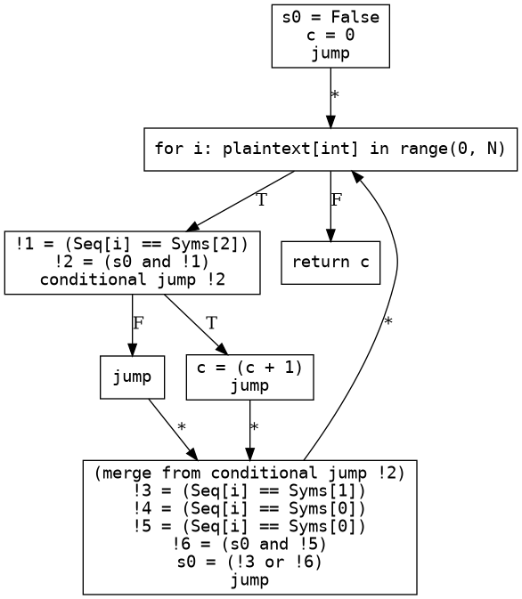
#### SSA
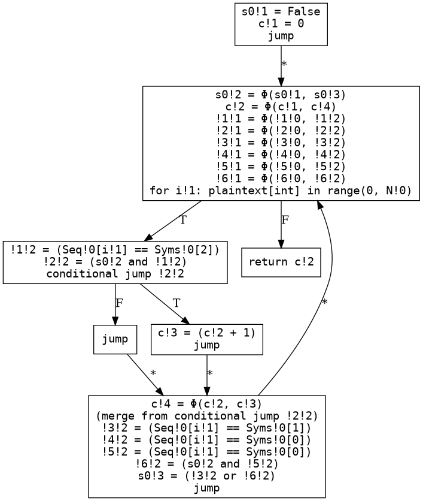
#### SSA ϕ→MUX
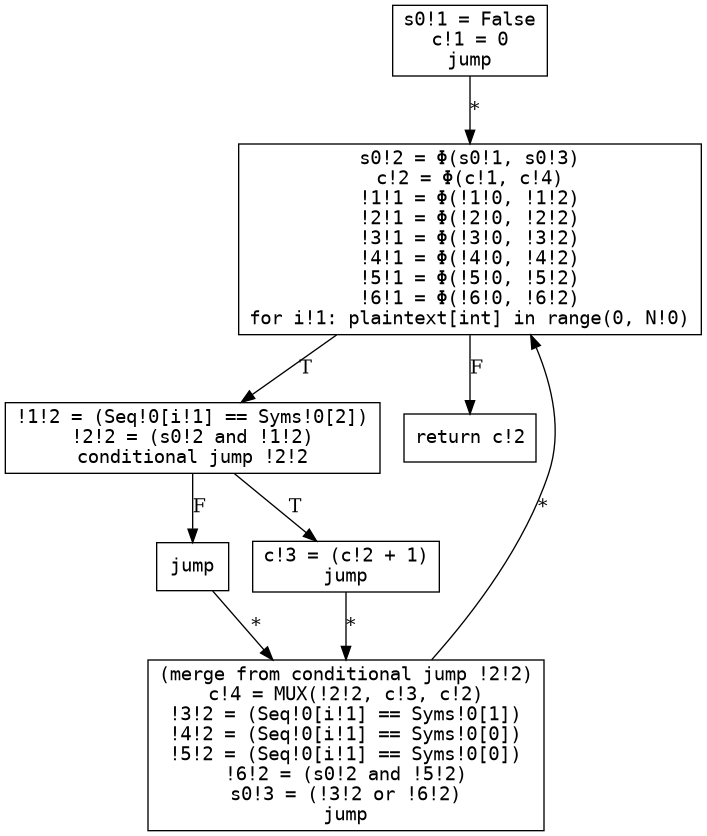
#### Dead code elimination
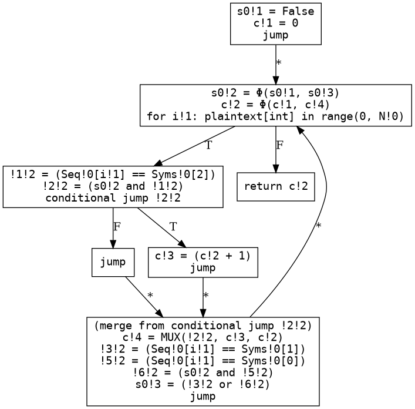
#### Linear code with loops
```python
def count_102(Seq!0: shared[list[int; ?]], N!0: plaintext[int], Syms!0: shared[list[int; ?]]) -> shared[int]:
    s0!1 = False
    c!1 = 0
    for i!1 in range(0, N!0):
        s0!2 = Φ(s0!1, s0!3)
        c!2 = Φ(c!1, c!4)
        !1!2 = (Seq!0[i!1] == Syms!0[2])
        !2!2 = (s0!2 and !1!2)
        c!3 = (c!2 + 1)
        c!4 = MUX(!2!2, c!3, c!2)
        !3!2 = (Seq!0[i!1] == Syms!0[1])
        !5!2 = (Seq!0[i!1] == Syms!0[0])
        !6!2 = (s0!2 and !5!2)
        s0!3 = (!3!2 or !6!2)
    return c!2
```
#### Dependency graph

#### Removal of infeasible edges
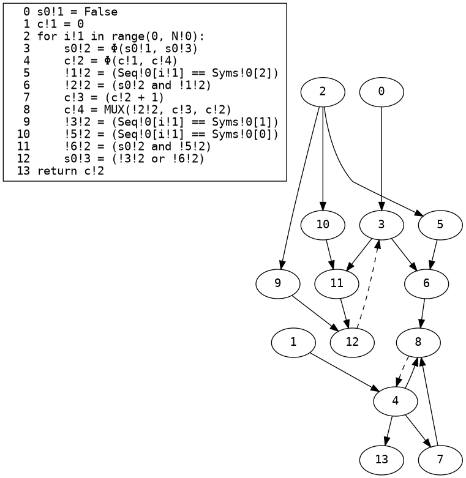
#### Type Environment Before Vectorization
| Variable | Type |
| - | - |
| `Seq!0` | `shared[list[int; ?]]` |
| `N!0` | `plaintext[int]` |
| `Syms!0` | `shared[list[int; ?]]` |
| `i!1` | `plaintext[int]` |
| `s0!3` | `shared[bool]` |
| `s0!2` | `shared[bool]` |
| `!6!2` | `shared[bool]` |
| `!2!2` | `shared[bool]` |
| `c!4` | `shared[int]` |
| `c!2` | `shared[int]` |
| `c!3` | `shared[int]` |
| `!5!2` | `shared[bool]` |
| `!3!2` | `shared[bool]` |
| `!1!2` | `shared[bool]` |
| `c!1` | `plaintext[int]` |
| `s0!1` | `plaintext[bool]` |
#### Basic Vectorization Phase 1
```python
def count_102(Seq!0: shared[list[int; ?]], N!0: plaintext[int], Syms!0: shared[list[int; ?]]) -> shared[int]:
    s0!1 = False
    c!1 = 0
    !7!0{N!0}[] = lift(s0!1, (i!1:N!0))
    !8!0{N!0}[] = lift(c!1, (i!1:N!0))
    !9!0{N!0}[] = lift(Seq!0[i!1], (i!1:N!0))
    !10!0{N!0}[] = lift(Syms!0[2], (i!1:N!0))
    !11!0{N!0}[] = lift(Seq!0[i!1], (i!1:N!0))
    !12!0{N!0}[] = lift(Syms!0[1], (i!1:N!0))
    !13!0{N!0}[] = lift(Seq!0[i!1], (i!1:N!0))
    !14!0{N!0}[] = lift(Syms!0[0], (i!1:N!0))
    for i!1 in range(0, N!0):
        s0!2{N!0}[] = Φ(!7!0{N!0}[], s0!3{N!0}[])
        c!2{N!0}[] = Φ(!8!0{N!0}[], c!4{N!0}[])
        !1!2{N!0}[] = (!9!0{N!0}[] == !10!0{N!0}[])
        !2!2{N!0}[] = (s0!2{N!0}[] and !1!2{N!0}[])
        c!3{N!0}[] = (c!2{N!0}[] + 1)
        c!4{N!0}[] = MUX(!2!2{N!0}[], c!3{N!0}[], c!2{N!0}[])
        !3!2{N!0}[] = (!11!0{N!0}[] == !12!0{N!0}[])
        !5!2{N!0}[] = (!13!0{N!0}[] == !14!0{N!0}[])
        !6!2{N!0}[] = (s0!2{N!0}[] and !5!2{N!0}[])
        s0!3{N!0}[] = (!3!2{N!0}[] or !6!2{N!0}[])
    !15!0 = drop_dim(c!4{N!0}[])
    return !15!0
```
#### Basic Vectorization Phase 1 (dependence graph)
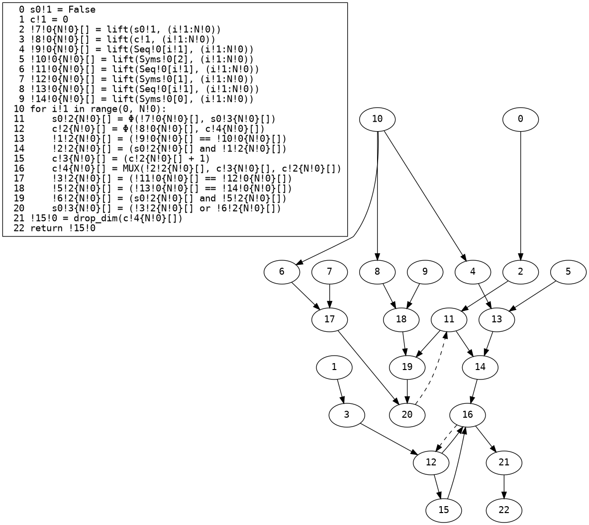
#### Basic Vectorization Phase 2
```python
def count_102(Seq!0: shared[list[int; ?]], N!0: plaintext[int], Syms!0: shared[list[int; ?]]) -> shared[int]:
    s0!1 = False
    c!1 = 0
    !9!0{N!0}[] = lift(Seq!0[i!1], (i!1:N!0))
    !10!0{N!0}[] = lift(Syms!0[2], (i!1:N!0))
    !11!0{N!0}[] = lift(Seq!0[i!1], (i!1:N!0))
    !12!0{N!0}[] = lift(Syms!0[1], (i!1:N!0))
    !13!0{N!0}[] = lift(Seq!0[i!1], (i!1:N!0))
    !14!0{N!0}[] = lift(Syms!0[0], (i!1:N!0))
    !7!0{N!0}[] = lift(s0!1, (i!1:N!0))
    !8!0{N!0}[] = lift(c!1, (i!1:N!0))
    !1!2{N!0}[] = (!9!0{N!0}[] == !10!0{N!0}[])
    !3!2{N!0}[] = (!11!0{N!0}[] == !12!0{N!0}[])
    !5!2{N!0}[] = (!13!0{N!0}[] == !14!0{N!0}[])
    for !16!0 in range(0, N!0): (monolithic)
        s0!2{}[!16!0] = Φ(!7!0{}[!16!0], s0!3{}[(!16!0 - 1)])
        !6!2{}[!16!0] = (s0!2{}[!16!0] and !5!2{}[!16!0])
        s0!3{}[!16!0] = (!3!2{}[!16!0] or !6!2{}[!16!0])
    !2!2{N!0}[] = (s0!2{N!0}[] and !1!2{N!0}[])
    for !17!0 in range(0, N!0): (monolithic)
        c!2{}[!17!0] = Φ(!8!0{}[!17!0], c!4{}[(!17!0 - 1)])
        c!3{}[!17!0] = (c!2{}[!17!0] + 1)
        c!4{}[!17!0] = MUX(!2!2{}[!17!0], c!3{}[!17!0], c!2{}[!17!0])
    !15!0 = drop_dim(c!4{N!0}[])
    return !15!0
```
#### Basic Vectorization Phase 2 (dependence graph)
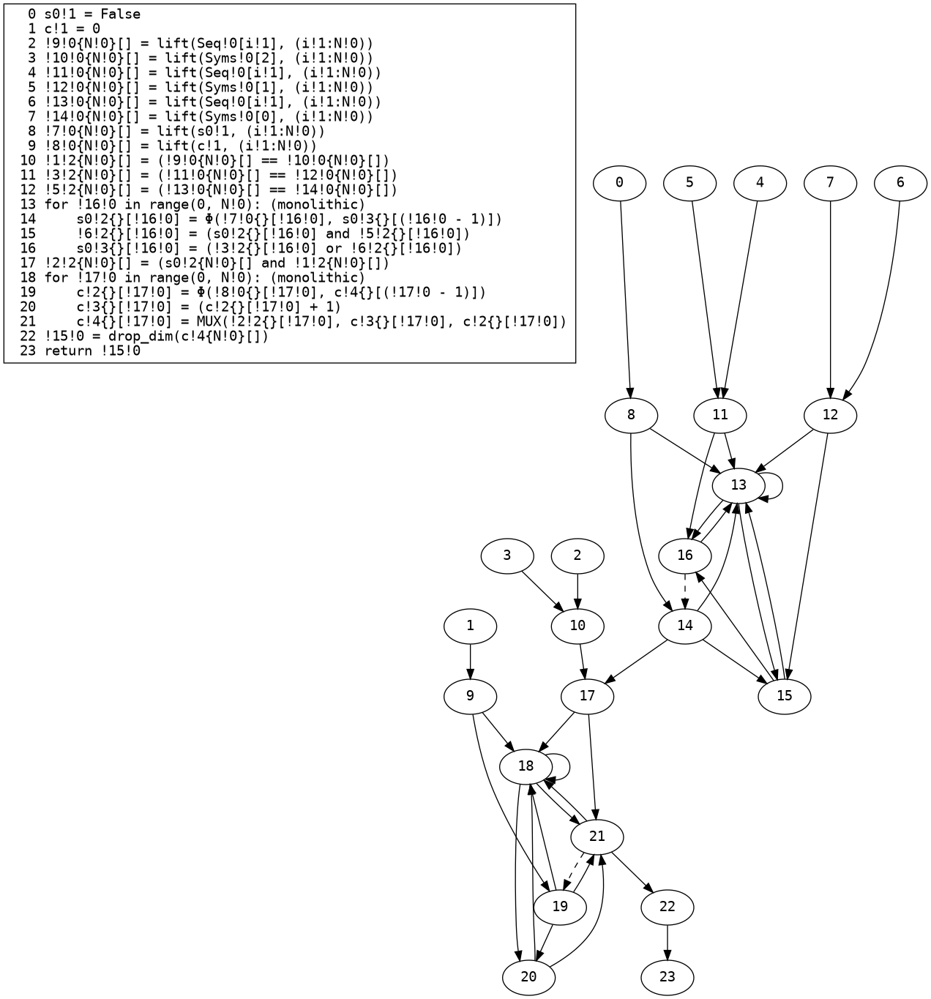
#### Type Environment After Vectorization
| Variable | Type |
| - | - |
| `Seq!0` | `shared[list[int; ?]]` |
| `N!0` | `plaintext[int]` |
| `Syms!0` | `shared[list[int; ?]]` |
| `!16!0` | `plaintext[int]` |
| `!17!0` | `plaintext[int]` |
| `!15!0` | `shared[int]` |
| `c!4` | `shared[list[int; (N!0)]]` |
| `c!2` | `shared[list[int; (N!0)]]` |
| `c!3` | `shared[list[int; (N!0)]]` |
| `!2!2` | `shared[list[bool; (N!0)]]` |
| `s0!3` | `shared[list[bool; (N!0)]]` |
| `s0!2` | `shared[list[bool; (N!0)]]` |
| `!6!2` | `shared[list[bool; (N!0)]]` |
| `!5!2` | `shared[list[bool; (N!0)]]` |
| `!3!2` | `shared[list[bool; (N!0)]]` |
| `!1!2` | `shared[list[bool; (N!0)]]` |
| `!8!0` | `shared[list[int; (N!0)]]` |
| `!7!0` | `shared[list[bool; (N!0)]]` |
| `!14!0` | `shared[list[int; (N!0)]]` |
| `!13!0` | `shared[list[int; (N!0)]]` |
| `!12!0` | `shared[list[int; (N!0)]]` |
| `!11!0` | `shared[list[int; (N!0)]]` |
| `!10!0` | `shared[list[int; (N!0)]]` |
| `!9!0` | `shared[list[int; (N!0)]]` |
| `c!1` | `plaintext[int]` |
| `s0!1` | `plaintext[bool]` |
#### Copy propagation
```python
def count_102(Seq!0: shared[list[int; ?]], N!0: plaintext[int], Syms!0: shared[list[int; ?]]) -> shared[int]:
    s0!1 = False
    c!1 = 0
    !9!0{N!0}[] = lift(Seq!0[i!1], (i!1:N!0))
    !10!0{N!0}[] = lift(Syms!0[2], (i!1:N!0))
    !11!0{N!0}[] = lift(Seq!0[i!1], (i!1:N!0))
    !12!0{N!0}[] = lift(Syms!0[1], (i!1:N!0))
    !13!0{N!0}[] = lift(Seq!0[i!1], (i!1:N!0))
    !14!0{N!0}[] = lift(Syms!0[0], (i!1:N!0))
    !7!0{N!0}[] = lift(s0!1, (i!1:N!0))
    !8!0{N!0}[] = lift(c!1, (i!1:N!0))
    !1!2{N!0}[] = (!9!0{N!0}[] == !10!0{N!0}[])
    !3!2{N!0}[] = (!11!0{N!0}[] == !12!0{N!0}[])
    !5!2{N!0}[] = (!13!0{N!0}[] == !14!0{N!0}[])
    for !16!0 in range(0, N!0): (monolithic)
        s0!2{}[!16!0] = Φ(!7!0{}[!16!0], s0!3{}[(!16!0 - 1)])
        !6!2{}[!16!0] = (s0!2{}[!16!0] and !5!2{}[!16!0])
        s0!3{}[!16!0] = (!3!2{}[!16!0] or !6!2{}[!16!0])
    !2!2{N!0}[] = (s0!2{N!0}[] and !1!2{N!0}[])
    for !17!0 in range(0, N!0): (monolithic)
        c!2{}[!17!0] = Φ(!8!0{}[!17!0], c!4{}[(!17!0 - 1)])
        c!3{}[!17!0] = (c!2{}[!17!0] + 1)
        c!4{}[!17!0] = MUX(!2!2{}[!17!0], c!3{}[!17!0], c!2{}[!17!0])
    !15!0 = drop_dim(c!4{N!0}[])
    return !15!0
```
#### Common subexpression elimination
```python
def count_102(Seq!0: shared[list[int; ?]], N!0: plaintext[int], Syms!0: shared[list[int; ?]]) -> shared[int]:
    s0!1 = False
    c!1 = 0
    !9!0{N!0}[] = lift(Seq!0[i!1], (i!1:N!0))
    !10!0{N!0}[] = lift(Syms!0[2], (i!1:N!0))
    !12!0{N!0}[] = lift(Syms!0[1], (i!1:N!0))
    !14!0{N!0}[] = lift(Syms!0[0], (i!1:N!0))
    !7!0{N!0}[] = lift(s0!1, (i!1:N!0))
    !8!0{N!0}[] = lift(c!1, (i!1:N!0))
    !1!2{N!0}[] = (!9!0{N!0}[] == !10!0{N!0}[])
    !3!2{N!0}[] = (!9!0{N!0}[] == !12!0{N!0}[])
    !5!2{N!0}[] = (!9!0{N!0}[] == !14!0{N!0}[])
    for !16!0 in range(0, N!0): (monolithic)
        s0!2{}[!16!0] = Φ(!7!0{}[!16!0], s0!3{}[(!16!0 - 1)])
        !6!2{}[!16!0] = (s0!2{}[!16!0] and !5!2{}[!16!0])
        s0!3{}[!16!0] = (!3!2{}[!16!0] or !6!2{}[!16!0])
    !2!2{N!0}[] = (s0!2{N!0}[] and !1!2{N!0}[])
    for !17!0 in range(0, N!0): (monolithic)
        c!2{}[!17!0] = Φ(!8!0{}[!17!0], c!4{}[(!17!0 - 1)])
        c!3{}[!17!0] = (c!2{}[!17!0] + 1)
        c!4{}[!17!0] = MUX(!2!2{}[!17!0], c!3{}[!17!0], c!2{}[!17!0])
    !15!0 = drop_dim(c!4{N!0}[])
    return !15!0
```
#### MOTION mixed configuration
```Total cost:	0.39447
Input vars:	{Syms!0: ['Y'], Seq!0: ['Y']}
Constants:	{False: ['Y'], 0: ['Y'], 1: ['Y']}
Plaintext vars:	{}
Flags:		{}
s0!1 = False: _ -> ['Y'] for 0.00000 * 1 = 0.00
c!1 = 0: _ -> ['Y'] for 0.00000 * 1 = 0.00
!9!0{N!0}[] = lift(Seq!0[i!1], (i!1:N!0)): _ -> ['Y'] for 0.00000 * 1 = 0.00
!10!0{N!0}[] = lift(Syms!0[2], (i!1:N!0)): _ -> ['Y'] for 0.00000 * 1 = 0.00
!12!0{N!0}[] = lift(Syms!0[1], (i!1:N!0)): _ -> ['Y'] for 0.00000 * 1 = 0.00
!14!0{N!0}[] = lift(Syms!0[0], (i!1:N!0)): _ -> ['Y'] for 0.00000 * 1 = 0.00
!7!0{N!0}[] = lift(s0!1, (i!1:N!0)): _ -> ['Y'] for 0.00000 * 1 = 0.00
!8!0{N!0}[] = lift(c!1, (i!1:N!0)): _ -> ['Y'] for 0.00000 * 1 = 0.00
!1!2{N!0}[] = (!9!0{N!0}[] == !10!0{N!0}[]): Y -> {} for 0.01475 * 1 = 0.01
!3!2{N!0}[] = (!9!0{N!0}[] == !12!0{N!0}[]): Y -> {} for 0.01475 * 1 = 0.01
!5!2{N!0}[] = (!9!0{N!0}[] == !14!0{N!0}[]): Y -> {} for 0.01475 * 1 = 0.01
	s0!2{}[!16!0] = Φ(!7!0{}[!16!0], s0!3{}[(!16!0 - 1)]): Y -> {} for 0.00000 * 10 = 0.00
	!6!2{}[!16!0] = (s0!2{}[!16!0] and !5!2{}[!16!0]): Y -> {} for 0.00245 * 10 = 0.02
	s0!3{}[!16!0] = (!3!2{}[!16!0] or !6!2{}[!16!0]): Y -> {} for 0.00282 * 10 = 0.03
!2!2{N!0}[] = (s0!2{N!0}[] and !1!2{N!0}[]): Y -> {} for 0.00269 * 1 = 0.00
	c!2{}[!17!0] = Φ(!8!0{}[!17!0], c!4{}[(!17!0 - 1)]): Y -> {} for 0.00000 * 10 = 0.00
	c!3{}[!17!0] = (c!2{}[!17!0] + 1): Y -> {} for 0.02351 * 10 = 0.24
	c!4{}[!17!0] = MUX(!2!2{}[!17!0], c!3{}[!17!0], c!2{}[!17!0]): Y -> {} for 0.00597 * 10 = 0.06
!15!0 = drop_dim(c!4{N!0}[]): _ -> ['Y'] for 0.00000 * 1 = 0.00
return !15!0
Output vars:	{!15!0: ['Y']}

```
#### MOTION code
```cpp
template <encrypto::motion::MpcProtocol Protocol>
encrypto::motion::SecureUnsignedInteger count_102(
    encrypto::motion::PartyPointer &party,
    std::vector<encrypto::motion::SecureUnsignedInteger> Seq_0,
    std::uint32_t _MPC_PLAINTEXT_N_0,
    std::vector<encrypto::motion::SecureUnsignedInteger> Syms_0
) {
    // Shared variable declarations
    std::vector<encrypto::motion::ShareWrapper> _1_2((_MPC_PLAINTEXT_N_0));
    std::vector<encrypto::motion::SecureUnsignedInteger> _10_0((_MPC_PLAINTEXT_N_0));
    std::vector<encrypto::motion::SecureUnsignedInteger> _12_0((_MPC_PLAINTEXT_N_0));
    std::vector<encrypto::motion::SecureUnsignedInteger> _14_0((_MPC_PLAINTEXT_N_0));
    encrypto::motion::SecureUnsignedInteger _15_0;
    encrypto::motion::SecureUnsignedInteger _16_0;
    encrypto::motion::SecureUnsignedInteger _17_0;
    std::vector<encrypto::motion::ShareWrapper> _2_2((_MPC_PLAINTEXT_N_0));
    std::vector<encrypto::motion::ShareWrapper> _3_2((_MPC_PLAINTEXT_N_0));
    std::vector<encrypto::motion::ShareWrapper> _5_2((_MPC_PLAINTEXT_N_0));
    std::vector<encrypto::motion::ShareWrapper> _6_2((_MPC_PLAINTEXT_N_0));
    std::vector<encrypto::motion::ShareWrapper> _7_0((_MPC_PLAINTEXT_N_0));
    std::vector<encrypto::motion::SecureUnsignedInteger> _8_0((_MPC_PLAINTEXT_N_0));
    std::vector<encrypto::motion::SecureUnsignedInteger> _9_0((_MPC_PLAINTEXT_N_0));
    encrypto::motion::SecureUnsignedInteger N_0;
    encrypto::motion::SecureUnsignedInteger c_1;
    std::vector<encrypto::motion::SecureUnsignedInteger> c_2((_MPC_PLAINTEXT_N_0));
    std::vector<encrypto::motion::SecureUnsignedInteger> c_3((_MPC_PLAINTEXT_N_0));
    std::vector<encrypto::motion::SecureUnsignedInteger> c_4((_MPC_PLAINTEXT_N_0));
    encrypto::motion::ShareWrapper s0_1;
    std::vector<encrypto::motion::ShareWrapper> s0_2((_MPC_PLAINTEXT_N_0));
    std::vector<encrypto::motion::ShareWrapper> s0_3((_MPC_PLAINTEXT_N_0));

    // Plaintext variable declarations
    std::uint32_t _MPC_PLAINTEXT__16_0;
    std::uint32_t _MPC_PLAINTEXT__17_0;
    std::uint32_t _MPC_PLAINTEXT_c_1;
    bool _MPC_PLAINTEXT_s0_1;

    // Constant initializations
    encrypto::motion::SecureUnsignedInteger _MPC_CONSTANT_0 = party->In<Protocol>(encrypto::motion::ToInput(std::uint32_t(0)), 0);
    encrypto::motion::SecureUnsignedInteger _MPC_CONSTANT_1 = party->In<Protocol>(encrypto::motion::ToInput(std::uint32_t(1)), 0);
    encrypto::motion::ShareWrapper _MPC_CONSTANT_false = party->In<Protocol>(encrypto::motion::BitVector(1, false), 0);

    // Plaintext parameter assignments
    N_0 = party->In<Protocol>(encrypto::motion::ToInput(_MPC_PLAINTEXT_N_0), 0);

    // Function body
    s0_1 = _MPC_CONSTANT_false;
    _MPC_PLAINTEXT_s0_1 = false;
    c_1 = _MPC_CONSTANT_0;
    _MPC_PLAINTEXT_c_1 = std::uint32_t(0);
    vectorized_assign(_9_0, {_MPC_PLAINTEXT_N_0}, {true}, {}, lift(std::function([&](const std::vector<std::uint32_t> &indices){return Seq_0[indices[0]];}), {_MPC_PLAINTEXT_N_0}));
    vectorized_assign(_10_0, {_MPC_PLAINTEXT_N_0}, {true}, {}, lift(std::function([&](const std::vector<std::uint32_t> &indices){return Syms_0[std::uint32_t(2)];}), {_MPC_PLAINTEXT_N_0}));
    vectorized_assign(_12_0, {_MPC_PLAINTEXT_N_0}, {true}, {}, lift(std::function([&](const std::vector<std::uint32_t> &indices){return Syms_0[std::uint32_t(1)];}), {_MPC_PLAINTEXT_N_0}));
    vectorized_assign(_14_0, {_MPC_PLAINTEXT_N_0}, {true}, {}, lift(std::function([&](const std::vector<std::uint32_t> &indices){return Syms_0[std::uint32_t(0)];}), {_MPC_PLAINTEXT_N_0}));
    vectorized_assign(_7_0, {_MPC_PLAINTEXT_N_0}, {true}, {}, lift(std::function([&](const std::vector<std::uint32_t> &indices){return s0_1;}), {_MPC_PLAINTEXT_N_0}));
    vectorized_assign(_8_0, {_MPC_PLAINTEXT_N_0}, {true}, {}, lift(std::function([&](const std::vector<std::uint32_t> &indices){return c_1;}), {_MPC_PLAINTEXT_N_0}));
    vectorized_assign(_1_2, {_MPC_PLAINTEXT_N_0}, {true}, {}, (to_share_wrapper(vectorized_access(_9_0, {_MPC_PLAINTEXT_N_0}, {true}, {})) == to_share_wrapper(vectorized_access(_10_0, {_MPC_PLAINTEXT_N_0}, {true}, {}))));
    vectorized_assign(_3_2, {_MPC_PLAINTEXT_N_0}, {true}, {}, (to_share_wrapper(vectorized_access(_9_0, {_MPC_PLAINTEXT_N_0}, {true}, {})) == to_share_wrapper(vectorized_access(_12_0, {_MPC_PLAINTEXT_N_0}, {true}, {}))));
    vectorized_assign(_5_2, {_MPC_PLAINTEXT_N_0}, {true}, {}, (to_share_wrapper(vectorized_access(_9_0, {_MPC_PLAINTEXT_N_0}, {true}, {})) == to_share_wrapper(vectorized_access(_14_0, {_MPC_PLAINTEXT_N_0}, {true}, {}))));

    // Initialize loop counter
    _MPC_PLAINTEXT__16_0 = std::uint32_t(0);
    // Initialize phi values
    s0_2[_MPC_PLAINTEXT__16_0] = _7_0[_MPC_PLAINTEXT__16_0];
    for (; _MPC_PLAINTEXT__16_0 < _MPC_PLAINTEXT_N_0; _MPC_PLAINTEXT__16_0++) {
        // Update phi values
        if (_MPC_PLAINTEXT__16_0 != std::uint32_t(0)) {
            s0_2[_MPC_PLAINTEXT__16_0] = s0_3[(_MPC_PLAINTEXT__16_0 - std::uint32_t(1))];
        }

        _6_2[_MPC_PLAINTEXT__16_0] = (to_share_wrapper(s0_2[_MPC_PLAINTEXT__16_0]) & to_share_wrapper(_5_2[_MPC_PLAINTEXT__16_0]));
        s0_3[_MPC_PLAINTEXT__16_0] = (to_share_wrapper(_3_2[_MPC_PLAINTEXT__16_0]) | to_share_wrapper(_6_2[_MPC_PLAINTEXT__16_0]));

    }

    vectorized_assign(_2_2, {_MPC_PLAINTEXT_N_0}, {true}, {}, (to_share_wrapper(vectorized_access(s0_2, {_MPC_PLAINTEXT_N_0}, {true}, {})) & to_share_wrapper(vectorized_access(_1_2, {_MPC_PLAINTEXT_N_0}, {true}, {}))));

    // Initialize loop counter
    _MPC_PLAINTEXT__17_0 = std::uint32_t(0);
    // Initialize phi values
    c_2[_MPC_PLAINTEXT__17_0] = _8_0[_MPC_PLAINTEXT__17_0];
    for (; _MPC_PLAINTEXT__17_0 < _MPC_PLAINTEXT_N_0; _MPC_PLAINTEXT__17_0++) {
        // Update phi values
        if (_MPC_PLAINTEXT__17_0 != std::uint32_t(0)) {
            c_2[_MPC_PLAINTEXT__17_0] = c_4[(_MPC_PLAINTEXT__17_0 - std::uint32_t(1))];
        }

        c_3[_MPC_PLAINTEXT__17_0] = (c_2[_MPC_PLAINTEXT__17_0] + _MPC_CONSTANT_1);
        c_4[_MPC_PLAINTEXT__17_0] = _2_2[_MPC_PLAINTEXT__17_0].Mux(c_3[_MPC_PLAINTEXT__17_0].Get(), c_2[_MPC_PLAINTEXT__17_0].Get());

    }

    _15_0 = drop_dim_monoreturn(vectorized_access(c_4, {_MPC_PLAINTEXT_N_0}, {true}, {}).Unsimdify(), {_MPC_PLAINTEXT_N_0});
    return _15_0;

}
```
#### MOTION mixed code
```cpp
encrypto::motion::SecureUnsignedInteger count_102(
    encrypto::motion::PartyPointer &party,
    std::vector<encrypto::motion::SecureUnsignedInteger> Seq_0,
    std::uint32_t _MPC_PLAINTEXT_N_0,
    std::vector<encrypto::motion::SecureUnsignedInteger> Syms_0
) {
    // Shared variable declarations
    std::vector<encrypto::motion::ShareWrapper> _1_2((_MPC_PLAINTEXT_N_0));
    std::vector<encrypto::motion::SecureUnsignedInteger> _10_0((_MPC_PLAINTEXT_N_0));
    std::vector<encrypto::motion::SecureUnsignedInteger> _12_0((_MPC_PLAINTEXT_N_0));
    std::vector<encrypto::motion::SecureUnsignedInteger> _14_0((_MPC_PLAINTEXT_N_0));
    encrypto::motion::SecureUnsignedInteger _15_0;
    encrypto::motion::SecureUnsignedInteger _16_0;
    encrypto::motion::SecureUnsignedInteger _17_0;
    std::vector<encrypto::motion::ShareWrapper> _2_2((_MPC_PLAINTEXT_N_0));
    std::vector<encrypto::motion::ShareWrapper> _3_2((_MPC_PLAINTEXT_N_0));
    std::vector<encrypto::motion::ShareWrapper> _5_2((_MPC_PLAINTEXT_N_0));
    std::vector<encrypto::motion::ShareWrapper> _6_2((_MPC_PLAINTEXT_N_0));
    std::vector<encrypto::motion::ShareWrapper> _7_0((_MPC_PLAINTEXT_N_0));
    std::vector<encrypto::motion::SecureUnsignedInteger> _8_0((_MPC_PLAINTEXT_N_0));
    std::vector<encrypto::motion::SecureUnsignedInteger> _9_0((_MPC_PLAINTEXT_N_0));
    encrypto::motion::SecureUnsignedInteger N_0;
    encrypto::motion::SecureUnsignedInteger c_1;
    std::vector<encrypto::motion::SecureUnsignedInteger> c_2((_MPC_PLAINTEXT_N_0));
    std::vector<encrypto::motion::SecureUnsignedInteger> c_3((_MPC_PLAINTEXT_N_0));
    std::vector<encrypto::motion::SecureUnsignedInteger> c_4((_MPC_PLAINTEXT_N_0));
    encrypto::motion::ShareWrapper s0_1;
    std::vector<encrypto::motion::ShareWrapper> s0_2((_MPC_PLAINTEXT_N_0));
    std::vector<encrypto::motion::ShareWrapper> s0_3((_MPC_PLAINTEXT_N_0));

    // Plaintext variable declarations
    std::uint32_t _MPC_PLAINTEXT__16_0;
    std::uint32_t _MPC_PLAINTEXT__17_0;
    std::uint32_t _MPC_PLAINTEXT_c_1;
    bool _MPC_PLAINTEXT_s0_1;

    // Constant initializations
    encrypto::motion::SecureUnsignedInteger _MPC_CONSTANT_0 = party->In<encrypto::motion::MpcProtocol::kBmr>(encrypto::motion::ToInput(std::uint32_t(0)), 0);
    encrypto::motion::SecureUnsignedInteger _MPC_CONSTANT_1 = party->In<encrypto::motion::MpcProtocol::kBmr>(encrypto::motion::ToInput(std::uint32_t(1)), 0);
    encrypto::motion::ShareWrapper _MPC_CONSTANT_false = party->In<encrypto::motion::MpcProtocol::kBmr>(encrypto::motion::BitVector(1, false), 0);

    // Input Protocol Convertions

    // Plaintext parameter assignments

    // Function body
    s0_1 = _MPC_CONSTANT_false;
    _MPC_PLAINTEXT_s0_1 = false;
    c_1 = _MPC_CONSTANT_0;
    _MPC_PLAINTEXT_c_1 = std::uint32_t(0);
    vectorized_assign(_9_0, {_MPC_PLAINTEXT_N_0}, {true}, {}, lift(std::function([&](const std::vector<std::uint32_t> &indices){return Seq_0[indices[0]];}), {_MPC_PLAINTEXT_N_0}));
    vectorized_assign(_10_0, {_MPC_PLAINTEXT_N_0}, {true}, {}, lift(std::function([&](const std::vector<std::uint32_t> &indices){return Syms_0[std::uint32_t(2)];}), {_MPC_PLAINTEXT_N_0}));
    vectorized_assign(_12_0, {_MPC_PLAINTEXT_N_0}, {true}, {}, lift(std::function([&](const std::vector<std::uint32_t> &indices){return Syms_0[std::uint32_t(1)];}), {_MPC_PLAINTEXT_N_0}));
    vectorized_assign(_14_0, {_MPC_PLAINTEXT_N_0}, {true}, {}, lift(std::function([&](const std::vector<std::uint32_t> &indices){return Syms_0[std::uint32_t(0)];}), {_MPC_PLAINTEXT_N_0}));
    vectorized_assign(_7_0, {_MPC_PLAINTEXT_N_0}, {true}, {}, lift(std::function([&](const std::vector<std::uint32_t> &indices){return s0_1;}), {_MPC_PLAINTEXT_N_0}));
    vectorized_assign(_8_0, {_MPC_PLAINTEXT_N_0}, {true}, {}, lift(std::function([&](const std::vector<std::uint32_t> &indices){return c_1;}), {_MPC_PLAINTEXT_N_0}));
    vectorized_assign(_1_2, {_MPC_PLAINTEXT_N_0}, {true}, {}, (to_share_wrapper(vectorized_access(_9_0, {_MPC_PLAINTEXT_N_0}, {true}, {})) == to_share_wrapper(vectorized_access(_10_0, {_MPC_PLAINTEXT_N_0}, {true}, {}))));
    vectorized_assign(_3_2, {_MPC_PLAINTEXT_N_0}, {true}, {}, (to_share_wrapper(vectorized_access(_9_0, {_MPC_PLAINTEXT_N_0}, {true}, {})) == to_share_wrapper(vectorized_access(_12_0, {_MPC_PLAINTEXT_N_0}, {true}, {}))));
    vectorized_assign(_5_2, {_MPC_PLAINTEXT_N_0}, {true}, {}, (to_share_wrapper(vectorized_access(_9_0, {_MPC_PLAINTEXT_N_0}, {true}, {})) == to_share_wrapper(vectorized_access(_14_0, {_MPC_PLAINTEXT_N_0}, {true}, {}))));

    // Initialize loop counter
    _MPC_PLAINTEXT__16_0 = std::uint32_t(0);
    // Initialize phi values
    s0_2[_MPC_PLAINTEXT__16_0] = _7_0[_MPC_PLAINTEXT__16_0];
    for (; _MPC_PLAINTEXT__16_0 < _MPC_PLAINTEXT_N_0; _MPC_PLAINTEXT__16_0++) {
        // Update phi values
        if (_MPC_PLAINTEXT__16_0 != std::uint32_t(0)) {
            s0_2[_MPC_PLAINTEXT__16_0] = s0_3[(_MPC_PLAINTEXT__16_0 - std::uint32_t(1))];
        }

        _6_2[_MPC_PLAINTEXT__16_0] = (to_share_wrapper(s0_2[_MPC_PLAINTEXT__16_0]) & to_share_wrapper(_5_2[_MPC_PLAINTEXT__16_0]));
        s0_3[_MPC_PLAINTEXT__16_0] = (to_share_wrapper(_3_2[_MPC_PLAINTEXT__16_0]) | to_share_wrapper(_6_2[_MPC_PLAINTEXT__16_0]));

    }

    vectorized_assign(_2_2, {_MPC_PLAINTEXT_N_0}, {true}, {}, (to_share_wrapper(vectorized_access(s0_2, {_MPC_PLAINTEXT_N_0}, {true}, {})) & to_share_wrapper(vectorized_access(_1_2, {_MPC_PLAINTEXT_N_0}, {true}, {}))));

    // Initialize loop counter
    _MPC_PLAINTEXT__17_0 = std::uint32_t(0);
    // Initialize phi values
    c_2[_MPC_PLAINTEXT__17_0] = _8_0[_MPC_PLAINTEXT__17_0];
    for (; _MPC_PLAINTEXT__17_0 < _MPC_PLAINTEXT_N_0; _MPC_PLAINTEXT__17_0++) {
        // Update phi values
        if (_MPC_PLAINTEXT__17_0 != std::uint32_t(0)) {
            c_2[_MPC_PLAINTEXT__17_0] = c_4[(_MPC_PLAINTEXT__17_0 - std::uint32_t(1))];
        }

        c_3[_MPC_PLAINTEXT__17_0] = (c_2[_MPC_PLAINTEXT__17_0] + _MPC_CONSTANT_1);
        c_4[_MPC_PLAINTEXT__17_0] = _2_2[_MPC_PLAINTEXT__17_0].Mux(c_3[_MPC_PLAINTEXT__17_0].Get(), c_2[_MPC_PLAINTEXT__17_0].Get());

    }

    _15_0 = drop_dim_monoreturn(vectorized_access(c_4, {_MPC_PLAINTEXT_N_0}, {true}, {}).Unsimdify(), {_MPC_PLAINTEXT_N_0});
    return _15_0;

}
```
#### MP-SPDZ mixed configuration
```Total cost:	0.00026
Input vars:	{Syms!0: ['B'], Seq!0: ['B']}
Constants:	{False: ['B'], 0: ['B'], 1: ['B']}
Plaintext vars:	{}
Flags:		{X}
s0!1 = False: _ -> ['B'] for 0.00000 * 1 = 0.00
c!1 = 0: _ -> ['B'] for 0.00000 * 1 = 0.00
!9!0{N!0}[] = lift(Seq!0[i!1], (i!1:N!0)): _ -> ['B'] for 0.00000 * 1 = 0.00
!10!0{N!0}[] = lift(Syms!0[2], (i!1:N!0)): _ -> ['B'] for 0.00000 * 1 = 0.00
!12!0{N!0}[] = lift(Syms!0[1], (i!1:N!0)): _ -> ['B'] for 0.00000 * 1 = 0.00
!14!0{N!0}[] = lift(Syms!0[0], (i!1:N!0)): _ -> ['B'] for 0.00000 * 1 = 0.00
!7!0{N!0}[] = lift(s0!1, (i!1:N!0)): _ -> ['B'] for 0.00000 * 1 = 0.00
!8!0{N!0}[] = lift(c!1, (i!1:N!0)): _ -> ['B'] for 0.00000 * 1 = 0.00
!1!2{N!0}[] = (!9!0{N!0}[] == !10!0{N!0}[]): B -> {} for 0.00006 * 1 = 0.00
!3!2{N!0}[] = (!9!0{N!0}[] == !12!0{N!0}[]): B -> {} for 0.00006 * 1 = 0.00
!5!2{N!0}[] = (!9!0{N!0}[] == !14!0{N!0}[]): B -> {} for 0.00006 * 1 = 0.00
	s0!2{}[!16!0] = Φ(!7!0{}[!16!0], s0!3{}[(!16!0 - 1)]): B -> {} for 0.00000 * 10 = 0.00
	!6!2{}[!16!0] = (s0!2{}[!16!0] and !5!2{}[!16!0]): B -> {} for 0.00000 * 10 = 0.00
	s0!3{}[!16!0] = (!3!2{}[!16!0] or !6!2{}[!16!0]): B -> {} for 0.00000 * 10 = 0.00
!2!2{N!0}[] = (s0!2{N!0}[] and !1!2{N!0}[]): B -> {} for 0.00000 * 1 = 0.00
	c!2{}[!17!0] = Φ(!8!0{}[!17!0], c!4{}[(!17!0 - 1)]): B -> {} for 0.00000 * 10 = 0.00
	c!3{}[!17!0] = (c!2{}[!17!0] + 1): B -> {} for 0.00001 * 10 = 0.00
	c!4{}[!17!0] = MUX(!2!2{}[!17!0], c!3{}[!17!0], c!2{}[!17!0]): B -> {} for 0.00000 * 10 = 0.00
!15!0 = drop_dim(c!4{N!0}[]): _ -> ['B'] for 0.00000 * 1 = 0.00
return !15!0
Output vars:	{!15!0: ['B']}

```
#### MP-SPDZ code
```py
def count_102(Seq_0, N_0, Syms_0):
    # Shared array declarations
    _1_2 = [None] * (N_0)
    _10_0 = [None] * (N_0)
    _12_0 = [None] * (N_0)
    _14_0 = [None] * (N_0)
    _2_2 = [None] * (N_0)
    _3_2 = [None] * (N_0)
    _5_2 = [None] * (N_0)
    _6_2 = [None] * (N_0)
    _7_0 = [None] * (N_0)
    _8_0 = [None] * (N_0)
    _9_0 = [None] * (N_0)
    c_2 = [None] * (N_0)
    c_3 = [None] * (N_0)
    c_4 = [None] * (N_0)
    s0_2 = [None] * (N_0)
    s0_3 = [None] * (N_0)
    # Function body
    s0_1 = _v.sbool(False)
    c_1 = sint(0)
    _9_0 = _v.lift(lambda indices: (Seq_0[indices[0]]), [N_0])
    _10_0 = _v.lift(lambda indices: (Syms_0[2]), [N_0])
    _12_0 = _v.lift(lambda indices: (Syms_0[1]), [N_0])
    _14_0 = _v.lift(lambda indices: (Syms_0[0]), [N_0])
    _7_0 = _v.lift(lambda indices: s0_1, [N_0])
    _8_0 = _v.lift(lambda indices: c_1, [N_0])
    _v.vectorized_assign(_1_2, [N_0], [None], (_v.vectorized_access_simd(_9_0, [N_0], [None]) == _v.vectorized_access_simd(_10_0, [N_0], [None])))
    _v.vectorized_assign(_3_2, [N_0], [None], (_v.vectorized_access_simd(_9_0, [N_0], [None]) == _v.vectorized_access_simd(_12_0, [N_0], [None])))
    _v.vectorized_assign(_5_2, [N_0], [None], (_v.vectorized_access_simd(_9_0, [N_0], [None]) == _v.vectorized_access_simd(_14_0, [N_0], [None])))
    for _16_0 in range(0, N_0):
        # Set ϕ value
        if _16_0 == 0:
            _v.vectorized_assign(s0_2, [N_0], [_16_0], _v.vectorized_access(_7_0, [N_0], [_16_0]))
        else:
            _v.vectorized_assign(s0_2, [N_0], [_16_0], _v.vectorized_access(s0_3, [N_0], [(_16_0 - 1)]))
        _v.vectorized_assign(_6_2, [N_0], [_16_0], _v.vectorized_access_simd(s0_2, [N_0], [_16_0]).bit_and(_v.vectorized_access_simd(_5_2, [N_0], [_16_0])))
        _v.vectorized_assign(s0_3, [N_0], [_16_0], OR(_v.vectorized_access_simd(_3_2, [N_0], [_16_0]), _v.vectorized_access_simd(_6_2, [N_0], [_16_0])))
    # Loop exit ϕ values
    _v.vectorized_assign(s0_2, [N_0], [_16_0], _v.vectorized_access(s0_3, [N_0], [(_16_0 - 1)]))
    _v.vectorized_assign(_2_2, [N_0], [None], _v.vectorized_access_simd(s0_2, [N_0], [None]).bit_and(_v.vectorized_access_simd(_1_2, [N_0], [None])))
    for _17_0 in range(0, N_0):
        # Set ϕ value
        if _17_0 == 0:
            _v.vectorized_assign(c_2, [N_0], [_17_0], _v.vectorized_access(_8_0, [N_0], [_17_0]))
        else:
            _v.vectorized_assign(c_2, [N_0], [_17_0], _v.vectorized_access(c_4, [N_0], [(_17_0 - 1)]))
        _v.vectorized_assign(c_3, [N_0], [_17_0], (_v.vectorized_access_simd(c_2, [N_0], [_17_0]) + sint(1)))
        _v.iterative_mux(c_4,_2_2,c_3,c_2,[N_0],[_17_0])
    # Loop exit ϕ values
    _v.vectorized_assign(c_2, [N_0], [_17_0], _v.vectorized_access(c_4, [N_0], [(_17_0 - 1)]))
    _15_0 = _v.drop_dim(c_4, [N_0])
    return _15_0
```
#### MP-SPDZ mixed code
```py
program.options.binary = 32
program.use_dabit = True
def count_102(Seq_0, N_0, Syms_0):
    # Convertion functions
    siv32 = sbitintvec.get_type(32)
    sb32 = sbits.get_type(32)
    
    
    # Shared array declarations
    _1_2 = [None] * (N_0)
    _10_0 = [None] * (N_0)
    _12_0 = [None] * (N_0)
    _14_0 = [None] * (N_0)
    _2_2 = [None] * (N_0)
    _3_2 = [None] * (N_0)
    _5_2 = [None] * (N_0)
    _6_2 = [None] * (N_0)
    _7_0 = [None] * (N_0)
    _8_0 = [None] * (N_0)
    _9_0 = [None] * (N_0)
    c_2 = [None] * (N_0)
    c_3 = [None] * (N_0)
    c_4 = [None] * (N_0)
    s0_2 = [None] * (N_0)
    s0_3 = [None] * (N_0)
    # Shared array convertion declarations
    
    # Function body
    s0_1 = sbit(0)
    c_1 = siv32(0)
    _9_0 = _v.lift(lambda indices: (Seq_0[indices[0]]), [N_0])
    _10_0 = _v.lift(lambda indices: (Syms_0[2]), [N_0])
    _12_0 = _v.lift(lambda indices: (Syms_0[1]), [N_0])
    _14_0 = _v.lift(lambda indices: (Syms_0[0]), [N_0])
    _7_0 = _v.lift(lambda indices: s0_1, [N_0])
    _8_0 = _v.lift(lambda indices: c_1, [N_0])
    _v.vectorized_assign(_1_2, [N_0], [None], (_v.vectorized_access_simd(_9_0, [N_0], [None]) == _v.vectorized_access_simd(_10_0, [N_0], [None])))
    _v.vectorized_assign(_3_2, [N_0], [None], (_v.vectorized_access_simd(_9_0, [N_0], [None]) == _v.vectorized_access_simd(_12_0, [N_0], [None])))
    _v.vectorized_assign(_5_2, [N_0], [None], (_v.vectorized_access_simd(_9_0, [N_0], [None]) == _v.vectorized_access_simd(_14_0, [N_0], [None])))
    for _16_0 in range(0, N_0):
        # Set ϕ value
        if _16_0 == 0:
            _v.vectorized_assign(s0_2, [N_0], [_16_0], _v.vectorized_access(_7_0, [N_0], [_16_0]))
        else:
            _v.vectorized_assign(s0_2, [N_0], [_16_0], _v.vectorized_access(s0_3, [N_0], [(_16_0 - 1)]))
        _v.vectorized_assign(_6_2, [N_0], [_16_0], _v.vectorized_access_simd(s0_2, [N_0], [_16_0]).bit_and(_v.vectorized_access_simd(_5_2, [N_0], [_16_0])))
        _v.vectorized_assign(s0_3, [N_0], [_16_0], OR(_v.vectorized_access_simd(_3_2, [N_0], [_16_0]), _v.vectorized_access_simd(_6_2, [N_0], [_16_0])))
    # Loop exit ϕ values
    _v.vectorized_assign(s0_2, [N_0], [_16_0], _v.vectorized_access(s0_3, [N_0], [(_16_0 - 1)]))
    _v.vectorized_assign(_2_2, [N_0], [None], _v.vectorized_access_simd(s0_2, [N_0], [None]).bit_and(_v.vectorized_access_simd(_1_2, [N_0], [None])))
    for _17_0 in range(0, N_0):
        # Set ϕ value
        if _17_0 == 0:
            _v.vectorized_assign(c_2, [N_0], [_17_0], _v.vectorized_access(_8_0, [N_0], [_17_0]))
        else:
            _v.vectorized_assign(c_2, [N_0], [_17_0], _v.vectorized_access(c_4, [N_0], [(_17_0 - 1)]))
        _v.vectorized_assign(c_3, [N_0], [_17_0], (_v.vectorized_access_simd(c_2, [N_0], [_17_0]) + siv32(1)))
        _v.iterative_mux(c_4,_2_2,c_3,c_2,[N_0],[_17_0])
    # Loop exit ϕ values
    _v.vectorized_assign(c_2, [N_0], [_17_0], _v.vectorized_access(c_4, [N_0], [(_17_0 - 1)]))
    _15_0 = _v.drop_dim(c_4, [N_0])
    return _15_0
```
### `count_10s`
#### Input
```python
from UTIL import shared


def count_10s(Seq: shared[list[int]], N: int, Syms: shared[list[int]]) -> shared[int]:
    """
    Computes the number of instances of regex a(b+) in a provided sequence.
    Syms is a list of form [a, b].
    """
    s0 = False
    s1 = False
    scount = 0

    for i in range(0, N):
        if s1 and (Seq[i] != Syms[0]):
            scount = scount + 1

        s1 = (Seq[i] == Syms[0]) and (s0 or s1)
        s0 = Seq[i] == Syms[1]

    return scount


Seq = [1, 0, 0, 1, 1, 0, 2]
N = 7
Syms = [0, 1]
print(count_10s(Seq, N, Syms))

```
#### Restricted AST
```python
def count_10s(Seq: shared[list[int; ?]], N: plaintext[int], Syms: shared[list[int; ?]]) -> shared[int]:
    s0 = False
    s1 = False
    scount = 0
    for i: plaintext[int] in range(0, N):
        if (s1 and (Seq[i] != Syms[0])):
            scount = (scount + 1)
        s1 = ((Seq[i] == Syms[0]) and (s0 or s1))
        s0 = (Seq[i] == Syms[1])
    return scount
```
#### Three-address code CFG
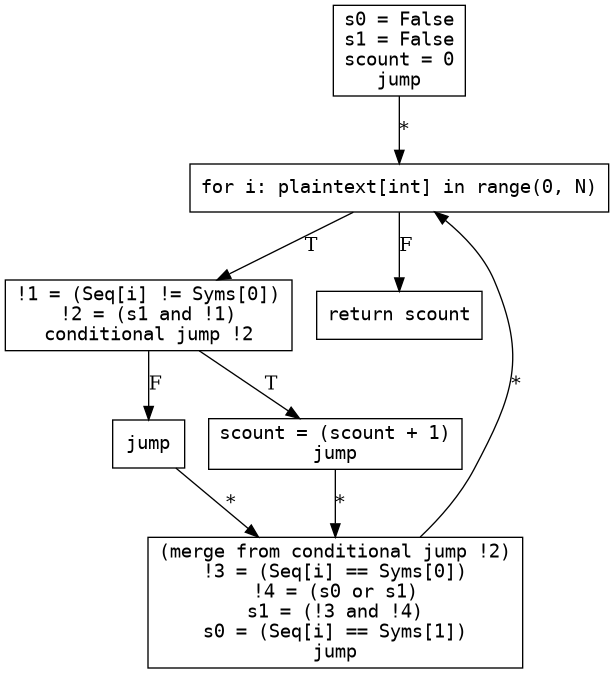
#### SSA
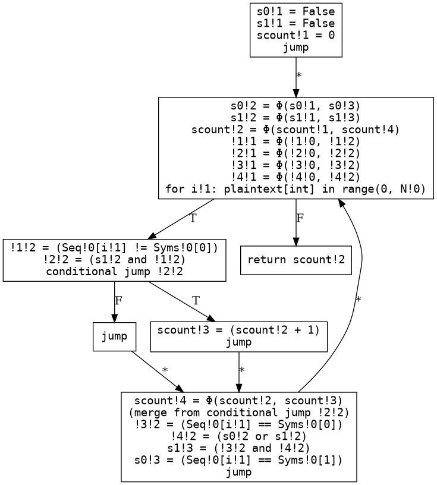
#### SSA ϕ→MUX
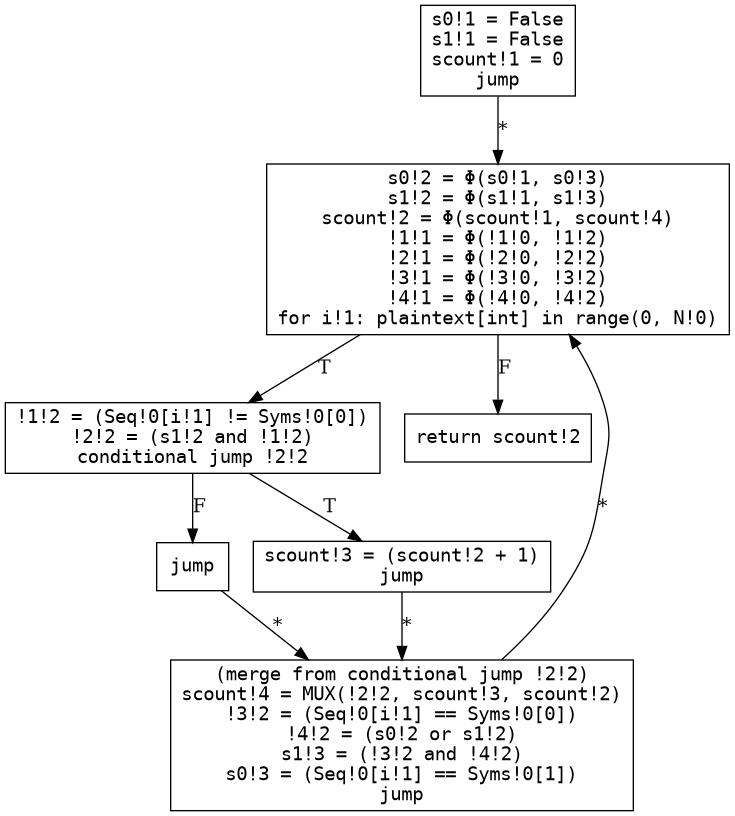
#### Dead code elimination
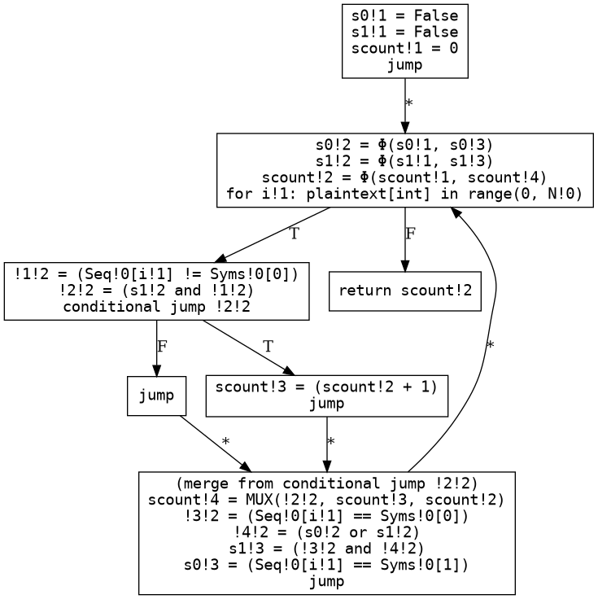
#### Linear code with loops
```python
def count_10s(Seq!0: shared[list[int; ?]], N!0: plaintext[int], Syms!0: shared[list[int; ?]]) -> shared[int]:
    s0!1 = False
    s1!1 = False
    scount!1 = 0
    for i!1 in range(0, N!0):
        s0!2 = Φ(s0!1, s0!3)
        s1!2 = Φ(s1!1, s1!3)
        scount!2 = Φ(scount!1, scount!4)
        !1!2 = (Seq!0[i!1] != Syms!0[0])
        !2!2 = (s1!2 and !1!2)
        scount!3 = (scount!2 + 1)
        scount!4 = MUX(!2!2, scount!3, scount!2)
        !3!2 = (Seq!0[i!1] == Syms!0[0])
        !4!2 = (s0!2 or s1!2)
        s1!3 = (!3!2 and !4!2)
        s0!3 = (Seq!0[i!1] == Syms!0[1])
    return scount!2
```
#### Dependency graph

#### Removal of infeasible edges
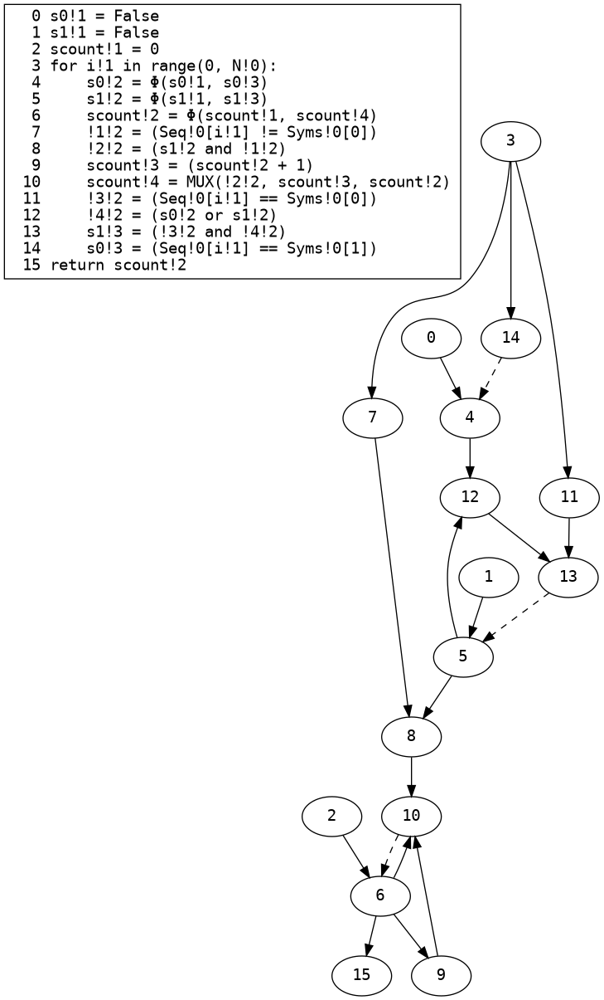
#### Type Environment Before Vectorization
| Variable | Type |
| - | - |
| `Seq!0` | `shared[list[int; ?]]` |
| `N!0` | `plaintext[int]` |
| `Syms!0` | `shared[list[int; ?]]` |
| `i!1` | `plaintext[int]` |
| `s0!3` | `shared[bool]` |
| `s0!2` | `shared[bool]` |
| `!4!2` | `shared[bool]` |
| `s1!3` | `shared[bool]` |
| `s1!2` | `shared[bool]` |
| `!2!2` | `shared[bool]` |
| `scount!4` | `shared[int]` |
| `scount!2` | `shared[int]` |
| `scount!3` | `shared[int]` |
| `!3!2` | `shared[bool]` |
| `!1!2` | `shared[bool]` |
| `scount!1` | `plaintext[int]` |
| `s1!1` | `plaintext[bool]` |
| `s0!1` | `plaintext[bool]` |
#### Basic Vectorization Phase 1
```python
def count_10s(Seq!0: shared[list[int; ?]], N!0: plaintext[int], Syms!0: shared[list[int; ?]]) -> shared[int]:
    s0!1 = False
    s1!1 = False
    scount!1 = 0
    !5!0{N!0}[] = lift(s0!1, (i!1:N!0))
    !6!0{N!0}[] = lift(s1!1, (i!1:N!0))
    !7!0{N!0}[] = lift(scount!1, (i!1:N!0))
    !8!0{N!0}[] = lift(Seq!0[i!1], (i!1:N!0))
    !9!0{N!0}[] = lift(Syms!0[0], (i!1:N!0))
    !10!0{N!0}[] = lift(Seq!0[i!1], (i!1:N!0))
    !11!0{N!0}[] = lift(Syms!0[0], (i!1:N!0))
    !12!0{N!0}[] = lift(Seq!0[i!1], (i!1:N!0))
    !13!0{N!0}[] = lift(Syms!0[1], (i!1:N!0))
    for i!1 in range(0, N!0):
        s0!2{N!0}[] = Φ(!5!0{N!0}[], s0!3{N!0}[])
        s1!2{N!0}[] = Φ(!6!0{N!0}[], s1!3{N!0}[])
        scount!2{N!0}[] = Φ(!7!0{N!0}[], scount!4{N!0}[])
        !1!2{N!0}[] = (!8!0{N!0}[] != !9!0{N!0}[])
        !2!2{N!0}[] = (s1!2{N!0}[] and !1!2{N!0}[])
        scount!3{N!0}[] = (scount!2{N!0}[] + 1)
        scount!4{N!0}[] = MUX(!2!2{N!0}[], scount!3{N!0}[], scount!2{N!0}[])
        !3!2{N!0}[] = (!10!0{N!0}[] == !11!0{N!0}[])
        !4!2{N!0}[] = (s0!2{N!0}[] or s1!2{N!0}[])
        s1!3{N!0}[] = (!3!2{N!0}[] and !4!2{N!0}[])
        s0!3{N!0}[] = (!12!0{N!0}[] == !13!0{N!0}[])
    !14!0 = drop_dim(scount!4{N!0}[])
    return !14!0
```
#### Basic Vectorization Phase 1 (dependence graph)
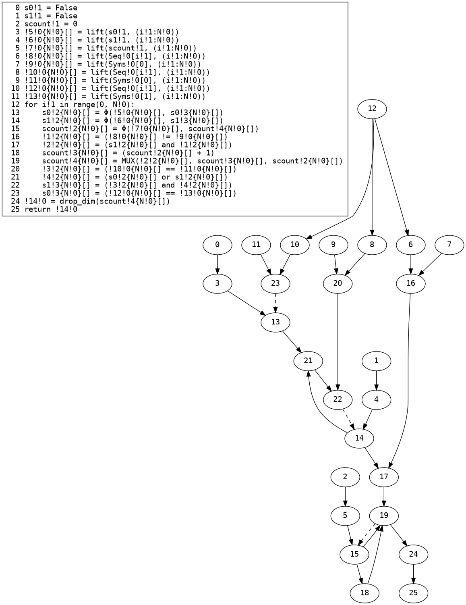
#### Basic Vectorization Phase 2
```python
def count_10s(Seq!0: shared[list[int; ?]], N!0: plaintext[int], Syms!0: shared[list[int; ?]]) -> shared[int]:
    s0!1 = False
    s1!1 = False
    scount!1 = 0
    !8!0{N!0}[] = lift(Seq!0[i!1], (i!1:N!0))
    !9!0{N!0}[] = lift(Syms!0[0], (i!1:N!0))
    !10!0{N!0}[] = lift(Seq!0[i!1], (i!1:N!0))
    !11!0{N!0}[] = lift(Syms!0[0], (i!1:N!0))
    !12!0{N!0}[] = lift(Seq!0[i!1], (i!1:N!0))
    !13!0{N!0}[] = lift(Syms!0[1], (i!1:N!0))
    !5!0{N!0}[] = lift(s0!1, (i!1:N!0))
    !6!0{N!0}[] = lift(s1!1, (i!1:N!0))
    !7!0{N!0}[] = lift(scount!1, (i!1:N!0))
    !1!2{N!0}[] = (!8!0{N!0}[] != !9!0{N!0}[])
    !3!2{N!0}[] = (!10!0{N!0}[] == !11!0{N!0}[])
    s0!3{N!0}[] = (!12!0{N!0}[] == !13!0{N!0}[])
    for !15!0 in range(0, N!0): (monolithic)
        s0!2{}[!15!0] = Φ(!5!0{}[!15!0], s0!3{}[(!15!0 - 1)])
    for !16!0 in range(0, N!0): (monolithic)
        s1!2{}[!16!0] = Φ(!6!0{}[!16!0], s1!3{}[(!16!0 - 1)])
        !4!2{}[!16!0] = (s0!2{}[!16!0] or s1!2{}[!16!0])
        s1!3{}[!16!0] = (!3!2{}[!16!0] and !4!2{}[!16!0])
    !2!2{N!0}[] = (s1!2{N!0}[] and !1!2{N!0}[])
    for !17!0 in range(0, N!0): (monolithic)
        scount!2{}[!17!0] = Φ(!7!0{}[!17!0], scount!4{}[(!17!0 - 1)])
        scount!3{}[!17!0] = (scount!2{}[!17!0] + 1)
        scount!4{}[!17!0] = MUX(!2!2{}[!17!0], scount!3{}[!17!0], scount!2{}[!17!0])
    !14!0 = drop_dim(scount!4{N!0}[])
    return !14!0
```
#### Basic Vectorization Phase 2 (dependence graph)
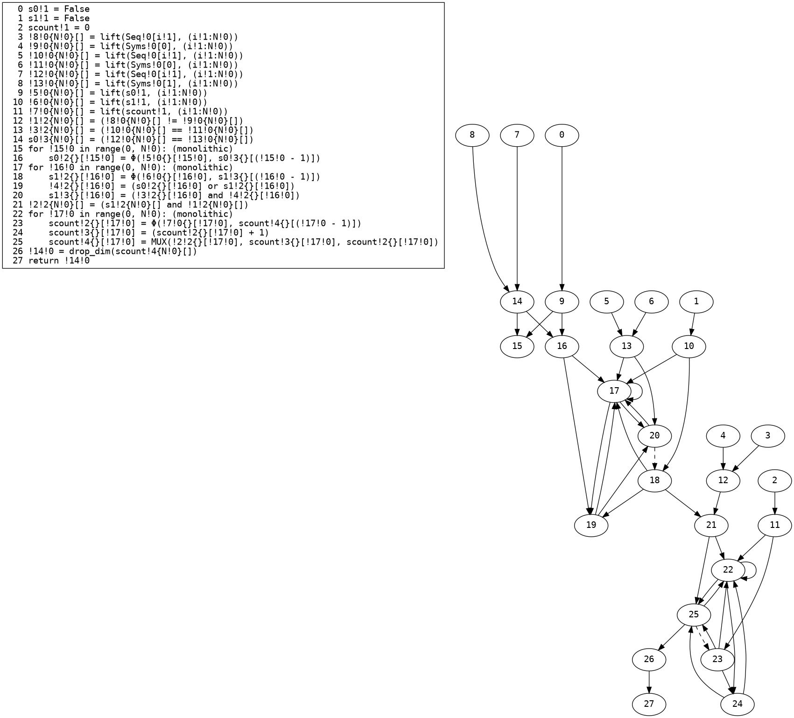
#### Type Environment After Vectorization
| Variable | Type |
| - | - |
| `Seq!0` | `shared[list[int; ?]]` |
| `N!0` | `plaintext[int]` |
| `Syms!0` | `shared[list[int; ?]]` |
| `!15!0` | `plaintext[int]` |
| `!16!0` | `plaintext[int]` |
| `!17!0` | `plaintext[int]` |
| `!14!0` | `shared[int]` |
| `scount!4` | `shared[list[int; (N!0)]]` |
| `scount!2` | `shared[list[int; (N!0)]]` |
| `scount!3` | `shared[list[int; (N!0)]]` |
| `!2!2` | `shared[list[bool; (N!0)]]` |
| `s1!3` | `shared[list[bool; (N!0)]]` |
| `s1!2` | `shared[list[bool; (N!0)]]` |
| `!4!2` | `shared[list[bool; (N!0)]]` |
| `s0!2` | `shared[list[bool; (N!0)]]` |
| `s0!3` | `shared[list[bool; (N!0)]]` |
| `!3!2` | `shared[list[bool; (N!0)]]` |
| `!1!2` | `shared[list[bool; (N!0)]]` |
| `!7!0` | `shared[list[int; (N!0)]]` |
| `!6!0` | `shared[list[bool; (N!0)]]` |
| `!5!0` | `shared[list[bool; (N!0)]]` |
| `!13!0` | `shared[list[int; (N!0)]]` |
| `!12!0` | `shared[list[int; (N!0)]]` |
| `!11!0` | `shared[list[int; (N!0)]]` |
| `!10!0` | `shared[list[int; (N!0)]]` |
| `!9!0` | `shared[list[int; (N!0)]]` |
| `!8!0` | `shared[list[int; (N!0)]]` |
| `scount!1` | `plaintext[int]` |
| `s1!1` | `plaintext[bool]` |
| `s0!1` | `plaintext[bool]` |
#### Copy propagation
```python
def count_10s(Seq!0: shared[list[int; ?]], N!0: plaintext[int], Syms!0: shared[list[int; ?]]) -> shared[int]:
    s0!1 = False
    s1!1 = False
    scount!1 = 0
    !8!0{N!0}[] = lift(Seq!0[i!1], (i!1:N!0))
    !9!0{N!0}[] = lift(Syms!0[0], (i!1:N!0))
    !10!0{N!0}[] = lift(Seq!0[i!1], (i!1:N!0))
    !11!0{N!0}[] = lift(Syms!0[0], (i!1:N!0))
    !12!0{N!0}[] = lift(Seq!0[i!1], (i!1:N!0))
    !13!0{N!0}[] = lift(Syms!0[1], (i!1:N!0))
    !5!0{N!0}[] = lift(s0!1, (i!1:N!0))
    !6!0{N!0}[] = lift(s1!1, (i!1:N!0))
    !7!0{N!0}[] = lift(scount!1, (i!1:N!0))
    !1!2{N!0}[] = (!8!0{N!0}[] != !9!0{N!0}[])
    !3!2{N!0}[] = (!10!0{N!0}[] == !11!0{N!0}[])
    s0!3{N!0}[] = (!12!0{N!0}[] == !13!0{N!0}[])
    for !15!0 in range(0, N!0): (monolithic)
        s0!2{}[!15!0] = Φ(!5!0{}[!15!0], s0!3{}[(!15!0 - 1)])
    for !16!0 in range(0, N!0): (monolithic)
        s1!2{}[!16!0] = Φ(!6!0{}[!16!0], s1!3{}[(!16!0 - 1)])
        !4!2{}[!16!0] = (s0!2{}[!16!0] or s1!2{}[!16!0])
        s1!3{}[!16!0] = (!3!2{}[!16!0] and !4!2{}[!16!0])
    !2!2{N!0}[] = (s1!2{N!0}[] and !1!2{N!0}[])
    for !17!0 in range(0, N!0): (monolithic)
        scount!2{}[!17!0] = Φ(!7!0{}[!17!0], scount!4{}[(!17!0 - 1)])
        scount!3{}[!17!0] = (scount!2{}[!17!0] + 1)
        scount!4{}[!17!0] = MUX(!2!2{}[!17!0], scount!3{}[!17!0], scount!2{}[!17!0])
    !14!0 = drop_dim(scount!4{N!0}[])
    return !14!0
```
#### Common subexpression elimination
```python
def count_10s(Seq!0: shared[list[int; ?]], N!0: plaintext[int], Syms!0: shared[list[int; ?]]) -> shared[int]:
    s0!1 = False
    s1!1 = False
    scount!1 = 0
    !8!0{N!0}[] = lift(Seq!0[i!1], (i!1:N!0))
    !9!0{N!0}[] = lift(Syms!0[0], (i!1:N!0))
    !13!0{N!0}[] = lift(Syms!0[1], (i!1:N!0))
    !5!0{N!0}[] = lift(s0!1, (i!1:N!0))
    !6!0{N!0}[] = lift(s1!1, (i!1:N!0))
    !7!0{N!0}[] = lift(scount!1, (i!1:N!0))
    !1!2{N!0}[] = (!8!0{N!0}[] != !9!0{N!0}[])
    !3!2{N!0}[] = (!8!0{N!0}[] == !9!0{N!0}[])
    s0!3{N!0}[] = (!8!0{N!0}[] == !13!0{N!0}[])
    for !15!0 in range(0, N!0): (monolithic)
        s0!2{}[!15!0] = Φ(!5!0{}[!15!0], s0!3{}[(!15!0 - 1)])
    for !16!0 in range(0, N!0): (monolithic)
        s1!2{}[!16!0] = Φ(!6!0{}[!16!0], s1!3{}[(!16!0 - 1)])
        !4!2{}[!16!0] = (s0!2{}[!16!0] or s1!2{}[!16!0])
        s1!3{}[!16!0] = (!3!2{}[!16!0] and !4!2{}[!16!0])
    !2!2{N!0}[] = (s1!2{N!0}[] and !1!2{N!0}[])
    for !17!0 in range(0, N!0): (monolithic)
        scount!2{}[!17!0] = Φ(!7!0{}[!17!0], scount!4{}[(!17!0 - 1)])
        scount!3{}[!17!0] = (scount!2{}[!17!0] + 1)
        scount!4{}[!17!0] = MUX(!2!2{}[!17!0], scount!3{}[!17!0], scount!2{}[!17!0])
    !14!0 = drop_dim(scount!4{N!0}[])
    return !14!0
```
#### MOTION mixed configuration
```Total cost:	0.28921
Input vars:	{Syms!0: ['Y'], Seq!0: ['Y']}
Constants:	{False: ['Y'], 0: ['Y'], 1: ['Y']}
Plaintext vars:	{}
Flags:		{}
s0!1 = False: _ -> ['Y'] for 0.00000 * 1 = 0.00
s1!1 = False: _ -> ['Y'] for 0.00000 * 1 = 0.00
scount!1 = 0: _ -> ['Y'] for 0.00000 * 1 = 0.00
!8!0{N!0}[] = lift(Seq!0[i!1], (i!1:N!0)): _ -> ['Y'] for 0.00000 * 1 = 0.00
!9!0{N!0}[] = lift(Syms!0[0], (i!1:N!0)): _ -> ['Y'] for 0.00000 * 1 = 0.00
!13!0{N!0}[] = lift(Syms!0[1], (i!1:N!0)): _ -> ['Y'] for 0.00000 * 1 = 0.00
!5!0{N!0}[] = lift(s0!1, (i!1:N!0)): _ -> ['Y'] for 0.00000 * 1 = 0.00
!6!0{N!0}[] = lift(s1!1, (i!1:N!0)): _ -> ['Y'] for 0.00000 * 1 = 0.00
!7!0{N!0}[] = lift(scount!1, (i!1:N!0)): _ -> ['Y'] for 0.00000 * 1 = 0.00
!1!2{N!0}[] = (!8!0{N!0}[] != !9!0{N!0}[]): Y -> {} for 0.01447 * 1 = 0.01
!3!2{N!0}[] = (!8!0{N!0}[] == !9!0{N!0}[]): Y -> {} for 0.01489 * 1 = 0.01
s0!3{N!0}[] = (!8!0{N!0}[] == !13!0{N!0}[]): Y -> {} for 0.01489 * 1 = 0.01
	s0!2{}[!15!0] = Φ(!5!0{}[!15!0], s0!3{}[(!15!0 - 1)]): Y -> {} for 0.00000 * 7 = 0.00
	s1!2{}[!16!0] = Φ(!6!0{}[!16!0], s1!3{}[(!16!0 - 1)]): Y -> {} for 0.00000 * 7 = 0.00
	!4!2{}[!16!0] = (s0!2{}[!16!0] or s1!2{}[!16!0]): Y -> {} for 0.00282 * 7 = 0.02
	s1!3{}[!16!0] = (!3!2{}[!16!0] and !4!2{}[!16!0]): Y -> {} for 0.00245 * 7 = 0.02
!2!2{N!0}[] = (s1!2{N!0}[] and !1!2{N!0}[]): Y -> {} for 0.00168 * 1 = 0.00
	scount!2{}[!17!0] = Φ(!7!0{}[!17!0], scount!4{}[(!17!0 - 1)]): Y -> {} for 0.00000 * 7 = 0.00
	scount!3{}[!17!0] = (scount!2{}[!17!0] + 1): Y -> {} for 0.02351 * 7 = 0.16
	scount!4{}[!17!0] = MUX(!2!2{}[!17!0], scount!3{}[!17!0], scount!2{}[!17!0]): Y -> {} for 0.00597 * 7 = 0.04
!14!0 = drop_dim(scount!4{N!0}[]): _ -> ['Y'] for 0.00000 * 1 = 0.00
return !14!0
Output vars:	{!14!0: ['Y']}

```
#### MOTION code
```cpp
template <encrypto::motion::MpcProtocol Protocol>
encrypto::motion::SecureUnsignedInteger count_10s(
    encrypto::motion::PartyPointer &party,
    std::vector<encrypto::motion::SecureUnsignedInteger> Seq_0,
    std::uint32_t _MPC_PLAINTEXT_N_0,
    std::vector<encrypto::motion::SecureUnsignedInteger> Syms_0
) {
    // Shared variable declarations
    std::vector<encrypto::motion::ShareWrapper> _1_2((_MPC_PLAINTEXT_N_0));
    std::vector<encrypto::motion::SecureUnsignedInteger> _13_0((_MPC_PLAINTEXT_N_0));
    encrypto::motion::SecureUnsignedInteger _14_0;
    encrypto::motion::SecureUnsignedInteger _15_0;
    encrypto::motion::SecureUnsignedInteger _16_0;
    encrypto::motion::SecureUnsignedInteger _17_0;
    std::vector<encrypto::motion::ShareWrapper> _2_2((_MPC_PLAINTEXT_N_0));
    std::vector<encrypto::motion::ShareWrapper> _3_2((_MPC_PLAINTEXT_N_0));
    std::vector<encrypto::motion::ShareWrapper> _4_2((_MPC_PLAINTEXT_N_0));
    std::vector<encrypto::motion::ShareWrapper> _5_0((_MPC_PLAINTEXT_N_0));
    std::vector<encrypto::motion::ShareWrapper> _6_0((_MPC_PLAINTEXT_N_0));
    std::vector<encrypto::motion::SecureUnsignedInteger> _7_0((_MPC_PLAINTEXT_N_0));
    std::vector<encrypto::motion::SecureUnsignedInteger> _8_0((_MPC_PLAINTEXT_N_0));
    std::vector<encrypto::motion::SecureUnsignedInteger> _9_0((_MPC_PLAINTEXT_N_0));
    encrypto::motion::SecureUnsignedInteger N_0;
    encrypto::motion::ShareWrapper s0_1;
    std::vector<encrypto::motion::ShareWrapper> s0_2((_MPC_PLAINTEXT_N_0));
    std::vector<encrypto::motion::ShareWrapper> s0_3((_MPC_PLAINTEXT_N_0));
    encrypto::motion::ShareWrapper s1_1;
    std::vector<encrypto::motion::ShareWrapper> s1_2((_MPC_PLAINTEXT_N_0));
    std::vector<encrypto::motion::ShareWrapper> s1_3((_MPC_PLAINTEXT_N_0));
    encrypto::motion::SecureUnsignedInteger scount_1;
    std::vector<encrypto::motion::SecureUnsignedInteger> scount_2((_MPC_PLAINTEXT_N_0));
    std::vector<encrypto::motion::SecureUnsignedInteger> scount_3((_MPC_PLAINTEXT_N_0));
    std::vector<encrypto::motion::SecureUnsignedInteger> scount_4((_MPC_PLAINTEXT_N_0));

    // Plaintext variable declarations
    std::uint32_t _MPC_PLAINTEXT__15_0;
    std::uint32_t _MPC_PLAINTEXT__16_0;
    std::uint32_t _MPC_PLAINTEXT__17_0;
    bool _MPC_PLAINTEXT_s0_1;
    bool _MPC_PLAINTEXT_s1_1;
    std::uint32_t _MPC_PLAINTEXT_scount_1;

    // Constant initializations
    encrypto::motion::SecureUnsignedInteger _MPC_CONSTANT_0 = party->In<Protocol>(encrypto::motion::ToInput(std::uint32_t(0)), 0);
    encrypto::motion::SecureUnsignedInteger _MPC_CONSTANT_1 = party->In<Protocol>(encrypto::motion::ToInput(std::uint32_t(1)), 0);
    encrypto::motion::ShareWrapper _MPC_CONSTANT_false = party->In<Protocol>(encrypto::motion::BitVector(1, false), 0);

    // Plaintext parameter assignments
    N_0 = party->In<Protocol>(encrypto::motion::ToInput(_MPC_PLAINTEXT_N_0), 0);

    // Function body
    s0_1 = _MPC_CONSTANT_false;
    _MPC_PLAINTEXT_s0_1 = false;
    s1_1 = _MPC_CONSTANT_false;
    _MPC_PLAINTEXT_s1_1 = false;
    scount_1 = _MPC_CONSTANT_0;
    _MPC_PLAINTEXT_scount_1 = std::uint32_t(0);
    vectorized_assign(_8_0, {_MPC_PLAINTEXT_N_0}, {true}, {}, lift(std::function([&](const std::vector<std::uint32_t> &indices){return Seq_0[indices[0]];}), {_MPC_PLAINTEXT_N_0}));
    vectorized_assign(_9_0, {_MPC_PLAINTEXT_N_0}, {true}, {}, lift(std::function([&](const std::vector<std::uint32_t> &indices){return Syms_0[std::uint32_t(0)];}), {_MPC_PLAINTEXT_N_0}));
    vectorized_assign(_13_0, {_MPC_PLAINTEXT_N_0}, {true}, {}, lift(std::function([&](const std::vector<std::uint32_t> &indices){return Syms_0[std::uint32_t(1)];}), {_MPC_PLAINTEXT_N_0}));
    vectorized_assign(_5_0, {_MPC_PLAINTEXT_N_0}, {true}, {}, lift(std::function([&](const std::vector<std::uint32_t> &indices){return s0_1;}), {_MPC_PLAINTEXT_N_0}));
    vectorized_assign(_6_0, {_MPC_PLAINTEXT_N_0}, {true}, {}, lift(std::function([&](const std::vector<std::uint32_t> &indices){return s1_1;}), {_MPC_PLAINTEXT_N_0}));
    vectorized_assign(_7_0, {_MPC_PLAINTEXT_N_0}, {true}, {}, lift(std::function([&](const std::vector<std::uint32_t> &indices){return scount_1;}), {_MPC_PLAINTEXT_N_0}));
    vectorized_assign(_1_2, {_MPC_PLAINTEXT_N_0}, {true}, {}, (~(to_share_wrapper(vectorized_access(_8_0, {_MPC_PLAINTEXT_N_0}, {true}, {})) == to_share_wrapper(vectorized_access(_9_0, {_MPC_PLAINTEXT_N_0}, {true}, {})))));
    vectorized_assign(_3_2, {_MPC_PLAINTEXT_N_0}, {true}, {}, (to_share_wrapper(vectorized_access(_8_0, {_MPC_PLAINTEXT_N_0}, {true}, {})) == to_share_wrapper(vectorized_access(_9_0, {_MPC_PLAINTEXT_N_0}, {true}, {}))));
    vectorized_assign(s0_3, {_MPC_PLAINTEXT_N_0}, {true}, {}, (to_share_wrapper(vectorized_access(_8_0, {_MPC_PLAINTEXT_N_0}, {true}, {})) == to_share_wrapper(vectorized_access(_13_0, {_MPC_PLAINTEXT_N_0}, {true}, {}))));

    // Initialize loop counter
    _MPC_PLAINTEXT__15_0 = std::uint32_t(0);
    // Initialize phi values
    s0_2[_MPC_PLAINTEXT__15_0] = _5_0[_MPC_PLAINTEXT__15_0];
    for (; _MPC_PLAINTEXT__15_0 < _MPC_PLAINTEXT_N_0; _MPC_PLAINTEXT__15_0++) {
        // Update phi values
        if (_MPC_PLAINTEXT__15_0 != std::uint32_t(0)) {
            s0_2[_MPC_PLAINTEXT__15_0] = s0_3[(_MPC_PLAINTEXT__15_0 - std::uint32_t(1))];
        }


    }


    // Initialize loop counter
    _MPC_PLAINTEXT__16_0 = std::uint32_t(0);
    // Initialize phi values
    s1_2[_MPC_PLAINTEXT__16_0] = _6_0[_MPC_PLAINTEXT__16_0];
    for (; _MPC_PLAINTEXT__16_0 < _MPC_PLAINTEXT_N_0; _MPC_PLAINTEXT__16_0++) {
        // Update phi values
        if (_MPC_PLAINTEXT__16_0 != std::uint32_t(0)) {
            s1_2[_MPC_PLAINTEXT__16_0] = s1_3[(_MPC_PLAINTEXT__16_0 - std::uint32_t(1))];
        }

        _4_2[_MPC_PLAINTEXT__16_0] = (to_share_wrapper(s0_2[_MPC_PLAINTEXT__16_0]) | to_share_wrapper(s1_2[_MPC_PLAINTEXT__16_0]));
        s1_3[_MPC_PLAINTEXT__16_0] = (to_share_wrapper(_3_2[_MPC_PLAINTEXT__16_0]) & to_share_wrapper(_4_2[_MPC_PLAINTEXT__16_0]));

    }

    vectorized_assign(_2_2, {_MPC_PLAINTEXT_N_0}, {true}, {}, (to_share_wrapper(vectorized_access(s1_2, {_MPC_PLAINTEXT_N_0}, {true}, {})) & to_share_wrapper(vectorized_access(_1_2, {_MPC_PLAINTEXT_N_0}, {true}, {}))));

    // Initialize loop counter
    _MPC_PLAINTEXT__17_0 = std::uint32_t(0);
    // Initialize phi values
    scount_2[_MPC_PLAINTEXT__17_0] = _7_0[_MPC_PLAINTEXT__17_0];
    for (; _MPC_PLAINTEXT__17_0 < _MPC_PLAINTEXT_N_0; _MPC_PLAINTEXT__17_0++) {
        // Update phi values
        if (_MPC_PLAINTEXT__17_0 != std::uint32_t(0)) {
            scount_2[_MPC_PLAINTEXT__17_0] = scount_4[(_MPC_PLAINTEXT__17_0 - std::uint32_t(1))];
        }

        scount_3[_MPC_PLAINTEXT__17_0] = (scount_2[_MPC_PLAINTEXT__17_0] + _MPC_CONSTANT_1);
        scount_4[_MPC_PLAINTEXT__17_0] = _2_2[_MPC_PLAINTEXT__17_0].Mux(scount_3[_MPC_PLAINTEXT__17_0].Get(), scount_2[_MPC_PLAINTEXT__17_0].Get());

    }

    _14_0 = drop_dim_monoreturn(vectorized_access(scount_4, {_MPC_PLAINTEXT_N_0}, {true}, {}).Unsimdify(), {_MPC_PLAINTEXT_N_0});
    return _14_0;

}
```
#### MOTION mixed code
```cpp
encrypto::motion::SecureUnsignedInteger count_10s(
    encrypto::motion::PartyPointer &party,
    std::vector<encrypto::motion::SecureUnsignedInteger> Seq_0,
    std::uint32_t _MPC_PLAINTEXT_N_0,
    std::vector<encrypto::motion::SecureUnsignedInteger> Syms_0
) {
    // Shared variable declarations
    std::vector<encrypto::motion::ShareWrapper> _1_2((_MPC_PLAINTEXT_N_0));
    std::vector<encrypto::motion::SecureUnsignedInteger> _13_0((_MPC_PLAINTEXT_N_0));
    encrypto::motion::SecureUnsignedInteger _14_0;
    encrypto::motion::SecureUnsignedInteger _15_0;
    encrypto::motion::SecureUnsignedInteger _16_0;
    encrypto::motion::SecureUnsignedInteger _17_0;
    std::vector<encrypto::motion::ShareWrapper> _2_2((_MPC_PLAINTEXT_N_0));
    std::vector<encrypto::motion::ShareWrapper> _3_2((_MPC_PLAINTEXT_N_0));
    std::vector<encrypto::motion::ShareWrapper> _4_2((_MPC_PLAINTEXT_N_0));
    std::vector<encrypto::motion::ShareWrapper> _5_0((_MPC_PLAINTEXT_N_0));
    std::vector<encrypto::motion::ShareWrapper> _6_0((_MPC_PLAINTEXT_N_0));
    std::vector<encrypto::motion::SecureUnsignedInteger> _7_0((_MPC_PLAINTEXT_N_0));
    std::vector<encrypto::motion::SecureUnsignedInteger> _8_0((_MPC_PLAINTEXT_N_0));
    std::vector<encrypto::motion::SecureUnsignedInteger> _9_0((_MPC_PLAINTEXT_N_0));
    encrypto::motion::SecureUnsignedInteger N_0;
    encrypto::motion::ShareWrapper s0_1;
    std::vector<encrypto::motion::ShareWrapper> s0_2((_MPC_PLAINTEXT_N_0));
    std::vector<encrypto::motion::ShareWrapper> s0_3((_MPC_PLAINTEXT_N_0));
    encrypto::motion::ShareWrapper s1_1;
    std::vector<encrypto::motion::ShareWrapper> s1_2((_MPC_PLAINTEXT_N_0));
    std::vector<encrypto::motion::ShareWrapper> s1_3((_MPC_PLAINTEXT_N_0));
    encrypto::motion::SecureUnsignedInteger scount_1;
    std::vector<encrypto::motion::SecureUnsignedInteger> scount_2((_MPC_PLAINTEXT_N_0));
    std::vector<encrypto::motion::SecureUnsignedInteger> scount_3((_MPC_PLAINTEXT_N_0));
    std::vector<encrypto::motion::SecureUnsignedInteger> scount_4((_MPC_PLAINTEXT_N_0));

    // Plaintext variable declarations
    std::uint32_t _MPC_PLAINTEXT__15_0;
    std::uint32_t _MPC_PLAINTEXT__16_0;
    std::uint32_t _MPC_PLAINTEXT__17_0;
    bool _MPC_PLAINTEXT_s0_1;
    bool _MPC_PLAINTEXT_s1_1;
    std::uint32_t _MPC_PLAINTEXT_scount_1;

    // Constant initializations
    encrypto::motion::SecureUnsignedInteger _MPC_CONSTANT_0 = party->In<encrypto::motion::MpcProtocol::kBmr>(encrypto::motion::ToInput(std::uint32_t(0)), 0);
    encrypto::motion::SecureUnsignedInteger _MPC_CONSTANT_1 = party->In<encrypto::motion::MpcProtocol::kBmr>(encrypto::motion::ToInput(std::uint32_t(1)), 0);
    encrypto::motion::ShareWrapper _MPC_CONSTANT_false = party->In<encrypto::motion::MpcProtocol::kBmr>(encrypto::motion::BitVector(1, false), 0);

    // Input Protocol Convertions

    // Plaintext parameter assignments

    // Function body
    s0_1 = _MPC_CONSTANT_false;
    _MPC_PLAINTEXT_s0_1 = false;
    s1_1 = _MPC_CONSTANT_false;
    _MPC_PLAINTEXT_s1_1 = false;
    scount_1 = _MPC_CONSTANT_0;
    _MPC_PLAINTEXT_scount_1 = std::uint32_t(0);
    vectorized_assign(_8_0, {_MPC_PLAINTEXT_N_0}, {true}, {}, lift(std::function([&](const std::vector<std::uint32_t> &indices){return Seq_0[indices[0]];}), {_MPC_PLAINTEXT_N_0}));
    vectorized_assign(_9_0, {_MPC_PLAINTEXT_N_0}, {true}, {}, lift(std::function([&](const std::vector<std::uint32_t> &indices){return Syms_0[std::uint32_t(0)];}), {_MPC_PLAINTEXT_N_0}));
    vectorized_assign(_13_0, {_MPC_PLAINTEXT_N_0}, {true}, {}, lift(std::function([&](const std::vector<std::uint32_t> &indices){return Syms_0[std::uint32_t(1)];}), {_MPC_PLAINTEXT_N_0}));
    vectorized_assign(_5_0, {_MPC_PLAINTEXT_N_0}, {true}, {}, lift(std::function([&](const std::vector<std::uint32_t> &indices){return s0_1;}), {_MPC_PLAINTEXT_N_0}));
    vectorized_assign(_6_0, {_MPC_PLAINTEXT_N_0}, {true}, {}, lift(std::function([&](const std::vector<std::uint32_t> &indices){return s1_1;}), {_MPC_PLAINTEXT_N_0}));
    vectorized_assign(_7_0, {_MPC_PLAINTEXT_N_0}, {true}, {}, lift(std::function([&](const std::vector<std::uint32_t> &indices){return scount_1;}), {_MPC_PLAINTEXT_N_0}));
    vectorized_assign(_1_2, {_MPC_PLAINTEXT_N_0}, {true}, {}, (~(to_share_wrapper(vectorized_access(_8_0, {_MPC_PLAINTEXT_N_0}, {true}, {})) == to_share_wrapper(vectorized_access(_9_0, {_MPC_PLAINTEXT_N_0}, {true}, {})))));
    vectorized_assign(_3_2, {_MPC_PLAINTEXT_N_0}, {true}, {}, (to_share_wrapper(vectorized_access(_8_0, {_MPC_PLAINTEXT_N_0}, {true}, {})) == to_share_wrapper(vectorized_access(_9_0, {_MPC_PLAINTEXT_N_0}, {true}, {}))));
    vectorized_assign(s0_3, {_MPC_PLAINTEXT_N_0}, {true}, {}, (to_share_wrapper(vectorized_access(_8_0, {_MPC_PLAINTEXT_N_0}, {true}, {})) == to_share_wrapper(vectorized_access(_13_0, {_MPC_PLAINTEXT_N_0}, {true}, {}))));

    // Initialize loop counter
    _MPC_PLAINTEXT__15_0 = std::uint32_t(0);
    // Initialize phi values
    s0_2[_MPC_PLAINTEXT__15_0] = _5_0[_MPC_PLAINTEXT__15_0];
    for (; _MPC_PLAINTEXT__15_0 < _MPC_PLAINTEXT_N_0; _MPC_PLAINTEXT__15_0++) {
        // Update phi values
        if (_MPC_PLAINTEXT__15_0 != std::uint32_t(0)) {
            s0_2[_MPC_PLAINTEXT__15_0] = s0_3[(_MPC_PLAINTEXT__15_0 - std::uint32_t(1))];
        }


    }


    // Initialize loop counter
    _MPC_PLAINTEXT__16_0 = std::uint32_t(0);
    // Initialize phi values
    s1_2[_MPC_PLAINTEXT__16_0] = _6_0[_MPC_PLAINTEXT__16_0];
    for (; _MPC_PLAINTEXT__16_0 < _MPC_PLAINTEXT_N_0; _MPC_PLAINTEXT__16_0++) {
        // Update phi values
        if (_MPC_PLAINTEXT__16_0 != std::uint32_t(0)) {
            s1_2[_MPC_PLAINTEXT__16_0] = s1_3[(_MPC_PLAINTEXT__16_0 - std::uint32_t(1))];
        }

        _4_2[_MPC_PLAINTEXT__16_0] = (to_share_wrapper(s0_2[_MPC_PLAINTEXT__16_0]) | to_share_wrapper(s1_2[_MPC_PLAINTEXT__16_0]));
        s1_3[_MPC_PLAINTEXT__16_0] = (to_share_wrapper(_3_2[_MPC_PLAINTEXT__16_0]) & to_share_wrapper(_4_2[_MPC_PLAINTEXT__16_0]));

    }

    vectorized_assign(_2_2, {_MPC_PLAINTEXT_N_0}, {true}, {}, (to_share_wrapper(vectorized_access(s1_2, {_MPC_PLAINTEXT_N_0}, {true}, {})) & to_share_wrapper(vectorized_access(_1_2, {_MPC_PLAINTEXT_N_0}, {true}, {}))));

    // Initialize loop counter
    _MPC_PLAINTEXT__17_0 = std::uint32_t(0);
    // Initialize phi values
    scount_2[_MPC_PLAINTEXT__17_0] = _7_0[_MPC_PLAINTEXT__17_0];
    for (; _MPC_PLAINTEXT__17_0 < _MPC_PLAINTEXT_N_0; _MPC_PLAINTEXT__17_0++) {
        // Update phi values
        if (_MPC_PLAINTEXT__17_0 != std::uint32_t(0)) {
            scount_2[_MPC_PLAINTEXT__17_0] = scount_4[(_MPC_PLAINTEXT__17_0 - std::uint32_t(1))];
        }

        scount_3[_MPC_PLAINTEXT__17_0] = (scount_2[_MPC_PLAINTEXT__17_0] + _MPC_CONSTANT_1);
        scount_4[_MPC_PLAINTEXT__17_0] = _2_2[_MPC_PLAINTEXT__17_0].Mux(scount_3[_MPC_PLAINTEXT__17_0].Get(), scount_2[_MPC_PLAINTEXT__17_0].Get());

    }

    _14_0 = drop_dim_monoreturn(vectorized_access(scount_4, {_MPC_PLAINTEXT_N_0}, {true}, {}).Unsimdify(), {_MPC_PLAINTEXT_N_0});
    return _14_0;

}
```
#### MP-SPDZ mixed configuration
```Total cost:	0.00017
Input vars:	{Syms!0: ['B'], Seq!0: ['B']}
Constants:	{False: ['B'], 0: ['B'], 1: ['B']}
Plaintext vars:	{}
Flags:		{X}
s0!1 = False: _ -> ['B'] for 0.00000 * 1 = 0.00
s1!1 = False: _ -> ['B'] for 0.00000 * 1 = 0.00
scount!1 = 0: _ -> ['B'] for 0.00000 * 1 = 0.00
!8!0{N!0}[] = lift(Seq!0[i!1], (i!1:N!0)): _ -> ['B'] for 0.00000 * 1 = 0.00
!9!0{N!0}[] = lift(Syms!0[0], (i!1:N!0)): _ -> ['B'] for 0.00000 * 1 = 0.00
!13!0{N!0}[] = lift(Syms!0[1], (i!1:N!0)): _ -> ['B'] for 0.00000 * 1 = 0.00
!5!0{N!0}[] = lift(s0!1, (i!1:N!0)): _ -> ['B'] for 0.00000 * 1 = 0.00
!6!0{N!0}[] = lift(s1!1, (i!1:N!0)): _ -> ['B'] for 0.00000 * 1 = 0.00
!7!0{N!0}[] = lift(scount!1, (i!1:N!0)): _ -> ['B'] for 0.00000 * 1 = 0.00
!1!2{N!0}[] = (!8!0{N!0}[] != !9!0{N!0}[]): B -> {} for 0.00005 * 1 = 0.00
!3!2{N!0}[] = (!8!0{N!0}[] == !9!0{N!0}[]): B -> {} for 0.00003 * 1 = 0.00
s0!3{N!0}[] = (!8!0{N!0}[] == !13!0{N!0}[]): B -> {} for 0.00003 * 1 = 0.00
	s0!2{}[!15!0] = Φ(!5!0{}[!15!0], s0!3{}[(!15!0 - 1)]): B -> {} for 0.00000 * 7 = 0.00
	s1!2{}[!16!0] = Φ(!6!0{}[!16!0], s1!3{}[(!16!0 - 1)]): B -> {} for 0.00000 * 7 = 0.00
	!4!2{}[!16!0] = (s0!2{}[!16!0] or s1!2{}[!16!0]): B -> {} for 0.00000 * 7 = 0.00
	s1!3{}[!16!0] = (!3!2{}[!16!0] and !4!2{}[!16!0]): B -> {} for 0.00000 * 7 = 0.00
!2!2{N!0}[] = (s1!2{N!0}[] and !1!2{N!0}[]): B -> {} for 0.00000 * 1 = 0.00
	scount!2{}[!17!0] = Φ(!7!0{}[!17!0], scount!4{}[(!17!0 - 1)]): B -> {} for 0.00000 * 7 = 0.00
	scount!3{}[!17!0] = (scount!2{}[!17!0] + 1): B -> {} for 0.00001 * 7 = 0.00
	scount!4{}[!17!0] = MUX(!2!2{}[!17!0], scount!3{}[!17!0], scount!2{}[!17!0]): B -> {} for 0.00000 * 7 = 0.00
!14!0 = drop_dim(scount!4{N!0}[]): _ -> ['B'] for 0.00000 * 1 = 0.00
return !14!0
Output vars:	{!14!0: ['B']}

```
#### MP-SPDZ code
```py
def count_10s(Seq_0, N_0, Syms_0):
    # Shared array declarations
    _1_2 = [None] * (N_0)
    _13_0 = [None] * (N_0)
    _2_2 = [None] * (N_0)
    _3_2 = [None] * (N_0)
    _4_2 = [None] * (N_0)
    _5_0 = [None] * (N_0)
    _6_0 = [None] * (N_0)
    _7_0 = [None] * (N_0)
    _8_0 = [None] * (N_0)
    _9_0 = [None] * (N_0)
    s0_2 = [None] * (N_0)
    s0_3 = [None] * (N_0)
    s1_2 = [None] * (N_0)
    s1_3 = [None] * (N_0)
    scount_2 = [None] * (N_0)
    scount_3 = [None] * (N_0)
    scount_4 = [None] * (N_0)
    # Function body
    s0_1 = _v.sbool(False)
    s1_1 = _v.sbool(False)
    scount_1 = sint(0)
    _8_0 = _v.lift(lambda indices: (Seq_0[indices[0]]), [N_0])
    _9_0 = _v.lift(lambda indices: (Syms_0[0]), [N_0])
    _13_0 = _v.lift(lambda indices: (Syms_0[1]), [N_0])
    _5_0 = _v.lift(lambda indices: s0_1, [N_0])
    _6_0 = _v.lift(lambda indices: s1_1, [N_0])
    _7_0 = _v.lift(lambda indices: scount_1, [N_0])
    _v.vectorized_assign(_1_2, [N_0], [None], (_v.vectorized_access_simd(_8_0, [N_0], [None]) != _v.vectorized_access_simd(_9_0, [N_0], [None])))
    _v.vectorized_assign(_3_2, [N_0], [None], (_v.vectorized_access_simd(_8_0, [N_0], [None]) == _v.vectorized_access_simd(_9_0, [N_0], [None])))
    _v.vectorized_assign(s0_3, [N_0], [None], (_v.vectorized_access_simd(_8_0, [N_0], [None]) == _v.vectorized_access_simd(_13_0, [N_0], [None])))
    for _15_0 in range(0, N_0):
        # Set ϕ value
        if _15_0 == 0:
            _v.vectorized_assign(s0_2, [N_0], [_15_0], _v.vectorized_access(_5_0, [N_0], [_15_0]))
        else:
            _v.vectorized_assign(s0_2, [N_0], [_15_0], _v.vectorized_access(s0_3, [N_0], [(_15_0 - 1)]))
    # Loop exit ϕ values
    _v.vectorized_assign(s0_2, [N_0], [_15_0], _v.vectorized_access(s0_3, [N_0], [(_15_0 - 1)]))
    for _16_0 in range(0, N_0):
        # Set ϕ value
        if _16_0 == 0:
            _v.vectorized_assign(s1_2, [N_0], [_16_0], _v.vectorized_access(_6_0, [N_0], [_16_0]))
        else:
            _v.vectorized_assign(s1_2, [N_0], [_16_0], _v.vectorized_access(s1_3, [N_0], [(_16_0 - 1)]))
        _v.vectorized_assign(_4_2, [N_0], [_16_0], OR(_v.vectorized_access_simd(s0_2, [N_0], [_16_0]), _v.vectorized_access_simd(s1_2, [N_0], [_16_0])))
        _v.vectorized_assign(s1_3, [N_0], [_16_0], _v.vectorized_access_simd(_3_2, [N_0], [_16_0]).bit_and(_v.vectorized_access_simd(_4_2, [N_0], [_16_0])))
    # Loop exit ϕ values
    _v.vectorized_assign(s1_2, [N_0], [_16_0], _v.vectorized_access(s1_3, [N_0], [(_16_0 - 1)]))
    _v.vectorized_assign(_2_2, [N_0], [None], _v.vectorized_access_simd(s1_2, [N_0], [None]).bit_and(_v.vectorized_access_simd(_1_2, [N_0], [None])))
    for _17_0 in range(0, N_0):
        # Set ϕ value
        if _17_0 == 0:
            _v.vectorized_assign(scount_2, [N_0], [_17_0], _v.vectorized_access(_7_0, [N_0], [_17_0]))
        else:
            _v.vectorized_assign(scount_2, [N_0], [_17_0], _v.vectorized_access(scount_4, [N_0], [(_17_0 - 1)]))
        _v.vectorized_assign(scount_3, [N_0], [_17_0], (_v.vectorized_access_simd(scount_2, [N_0], [_17_0]) + sint(1)))
        _v.iterative_mux(scount_4,_2_2,scount_3,scount_2,[N_0],[_17_0])
    # Loop exit ϕ values
    _v.vectorized_assign(scount_2, [N_0], [_17_0], _v.vectorized_access(scount_4, [N_0], [(_17_0 - 1)]))
    _14_0 = _v.drop_dim(scount_4, [N_0])
    return _14_0
```
#### MP-SPDZ mixed code
```py
program.options.binary = 32
program.use_dabit = True
def count_10s(Seq_0, N_0, Syms_0):
    # Convertion functions
    siv32 = sbitintvec.get_type(32)
    sb32 = sbits.get_type(32)
    
    
    # Shared array declarations
    _1_2 = [None] * (N_0)
    _13_0 = [None] * (N_0)
    _2_2 = [None] * (N_0)
    _3_2 = [None] * (N_0)
    _4_2 = [None] * (N_0)
    _5_0 = [None] * (N_0)
    _6_0 = [None] * (N_0)
    _7_0 = [None] * (N_0)
    _8_0 = [None] * (N_0)
    _9_0 = [None] * (N_0)
    s0_2 = [None] * (N_0)
    s0_3 = [None] * (N_0)
    s1_2 = [None] * (N_0)
    s1_3 = [None] * (N_0)
    scount_2 = [None] * (N_0)
    scount_3 = [None] * (N_0)
    scount_4 = [None] * (N_0)
    # Shared array convertion declarations
    
    # Function body
    s0_1 = sbit(0)
    s1_1 = sbit(0)
    scount_1 = siv32(0)
    _8_0 = _v.lift(lambda indices: (Seq_0[indices[0]]), [N_0])
    _9_0 = _v.lift(lambda indices: (Syms_0[0]), [N_0])
    _13_0 = _v.lift(lambda indices: (Syms_0[1]), [N_0])
    _5_0 = _v.lift(lambda indices: s0_1, [N_0])
    _6_0 = _v.lift(lambda indices: s1_1, [N_0])
    _7_0 = _v.lift(lambda indices: scount_1, [N_0])
    _v.vectorized_assign(_1_2, [N_0], [None], (_v.vectorized_access_simd(_8_0, [N_0], [None]) != _v.vectorized_access_simd(_9_0, [N_0], [None])))
    _v.vectorized_assign(_3_2, [N_0], [None], (_v.vectorized_access_simd(_8_0, [N_0], [None]) == _v.vectorized_access_simd(_9_0, [N_0], [None])))
    _v.vectorized_assign(s0_3, [N_0], [None], (_v.vectorized_access_simd(_8_0, [N_0], [None]) == _v.vectorized_access_simd(_13_0, [N_0], [None])))
    for _15_0 in range(0, N_0):
        # Set ϕ value
        if _15_0 == 0:
            _v.vectorized_assign(s0_2, [N_0], [_15_0], _v.vectorized_access(_5_0, [N_0], [_15_0]))
        else:
            _v.vectorized_assign(s0_2, [N_0], [_15_0], _v.vectorized_access(s0_3, [N_0], [(_15_0 - 1)]))
    # Loop exit ϕ values
    _v.vectorized_assign(s0_2, [N_0], [_15_0], _v.vectorized_access(s0_3, [N_0], [(_15_0 - 1)]))
    for _16_0 in range(0, N_0):
        # Set ϕ value
        if _16_0 == 0:
            _v.vectorized_assign(s1_2, [N_0], [_16_0], _v.vectorized_access(_6_0, [N_0], [_16_0]))
        else:
            _v.vectorized_assign(s1_2, [N_0], [_16_0], _v.vectorized_access(s1_3, [N_0], [(_16_0 - 1)]))
        _v.vectorized_assign(_4_2, [N_0], [_16_0], OR(_v.vectorized_access_simd(s0_2, [N_0], [_16_0]), _v.vectorized_access_simd(s1_2, [N_0], [_16_0])))
        _v.vectorized_assign(s1_3, [N_0], [_16_0], _v.vectorized_access_simd(_3_2, [N_0], [_16_0]).bit_and(_v.vectorized_access_simd(_4_2, [N_0], [_16_0])))
    # Loop exit ϕ values
    _v.vectorized_assign(s1_2, [N_0], [_16_0], _v.vectorized_access(s1_3, [N_0], [(_16_0 - 1)]))
    _v.vectorized_assign(_2_2, [N_0], [None], _v.vectorized_access_simd(s1_2, [N_0], [None]).bit_and(_v.vectorized_access_simd(_1_2, [N_0], [None])))
    for _17_0 in range(0, N_0):
        # Set ϕ value
        if _17_0 == 0:
            _v.vectorized_assign(scount_2, [N_0], [_17_0], _v.vectorized_access(_7_0, [N_0], [_17_0]))
        else:
            _v.vectorized_assign(scount_2, [N_0], [_17_0], _v.vectorized_access(scount_4, [N_0], [(_17_0 - 1)]))
        _v.vectorized_assign(scount_3, [N_0], [_17_0], (_v.vectorized_access_simd(scount_2, [N_0], [_17_0]) + siv32(1)))
        _v.iterative_mux(scount_4,_2_2,scount_3,scount_2,[N_0],[_17_0])
    # Loop exit ϕ values
    _v.vectorized_assign(scount_2, [N_0], [_17_0], _v.vectorized_access(scount_4, [N_0], [(_17_0 - 1)]))
    _14_0 = _v.drop_dim(scount_4, [N_0])
    return _14_0
```
### `count_123`
#### Input
```python
from UTIL import shared


def count_123(Seq: shared[list[int]], N: int, Syms: shared[list[int]]) -> shared[int]:
    """
    Computes the number of instances of regex a*b*c* in a provided sequence.
    Syms is a list of form [a, b, c].
    """

    s1 = False
    s2 = False
    s3 = False
    c = 0

    for i in range(0, N):
        if Seq[i] == Syms[2] and (s2 or s1):
            c = c + 1
        s2 = (Seq[i] == Syms[1]) and (s1 or s2)
        s1 = Seq[i] == Syms[0]

    return c


Seq = [1, 2, 3, 1, 3, 3, 4]
N = 7
Syms = [1, 2, 3]
print(count_123(Seq, N, Syms))

```
#### Restricted AST
```python
def count_123(Seq: shared[list[int; ?]], N: plaintext[int], Syms: shared[list[int; ?]]) -> shared[int]:
    s1 = False
    s2 = False
    s3 = False
    c = 0
    for i: plaintext[int] in range(0, N):
        if ((Seq[i] == Syms[2]) and (s2 or s1)):
            c = (c + 1)
        s2 = ((Seq[i] == Syms[1]) and (s1 or s2))
        s1 = (Seq[i] == Syms[0])
    return c
```
#### Three-address code CFG
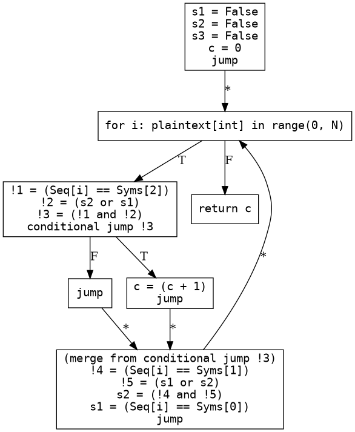
#### SSA
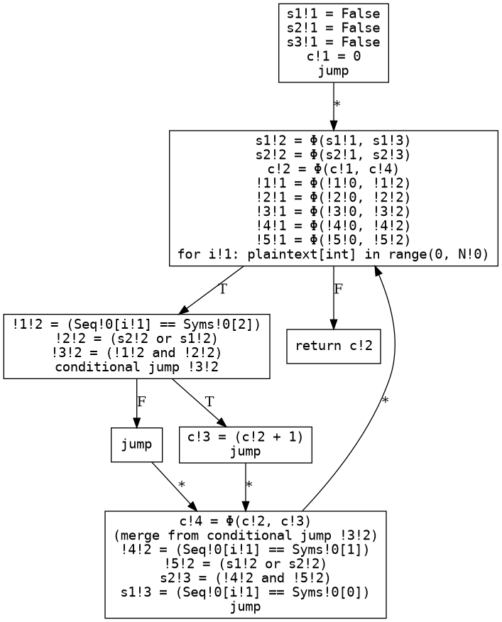
#### SSA ϕ→MUX

#### Dead code elimination
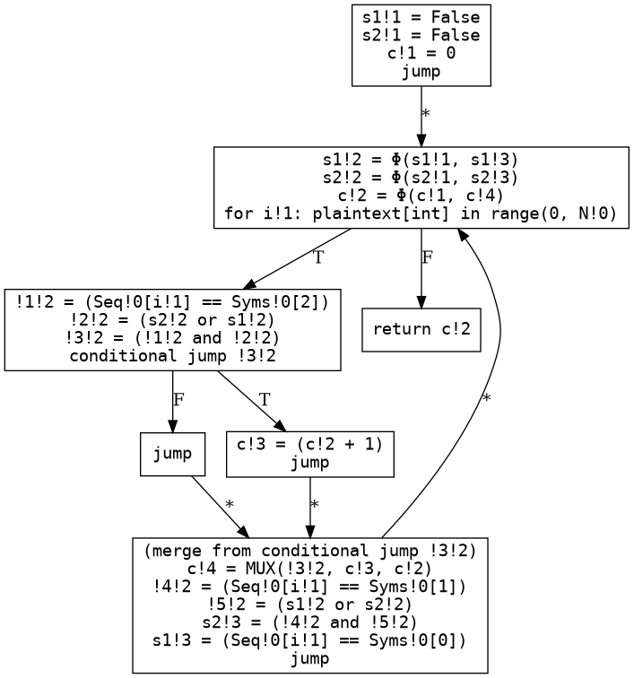
#### Linear code with loops
```python
def count_123(Seq!0: shared[list[int; ?]], N!0: plaintext[int], Syms!0: shared[list[int; ?]]) -> shared[int]:
    s1!1 = False
    s2!1 = False
    c!1 = 0
    for i!1 in range(0, N!0):
        s1!2 = Φ(s1!1, s1!3)
        s2!2 = Φ(s2!1, s2!3)
        c!2 = Φ(c!1, c!4)
        !1!2 = (Seq!0[i!1] == Syms!0[2])
        !2!2 = (s2!2 or s1!2)
        !3!2 = (!1!2 and !2!2)
        c!3 = (c!2 + 1)
        c!4 = MUX(!3!2, c!3, c!2)
        !4!2 = (Seq!0[i!1] == Syms!0[1])
        !5!2 = (s1!2 or s2!2)
        s2!3 = (!4!2 and !5!2)
        s1!3 = (Seq!0[i!1] == Syms!0[0])
    return c!2
```
#### Dependency graph
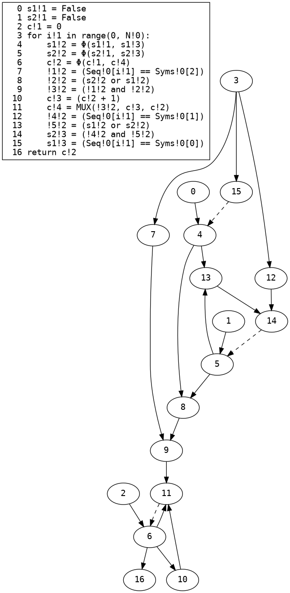
#### Removal of infeasible edges

#### Type Environment Before Vectorization
| Variable | Type |
| - | - |
| `Seq!0` | `shared[list[int; ?]]` |
| `N!0` | `plaintext[int]` |
| `Syms!0` | `shared[list[int; ?]]` |
| `i!1` | `plaintext[int]` |
| `s1!3` | `shared[bool]` |
| `s1!2` | `shared[bool]` |
| `!5!2` | `shared[bool]` |
| `s2!3` | `shared[bool]` |
| `s2!2` | `shared[bool]` |
| `!2!2` | `shared[bool]` |
| `!3!2` | `shared[bool]` |
| `c!4` | `shared[int]` |
| `c!2` | `shared[int]` |
| `c!3` | `shared[int]` |
| `!4!2` | `shared[bool]` |
| `!1!2` | `shared[bool]` |
| `c!1` | `plaintext[int]` |
| `s2!1` | `plaintext[bool]` |
| `s1!1` | `plaintext[bool]` |
#### Basic Vectorization Phase 1
```python
def count_123(Seq!0: shared[list[int; ?]], N!0: plaintext[int], Syms!0: shared[list[int; ?]]) -> shared[int]:
    s1!1 = False
    s2!1 = False
    c!1 = 0
    !6!0{N!0}[] = lift(s1!1, (i!1:N!0))
    !7!0{N!0}[] = lift(s2!1, (i!1:N!0))
    !8!0{N!0}[] = lift(c!1, (i!1:N!0))
    !9!0{N!0}[] = lift(Seq!0[i!1], (i!1:N!0))
    !10!0{N!0}[] = lift(Syms!0[2], (i!1:N!0))
    !11!0{N!0}[] = lift(Seq!0[i!1], (i!1:N!0))
    !12!0{N!0}[] = lift(Syms!0[1], (i!1:N!0))
    !13!0{N!0}[] = lift(Seq!0[i!1], (i!1:N!0))
    !14!0{N!0}[] = lift(Syms!0[0], (i!1:N!0))
    for i!1 in range(0, N!0):
        s1!2{N!0}[] = Φ(!6!0{N!0}[], s1!3{N!0}[])
        s2!2{N!0}[] = Φ(!7!0{N!0}[], s2!3{N!0}[])
        c!2{N!0}[] = Φ(!8!0{N!0}[], c!4{N!0}[])
        !1!2{N!0}[] = (!9!0{N!0}[] == !10!0{N!0}[])
        !2!2{N!0}[] = (s2!2{N!0}[] or s1!2{N!0}[])
        !3!2{N!0}[] = (!1!2{N!0}[] and !2!2{N!0}[])
        c!3{N!0}[] = (c!2{N!0}[] + 1)
        c!4{N!0}[] = MUX(!3!2{N!0}[], c!3{N!0}[], c!2{N!0}[])
        !4!2{N!0}[] = (!11!0{N!0}[] == !12!0{N!0}[])
        !5!2{N!0}[] = (s1!2{N!0}[] or s2!2{N!0}[])
        s2!3{N!0}[] = (!4!2{N!0}[] and !5!2{N!0}[])
        s1!3{N!0}[] = (!13!0{N!0}[] == !14!0{N!0}[])
    !15!0 = drop_dim(c!4{N!0}[])
    return !15!0
```
#### Basic Vectorization Phase 1 (dependence graph)
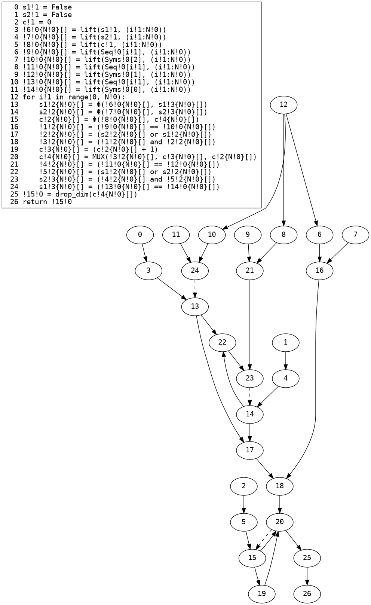
#### Basic Vectorization Phase 2
```python
def count_123(Seq!0: shared[list[int; ?]], N!0: plaintext[int], Syms!0: shared[list[int; ?]]) -> shared[int]:
    s1!1 = False
    s2!1 = False
    c!1 = 0
    !9!0{N!0}[] = lift(Seq!0[i!1], (i!1:N!0))
    !10!0{N!0}[] = lift(Syms!0[2], (i!1:N!0))
    !11!0{N!0}[] = lift(Seq!0[i!1], (i!1:N!0))
    !12!0{N!0}[] = lift(Syms!0[1], (i!1:N!0))
    !13!0{N!0}[] = lift(Seq!0[i!1], (i!1:N!0))
    !14!0{N!0}[] = lift(Syms!0[0], (i!1:N!0))
    !6!0{N!0}[] = lift(s1!1, (i!1:N!0))
    !7!0{N!0}[] = lift(s2!1, (i!1:N!0))
    !8!0{N!0}[] = lift(c!1, (i!1:N!0))
    !1!2{N!0}[] = (!9!0{N!0}[] == !10!0{N!0}[])
    !4!2{N!0}[] = (!11!0{N!0}[] == !12!0{N!0}[])
    s1!3{N!0}[] = (!13!0{N!0}[] == !14!0{N!0}[])
    for !16!0 in range(0, N!0): (monolithic)
        s1!2{}[!16!0] = Φ(!6!0{}[!16!0], s1!3{}[(!16!0 - 1)])
    for !17!0 in range(0, N!0): (monolithic)
        s2!2{}[!17!0] = Φ(!7!0{}[!17!0], s2!3{}[(!17!0 - 1)])
        !5!2{}[!17!0] = (s1!2{}[!17!0] or s2!2{}[!17!0])
        s2!3{}[!17!0] = (!4!2{}[!17!0] and !5!2{}[!17!0])
    !2!2{N!0}[] = (s2!2{N!0}[] or s1!2{N!0}[])
    !3!2{N!0}[] = (!1!2{N!0}[] and !2!2{N!0}[])
    for !18!0 in range(0, N!0): (monolithic)
        c!2{}[!18!0] = Φ(!8!0{}[!18!0], c!4{}[(!18!0 - 1)])
        c!3{}[!18!0] = (c!2{}[!18!0] + 1)
        c!4{}[!18!0] = MUX(!3!2{}[!18!0], c!3{}[!18!0], c!2{}[!18!0])
    !15!0 = drop_dim(c!4{N!0}[])
    return !15!0
```
#### Basic Vectorization Phase 2 (dependence graph)
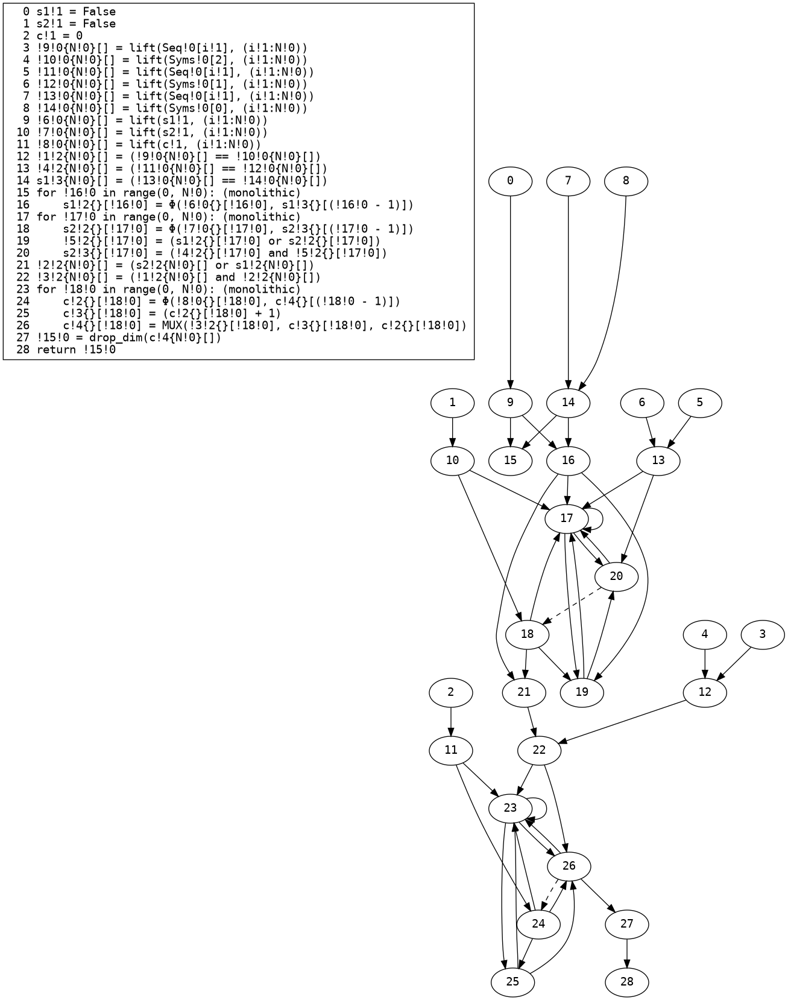
#### Type Environment After Vectorization
| Variable | Type |
| - | - |
| `Seq!0` | `shared[list[int; ?]]` |
| `N!0` | `plaintext[int]` |
| `Syms!0` | `shared[list[int; ?]]` |
| `!16!0` | `plaintext[int]` |
| `!17!0` | `plaintext[int]` |
| `!18!0` | `plaintext[int]` |
| `!15!0` | `shared[int]` |
| `c!4` | `shared[list[int; (N!0)]]` |
| `c!2` | `shared[list[int; (N!0)]]` |
| `c!3` | `shared[list[int; (N!0)]]` |
| `!3!2` | `shared[list[bool; (N!0)]]` |
| `!2!2` | `shared[list[bool; (N!0)]]` |
| `s2!3` | `shared[list[bool; (N!0)]]` |
| `s2!2` | `shared[list[bool; (N!0)]]` |
| `!5!2` | `shared[list[bool; (N!0)]]` |
| `s1!2` | `shared[list[bool; (N!0)]]` |
| `s1!3` | `shared[list[bool; (N!0)]]` |
| `!4!2` | `shared[list[bool; (N!0)]]` |
| `!1!2` | `shared[list[bool; (N!0)]]` |
| `!8!0` | `shared[list[int; (N!0)]]` |
| `!7!0` | `shared[list[bool; (N!0)]]` |
| `!6!0` | `shared[list[bool; (N!0)]]` |
| `!14!0` | `shared[list[int; (N!0)]]` |
| `!13!0` | `shared[list[int; (N!0)]]` |
| `!12!0` | `shared[list[int; (N!0)]]` |
| `!11!0` | `shared[list[int; (N!0)]]` |
| `!10!0` | `shared[list[int; (N!0)]]` |
| `!9!0` | `shared[list[int; (N!0)]]` |
| `c!1` | `plaintext[int]` |
| `s2!1` | `plaintext[bool]` |
| `s1!1` | `plaintext[bool]` |
#### Copy propagation
```python
def count_123(Seq!0: shared[list[int; ?]], N!0: plaintext[int], Syms!0: shared[list[int; ?]]) -> shared[int]:
    s1!1 = False
    s2!1 = False
    c!1 = 0
    !9!0{N!0}[] = lift(Seq!0[i!1], (i!1:N!0))
    !10!0{N!0}[] = lift(Syms!0[2], (i!1:N!0))
    !11!0{N!0}[] = lift(Seq!0[i!1], (i!1:N!0))
    !12!0{N!0}[] = lift(Syms!0[1], (i!1:N!0))
    !13!0{N!0}[] = lift(Seq!0[i!1], (i!1:N!0))
    !14!0{N!0}[] = lift(Syms!0[0], (i!1:N!0))
    !6!0{N!0}[] = lift(s1!1, (i!1:N!0))
    !7!0{N!0}[] = lift(s2!1, (i!1:N!0))
    !8!0{N!0}[] = lift(c!1, (i!1:N!0))
    !1!2{N!0}[] = (!9!0{N!0}[] == !10!0{N!0}[])
    !4!2{N!0}[] = (!11!0{N!0}[] == !12!0{N!0}[])
    s1!3{N!0}[] = (!13!0{N!0}[] == !14!0{N!0}[])
    for !16!0 in range(0, N!0): (monolithic)
        s1!2{}[!16!0] = Φ(!6!0{}[!16!0], s1!3{}[(!16!0 - 1)])
    for !17!0 in range(0, N!0): (monolithic)
        s2!2{}[!17!0] = Φ(!7!0{}[!17!0], s2!3{}[(!17!0 - 1)])
        !5!2{}[!17!0] = (s1!2{}[!17!0] or s2!2{}[!17!0])
        s2!3{}[!17!0] = (!4!2{}[!17!0] and !5!2{}[!17!0])
    !2!2{N!0}[] = (s2!2{N!0}[] or s1!2{N!0}[])
    !3!2{N!0}[] = (!1!2{N!0}[] and !2!2{N!0}[])
    for !18!0 in range(0, N!0): (monolithic)
        c!2{}[!18!0] = Φ(!8!0{}[!18!0], c!4{}[(!18!0 - 1)])
        c!3{}[!18!0] = (c!2{}[!18!0] + 1)
        c!4{}[!18!0] = MUX(!3!2{}[!18!0], c!3{}[!18!0], c!2{}[!18!0])
    !15!0 = drop_dim(c!4{N!0}[])
    return !15!0
```
#### Common subexpression elimination
```python
def count_123(Seq!0: shared[list[int; ?]], N!0: plaintext[int], Syms!0: shared[list[int; ?]]) -> shared[int]:
    s1!1 = False
    s2!1 = False
    c!1 = 0
    !9!0{N!0}[] = lift(Seq!0[i!1], (i!1:N!0))
    !10!0{N!0}[] = lift(Syms!0[2], (i!1:N!0))
    !12!0{N!0}[] = lift(Syms!0[1], (i!1:N!0))
    !14!0{N!0}[] = lift(Syms!0[0], (i!1:N!0))
    !6!0{N!0}[] = lift(s1!1, (i!1:N!0))
    !7!0{N!0}[] = lift(s2!1, (i!1:N!0))
    !8!0{N!0}[] = lift(c!1, (i!1:N!0))
    !1!2{N!0}[] = (!9!0{N!0}[] == !10!0{N!0}[])
    !4!2{N!0}[] = (!9!0{N!0}[] == !12!0{N!0}[])
    s1!3{N!0}[] = (!9!0{N!0}[] == !14!0{N!0}[])
    for !16!0 in range(0, N!0): (monolithic)
        s1!2{}[!16!0] = Φ(!6!0{}[!16!0], s1!3{}[(!16!0 - 1)])
    for !17!0 in range(0, N!0): (monolithic)
        s2!2{}[!17!0] = Φ(!7!0{}[!17!0], s2!3{}[(!17!0 - 1)])
        !5!2{}[!17!0] = (s1!2{}[!17!0] or s2!2{}[!17!0])
        s2!3{}[!17!0] = (!4!2{}[!17!0] and !5!2{}[!17!0])
    !2!2{N!0}[] = (s2!2{N!0}[] or s1!2{N!0}[])
    !3!2{N!0}[] = (!1!2{N!0}[] and !2!2{N!0}[])
    for !18!0 in range(0, N!0): (monolithic)
        c!2{}[!18!0] = Φ(!8!0{}[!18!0], c!4{}[(!18!0 - 1)])
        c!3{}[!18!0] = (c!2{}[!18!0] + 1)
        c!4{}[!18!0] = MUX(!3!2{}[!18!0], c!3{}[!18!0], c!2{}[!18!0])
    !15!0 = drop_dim(c!4{N!0}[])
    return !15!0
```
#### MOTION mixed configuration
```Total cost:	0.29184
Input vars:	{Syms!0: ['Y'], Seq!0: ['Y']}
Constants:	{False: ['Y'], 0: ['Y'], 1: ['Y']}
Plaintext vars:	{}
Flags:		{}
s1!1 = False: _ -> ['Y'] for 0.00000 * 1 = 0.00
s2!1 = False: _ -> ['Y'] for 0.00000 * 1 = 0.00
c!1 = 0: _ -> ['Y'] for 0.00000 * 1 = 0.00
!9!0{N!0}[] = lift(Seq!0[i!1], (i!1:N!0)): _ -> ['Y'] for 0.00000 * 1 = 0.00
!10!0{N!0}[] = lift(Syms!0[2], (i!1:N!0)): _ -> ['Y'] for 0.00000 * 1 = 0.00
!12!0{N!0}[] = lift(Syms!0[1], (i!1:N!0)): _ -> ['Y'] for 0.00000 * 1 = 0.00
!14!0{N!0}[] = lift(Syms!0[0], (i!1:N!0)): _ -> ['Y'] for 0.00000 * 1 = 0.00
!6!0{N!0}[] = lift(s1!1, (i!1:N!0)): _ -> ['Y'] for 0.00000 * 1 = 0.00
!7!0{N!0}[] = lift(s2!1, (i!1:N!0)): _ -> ['Y'] for 0.00000 * 1 = 0.00
!8!0{N!0}[] = lift(c!1, (i!1:N!0)): _ -> ['Y'] for 0.00000 * 1 = 0.00
!1!2{N!0}[] = (!9!0{N!0}[] == !10!0{N!0}[]): Y -> {} for 0.01489 * 1 = 0.01
!4!2{N!0}[] = (!9!0{N!0}[] == !12!0{N!0}[]): Y -> {} for 0.01489 * 1 = 0.01
s1!3{N!0}[] = (!9!0{N!0}[] == !14!0{N!0}[]): Y -> {} for 0.01489 * 1 = 0.01
	s1!2{}[!16!0] = Φ(!6!0{}[!16!0], s1!3{}[(!16!0 - 1)]): Y -> {} for 0.00000 * 7 = 0.00
	s2!2{}[!17!0] = Φ(!7!0{}[!17!0], s2!3{}[(!17!0 - 1)]): Y -> {} for 0.00000 * 7 = 0.00
	!5!2{}[!17!0] = (s1!2{}[!17!0] or s2!2{}[!17!0]): Y -> {} for 0.00282 * 7 = 0.02
	s2!3{}[!17!0] = (!4!2{}[!17!0] and !5!2{}[!17!0]): Y -> {} for 0.00245 * 7 = 0.02
!2!2{N!0}[] = (s2!2{N!0}[] or s1!2{N!0}[]): Y -> {} for 0.00221 * 1 = 0.00
!3!2{N!0}[] = (!1!2{N!0}[] and !2!2{N!0}[]): Y -> {} for 0.00168 * 1 = 0.00
	c!2{}[!18!0] = Φ(!8!0{}[!18!0], c!4{}[(!18!0 - 1)]): Y -> {} for 0.00000 * 7 = 0.00
	c!3{}[!18!0] = (c!2{}[!18!0] + 1): Y -> {} for 0.02351 * 7 = 0.16
	c!4{}[!18!0] = MUX(!3!2{}[!18!0], c!3{}[!18!0], c!2{}[!18!0]): Y -> {} for 0.00597 * 7 = 0.04
!15!0 = drop_dim(c!4{N!0}[]): _ -> ['Y'] for 0.00000 * 1 = 0.00
return !15!0
Output vars:	{!15!0: ['Y']}

```
#### MOTION code
```cpp
template <encrypto::motion::MpcProtocol Protocol>
encrypto::motion::SecureUnsignedInteger count_123(
    encrypto::motion::PartyPointer &party,
    std::vector<encrypto::motion::SecureUnsignedInteger> Seq_0,
    std::uint32_t _MPC_PLAINTEXT_N_0,
    std::vector<encrypto::motion::SecureUnsignedInteger> Syms_0
) {
    // Shared variable declarations
    std::vector<encrypto::motion::ShareWrapper> _1_2((_MPC_PLAINTEXT_N_0));
    std::vector<encrypto::motion::SecureUnsignedInteger> _10_0((_MPC_PLAINTEXT_N_0));
    std::vector<encrypto::motion::SecureUnsignedInteger> _12_0((_MPC_PLAINTEXT_N_0));
    std::vector<encrypto::motion::SecureUnsignedInteger> _14_0((_MPC_PLAINTEXT_N_0));
    encrypto::motion::SecureUnsignedInteger _15_0;
    encrypto::motion::SecureUnsignedInteger _16_0;
    encrypto::motion::SecureUnsignedInteger _17_0;
    encrypto::motion::SecureUnsignedInteger _18_0;
    std::vector<encrypto::motion::ShareWrapper> _2_2((_MPC_PLAINTEXT_N_0));
    std::vector<encrypto::motion::ShareWrapper> _3_2((_MPC_PLAINTEXT_N_0));
    std::vector<encrypto::motion::ShareWrapper> _4_2((_MPC_PLAINTEXT_N_0));
    std::vector<encrypto::motion::ShareWrapper> _5_2((_MPC_PLAINTEXT_N_0));
    std::vector<encrypto::motion::ShareWrapper> _6_0((_MPC_PLAINTEXT_N_0));
    std::vector<encrypto::motion::ShareWrapper> _7_0((_MPC_PLAINTEXT_N_0));
    std::vector<encrypto::motion::SecureUnsignedInteger> _8_0((_MPC_PLAINTEXT_N_0));
    std::vector<encrypto::motion::SecureUnsignedInteger> _9_0((_MPC_PLAINTEXT_N_0));
    encrypto::motion::SecureUnsignedInteger N_0;
    encrypto::motion::SecureUnsignedInteger c_1;
    std::vector<encrypto::motion::SecureUnsignedInteger> c_2((_MPC_PLAINTEXT_N_0));
    std::vector<encrypto::motion::SecureUnsignedInteger> c_3((_MPC_PLAINTEXT_N_0));
    std::vector<encrypto::motion::SecureUnsignedInteger> c_4((_MPC_PLAINTEXT_N_0));
    encrypto::motion::ShareWrapper s1_1;
    std::vector<encrypto::motion::ShareWrapper> s1_2((_MPC_PLAINTEXT_N_0));
    std::vector<encrypto::motion::ShareWrapper> s1_3((_MPC_PLAINTEXT_N_0));
    encrypto::motion::ShareWrapper s2_1;
    std::vector<encrypto::motion::ShareWrapper> s2_2((_MPC_PLAINTEXT_N_0));
    std::vector<encrypto::motion::ShareWrapper> s2_3((_MPC_PLAINTEXT_N_0));

    // Plaintext variable declarations
    std::uint32_t _MPC_PLAINTEXT__16_0;
    std::uint32_t _MPC_PLAINTEXT__17_0;
    std::uint32_t _MPC_PLAINTEXT__18_0;
    std::uint32_t _MPC_PLAINTEXT_c_1;
    bool _MPC_PLAINTEXT_s1_1;
    bool _MPC_PLAINTEXT_s2_1;

    // Constant initializations
    encrypto::motion::SecureUnsignedInteger _MPC_CONSTANT_0 = party->In<Protocol>(encrypto::motion::ToInput(std::uint32_t(0)), 0);
    encrypto::motion::SecureUnsignedInteger _MPC_CONSTANT_1 = party->In<Protocol>(encrypto::motion::ToInput(std::uint32_t(1)), 0);
    encrypto::motion::ShareWrapper _MPC_CONSTANT_false = party->In<Protocol>(encrypto::motion::BitVector(1, false), 0);

    // Plaintext parameter assignments
    N_0 = party->In<Protocol>(encrypto::motion::ToInput(_MPC_PLAINTEXT_N_0), 0);

    // Function body
    s1_1 = _MPC_CONSTANT_false;
    _MPC_PLAINTEXT_s1_1 = false;
    s2_1 = _MPC_CONSTANT_false;
    _MPC_PLAINTEXT_s2_1 = false;
    c_1 = _MPC_CONSTANT_0;
    _MPC_PLAINTEXT_c_1 = std::uint32_t(0);
    vectorized_assign(_9_0, {_MPC_PLAINTEXT_N_0}, {true}, {}, lift(std::function([&](const std::vector<std::uint32_t> &indices){return Seq_0[indices[0]];}), {_MPC_PLAINTEXT_N_0}));
    vectorized_assign(_10_0, {_MPC_PLAINTEXT_N_0}, {true}, {}, lift(std::function([&](const std::vector<std::uint32_t> &indices){return Syms_0[std::uint32_t(2)];}), {_MPC_PLAINTEXT_N_0}));
    vectorized_assign(_12_0, {_MPC_PLAINTEXT_N_0}, {true}, {}, lift(std::function([&](const std::vector<std::uint32_t> &indices){return Syms_0[std::uint32_t(1)];}), {_MPC_PLAINTEXT_N_0}));
    vectorized_assign(_14_0, {_MPC_PLAINTEXT_N_0}, {true}, {}, lift(std::function([&](const std::vector<std::uint32_t> &indices){return Syms_0[std::uint32_t(0)];}), {_MPC_PLAINTEXT_N_0}));
    vectorized_assign(_6_0, {_MPC_PLAINTEXT_N_0}, {true}, {}, lift(std::function([&](const std::vector<std::uint32_t> &indices){return s1_1;}), {_MPC_PLAINTEXT_N_0}));
    vectorized_assign(_7_0, {_MPC_PLAINTEXT_N_0}, {true}, {}, lift(std::function([&](const std::vector<std::uint32_t> &indices){return s2_1;}), {_MPC_PLAINTEXT_N_0}));
    vectorized_assign(_8_0, {_MPC_PLAINTEXT_N_0}, {true}, {}, lift(std::function([&](const std::vector<std::uint32_t> &indices){return c_1;}), {_MPC_PLAINTEXT_N_0}));
    vectorized_assign(_1_2, {_MPC_PLAINTEXT_N_0}, {true}, {}, (to_share_wrapper(vectorized_access(_9_0, {_MPC_PLAINTEXT_N_0}, {true}, {})) == to_share_wrapper(vectorized_access(_10_0, {_MPC_PLAINTEXT_N_0}, {true}, {}))));
    vectorized_assign(_4_2, {_MPC_PLAINTEXT_N_0}, {true}, {}, (to_share_wrapper(vectorized_access(_9_0, {_MPC_PLAINTEXT_N_0}, {true}, {})) == to_share_wrapper(vectorized_access(_12_0, {_MPC_PLAINTEXT_N_0}, {true}, {}))));
    vectorized_assign(s1_3, {_MPC_PLAINTEXT_N_0}, {true}, {}, (to_share_wrapper(vectorized_access(_9_0, {_MPC_PLAINTEXT_N_0}, {true}, {})) == to_share_wrapper(vectorized_access(_14_0, {_MPC_PLAINTEXT_N_0}, {true}, {}))));

    // Initialize loop counter
    _MPC_PLAINTEXT__16_0 = std::uint32_t(0);
    // Initialize phi values
    s1_2[_MPC_PLAINTEXT__16_0] = _6_0[_MPC_PLAINTEXT__16_0];
    for (; _MPC_PLAINTEXT__16_0 < _MPC_PLAINTEXT_N_0; _MPC_PLAINTEXT__16_0++) {
        // Update phi values
        if (_MPC_PLAINTEXT__16_0 != std::uint32_t(0)) {
            s1_2[_MPC_PLAINTEXT__16_0] = s1_3[(_MPC_PLAINTEXT__16_0 - std::uint32_t(1))];
        }


    }


    // Initialize loop counter
    _MPC_PLAINTEXT__17_0 = std::uint32_t(0);
    // Initialize phi values
    s2_2[_MPC_PLAINTEXT__17_0] = _7_0[_MPC_PLAINTEXT__17_0];
    for (; _MPC_PLAINTEXT__17_0 < _MPC_PLAINTEXT_N_0; _MPC_PLAINTEXT__17_0++) {
        // Update phi values
        if (_MPC_PLAINTEXT__17_0 != std::uint32_t(0)) {
            s2_2[_MPC_PLAINTEXT__17_0] = s2_3[(_MPC_PLAINTEXT__17_0 - std::uint32_t(1))];
        }

        _5_2[_MPC_PLAINTEXT__17_0] = (to_share_wrapper(s1_2[_MPC_PLAINTEXT__17_0]) | to_share_wrapper(s2_2[_MPC_PLAINTEXT__17_0]));
        s2_3[_MPC_PLAINTEXT__17_0] = (to_share_wrapper(_4_2[_MPC_PLAINTEXT__17_0]) & to_share_wrapper(_5_2[_MPC_PLAINTEXT__17_0]));

    }

    vectorized_assign(_2_2, {_MPC_PLAINTEXT_N_0}, {true}, {}, (to_share_wrapper(vectorized_access(s2_2, {_MPC_PLAINTEXT_N_0}, {true}, {})) | to_share_wrapper(vectorized_access(s1_2, {_MPC_PLAINTEXT_N_0}, {true}, {}))));
    vectorized_assign(_3_2, {_MPC_PLAINTEXT_N_0}, {true}, {}, (to_share_wrapper(vectorized_access(_1_2, {_MPC_PLAINTEXT_N_0}, {true}, {})) & to_share_wrapper(vectorized_access(_2_2, {_MPC_PLAINTEXT_N_0}, {true}, {}))));

    // Initialize loop counter
    _MPC_PLAINTEXT__18_0 = std::uint32_t(0);
    // Initialize phi values
    c_2[_MPC_PLAINTEXT__18_0] = _8_0[_MPC_PLAINTEXT__18_0];
    for (; _MPC_PLAINTEXT__18_0 < _MPC_PLAINTEXT_N_0; _MPC_PLAINTEXT__18_0++) {
        // Update phi values
        if (_MPC_PLAINTEXT__18_0 != std::uint32_t(0)) {
            c_2[_MPC_PLAINTEXT__18_0] = c_4[(_MPC_PLAINTEXT__18_0 - std::uint32_t(1))];
        }

        c_3[_MPC_PLAINTEXT__18_0] = (c_2[_MPC_PLAINTEXT__18_0] + _MPC_CONSTANT_1);
        c_4[_MPC_PLAINTEXT__18_0] = _3_2[_MPC_PLAINTEXT__18_0].Mux(c_3[_MPC_PLAINTEXT__18_0].Get(), c_2[_MPC_PLAINTEXT__18_0].Get());

    }

    _15_0 = drop_dim_monoreturn(vectorized_access(c_4, {_MPC_PLAINTEXT_N_0}, {true}, {}).Unsimdify(), {_MPC_PLAINTEXT_N_0});
    return _15_0;

}
```
#### MOTION mixed code
```cpp
encrypto::motion::SecureUnsignedInteger count_123(
    encrypto::motion::PartyPointer &party,
    std::vector<encrypto::motion::SecureUnsignedInteger> Seq_0,
    std::uint32_t _MPC_PLAINTEXT_N_0,
    std::vector<encrypto::motion::SecureUnsignedInteger> Syms_0
) {
    // Shared variable declarations
    std::vector<encrypto::motion::ShareWrapper> _1_2((_MPC_PLAINTEXT_N_0));
    std::vector<encrypto::motion::SecureUnsignedInteger> _10_0((_MPC_PLAINTEXT_N_0));
    std::vector<encrypto::motion::SecureUnsignedInteger> _12_0((_MPC_PLAINTEXT_N_0));
    std::vector<encrypto::motion::SecureUnsignedInteger> _14_0((_MPC_PLAINTEXT_N_0));
    encrypto::motion::SecureUnsignedInteger _15_0;
    encrypto::motion::SecureUnsignedInteger _16_0;
    encrypto::motion::SecureUnsignedInteger _17_0;
    encrypto::motion::SecureUnsignedInteger _18_0;
    std::vector<encrypto::motion::ShareWrapper> _2_2((_MPC_PLAINTEXT_N_0));
    std::vector<encrypto::motion::ShareWrapper> _3_2((_MPC_PLAINTEXT_N_0));
    std::vector<encrypto::motion::ShareWrapper> _4_2((_MPC_PLAINTEXT_N_0));
    std::vector<encrypto::motion::ShareWrapper> _5_2((_MPC_PLAINTEXT_N_0));
    std::vector<encrypto::motion::ShareWrapper> _6_0((_MPC_PLAINTEXT_N_0));
    std::vector<encrypto::motion::ShareWrapper> _7_0((_MPC_PLAINTEXT_N_0));
    std::vector<encrypto::motion::SecureUnsignedInteger> _8_0((_MPC_PLAINTEXT_N_0));
    std::vector<encrypto::motion::SecureUnsignedInteger> _9_0((_MPC_PLAINTEXT_N_0));
    encrypto::motion::SecureUnsignedInteger N_0;
    encrypto::motion::SecureUnsignedInteger c_1;
    std::vector<encrypto::motion::SecureUnsignedInteger> c_2((_MPC_PLAINTEXT_N_0));
    std::vector<encrypto::motion::SecureUnsignedInteger> c_3((_MPC_PLAINTEXT_N_0));
    std::vector<encrypto::motion::SecureUnsignedInteger> c_4((_MPC_PLAINTEXT_N_0));
    encrypto::motion::ShareWrapper s1_1;
    std::vector<encrypto::motion::ShareWrapper> s1_2((_MPC_PLAINTEXT_N_0));
    std::vector<encrypto::motion::ShareWrapper> s1_3((_MPC_PLAINTEXT_N_0));
    encrypto::motion::ShareWrapper s2_1;
    std::vector<encrypto::motion::ShareWrapper> s2_2((_MPC_PLAINTEXT_N_0));
    std::vector<encrypto::motion::ShareWrapper> s2_3((_MPC_PLAINTEXT_N_0));

    // Plaintext variable declarations
    std::uint32_t _MPC_PLAINTEXT__16_0;
    std::uint32_t _MPC_PLAINTEXT__17_0;
    std::uint32_t _MPC_PLAINTEXT__18_0;
    std::uint32_t _MPC_PLAINTEXT_c_1;
    bool _MPC_PLAINTEXT_s1_1;
    bool _MPC_PLAINTEXT_s2_1;

    // Constant initializations
    encrypto::motion::SecureUnsignedInteger _MPC_CONSTANT_0 = party->In<encrypto::motion::MpcProtocol::kBmr>(encrypto::motion::ToInput(std::uint32_t(0)), 0);
    encrypto::motion::SecureUnsignedInteger _MPC_CONSTANT_1 = party->In<encrypto::motion::MpcProtocol::kBmr>(encrypto::motion::ToInput(std::uint32_t(1)), 0);
    encrypto::motion::ShareWrapper _MPC_CONSTANT_false = party->In<encrypto::motion::MpcProtocol::kBmr>(encrypto::motion::BitVector(1, false), 0);

    // Input Protocol Convertions

    // Plaintext parameter assignments

    // Function body
    s1_1 = _MPC_CONSTANT_false;
    _MPC_PLAINTEXT_s1_1 = false;
    s2_1 = _MPC_CONSTANT_false;
    _MPC_PLAINTEXT_s2_1 = false;
    c_1 = _MPC_CONSTANT_0;
    _MPC_PLAINTEXT_c_1 = std::uint32_t(0);
    vectorized_assign(_9_0, {_MPC_PLAINTEXT_N_0}, {true}, {}, lift(std::function([&](const std::vector<std::uint32_t> &indices){return Seq_0[indices[0]];}), {_MPC_PLAINTEXT_N_0}));
    vectorized_assign(_10_0, {_MPC_PLAINTEXT_N_0}, {true}, {}, lift(std::function([&](const std::vector<std::uint32_t> &indices){return Syms_0[std::uint32_t(2)];}), {_MPC_PLAINTEXT_N_0}));
    vectorized_assign(_12_0, {_MPC_PLAINTEXT_N_0}, {true}, {}, lift(std::function([&](const std::vector<std::uint32_t> &indices){return Syms_0[std::uint32_t(1)];}), {_MPC_PLAINTEXT_N_0}));
    vectorized_assign(_14_0, {_MPC_PLAINTEXT_N_0}, {true}, {}, lift(std::function([&](const std::vector<std::uint32_t> &indices){return Syms_0[std::uint32_t(0)];}), {_MPC_PLAINTEXT_N_0}));
    vectorized_assign(_6_0, {_MPC_PLAINTEXT_N_0}, {true}, {}, lift(std::function([&](const std::vector<std::uint32_t> &indices){return s1_1;}), {_MPC_PLAINTEXT_N_0}));
    vectorized_assign(_7_0, {_MPC_PLAINTEXT_N_0}, {true}, {}, lift(std::function([&](const std::vector<std::uint32_t> &indices){return s2_1;}), {_MPC_PLAINTEXT_N_0}));
    vectorized_assign(_8_0, {_MPC_PLAINTEXT_N_0}, {true}, {}, lift(std::function([&](const std::vector<std::uint32_t> &indices){return c_1;}), {_MPC_PLAINTEXT_N_0}));
    vectorized_assign(_1_2, {_MPC_PLAINTEXT_N_0}, {true}, {}, (to_share_wrapper(vectorized_access(_9_0, {_MPC_PLAINTEXT_N_0}, {true}, {})) == to_share_wrapper(vectorized_access(_10_0, {_MPC_PLAINTEXT_N_0}, {true}, {}))));
    vectorized_assign(_4_2, {_MPC_PLAINTEXT_N_0}, {true}, {}, (to_share_wrapper(vectorized_access(_9_0, {_MPC_PLAINTEXT_N_0}, {true}, {})) == to_share_wrapper(vectorized_access(_12_0, {_MPC_PLAINTEXT_N_0}, {true}, {}))));
    vectorized_assign(s1_3, {_MPC_PLAINTEXT_N_0}, {true}, {}, (to_share_wrapper(vectorized_access(_9_0, {_MPC_PLAINTEXT_N_0}, {true}, {})) == to_share_wrapper(vectorized_access(_14_0, {_MPC_PLAINTEXT_N_0}, {true}, {}))));

    // Initialize loop counter
    _MPC_PLAINTEXT__16_0 = std::uint32_t(0);
    // Initialize phi values
    s1_2[_MPC_PLAINTEXT__16_0] = _6_0[_MPC_PLAINTEXT__16_0];
    for (; _MPC_PLAINTEXT__16_0 < _MPC_PLAINTEXT_N_0; _MPC_PLAINTEXT__16_0++) {
        // Update phi values
        if (_MPC_PLAINTEXT__16_0 != std::uint32_t(0)) {
            s1_2[_MPC_PLAINTEXT__16_0] = s1_3[(_MPC_PLAINTEXT__16_0 - std::uint32_t(1))];
        }


    }


    // Initialize loop counter
    _MPC_PLAINTEXT__17_0 = std::uint32_t(0);
    // Initialize phi values
    s2_2[_MPC_PLAINTEXT__17_0] = _7_0[_MPC_PLAINTEXT__17_0];
    for (; _MPC_PLAINTEXT__17_0 < _MPC_PLAINTEXT_N_0; _MPC_PLAINTEXT__17_0++) {
        // Update phi values
        if (_MPC_PLAINTEXT__17_0 != std::uint32_t(0)) {
            s2_2[_MPC_PLAINTEXT__17_0] = s2_3[(_MPC_PLAINTEXT__17_0 - std::uint32_t(1))];
        }

        _5_2[_MPC_PLAINTEXT__17_0] = (to_share_wrapper(s1_2[_MPC_PLAINTEXT__17_0]) | to_share_wrapper(s2_2[_MPC_PLAINTEXT__17_0]));
        s2_3[_MPC_PLAINTEXT__17_0] = (to_share_wrapper(_4_2[_MPC_PLAINTEXT__17_0]) & to_share_wrapper(_5_2[_MPC_PLAINTEXT__17_0]));

    }

    vectorized_assign(_2_2, {_MPC_PLAINTEXT_N_0}, {true}, {}, (to_share_wrapper(vectorized_access(s2_2, {_MPC_PLAINTEXT_N_0}, {true}, {})) | to_share_wrapper(vectorized_access(s1_2, {_MPC_PLAINTEXT_N_0}, {true}, {}))));
    vectorized_assign(_3_2, {_MPC_PLAINTEXT_N_0}, {true}, {}, (to_share_wrapper(vectorized_access(_1_2, {_MPC_PLAINTEXT_N_0}, {true}, {})) & to_share_wrapper(vectorized_access(_2_2, {_MPC_PLAINTEXT_N_0}, {true}, {}))));

    // Initialize loop counter
    _MPC_PLAINTEXT__18_0 = std::uint32_t(0);
    // Initialize phi values
    c_2[_MPC_PLAINTEXT__18_0] = _8_0[_MPC_PLAINTEXT__18_0];
    for (; _MPC_PLAINTEXT__18_0 < _MPC_PLAINTEXT_N_0; _MPC_PLAINTEXT__18_0++) {
        // Update phi values
        if (_MPC_PLAINTEXT__18_0 != std::uint32_t(0)) {
            c_2[_MPC_PLAINTEXT__18_0] = c_4[(_MPC_PLAINTEXT__18_0 - std::uint32_t(1))];
        }

        c_3[_MPC_PLAINTEXT__18_0] = (c_2[_MPC_PLAINTEXT__18_0] + _MPC_CONSTANT_1);
        c_4[_MPC_PLAINTEXT__18_0] = _3_2[_MPC_PLAINTEXT__18_0].Mux(c_3[_MPC_PLAINTEXT__18_0].Get(), c_2[_MPC_PLAINTEXT__18_0].Get());

    }

    _15_0 = drop_dim_monoreturn(vectorized_access(c_4, {_MPC_PLAINTEXT_N_0}, {true}, {}).Unsimdify(), {_MPC_PLAINTEXT_N_0});
    return _15_0;

}
```
#### MP-SPDZ mixed configuration
```Total cost:	0.00016
Input vars:	{Syms!0: ['B'], Seq!0: ['B']}
Constants:	{False: ['B'], 0: ['B'], 1: ['B']}
Plaintext vars:	{}
Flags:		{X}
s1!1 = False: _ -> ['B'] for 0.00000 * 1 = 0.00
s2!1 = False: _ -> ['B'] for 0.00000 * 1 = 0.00
c!1 = 0: _ -> ['B'] for 0.00000 * 1 = 0.00
!9!0{N!0}[] = lift(Seq!0[i!1], (i!1:N!0)): _ -> ['B'] for 0.00000 * 1 = 0.00
!10!0{N!0}[] = lift(Syms!0[2], (i!1:N!0)): _ -> ['B'] for 0.00000 * 1 = 0.00
!12!0{N!0}[] = lift(Syms!0[1], (i!1:N!0)): _ -> ['B'] for 0.00000 * 1 = 0.00
!14!0{N!0}[] = lift(Syms!0[0], (i!1:N!0)): _ -> ['B'] for 0.00000 * 1 = 0.00
!6!0{N!0}[] = lift(s1!1, (i!1:N!0)): _ -> ['B'] for 0.00000 * 1 = 0.00
!7!0{N!0}[] = lift(s2!1, (i!1:N!0)): _ -> ['B'] for 0.00000 * 1 = 0.00
!8!0{N!0}[] = lift(c!1, (i!1:N!0)): _ -> ['B'] for 0.00000 * 1 = 0.00
!1!2{N!0}[] = (!9!0{N!0}[] == !10!0{N!0}[]): B -> {} for 0.00003 * 1 = 0.00
!4!2{N!0}[] = (!9!0{N!0}[] == !12!0{N!0}[]): B -> {} for 0.00003 * 1 = 0.00
s1!3{N!0}[] = (!9!0{N!0}[] == !14!0{N!0}[]): B -> {} for 0.00003 * 1 = 0.00
	s1!2{}[!16!0] = Φ(!6!0{}[!16!0], s1!3{}[(!16!0 - 1)]): B -> {} for 0.00000 * 7 = 0.00
	s2!2{}[!17!0] = Φ(!7!0{}[!17!0], s2!3{}[(!17!0 - 1)]): B -> {} for 0.00000 * 7 = 0.00
	!5!2{}[!17!0] = (s1!2{}[!17!0] or s2!2{}[!17!0]): B -> {} for 0.00000 * 7 = 0.00
	s2!3{}[!17!0] = (!4!2{}[!17!0] and !5!2{}[!17!0]): B -> {} for 0.00000 * 7 = 0.00
!2!2{N!0}[] = (s2!2{N!0}[] or s1!2{N!0}[]): B -> {} for 0.00001 * 1 = 0.00
!3!2{N!0}[] = (!1!2{N!0}[] and !2!2{N!0}[]): B -> {} for 0.00000 * 1 = 0.00
	c!2{}[!18!0] = Φ(!8!0{}[!18!0], c!4{}[(!18!0 - 1)]): B -> {} for 0.00000 * 7 = 0.00
	c!3{}[!18!0] = (c!2{}[!18!0] + 1): B -> {} for 0.00001 * 7 = 0.00
	c!4{}[!18!0] = MUX(!3!2{}[!18!0], c!3{}[!18!0], c!2{}[!18!0]): B -> {} for 0.00000 * 7 = 0.00
!15!0 = drop_dim(c!4{N!0}[]): _ -> ['B'] for 0.00000 * 1 = 0.00
return !15!0
Output vars:	{!15!0: ['B']}

```
#### MP-SPDZ code
```py
def count_123(Seq_0, N_0, Syms_0):
    # Shared array declarations
    _1_2 = [None] * (N_0)
    _10_0 = [None] * (N_0)
    _12_0 = [None] * (N_0)
    _14_0 = [None] * (N_0)
    _2_2 = [None] * (N_0)
    _3_2 = [None] * (N_0)
    _4_2 = [None] * (N_0)
    _5_2 = [None] * (N_0)
    _6_0 = [None] * (N_0)
    _7_0 = [None] * (N_0)
    _8_0 = [None] * (N_0)
    _9_0 = [None] * (N_0)
    c_2 = [None] * (N_0)
    c_3 = [None] * (N_0)
    c_4 = [None] * (N_0)
    s1_2 = [None] * (N_0)
    s1_3 = [None] * (N_0)
    s2_2 = [None] * (N_0)
    s2_3 = [None] * (N_0)
    # Function body
    s1_1 = _v.sbool(False)
    s2_1 = _v.sbool(False)
    c_1 = sint(0)
    _9_0 = _v.lift(lambda indices: (Seq_0[indices[0]]), [N_0])
    _10_0 = _v.lift(lambda indices: (Syms_0[2]), [N_0])
    _12_0 = _v.lift(lambda indices: (Syms_0[1]), [N_0])
    _14_0 = _v.lift(lambda indices: (Syms_0[0]), [N_0])
    _6_0 = _v.lift(lambda indices: s1_1, [N_0])
    _7_0 = _v.lift(lambda indices: s2_1, [N_0])
    _8_0 = _v.lift(lambda indices: c_1, [N_0])
    _v.vectorized_assign(_1_2, [N_0], [None], (_v.vectorized_access_simd(_9_0, [N_0], [None]) == _v.vectorized_access_simd(_10_0, [N_0], [None])))
    _v.vectorized_assign(_4_2, [N_0], [None], (_v.vectorized_access_simd(_9_0, [N_0], [None]) == _v.vectorized_access_simd(_12_0, [N_0], [None])))
    _v.vectorized_assign(s1_3, [N_0], [None], (_v.vectorized_access_simd(_9_0, [N_0], [None]) == _v.vectorized_access_simd(_14_0, [N_0], [None])))
    for _16_0 in range(0, N_0):
        # Set ϕ value
        if _16_0 == 0:
            _v.vectorized_assign(s1_2, [N_0], [_16_0], _v.vectorized_access(_6_0, [N_0], [_16_0]))
        else:
            _v.vectorized_assign(s1_2, [N_0], [_16_0], _v.vectorized_access(s1_3, [N_0], [(_16_0 - 1)]))
    # Loop exit ϕ values
    _v.vectorized_assign(s1_2, [N_0], [_16_0], _v.vectorized_access(s1_3, [N_0], [(_16_0 - 1)]))
    for _17_0 in range(0, N_0):
        # Set ϕ value
        if _17_0 == 0:
            _v.vectorized_assign(s2_2, [N_0], [_17_0], _v.vectorized_access(_7_0, [N_0], [_17_0]))
        else:
            _v.vectorized_assign(s2_2, [N_0], [_17_0], _v.vectorized_access(s2_3, [N_0], [(_17_0 - 1)]))
        _v.vectorized_assign(_5_2, [N_0], [_17_0], OR(_v.vectorized_access_simd(s1_2, [N_0], [_17_0]), _v.vectorized_access_simd(s2_2, [N_0], [_17_0])))
        _v.vectorized_assign(s2_3, [N_0], [_17_0], _v.vectorized_access_simd(_4_2, [N_0], [_17_0]).bit_and(_v.vectorized_access_simd(_5_2, [N_0], [_17_0])))
    # Loop exit ϕ values
    _v.vectorized_assign(s2_2, [N_0], [_17_0], _v.vectorized_access(s2_3, [N_0], [(_17_0 - 1)]))
    _v.vectorized_assign(_2_2, [N_0], [None], OR(_v.vectorized_access_simd(s2_2, [N_0], [None]), _v.vectorized_access_simd(s1_2, [N_0], [None])))
    _v.vectorized_assign(_3_2, [N_0], [None], _v.vectorized_access_simd(_1_2, [N_0], [None]).bit_and(_v.vectorized_access_simd(_2_2, [N_0], [None])))
    for _18_0 in range(0, N_0):
        # Set ϕ value
        if _18_0 == 0:
            _v.vectorized_assign(c_2, [N_0], [_18_0], _v.vectorized_access(_8_0, [N_0], [_18_0]))
        else:
            _v.vectorized_assign(c_2, [N_0], [_18_0], _v.vectorized_access(c_4, [N_0], [(_18_0 - 1)]))
        _v.vectorized_assign(c_3, [N_0], [_18_0], (_v.vectorized_access_simd(c_2, [N_0], [_18_0]) + sint(1)))
        _v.iterative_mux(c_4,_3_2,c_3,c_2,[N_0],[_18_0])
    # Loop exit ϕ values
    _v.vectorized_assign(c_2, [N_0], [_18_0], _v.vectorized_access(c_4, [N_0], [(_18_0 - 1)]))
    _15_0 = _v.drop_dim(c_4, [N_0])
    return _15_0
```
#### MP-SPDZ mixed code
```py
program.options.binary = 32
program.use_dabit = True
def count_123(Seq_0, N_0, Syms_0):
    # Convertion functions
    siv32 = sbitintvec.get_type(32)
    sb32 = sbits.get_type(32)
    
    
    # Shared array declarations
    _1_2 = [None] * (N_0)
    _10_0 = [None] * (N_0)
    _12_0 = [None] * (N_0)
    _14_0 = [None] * (N_0)
    _2_2 = [None] * (N_0)
    _3_2 = [None] * (N_0)
    _4_2 = [None] * (N_0)
    _5_2 = [None] * (N_0)
    _6_0 = [None] * (N_0)
    _7_0 = [None] * (N_0)
    _8_0 = [None] * (N_0)
    _9_0 = [None] * (N_0)
    c_2 = [None] * (N_0)
    c_3 = [None] * (N_0)
    c_4 = [None] * (N_0)
    s1_2 = [None] * (N_0)
    s1_3 = [None] * (N_0)
    s2_2 = [None] * (N_0)
    s2_3 = [None] * (N_0)
    # Shared array convertion declarations
    
    # Function body
    s1_1 = sbit(0)
    s2_1 = sbit(0)
    c_1 = siv32(0)
    _9_0 = _v.lift(lambda indices: (Seq_0[indices[0]]), [N_0])
    _10_0 = _v.lift(lambda indices: (Syms_0[2]), [N_0])
    _12_0 = _v.lift(lambda indices: (Syms_0[1]), [N_0])
    _14_0 = _v.lift(lambda indices: (Syms_0[0]), [N_0])
    _6_0 = _v.lift(lambda indices: s1_1, [N_0])
    _7_0 = _v.lift(lambda indices: s2_1, [N_0])
    _8_0 = _v.lift(lambda indices: c_1, [N_0])
    _v.vectorized_assign(_1_2, [N_0], [None], (_v.vectorized_access_simd(_9_0, [N_0], [None]) == _v.vectorized_access_simd(_10_0, [N_0], [None])))
    _v.vectorized_assign(_4_2, [N_0], [None], (_v.vectorized_access_simd(_9_0, [N_0], [None]) == _v.vectorized_access_simd(_12_0, [N_0], [None])))
    _v.vectorized_assign(s1_3, [N_0], [None], (_v.vectorized_access_simd(_9_0, [N_0], [None]) == _v.vectorized_access_simd(_14_0, [N_0], [None])))
    for _16_0 in range(0, N_0):
        # Set ϕ value
        if _16_0 == 0:
            _v.vectorized_assign(s1_2, [N_0], [_16_0], _v.vectorized_access(_6_0, [N_0], [_16_0]))
        else:
            _v.vectorized_assign(s1_2, [N_0], [_16_0], _v.vectorized_access(s1_3, [N_0], [(_16_0 - 1)]))
    # Loop exit ϕ values
    _v.vectorized_assign(s1_2, [N_0], [_16_0], _v.vectorized_access(s1_3, [N_0], [(_16_0 - 1)]))
    for _17_0 in range(0, N_0):
        # Set ϕ value
        if _17_0 == 0:
            _v.vectorized_assign(s2_2, [N_0], [_17_0], _v.vectorized_access(_7_0, [N_0], [_17_0]))
        else:
            _v.vectorized_assign(s2_2, [N_0], [_17_0], _v.vectorized_access(s2_3, [N_0], [(_17_0 - 1)]))
        _v.vectorized_assign(_5_2, [N_0], [_17_0], OR(_v.vectorized_access_simd(s1_2, [N_0], [_17_0]), _v.vectorized_access_simd(s2_2, [N_0], [_17_0])))
        _v.vectorized_assign(s2_3, [N_0], [_17_0], _v.vectorized_access_simd(_4_2, [N_0], [_17_0]).bit_and(_v.vectorized_access_simd(_5_2, [N_0], [_17_0])))
    # Loop exit ϕ values
    _v.vectorized_assign(s2_2, [N_0], [_17_0], _v.vectorized_access(s2_3, [N_0], [(_17_0 - 1)]))
    _v.vectorized_assign(_2_2, [N_0], [None], OR(_v.vectorized_access_simd(s2_2, [N_0], [None]), _v.vectorized_access_simd(s1_2, [N_0], [None])))
    _v.vectorized_assign(_3_2, [N_0], [None], _v.vectorized_access_simd(_1_2, [N_0], [None]).bit_and(_v.vectorized_access_simd(_2_2, [N_0], [None])))
    for _18_0 in range(0, N_0):
        # Set ϕ value
        if _18_0 == 0:
            _v.vectorized_assign(c_2, [N_0], [_18_0], _v.vectorized_access(_8_0, [N_0], [_18_0]))
        else:
            _v.vectorized_assign(c_2, [N_0], [_18_0], _v.vectorized_access(c_4, [N_0], [(_18_0 - 1)]))
        _v.vectorized_assign(c_3, [N_0], [_18_0], (_v.vectorized_access_simd(c_2, [N_0], [_18_0]) + siv32(1)))
        _v.iterative_mux(c_4,_3_2,c_3,c_2,[N_0],[_18_0])
    # Loop exit ϕ values
    _v.vectorized_assign(c_2, [N_0], [_18_0], _v.vectorized_access(c_4, [N_0], [(_18_0 - 1)]))
    _15_0 = _v.drop_dim(c_4, [N_0])
    return _15_0
```
### `cryptonets_max_pooling`
#### Input
```python
from UTIL import shared

"""
void max_pooling(DT *vals, DT *OUTPUT_res, unsigned cols, unsigned rows) {
    unsigned rows_res = rows / 2;
    unsigned cols_res = cols / 2;
    for(unsigned i = 0; i < rows_res; i++) {
        for(unsigned j = 0; j < cols_res; j++) {
            unsigned x = j * 2;
            unsigned y = i * 2;
            DT max = vals[y*cols + x];
            if(vals[y*cols + x + 1] > max) {
                max = vals[y*cols + x + 1];
                }
            if(vals[(y + 1) *cols + x] > max) {
                max = vals[(y + 1) * cols + x];
                } 
            if(vals[(y + 1) *cols + x + 1] > max) {
                max = vals[(y + 1) * cols + x + 1];
                } 
            OUTPUT_res[i * cols_res + j] = max;
            }
        }
}
"""

# requires: len(vals) == cols*rows
# len(OUTPUT_res) = cols*rows/4
# cols%2 == 0, rows%2 == 0
def cryptonets_max_pooling(
    vals: shared[list[int]],
    cols: int,
    rows: int,
    cols_res: int,
    rows_res: int,
    OUTPUT_res: list[int],
) -> shared[list[int]]:
    for i in range(rows_res):
        for j in range(cols_res):
            max = vals[i * 2 * cols + j * 2]
            if vals[i * 2 * cols + j * 2 + 1] > max:
                max = vals[i * 2 * cols + j * 2 + 1]
            if vals[(i * 2 + 1) * cols + j * 2] > max:
                max = vals[(i * 2 + 1) * cols + j * 2]
            if vals[(i * 2 + 1) * cols + j * 2 + 1] > max:
                max = vals[(i * 2 + 1) * cols + j * 2 + 1]
            OUTPUT_res[i * cols_res + j] = max
    return OUTPUT_res


cols = 10
cols_res = 5
rows = 8
rows_res = 4
vals = [i + 2 for i in range(rows * cols)]
output_size = int(cols * rows / 4)
OUTPUT_res = [0] * output_size
print(cryptonets_max_pooling(vals, cols, rows, cols_res, rows_res, OUTPUT_res))

```
#### Restricted AST
```python
def cryptonets_max_pooling(vals: shared[list[int; ?]], cols: plaintext[int], rows: plaintext[int], cols_res: plaintext[int], rows_res: plaintext[int], OUTPUT_res: plaintext[list[int; ?]]) -> shared[list[int; ?]]:
    for i: plaintext[int] in range(0, rows_res):
        for j: plaintext[int] in range(0, cols_res):
            max = vals[(((i * 2) * cols) + (j * 2))]
            if (vals[((((i * 2) * cols) + (j * 2)) + 1)] > max):
                max = vals[((((i * 2) * cols) + (j * 2)) + 1)]
            if (vals[((((i * 2) + 1) * cols) + (j * 2))] > max):
                max = vals[((((i * 2) + 1) * cols) + (j * 2))]
            if (vals[(((((i * 2) + 1) * cols) + (j * 2)) + 1)] > max):
                max = vals[(((((i * 2) + 1) * cols) + (j * 2)) + 1)]
            OUTPUT_res[((i * cols_res) + j)] = max
    return OUTPUT_res
```
#### Three-address code CFG
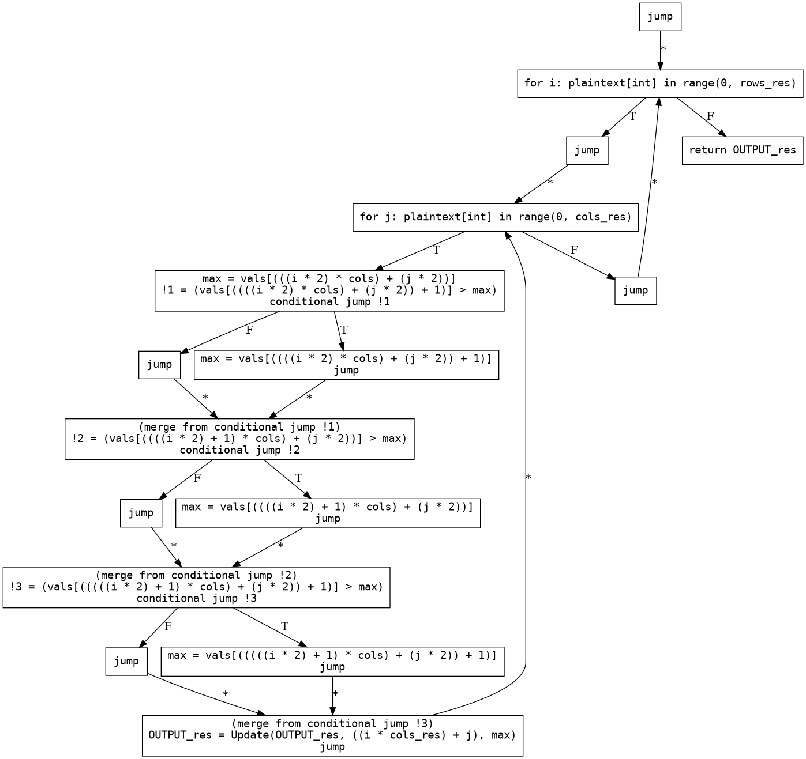
#### SSA
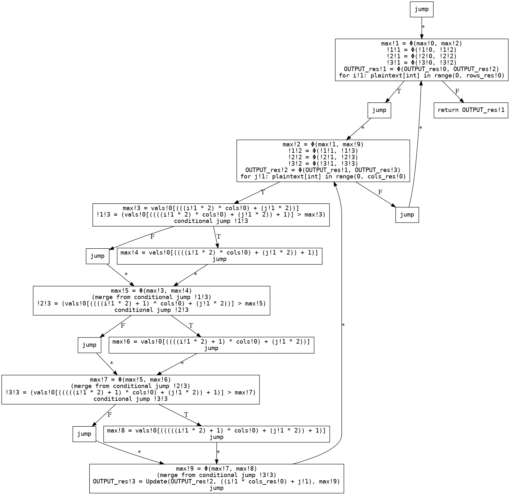
#### SSA ϕ→MUX
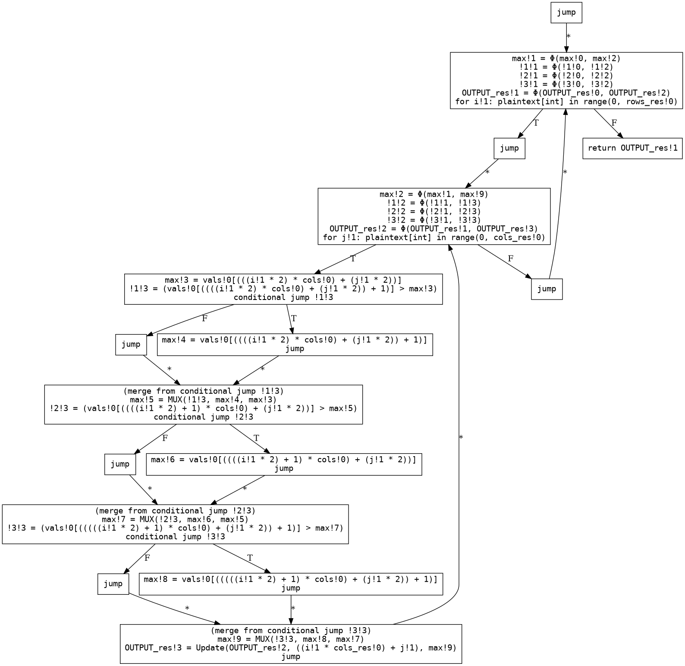
#### Dead code elimination
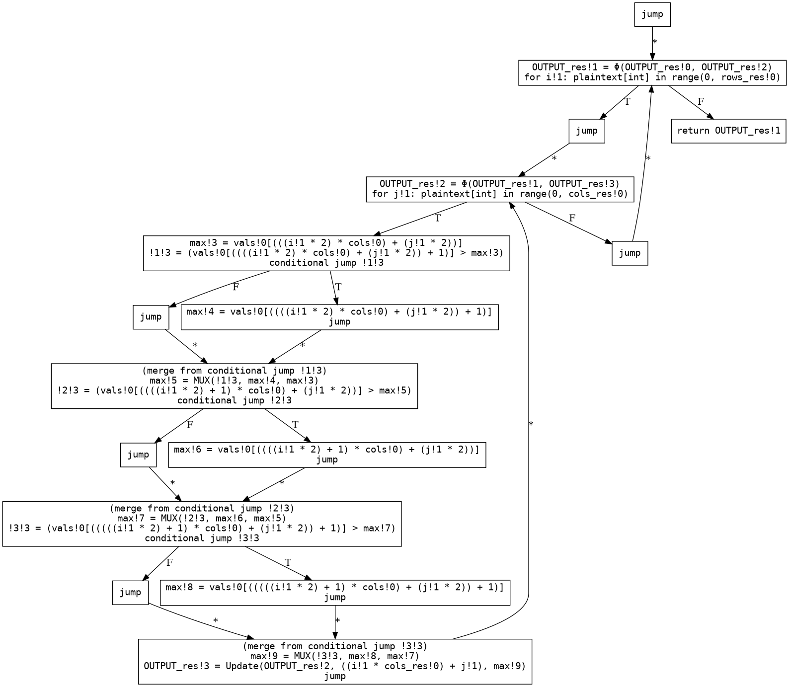
#### Linear code with loops
```python
def cryptonets_max_pooling(vals!0: shared[list[int; ?]], cols!0: plaintext[int], rows!0: plaintext[int], cols_res!0: plaintext[int], rows_res!0: plaintext[int], OUTPUT_res!0: plaintext[list[int; ?]]) -> shared[list[int; ?]]:
    for i!1 in range(0, rows_res!0):
        OUTPUT_res!1 = Φ(OUTPUT_res!0, OUTPUT_res!2)
        for j!1 in range(0, cols_res!0):
            OUTPUT_res!2 = Φ(OUTPUT_res!1, OUTPUT_res!3)
            max!3 = vals!0[(((i!1 * 2) * cols!0) + (j!1 * 2))]
            !1!3 = (vals!0[((((i!1 * 2) * cols!0) + (j!1 * 2)) + 1)] > max!3)
            max!4 = vals!0[((((i!1 * 2) * cols!0) + (j!1 * 2)) + 1)]
            max!5 = MUX(!1!3, max!4, max!3)
            !2!3 = (vals!0[((((i!1 * 2) + 1) * cols!0) + (j!1 * 2))] > max!5)
            max!6 = vals!0[((((i!1 * 2) + 1) * cols!0) + (j!1 * 2))]
            max!7 = MUX(!2!3, max!6, max!5)
            !3!3 = (vals!0[(((((i!1 * 2) + 1) * cols!0) + (j!1 * 2)) + 1)] > max!7)
            max!8 = vals!0[(((((i!1 * 2) + 1) * cols!0) + (j!1 * 2)) + 1)]
            max!9 = MUX(!3!3, max!8, max!7)
            OUTPUT_res!3 = Update(OUTPUT_res!2, ((i!1 * cols_res!0) + j!1), max!9)
    return OUTPUT_res!1
```
#### Dependency graph
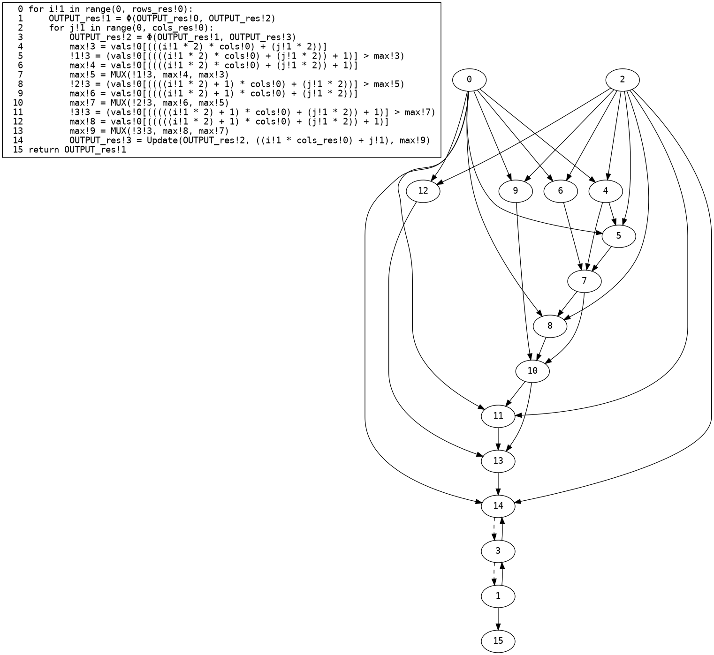
#### Removal of infeasible edges
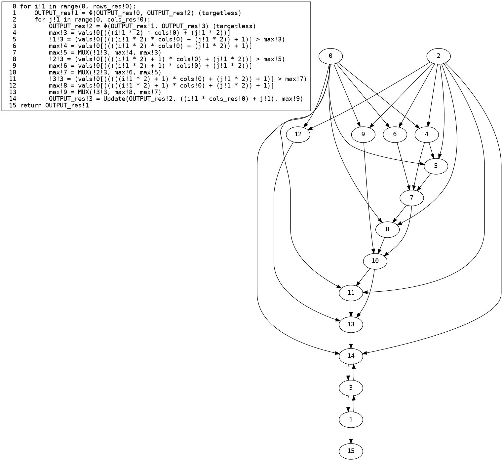
#### Type Environment Before Vectorization
| Variable | Type |
| - | - |
| `vals!0` | `shared[list[int; ?]]` |
| `cols!0` | `plaintext[int]` |
| `rows!0` | `plaintext[int]` |
| `cols_res!0` | `plaintext[int]` |
| `rows_res!0` | `plaintext[int]` |
| `OUTPUT_res!0` | `plaintext[list[int; ?]]` |
| `i!1` | `plaintext[int]` |
| `j!1` | `plaintext[int]` |
| `OUTPUT_res!3` | `shared[list[list[int; (rows_res!0)]; (cols_res!0)]]` |
| `OUTPUT_res!2` | `shared[list[list[int; (rows_res!0)]; (cols_res!0)]]` |
| `OUTPUT_res!1` | `shared[list[list[int; (rows_res!0)]; (cols_res!0)]]` |
| `max!9` | `shared[int]` |
| `max!8` | `shared[int]` |
| `!3!3` | `shared[bool]` |
| `max!7` | `shared[int]` |
| `max!6` | `shared[int]` |
| `!2!3` | `shared[bool]` |
| `max!5` | `shared[int]` |
| `max!4` | `shared[int]` |
| `!1!3` | `shared[bool]` |
| `max!3` | `shared[int]` |
#### Basic Vectorization Phase 1
```python
def cryptonets_max_pooling(vals!0: shared[list[int; ?]], cols!0: plaintext[int], rows!0: plaintext[int], cols_res!0: plaintext[int], rows_res!0: plaintext[int], OUTPUT_res!0: plaintext[list[int; ?]]) -> shared[list[int; ?]]:
    !4!0{ROWS_RES!0, COLS_RES!0}[] = lift(OUTPUT_res!0, (_:rows_res!0, _:cols_res!0))
    for i!1 in range(0, rows_res!0):
        OUTPUT_res!1{ROWS_RES!0, COLS_RES!0}[] = Φ(!4!0{ROWS_RES!0, COLS_RES!0}[], OUTPUT_res!2{ROWS_RES!0, COLS_RES!0}[]) (targetless)
        !5!0{ROWS_RES!0, COLS_RES!0}[] = lift(OUTPUT_res!1{ROWS_RES!0, COLS_RES!0}[], (i!1:rows_res!0, j!1:cols_res!0))
        !6!0{ROWS_RES!0, COLS_RES!0}[] = lift(vals!0[(((i!1 * 2) * cols!0) + (j!1 * 2))], (i!1:rows_res!0, j!1:cols_res!0))
        !7!0{ROWS_RES!0, COLS_RES!0}[] = lift(vals!0[((((i!1 * 2) * cols!0) + (j!1 * 2)) + 1)], (i!1:rows_res!0, j!1:cols_res!0))
        !8!0{ROWS_RES!0, COLS_RES!0}[] = lift(vals!0[((((i!1 * 2) * cols!0) + (j!1 * 2)) + 1)], (i!1:rows_res!0, j!1:cols_res!0))
        !9!0{ROWS_RES!0, COLS_RES!0}[] = lift(vals!0[((((i!1 * 2) + 1) * cols!0) + (j!1 * 2))], (i!1:rows_res!0, j!1:cols_res!0))
        !10!0{ROWS_RES!0, COLS_RES!0}[] = lift(vals!0[((((i!1 * 2) + 1) * cols!0) + (j!1 * 2))], (i!1:rows_res!0, j!1:cols_res!0))
        !11!0{ROWS_RES!0, COLS_RES!0}[] = lift(vals!0[(((((i!1 * 2) + 1) * cols!0) + (j!1 * 2)) + 1)], (i!1:rows_res!0, j!1:cols_res!0))
        !12!0{ROWS_RES!0, COLS_RES!0}[] = lift(vals!0[(((((i!1 * 2) + 1) * cols!0) + (j!1 * 2)) + 1)], (i!1:rows_res!0, j!1:cols_res!0))
        for j!1 in range(0, cols_res!0):
            OUTPUT_res!2{ROWS_RES!0, COLS_RES!0}[] = Φ(!5!0{ROWS_RES!0, COLS_RES!0}[], OUTPUT_res!3{ROWS_RES!0, COLS_RES!0}[]) (targetless)
            max!3{ROWS_RES!0, COLS_RES!0}[] = !6!0{ROWS_RES!0, COLS_RES!0}[]
            !1!3{ROWS_RES!0, COLS_RES!0}[] = (!7!0{ROWS_RES!0, COLS_RES!0}[] > max!3{ROWS_RES!0, COLS_RES!0}[])
            max!4{ROWS_RES!0, COLS_RES!0}[] = !8!0{ROWS_RES!0, COLS_RES!0}[]
            max!5{ROWS_RES!0, COLS_RES!0}[] = MUX(!1!3{ROWS_RES!0, COLS_RES!0}[], max!4{ROWS_RES!0, COLS_RES!0}[], max!3{ROWS_RES!0, COLS_RES!0}[])
            !2!3{ROWS_RES!0, COLS_RES!0}[] = (!9!0{ROWS_RES!0, COLS_RES!0}[] > max!5{ROWS_RES!0, COLS_RES!0}[])
            max!6{ROWS_RES!0, COLS_RES!0}[] = !10!0{ROWS_RES!0, COLS_RES!0}[]
            max!7{ROWS_RES!0, COLS_RES!0}[] = MUX(!2!3{ROWS_RES!0, COLS_RES!0}[], max!6{ROWS_RES!0, COLS_RES!0}[], max!5{ROWS_RES!0, COLS_RES!0}[])
            !3!3{ROWS_RES!0, COLS_RES!0}[] = (!11!0{ROWS_RES!0, COLS_RES!0}[] > max!7{ROWS_RES!0, COLS_RES!0}[])
            max!8{ROWS_RES!0, COLS_RES!0}[] = !12!0{ROWS_RES!0, COLS_RES!0}[]
            max!9{ROWS_RES!0, COLS_RES!0}[] = MUX(!3!3{ROWS_RES!0, COLS_RES!0}[], max!8{ROWS_RES!0, COLS_RES!0}[], max!7{ROWS_RES!0, COLS_RES!0}[])
            OUTPUT_res!3{ROWS_RES!0, COLS_RES!0}[] = VectorizedUpdate(OUTPUT_res!2{ROWS_RES!0, COLS_RES!0}[], [I!1, J!1], max!9{ROWS_RES!0, COLS_RES!0}[])
    return OUTPUT_res!1
```
#### Basic Vectorization Phase 1 (dependence graph)
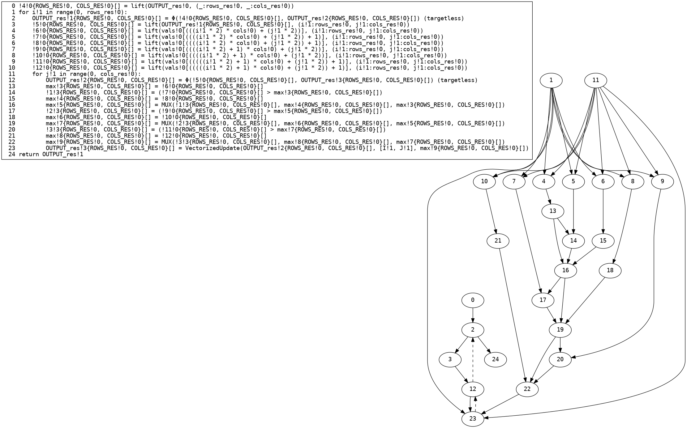
#### Basic Vectorization Phase 2
```python
def cryptonets_max_pooling(vals!0: shared[list[int; ?]], cols!0: plaintext[int], rows!0: plaintext[int], cols_res!0: plaintext[int], rows_res!0: plaintext[int], OUTPUT_res!0: plaintext[list[int; ?]]) -> shared[list[int; ?]]:
    !4!0{ROWS_RES!0, COLS_RES!0}[] = lift(OUTPUT_res!0, (_:rows_res!0, _:cols_res!0))
    !6!0{ROWS_RES!0, COLS_RES!0}[] = lift(vals!0[(((i!1 * 2) * cols!0) + (j!1 * 2))], (i!1:rows_res!0, j!1:cols_res!0))
    !7!0{ROWS_RES!0, COLS_RES!0}[] = lift(vals!0[((((i!1 * 2) * cols!0) + (j!1 * 2)) + 1)], (i!1:rows_res!0, j!1:cols_res!0))
    !8!0{ROWS_RES!0, COLS_RES!0}[] = lift(vals!0[((((i!1 * 2) * cols!0) + (j!1 * 2)) + 1)], (i!1:rows_res!0, j!1:cols_res!0))
    !9!0{ROWS_RES!0, COLS_RES!0}[] = lift(vals!0[((((i!1 * 2) + 1) * cols!0) + (j!1 * 2))], (i!1:rows_res!0, j!1:cols_res!0))
    !10!0{ROWS_RES!0, COLS_RES!0}[] = lift(vals!0[((((i!1 * 2) + 1) * cols!0) + (j!1 * 2))], (i!1:rows_res!0, j!1:cols_res!0))
    !11!0{ROWS_RES!0, COLS_RES!0}[] = lift(vals!0[(((((i!1 * 2) + 1) * cols!0) + (j!1 * 2)) + 1)], (i!1:rows_res!0, j!1:cols_res!0))
    !12!0{ROWS_RES!0, COLS_RES!0}[] = lift(vals!0[(((((i!1 * 2) + 1) * cols!0) + (j!1 * 2)) + 1)], (i!1:rows_res!0, j!1:cols_res!0))
    !5!0{ROWS_RES!0, COLS_RES!0}[] = lift(!4!0{ROWS_RES!0, COLS_RES!0}[], (i!1:rows_res!0, j!1:cols_res!0))
    max!3{ROWS_RES!0, COLS_RES!0}[] = !6!0{ROWS_RES!0, COLS_RES!0}[]
    max!4{ROWS_RES!0, COLS_RES!0}[] = !8!0{ROWS_RES!0, COLS_RES!0}[]
    max!6{ROWS_RES!0, COLS_RES!0}[] = !10!0{ROWS_RES!0, COLS_RES!0}[]
    max!8{ROWS_RES!0, COLS_RES!0}[] = !12!0{ROWS_RES!0, COLS_RES!0}[]
    !1!3{ROWS_RES!0, COLS_RES!0}[] = (!7!0{ROWS_RES!0, COLS_RES!0}[] > max!3{ROWS_RES!0, COLS_RES!0}[])
    max!5{ROWS_RES!0, COLS_RES!0}[] = MUX(!1!3{ROWS_RES!0, COLS_RES!0}[], max!4{ROWS_RES!0, COLS_RES!0}[], max!3{ROWS_RES!0, COLS_RES!0}[])
    !2!3{ROWS_RES!0, COLS_RES!0}[] = (!9!0{ROWS_RES!0, COLS_RES!0}[] > max!5{ROWS_RES!0, COLS_RES!0}[])
    max!7{ROWS_RES!0, COLS_RES!0}[] = MUX(!2!3{ROWS_RES!0, COLS_RES!0}[], max!6{ROWS_RES!0, COLS_RES!0}[], max!5{ROWS_RES!0, COLS_RES!0}[])
    !3!3{ROWS_RES!0, COLS_RES!0}[] = (!11!0{ROWS_RES!0, COLS_RES!0}[] > max!7{ROWS_RES!0, COLS_RES!0}[])
    max!9{ROWS_RES!0, COLS_RES!0}[] = MUX(!3!3{ROWS_RES!0, COLS_RES!0}[], max!8{ROWS_RES!0, COLS_RES!0}[], max!7{ROWS_RES!0, COLS_RES!0}[])
    OUTPUT_res!3{ROWS_RES!0, COLS_RES!0}[] = VectorizedUpdate(!5!0{ROWS_RES!0, COLS_RES!0}[], [I!1, J!1], max!9{ROWS_RES!0, COLS_RES!0}[])
    return OUTPUT_res!3
```
#### Basic Vectorization Phase 2 (dependence graph)
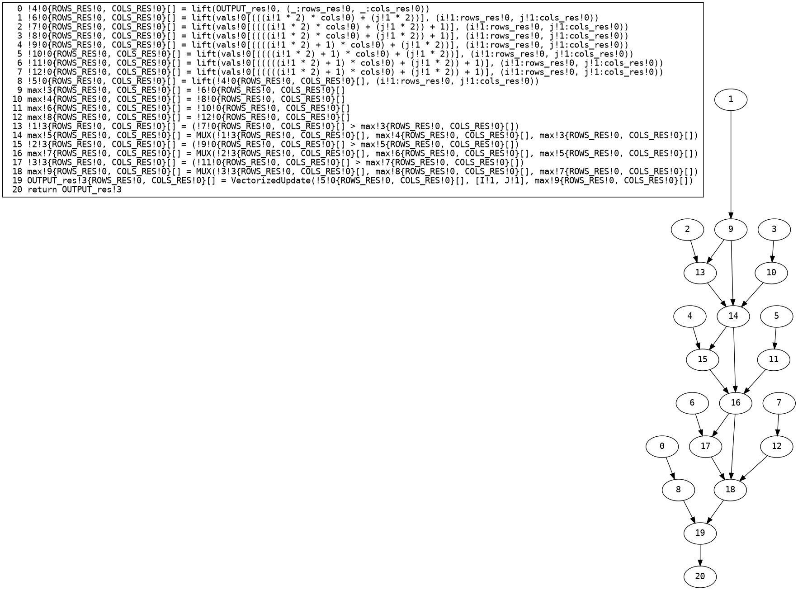
#### Type Environment After Vectorization
| Variable | Type |
| - | - |
| `vals!0` | `shared[list[int; ?]]` |
| `cols!0` | `plaintext[int]` |
| `rows!0` | `plaintext[int]` |
| `cols_res!0` | `plaintext[int]` |
| `rows_res!0` | `plaintext[int]` |
| `OUTPUT_res!0` | `plaintext[list[int; ?]]` |
| `OUTPUT_res!3` | `shared[list[list[int; (rows_res!0)]; (cols_res!0)]]` |
| `max!9` | `shared[list[list[int; (rows_res!0)]; (cols_res!0)]]` |
| `!3!3` | `shared[list[list[bool; (rows_res!0)]; (cols_res!0)]]` |
| `max!7` | `shared[list[list[int; (rows_res!0)]; (cols_res!0)]]` |
| `!2!3` | `shared[list[list[bool; (rows_res!0)]; (cols_res!0)]]` |
| `max!5` | `shared[list[list[int; (rows_res!0)]; (cols_res!0)]]` |
| `!1!3` | `shared[list[list[bool; (rows_res!0)]; (cols_res!0)]]` |
| `max!8` | `shared[list[list[int; (rows_res!0)]; (cols_res!0)]]` |
| `max!6` | `shared[list[list[int; (rows_res!0)]; (cols_res!0)]]` |
| `max!4` | `shared[list[list[int; (rows_res!0)]; (cols_res!0)]]` |
| `max!3` | `shared[list[list[int; (rows_res!0)]; (cols_res!0)]]` |
| `!5!0` | `shared[list[list[int; (rows_res!0)]; (cols_res!0)]]` |
| `!12!0` | `shared[list[list[int; (rows_res!0)]; (cols_res!0)]]` |
| `!11!0` | `shared[list[list[int; (rows_res!0)]; (cols_res!0)]]` |
| `!10!0` | `shared[list[list[int; (rows_res!0)]; (cols_res!0)]]` |
| `!9!0` | `shared[list[list[int; (rows_res!0)]; (cols_res!0)]]` |
| `!8!0` | `shared[list[list[int; (rows_res!0)]; (cols_res!0)]]` |
| `!7!0` | `shared[list[list[int; (rows_res!0)]; (cols_res!0)]]` |
| `!6!0` | `shared[list[list[int; (rows_res!0)]; (cols_res!0)]]` |
| `!4!0` | `shared[list[list[int; (rows_res!0)]; (cols_res!0)]]` |
#### Copy propagation
```python
def cryptonets_max_pooling(vals!0: shared[list[int; ?]], cols!0: plaintext[int], rows!0: plaintext[int], cols_res!0: plaintext[int], rows_res!0: plaintext[int], OUTPUT_res!0: plaintext[list[int; ?]]) -> shared[list[int; ?]]:
    !4!0{ROWS_RES!0, COLS_RES!0}[] = lift(OUTPUT_res!0, (_:rows_res!0, _:cols_res!0))
    !6!0{ROWS_RES!0, COLS_RES!0}[] = lift(vals!0[(((i!1 * 2) * cols!0) + (j!1 * 2))], (i!1:rows_res!0, j!1:cols_res!0))
    !7!0{ROWS_RES!0, COLS_RES!0}[] = lift(vals!0[((((i!1 * 2) * cols!0) + (j!1 * 2)) + 1)], (i!1:rows_res!0, j!1:cols_res!0))
    !8!0{ROWS_RES!0, COLS_RES!0}[] = lift(vals!0[((((i!1 * 2) * cols!0) + (j!1 * 2)) + 1)], (i!1:rows_res!0, j!1:cols_res!0))
    !9!0{ROWS_RES!0, COLS_RES!0}[] = lift(vals!0[((((i!1 * 2) + 1) * cols!0) + (j!1 * 2))], (i!1:rows_res!0, j!1:cols_res!0))
    !10!0{ROWS_RES!0, COLS_RES!0}[] = lift(vals!0[((((i!1 * 2) + 1) * cols!0) + (j!1 * 2))], (i!1:rows_res!0, j!1:cols_res!0))
    !11!0{ROWS_RES!0, COLS_RES!0}[] = lift(vals!0[(((((i!1 * 2) + 1) * cols!0) + (j!1 * 2)) + 1)], (i!1:rows_res!0, j!1:cols_res!0))
    !12!0{ROWS_RES!0, COLS_RES!0}[] = lift(vals!0[(((((i!1 * 2) + 1) * cols!0) + (j!1 * 2)) + 1)], (i!1:rows_res!0, j!1:cols_res!0))
    !5!0{ROWS_RES!0, COLS_RES!0}[] = lift(!4!0{ROWS_RES!0, COLS_RES!0}[], (i!1:rows_res!0, j!1:cols_res!0))
    !1!3{ROWS_RES!0, COLS_RES!0}[] = (!7!0{ROWS_RES!0, COLS_RES!0}[] > !6!0{ROWS_RES!0, COLS_RES!0}[])
    max!5{ROWS_RES!0, COLS_RES!0}[] = MUX(!1!3{ROWS_RES!0, COLS_RES!0}[], !8!0{ROWS_RES!0, COLS_RES!0}[], !6!0{ROWS_RES!0, COLS_RES!0}[])
    !2!3{ROWS_RES!0, COLS_RES!0}[] = (!9!0{ROWS_RES!0, COLS_RES!0}[] > max!5{ROWS_RES!0, COLS_RES!0}[])
    max!7{ROWS_RES!0, COLS_RES!0}[] = MUX(!2!3{ROWS_RES!0, COLS_RES!0}[], !10!0{ROWS_RES!0, COLS_RES!0}[], max!5{ROWS_RES!0, COLS_RES!0}[])
    !3!3{ROWS_RES!0, COLS_RES!0}[] = (!11!0{ROWS_RES!0, COLS_RES!0}[] > max!7{ROWS_RES!0, COLS_RES!0}[])
    max!9{ROWS_RES!0, COLS_RES!0}[] = MUX(!3!3{ROWS_RES!0, COLS_RES!0}[], !12!0{ROWS_RES!0, COLS_RES!0}[], max!7{ROWS_RES!0, COLS_RES!0}[])
    OUTPUT_res!3{ROWS_RES!0, COLS_RES!0}[] = VectorizedUpdate(!5!0{ROWS_RES!0, COLS_RES!0}[], [I!1, J!1], max!9{ROWS_RES!0, COLS_RES!0}[])
    return OUTPUT_res!3
```
#### Common subexpression elimination
```python
def cryptonets_max_pooling(vals!0: shared[list[int; ?]], cols!0: plaintext[int], rows!0: plaintext[int], cols_res!0: plaintext[int], rows_res!0: plaintext[int], OUTPUT_res!0: plaintext[list[int; ?]]) -> shared[list[int; ?]]:
    !4!0{ROWS_RES!0, COLS_RES!0}[] = lift(OUTPUT_res!0, (_:rows_res!0, _:cols_res!0))
    !6!0{ROWS_RES!0, COLS_RES!0}[] = lift(vals!0[(((i!1 * 2) * cols!0) + (j!1 * 2))], (i!1:rows_res!0, j!1:cols_res!0))
    !7!0{ROWS_RES!0, COLS_RES!0}[] = lift(vals!0[((((i!1 * 2) * cols!0) + (j!1 * 2)) + 1)], (i!1:rows_res!0, j!1:cols_res!0))
    !9!0{ROWS_RES!0, COLS_RES!0}[] = lift(vals!0[((((i!1 * 2) + 1) * cols!0) + (j!1 * 2))], (i!1:rows_res!0, j!1:cols_res!0))
    !11!0{ROWS_RES!0, COLS_RES!0}[] = lift(vals!0[(((((i!1 * 2) + 1) * cols!0) + (j!1 * 2)) + 1)], (i!1:rows_res!0, j!1:cols_res!0))
    !5!0{ROWS_RES!0, COLS_RES!0}[] = lift(!4!0{ROWS_RES!0, COLS_RES!0}[], (i!1:rows_res!0, j!1:cols_res!0))
    !1!3{ROWS_RES!0, COLS_RES!0}[] = (!7!0{ROWS_RES!0, COLS_RES!0}[] > !6!0{ROWS_RES!0, COLS_RES!0}[])
    max!5{ROWS_RES!0, COLS_RES!0}[] = MUX(!1!3{ROWS_RES!0, COLS_RES!0}[], !7!0{ROWS_RES!0, COLS_RES!0}[], !6!0{ROWS_RES!0, COLS_RES!0}[])
    !2!3{ROWS_RES!0, COLS_RES!0}[] = (!9!0{ROWS_RES!0, COLS_RES!0}[] > max!5{ROWS_RES!0, COLS_RES!0}[])
    max!7{ROWS_RES!0, COLS_RES!0}[] = MUX(!2!3{ROWS_RES!0, COLS_RES!0}[], !9!0{ROWS_RES!0, COLS_RES!0}[], max!5{ROWS_RES!0, COLS_RES!0}[])
    !3!3{ROWS_RES!0, COLS_RES!0}[] = (!11!0{ROWS_RES!0, COLS_RES!0}[] > max!7{ROWS_RES!0, COLS_RES!0}[])
    max!9{ROWS_RES!0, COLS_RES!0}[] = MUX(!3!3{ROWS_RES!0, COLS_RES!0}[], !11!0{ROWS_RES!0, COLS_RES!0}[], max!7{ROWS_RES!0, COLS_RES!0}[])
    OUTPUT_res!3{ROWS_RES!0, COLS_RES!0}[] = VectorizedUpdate(!5!0{ROWS_RES!0, COLS_RES!0}[], [I!1, J!1], max!9{ROWS_RES!0, COLS_RES!0}[])
    return OUTPUT_res!3
```
#### MOTION mixed configuration
```Total cost:	0.18588
Input vars:	{vals!0: ['Y']}
Constants:	{}
Plaintext vars:	{OUTPUT_res!0: ['Y']}
Flags:		{}
!4!0{ROWS_RES!0, COLS_RES!0}[] = lift(OUTPUT_res!0, (_:rows_res!0, _:cols_res!0)): _ -> ['Y'] for 0.00000 * 1 = 0.00
!6!0{ROWS_RES!0, COLS_RES!0}[] = lift(vals!0[(((i!1 * 2) * cols!0) + (j!1 * 2))], (i!1:rows_res!0, j!1:cols_res!0)): _ -> ['Y'] for 0.00000 * 1 = 0.00
!7!0{ROWS_RES!0, COLS_RES!0}[] = lift(vals!0[((((i!1 * 2) * cols!0) + (j!1 * 2)) + 1)], (i!1:rows_res!0, j!1:cols_res!0)): _ -> ['Y'] for 0.00000 * 1 = 0.00
!9!0{ROWS_RES!0, COLS_RES!0}[] = lift(vals!0[((((i!1 * 2) + 1) * cols!0) + (j!1 * 2))], (i!1:rows_res!0, j!1:cols_res!0)): _ -> ['Y'] for 0.00000 * 1 = 0.00
!11!0{ROWS_RES!0, COLS_RES!0}[] = lift(vals!0[(((((i!1 * 2) + 1) * cols!0) + (j!1 * 2)) + 1)], (i!1:rows_res!0, j!1:cols_res!0)): _ -> ['Y'] for 0.00000 * 1 = 0.00
!5!0{ROWS_RES!0, COLS_RES!0}[] = lift(!4!0{ROWS_RES!0, COLS_RES!0}[], (i!1:rows_res!0, j!1:cols_res!0)): _ -> ['Y'] for 0.00000 * 1 = 0.00
!1!3{ROWS_RES!0, COLS_RES!0}[] = (!7!0{ROWS_RES!0, COLS_RES!0}[] > !6!0{ROWS_RES!0, COLS_RES!0}[]): Y -> {} for 0.04702 * 1 = 0.05
max!5{ROWS_RES!0, COLS_RES!0}[] = MUX(!1!3{ROWS_RES!0, COLS_RES!0}[], !7!0{ROWS_RES!0, COLS_RES!0}[], !6!0{ROWS_RES!0, COLS_RES!0}[]): Y -> {} for 0.01494 * 1 = 0.01
!2!3{ROWS_RES!0, COLS_RES!0}[] = (!9!0{ROWS_RES!0, COLS_RES!0}[] > max!5{ROWS_RES!0, COLS_RES!0}[]): Y -> {} for 0.04702 * 1 = 0.05
max!7{ROWS_RES!0, COLS_RES!0}[] = MUX(!2!3{ROWS_RES!0, COLS_RES!0}[], !9!0{ROWS_RES!0, COLS_RES!0}[], max!5{ROWS_RES!0, COLS_RES!0}[]): Y -> {} for 0.01494 * 1 = 0.01
!3!3{ROWS_RES!0, COLS_RES!0}[] = (!11!0{ROWS_RES!0, COLS_RES!0}[] > max!7{ROWS_RES!0, COLS_RES!0}[]): Y -> {} for 0.04702 * 1 = 0.05
max!9{ROWS_RES!0, COLS_RES!0}[] = MUX(!3!3{ROWS_RES!0, COLS_RES!0}[], !11!0{ROWS_RES!0, COLS_RES!0}[], max!7{ROWS_RES!0, COLS_RES!0}[]): Y -> {} for 0.01494 * 1 = 0.01
OUTPUT_res!3{ROWS_RES!0, COLS_RES!0}[] = VectorizedUpdate(!5!0{ROWS_RES!0, COLS_RES!0}[], [I!1, J!1], max!9{ROWS_RES!0, COLS_RES!0}[]): Y -> {} for 0.00000 * 1 = 0.00
return OUTPUT_res!3
Output vars:	{OUTPUT_res!3: ['Y']}

```
#### MOTION code
```cpp
template <encrypto::motion::MpcProtocol Protocol>
std::vector<encrypto::motion::SecureUnsignedInteger> cryptonets_max_pooling(
    encrypto::motion::PartyPointer &party,
    std::vector<encrypto::motion::SecureUnsignedInteger> vals_0,
    std::uint32_t _MPC_PLAINTEXT_cols_0,
    std::uint32_t _MPC_PLAINTEXT_rows_0,
    std::uint32_t _MPC_PLAINTEXT_cols_res_0,
    std::uint32_t _MPC_PLAINTEXT_rows_res_0,
    std::vector<std::uint32_t> _MPC_PLAINTEXT_OUTPUT_res_0
) {
    // Shared variable declarations
    std::vector<encrypto::motion::ShareWrapper> _1_3((_MPC_PLAINTEXT_rows_res_0) * (_MPC_PLAINTEXT_cols_res_0));
    std::vector<encrypto::motion::SecureUnsignedInteger> _11_0((_MPC_PLAINTEXT_rows_res_0) * (_MPC_PLAINTEXT_cols_res_0));
    std::vector<encrypto::motion::ShareWrapper> _2_3((_MPC_PLAINTEXT_rows_res_0) * (_MPC_PLAINTEXT_cols_res_0));
    std::vector<encrypto::motion::ShareWrapper> _3_3((_MPC_PLAINTEXT_rows_res_0) * (_MPC_PLAINTEXT_cols_res_0));
    std::vector<encrypto::motion::SecureUnsignedInteger> _4_0((_MPC_PLAINTEXT_rows_res_0) * (_MPC_PLAINTEXT_cols_res_0));
    std::vector<encrypto::motion::SecureUnsignedInteger> _5_0((_MPC_PLAINTEXT_rows_res_0) * (_MPC_PLAINTEXT_cols_res_0));
    std::vector<encrypto::motion::SecureUnsignedInteger> _6_0((_MPC_PLAINTEXT_rows_res_0) * (_MPC_PLAINTEXT_cols_res_0));
    std::vector<encrypto::motion::SecureUnsignedInteger> _7_0((_MPC_PLAINTEXT_rows_res_0) * (_MPC_PLAINTEXT_cols_res_0));
    std::vector<encrypto::motion::SecureUnsignedInteger> _9_0((_MPC_PLAINTEXT_rows_res_0) * (_MPC_PLAINTEXT_cols_res_0));
    std::vector<encrypto::motion::SecureUnsignedInteger> OUTPUT_res_0;
    std::vector<encrypto::motion::SecureUnsignedInteger> OUTPUT_res_3((_MPC_PLAINTEXT_rows_res_0) * (_MPC_PLAINTEXT_cols_res_0));
    encrypto::motion::SecureUnsignedInteger cols_0;
    encrypto::motion::SecureUnsignedInteger cols_res_0;
    std::vector<encrypto::motion::SecureUnsignedInteger> max_5((_MPC_PLAINTEXT_rows_res_0) * (_MPC_PLAINTEXT_cols_res_0));
    std::vector<encrypto::motion::SecureUnsignedInteger> max_7((_MPC_PLAINTEXT_rows_res_0) * (_MPC_PLAINTEXT_cols_res_0));
    std::vector<encrypto::motion::SecureUnsignedInteger> max_9((_MPC_PLAINTEXT_rows_res_0) * (_MPC_PLAINTEXT_cols_res_0));
    encrypto::motion::SecureUnsignedInteger rows_0;
    encrypto::motion::SecureUnsignedInteger rows_res_0;

    // Plaintext variable declarations


    // Constant initializations


    // Plaintext parameter assignments
    OUTPUT_res_0.clear();
    std::transform(_MPC_PLAINTEXT_OUTPUT_res_0.begin(), _MPC_PLAINTEXT_OUTPUT_res_0.end(), std::back_inserter(OUTPUT_res_0), [&](const auto &val) { return party->In<Protocol>(encrypto::motion::ToInput(val), 0); });
    cols_0 = party->In<Protocol>(encrypto::motion::ToInput(_MPC_PLAINTEXT_cols_0), 0);
    cols_res_0 = party->In<Protocol>(encrypto::motion::ToInput(_MPC_PLAINTEXT_cols_res_0), 0);
    rows_0 = party->In<Protocol>(encrypto::motion::ToInput(_MPC_PLAINTEXT_rows_0), 0);
    rows_res_0 = party->In<Protocol>(encrypto::motion::ToInput(_MPC_PLAINTEXT_rows_res_0), 0);

    // Function body
    vectorized_assign(_4_0, {_MPC_PLAINTEXT_rows_res_0, _MPC_PLAINTEXT_cols_res_0}, {true, true}, {}, lift(std::function([&](const std::vector<std::uint32_t> &indices){return OUTPUT_res_0;}), {_MPC_PLAINTEXT_rows_res_0, _MPC_PLAINTEXT_cols_res_0}));
    vectorized_assign(_6_0, {_MPC_PLAINTEXT_rows_res_0, _MPC_PLAINTEXT_cols_res_0}, {true, true}, {}, lift(std::function([&](const std::vector<std::uint32_t> &indices){return vals_0[(((indices[0] * std::uint32_t(2)) * _MPC_PLAINTEXT_cols_0) + (indices[1] * std::uint32_t(2)))];}), {_MPC_PLAINTEXT_rows_res_0, _MPC_PLAINTEXT_cols_res_0}));
    vectorized_assign(_7_0, {_MPC_PLAINTEXT_rows_res_0, _MPC_PLAINTEXT_cols_res_0}, {true, true}, {}, lift(std::function([&](const std::vector<std::uint32_t> &indices){return vals_0[((((indices[0] * std::uint32_t(2)) * _MPC_PLAINTEXT_cols_0) + (indices[1] * std::uint32_t(2))) + std::uint32_t(1))];}), {_MPC_PLAINTEXT_rows_res_0, _MPC_PLAINTEXT_cols_res_0}));
    vectorized_assign(_9_0, {_MPC_PLAINTEXT_rows_res_0, _MPC_PLAINTEXT_cols_res_0}, {true, true}, {}, lift(std::function([&](const std::vector<std::uint32_t> &indices){return vals_0[((((indices[0] * std::uint32_t(2)) + std::uint32_t(1)) * _MPC_PLAINTEXT_cols_0) + (indices[1] * std::uint32_t(2)))];}), {_MPC_PLAINTEXT_rows_res_0, _MPC_PLAINTEXT_cols_res_0}));
    vectorized_assign(_11_0, {_MPC_PLAINTEXT_rows_res_0, _MPC_PLAINTEXT_cols_res_0}, {true, true}, {}, lift(std::function([&](const std::vector<std::uint32_t> &indices){return vals_0[(((((indices[0] * std::uint32_t(2)) + std::uint32_t(1)) * _MPC_PLAINTEXT_cols_0) + (indices[1] * std::uint32_t(2))) + std::uint32_t(1))];}), {_MPC_PLAINTEXT_rows_res_0, _MPC_PLAINTEXT_cols_res_0}));
    vectorized_assign(_5_0, {_MPC_PLAINTEXT_rows_res_0, _MPC_PLAINTEXT_cols_res_0}, {true, true}, {}, lift(std::function([&](const std::vector<std::uint32_t> &indices){return vectorized_access(_4_0, {_MPC_PLAINTEXT_rows_res_0, _MPC_PLAINTEXT_cols_res_0}, {true, true}, {}).Unsimdify();}), {_MPC_PLAINTEXT_rows_res_0, _MPC_PLAINTEXT_cols_res_0}));
    vectorized_assign(_1_3, {_MPC_PLAINTEXT_rows_res_0, _MPC_PLAINTEXT_cols_res_0}, {true, true}, {}, (vectorized_access(_7_0, {_MPC_PLAINTEXT_rows_res_0, _MPC_PLAINTEXT_cols_res_0}, {true, true}, {}) > vectorized_access(_6_0, {_MPC_PLAINTEXT_rows_res_0, _MPC_PLAINTEXT_cols_res_0}, {true, true}, {})));
    vectorized_assign(max_5, {_MPC_PLAINTEXT_rows_res_0, _MPC_PLAINTEXT_cols_res_0}, {true, true}, {}, vectorized_access(_1_3, {_MPC_PLAINTEXT_rows_res_0, _MPC_PLAINTEXT_cols_res_0}, {true, true}, {}).Mux(vectorized_access(_7_0, {_MPC_PLAINTEXT_rows_res_0, _MPC_PLAINTEXT_cols_res_0}, {true, true}, {}).Get(), vectorized_access(_6_0, {_MPC_PLAINTEXT_rows_res_0, _MPC_PLAINTEXT_cols_res_0}, {true, true}, {}).Get()));
    vectorized_assign(_2_3, {_MPC_PLAINTEXT_rows_res_0, _MPC_PLAINTEXT_cols_res_0}, {true, true}, {}, (vectorized_access(_9_0, {_MPC_PLAINTEXT_rows_res_0, _MPC_PLAINTEXT_cols_res_0}, {true, true}, {}) > vectorized_access(max_5, {_MPC_PLAINTEXT_rows_res_0, _MPC_PLAINTEXT_cols_res_0}, {true, true}, {})));
    vectorized_assign(max_7, {_MPC_PLAINTEXT_rows_res_0, _MPC_PLAINTEXT_cols_res_0}, {true, true}, {}, vectorized_access(_2_3, {_MPC_PLAINTEXT_rows_res_0, _MPC_PLAINTEXT_cols_res_0}, {true, true}, {}).Mux(vectorized_access(_9_0, {_MPC_PLAINTEXT_rows_res_0, _MPC_PLAINTEXT_cols_res_0}, {true, true}, {}).Get(), vectorized_access(max_5, {_MPC_PLAINTEXT_rows_res_0, _MPC_PLAINTEXT_cols_res_0}, {true, true}, {}).Get()));
    vectorized_assign(_3_3, {_MPC_PLAINTEXT_rows_res_0, _MPC_PLAINTEXT_cols_res_0}, {true, true}, {}, (vectorized_access(_11_0, {_MPC_PLAINTEXT_rows_res_0, _MPC_PLAINTEXT_cols_res_0}, {true, true}, {}) > vectorized_access(max_7, {_MPC_PLAINTEXT_rows_res_0, _MPC_PLAINTEXT_cols_res_0}, {true, true}, {})));
    vectorized_assign(max_9, {_MPC_PLAINTEXT_rows_res_0, _MPC_PLAINTEXT_cols_res_0}, {true, true}, {}, vectorized_access(_3_3, {_MPC_PLAINTEXT_rows_res_0, _MPC_PLAINTEXT_cols_res_0}, {true, true}, {}).Mux(vectorized_access(_11_0, {_MPC_PLAINTEXT_rows_res_0, _MPC_PLAINTEXT_cols_res_0}, {true, true}, {}).Get(), vectorized_access(max_7, {_MPC_PLAINTEXT_rows_res_0, _MPC_PLAINTEXT_cols_res_0}, {true, true}, {}).Get()));
    vectorized_assign(OUTPUT_res_3, {_MPC_PLAINTEXT_rows_res_0, _MPC_PLAINTEXT_cols_res_0}, {true, true}, {}, vectorized_update(_5_0, {_MPC_PLAINTEXT_rows_res_0, _MPC_PLAINTEXT_cols_res_0}, {true, true}, {}, vectorized_access(max_9, {_MPC_PLAINTEXT_rows_res_0, _MPC_PLAINTEXT_cols_res_0}, {true, true}, {})));
    return OUTPUT_res_3;

}
```
#### MOTION mixed code
```cpp
std::vector<encrypto::motion::SecureUnsignedInteger> cryptonets_max_pooling(
    encrypto::motion::PartyPointer &party,
    std::vector<encrypto::motion::SecureUnsignedInteger> vals_0,
    std::uint32_t _MPC_PLAINTEXT_cols_0,
    std::uint32_t _MPC_PLAINTEXT_rows_0,
    std::uint32_t _MPC_PLAINTEXT_cols_res_0,
    std::uint32_t _MPC_PLAINTEXT_rows_res_0,
    std::vector<std::uint32_t> _MPC_PLAINTEXT_OUTPUT_res_0
) {
    // Shared variable declarations
    std::vector<encrypto::motion::ShareWrapper> _1_3((_MPC_PLAINTEXT_rows_res_0) * (_MPC_PLAINTEXT_cols_res_0));
    std::vector<encrypto::motion::SecureUnsignedInteger> _11_0((_MPC_PLAINTEXT_rows_res_0) * (_MPC_PLAINTEXT_cols_res_0));
    std::vector<encrypto::motion::ShareWrapper> _2_3((_MPC_PLAINTEXT_rows_res_0) * (_MPC_PLAINTEXT_cols_res_0));
    std::vector<encrypto::motion::ShareWrapper> _3_3((_MPC_PLAINTEXT_rows_res_0) * (_MPC_PLAINTEXT_cols_res_0));
    std::vector<encrypto::motion::SecureUnsignedInteger> _4_0((_MPC_PLAINTEXT_rows_res_0) * (_MPC_PLAINTEXT_cols_res_0));
    std::vector<encrypto::motion::SecureUnsignedInteger> _5_0((_MPC_PLAINTEXT_rows_res_0) * (_MPC_PLAINTEXT_cols_res_0));
    std::vector<encrypto::motion::SecureUnsignedInteger> _6_0((_MPC_PLAINTEXT_rows_res_0) * (_MPC_PLAINTEXT_cols_res_0));
    std::vector<encrypto::motion::SecureUnsignedInteger> _7_0((_MPC_PLAINTEXT_rows_res_0) * (_MPC_PLAINTEXT_cols_res_0));
    std::vector<encrypto::motion::SecureUnsignedInteger> _9_0((_MPC_PLAINTEXT_rows_res_0) * (_MPC_PLAINTEXT_cols_res_0));
    std::vector<encrypto::motion::SecureUnsignedInteger> OUTPUT_res_0;
    std::vector<encrypto::motion::SecureUnsignedInteger> OUTPUT_res_3((_MPC_PLAINTEXT_rows_res_0) * (_MPC_PLAINTEXT_cols_res_0));
    encrypto::motion::SecureUnsignedInteger cols_0;
    encrypto::motion::SecureUnsignedInteger cols_res_0;
    std::vector<encrypto::motion::SecureUnsignedInteger> max_5((_MPC_PLAINTEXT_rows_res_0) * (_MPC_PLAINTEXT_cols_res_0));
    std::vector<encrypto::motion::SecureUnsignedInteger> max_7((_MPC_PLAINTEXT_rows_res_0) * (_MPC_PLAINTEXT_cols_res_0));
    std::vector<encrypto::motion::SecureUnsignedInteger> max_9((_MPC_PLAINTEXT_rows_res_0) * (_MPC_PLAINTEXT_cols_res_0));
    encrypto::motion::SecureUnsignedInteger rows_0;
    encrypto::motion::SecureUnsignedInteger rows_res_0;

    // Plaintext variable declarations


    // Constant initializations

    // Input Protocol Convertions

    // Plaintext parameter assignments
    OUTPUT_res_0.clear();
    std::transform(_MPC_PLAINTEXT_OUTPUT_res_0.begin(), _MPC_PLAINTEXT_OUTPUT_res_0.end(), std::back_inserter(OUTPUT_res_0), [&](const auto &val) { return party->In<encrypto::motion::MpcProtocol::kBmr>(encrypto::motion::ToInput(val), 0); });

    // Function body
    vectorized_assign(_4_0, {_MPC_PLAINTEXT_rows_res_0, _MPC_PLAINTEXT_cols_res_0}, {true, true}, {}, lift(std::function([&](const std::vector<std::uint32_t> &indices){return OUTPUT_res_0;}), {_MPC_PLAINTEXT_rows_res_0, _MPC_PLAINTEXT_cols_res_0}));
    vectorized_assign(_6_0, {_MPC_PLAINTEXT_rows_res_0, _MPC_PLAINTEXT_cols_res_0}, {true, true}, {}, lift(std::function([&](const std::vector<std::uint32_t> &indices){return vals_0[(((indices[0] * std::uint32_t(2)) * _MPC_PLAINTEXT_cols_0) + (indices[1] * std::uint32_t(2)))];}), {_MPC_PLAINTEXT_rows_res_0, _MPC_PLAINTEXT_cols_res_0}));
    vectorized_assign(_7_0, {_MPC_PLAINTEXT_rows_res_0, _MPC_PLAINTEXT_cols_res_0}, {true, true}, {}, lift(std::function([&](const std::vector<std::uint32_t> &indices){return vals_0[((((indices[0] * std::uint32_t(2)) * _MPC_PLAINTEXT_cols_0) + (indices[1] * std::uint32_t(2))) + std::uint32_t(1))];}), {_MPC_PLAINTEXT_rows_res_0, _MPC_PLAINTEXT_cols_res_0}));
    vectorized_assign(_9_0, {_MPC_PLAINTEXT_rows_res_0, _MPC_PLAINTEXT_cols_res_0}, {true, true}, {}, lift(std::function([&](const std::vector<std::uint32_t> &indices){return vals_0[((((indices[0] * std::uint32_t(2)) + std::uint32_t(1)) * _MPC_PLAINTEXT_cols_0) + (indices[1] * std::uint32_t(2)))];}), {_MPC_PLAINTEXT_rows_res_0, _MPC_PLAINTEXT_cols_res_0}));
    vectorized_assign(_11_0, {_MPC_PLAINTEXT_rows_res_0, _MPC_PLAINTEXT_cols_res_0}, {true, true}, {}, lift(std::function([&](const std::vector<std::uint32_t> &indices){return vals_0[(((((indices[0] * std::uint32_t(2)) + std::uint32_t(1)) * _MPC_PLAINTEXT_cols_0) + (indices[1] * std::uint32_t(2))) + std::uint32_t(1))];}), {_MPC_PLAINTEXT_rows_res_0, _MPC_PLAINTEXT_cols_res_0}));
    vectorized_assign(_5_0, {_MPC_PLAINTEXT_rows_res_0, _MPC_PLAINTEXT_cols_res_0}, {true, true}, {}, lift(std::function([&](const std::vector<std::uint32_t> &indices){return vectorized_access(_4_0, {_MPC_PLAINTEXT_rows_res_0, _MPC_PLAINTEXT_cols_res_0}, {true, true}, {}).Unsimdify();}), {_MPC_PLAINTEXT_rows_res_0, _MPC_PLAINTEXT_cols_res_0}));
    vectorized_assign(_1_3, {_MPC_PLAINTEXT_rows_res_0, _MPC_PLAINTEXT_cols_res_0}, {true, true}, {}, (vectorized_access(_7_0, {_MPC_PLAINTEXT_rows_res_0, _MPC_PLAINTEXT_cols_res_0}, {true, true}, {}) > vectorized_access(_6_0, {_MPC_PLAINTEXT_rows_res_0, _MPC_PLAINTEXT_cols_res_0}, {true, true}, {})));
    vectorized_assign(max_5, {_MPC_PLAINTEXT_rows_res_0, _MPC_PLAINTEXT_cols_res_0}, {true, true}, {}, vectorized_access(_1_3, {_MPC_PLAINTEXT_rows_res_0, _MPC_PLAINTEXT_cols_res_0}, {true, true}, {}).Mux(vectorized_access(_7_0, {_MPC_PLAINTEXT_rows_res_0, _MPC_PLAINTEXT_cols_res_0}, {true, true}, {}).Get(), vectorized_access(_6_0, {_MPC_PLAINTEXT_rows_res_0, _MPC_PLAINTEXT_cols_res_0}, {true, true}, {}).Get()));
    vectorized_assign(_2_3, {_MPC_PLAINTEXT_rows_res_0, _MPC_PLAINTEXT_cols_res_0}, {true, true}, {}, (vectorized_access(_9_0, {_MPC_PLAINTEXT_rows_res_0, _MPC_PLAINTEXT_cols_res_0}, {true, true}, {}) > vectorized_access(max_5, {_MPC_PLAINTEXT_rows_res_0, _MPC_PLAINTEXT_cols_res_0}, {true, true}, {})));
    vectorized_assign(max_7, {_MPC_PLAINTEXT_rows_res_0, _MPC_PLAINTEXT_cols_res_0}, {true, true}, {}, vectorized_access(_2_3, {_MPC_PLAINTEXT_rows_res_0, _MPC_PLAINTEXT_cols_res_0}, {true, true}, {}).Mux(vectorized_access(_9_0, {_MPC_PLAINTEXT_rows_res_0, _MPC_PLAINTEXT_cols_res_0}, {true, true}, {}).Get(), vectorized_access(max_5, {_MPC_PLAINTEXT_rows_res_0, _MPC_PLAINTEXT_cols_res_0}, {true, true}, {}).Get()));
    vectorized_assign(_3_3, {_MPC_PLAINTEXT_rows_res_0, _MPC_PLAINTEXT_cols_res_0}, {true, true}, {}, (vectorized_access(_11_0, {_MPC_PLAINTEXT_rows_res_0, _MPC_PLAINTEXT_cols_res_0}, {true, true}, {}) > vectorized_access(max_7, {_MPC_PLAINTEXT_rows_res_0, _MPC_PLAINTEXT_cols_res_0}, {true, true}, {})));
    vectorized_assign(max_9, {_MPC_PLAINTEXT_rows_res_0, _MPC_PLAINTEXT_cols_res_0}, {true, true}, {}, vectorized_access(_3_3, {_MPC_PLAINTEXT_rows_res_0, _MPC_PLAINTEXT_cols_res_0}, {true, true}, {}).Mux(vectorized_access(_11_0, {_MPC_PLAINTEXT_rows_res_0, _MPC_PLAINTEXT_cols_res_0}, {true, true}, {}).Get(), vectorized_access(max_7, {_MPC_PLAINTEXT_rows_res_0, _MPC_PLAINTEXT_cols_res_0}, {true, true}, {}).Get()));
    vectorized_assign(OUTPUT_res_3, {_MPC_PLAINTEXT_rows_res_0, _MPC_PLAINTEXT_cols_res_0}, {true, true}, {}, vectorized_update(_5_0, {_MPC_PLAINTEXT_rows_res_0, _MPC_PLAINTEXT_cols_res_0}, {true, true}, {}, vectorized_access(max_9, {_MPC_PLAINTEXT_rows_res_0, _MPC_PLAINTEXT_cols_res_0}, {true, true}, {})));
    return OUTPUT_res_3;

}
```
#### MP-SPDZ mixed configuration
```Total cost:	0.00074
Input vars:	{vals!0: ['B']}
Constants:	{}
Plaintext vars:	{OUTPUT_res!0: ['B']}
Flags:		{X}
!4!0{ROWS_RES!0, COLS_RES!0}[] = lift(OUTPUT_res!0, (_:rows_res!0, _:cols_res!0)): _ -> ['B'] for 0.00000 * 1 = 0.00
!6!0{ROWS_RES!0, COLS_RES!0}[] = lift(vals!0[(((i!1 * 2) * cols!0) + (j!1 * 2))], (i!1:rows_res!0, j!1:cols_res!0)): _ -> ['B'] for 0.00000 * 1 = 0.00
!7!0{ROWS_RES!0, COLS_RES!0}[] = lift(vals!0[((((i!1 * 2) * cols!0) + (j!1 * 2)) + 1)], (i!1:rows_res!0, j!1:cols_res!0)): _ -> ['B'] for 0.00000 * 1 = 0.00
!9!0{ROWS_RES!0, COLS_RES!0}[] = lift(vals!0[((((i!1 * 2) + 1) * cols!0) + (j!1 * 2))], (i!1:rows_res!0, j!1:cols_res!0)): _ -> ['B'] for 0.00000 * 1 = 0.00
!11!0{ROWS_RES!0, COLS_RES!0}[] = lift(vals!0[(((((i!1 * 2) + 1) * cols!0) + (j!1 * 2)) + 1)], (i!1:rows_res!0, j!1:cols_res!0)): _ -> ['B'] for 0.00000 * 1 = 0.00
!5!0{ROWS_RES!0, COLS_RES!0}[] = lift(!4!0{ROWS_RES!0, COLS_RES!0}[], (i!1:rows_res!0, j!1:cols_res!0)): _ -> ['B'] for 0.00000 * 1 = 0.00
!1!3{ROWS_RES!0, COLS_RES!0}[] = (!7!0{ROWS_RES!0, COLS_RES!0}[] > !6!0{ROWS_RES!0, COLS_RES!0}[]): B -> {} for 0.00025 * 1 = 0.00
max!5{ROWS_RES!0, COLS_RES!0}[] = MUX(!1!3{ROWS_RES!0, COLS_RES!0}[], !7!0{ROWS_RES!0, COLS_RES!0}[], !6!0{ROWS_RES!0, COLS_RES!0}[]): B -> {} for 0.00000 * 1 = 0.00
!2!3{ROWS_RES!0, COLS_RES!0}[] = (!9!0{ROWS_RES!0, COLS_RES!0}[] > max!5{ROWS_RES!0, COLS_RES!0}[]): B -> {} for 0.00025 * 1 = 0.00
max!7{ROWS_RES!0, COLS_RES!0}[] = MUX(!2!3{ROWS_RES!0, COLS_RES!0}[], !9!0{ROWS_RES!0, COLS_RES!0}[], max!5{ROWS_RES!0, COLS_RES!0}[]): B -> {} for 0.00000 * 1 = 0.00
!3!3{ROWS_RES!0, COLS_RES!0}[] = (!11!0{ROWS_RES!0, COLS_RES!0}[] > max!7{ROWS_RES!0, COLS_RES!0}[]): B -> {} for 0.00025 * 1 = 0.00
max!9{ROWS_RES!0, COLS_RES!0}[] = MUX(!3!3{ROWS_RES!0, COLS_RES!0}[], !11!0{ROWS_RES!0, COLS_RES!0}[], max!7{ROWS_RES!0, COLS_RES!0}[]): B -> {} for 0.00000 * 1 = 0.00
OUTPUT_res!3{ROWS_RES!0, COLS_RES!0}[] = VectorizedUpdate(!5!0{ROWS_RES!0, COLS_RES!0}[], [I!1, J!1], max!9{ROWS_RES!0, COLS_RES!0}[]): B -> {} for 0.00000 * 1 = 0.00
return OUTPUT_res!3
Output vars:	{OUTPUT_res!3: ['B']}

```
#### MP-SPDZ code
```py
def cryptonets_max_pooling(vals_0, cols_0, rows_0, cols_res_0, rows_res_0, OUTPUT_res_0):
    # Shared array declarations
    _1_3 = [None] * (rows_res_0 * cols_res_0)
    _11_0 = [None] * (rows_res_0 * cols_res_0)
    _2_3 = [None] * (rows_res_0 * cols_res_0)
    _3_3 = [None] * (rows_res_0 * cols_res_0)
    _4_0 = [None] * (rows_res_0 * cols_res_0)
    _5_0 = [None] * (rows_res_0 * cols_res_0)
    _6_0 = [None] * (rows_res_0 * cols_res_0)
    _7_0 = [None] * (rows_res_0 * cols_res_0)
    _9_0 = [None] * (rows_res_0 * cols_res_0)
    OUTPUT_res_3 = [None] * (rows_res_0 * cols_res_0)
    max_5 = [None] * (rows_res_0 * cols_res_0)
    max_7 = [None] * (rows_res_0 * cols_res_0)
    max_9 = [None] * (rows_res_0 * cols_res_0)
    # Function body
    _4_0 = _v.lift(lambda indices: OUTPUT_res_0, [rows_res_0, cols_res_0])
    _6_0 = _v.lift(lambda indices: (vals_0[(((indices[0] * 2) * cols_0) + (indices[1] * 2))]), [rows_res_0, cols_res_0])
    _7_0 = _v.lift(lambda indices: (vals_0[((((indices[0] * 2) * cols_0) + (indices[1] * 2)) + 1)]), [rows_res_0, cols_res_0])
    _9_0 = _v.lift(lambda indices: (vals_0[((((indices[0] * 2) + 1) * cols_0) + (indices[1] * 2))]), [rows_res_0, cols_res_0])
    _11_0 = _v.lift(lambda indices: (vals_0[(((((indices[0] * 2) + 1) * cols_0) + (indices[1] * 2)) + 1)]), [rows_res_0, cols_res_0])
    _5_0 = _v.lift(lambda indices: _v.vectorized_access(_4_0, [rows_res_0, cols_res_0], [None, None]), [rows_res_0, cols_res_0])
    _v.vectorized_assign(_1_3, [rows_res_0, cols_res_0], [None, None], (_v.vectorized_access_simd(_7_0, [rows_res_0, cols_res_0], [None, None]) > _v.vectorized_access_simd(_6_0, [rows_res_0, cols_res_0], [None, None])))
    _v.iterative_mux(max_5,_1_3,_7_0,_6_0,[rows_res_0, cols_res_0],[None, None])
    _v.vectorized_assign(_2_3, [rows_res_0, cols_res_0], [None, None], (_v.vectorized_access_simd(_9_0, [rows_res_0, cols_res_0], [None, None]) > _v.vectorized_access_simd(max_5, [rows_res_0, cols_res_0], [None, None])))
    _v.iterative_mux(max_7,_2_3,_9_0,max_5,[rows_res_0, cols_res_0],[None, None])
    _v.vectorized_assign(_3_3, [rows_res_0, cols_res_0], [None, None], (_v.vectorized_access_simd(_11_0, [rows_res_0, cols_res_0], [None, None]) > _v.vectorized_access_simd(max_7, [rows_res_0, cols_res_0], [None, None])))
    _v.iterative_mux(max_9,_3_3,_11_0,max_7,[rows_res_0, cols_res_0],[None, None])
    _v.vectorized_assign(_5_0, [rows_res_0, cols_res_0], [None, None], _v.vectorized_access(max_9, [rows_res_0, cols_res_0], [None, None])); _v.vectorized_assign(OUTPUT_res_3, [rows_res_0, cols_res_0], [None, None], _v.vectorized_access(_5_0, [rows_res_0, cols_res_0], [None, None]))
    return OUTPUT_res_3
```
#### MP-SPDZ mixed code
```py
program.options.binary = 32
program.use_dabit = True
def cryptonets_max_pooling(vals_0, cols_0, rows_0, cols_res_0, rows_res_0, OUTPUT_res_0):
    # Convertion functions
    siv32 = sbitintvec.get_type(32)
    sb32 = sbits.get_type(32)
    OUTPUT_res_0 = [elem for elem in sint(OUTPUT_res_0)]


    
    # Shared array declarations
    _1_3 = [None] * (rows_res_0 * cols_res_0)
    _11_0 = [None] * (rows_res_0 * cols_res_0)
    _2_3 = [None] * (rows_res_0 * cols_res_0)
    _3_3 = [None] * (rows_res_0 * cols_res_0)
    _4_0 = [None] * (rows_res_0 * cols_res_0)
    _5_0 = [None] * (rows_res_0 * cols_res_0)
    _6_0 = [None] * (rows_res_0 * cols_res_0)
    _7_0 = [None] * (rows_res_0 * cols_res_0)
    _9_0 = [None] * (rows_res_0 * cols_res_0)
    OUTPUT_res_3 = [None] * (rows_res_0 * cols_res_0)
    max_5 = [None] * (rows_res_0 * cols_res_0)
    max_7 = [None] * (rows_res_0 * cols_res_0)
    max_9 = [None] * (rows_res_0 * cols_res_0)
    # Shared array convertion declarations
    
    # Function body
    _4_0 = _v.lift(lambda indices: OUTPUT_res_0, [rows_res_0, cols_res_0])
    _6_0 = _v.lift(lambda indices: (vals_0[(((indices[0] * 2) * cols_0) + (indices[1] * 2))]), [rows_res_0, cols_res_0])
    _7_0 = _v.lift(lambda indices: (vals_0[((((indices[0] * 2) * cols_0) + (indices[1] * 2)) + 1)]), [rows_res_0, cols_res_0])
    _9_0 = _v.lift(lambda indices: (vals_0[((((indices[0] * 2) + 1) * cols_0) + (indices[1] * 2))]), [rows_res_0, cols_res_0])
    _11_0 = _v.lift(lambda indices: (vals_0[(((((indices[0] * 2) + 1) * cols_0) + (indices[1] * 2)) + 1)]), [rows_res_0, cols_res_0])
    _5_0 = _v.lift(lambda indices: _v.vectorized_access(_4_0, [rows_res_0, cols_res_0], [None, None]), [rows_res_0, cols_res_0])
    _v.vectorized_assign(_1_3, [rows_res_0, cols_res_0], [None, None], (_v.vectorized_access_simd(_7_0, [rows_res_0, cols_res_0], [None, None]) > _v.vectorized_access_simd(_6_0, [rows_res_0, cols_res_0], [None, None])))
    _v.iterative_mux(max_5,_1_3,_7_0,_6_0,[rows_res_0, cols_res_0],[None, None])
    _v.vectorized_assign(_2_3, [rows_res_0, cols_res_0], [None, None], (_v.vectorized_access_simd(_9_0, [rows_res_0, cols_res_0], [None, None]) > _v.vectorized_access_simd(max_5, [rows_res_0, cols_res_0], [None, None])))
    _v.iterative_mux(max_7,_2_3,_9_0,max_5,[rows_res_0, cols_res_0],[None, None])
    _v.vectorized_assign(_3_3, [rows_res_0, cols_res_0], [None, None], (_v.vectorized_access_simd(_11_0, [rows_res_0, cols_res_0], [None, None]) > _v.vectorized_access_simd(max_7, [rows_res_0, cols_res_0], [None, None])))
    _v.iterative_mux(max_9,_3_3,_11_0,max_7,[rows_res_0, cols_res_0],[None, None])
    _v.vectorized_assign(_5_0, [rows_res_0, cols_res_0], [None, None], _v.vectorized_access(max_9, [rows_res_0, cols_res_0], [None, None])); _v.vectorized_assign(OUTPUT_res_3, [rows_res_0, cols_res_0], [None, None], _v.vectorized_access(_5_0, [rows_res_0, cols_res_0], [None, None]))
    return OUTPUT_res_3
```
### `db_cross_join_trivial`
#### Input
```python
from UTIL import shared

"""
# HyCC db_cross_join_trivial
size_t cross_join_trivial(DT *OUTPUT_db, DT *a, DT *b) {
    size_t id_a = 0;
    size_t id_b = 0;
    size_t id_out = 0;

    for(int i = 0; i < LEN_A*LEN_B*ATT+1; i++) {
        OUTPUT_db[i] = 0;//-1;
        }

    for(int i = 0; i < LEN_A; i++) {
        for(int j = 0; j < LEN_B; j++) {
            if(a[i*ATT_A] == b[j*ATT_B]) {
                id_out++;
                OUTPUT_db[(i*LEN_B+j)*ATT] = a[i*ATT_A];
                OUTPUT_db[(i*LEN_B+j)*ATT+1] = a[i*ATT_A+1];
                OUTPUT_db[(i*LEN_B+j)*ATT+2] = b[j*ATT_B+1];
                }
            }
        }

    return id_out;
}
"""

# requires len(A) == Len_A*2, len(B) == Len_B*2, len(res) == Len_A*Len_B*3
def db_cross_join_trivial(
    A: shared[list[int]],
    Len_A: int,
    B: shared[list[int]],
    Len_B: int,
    res: shared[list[int]],
    # ) -> tuple[shared[list[int]], shared[int]]:
) -> shared[list[int]]:
    # count = 0
    for i in range(0, Len_A):
        for j in range(0, Len_B):
            for k in range(0, 3):
                v = 0
                if A[i * 2] == B[j * 2]:
                    # count = count + 1
                    if k == 0:
                        v = A[i * 2]
                    if k == 1:
                        v = A[i * 2 + 1]
                    if k == 2:
                        v = B[j * 2 + 1]
                res[i * Len_B * 3 + j * 3 + k] = v
    return res  # , count


# Ana: DOUNBLE CHECK! I don't quite understand this
A = [1, 2, 3, 4, 5, 6, 7, 8, 9, 10]
B = [1, 9, 8, 4, 5, 5, 4, 3, 2, 1]
Len_A = 5
Len_B = 5
res = [0] * (Len_A * Len_B * 3)
print(db_cross_join_trivial(A, Len_A, B, Len_B, res))

```
#### Restricted AST
```python
def db_cross_join_trivial(A: shared[list[int; ?]], Len_A: plaintext[int], B: shared[list[int; ?]], Len_B: plaintext[int], res: shared[list[int; ?]]) -> shared[list[int; ?]]:
    for i: plaintext[int] in range(0, Len_A):
        for j: plaintext[int] in range(0, Len_B):
            for k: plaintext[int] in range(0, 3):
                v = 0
                if (A[(i * 2)] == B[(j * 2)]):
                    if (k == 0):
                        v = A[(i * 2)]
                    if (k == 1):
                        v = A[((i * 2) + 1)]
                    if (k == 2):
                        v = B[((j * 2) + 1)]
                res[((((i * Len_B) * 3) + (j * 3)) + k)] = v
    return res
```
#### Three-address code CFG
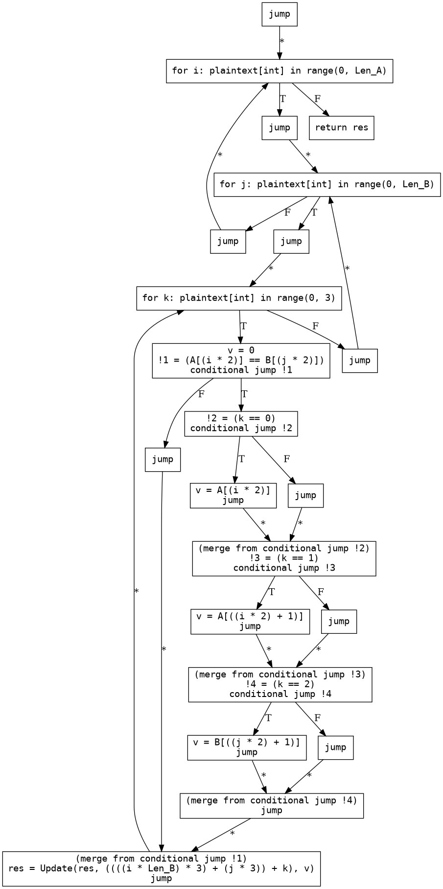
#### SSA
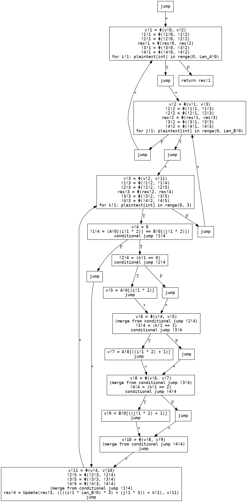
#### SSA ϕ→MUX
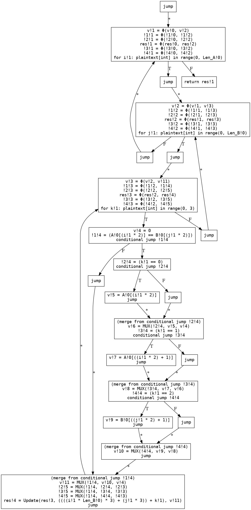
#### Dead code elimination
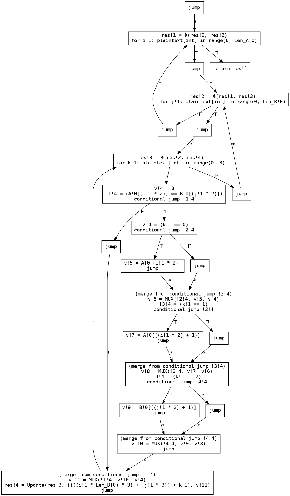
#### Linear code with loops
```python
def db_cross_join_trivial(A!0: shared[list[int; ?]], Len_A!0: plaintext[int], B!0: shared[list[int; ?]], Len_B!0: plaintext[int], res!0: shared[list[int; ?]]) -> shared[list[int; ?]]:
    for i!1 in range(0, Len_A!0):
        res!1 = Φ(res!0, res!2)
        for j!1 in range(0, Len_B!0):
            res!2 = Φ(res!1, res!3)
            for k!1 in range(0, 3):
                res!3 = Φ(res!2, res!4)
                v!4 = 0
                !1!4 = (A!0[(i!1 * 2)] == B!0[(j!1 * 2)])
                !2!4 = (k!1 == 0)
                v!5 = A!0[(i!1 * 2)]
                v!6 = MUX(!2!4, v!5, v!4)
                !3!4 = (k!1 == 1)
                v!7 = A!0[((i!1 * 2) + 1)]
                v!8 = MUX(!3!4, v!7, v!6)
                !4!4 = (k!1 == 2)
                v!9 = B!0[((j!1 * 2) + 1)]
                v!10 = MUX(!4!4, v!9, v!8)
                v!11 = MUX(!1!4, v!10, v!4)
                res!4 = Update(res!3, ((((i!1 * Len_B!0) * 3) + (j!1 * 3)) + k!1), v!11)
    return res!1
```
#### Dependency graph
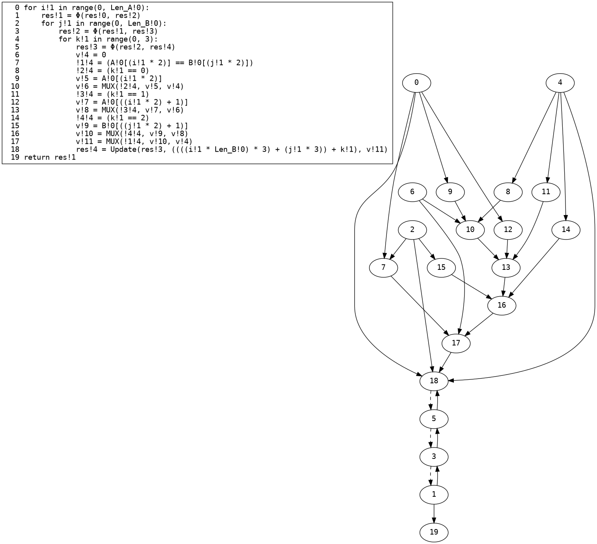
#### Removal of infeasible edges
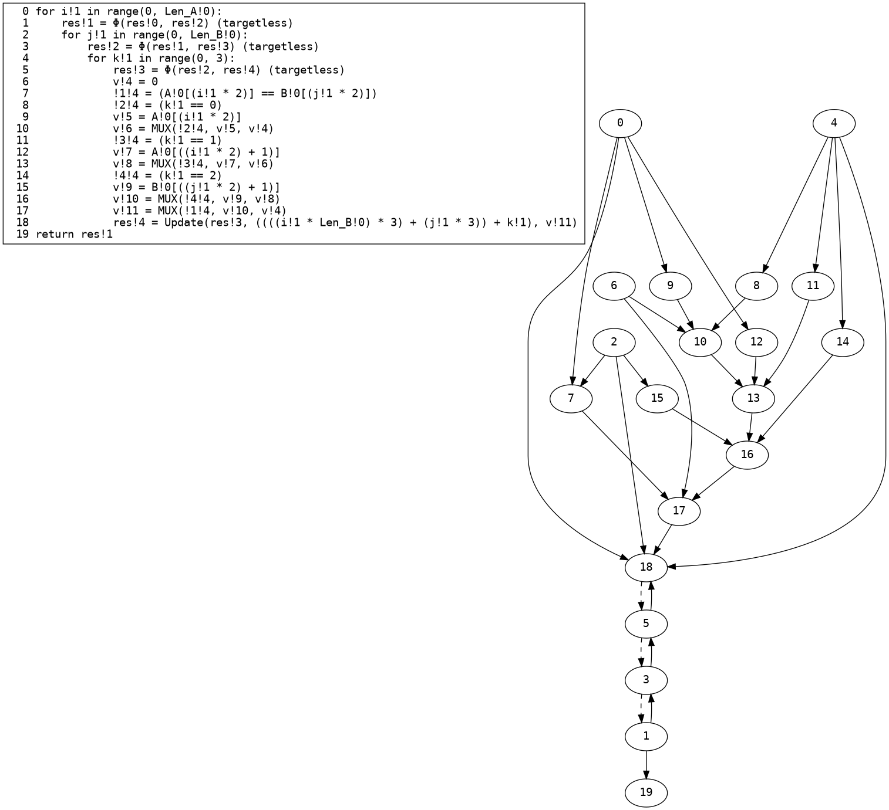
#### Type Environment Before Vectorization
| Variable | Type |
| - | - |
| `A!0` | `shared[list[int; ?]]` |
| `Len_A!0` | `plaintext[int]` |
| `B!0` | `shared[list[int; ?]]` |
| `Len_B!0` | `plaintext[int]` |
| `res!0` | `shared[list[int; ?]]` |
| `i!1` | `plaintext[int]` |
| `j!1` | `plaintext[int]` |
| `k!1` | `plaintext[int]` |
| `res!4` | `shared[list[list[list[int; (Len_A!0)]; (Len_B!0)]; (3)]]` |
| `res!3` | `shared[list[list[list[int; (Len_A!0)]; (Len_B!0)]; (3)]]` |
| `res!2` | `shared[list[list[list[int; (Len_A!0)]; (Len_B!0)]; (3)]]` |
| `res!1` | `shared[list[list[list[int; (Len_A!0)]; (Len_B!0)]; (3)]]` |
| `v!11` | `shared[int]` |
| `v!10` | `shared[int]` |
| `v!9` | `shared[int]` |
| `!4!4` | `plaintext[bool]` |
| `v!8` | `shared[int]` |
| `v!7` | `shared[int]` |
| `!3!4` | `plaintext[bool]` |
| `v!6` | `shared[int]` |
| `v!5` | `shared[int]` |
| `!2!4` | `plaintext[bool]` |
| `!1!4` | `shared[bool]` |
| `v!4` | `plaintext[int]` |
#### Basic Vectorization Phase 1
```python
def db_cross_join_trivial(A!0: shared[list[int; ?]], Len_A!0: plaintext[int], B!0: shared[list[int; ?]], Len_B!0: plaintext[int], res!0: shared[list[int; ?]]) -> shared[list[int; ?]]:
    !5!0{LEN_A!0, LEN_B!0, 3}[] = lift(res!0, (_:Len_A!0, _:Len_B!0, _:3))
    for i!1 in range(0, Len_A!0):
        res!1{LEN_A!0, LEN_B!0, 3}[] = Φ(!5!0{LEN_A!0, LEN_B!0, 3}[], res!2{LEN_A!0, LEN_B!0, 3}[]) (targetless)
        !6!0{LEN_A!0, LEN_B!0, 3}[] = lift(res!1{LEN_A!0, LEN_B!0, 3}[], (_:Len_A!0, _:Len_B!0, _:3))
        for j!1 in range(0, Len_B!0):
            res!2{LEN_A!0, LEN_B!0, 3}[] = Φ(!6!0{LEN_A!0, LEN_B!0, 3}[], res!3{LEN_A!0, LEN_B!0, 3}[]) (targetless)
            !7!0{LEN_A!0, LEN_B!0, 3}[] = lift(res!2{LEN_A!0, LEN_B!0, 3}[], (i!1:Len_A!0, j!1:Len_B!0, k!1:3))
            !8!0{LEN_A!0, LEN_B!0, 3}[] = lift(A!0[(i!1 * 2)], (i!1:Len_A!0, j!1:Len_B!0, k!1:3))
            !9!0{LEN_A!0, LEN_B!0, 3}[] = lift(B!0[(j!1 * 2)], (i!1:Len_A!0, j!1:Len_B!0, k!1:3))
            !10!0{LEN_A!0, LEN_B!0, 3}[] = lift(A!0[(i!1 * 2)], (i!1:Len_A!0, j!1:Len_B!0, k!1:3))
            !11!0{LEN_A!0, LEN_B!0, 3}[] = lift(A!0[((i!1 * 2) + 1)], (i!1:Len_A!0, j!1:Len_B!0, k!1:3))
            !12!0{LEN_A!0, LEN_B!0, 3}[] = lift(B!0[((j!1 * 2) + 1)], (i!1:Len_A!0, j!1:Len_B!0, k!1:3))
            for k!1 in range(0, 3):
                res!3{LEN_A!0, LEN_B!0, 3}[] = Φ(!7!0{LEN_A!0, LEN_B!0, 3}[], res!4{LEN_A!0, LEN_B!0, 3}[]) (targetless)
                v!4 = 0
                !1!4{LEN_A!0, LEN_B!0, 3}[] = (!8!0{LEN_A!0, LEN_B!0, 3}[] == !9!0{LEN_A!0, LEN_B!0, 3}[])
                !2!4 = (k!1 == 0)
                v!5{LEN_A!0, LEN_B!0, 3}[] = !10!0{LEN_A!0, LEN_B!0, 3}[]
                v!6{LEN_A!0, LEN_B!0, 3}[] = MUX(!2!4, v!5{LEN_A!0, LEN_B!0, 3}[], v!4)
                !3!4 = (k!1 == 1)
                v!7{LEN_A!0, LEN_B!0, 3}[] = !11!0{LEN_A!0, LEN_B!0, 3}[]
                v!8{LEN_A!0, LEN_B!0, 3}[] = MUX(!3!4, v!7{LEN_A!0, LEN_B!0, 3}[], v!6{LEN_A!0, LEN_B!0, 3}[])
                !4!4 = (k!1 == 2)
                v!9{LEN_A!0, LEN_B!0, 3}[] = !12!0{LEN_A!0, LEN_B!0, 3}[]
                v!10{LEN_A!0, LEN_B!0, 3}[] = MUX(!4!4, v!9{LEN_A!0, LEN_B!0, 3}[], v!8{LEN_A!0, LEN_B!0, 3}[])
                v!11{LEN_A!0, LEN_B!0, 3}[] = MUX(!1!4{LEN_A!0, LEN_B!0, 3}[], v!10{LEN_A!0, LEN_B!0, 3}[], v!4)
                res!4{LEN_A!0, LEN_B!0, 3}[] = VectorizedUpdate(res!3{LEN_A!0, LEN_B!0, 3}[], [I!1, J!1, K!1], v!11{LEN_A!0, LEN_B!0, 3}[])
    return res!1
```
#### Basic Vectorization Phase 1 (dependence graph)
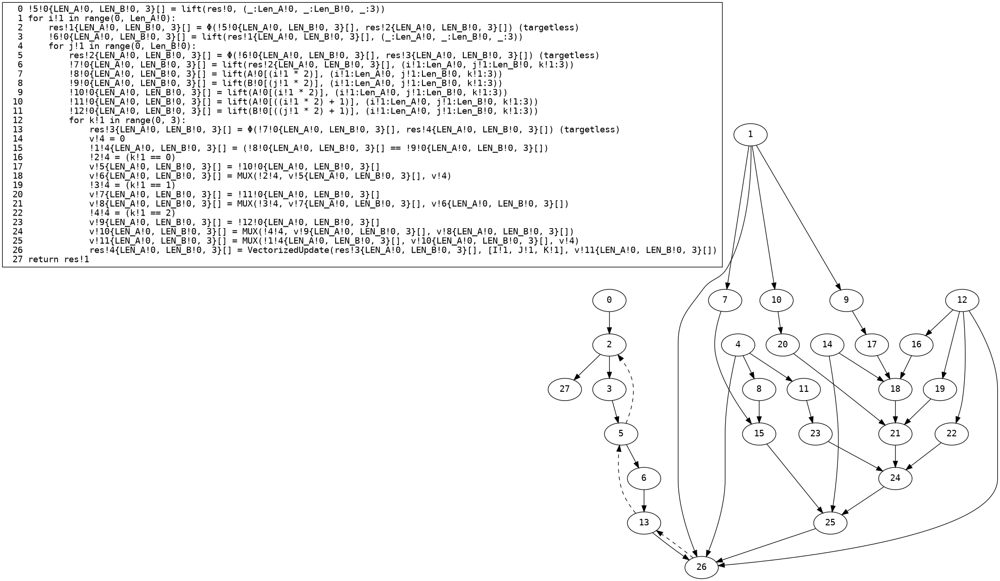
#### Basic Vectorization Phase 2
```python
def db_cross_join_trivial(A!0: shared[list[int; ?]], Len_A!0: plaintext[int], B!0: shared[list[int; ?]], Len_B!0: plaintext[int], res!0: shared[list[int; ?]]) -> shared[list[int; ?]]:
    !5!0{LEN_A!0, LEN_B!0, 3}[] = lift(res!0, (_:Len_A!0, _:Len_B!0, _:3))
    !8!0{LEN_A!0, LEN_B!0, 3}[] = lift(A!0[(i!1 * 2)], (i!1:Len_A!0, j!1:Len_B!0, k!1:3))
    !9!0{LEN_A!0, LEN_B!0, 3}[] = lift(B!0[(j!1 * 2)], (i!1:Len_A!0, j!1:Len_B!0, k!1:3))
    !10!0{LEN_A!0, LEN_B!0, 3}[] = lift(A!0[(i!1 * 2)], (i!1:Len_A!0, j!1:Len_B!0, k!1:3))
    !11!0{LEN_A!0, LEN_B!0, 3}[] = lift(A!0[((i!1 * 2) + 1)], (i!1:Len_A!0, j!1:Len_B!0, k!1:3))
    !12!0{LEN_A!0, LEN_B!0, 3}[] = lift(B!0[((j!1 * 2) + 1)], (i!1:Len_A!0, j!1:Len_B!0, k!1:3))
    v!4 = 0
    !13!0{LEN_A!0, LEN_B!0, 3}[] = lift((k!1 == 0), (i!1:Len_A!0, j!1:Len_B!0, k!1:3))
    !14!0{LEN_A!0, LEN_B!0, 3}[] = lift((k!1 == 1), (i!1:Len_A!0, j!1:Len_B!0, k!1:3))
    !15!0{LEN_A!0, LEN_B!0, 3}[] = lift((k!1 == 2), (i!1:Len_A!0, j!1:Len_B!0, k!1:3))
    !6!0{LEN_A!0, LEN_B!0, 3}[] = lift(!5!0{LEN_A!0, LEN_B!0, 3}[], (i!1:Len_A!0, _:Len_A!0, _:Len_B!0, _:3))
    !1!4{LEN_A!0, LEN_B!0, 3}[] = (!8!0{LEN_A!0, LEN_B!0, 3}[] == !9!0{LEN_A!0, LEN_B!0, 3}[])
    v!5{LEN_A!0, LEN_B!0, 3}[] = !10!0{LEN_A!0, LEN_B!0, 3}[]
    v!7{LEN_A!0, LEN_B!0, 3}[] = !11!0{LEN_A!0, LEN_B!0, 3}[]
    v!9{LEN_A!0, LEN_B!0, 3}[] = !12!0{LEN_A!0, LEN_B!0, 3}[]
    !7!0{LEN_A!0, LEN_B!0, 3}[] = lift(!6!0{LEN_A!0, LEN_B!0, 3}[], (i!1:Len_A!0, j!1:Len_B!0, k!1:3))
    v!6{LEN_A!0, LEN_B!0, 3}[] = MUX(!13!0{LEN_A!0, LEN_B!0, 3}[], v!5{LEN_A!0, LEN_B!0, 3}[], v!4)
    v!8{LEN_A!0, LEN_B!0, 3}[] = MUX(!14!0{LEN_A!0, LEN_B!0, 3}[], v!7{LEN_A!0, LEN_B!0, 3}[], v!6{LEN_A!0, LEN_B!0, 3}[])
    v!10{LEN_A!0, LEN_B!0, 3}[] = MUX(!15!0{LEN_A!0, LEN_B!0, 3}[], v!9{LEN_A!0, LEN_B!0, 3}[], v!8{LEN_A!0, LEN_B!0, 3}[])
    v!11{LEN_A!0, LEN_B!0, 3}[] = MUX(!1!4{LEN_A!0, LEN_B!0, 3}[], v!10{LEN_A!0, LEN_B!0, 3}[], v!4)
    res!4{LEN_A!0, LEN_B!0, 3}[] = VectorizedUpdate(!7!0{LEN_A!0, LEN_B!0, 3}[], [I!1, J!1, K!1], v!11{LEN_A!0, LEN_B!0, 3}[])
    return res!4
```
#### Basic Vectorization Phase 2 (dependence graph)
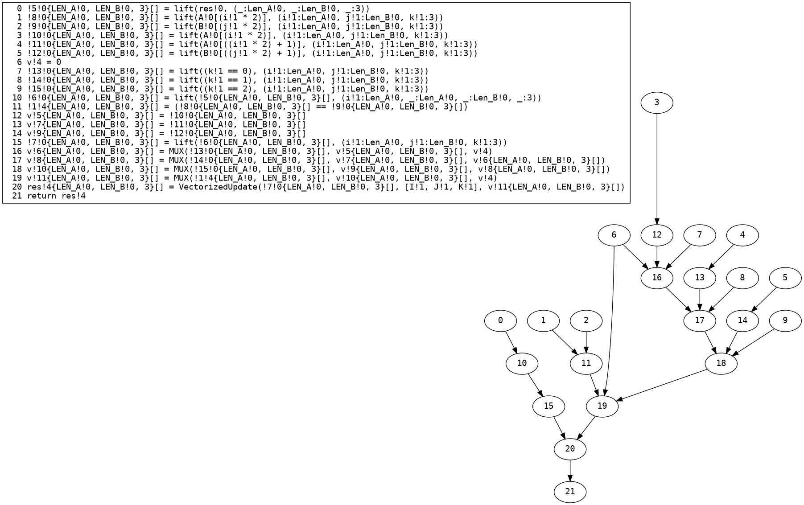
#### Type Environment After Vectorization
| Variable | Type |
| - | - |
| `A!0` | `shared[list[int; ?]]` |
| `Len_A!0` | `plaintext[int]` |
| `B!0` | `shared[list[int; ?]]` |
| `Len_B!0` | `plaintext[int]` |
| `res!0` | `shared[list[int; ?]]` |
| `res!4` | `shared[list[list[list[int; (Len_A!0)]; (Len_B!0)]; (3)]]` |
| `v!11` | `shared[list[list[list[int; (Len_A!0)]; (Len_B!0)]; (3)]]` |
| `v!10` | `shared[list[list[list[int; (Len_A!0)]; (Len_B!0)]; (3)]]` |
| `v!8` | `shared[list[list[list[int; (Len_A!0)]; (Len_B!0)]; (3)]]` |
| `v!6` | `shared[list[list[list[int; (Len_A!0)]; (Len_B!0)]; (3)]]` |
| `!7!0` | `shared[list[list[list[int; (Len_A!0)]; (Len_B!0)]; (3)]]` |
| `v!9` | `shared[list[list[list[int; (Len_A!0)]; (Len_B!0)]; (3)]]` |
| `v!7` | `shared[list[list[list[int; (Len_A!0)]; (Len_B!0)]; (3)]]` |
| `v!5` | `shared[list[list[list[int; (Len_A!0)]; (Len_B!0)]; (3)]]` |
| `!1!4` | `shared[list[list[list[bool; (Len_A!0)]; (Len_B!0)]; (3)]]` |
| `!6!0` | `shared[list[list[list[int; (Len_A!0)]; (Len_B!0)]; (3)]]` |
| `!15!0` | `shared[list[list[list[bool; (Len_A!0)]; (Len_B!0)]; (3)]]` |
| `!14!0` | `shared[list[list[list[bool; (Len_A!0)]; (Len_B!0)]; (3)]]` |
| `!13!0` | `shared[list[list[list[bool; (Len_A!0)]; (Len_B!0)]; (3)]]` |
| `v!4` | `plaintext[int]` |
| `!12!0` | `shared[list[list[list[int; (Len_A!0)]; (Len_B!0)]; (3)]]` |
| `!11!0` | `shared[list[list[list[int; (Len_A!0)]; (Len_B!0)]; (3)]]` |
| `!10!0` | `shared[list[list[list[int; (Len_A!0)]; (Len_B!0)]; (3)]]` |
| `!9!0` | `shared[list[list[list[int; (Len_A!0)]; (Len_B!0)]; (3)]]` |
| `!8!0` | `shared[list[list[list[int; (Len_A!0)]; (Len_B!0)]; (3)]]` |
| `!5!0` | `shared[list[list[list[int; (Len_A!0)]; (Len_B!0)]; (3)]]` |
#### Copy propagation
```python
def db_cross_join_trivial(A!0: shared[list[int; ?]], Len_A!0: plaintext[int], B!0: shared[list[int; ?]], Len_B!0: plaintext[int], res!0: shared[list[int; ?]]) -> shared[list[int; ?]]:
    !5!0{LEN_A!0, LEN_B!0, 3}[] = lift(res!0, (_:Len_A!0, _:Len_B!0, _:3))
    !8!0{LEN_A!0, LEN_B!0, 3}[] = lift(A!0[(i!1 * 2)], (i!1:Len_A!0, j!1:Len_B!0, k!1:3))
    !9!0{LEN_A!0, LEN_B!0, 3}[] = lift(B!0[(j!1 * 2)], (i!1:Len_A!0, j!1:Len_B!0, k!1:3))
    !10!0{LEN_A!0, LEN_B!0, 3}[] = lift(A!0[(i!1 * 2)], (i!1:Len_A!0, j!1:Len_B!0, k!1:3))
    !11!0{LEN_A!0, LEN_B!0, 3}[] = lift(A!0[((i!1 * 2) + 1)], (i!1:Len_A!0, j!1:Len_B!0, k!1:3))
    !12!0{LEN_A!0, LEN_B!0, 3}[] = lift(B!0[((j!1 * 2) + 1)], (i!1:Len_A!0, j!1:Len_B!0, k!1:3))
    v!4 = 0
    !13!0{LEN_A!0, LEN_B!0, 3}[] = lift((k!1 == 0), (i!1:Len_A!0, j!1:Len_B!0, k!1:3))
    !14!0{LEN_A!0, LEN_B!0, 3}[] = lift((k!1 == 1), (i!1:Len_A!0, j!1:Len_B!0, k!1:3))
    !15!0{LEN_A!0, LEN_B!0, 3}[] = lift((k!1 == 2), (i!1:Len_A!0, j!1:Len_B!0, k!1:3))
    !6!0{LEN_A!0, LEN_B!0, 3}[] = lift(!5!0{LEN_A!0, LEN_B!0, 3}[], (i!1:Len_A!0, _:Len_A!0, _:Len_B!0, _:3))
    !1!4{LEN_A!0, LEN_B!0, 3}[] = (!8!0{LEN_A!0, LEN_B!0, 3}[] == !9!0{LEN_A!0, LEN_B!0, 3}[])
    !7!0{LEN_A!0, LEN_B!0, 3}[] = lift(!6!0{LEN_A!0, LEN_B!0, 3}[], (i!1:Len_A!0, j!1:Len_B!0, k!1:3))
    v!6{LEN_A!0, LEN_B!0, 3}[] = MUX(!13!0{LEN_A!0, LEN_B!0, 3}[], !10!0{LEN_A!0, LEN_B!0, 3}[], v!4)
    v!8{LEN_A!0, LEN_B!0, 3}[] = MUX(!14!0{LEN_A!0, LEN_B!0, 3}[], !11!0{LEN_A!0, LEN_B!0, 3}[], v!6{LEN_A!0, LEN_B!0, 3}[])
    v!10{LEN_A!0, LEN_B!0, 3}[] = MUX(!15!0{LEN_A!0, LEN_B!0, 3}[], !12!0{LEN_A!0, LEN_B!0, 3}[], v!8{LEN_A!0, LEN_B!0, 3}[])
    v!11{LEN_A!0, LEN_B!0, 3}[] = MUX(!1!4{LEN_A!0, LEN_B!0, 3}[], v!10{LEN_A!0, LEN_B!0, 3}[], v!4)
    res!4{LEN_A!0, LEN_B!0, 3}[] = VectorizedUpdate(!7!0{LEN_A!0, LEN_B!0, 3}[], [I!1, J!1, K!1], v!11{LEN_A!0, LEN_B!0, 3}[])
    return res!4
```
#### Common subexpression elimination
```python
def db_cross_join_trivial(A!0: shared[list[int; ?]], Len_A!0: plaintext[int], B!0: shared[list[int; ?]], Len_B!0: plaintext[int], res!0: shared[list[int; ?]]) -> shared[list[int; ?]]:
    !5!0{LEN_A!0, LEN_B!0, 3}[] = lift(res!0, (_:Len_A!0, _:Len_B!0, _:3))
    !8!0{LEN_A!0, LEN_B!0, 3}[] = lift(A!0[(i!1 * 2)], (i!1:Len_A!0, j!1:Len_B!0, k!1:3))
    !9!0{LEN_A!0, LEN_B!0, 3}[] = lift(B!0[(j!1 * 2)], (i!1:Len_A!0, j!1:Len_B!0, k!1:3))
    !11!0{LEN_A!0, LEN_B!0, 3}[] = lift(A!0[((i!1 * 2) + 1)], (i!1:Len_A!0, j!1:Len_B!0, k!1:3))
    !12!0{LEN_A!0, LEN_B!0, 3}[] = lift(B!0[((j!1 * 2) + 1)], (i!1:Len_A!0, j!1:Len_B!0, k!1:3))
    v!4 = 0
    !13!0{LEN_A!0, LEN_B!0, 3}[] = lift((k!1 == 0), (i!1:Len_A!0, j!1:Len_B!0, k!1:3))
    !14!0{LEN_A!0, LEN_B!0, 3}[] = lift((k!1 == 1), (i!1:Len_A!0, j!1:Len_B!0, k!1:3))
    !15!0{LEN_A!0, LEN_B!0, 3}[] = lift((k!1 == 2), (i!1:Len_A!0, j!1:Len_B!0, k!1:3))
    !6!0{LEN_A!0, LEN_B!0, 3}[] = lift(!5!0{LEN_A!0, LEN_B!0, 3}[], (i!1:Len_A!0, _:Len_A!0, _:Len_B!0, _:3))
    !1!4{LEN_A!0, LEN_B!0, 3}[] = (!8!0{LEN_A!0, LEN_B!0, 3}[] == !9!0{LEN_A!0, LEN_B!0, 3}[])
    !7!0{LEN_A!0, LEN_B!0, 3}[] = lift(!6!0{LEN_A!0, LEN_B!0, 3}[], (i!1:Len_A!0, j!1:Len_B!0, k!1:3))
    v!6{LEN_A!0, LEN_B!0, 3}[] = MUX(!13!0{LEN_A!0, LEN_B!0, 3}[], !8!0{LEN_A!0, LEN_B!0, 3}[], v!4)
    v!8{LEN_A!0, LEN_B!0, 3}[] = MUX(!14!0{LEN_A!0, LEN_B!0, 3}[], !11!0{LEN_A!0, LEN_B!0, 3}[], v!6{LEN_A!0, LEN_B!0, 3}[])
    v!10{LEN_A!0, LEN_B!0, 3}[] = MUX(!15!0{LEN_A!0, LEN_B!0, 3}[], !12!0{LEN_A!0, LEN_B!0, 3}[], v!8{LEN_A!0, LEN_B!0, 3}[])
    v!11{LEN_A!0, LEN_B!0, 3}[] = MUX(!1!4{LEN_A!0, LEN_B!0, 3}[], v!10{LEN_A!0, LEN_B!0, 3}[], v!4)
    res!4{LEN_A!0, LEN_B!0, 3}[] = VectorizedUpdate(!7!0{LEN_A!0, LEN_B!0, 3}[], [I!1, J!1, K!1], v!11{LEN_A!0, LEN_B!0, 3}[])
    return res!4
```
#### MOTION mixed configuration
```Total cost:	0.19820
Input vars:	{B!0: ['Y'], A!0: ['Y'], res!0: ['Y']}
Constants:	{0: ['Y'], 1: ['Y'], 2: ['Y']}
Plaintext vars:	{}
Flags:		{}
!5!0{LEN_A!0, LEN_B!0, 3}[] = lift(res!0, (_:Len_A!0, _:Len_B!0, _:3)): _ -> ['Y'] for 0.00000 * 1 = 0.00
!8!0{LEN_A!0, LEN_B!0, 3}[] = lift(A!0[(i!1 * 2)], (i!1:Len_A!0, j!1:Len_B!0, k!1:3)): _ -> ['Y'] for 0.00000 * 1 = 0.00
!9!0{LEN_A!0, LEN_B!0, 3}[] = lift(B!0[(j!1 * 2)], (i!1:Len_A!0, j!1:Len_B!0, k!1:3)): _ -> ['Y'] for 0.00000 * 1 = 0.00
!11!0{LEN_A!0, LEN_B!0, 3}[] = lift(A!0[((i!1 * 2) + 1)], (i!1:Len_A!0, j!1:Len_B!0, k!1:3)): _ -> ['Y'] for 0.00000 * 1 = 0.00
!12!0{LEN_A!0, LEN_B!0, 3}[] = lift(B!0[((j!1 * 2) + 1)], (i!1:Len_A!0, j!1:Len_B!0, k!1:3)): _ -> ['Y'] for 0.00000 * 1 = 0.00
v!4 = 0: _ -> ['Y'] for 0.00000 * 1 = 0.00
!13!0{LEN_A!0, LEN_B!0, 3}[] = lift((k!1 == 0), (i!1:Len_A!0, j!1:Len_B!0, k!1:3)): _ -> ['Y'] for 0.00000 * 1 = 0.00
!14!0{LEN_A!0, LEN_B!0, 3}[] = lift((k!1 == 1), (i!1:Len_A!0, j!1:Len_B!0, k!1:3)): _ -> ['Y'] for 0.00000 * 1 = 0.00
!15!0{LEN_A!0, LEN_B!0, 3}[] = lift((k!1 == 2), (i!1:Len_A!0, j!1:Len_B!0, k!1:3)): _ -> ['Y'] for 0.00000 * 1 = 0.00
!6!0{LEN_A!0, LEN_B!0, 3}[] = lift(!5!0{LEN_A!0, LEN_B!0, 3}[], (i!1:Len_A!0, _:Len_A!0, _:Len_B!0, _:3)): _ -> ['Y'] for 0.00000 * 1 = 0.00
!1!4{LEN_A!0, LEN_B!0, 3}[] = (!8!0{LEN_A!0, LEN_B!0, 3}[] == !9!0{LEN_A!0, LEN_B!0, 3}[]): Y -> {} for 0.04002 * 1 = 0.04
!7!0{LEN_A!0, LEN_B!0, 3}[] = lift(!6!0{LEN_A!0, LEN_B!0, 3}[], (i!1:Len_A!0, j!1:Len_B!0, k!1:3)): _ -> ['Y'] for 0.00000 * 1 = 0.00
v!6{LEN_A!0, LEN_B!0, 3}[] = MUX(!13!0{LEN_A!0, LEN_B!0, 3}[], !8!0{LEN_A!0, LEN_B!0, 3}[], v!4): Y -> {} for 0.03955 * 1 = 0.04
v!8{LEN_A!0, LEN_B!0, 3}[] = MUX(!14!0{LEN_A!0, LEN_B!0, 3}[], !11!0{LEN_A!0, LEN_B!0, 3}[], v!6{LEN_A!0, LEN_B!0, 3}[]): Y -> {} for 0.03955 * 1 = 0.04
v!10{LEN_A!0, LEN_B!0, 3}[] = MUX(!15!0{LEN_A!0, LEN_B!0, 3}[], !12!0{LEN_A!0, LEN_B!0, 3}[], v!8{LEN_A!0, LEN_B!0, 3}[]): Y -> {} for 0.03955 * 1 = 0.04
v!11{LEN_A!0, LEN_B!0, 3}[] = MUX(!1!4{LEN_A!0, LEN_B!0, 3}[], v!10{LEN_A!0, LEN_B!0, 3}[], v!4): Y -> {} for 0.03955 * 1 = 0.04
res!4{LEN_A!0, LEN_B!0, 3}[] = VectorizedUpdate(!7!0{LEN_A!0, LEN_B!0, 3}[], [I!1, J!1, K!1], v!11{LEN_A!0, LEN_B!0, 3}[]): Y -> {} for 0.00000 * 1 = 0.00
return res!4
Output vars:	{res!4: ['Y']}

```
#### MOTION code
```cpp
template <encrypto::motion::MpcProtocol Protocol>
std::vector<encrypto::motion::SecureUnsignedInteger> db_cross_join_trivial(
    encrypto::motion::PartyPointer &party,
    std::vector<encrypto::motion::SecureUnsignedInteger> A_0,
    std::uint32_t _MPC_PLAINTEXT_Len_A_0,
    std::vector<encrypto::motion::SecureUnsignedInteger> B_0,
    std::uint32_t _MPC_PLAINTEXT_Len_B_0,
    std::vector<encrypto::motion::SecureUnsignedInteger> res_0
) {
    // Shared variable declarations
    std::vector<encrypto::motion::ShareWrapper> _1_4((_MPC_PLAINTEXT_Len_A_0) * (_MPC_PLAINTEXT_Len_B_0) * (std::uint32_t(3)));
    std::vector<encrypto::motion::SecureUnsignedInteger> _11_0((_MPC_PLAINTEXT_Len_A_0) * (_MPC_PLAINTEXT_Len_B_0) * (std::uint32_t(3)));
    std::vector<encrypto::motion::SecureUnsignedInteger> _12_0((_MPC_PLAINTEXT_Len_A_0) * (_MPC_PLAINTEXT_Len_B_0) * (std::uint32_t(3)));
    std::vector<encrypto::motion::ShareWrapper> _13_0((_MPC_PLAINTEXT_Len_A_0) * (_MPC_PLAINTEXT_Len_B_0) * (std::uint32_t(3)));
    std::vector<encrypto::motion::ShareWrapper> _14_0((_MPC_PLAINTEXT_Len_A_0) * (_MPC_PLAINTEXT_Len_B_0) * (std::uint32_t(3)));
    std::vector<encrypto::motion::ShareWrapper> _15_0((_MPC_PLAINTEXT_Len_A_0) * (_MPC_PLAINTEXT_Len_B_0) * (std::uint32_t(3)));
    std::vector<encrypto::motion::SecureUnsignedInteger> _5_0((_MPC_PLAINTEXT_Len_A_0) * (_MPC_PLAINTEXT_Len_B_0) * (std::uint32_t(3)));
    std::vector<encrypto::motion::SecureUnsignedInteger> _6_0((_MPC_PLAINTEXT_Len_A_0) * (_MPC_PLAINTEXT_Len_B_0) * (std::uint32_t(3)));
    std::vector<encrypto::motion::SecureUnsignedInteger> _7_0((_MPC_PLAINTEXT_Len_A_0) * (_MPC_PLAINTEXT_Len_B_0) * (std::uint32_t(3)));
    std::vector<encrypto::motion::SecureUnsignedInteger> _8_0((_MPC_PLAINTEXT_Len_A_0) * (_MPC_PLAINTEXT_Len_B_0) * (std::uint32_t(3)));
    std::vector<encrypto::motion::SecureUnsignedInteger> _9_0((_MPC_PLAINTEXT_Len_A_0) * (_MPC_PLAINTEXT_Len_B_0) * (std::uint32_t(3)));
    encrypto::motion::SecureUnsignedInteger Len_A_0;
    encrypto::motion::SecureUnsignedInteger Len_B_0;
    std::vector<encrypto::motion::SecureUnsignedInteger> res_4((_MPC_PLAINTEXT_Len_A_0) * (_MPC_PLAINTEXT_Len_B_0) * (std::uint32_t(3)));
    std::vector<encrypto::motion::SecureUnsignedInteger> v_10((_MPC_PLAINTEXT_Len_A_0) * (_MPC_PLAINTEXT_Len_B_0) * (std::uint32_t(3)));
    std::vector<encrypto::motion::SecureUnsignedInteger> v_11((_MPC_PLAINTEXT_Len_A_0) * (_MPC_PLAINTEXT_Len_B_0) * (std::uint32_t(3)));
    encrypto::motion::SecureUnsignedInteger v_4;
    std::vector<encrypto::motion::SecureUnsignedInteger> v_6((_MPC_PLAINTEXT_Len_A_0) * (_MPC_PLAINTEXT_Len_B_0) * (std::uint32_t(3)));
    std::vector<encrypto::motion::SecureUnsignedInteger> v_8((_MPC_PLAINTEXT_Len_A_0) * (_MPC_PLAINTEXT_Len_B_0) * (std::uint32_t(3)));

    // Plaintext variable declarations
    std::uint32_t _MPC_PLAINTEXT_v_4;

    // Constant initializations
    encrypto::motion::SecureUnsignedInteger _MPC_CONSTANT_0 = party->In<Protocol>(encrypto::motion::ToInput(std::uint32_t(0)), 0);
    encrypto::motion::SecureUnsignedInteger _MPC_CONSTANT_1 = party->In<Protocol>(encrypto::motion::ToInput(std::uint32_t(1)), 0);
    encrypto::motion::SecureUnsignedInteger _MPC_CONSTANT_2 = party->In<Protocol>(encrypto::motion::ToInput(std::uint32_t(2)), 0);
    encrypto::motion::SecureUnsignedInteger _MPC_CONSTANT_3 = party->In<Protocol>(encrypto::motion::ToInput(std::uint32_t(3)), 0);

    // Plaintext parameter assignments
    Len_A_0 = party->In<Protocol>(encrypto::motion::ToInput(_MPC_PLAINTEXT_Len_A_0), 0);
    Len_B_0 = party->In<Protocol>(encrypto::motion::ToInput(_MPC_PLAINTEXT_Len_B_0), 0);

    // Function body
    vectorized_assign(_5_0, {_MPC_PLAINTEXT_Len_A_0, _MPC_PLAINTEXT_Len_B_0, std::uint32_t(3)}, {true, true, true}, {}, lift(std::function([&](const std::vector<std::uint32_t> &indices){return res_0;}), {_MPC_PLAINTEXT_Len_A_0, _MPC_PLAINTEXT_Len_B_0, std::uint32_t(3)}));
    vectorized_assign(_8_0, {_MPC_PLAINTEXT_Len_A_0, _MPC_PLAINTEXT_Len_B_0, std::uint32_t(3)}, {true, true, true}, {}, lift(std::function([&](const std::vector<std::uint32_t> &indices){return A_0[(indices[0] * std::uint32_t(2))];}), {_MPC_PLAINTEXT_Len_A_0, _MPC_PLAINTEXT_Len_B_0, std::uint32_t(3)}));
    vectorized_assign(_9_0, {_MPC_PLAINTEXT_Len_A_0, _MPC_PLAINTEXT_Len_B_0, std::uint32_t(3)}, {true, true, true}, {}, lift(std::function([&](const std::vector<std::uint32_t> &indices){return B_0[(indices[1] * std::uint32_t(2))];}), {_MPC_PLAINTEXT_Len_A_0, _MPC_PLAINTEXT_Len_B_0, std::uint32_t(3)}));
    vectorized_assign(_11_0, {_MPC_PLAINTEXT_Len_A_0, _MPC_PLAINTEXT_Len_B_0, std::uint32_t(3)}, {true, true, true}, {}, lift(std::function([&](const std::vector<std::uint32_t> &indices){return A_0[((indices[0] * std::uint32_t(2)) + std::uint32_t(1))];}), {_MPC_PLAINTEXT_Len_A_0, _MPC_PLAINTEXT_Len_B_0, std::uint32_t(3)}));
    vectorized_assign(_12_0, {_MPC_PLAINTEXT_Len_A_0, _MPC_PLAINTEXT_Len_B_0, std::uint32_t(3)}, {true, true, true}, {}, lift(std::function([&](const std::vector<std::uint32_t> &indices){return B_0[((indices[1] * std::uint32_t(2)) + std::uint32_t(1))];}), {_MPC_PLAINTEXT_Len_A_0, _MPC_PLAINTEXT_Len_B_0, std::uint32_t(3)}));
    v_4 = _MPC_CONSTANT_0;
    _MPC_PLAINTEXT_v_4 = std::uint32_t(0);
    vectorized_assign(_13_0, {_MPC_PLAINTEXT_Len_A_0, _MPC_PLAINTEXT_Len_B_0, std::uint32_t(3)}, {true, true, true}, {}, lift(std::function([&](const std::vector<std::uint32_t> &indices){return (to_share_wrapper(encrypto::motion::SecureUnsignedInteger(party->In<Protocol>(encrypto::motion::ToInput(indices[2]), 0))) == to_share_wrapper(_MPC_CONSTANT_0));}), {_MPC_PLAINTEXT_Len_A_0, _MPC_PLAINTEXT_Len_B_0, std::uint32_t(3)}));
    vectorized_assign(_14_0, {_MPC_PLAINTEXT_Len_A_0, _MPC_PLAINTEXT_Len_B_0, std::uint32_t(3)}, {true, true, true}, {}, lift(std::function([&](const std::vector<std::uint32_t> &indices){return (to_share_wrapper(encrypto::motion::SecureUnsignedInteger(party->In<Protocol>(encrypto::motion::ToInput(indices[2]), 0))) == to_share_wrapper(_MPC_CONSTANT_1));}), {_MPC_PLAINTEXT_Len_A_0, _MPC_PLAINTEXT_Len_B_0, std::uint32_t(3)}));
    vectorized_assign(_15_0, {_MPC_PLAINTEXT_Len_A_0, _MPC_PLAINTEXT_Len_B_0, std::uint32_t(3)}, {true, true, true}, {}, lift(std::function([&](const std::vector<std::uint32_t> &indices){return (to_share_wrapper(encrypto::motion::SecureUnsignedInteger(party->In<Protocol>(encrypto::motion::ToInput(indices[2]), 0))) == to_share_wrapper(_MPC_CONSTANT_2));}), {_MPC_PLAINTEXT_Len_A_0, _MPC_PLAINTEXT_Len_B_0, std::uint32_t(3)}));
    vectorized_assign(_6_0, {_MPC_PLAINTEXT_Len_A_0, _MPC_PLAINTEXT_Len_B_0, std::uint32_t(3)}, {true, true, true}, {}, lift(std::function([&](const std::vector<std::uint32_t> &indices){return vectorized_access(_5_0, {_MPC_PLAINTEXT_Len_A_0, _MPC_PLAINTEXT_Len_B_0, std::uint32_t(3)}, {true, true, true}, {}).Unsimdify();}), {_MPC_PLAINTEXT_Len_A_0, _MPC_PLAINTEXT_Len_A_0, _MPC_PLAINTEXT_Len_B_0, std::uint32_t(3)}));
    vectorized_assign(_1_4, {_MPC_PLAINTEXT_Len_A_0, _MPC_PLAINTEXT_Len_B_0, std::uint32_t(3)}, {true, true, true}, {}, (to_share_wrapper(vectorized_access(_8_0, {_MPC_PLAINTEXT_Len_A_0, _MPC_PLAINTEXT_Len_B_0, std::uint32_t(3)}, {true, true, true}, {})) == to_share_wrapper(vectorized_access(_9_0, {_MPC_PLAINTEXT_Len_A_0, _MPC_PLAINTEXT_Len_B_0, std::uint32_t(3)}, {true, true, true}, {}))));
    vectorized_assign(_7_0, {_MPC_PLAINTEXT_Len_A_0, _MPC_PLAINTEXT_Len_B_0, std::uint32_t(3)}, {true, true, true}, {}, lift(std::function([&](const std::vector<std::uint32_t> &indices){return vectorized_access(_6_0, {_MPC_PLAINTEXT_Len_A_0, _MPC_PLAINTEXT_Len_B_0, std::uint32_t(3)}, {true, true, true}, {}).Unsimdify();}), {_MPC_PLAINTEXT_Len_A_0, _MPC_PLAINTEXT_Len_B_0, std::uint32_t(3)}));
    vectorized_assign(v_6, {_MPC_PLAINTEXT_Len_A_0, _MPC_PLAINTEXT_Len_B_0, std::uint32_t(3)}, {true, true, true}, {}, vectorized_access(_13_0, {_MPC_PLAINTEXT_Len_A_0, _MPC_PLAINTEXT_Len_B_0, std::uint32_t(3)}, {true, true, true}, {}).Mux(vectorized_access(_8_0, {_MPC_PLAINTEXT_Len_A_0, _MPC_PLAINTEXT_Len_B_0, std::uint32_t(3)}, {true, true, true}, {}).Get(), decltype(v_4)::Simdify(lift(std::function([&](const std::vector<std::uint32_t> &indices){return v_4;}), {_MPC_PLAINTEXT_Len_A_0, _MPC_PLAINTEXT_Len_B_0, std::uint32_t(3)})).Get()));
    vectorized_assign(v_8, {_MPC_PLAINTEXT_Len_A_0, _MPC_PLAINTEXT_Len_B_0, std::uint32_t(3)}, {true, true, true}, {}, vectorized_access(_14_0, {_MPC_PLAINTEXT_Len_A_0, _MPC_PLAINTEXT_Len_B_0, std::uint32_t(3)}, {true, true, true}, {}).Mux(vectorized_access(_11_0, {_MPC_PLAINTEXT_Len_A_0, _MPC_PLAINTEXT_Len_B_0, std::uint32_t(3)}, {true, true, true}, {}).Get(), vectorized_access(v_6, {_MPC_PLAINTEXT_Len_A_0, _MPC_PLAINTEXT_Len_B_0, std::uint32_t(3)}, {true, true, true}, {}).Get()));
    vectorized_assign(v_10, {_MPC_PLAINTEXT_Len_A_0, _MPC_PLAINTEXT_Len_B_0, std::uint32_t(3)}, {true, true, true}, {}, vectorized_access(_15_0, {_MPC_PLAINTEXT_Len_A_0, _MPC_PLAINTEXT_Len_B_0, std::uint32_t(3)}, {true, true, true}, {}).Mux(vectorized_access(_12_0, {_MPC_PLAINTEXT_Len_A_0, _MPC_PLAINTEXT_Len_B_0, std::uint32_t(3)}, {true, true, true}, {}).Get(), vectorized_access(v_8, {_MPC_PLAINTEXT_Len_A_0, _MPC_PLAINTEXT_Len_B_0, std::uint32_t(3)}, {true, true, true}, {}).Get()));
    vectorized_assign(v_11, {_MPC_PLAINTEXT_Len_A_0, _MPC_PLAINTEXT_Len_B_0, std::uint32_t(3)}, {true, true, true}, {}, vectorized_access(_1_4, {_MPC_PLAINTEXT_Len_A_0, _MPC_PLAINTEXT_Len_B_0, std::uint32_t(3)}, {true, true, true}, {}).Mux(vectorized_access(v_10, {_MPC_PLAINTEXT_Len_A_0, _MPC_PLAINTEXT_Len_B_0, std::uint32_t(3)}, {true, true, true}, {}).Get(), decltype(v_4)::Simdify(lift(std::function([&](const std::vector<std::uint32_t> &indices){return v_4;}), {_MPC_PLAINTEXT_Len_A_0, _MPC_PLAINTEXT_Len_B_0, std::uint32_t(3)})).Get()));
    vectorized_assign(res_4, {_MPC_PLAINTEXT_Len_A_0, _MPC_PLAINTEXT_Len_B_0, std::uint32_t(3)}, {true, true, true}, {}, vectorized_update(_7_0, {_MPC_PLAINTEXT_Len_A_0, _MPC_PLAINTEXT_Len_B_0, std::uint32_t(3)}, {true, true, true}, {}, vectorized_access(v_11, {_MPC_PLAINTEXT_Len_A_0, _MPC_PLAINTEXT_Len_B_0, std::uint32_t(3)}, {true, true, true}, {})));
    return res_4;

}
```
#### MOTION mixed code
```cpp
std::vector<encrypto::motion::SecureUnsignedInteger> db_cross_join_trivial(
    encrypto::motion::PartyPointer &party,
    std::vector<encrypto::motion::SecureUnsignedInteger> A_0,
    std::uint32_t _MPC_PLAINTEXT_Len_A_0,
    std::vector<encrypto::motion::SecureUnsignedInteger> B_0,
    std::uint32_t _MPC_PLAINTEXT_Len_B_0,
    std::vector<encrypto::motion::SecureUnsignedInteger> res_0
) {
    // Shared variable declarations
    std::vector<encrypto::motion::ShareWrapper> _1_4((_MPC_PLAINTEXT_Len_A_0) * (_MPC_PLAINTEXT_Len_B_0) * (std::uint32_t(3)));
    std::vector<encrypto::motion::SecureUnsignedInteger> _11_0((_MPC_PLAINTEXT_Len_A_0) * (_MPC_PLAINTEXT_Len_B_0) * (std::uint32_t(3)));
    std::vector<encrypto::motion::SecureUnsignedInteger> _12_0((_MPC_PLAINTEXT_Len_A_0) * (_MPC_PLAINTEXT_Len_B_0) * (std::uint32_t(3)));
    std::vector<encrypto::motion::ShareWrapper> _13_0((_MPC_PLAINTEXT_Len_A_0) * (_MPC_PLAINTEXT_Len_B_0) * (std::uint32_t(3)));
    std::vector<encrypto::motion::ShareWrapper> _14_0((_MPC_PLAINTEXT_Len_A_0) * (_MPC_PLAINTEXT_Len_B_0) * (std::uint32_t(3)));
    std::vector<encrypto::motion::ShareWrapper> _15_0((_MPC_PLAINTEXT_Len_A_0) * (_MPC_PLAINTEXT_Len_B_0) * (std::uint32_t(3)));
    std::vector<encrypto::motion::SecureUnsignedInteger> _5_0((_MPC_PLAINTEXT_Len_A_0) * (_MPC_PLAINTEXT_Len_B_0) * (std::uint32_t(3)));
    std::vector<encrypto::motion::SecureUnsignedInteger> _6_0((_MPC_PLAINTEXT_Len_A_0) * (_MPC_PLAINTEXT_Len_B_0) * (std::uint32_t(3)));
    std::vector<encrypto::motion::SecureUnsignedInteger> _7_0((_MPC_PLAINTEXT_Len_A_0) * (_MPC_PLAINTEXT_Len_B_0) * (std::uint32_t(3)));
    std::vector<encrypto::motion::SecureUnsignedInteger> _8_0((_MPC_PLAINTEXT_Len_A_0) * (_MPC_PLAINTEXT_Len_B_0) * (std::uint32_t(3)));
    std::vector<encrypto::motion::SecureUnsignedInteger> _9_0((_MPC_PLAINTEXT_Len_A_0) * (_MPC_PLAINTEXT_Len_B_0) * (std::uint32_t(3)));
    encrypto::motion::SecureUnsignedInteger Len_A_0;
    encrypto::motion::SecureUnsignedInteger Len_B_0;
    std::vector<encrypto::motion::SecureUnsignedInteger> res_4((_MPC_PLAINTEXT_Len_A_0) * (_MPC_PLAINTEXT_Len_B_0) * (std::uint32_t(3)));
    std::vector<encrypto::motion::SecureUnsignedInteger> v_10((_MPC_PLAINTEXT_Len_A_0) * (_MPC_PLAINTEXT_Len_B_0) * (std::uint32_t(3)));
    std::vector<encrypto::motion::SecureUnsignedInteger> v_11((_MPC_PLAINTEXT_Len_A_0) * (_MPC_PLAINTEXT_Len_B_0) * (std::uint32_t(3)));
    encrypto::motion::SecureUnsignedInteger v_4;
    std::vector<encrypto::motion::SecureUnsignedInteger> v_6((_MPC_PLAINTEXT_Len_A_0) * (_MPC_PLAINTEXT_Len_B_0) * (std::uint32_t(3)));
    std::vector<encrypto::motion::SecureUnsignedInteger> v_8((_MPC_PLAINTEXT_Len_A_0) * (_MPC_PLAINTEXT_Len_B_0) * (std::uint32_t(3)));

    // Plaintext variable declarations
    std::uint32_t _MPC_PLAINTEXT_v_4;

    // Constant initializations
    encrypto::motion::SecureUnsignedInteger _MPC_CONSTANT_0 = party->In<encrypto::motion::MpcProtocol::kBmr>(encrypto::motion::ToInput(std::uint32_t(0)), 0);
    encrypto::motion::SecureUnsignedInteger _MPC_CONSTANT_1 = party->In<encrypto::motion::MpcProtocol::kBmr>(encrypto::motion::ToInput(std::uint32_t(1)), 0);
    encrypto::motion::SecureUnsignedInteger _MPC_CONSTANT_2 = party->In<encrypto::motion::MpcProtocol::kBmr>(encrypto::motion::ToInput(std::uint32_t(2)), 0);

    // Input Protocol Convertions

    // Plaintext parameter assignments

    // Function body
    vectorized_assign(_5_0, {_MPC_PLAINTEXT_Len_A_0, _MPC_PLAINTEXT_Len_B_0, std::uint32_t(3)}, {true, true, true}, {}, lift(std::function([&](const std::vector<std::uint32_t> &indices){return res_0;}), {_MPC_PLAINTEXT_Len_A_0, _MPC_PLAINTEXT_Len_B_0, std::uint32_t(3)}));
    vectorized_assign(_8_0, {_MPC_PLAINTEXT_Len_A_0, _MPC_PLAINTEXT_Len_B_0, std::uint32_t(3)}, {true, true, true}, {}, lift(std::function([&](const std::vector<std::uint32_t> &indices){return A_0[(indices[0] * std::uint32_t(2))];}), {_MPC_PLAINTEXT_Len_A_0, _MPC_PLAINTEXT_Len_B_0, std::uint32_t(3)}));
    vectorized_assign(_9_0, {_MPC_PLAINTEXT_Len_A_0, _MPC_PLAINTEXT_Len_B_0, std::uint32_t(3)}, {true, true, true}, {}, lift(std::function([&](const std::vector<std::uint32_t> &indices){return B_0[(indices[1] * std::uint32_t(2))];}), {_MPC_PLAINTEXT_Len_A_0, _MPC_PLAINTEXT_Len_B_0, std::uint32_t(3)}));
    vectorized_assign(_11_0, {_MPC_PLAINTEXT_Len_A_0, _MPC_PLAINTEXT_Len_B_0, std::uint32_t(3)}, {true, true, true}, {}, lift(std::function([&](const std::vector<std::uint32_t> &indices){return A_0[((indices[0] * std::uint32_t(2)) + std::uint32_t(1))];}), {_MPC_PLAINTEXT_Len_A_0, _MPC_PLAINTEXT_Len_B_0, std::uint32_t(3)}));
    vectorized_assign(_12_0, {_MPC_PLAINTEXT_Len_A_0, _MPC_PLAINTEXT_Len_B_0, std::uint32_t(3)}, {true, true, true}, {}, lift(std::function([&](const std::vector<std::uint32_t> &indices){return B_0[((indices[1] * std::uint32_t(2)) + std::uint32_t(1))];}), {_MPC_PLAINTEXT_Len_A_0, _MPC_PLAINTEXT_Len_B_0, std::uint32_t(3)}));
    v_4 = _MPC_CONSTANT_0;
    _MPC_PLAINTEXT_v_4 = std::uint32_t(0);
    vectorized_assign(_13_0, {_MPC_PLAINTEXT_Len_A_0, _MPC_PLAINTEXT_Len_B_0, std::uint32_t(3)}, {true, true, true}, {}, lift(std::function([&](const std::vector<std::uint32_t> &indices){return (to_share_wrapper(encrypto::motion::SecureUnsignedInteger(party->In<encrypto::motion::MpcProtocol::kBmr>(encrypto::motion::ToInput(indices[2]), 0))) == to_share_wrapper(_MPC_CONSTANT_0));}), {_MPC_PLAINTEXT_Len_A_0, _MPC_PLAINTEXT_Len_B_0, std::uint32_t(3)}));
    vectorized_assign(_14_0, {_MPC_PLAINTEXT_Len_A_0, _MPC_PLAINTEXT_Len_B_0, std::uint32_t(3)}, {true, true, true}, {}, lift(std::function([&](const std::vector<std::uint32_t> &indices){return (to_share_wrapper(encrypto::motion::SecureUnsignedInteger(party->In<encrypto::motion::MpcProtocol::kBmr>(encrypto::motion::ToInput(indices[2]), 0))) == to_share_wrapper(_MPC_CONSTANT_1));}), {_MPC_PLAINTEXT_Len_A_0, _MPC_PLAINTEXT_Len_B_0, std::uint32_t(3)}));
    vectorized_assign(_15_0, {_MPC_PLAINTEXT_Len_A_0, _MPC_PLAINTEXT_Len_B_0, std::uint32_t(3)}, {true, true, true}, {}, lift(std::function([&](const std::vector<std::uint32_t> &indices){return (to_share_wrapper(encrypto::motion::SecureUnsignedInteger(party->In<encrypto::motion::MpcProtocol::kBmr>(encrypto::motion::ToInput(indices[2]), 0))) == to_share_wrapper(_MPC_CONSTANT_2));}), {_MPC_PLAINTEXT_Len_A_0, _MPC_PLAINTEXT_Len_B_0, std::uint32_t(3)}));
    vectorized_assign(_6_0, {_MPC_PLAINTEXT_Len_A_0, _MPC_PLAINTEXT_Len_B_0, std::uint32_t(3)}, {true, true, true}, {}, lift(std::function([&](const std::vector<std::uint32_t> &indices){return vectorized_access(_5_0, {_MPC_PLAINTEXT_Len_A_0, _MPC_PLAINTEXT_Len_B_0, std::uint32_t(3)}, {true, true, true}, {}).Unsimdify();}), {_MPC_PLAINTEXT_Len_A_0, _MPC_PLAINTEXT_Len_A_0, _MPC_PLAINTEXT_Len_B_0, std::uint32_t(3)}));
    vectorized_assign(_1_4, {_MPC_PLAINTEXT_Len_A_0, _MPC_PLAINTEXT_Len_B_0, std::uint32_t(3)}, {true, true, true}, {}, (to_share_wrapper(vectorized_access(_8_0, {_MPC_PLAINTEXT_Len_A_0, _MPC_PLAINTEXT_Len_B_0, std::uint32_t(3)}, {true, true, true}, {})) == to_share_wrapper(vectorized_access(_9_0, {_MPC_PLAINTEXT_Len_A_0, _MPC_PLAINTEXT_Len_B_0, std::uint32_t(3)}, {true, true, true}, {}))));
    vectorized_assign(_7_0, {_MPC_PLAINTEXT_Len_A_0, _MPC_PLAINTEXT_Len_B_0, std::uint32_t(3)}, {true, true, true}, {}, lift(std::function([&](const std::vector<std::uint32_t> &indices){return vectorized_access(_6_0, {_MPC_PLAINTEXT_Len_A_0, _MPC_PLAINTEXT_Len_B_0, std::uint32_t(3)}, {true, true, true}, {}).Unsimdify();}), {_MPC_PLAINTEXT_Len_A_0, _MPC_PLAINTEXT_Len_B_0, std::uint32_t(3)}));
    vectorized_assign(v_6, {_MPC_PLAINTEXT_Len_A_0, _MPC_PLAINTEXT_Len_B_0, std::uint32_t(3)}, {true, true, true}, {}, vectorized_access(_13_0, {_MPC_PLAINTEXT_Len_A_0, _MPC_PLAINTEXT_Len_B_0, std::uint32_t(3)}, {true, true, true}, {}).Mux(vectorized_access(_8_0, {_MPC_PLAINTEXT_Len_A_0, _MPC_PLAINTEXT_Len_B_0, std::uint32_t(3)}, {true, true, true}, {}).Get(), decltype(v_4)::Simdify(lift(std::function([&](const std::vector<std::uint32_t> &indices){return v_4;}), {_MPC_PLAINTEXT_Len_A_0, _MPC_PLAINTEXT_Len_B_0, std::uint32_t(3)})).Get()));
    vectorized_assign(v_8, {_MPC_PLAINTEXT_Len_A_0, _MPC_PLAINTEXT_Len_B_0, std::uint32_t(3)}, {true, true, true}, {}, vectorized_access(_14_0, {_MPC_PLAINTEXT_Len_A_0, _MPC_PLAINTEXT_Len_B_0, std::uint32_t(3)}, {true, true, true}, {}).Mux(vectorized_access(_11_0, {_MPC_PLAINTEXT_Len_A_0, _MPC_PLAINTEXT_Len_B_0, std::uint32_t(3)}, {true, true, true}, {}).Get(), vectorized_access(v_6, {_MPC_PLAINTEXT_Len_A_0, _MPC_PLAINTEXT_Len_B_0, std::uint32_t(3)}, {true, true, true}, {}).Get()));
    vectorized_assign(v_10, {_MPC_PLAINTEXT_Len_A_0, _MPC_PLAINTEXT_Len_B_0, std::uint32_t(3)}, {true, true, true}, {}, vectorized_access(_15_0, {_MPC_PLAINTEXT_Len_A_0, _MPC_PLAINTEXT_Len_B_0, std::uint32_t(3)}, {true, true, true}, {}).Mux(vectorized_access(_12_0, {_MPC_PLAINTEXT_Len_A_0, _MPC_PLAINTEXT_Len_B_0, std::uint32_t(3)}, {true, true, true}, {}).Get(), vectorized_access(v_8, {_MPC_PLAINTEXT_Len_A_0, _MPC_PLAINTEXT_Len_B_0, std::uint32_t(3)}, {true, true, true}, {}).Get()));
    vectorized_assign(v_11, {_MPC_PLAINTEXT_Len_A_0, _MPC_PLAINTEXT_Len_B_0, std::uint32_t(3)}, {true, true, true}, {}, vectorized_access(_1_4, {_MPC_PLAINTEXT_Len_A_0, _MPC_PLAINTEXT_Len_B_0, std::uint32_t(3)}, {true, true, true}, {}).Mux(vectorized_access(v_10, {_MPC_PLAINTEXT_Len_A_0, _MPC_PLAINTEXT_Len_B_0, std::uint32_t(3)}, {true, true, true}, {}).Get(), decltype(v_4)::Simdify(lift(std::function([&](const std::vector<std::uint32_t> &indices){return v_4;}), {_MPC_PLAINTEXT_Len_A_0, _MPC_PLAINTEXT_Len_B_0, std::uint32_t(3)})).Get()));
    vectorized_assign(res_4, {_MPC_PLAINTEXT_Len_A_0, _MPC_PLAINTEXT_Len_B_0, std::uint32_t(3)}, {true, true, true}, {}, vectorized_update(_7_0, {_MPC_PLAINTEXT_Len_A_0, _MPC_PLAINTEXT_Len_B_0, std::uint32_t(3)}, {true, true, true}, {}, vectorized_access(v_11, {_MPC_PLAINTEXT_Len_A_0, _MPC_PLAINTEXT_Len_B_0, std::uint32_t(3)}, {true, true, true}, {})));
    return res_4;

}
```
#### MP-SPDZ mixed configuration
```Total cost:	0.00044
Input vars:	{B!0: ['B'], A!0: ['B'], res!0: ['B']}
Constants:	{0: ['B'], 1: ['B'], 2: ['B']}
Plaintext vars:	{}
Flags:		{X}
!5!0{LEN_A!0, LEN_B!0, 3}[] = lift(res!0, (_:Len_A!0, _:Len_B!0, _:3)): _ -> ['B'] for 0.00000 * 1 = 0.00
!8!0{LEN_A!0, LEN_B!0, 3}[] = lift(A!0[(i!1 * 2)], (i!1:Len_A!0, j!1:Len_B!0, k!1:3)): _ -> ['B'] for 0.00000 * 1 = 0.00
!9!0{LEN_A!0, LEN_B!0, 3}[] = lift(B!0[(j!1 * 2)], (i!1:Len_A!0, j!1:Len_B!0, k!1:3)): _ -> ['B'] for 0.00000 * 1 = 0.00
!11!0{LEN_A!0, LEN_B!0, 3}[] = lift(A!0[((i!1 * 2) + 1)], (i!1:Len_A!0, j!1:Len_B!0, k!1:3)): _ -> ['B'] for 0.00000 * 1 = 0.00
!12!0{LEN_A!0, LEN_B!0, 3}[] = lift(B!0[((j!1 * 2) + 1)], (i!1:Len_A!0, j!1:Len_B!0, k!1:3)): _ -> ['B'] for 0.00000 * 1 = 0.00
v!4 = 0: _ -> ['B'] for 0.00000 * 1 = 0.00
!13!0{LEN_A!0, LEN_B!0, 3}[] = lift((k!1 == 0), (i!1:Len_A!0, j!1:Len_B!0, k!1:3)): _ -> ['B'] for 0.00000 * 1 = 0.00
!14!0{LEN_A!0, LEN_B!0, 3}[] = lift((k!1 == 1), (i!1:Len_A!0, j!1:Len_B!0, k!1:3)): _ -> ['B'] for 0.00000 * 1 = 0.00
!15!0{LEN_A!0, LEN_B!0, 3}[] = lift((k!1 == 2), (i!1:Len_A!0, j!1:Len_B!0, k!1:3)): _ -> ['B'] for 0.00000 * 1 = 0.00
!6!0{LEN_A!0, LEN_B!0, 3}[] = lift(!5!0{LEN_A!0, LEN_B!0, 3}[], (i!1:Len_A!0, _:Len_A!0, _:Len_B!0, _:3)): _ -> ['B'] for 0.00000 * 1 = 0.00
!1!4{LEN_A!0, LEN_B!0, 3}[] = (!8!0{LEN_A!0, LEN_B!0, 3}[] == !9!0{LEN_A!0, LEN_B!0, 3}[]): B -> {} for 0.00043 * 1 = 0.00
!7!0{LEN_A!0, LEN_B!0, 3}[] = lift(!6!0{LEN_A!0, LEN_B!0, 3}[], (i!1:Len_A!0, j!1:Len_B!0, k!1:3)): _ -> ['B'] for 0.00000 * 1 = 0.00
v!6{LEN_A!0, LEN_B!0, 3}[] = MUX(!13!0{LEN_A!0, LEN_B!0, 3}[], !8!0{LEN_A!0, LEN_B!0, 3}[], v!4): B -> {} for 0.00000 * 1 = 0.00
v!8{LEN_A!0, LEN_B!0, 3}[] = MUX(!14!0{LEN_A!0, LEN_B!0, 3}[], !11!0{LEN_A!0, LEN_B!0, 3}[], v!6{LEN_A!0, LEN_B!0, 3}[]): B -> {} for 0.00000 * 1 = 0.00
v!10{LEN_A!0, LEN_B!0, 3}[] = MUX(!15!0{LEN_A!0, LEN_B!0, 3}[], !12!0{LEN_A!0, LEN_B!0, 3}[], v!8{LEN_A!0, LEN_B!0, 3}[]): B -> {} for 0.00000 * 1 = 0.00
v!11{LEN_A!0, LEN_B!0, 3}[] = MUX(!1!4{LEN_A!0, LEN_B!0, 3}[], v!10{LEN_A!0, LEN_B!0, 3}[], v!4): B -> {} for 0.00000 * 1 = 0.00
res!4{LEN_A!0, LEN_B!0, 3}[] = VectorizedUpdate(!7!0{LEN_A!0, LEN_B!0, 3}[], [I!1, J!1, K!1], v!11{LEN_A!0, LEN_B!0, 3}[]): B -> {} for 0.00000 * 1 = 0.00
return res!4
Output vars:	{res!4: ['B']}

```
#### MP-SPDZ code
```py
def db_cross_join_trivial(A_0, Len_A_0, B_0, Len_B_0, res_0):
    # Shared array declarations
    _1_4 = [None] * (Len_A_0 * Len_B_0 * 3)
    _11_0 = [None] * (Len_A_0 * Len_B_0 * 3)
    _12_0 = [None] * (Len_A_0 * Len_B_0 * 3)
    _13_0 = [None] * (Len_A_0 * Len_B_0 * 3)
    _14_0 = [None] * (Len_A_0 * Len_B_0 * 3)
    _15_0 = [None] * (Len_A_0 * Len_B_0 * 3)
    _5_0 = [None] * (Len_A_0 * Len_B_0 * 3)
    _6_0 = [None] * (Len_A_0 * Len_B_0 * 3)
    _7_0 = [None] * (Len_A_0 * Len_B_0 * 3)
    _8_0 = [None] * (Len_A_0 * Len_B_0 * 3)
    _9_0 = [None] * (Len_A_0 * Len_B_0 * 3)
    res_4 = [None] * (Len_A_0 * Len_B_0 * 3)
    v_10 = [None] * (Len_A_0 * Len_B_0 * 3)
    v_11 = [None] * (Len_A_0 * Len_B_0 * 3)
    v_6 = [None] * (Len_A_0 * Len_B_0 * 3)
    v_8 = [None] * (Len_A_0 * Len_B_0 * 3)
    # Function body
    _5_0 = _v.lift(lambda indices: res_0, [Len_A_0, Len_B_0, 3])
    _8_0 = _v.lift(lambda indices: (A_0[(indices[0] * 2)]), [Len_A_0, Len_B_0, 3])
    _9_0 = _v.lift(lambda indices: (B_0[(indices[1] * 2)]), [Len_A_0, Len_B_0, 3])
    _11_0 = _v.lift(lambda indices: (A_0[((indices[0] * 2) + 1)]), [Len_A_0, Len_B_0, 3])
    _12_0 = _v.lift(lambda indices: (B_0[((indices[1] * 2) + 1)]), [Len_A_0, Len_B_0, 3])
    v_4 = sint(0)
    _13_0 = _v.lift(lambda indices: (indices[2] == sint(0)), [Len_A_0, Len_B_0, 3])
    _14_0 = _v.lift(lambda indices: (indices[2] == sint(1)), [Len_A_0, Len_B_0, 3])
    _15_0 = _v.lift(lambda indices: (indices[2] == sint(2)), [Len_A_0, Len_B_0, 3])
    _6_0 = _v.lift(lambda indices: _v.vectorized_access(_5_0, [Len_A_0, Len_B_0, 3], [None, None, None]), [Len_A_0, Len_A_0, Len_B_0, 3])
    _v.vectorized_assign(_1_4, [Len_A_0, Len_B_0, 3], [None, None, None], (_v.vectorized_access_simd(_8_0, [Len_A_0, Len_B_0, 3], [None, None, None]) == _v.vectorized_access_simd(_9_0, [Len_A_0, Len_B_0, 3], [None, None, None])))
    _7_0 = _v.lift(lambda indices: _v.vectorized_access(_6_0, [Len_A_0, Len_B_0, 3], [None, None, None]), [Len_A_0, Len_B_0, 3])
    _v.iterative_mux(v_6,_13_0,_8_0,v_4,[Len_A_0, Len_B_0, 3],[None, None, None])
    _v.iterative_mux(v_8,_14_0,_11_0,v_6,[Len_A_0, Len_B_0, 3],[None, None, None])
    _v.iterative_mux(v_10,_15_0,_12_0,v_8,[Len_A_0, Len_B_0, 3],[None, None, None])
    _v.iterative_mux(v_11,_1_4,v_10,v_4,[Len_A_0, Len_B_0, 3],[None, None, None])
    _v.vectorized_assign(_7_0, [Len_A_0, Len_B_0, 3], [None, None, None], _v.vectorized_access(v_11, [Len_A_0, Len_B_0, 3], [None, None, None])); _v.vectorized_assign(res_4, [Len_A_0, Len_B_0, 3], [None, None, None], _v.vectorized_access(_7_0, [Len_A_0, Len_B_0, 3], [None, None, None]))
    return res_4
```
#### MP-SPDZ mixed code
```py
program.options.binary = 32
program.use_dabit = True
def db_cross_join_trivial(A_0, Len_A_0, B_0, Len_B_0, res_0):
    # Convertion functions
    siv32 = sbitintvec.get_type(32)
    sb32 = sbits.get_type(32)
    
    
    # Shared array declarations
    _1_4 = [None] * (Len_A_0 * Len_B_0 * 3)
    _11_0 = [None] * (Len_A_0 * Len_B_0 * 3)
    _12_0 = [None] * (Len_A_0 * Len_B_0 * 3)
    _13_0 = [None] * (Len_A_0 * Len_B_0 * 3)
    _14_0 = [None] * (Len_A_0 * Len_B_0 * 3)
    _15_0 = [None] * (Len_A_0 * Len_B_0 * 3)
    _5_0 = [None] * (Len_A_0 * Len_B_0 * 3)
    _6_0 = [None] * (Len_A_0 * Len_B_0 * 3)
    _7_0 = [None] * (Len_A_0 * Len_B_0 * 3)
    _8_0 = [None] * (Len_A_0 * Len_B_0 * 3)
    _9_0 = [None] * (Len_A_0 * Len_B_0 * 3)
    res_4 = [None] * (Len_A_0 * Len_B_0 * 3)
    v_10 = [None] * (Len_A_0 * Len_B_0 * 3)
    v_11 = [None] * (Len_A_0 * Len_B_0 * 3)
    v_6 = [None] * (Len_A_0 * Len_B_0 * 3)
    v_8 = [None] * (Len_A_0 * Len_B_0 * 3)
    # Shared array convertion declarations
    
    # Function body
    _5_0 = _v.lift(lambda indices: res_0, [Len_A_0, Len_B_0, 3])
    _8_0 = _v.lift(lambda indices: (A_0[(indices[0] * 2)]), [Len_A_0, Len_B_0, 3])
    _9_0 = _v.lift(lambda indices: (B_0[(indices[1] * 2)]), [Len_A_0, Len_B_0, 3])
    _11_0 = _v.lift(lambda indices: (A_0[((indices[0] * 2) + 1)]), [Len_A_0, Len_B_0, 3])
    _12_0 = _v.lift(lambda indices: (B_0[((indices[1] * 2) + 1)]), [Len_A_0, Len_B_0, 3])
    v_4 = siv32(0)
    _13_0 = _v.lift(lambda indices: (indices[2] == siv32(0)), [Len_A_0, Len_B_0, 3])
    _14_0 = _v.lift(lambda indices: (indices[2] == siv32(1)), [Len_A_0, Len_B_0, 3])
    _15_0 = _v.lift(lambda indices: (indices[2] == siv32(2)), [Len_A_0, Len_B_0, 3])
    _6_0 = _v.lift(lambda indices: _v.vectorized_access(_5_0, [Len_A_0, Len_B_0, 3], [None, None, None]), [Len_A_0, Len_A_0, Len_B_0, 3])
    _v.vectorized_assign(_1_4, [Len_A_0, Len_B_0, 3], [None, None, None], (_v.vectorized_access_simd(_8_0, [Len_A_0, Len_B_0, 3], [None, None, None]) == _v.vectorized_access_simd(_9_0, [Len_A_0, Len_B_0, 3], [None, None, None])))
    _7_0 = _v.lift(lambda indices: _v.vectorized_access(_6_0, [Len_A_0, Len_B_0, 3], [None, None, None]), [Len_A_0, Len_B_0, 3])
    _v.iterative_mux(v_6,_13_0,_8_0,v_4,[Len_A_0, Len_B_0, 3],[None, None, None])
    _v.iterative_mux(v_8,_14_0,_11_0,v_6,[Len_A_0, Len_B_0, 3],[None, None, None])
    _v.iterative_mux(v_10,_15_0,_12_0,v_8,[Len_A_0, Len_B_0, 3],[None, None, None])
    _v.iterative_mux(v_11,_1_4,v_10,v_4,[Len_A_0, Len_B_0, 3],[None, None, None])
    _v.vectorized_assign(_7_0, [Len_A_0, Len_B_0, 3], [None, None, None], _v.vectorized_access(v_11, [Len_A_0, Len_B_0, 3], [None, None, None])); _v.vectorized_assign(res_4, [Len_A_0, Len_B_0, 3], [None, None, None], _v.vectorized_access(_7_0, [Len_A_0, Len_B_0, 3], [None, None, None]))
    return res_4
```
### `db_variance`
#### Input
```python
from UTIL import shared

# Array A is a the input array of integers i, merges the arrays of two parties
# Array V is a same-size result array, contains variance
# A = [0,2,1,0,3,4,2,3]
# V = [0,0,0,0,0,0,0,0]
# requires: len(A) == len(V) == len
# V is an array of 0s
def db_variance(A: shared[list[int]], V: shared[list[int]], len: int) -> shared[int]:
    sum = 0
    for i in range(len):
        sum = sum + A[i]
    # Does MOTION have integer division operation
    exp = sum // len
    for i in range(len):
        dist = A[i] - exp
        V[i] = dist * dist
    res = 0
    for i in range(len):
        res = res + V[i]
    variance = res // len
    return variance


A = [0, 2, 1, 0, 3, 4, 2, 3]
V = [0, 0, 0, 0, 0, 0, 0, 0]
len = 8
print(db_variance(A, V, len))

```
#### Restricted AST
```python
def db_variance(A: shared[list[int; ?]], V: shared[list[int; ?]], len: plaintext[int]) -> shared[int]:
    sum = 0
    for i: plaintext[int] in range(0, len):
        sum = (sum + A[i])
    exp = (sum / len)
    for i: plaintext[int] in range(0, len):
        dist = (A[i] - exp)
        V[i] = (dist * dist)
    res = 0
    for i: plaintext[int] in range(0, len):
        res = (res + V[i])
    variance = (res / len)
    return variance
```
#### Three-address code CFG
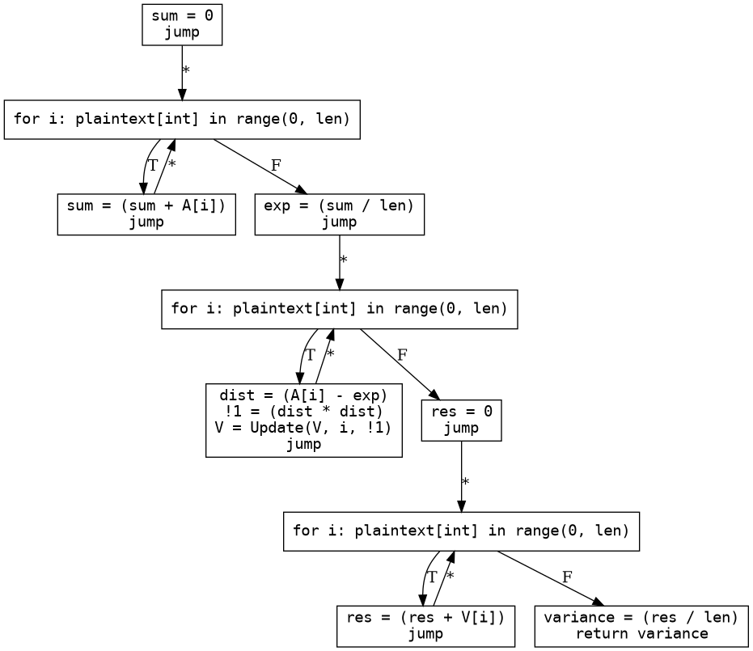
#### SSA

#### SSA ϕ→MUX
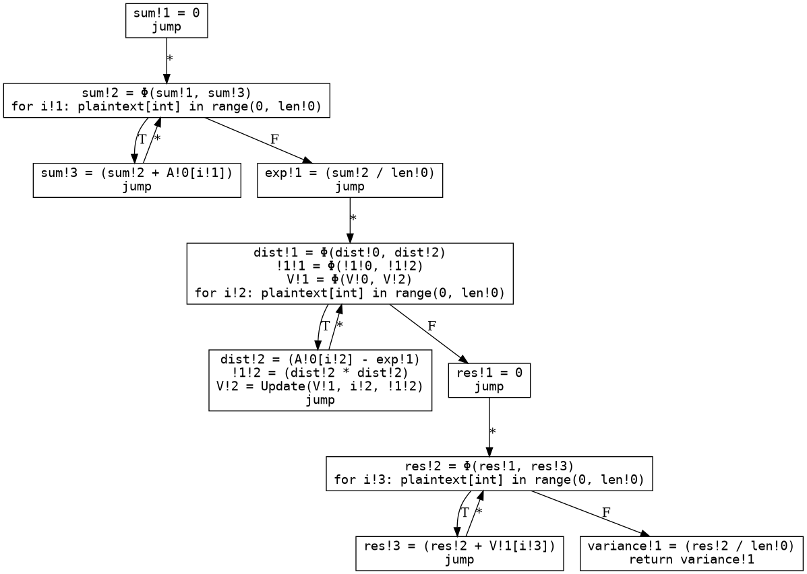
#### Dead code elimination
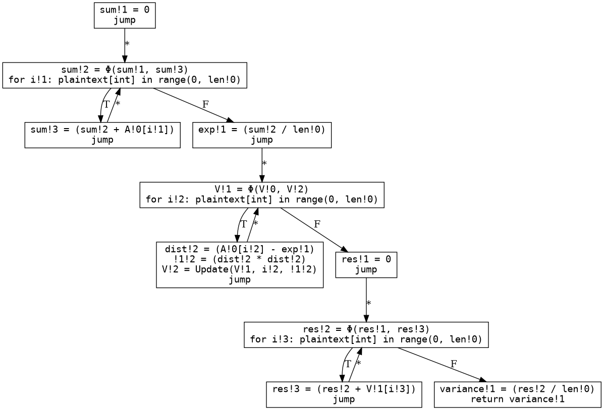
#### Linear code with loops
```python
def db_variance(A!0: shared[list[int; ?]], V!0: shared[list[int; ?]], len!0: plaintext[int]) -> shared[int]:
    sum!1 = 0
    for i!1 in range(0, len!0):
        sum!2 = Φ(sum!1, sum!3)
        sum!3 = (sum!2 + A!0[i!1])
    exp!1 = (sum!2 / len!0)
    for i!2 in range(0, len!0):
        V!1 = Φ(V!0, V!2)
        dist!2 = (A!0[i!2] - exp!1)
        !1!2 = (dist!2 * dist!2)
        V!2 = Update(V!1, i!2, !1!2)
    res!1 = 0
    for i!3 in range(0, len!0):
        res!2 = Φ(res!1, res!3)
        res!3 = (res!2 + V!1[i!3])
    variance!1 = (res!2 / len!0)
    return variance!1
```
#### Dependency graph
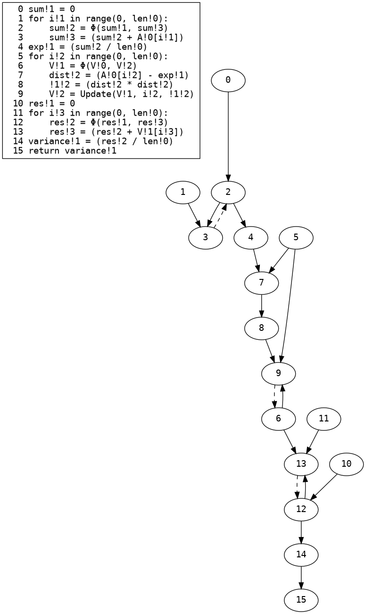
#### Removal of infeasible edges
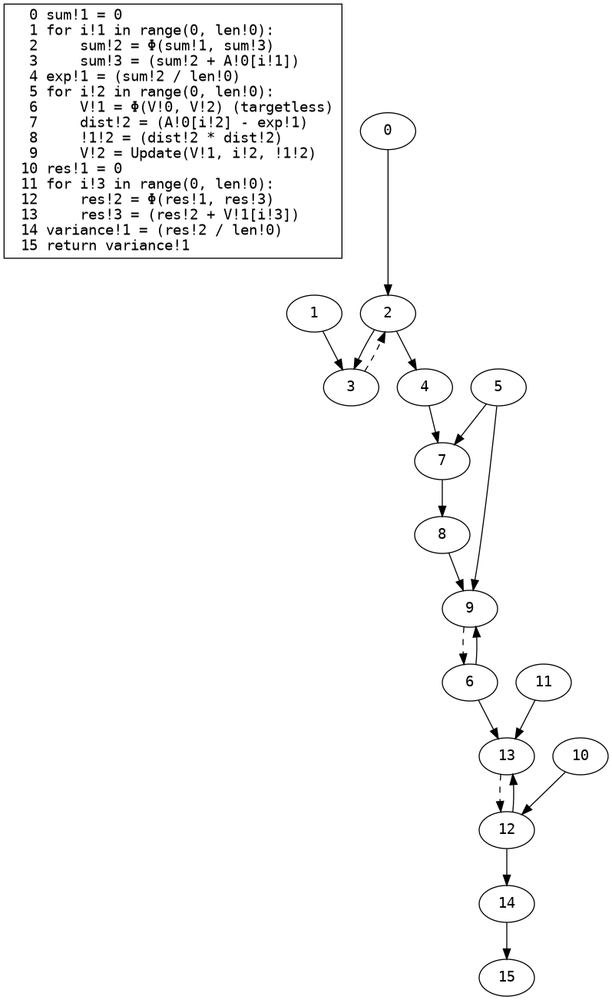
#### Type Environment Before Vectorization
| Variable | Type |
| - | - |
| `A!0` | `shared[list[int; ?]]` |
| `V!0` | `shared[list[int; ?]]` |
| `len!0` | `plaintext[int]` |
| `i!1` | `plaintext[int]` |
| `i!2` | `plaintext[int]` |
| `i!3` | `plaintext[int]` |
| `variance!1` | `shared[int]` |
| `V!1` | `shared[list[int; (len!0)]]` |
| `res!3` | `shared[int]` |
| `res!2` | `shared[int]` |
| `res!1` | `plaintext[int]` |
| `V!2` | `shared[list[int; (len!0)]]` |
| `!1!2` | `shared[int]` |
| `dist!2` | `shared[int]` |
| `exp!1` | `shared[int]` |
| `sum!3` | `shared[int]` |
| `sum!2` | `shared[int]` |
| `sum!1` | `plaintext[int]` |
#### Basic Vectorization Phase 1
```python
def db_variance(A!0: shared[list[int; ?]], V!0: shared[list[int; ?]], len!0: plaintext[int]) -> shared[int]:
    sum!1 = 0
    !2!0{LEN!0}[] = lift(sum!1, (i!1:len!0))
    !3!0{LEN!0}[] = lift(A!0[i!1], (i!1:len!0))
    for i!1 in range(0, len!0):
        sum!2{LEN!0}[] = Φ(!2!0{LEN!0}[], sum!3{LEN!0}[])
        sum!3{LEN!0}[] = (sum!2{LEN!0}[] + !3!0{LEN!0}[])
    !4!0 = drop_dim(sum!3{LEN!0}[])
    exp!1 = (!4!0 / len!0)
    !5!0{LEN!0}[] = lift(V!0, (i!2:len!0))
    !6!0{LEN!0}[] = lift(A!0[i!2], (i!2:len!0))
    !7!0{LEN!0}[] = lift(exp!1, (i!2:len!0))
    for i!2 in range(0, len!0):
        V!1{LEN!0}[] = Φ(!5!0{LEN!0}[], V!2{LEN!0}[]) (targetless)
        dist!2{LEN!0}[] = (!6!0{LEN!0}[] - !7!0{LEN!0}[])
        !1!2{LEN!0}[] = (dist!2{LEN!0}[] * dist!2{LEN!0}[])
        V!2{LEN!0}[] = VectorizedUpdate(V!1{LEN!0}[], [I!2], !1!2{LEN!0}[])
    res!1 = 0
    !8!0{LEN!0}[] = lift(res!1, (i!3:len!0))
    for i!3 in range(0, len!0):
        res!2{LEN!0}[] = Φ(!8!0{LEN!0}[], res!3{LEN!0}[])
        res!3{LEN!0}[] = (res!2{LEN!0}[] + V!1{LEN!0}[])
    !9!0 = drop_dim(res!3{LEN!0}[])
    variance!1 = (!9!0 / len!0)
    return variance!1
```
#### Basic Vectorization Phase 1 (dependence graph)
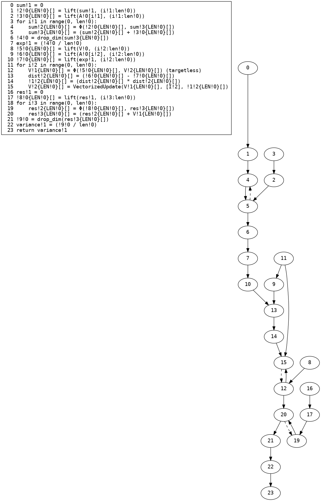
#### Basic Vectorization Phase 2
```python
def db_variance(A!0: shared[list[int; ?]], V!0: shared[list[int; ?]], len!0: plaintext[int]) -> shared[int]:
    sum!1 = 0
    !3!0{LEN!0}[] = lift(A!0[i!1], (i!1:len!0))
    !5!0{LEN!0}[] = lift(V!0, (i!2:len!0))
    !6!0{LEN!0}[] = lift(A!0[i!2], (i!2:len!0))
    res!1 = 0
    !2!0{LEN!0}[] = lift(sum!1, (i!1:len!0))
    !8!0{LEN!0}[] = lift(res!1, (i!3:len!0))
    for !10!0 in range(0, len!0): (monolithic)
        sum!2{}[!10!0] = Φ(!2!0{}[!10!0], sum!3{}[(!10!0 - 1)])
        sum!3{}[!10!0] = (sum!2{}[!10!0] + !3!0{}[!10!0])
    !4!0 = drop_dim(sum!3{LEN!0}[])
    exp!1 = (!4!0 / len!0)
    !7!0{LEN!0}[] = lift(exp!1, (i!2:len!0))
    dist!2{LEN!0}[] = (!6!0{LEN!0}[] - !7!0{LEN!0}[])
    !1!2{LEN!0}[] = (dist!2{LEN!0}[] * dist!2{LEN!0}[])
    V!2{LEN!0}[] = VectorizedUpdate(!5!0{LEN!0}[], [I!2], !1!2{LEN!0}[])
    for !11!0 in range(0, len!0): (monolithic)
        res!2{}[!11!0] = Φ(!8!0{}[!11!0], res!3{}[(!11!0 - 1)])
        res!3{}[!11!0] = (res!2{}[!11!0] + V!2{}[!11!0])
    !9!0 = drop_dim(res!3{LEN!0}[])
    variance!1 = (!9!0 / len!0)
    return variance!1
```
#### Basic Vectorization Phase 2 (dependence graph)
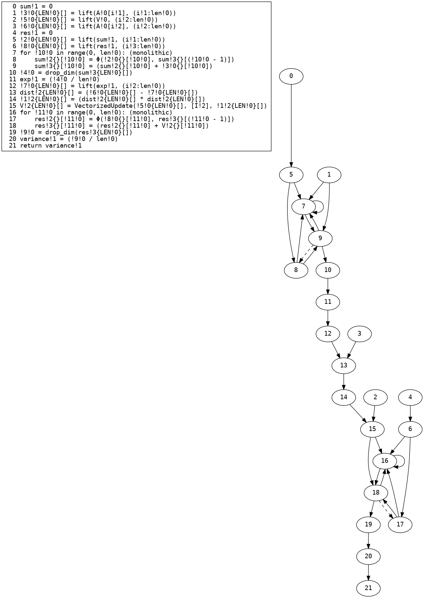
#### Type Environment After Vectorization
| Variable | Type |
| - | - |
| `A!0` | `shared[list[int; ?]]` |
| `V!0` | `shared[list[int; ?]]` |
| `len!0` | `plaintext[int]` |
| `!10!0` | `plaintext[int]` |
| `!11!0` | `plaintext[int]` |
| `variance!1` | `shared[int]` |
| `!9!0` | `shared[int]` |
| `res!3` | `shared[list[int; (len!0)]]` |
| `res!2` | `shared[list[int; (len!0)]]` |
| `V!2` | `shared[list[int; (len!0)]]` |
| `!1!2` | `shared[list[int; (len!0)]]` |
| `dist!2` | `shared[list[int; (len!0)]]` |
| `!7!0` | `shared[list[int; (len!0)]]` |
| `exp!1` | `shared[int]` |
| `!4!0` | `shared[int]` |
| `sum!3` | `shared[list[int; (len!0)]]` |
| `sum!2` | `shared[list[int; (len!0)]]` |
| `!8!0` | `shared[list[int; (len!0)]]` |
| `!2!0` | `shared[list[int; (len!0)]]` |
| `res!1` | `plaintext[int]` |
| `!6!0` | `shared[list[int; (len!0)]]` |
| `!5!0` | `shared[list[int; (len!0)]]` |
| `!3!0` | `shared[list[int; (len!0)]]` |
| `sum!1` | `plaintext[int]` |
#### Copy propagation
```python
def db_variance(A!0: shared[list[int; ?]], V!0: shared[list[int; ?]], len!0: plaintext[int]) -> shared[int]:
    sum!1 = 0
    !3!0{LEN!0}[] = lift(A!0[i!1], (i!1:len!0))
    !5!0{LEN!0}[] = lift(V!0, (i!2:len!0))
    !6!0{LEN!0}[] = lift(A!0[i!2], (i!2:len!0))
    res!1 = 0
    !2!0{LEN!0}[] = lift(sum!1, (i!1:len!0))
    !8!0{LEN!0}[] = lift(res!1, (i!3:len!0))
    for !10!0 in range(0, len!0): (monolithic)
        sum!2{}[!10!0] = Φ(!2!0{}[!10!0], sum!3{}[(!10!0 - 1)])
        sum!3{}[!10!0] = (sum!2{}[!10!0] + !3!0{}[!10!0])
    !4!0 = drop_dim(sum!3{LEN!0}[])
    exp!1 = (!4!0 / len!0)
    !7!0{LEN!0}[] = lift(exp!1, (i!2:len!0))
    dist!2{LEN!0}[] = (!6!0{LEN!0}[] - !7!0{LEN!0}[])
    !1!2{LEN!0}[] = (dist!2{LEN!0}[] * dist!2{LEN!0}[])
    V!2{LEN!0}[] = VectorizedUpdate(!5!0{LEN!0}[], [I!2], !1!2{LEN!0}[])
    for !11!0 in range(0, len!0): (monolithic)
        res!2{}[!11!0] = Φ(!8!0{}[!11!0], res!3{}[(!11!0 - 1)])
        res!3{}[!11!0] = (res!2{}[!11!0] + V!2{}[!11!0])
    !9!0 = drop_dim(res!3{LEN!0}[])
    variance!1 = (!9!0 / len!0)
    return variance!1
```
#### Common subexpression elimination
```python
def db_variance(A!0: shared[list[int; ?]], V!0: shared[list[int; ?]], len!0: plaintext[int]) -> shared[int]:
    sum!1 = 0
    !3!0{LEN!0}[] = lift(A!0[i!1], (i!1:len!0))
    !5!0{LEN!0}[] = lift(V!0, (i!2:len!0))
    !6!0{LEN!0}[] = lift(A!0[i!2], (i!2:len!0))
    res!1 = 0
    !2!0{LEN!0}[] = lift(sum!1, (i!1:len!0))
    !8!0{LEN!0}[] = lift(res!1, (i!3:len!0))
    for !10!0 in range(0, len!0): (monolithic)
        sum!2{}[!10!0] = Φ(!2!0{}[!10!0], sum!3{}[(!10!0 - 1)])
        sum!3{}[!10!0] = (sum!2{}[!10!0] + !3!0{}[!10!0])
    !4!0 = drop_dim(sum!3{LEN!0}[])
    exp!1 = (!4!0 / len!0)
    !7!0{LEN!0}[] = lift(exp!1, (i!2:len!0))
    dist!2{LEN!0}[] = (!6!0{LEN!0}[] - !7!0{LEN!0}[])
    !1!2{LEN!0}[] = (dist!2{LEN!0}[] * dist!2{LEN!0}[])
    V!2{LEN!0}[] = VectorizedUpdate(!5!0{LEN!0}[], [I!2], !1!2{LEN!0}[])
    for !11!0 in range(0, len!0): (monolithic)
        res!2{}[!11!0] = Φ(!8!0{}[!11!0], res!3{}[(!11!0 - 1)])
        res!3{}[!11!0] = (res!2{}[!11!0] + V!2{}[!11!0])
    !9!0 = drop_dim(res!3{LEN!0}[])
    variance!1 = (!9!0 / len!0)
    return variance!1
```
#### MOTION mixed configuration
```Total cost:	1.59191
Input vars:	{A!0: ['A'], V!0: ['A']}
Constants:	{0: ['A']}
Plaintext vars:	{len!0: ['Y']}
Flags:		{}
sum!1 = 0: _ -> ['A'] for 0.00000 * 1 = 0.00
!3!0{LEN!0}[] = lift(A!0[i!1], (i!1:len!0)): _ -> ['A'] for 0.00000 * 1 = 0.00
!5!0{LEN!0}[] = lift(V!0, (i!2:len!0)): _ -> ['A'] for 0.00000 * 1 = 0.00
!6!0{LEN!0}[] = lift(A!0[i!2], (i!2:len!0)): _ -> ['A'] for 0.00000 * 1 = 0.00
res!1 = 0: _ -> ['A'] for 0.00000 * 1 = 0.00
!2!0{LEN!0}[] = lift(sum!1, (i!1:len!0)): _ -> ['A'] for 0.00000 * 1 = 0.00
!8!0{LEN!0}[] = lift(res!1, (i!3:len!0)): _ -> ['A'] for 0.00000 * 1 = 0.00
	sum!2{}[!10!0] = Φ(!2!0{}[!10!0], sum!3{}[(!10!0 - 1)]): A -> {} for 0.00000 * 8 = 0.00
	sum!3{}[!10!0] = (sum!2{}[!10!0] + !3!0{}[!10!0]): A -> {} for 0.00000 * 8 = 0.00
!4!0 = drop_dim(sum!3{LEN!0}[]): _ -> ['A', 'Y'] for 0.02316 * 1 = 0.02 (A->Y)
exp!1 = (!4!0 / len!0): Y -> ['A'] for 0.77225 * 1 = 0.77 (Y->A)
!7!0{LEN!0}[] = lift(exp!1, (i!2:len!0)): _ -> ['A', 'Y'] for 0.00000 * 1 = 0.00
dist!2{LEN!0}[] = (!6!0{LEN!0}[] - !7!0{LEN!0}[]): A -> {} for 0.00012 * 1 = 0.00
!1!2{LEN!0}[] = (dist!2{LEN!0}[] * dist!2{LEN!0}[]): A -> {} for 0.00983 * 1 = 0.01
V!2{LEN!0}[] = VectorizedUpdate(!5!0{LEN!0}[], [I!2], !1!2{LEN!0}[]): A -> {} for 0.00000 * 1 = 0.00
	res!2{}[!11!0] = Φ(!8!0{}[!11!0], res!3{}[(!11!0 - 1)]): A -> {} for 0.00000 * 8 = 0.00
	res!3{}[!11!0] = (res!2{}[!11!0] + V!2{}[!11!0]): A -> {} for 0.00000 * 8 = 0.00
!9!0 = drop_dim(res!3{LEN!0}[]): _ -> ['A', 'Y'] for 0.02316 * 1 = 0.02 (A->Y)
variance!1 = (!9!0 / len!0): Y -> {} for 0.76340 * 1 = 0.76
return variance!1
Output vars:	{variance!1: ['Y']}

```
#### MOTION code
```cpp
template <encrypto::motion::MpcProtocol Protocol>
encrypto::motion::SecureUnsignedInteger db_variance(
    encrypto::motion::PartyPointer &party,
    std::vector<encrypto::motion::SecureUnsignedInteger> A_0,
    std::vector<encrypto::motion::SecureUnsignedInteger> V_0,
    std::uint32_t _MPC_PLAINTEXT_len_0
) {
    // Shared variable declarations
    std::vector<encrypto::motion::SecureUnsignedInteger> _1_2((_MPC_PLAINTEXT_len_0));
    encrypto::motion::SecureUnsignedInteger _10_0;
    encrypto::motion::SecureUnsignedInteger _11_0;
    std::vector<encrypto::motion::SecureUnsignedInteger> _2_0((_MPC_PLAINTEXT_len_0));
    std::vector<encrypto::motion::SecureUnsignedInteger> _3_0((_MPC_PLAINTEXT_len_0));
    encrypto::motion::SecureUnsignedInteger _4_0;
    std::vector<encrypto::motion::SecureUnsignedInteger> _5_0((_MPC_PLAINTEXT_len_0));
    std::vector<encrypto::motion::SecureUnsignedInteger> _6_0((_MPC_PLAINTEXT_len_0));
    std::vector<encrypto::motion::SecureUnsignedInteger> _7_0((_MPC_PLAINTEXT_len_0));
    std::vector<encrypto::motion::SecureUnsignedInteger> _8_0((_MPC_PLAINTEXT_len_0));
    encrypto::motion::SecureUnsignedInteger _9_0;
    std::vector<encrypto::motion::SecureUnsignedInteger> V_2((_MPC_PLAINTEXT_len_0));
    std::vector<encrypto::motion::SecureUnsignedInteger> dist_2((_MPC_PLAINTEXT_len_0));
    encrypto::motion::SecureUnsignedInteger exp_1;
    encrypto::motion::SecureUnsignedInteger len_0;
    encrypto::motion::SecureUnsignedInteger res_1;
    std::vector<encrypto::motion::SecureUnsignedInteger> res_2((_MPC_PLAINTEXT_len_0));
    std::vector<encrypto::motion::SecureUnsignedInteger> res_3((_MPC_PLAINTEXT_len_0));
    encrypto::motion::SecureUnsignedInteger sum_1;
    std::vector<encrypto::motion::SecureUnsignedInteger> sum_2((_MPC_PLAINTEXT_len_0));
    std::vector<encrypto::motion::SecureUnsignedInteger> sum_3((_MPC_PLAINTEXT_len_0));
    encrypto::motion::SecureUnsignedInteger variance_1;

    // Plaintext variable declarations
    std::uint32_t _MPC_PLAINTEXT__10_0;
    std::uint32_t _MPC_PLAINTEXT__11_0;
    std::uint32_t _MPC_PLAINTEXT_res_1;
    std::uint32_t _MPC_PLAINTEXT_sum_1;

    // Constant initializations
    encrypto::motion::SecureUnsignedInteger _MPC_CONSTANT_0 = party->In<Protocol>(encrypto::motion::ToInput(std::uint32_t(0)), 0);

    // Plaintext parameter assignments
    len_0 = party->In<Protocol>(encrypto::motion::ToInput(_MPC_PLAINTEXT_len_0), 0);

    // Function body
    sum_1 = _MPC_CONSTANT_0;
    _MPC_PLAINTEXT_sum_1 = std::uint32_t(0);
    vectorized_assign(_3_0, {_MPC_PLAINTEXT_len_0}, {true}, {}, lift(std::function([&](const std::vector<std::uint32_t> &indices){return A_0[indices[0]];}), {_MPC_PLAINTEXT_len_0}));
    vectorized_assign(_5_0, {_MPC_PLAINTEXT_len_0}, {true}, {}, lift(std::function([&](const std::vector<std::uint32_t> &indices){return V_0;}), {_MPC_PLAINTEXT_len_0}));
    vectorized_assign(_6_0, {_MPC_PLAINTEXT_len_0}, {true}, {}, lift(std::function([&](const std::vector<std::uint32_t> &indices){return A_0[indices[0]];}), {_MPC_PLAINTEXT_len_0}));
    res_1 = _MPC_CONSTANT_0;
    _MPC_PLAINTEXT_res_1 = std::uint32_t(0);
    vectorized_assign(_2_0, {_MPC_PLAINTEXT_len_0}, {true}, {}, lift(std::function([&](const std::vector<std::uint32_t> &indices){return sum_1;}), {_MPC_PLAINTEXT_len_0}));
    vectorized_assign(_8_0, {_MPC_PLAINTEXT_len_0}, {true}, {}, lift(std::function([&](const std::vector<std::uint32_t> &indices){return res_1;}), {_MPC_PLAINTEXT_len_0}));

    // Initialize loop counter
    _MPC_PLAINTEXT__10_0 = std::uint32_t(0);
    // Initialize phi values
    sum_2[_MPC_PLAINTEXT__10_0] = _2_0[_MPC_PLAINTEXT__10_0];
    for (; _MPC_PLAINTEXT__10_0 < _MPC_PLAINTEXT_len_0; _MPC_PLAINTEXT__10_0++) {
        // Update phi values
        if (_MPC_PLAINTEXT__10_0 != std::uint32_t(0)) {
            sum_2[_MPC_PLAINTEXT__10_0] = sum_3[(_MPC_PLAINTEXT__10_0 - std::uint32_t(1))];
        }

        sum_3[_MPC_PLAINTEXT__10_0] = (sum_2[_MPC_PLAINTEXT__10_0] + _3_0[_MPC_PLAINTEXT__10_0]);

    }

    _4_0 = drop_dim_monoreturn(vectorized_access(sum_3, {_MPC_PLAINTEXT_len_0}, {true}, {}).Unsimdify(), {_MPC_PLAINTEXT_len_0});
    exp_1 = (_4_0 / len_0);
    vectorized_assign(_7_0, {_MPC_PLAINTEXT_len_0}, {true}, {}, lift(std::function([&](const std::vector<std::uint32_t> &indices){return exp_1;}), {_MPC_PLAINTEXT_len_0}));
    vectorized_assign(dist_2, {_MPC_PLAINTEXT_len_0}, {true}, {}, (vectorized_access(_6_0, {_MPC_PLAINTEXT_len_0}, {true}, {}) - vectorized_access(_7_0, {_MPC_PLAINTEXT_len_0}, {true}, {})));
    vectorized_assign(_1_2, {_MPC_PLAINTEXT_len_0}, {true}, {}, (vectorized_access(dist_2, {_MPC_PLAINTEXT_len_0}, {true}, {}) * vectorized_access(dist_2, {_MPC_PLAINTEXT_len_0}, {true}, {})));
    vectorized_assign(V_2, {_MPC_PLAINTEXT_len_0}, {true}, {}, vectorized_update(_5_0, {_MPC_PLAINTEXT_len_0}, {true}, {}, vectorized_access(_1_2, {_MPC_PLAINTEXT_len_0}, {true}, {})));

    // Initialize loop counter
    _MPC_PLAINTEXT__11_0 = std::uint32_t(0);
    // Initialize phi values
    res_2[_MPC_PLAINTEXT__11_0] = _8_0[_MPC_PLAINTEXT__11_0];
    for (; _MPC_PLAINTEXT__11_0 < _MPC_PLAINTEXT_len_0; _MPC_PLAINTEXT__11_0++) {
        // Update phi values
        if (_MPC_PLAINTEXT__11_0 != std::uint32_t(0)) {
            res_2[_MPC_PLAINTEXT__11_0] = res_3[(_MPC_PLAINTEXT__11_0 - std::uint32_t(1))];
        }

        res_3[_MPC_PLAINTEXT__11_0] = (res_2[_MPC_PLAINTEXT__11_0] + V_2[_MPC_PLAINTEXT__11_0]);

    }

    _9_0 = drop_dim_monoreturn(vectorized_access(res_3, {_MPC_PLAINTEXT_len_0}, {true}, {}).Unsimdify(), {_MPC_PLAINTEXT_len_0});
    variance_1 = (_9_0 / len_0);
    return variance_1;

}
```
#### MOTION mixed code
```cpp
encrypto::motion::SecureUnsignedInteger db_variance(
    encrypto::motion::PartyPointer &party,
    std::vector<encrypto::motion::SecureUnsignedInteger> A_0,
    std::vector<encrypto::motion::SecureUnsignedInteger> V_0,
    std::uint32_t _MPC_PLAINTEXT_len_0
) {
    // Shared variable declarations
    std::vector<encrypto::motion::SecureUnsignedInteger> _1_2((_MPC_PLAINTEXT_len_0));
    encrypto::motion::SecureUnsignedInteger _10_0;
    encrypto::motion::SecureUnsignedInteger _11_0;
    std::vector<encrypto::motion::SecureUnsignedInteger> _2_0((_MPC_PLAINTEXT_len_0));
    std::vector<encrypto::motion::SecureUnsignedInteger> _3_0((_MPC_PLAINTEXT_len_0));
    encrypto::motion::SecureUnsignedInteger _4_0;
    std::vector<encrypto::motion::SecureUnsignedInteger> _5_0((_MPC_PLAINTEXT_len_0));
    std::vector<encrypto::motion::SecureUnsignedInteger> _6_0((_MPC_PLAINTEXT_len_0));
    std::vector<encrypto::motion::SecureUnsignedInteger> _7_0((_MPC_PLAINTEXT_len_0));
    std::vector<encrypto::motion::SecureUnsignedInteger> _8_0((_MPC_PLAINTEXT_len_0));
    encrypto::motion::SecureUnsignedInteger _9_0;
    std::vector<encrypto::motion::SecureUnsignedInteger> V_2((_MPC_PLAINTEXT_len_0));
    std::vector<encrypto::motion::SecureUnsignedInteger> dist_2((_MPC_PLAINTEXT_len_0));
    encrypto::motion::SecureUnsignedInteger exp_1;
    encrypto::motion::SecureUnsignedInteger len_0;
    encrypto::motion::SecureUnsignedInteger res_1;
    std::vector<encrypto::motion::SecureUnsignedInteger> res_2((_MPC_PLAINTEXT_len_0));
    std::vector<encrypto::motion::SecureUnsignedInteger> res_3((_MPC_PLAINTEXT_len_0));
    encrypto::motion::SecureUnsignedInteger sum_1;
    std::vector<encrypto::motion::SecureUnsignedInteger> sum_2((_MPC_PLAINTEXT_len_0));
    std::vector<encrypto::motion::SecureUnsignedInteger> sum_3((_MPC_PLAINTEXT_len_0));
    encrypto::motion::SecureUnsignedInteger variance_1;

    // Plaintext variable declarations
    std::uint32_t _MPC_PLAINTEXT__10_0;
    std::uint32_t _MPC_PLAINTEXT__11_0;
    std::uint32_t _MPC_PLAINTEXT_res_1;
    std::uint32_t _MPC_PLAINTEXT_sum_1;

    // Constant initializations
    encrypto::motion::SecureUnsignedInteger _MPC_CONSTANT_0 = party->In<encrypto::motion::MpcProtocol::kArithmeticGmw>(std::uint32_t(0), 0);

    // Input Protocol Convertions

    // Plaintext parameter assignments
    len_0 = party->In<encrypto::motion::MpcProtocol::kBmr>(encrypto::motion::ToInput(_MPC_PLAINTEXT_len_0), 0);

    // Function body
    sum_1 = _MPC_CONSTANT_0;
    _MPC_PLAINTEXT_sum_1 = std::uint32_t(0);
    vectorized_assign(_3_0, {_MPC_PLAINTEXT_len_0}, {true}, {}, lift(std::function([&](const std::vector<std::uint32_t> &indices){return A_0[indices[0]];}), {_MPC_PLAINTEXT_len_0}));
    vectorized_assign(_5_0, {_MPC_PLAINTEXT_len_0}, {true}, {}, lift(std::function([&](const std::vector<std::uint32_t> &indices){return V_0;}), {_MPC_PLAINTEXT_len_0}));
    vectorized_assign(_6_0, {_MPC_PLAINTEXT_len_0}, {true}, {}, lift(std::function([&](const std::vector<std::uint32_t> &indices){return A_0[indices[0]];}), {_MPC_PLAINTEXT_len_0}));
    res_1 = _MPC_CONSTANT_0;
    _MPC_PLAINTEXT_res_1 = std::uint32_t(0);
    vectorized_assign(_2_0, {_MPC_PLAINTEXT_len_0}, {true}, {}, lift(std::function([&](const std::vector<std::uint32_t> &indices){return sum_1;}), {_MPC_PLAINTEXT_len_0}));
    vectorized_assign(_8_0, {_MPC_PLAINTEXT_len_0}, {true}, {}, lift(std::function([&](const std::vector<std::uint32_t> &indices){return res_1;}), {_MPC_PLAINTEXT_len_0}));

    // Initialize loop counter
    _MPC_PLAINTEXT__10_0 = std::uint32_t(0);
    // Initialize phi values
    sum_2[_MPC_PLAINTEXT__10_0] = _2_0[_MPC_PLAINTEXT__10_0];
    for (; _MPC_PLAINTEXT__10_0 < _MPC_PLAINTEXT_len_0; _MPC_PLAINTEXT__10_0++) {
        // Update phi values
        if (_MPC_PLAINTEXT__10_0 != std::uint32_t(0)) {
            sum_2[_MPC_PLAINTEXT__10_0] = sum_3[(_MPC_PLAINTEXT__10_0 - std::uint32_t(1))];
        }

        sum_3[_MPC_PLAINTEXT__10_0] = (sum_2[_MPC_PLAINTEXT__10_0] + _3_0[_MPC_PLAINTEXT__10_0]);

    }

    _4_0 = drop_dim_monoreturn(vectorized_access(sum_3, {_MPC_PLAINTEXT_len_0}, {true}, {}).Unsimdify(), {_MPC_PLAINTEXT_len_0});
    encrypto::motion::SecureUnsignedInteger _4_0_Y;
    _4_0_Y = _4_0.Get().Convert<encrypto::motion::MpcProtocol::kBmr>();

    exp_1 = (_4_0_Y / len_0);
    encrypto::motion::SecureUnsignedInteger exp_1_A;
    exp_1_A = exp_1.Get().Convert<encrypto::motion::MpcProtocol::kArithmeticGmw>();
    vectorized_assign(_7_0, {_MPC_PLAINTEXT_len_0}, {true}, {}, lift(std::function([&](const std::vector<std::uint32_t> &indices){return exp_1_A;}), {_MPC_PLAINTEXT_len_0}));std::vector<encrypto::motion::SecureUnsignedInteger> _7_0_Y((_MPC_PLAINTEXT_len_0));
    vectorized_assign(_7_0_Y, {_MPC_PLAINTEXT_len_0}, {true}, {}, lift(std::function([&](const std::vector<std::uint32_t> &indices){return exp_1;}), {_MPC_PLAINTEXT_len_0}));
    vectorized_assign(dist_2, {_MPC_PLAINTEXT_len_0}, {true}, {}, (vectorized_access(_6_0, {_MPC_PLAINTEXT_len_0}, {true}, {}) - vectorized_access(_7_0, {_MPC_PLAINTEXT_len_0}, {true}, {})));
    vectorized_assign(_1_2, {_MPC_PLAINTEXT_len_0}, {true}, {}, (vectorized_access(dist_2, {_MPC_PLAINTEXT_len_0}, {true}, {}) * vectorized_access(dist_2, {_MPC_PLAINTEXT_len_0}, {true}, {})));
    vectorized_assign(V_2, {_MPC_PLAINTEXT_len_0}, {true}, {}, vectorized_update(_5_0, {_MPC_PLAINTEXT_len_0}, {true}, {}, vectorized_access(_1_2, {_MPC_PLAINTEXT_len_0}, {true}, {})));

    // Initialize loop counter
    _MPC_PLAINTEXT__11_0 = std::uint32_t(0);
    // Initialize phi values
    res_2[_MPC_PLAINTEXT__11_0] = _8_0[_MPC_PLAINTEXT__11_0];
    for (; _MPC_PLAINTEXT__11_0 < _MPC_PLAINTEXT_len_0; _MPC_PLAINTEXT__11_0++) {
        // Update phi values
        if (_MPC_PLAINTEXT__11_0 != std::uint32_t(0)) {
            res_2[_MPC_PLAINTEXT__11_0] = res_3[(_MPC_PLAINTEXT__11_0 - std::uint32_t(1))];
        }

        res_3[_MPC_PLAINTEXT__11_0] = (res_2[_MPC_PLAINTEXT__11_0] + V_2[_MPC_PLAINTEXT__11_0]);

    }

    _9_0 = drop_dim_monoreturn(vectorized_access(res_3, {_MPC_PLAINTEXT_len_0}, {true}, {}).Unsimdify(), {_MPC_PLAINTEXT_len_0});
    encrypto::motion::SecureUnsignedInteger _9_0_Y;
    _9_0_Y = _9_0.Get().Convert<encrypto::motion::MpcProtocol::kBmr>();

    variance_1 = (_9_0_Y / len_0);
    return variance_1;

}
```
#### MP-SPDZ mixed configuration
```Total cost:	0.00209
Input vars:	{A!0: ['A'], V!0: ['A']}
Constants:	{0: ['A']}
Plaintext vars:	{len!0: ['A']}
Flags:		{Y}
sum!1 = 0: _ -> ['A'] for 0.00000 * 1 = 0.00
!3!0{LEN!0}[] = lift(A!0[i!1], (i!1:len!0)): _ -> ['A'] for 0.00000 * 1 = 0.00
!5!0{LEN!0}[] = lift(V!0, (i!2:len!0)): _ -> ['A'] for 0.00000 * 1 = 0.00
!6!0{LEN!0}[] = lift(A!0[i!2], (i!2:len!0)): _ -> ['A'] for 0.00000 * 1 = 0.00
res!1 = 0: _ -> ['A'] for 0.00000 * 1 = 0.00
!2!0{LEN!0}[] = lift(sum!1, (i!1:len!0)): _ -> ['A'] for 0.00000 * 1 = 0.00
!8!0{LEN!0}[] = lift(res!1, (i!3:len!0)): _ -> ['A'] for 0.00000 * 1 = 0.00
	sum!2{}[!10!0] = Φ(!2!0{}[!10!0], sum!3{}[(!10!0 - 1)]): A -> {} for 0.00000 * 8 = 0.00
	sum!3{}[!10!0] = (sum!2{}[!10!0] + !3!0{}[!10!0]): A -> {} for 0.00000 * 8 = 0.00
!4!0 = drop_dim(sum!3{LEN!0}[]): _ -> ['A'] for 0.00000 * 1 = 0.00
exp!1 = (!4!0 / len!0): A -> {} for 0.00086 * 1 = 0.00
!7!0{LEN!0}[] = lift(exp!1, (i!2:len!0)): _ -> ['A'] for 0.00000 * 1 = 0.00
dist!2{LEN!0}[] = (!6!0{LEN!0}[] - !7!0{LEN!0}[]): A -> {} for 0.00000 * 1 = 0.00
!1!2{LEN!0}[] = (dist!2{LEN!0}[] * dist!2{LEN!0}[]): A -> {} for 0.00038 * 1 = 0.00
V!2{LEN!0}[] = VectorizedUpdate(!5!0{LEN!0}[], [I!2], !1!2{LEN!0}[]): A -> {} for 0.00000 * 1 = 0.00
	res!2{}[!11!0] = Φ(!8!0{}[!11!0], res!3{}[(!11!0 - 1)]): A -> {} for 0.00000 * 8 = 0.00
	res!3{}[!11!0] = (res!2{}[!11!0] + V!2{}[!11!0]): A -> {} for 0.00000 * 8 = 0.00
!9!0 = drop_dim(res!3{LEN!0}[]): _ -> ['A'] for 0.00000 * 1 = 0.00
variance!1 = (!9!0 / len!0): A -> {} for 0.00086 * 1 = 0.00
return variance!1
Output vars:	{variance!1: ['A']}

```
#### MP-SPDZ code
```py
def db_variance(A_0, V_0, len_0):
    # Shared array declarations
    _1_2 = [None] * (len_0)
    _2_0 = [None] * (len_0)
    _3_0 = [None] * (len_0)
    _5_0 = [None] * (len_0)
    _6_0 = [None] * (len_0)
    _7_0 = [None] * (len_0)
    _8_0 = [None] * (len_0)
    V_2 = [None] * (len_0)
    dist_2 = [None] * (len_0)
    res_2 = [None] * (len_0)
    res_3 = [None] * (len_0)
    sum_2 = [None] * (len_0)
    sum_3 = [None] * (len_0)
    # Function body
    sum_1 = sint(0)
    _3_0 = _v.lift(lambda indices: (A_0[indices[0]]), [len_0])
    _5_0 = _v.lift(lambda indices: V_0, [len_0])
    _6_0 = _v.lift(lambda indices: (A_0[indices[0]]), [len_0])
    res_1 = sint(0)
    _2_0 = _v.lift(lambda indices: sum_1, [len_0])
    _8_0 = _v.lift(lambda indices: res_1, [len_0])
    for _10_0 in range(0, len_0):
        # Set ϕ value
        if _10_0 == 0:
            _v.vectorized_assign(sum_2, [len_0], [_10_0], _v.vectorized_access(_2_0, [len_0], [_10_0]))
        else:
            _v.vectorized_assign(sum_2, [len_0], [_10_0], _v.vectorized_access(sum_3, [len_0], [(_10_0 - 1)]))
        _v.vectorized_assign(sum_3, [len_0], [_10_0], (_v.vectorized_access_simd(sum_2, [len_0], [_10_0]) + _v.vectorized_access_simd(_3_0, [len_0], [_10_0])))
    # Loop exit ϕ values
    _v.vectorized_assign(sum_2, [len_0], [_10_0], _v.vectorized_access(sum_3, [len_0], [(_10_0 - 1)]))
    _4_0 = _v.drop_dim(sum_3, [len_0])
    exp_1 = _v.div(_4_0, len_0)
    _7_0 = _v.lift(lambda indices: exp_1, [len_0])
    _v.vectorized_assign(dist_2, [len_0], [None], (_v.vectorized_access_simd(_6_0, [len_0], [None]) - _v.vectorized_access_simd(_7_0, [len_0], [None])))
    _v.vectorized_assign(_1_2, [len_0], [None], (_v.vectorized_access_simd(dist_2, [len_0], [None]) * _v.vectorized_access_simd(dist_2, [len_0], [None])))
    _v.vectorized_assign(_5_0, [len_0], [None], _v.vectorized_access(_1_2, [len_0], [None])); _v.vectorized_assign(V_2, [len_0], [None], _v.vectorized_access(_5_0, [len_0], [None]))
    for _11_0 in range(0, len_0):
        # Set ϕ value
        if _11_0 == 0:
            _v.vectorized_assign(res_2, [len_0], [_11_0], _v.vectorized_access(_8_0, [len_0], [_11_0]))
        else:
            _v.vectorized_assign(res_2, [len_0], [_11_0], _v.vectorized_access(res_3, [len_0], [(_11_0 - 1)]))
        _v.vectorized_assign(res_3, [len_0], [_11_0], (_v.vectorized_access_simd(res_2, [len_0], [_11_0]) + _v.vectorized_access_simd(V_2, [len_0], [_11_0])))
    # Loop exit ϕ values
    _v.vectorized_assign(res_2, [len_0], [_11_0], _v.vectorized_access(res_3, [len_0], [(_11_0 - 1)]))
    _9_0 = _v.drop_dim(res_3, [len_0])
    variance_1 = _v.div(_9_0, len_0)
    return variance_1
```
#### MP-SPDZ mixed code
```py
program.options.binary = 32
program.use_edabit(True)
def db_variance(A_0, V_0, len_0):
    # Convertion functions
    siv32 = sbitintvec.get_type(32)
    sb32 = sbits.get_type(32)
    
    
    # Shared array declarations
    _1_2 = [None] * (len_0)
    _2_0 = [None] * (len_0)
    _3_0 = [None] * (len_0)
    _5_0 = [None] * (len_0)
    _6_0 = [None] * (len_0)
    _7_0 = [None] * (len_0)
    _8_0 = [None] * (len_0)
    V_2 = [None] * (len_0)
    dist_2 = [None] * (len_0)
    res_2 = [None] * (len_0)
    res_3 = [None] * (len_0)
    sum_2 = [None] * (len_0)
    sum_3 = [None] * (len_0)
    # Shared array convertion declarations
    
    # Function body
    sum_1 = sint(0)
    _3_0 = _v.lift(lambda indices: (A_0[indices[0]]), [len_0])
    _5_0 = _v.lift(lambda indices: V_0, [len_0])
    _6_0 = _v.lift(lambda indices: (A_0[indices[0]]), [len_0])
    res_1 = sint(0)
    _2_0 = _v.lift(lambda indices: sum_1, [len_0])
    _8_0 = _v.lift(lambda indices: res_1, [len_0])
    for _10_0 in range(0, len_0):
        # Set ϕ value
        if _10_0 == 0:
            _v.vectorized_assign(sum_2, [len_0], [_10_0], _v.vectorized_access(_2_0, [len_0], [_10_0]))
        else:
            _v.vectorized_assign(sum_2, [len_0], [_10_0], _v.vectorized_access(sum_3, [len_0], [(_10_0 - 1)]))
        _v.vectorized_assign(sum_3, [len_0], [_10_0], (_v.vectorized_access_simd(sum_2, [len_0], [_10_0]) + _v.vectorized_access_simd(_3_0, [len_0], [_10_0])))
    # Loop exit ϕ values
    _v.vectorized_assign(sum_2, [len_0], [_10_0], _v.vectorized_access(sum_3, [len_0], [(_10_0 - 1)]))
    _4_0 = _v.drop_dim(sum_3, [len_0])
    exp_1 = _v.div(_4_0, len_0)
    _7_0 = _v.lift(lambda indices: exp_1, [len_0])
    _v.vectorized_assign(dist_2, [len_0], [None], (_v.vectorized_access_simd(_6_0, [len_0], [None]) - _v.vectorized_access_simd(_7_0, [len_0], [None])))
    _v.vectorized_assign(_1_2, [len_0], [None], (_v.vectorized_access_simd(dist_2, [len_0], [None]) * _v.vectorized_access_simd(dist_2, [len_0], [None])))
    _v.vectorized_assign(_5_0, [len_0], [None], _v.vectorized_access(_1_2, [len_0], [None])); _v.vectorized_assign(V_2, [len_0], [None], _v.vectorized_access(_5_0, [len_0], [None]))
    for _11_0 in range(0, len_0):
        # Set ϕ value
        if _11_0 == 0:
            _v.vectorized_assign(res_2, [len_0], [_11_0], _v.vectorized_access(_8_0, [len_0], [_11_0]))
        else:
            _v.vectorized_assign(res_2, [len_0], [_11_0], _v.vectorized_access(res_3, [len_0], [(_11_0 - 1)]))
        _v.vectorized_assign(res_3, [len_0], [_11_0], (_v.vectorized_access_simd(res_2, [len_0], [_11_0]) + _v.vectorized_access_simd(V_2, [len_0], [_11_0])))
    # Loop exit ϕ values
    _v.vectorized_assign(res_2, [len_0], [_11_0], _v.vectorized_access(res_3, [len_0], [(_11_0 - 1)]))
    _9_0 = _v.drop_dim(res_3, [len_0])
    variance_1 = _v.div(_9_0, len_0)
    return variance_1
```
### `inner_product`
#### Input
```python
from UTIL import shared


def inner_product(A: shared[list[int]], B: shared[list[int]], N: int) -> shared[int]:
    sum = 0
    for i in range(0, N):
        temp = A[i] * B[i]
        sum = sum + temp
    return sum


A = [1, 2, 3]
B = [4, 5, 6]
N = 3
print(inner_product(A, B, N))

```
#### Restricted AST
```python
def inner_product(A: shared[list[int; ?]], B: shared[list[int; ?]], N: plaintext[int]) -> shared[int]:
    sum = 0
    for i: plaintext[int] in range(0, N):
        temp = (A[i] * B[i])
        sum = (sum + temp)
    return sum
```
#### Three-address code CFG
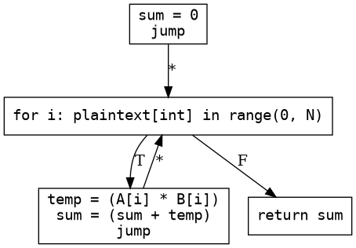
#### SSA

#### SSA ϕ→MUX
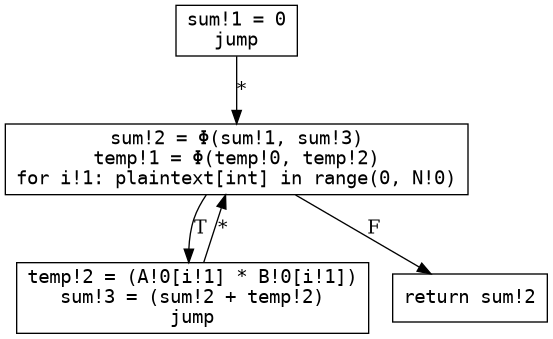
#### Dead code elimination
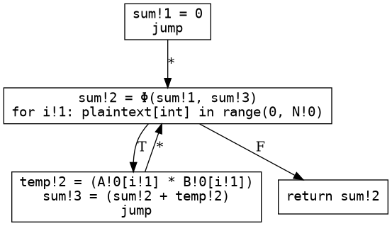
#### Linear code with loops
```python
def inner_product(A!0: shared[list[int; ?]], B!0: shared[list[int; ?]], N!0: plaintext[int]) -> shared[int]:
    sum!1 = 0
    for i!1 in range(0, N!0):
        sum!2 = Φ(sum!1, sum!3)
        temp!2 = (A!0[i!1] * B!0[i!1])
        sum!3 = (sum!2 + temp!2)
    return sum!2
```
#### Dependency graph
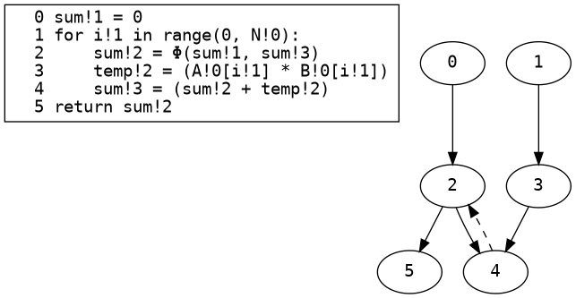
#### Removal of infeasible edges

#### Type Environment Before Vectorization
| Variable | Type |
| - | - |
| `A!0` | `shared[list[int; ?]]` |
| `B!0` | `shared[list[int; ?]]` |
| `N!0` | `plaintext[int]` |
| `i!1` | `plaintext[int]` |
| `sum!3` | `shared[int]` |
| `sum!2` | `shared[int]` |
| `temp!2` | `shared[int]` |
| `sum!1` | `plaintext[int]` |
#### Basic Vectorization Phase 1
```python
def inner_product(A!0: shared[list[int; ?]], B!0: shared[list[int; ?]], N!0: plaintext[int]) -> shared[int]:
    sum!1 = 0
    !1!0{N!0}[] = lift(sum!1, (i!1:N!0))
    !2!0{N!0}[] = lift(A!0[i!1], (i!1:N!0))
    !3!0{N!0}[] = lift(B!0[i!1], (i!1:N!0))
    for i!1 in range(0, N!0):
        sum!2{N!0}[] = Φ(!1!0{N!0}[], sum!3{N!0}[])
        temp!2{N!0}[] = (!2!0{N!0}[] * !3!0{N!0}[])
        sum!3{N!0}[] = (sum!2{N!0}[] + temp!2{N!0}[])
    !4!0 = drop_dim(sum!3{N!0}[])
    return !4!0
```
#### Basic Vectorization Phase 1 (dependence graph)
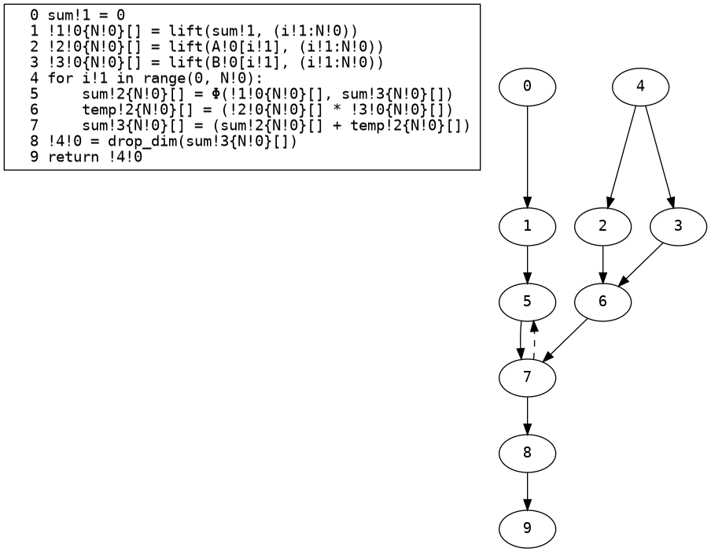
#### Basic Vectorization Phase 2
```python
def inner_product(A!0: shared[list[int; ?]], B!0: shared[list[int; ?]], N!0: plaintext[int]) -> shared[int]:
    sum!1 = 0
    !2!0{N!0}[] = lift(A!0[i!1], (i!1:N!0))
    !3!0{N!0}[] = lift(B!0[i!1], (i!1:N!0))
    !1!0{N!0}[] = lift(sum!1, (i!1:N!0))
    temp!2{N!0}[] = (!2!0{N!0}[] * !3!0{N!0}[])
    for !5!0 in range(0, N!0): (monolithic)
        sum!2{}[!5!0] = Φ(!1!0{}[!5!0], sum!3{}[(!5!0 - 1)])
        sum!3{}[!5!0] = (sum!2{}[!5!0] + temp!2{}[!5!0])
    !4!0 = drop_dim(sum!3{N!0}[])
    return !4!0
```
#### Basic Vectorization Phase 2 (dependence graph)
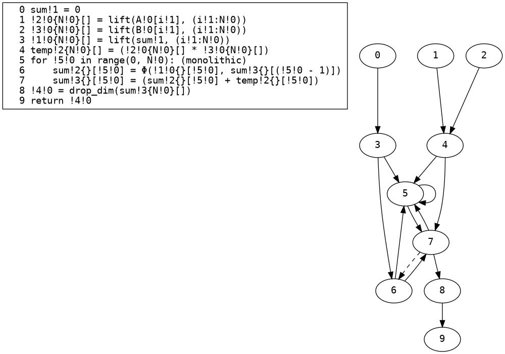
#### Type Environment After Vectorization
| Variable | Type |
| - | - |
| `A!0` | `shared[list[int; ?]]` |
| `B!0` | `shared[list[int; ?]]` |
| `N!0` | `plaintext[int]` |
| `!5!0` | `plaintext[int]` |
| `!4!0` | `shared[int]` |
| `sum!3` | `shared[list[int; (N!0)]]` |
| `sum!2` | `shared[list[int; (N!0)]]` |
| `temp!2` | `shared[list[int; (N!0)]]` |
| `!1!0` | `shared[list[int; (N!0)]]` |
| `!3!0` | `shared[list[int; (N!0)]]` |
| `!2!0` | `shared[list[int; (N!0)]]` |
| `sum!1` | `plaintext[int]` |
#### Copy propagation
```python
def inner_product(A!0: shared[list[int; ?]], B!0: shared[list[int; ?]], N!0: plaintext[int]) -> shared[int]:
    sum!1 = 0
    !2!0{N!0}[] = lift(A!0[i!1], (i!1:N!0))
    !3!0{N!0}[] = lift(B!0[i!1], (i!1:N!0))
    !1!0{N!0}[] = lift(sum!1, (i!1:N!0))
    temp!2{N!0}[] = (!2!0{N!0}[] * !3!0{N!0}[])
    for !5!0 in range(0, N!0): (monolithic)
        sum!2{}[!5!0] = Φ(!1!0{}[!5!0], sum!3{}[(!5!0 - 1)])
        sum!3{}[!5!0] = (sum!2{}[!5!0] + temp!2{}[!5!0])
    !4!0 = drop_dim(sum!3{N!0}[])
    return !4!0
```
#### Common subexpression elimination
```python
def inner_product(A!0: shared[list[int; ?]], B!0: shared[list[int; ?]], N!0: plaintext[int]) -> shared[int]:
    sum!1 = 0
    !2!0{N!0}[] = lift(A!0[i!1], (i!1:N!0))
    !3!0{N!0}[] = lift(B!0[i!1], (i!1:N!0))
    !1!0{N!0}[] = lift(sum!1, (i!1:N!0))
    temp!2{N!0}[] = (!2!0{N!0}[] * !3!0{N!0}[])
    for !5!0 in range(0, N!0): (monolithic)
        sum!2{}[!5!0] = Φ(!1!0{}[!5!0], sum!3{}[(!5!0 - 1)])
        sum!3{}[!5!0] = (sum!2{}[!5!0] + temp!2{}[!5!0])
    !4!0 = drop_dim(sum!3{N!0}[])
    return !4!0
```
#### MOTION mixed configuration
```Total cost:	0.00779
Input vars:	{B!0: ['A'], A!0: ['A']}
Constants:	{0: ['A']}
Plaintext vars:	{}
Flags:		{}
sum!1 = 0: _ -> ['A'] for 0.00000 * 1 = 0.00
!2!0{N!0}[] = lift(A!0[i!1], (i!1:N!0)): _ -> ['A'] for 0.00000 * 1 = 0.00
!3!0{N!0}[] = lift(B!0[i!1], (i!1:N!0)): _ -> ['A'] for 0.00000 * 1 = 0.00
!1!0{N!0}[] = lift(sum!1, (i!1:N!0)): _ -> ['A'] for 0.00000 * 1 = 0.00
temp!2{N!0}[] = (!2!0{N!0}[] * !3!0{N!0}[]): A -> {} for 0.00779 * 1 = 0.01
	sum!2{}[!5!0] = Φ(!1!0{}[!5!0], sum!3{}[(!5!0 - 1)]): A -> {} for 0.00000 * 3 = 0.00
	sum!3{}[!5!0] = (sum!2{}[!5!0] + temp!2{}[!5!0]): A -> {} for 0.00000 * 3 = 0.00
!4!0 = drop_dim(sum!3{N!0}[]): _ -> ['A'] for 0.00000 * 1 = 0.00
return !4!0
Output vars:	{!4!0: ['A']}

```
#### MOTION code
```cpp
template <encrypto::motion::MpcProtocol Protocol>
encrypto::motion::SecureUnsignedInteger inner_product(
    encrypto::motion::PartyPointer &party,
    std::vector<encrypto::motion::SecureUnsignedInteger> A_0,
    std::vector<encrypto::motion::SecureUnsignedInteger> B_0,
    std::uint32_t _MPC_PLAINTEXT_N_0
) {
    // Shared variable declarations
    std::vector<encrypto::motion::SecureUnsignedInteger> _1_0((_MPC_PLAINTEXT_N_0));
    std::vector<encrypto::motion::SecureUnsignedInteger> _2_0((_MPC_PLAINTEXT_N_0));
    std::vector<encrypto::motion::SecureUnsignedInteger> _3_0((_MPC_PLAINTEXT_N_0));
    encrypto::motion::SecureUnsignedInteger _4_0;
    encrypto::motion::SecureUnsignedInteger _5_0;
    encrypto::motion::SecureUnsignedInteger N_0;
    encrypto::motion::SecureUnsignedInteger sum_1;
    std::vector<encrypto::motion::SecureUnsignedInteger> sum_2((_MPC_PLAINTEXT_N_0));
    std::vector<encrypto::motion::SecureUnsignedInteger> sum_3((_MPC_PLAINTEXT_N_0));
    std::vector<encrypto::motion::SecureUnsignedInteger> temp_2((_MPC_PLAINTEXT_N_0));

    // Plaintext variable declarations
    std::uint32_t _MPC_PLAINTEXT__5_0;
    std::uint32_t _MPC_PLAINTEXT_sum_1;

    // Constant initializations
    encrypto::motion::SecureUnsignedInteger _MPC_CONSTANT_0 = party->In<Protocol>(encrypto::motion::ToInput(std::uint32_t(0)), 0);

    // Plaintext parameter assignments
    N_0 = party->In<Protocol>(encrypto::motion::ToInput(_MPC_PLAINTEXT_N_0), 0);

    // Function body
    sum_1 = _MPC_CONSTANT_0;
    _MPC_PLAINTEXT_sum_1 = std::uint32_t(0);
    vectorized_assign(_2_0, {_MPC_PLAINTEXT_N_0}, {true}, {}, lift(std::function([&](const std::vector<std::uint32_t> &indices){return A_0[indices[0]];}), {_MPC_PLAINTEXT_N_0}));
    vectorized_assign(_3_0, {_MPC_PLAINTEXT_N_0}, {true}, {}, lift(std::function([&](const std::vector<std::uint32_t> &indices){return B_0[indices[0]];}), {_MPC_PLAINTEXT_N_0}));
    vectorized_assign(_1_0, {_MPC_PLAINTEXT_N_0}, {true}, {}, lift(std::function([&](const std::vector<std::uint32_t> &indices){return sum_1;}), {_MPC_PLAINTEXT_N_0}));
    vectorized_assign(temp_2, {_MPC_PLAINTEXT_N_0}, {true}, {}, (vectorized_access(_2_0, {_MPC_PLAINTEXT_N_0}, {true}, {}) * vectorized_access(_3_0, {_MPC_PLAINTEXT_N_0}, {true}, {})));

    // Initialize loop counter
    _MPC_PLAINTEXT__5_0 = std::uint32_t(0);
    // Initialize phi values
    sum_2[_MPC_PLAINTEXT__5_0] = _1_0[_MPC_PLAINTEXT__5_0];
    for (; _MPC_PLAINTEXT__5_0 < _MPC_PLAINTEXT_N_0; _MPC_PLAINTEXT__5_0++) {
        // Update phi values
        if (_MPC_PLAINTEXT__5_0 != std::uint32_t(0)) {
            sum_2[_MPC_PLAINTEXT__5_0] = sum_3[(_MPC_PLAINTEXT__5_0 - std::uint32_t(1))];
        }

        sum_3[_MPC_PLAINTEXT__5_0] = (sum_2[_MPC_PLAINTEXT__5_0] + temp_2[_MPC_PLAINTEXT__5_0]);

    }

    _4_0 = drop_dim_monoreturn(vectorized_access(sum_3, {_MPC_PLAINTEXT_N_0}, {true}, {}).Unsimdify(), {_MPC_PLAINTEXT_N_0});
    return _4_0;

}
```
#### MOTION mixed code
```cpp
encrypto::motion::SecureUnsignedInteger inner_product(
    encrypto::motion::PartyPointer &party,
    std::vector<encrypto::motion::SecureUnsignedInteger> A_0,
    std::vector<encrypto::motion::SecureUnsignedInteger> B_0,
    std::uint32_t _MPC_PLAINTEXT_N_0
) {
    // Shared variable declarations
    std::vector<encrypto::motion::SecureUnsignedInteger> _1_0((_MPC_PLAINTEXT_N_0));
    std::vector<encrypto::motion::SecureUnsignedInteger> _2_0((_MPC_PLAINTEXT_N_0));
    std::vector<encrypto::motion::SecureUnsignedInteger> _3_0((_MPC_PLAINTEXT_N_0));
    encrypto::motion::SecureUnsignedInteger _4_0;
    encrypto::motion::SecureUnsignedInteger _5_0;
    encrypto::motion::SecureUnsignedInteger N_0;
    encrypto::motion::SecureUnsignedInteger sum_1;
    std::vector<encrypto::motion::SecureUnsignedInteger> sum_2((_MPC_PLAINTEXT_N_0));
    std::vector<encrypto::motion::SecureUnsignedInteger> sum_3((_MPC_PLAINTEXT_N_0));
    std::vector<encrypto::motion::SecureUnsignedInteger> temp_2((_MPC_PLAINTEXT_N_0));

    // Plaintext variable declarations
    std::uint32_t _MPC_PLAINTEXT__5_0;
    std::uint32_t _MPC_PLAINTEXT_sum_1;

    // Constant initializations
    encrypto::motion::SecureUnsignedInteger _MPC_CONSTANT_0 = party->In<encrypto::motion::MpcProtocol::kArithmeticGmw>(std::uint32_t(0), 0);

    // Input Protocol Convertions

    // Plaintext parameter assignments

    // Function body
    sum_1 = _MPC_CONSTANT_0;
    _MPC_PLAINTEXT_sum_1 = std::uint32_t(0);
    vectorized_assign(_2_0, {_MPC_PLAINTEXT_N_0}, {true}, {}, lift(std::function([&](const std::vector<std::uint32_t> &indices){return A_0[indices[0]];}), {_MPC_PLAINTEXT_N_0}));
    vectorized_assign(_3_0, {_MPC_PLAINTEXT_N_0}, {true}, {}, lift(std::function([&](const std::vector<std::uint32_t> &indices){return B_0[indices[0]];}), {_MPC_PLAINTEXT_N_0}));
    vectorized_assign(_1_0, {_MPC_PLAINTEXT_N_0}, {true}, {}, lift(std::function([&](const std::vector<std::uint32_t> &indices){return sum_1;}), {_MPC_PLAINTEXT_N_0}));
    vectorized_assign(temp_2, {_MPC_PLAINTEXT_N_0}, {true}, {}, (vectorized_access(_2_0, {_MPC_PLAINTEXT_N_0}, {true}, {}) * vectorized_access(_3_0, {_MPC_PLAINTEXT_N_0}, {true}, {})));

    // Initialize loop counter
    _MPC_PLAINTEXT__5_0 = std::uint32_t(0);
    // Initialize phi values
    sum_2[_MPC_PLAINTEXT__5_0] = _1_0[_MPC_PLAINTEXT__5_0];
    for (; _MPC_PLAINTEXT__5_0 < _MPC_PLAINTEXT_N_0; _MPC_PLAINTEXT__5_0++) {
        // Update phi values
        if (_MPC_PLAINTEXT__5_0 != std::uint32_t(0)) {
            sum_2[_MPC_PLAINTEXT__5_0] = sum_3[(_MPC_PLAINTEXT__5_0 - std::uint32_t(1))];
        }

        sum_3[_MPC_PLAINTEXT__5_0] = (sum_2[_MPC_PLAINTEXT__5_0] + temp_2[_MPC_PLAINTEXT__5_0]);

    }

    _4_0 = drop_dim_monoreturn(vectorized_access(sum_3, {_MPC_PLAINTEXT_N_0}, {true}, {}).Unsimdify(), {_MPC_PLAINTEXT_N_0});
    return _4_0;

}
```
#### MP-SPDZ mixed configuration
```Total cost:	0.00012
Input vars:	{B!0: ['A'], A!0: ['A']}
Constants:	{0: ['A']}
Plaintext vars:	{}
Flags:		{X}
sum!1 = 0: _ -> ['A'] for 0.00000 * 1 = 0.00
!2!0{N!0}[] = lift(A!0[i!1], (i!1:N!0)): _ -> ['A'] for 0.00000 * 1 = 0.00
!3!0{N!0}[] = lift(B!0[i!1], (i!1:N!0)): _ -> ['A'] for 0.00000 * 1 = 0.00
!1!0{N!0}[] = lift(sum!1, (i!1:N!0)): _ -> ['A'] for 0.00000 * 1 = 0.00
temp!2{N!0}[] = (!2!0{N!0}[] * !3!0{N!0}[]): A -> {} for 0.00012 * 1 = 0.00
	sum!2{}[!5!0] = Φ(!1!0{}[!5!0], sum!3{}[(!5!0 - 1)]): A -> {} for 0.00000 * 3 = 0.00
	sum!3{}[!5!0] = (sum!2{}[!5!0] + temp!2{}[!5!0]): A -> {} for 0.00000 * 3 = 0.00
!4!0 = drop_dim(sum!3{N!0}[]): _ -> ['A'] for 0.00000 * 1 = 0.00
return !4!0
Output vars:	{!4!0: ['A']}

```
#### MP-SPDZ code
```py
def inner_product(A_0, B_0, N_0):
    # Shared array declarations
    _1_0 = [None] * (N_0)
    _2_0 = [None] * (N_0)
    _3_0 = [None] * (N_0)
    sum_2 = [None] * (N_0)
    sum_3 = [None] * (N_0)
    temp_2 = [None] * (N_0)
    # Function body
    sum_1 = sint(0)
    _2_0 = _v.lift(lambda indices: (A_0[indices[0]]), [N_0])
    _3_0 = _v.lift(lambda indices: (B_0[indices[0]]), [N_0])
    _1_0 = _v.lift(lambda indices: sum_1, [N_0])
    _v.vectorized_assign(temp_2, [N_0], [None], (_v.vectorized_access_simd(_2_0, [N_0], [None]) * _v.vectorized_access_simd(_3_0, [N_0], [None])))
    for _5_0 in range(0, N_0):
        # Set ϕ value
        if _5_0 == 0:
            _v.vectorized_assign(sum_2, [N_0], [_5_0], _v.vectorized_access(_1_0, [N_0], [_5_0]))
        else:
            _v.vectorized_assign(sum_2, [N_0], [_5_0], _v.vectorized_access(sum_3, [N_0], [(_5_0 - 1)]))
        _v.vectorized_assign(sum_3, [N_0], [_5_0], (_v.vectorized_access_simd(sum_2, [N_0], [_5_0]) + _v.vectorized_access_simd(temp_2, [N_0], [_5_0])))
    # Loop exit ϕ values
    _v.vectorized_assign(sum_2, [N_0], [_5_0], _v.vectorized_access(sum_3, [N_0], [(_5_0 - 1)]))
    _4_0 = _v.drop_dim(sum_3, [N_0])
    return _4_0
```
#### MP-SPDZ mixed code
```py
program.options.binary = 32
program.use_dabit = True
def inner_product(A_0, B_0, N_0):
    # Convertion functions
    siv32 = sbitintvec.get_type(32)
    sb32 = sbits.get_type(32)
    
    
    # Shared array declarations
    _1_0 = [None] * (N_0)
    _2_0 = [None] * (N_0)
    _3_0 = [None] * (N_0)
    sum_2 = [None] * (N_0)
    sum_3 = [None] * (N_0)
    temp_2 = [None] * (N_0)
    # Shared array convertion declarations
    
    # Function body
    sum_1 = sint(0)
    _2_0 = _v.lift(lambda indices: (A_0[indices[0]]), [N_0])
    _3_0 = _v.lift(lambda indices: (B_0[indices[0]]), [N_0])
    _1_0 = _v.lift(lambda indices: sum_1, [N_0])
    _v.vectorized_assign(temp_2, [N_0], [None], (_v.vectorized_access_simd(_2_0, [N_0], [None]) * _v.vectorized_access_simd(_3_0, [N_0], [None])))
    for _5_0 in range(0, N_0):
        # Set ϕ value
        if _5_0 == 0:
            _v.vectorized_assign(sum_2, [N_0], [_5_0], _v.vectorized_access(_1_0, [N_0], [_5_0]))
        else:
            _v.vectorized_assign(sum_2, [N_0], [_5_0], _v.vectorized_access(sum_3, [N_0], [(_5_0 - 1)]))
        _v.vectorized_assign(sum_3, [N_0], [_5_0], (_v.vectorized_access_simd(sum_2, [N_0], [_5_0]) + _v.vectorized_access_simd(temp_2, [N_0], [_5_0])))
    # Loop exit ϕ values
    _v.vectorized_assign(sum_2, [N_0], [_5_0], _v.vectorized_access(sum_3, [N_0], [(_5_0 - 1)]))
    _4_0 = _v.drop_dim(sum_3, [N_0])
    return _4_0
```
### `longest_102`
#### Input
```python
from UTIL import shared


def longest_102(Seq: shared[list[int]], N: int, Syms: shared[list[int]]) -> shared[int]:
    """
    Computes the length of the largest instance of regex a(b*)c in a provided sequence.
    Syms is a list of form [a, b, c].
    """
    s0 = False

    max_len = 0
    length = 0

    for i in range(0, N):
        s1 = s0 and (Seq[i] == Syms[2])
        s0 = (Seq[i] == Syms[1]) or (s0 and (Seq[i] == Syms[0]))

        if s1 or s0:
            length = length + 1
        else:
            length = 0

        if s1 and max_len < length:
            max_len = length

    return max_len


Seq = [1, 0, 2, 1, 0, 0, 2, 1, 2, 2]
N = 10
Syms = [1, 0, 2]
print(longest_102(Seq, N, Syms))

```
#### Restricted AST
```python
def longest_102(Seq: shared[list[int; ?]], N: plaintext[int], Syms: shared[list[int; ?]]) -> shared[int]:
    s0 = False
    max_len = 0
    length = 0
    for i: plaintext[int] in range(0, N):
        s1 = (s0 and (Seq[i] == Syms[2]))
        s0 = ((Seq[i] == Syms[1]) or (s0 and (Seq[i] == Syms[0])))
        if (s1 or s0):
            length = (length + 1)
        else:
            length = 0
        if (s1 and (max_len < length)):
            max_len = length
    return max_len
```
#### Three-address code CFG
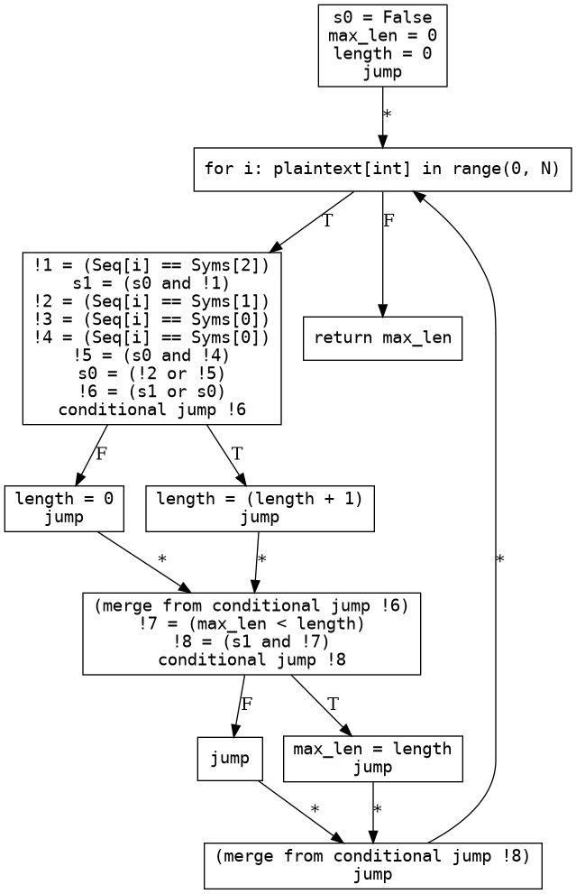
#### SSA
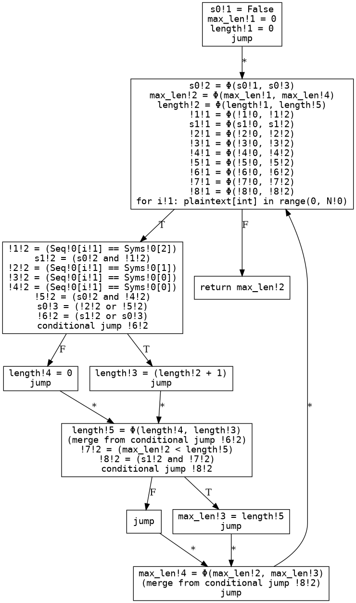
#### SSA ϕ→MUX
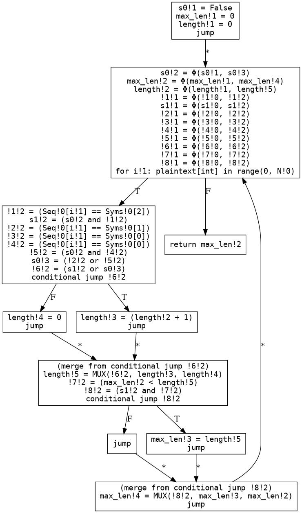
#### Dead code elimination
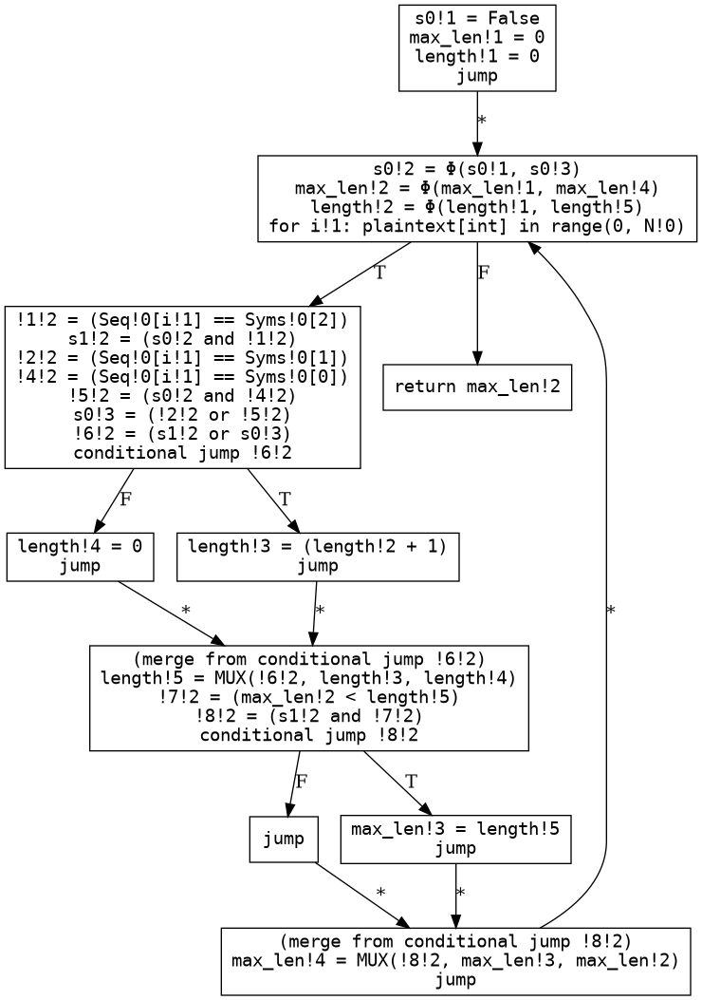
#### Linear code with loops
```python
def longest_102(Seq!0: shared[list[int; ?]], N!0: plaintext[int], Syms!0: shared[list[int; ?]]) -> shared[int]:
    s0!1 = False
    max_len!1 = 0
    length!1 = 0
    for i!1 in range(0, N!0):
        s0!2 = Φ(s0!1, s0!3)
        max_len!2 = Φ(max_len!1, max_len!4)
        length!2 = Φ(length!1, length!5)
        !1!2 = (Seq!0[i!1] == Syms!0[2])
        s1!2 = (s0!2 and !1!2)
        !2!2 = (Seq!0[i!1] == Syms!0[1])
        !4!2 = (Seq!0[i!1] == Syms!0[0])
        !5!2 = (s0!2 and !4!2)
        s0!3 = (!2!2 or !5!2)
        !6!2 = (s1!2 or s0!3)
        length!4 = 0
        length!3 = (length!2 + 1)
        length!5 = MUX(!6!2, length!3, length!4)
        !7!2 = (max_len!2 < length!5)
        !8!2 = (s1!2 and !7!2)
        max_len!3 = length!5
        max_len!4 = MUX(!8!2, max_len!3, max_len!2)
    return max_len!2
```
#### Dependency graph

#### Removal of infeasible edges
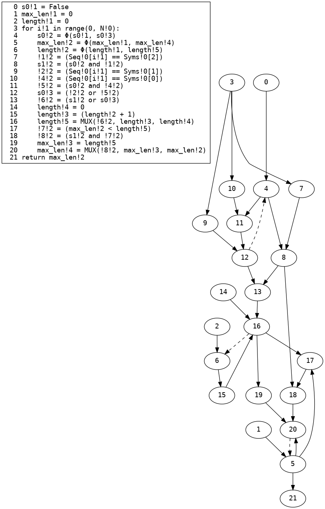
#### Type Environment Before Vectorization
| Variable | Type |
| - | - |
| `Seq!0` | `shared[list[int; ?]]` |
| `N!0` | `plaintext[int]` |
| `Syms!0` | `shared[list[int; ?]]` |
| `i!1` | `plaintext[int]` |
| `max_len!4` | `shared[int]` |
| `max_len!2` | `shared[int]` |
| `!7!2` | `shared[bool]` |
| `!8!2` | `shared[bool]` |
| `max_len!3` | `shared[int]` |
| `length!5` | `shared[int]` |
| `length!2` | `shared[int]` |
| `length!3` | `shared[int]` |
| `length!4` | `plaintext[int]` |
| `!6!2` | `shared[bool]` |
| `s0!3` | `shared[bool]` |
| `s0!2` | `shared[bool]` |
| `!5!2` | `shared[bool]` |
| `s1!2` | `shared[bool]` |
| `!4!2` | `shared[bool]` |
| `!2!2` | `shared[bool]` |
| `!1!2` | `shared[bool]` |
| `length!1` | `plaintext[int]` |
| `max_len!1` | `plaintext[int]` |
| `s0!1` | `plaintext[bool]` |
#### Basic Vectorization Phase 1
```python
def longest_102(Seq!0: shared[list[int; ?]], N!0: plaintext[int], Syms!0: shared[list[int; ?]]) -> shared[int]:
    s0!1 = False
    max_len!1 = 0
    length!1 = 0
    !9!0{N!0}[] = lift(s0!1, (i!1:N!0))
    !10!0{N!0}[] = lift(max_len!1, (i!1:N!0))
    !11!0{N!0}[] = lift(length!1, (i!1:N!0))
    !12!0{N!0}[] = lift(Seq!0[i!1], (i!1:N!0))
    !13!0{N!0}[] = lift(Syms!0[2], (i!1:N!0))
    !14!0{N!0}[] = lift(Seq!0[i!1], (i!1:N!0))
    !15!0{N!0}[] = lift(Syms!0[1], (i!1:N!0))
    !16!0{N!0}[] = lift(Seq!0[i!1], (i!1:N!0))
    !17!0{N!0}[] = lift(Syms!0[0], (i!1:N!0))
    for i!1 in range(0, N!0):
        s0!2{N!0}[] = Φ(!9!0{N!0}[], s0!3{N!0}[])
        max_len!2{N!0}[] = Φ(!10!0{N!0}[], max_len!4{N!0}[])
        length!2{N!0}[] = Φ(!11!0{N!0}[], length!5{N!0}[])
        !1!2{N!0}[] = (!12!0{N!0}[] == !13!0{N!0}[])
        s1!2{N!0}[] = (s0!2{N!0}[] and !1!2{N!0}[])
        !2!2{N!0}[] = (!14!0{N!0}[] == !15!0{N!0}[])
        !4!2{N!0}[] = (!16!0{N!0}[] == !17!0{N!0}[])
        !5!2{N!0}[] = (s0!2{N!0}[] and !4!2{N!0}[])
        s0!3{N!0}[] = (!2!2{N!0}[] or !5!2{N!0}[])
        !6!2{N!0}[] = (s1!2{N!0}[] or s0!3{N!0}[])
        length!4 = 0
        length!3{N!0}[] = (length!2{N!0}[] + 1)
        length!5{N!0}[] = MUX(!6!2{N!0}[], length!3{N!0}[], length!4)
        !7!2{N!0}[] = (max_len!2{N!0}[] < length!5{N!0}[])
        !8!2{N!0}[] = (s1!2{N!0}[] and !7!2{N!0}[])
        max_len!3{N!0}[] = length!5{N!0}[]
        max_len!4{N!0}[] = MUX(!8!2{N!0}[], max_len!3{N!0}[], max_len!2{N!0}[])
    !18!0 = drop_dim(max_len!4{N!0}[])
    return !18!0
```
#### Basic Vectorization Phase 1 (dependence graph)
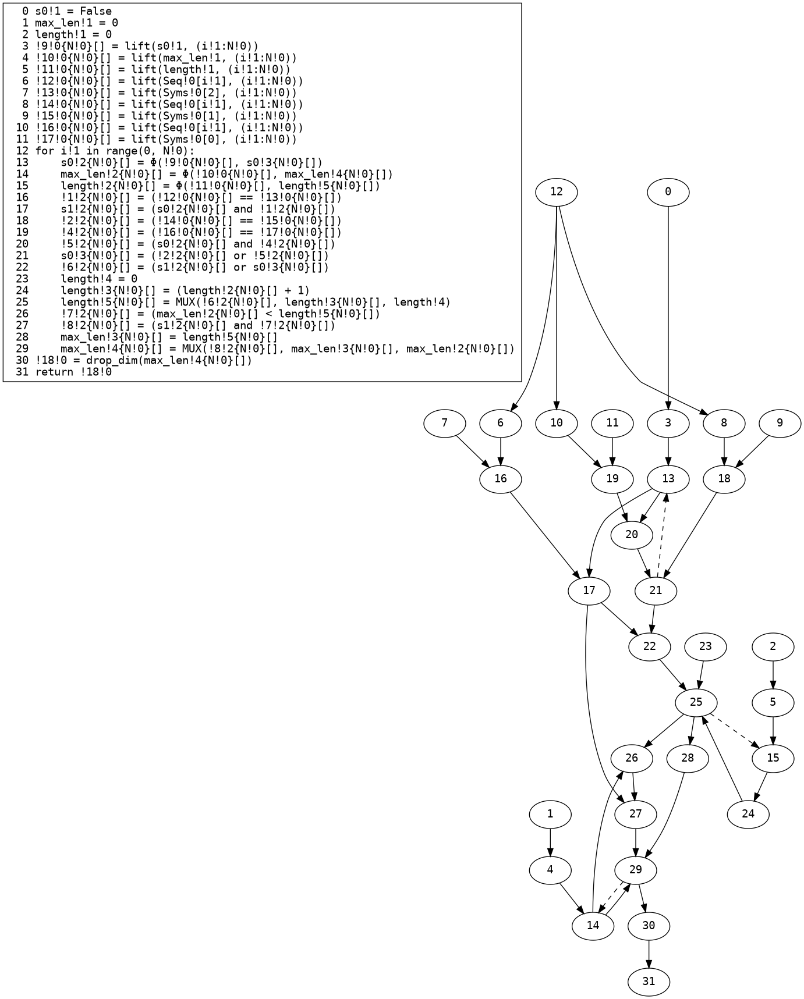
#### Basic Vectorization Phase 2
```python
def longest_102(Seq!0: shared[list[int; ?]], N!0: plaintext[int], Syms!0: shared[list[int; ?]]) -> shared[int]:
    s0!1 = False
    max_len!1 = 0
    length!1 = 0
    !12!0{N!0}[] = lift(Seq!0[i!1], (i!1:N!0))
    !13!0{N!0}[] = lift(Syms!0[2], (i!1:N!0))
    !14!0{N!0}[] = lift(Seq!0[i!1], (i!1:N!0))
    !15!0{N!0}[] = lift(Syms!0[1], (i!1:N!0))
    !16!0{N!0}[] = lift(Seq!0[i!1], (i!1:N!0))
    !17!0{N!0}[] = lift(Syms!0[0], (i!1:N!0))
    length!4 = 0
    !9!0{N!0}[] = lift(s0!1, (i!1:N!0))
    !10!0{N!0}[] = lift(max_len!1, (i!1:N!0))
    !11!0{N!0}[] = lift(length!1, (i!1:N!0))
    !1!2{N!0}[] = (!12!0{N!0}[] == !13!0{N!0}[])
    !2!2{N!0}[] = (!14!0{N!0}[] == !15!0{N!0}[])
    !4!2{N!0}[] = (!16!0{N!0}[] == !17!0{N!0}[])
    for !19!0 in range(0, N!0): (monolithic)
        s0!2{}[!19!0] = Φ(!9!0{}[!19!0], s0!3{}[(!19!0 - 1)])
        !5!2{}[!19!0] = (s0!2{}[!19!0] and !4!2{}[!19!0])
        s0!3{}[!19!0] = (!2!2{}[!19!0] or !5!2{}[!19!0])
    s1!2{N!0}[] = (s0!2{N!0}[] and !1!2{N!0}[])
    !6!2{N!0}[] = (s1!2{N!0}[] or s0!3{N!0}[])
    for !20!0 in range(0, N!0): (monolithic)
        length!2{}[!20!0] = Φ(!11!0{}[!20!0], length!5{}[(!20!0 - 1)])
        length!3{}[!20!0] = (length!2{}[!20!0] + 1)
        length!5{}[!20!0] = MUX(!6!2{}[!20!0], length!3{}[!20!0], length!4)
    max_len!3{N!0}[] = length!5{N!0}[]
    for !21!0 in range(0, N!0): (monolithic)
        max_len!2{}[!21!0] = Φ(!10!0{}[!21!0], max_len!4{}[(!21!0 - 1)])
        !7!2{}[!21!0] = (max_len!2{}[!21!0] < length!5{}[!21!0])
        !8!2{}[!21!0] = (s1!2{}[!21!0] and !7!2{}[!21!0])
        max_len!4{}[!21!0] = MUX(!8!2{}[!21!0], max_len!3{}[!21!0], max_len!2{}[!21!0])
    !18!0 = drop_dim(max_len!4{N!0}[])
    return !18!0
```
#### Basic Vectorization Phase 2 (dependence graph)
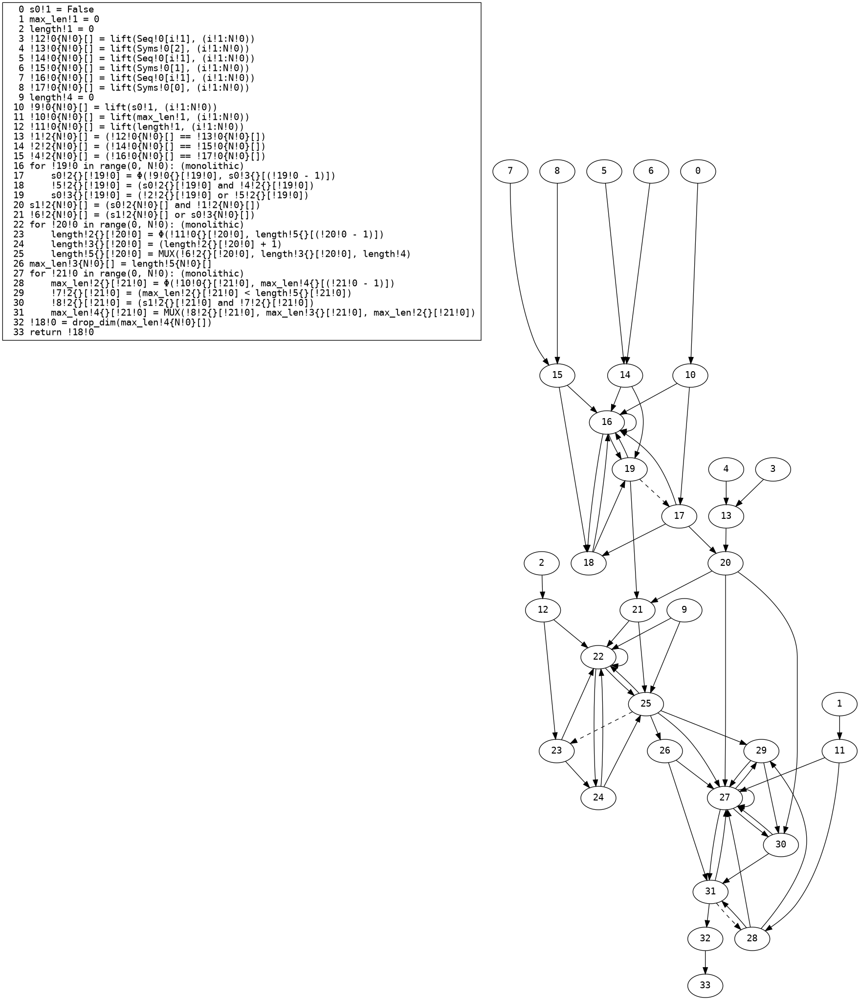
#### Type Environment After Vectorization
| Variable | Type |
| - | - |
| `Seq!0` | `shared[list[int; ?]]` |
| `N!0` | `plaintext[int]` |
| `Syms!0` | `shared[list[int; ?]]` |
| `!19!0` | `plaintext[int]` |
| `!20!0` | `plaintext[int]` |
| `!21!0` | `plaintext[int]` |
| `!18!0` | `shared[int]` |
| `max_len!4` | `shared[list[int; (N!0)]]` |
| `max_len!2` | `shared[list[int; (N!0)]]` |
| `!7!2` | `shared[list[bool; (N!0)]]` |
| `!8!2` | `shared[list[bool; (N!0)]]` |
| `max_len!3` | `shared[list[int; (N!0)]]` |
| `length!5` | `shared[list[int; (N!0)]]` |
| `length!2` | `shared[list[int; (N!0)]]` |
| `length!3` | `shared[list[int; (N!0)]]` |
| `!6!2` | `shared[list[bool; (N!0)]]` |
| `s1!2` | `shared[list[bool; (N!0)]]` |
| `s0!3` | `shared[list[bool; (N!0)]]` |
| `s0!2` | `shared[list[bool; (N!0)]]` |
| `!5!2` | `shared[list[bool; (N!0)]]` |
| `!4!2` | `shared[list[bool; (N!0)]]` |
| `!2!2` | `shared[list[bool; (N!0)]]` |
| `!1!2` | `shared[list[bool; (N!0)]]` |
| `!11!0` | `shared[list[int; (N!0)]]` |
| `!10!0` | `shared[list[int; (N!0)]]` |
| `!9!0` | `shared[list[bool; (N!0)]]` |
| `length!4` | `plaintext[int]` |
| `!17!0` | `shared[list[int; (N!0)]]` |
| `!16!0` | `shared[list[int; (N!0)]]` |
| `!15!0` | `shared[list[int; (N!0)]]` |
| `!14!0` | `shared[list[int; (N!0)]]` |
| `!13!0` | `shared[list[int; (N!0)]]` |
| `!12!0` | `shared[list[int; (N!0)]]` |
| `length!1` | `plaintext[int]` |
| `max_len!1` | `plaintext[int]` |
| `s0!1` | `plaintext[bool]` |
#### Copy propagation
```python
def longest_102(Seq!0: shared[list[int; ?]], N!0: plaintext[int], Syms!0: shared[list[int; ?]]) -> shared[int]:
    s0!1 = False
    max_len!1 = 0
    length!1 = 0
    !12!0{N!0}[] = lift(Seq!0[i!1], (i!1:N!0))
    !13!0{N!0}[] = lift(Syms!0[2], (i!1:N!0))
    !14!0{N!0}[] = lift(Seq!0[i!1], (i!1:N!0))
    !15!0{N!0}[] = lift(Syms!0[1], (i!1:N!0))
    !16!0{N!0}[] = lift(Seq!0[i!1], (i!1:N!0))
    !17!0{N!0}[] = lift(Syms!0[0], (i!1:N!0))
    length!4 = 0
    !9!0{N!0}[] = lift(s0!1, (i!1:N!0))
    !10!0{N!0}[] = lift(max_len!1, (i!1:N!0))
    !11!0{N!0}[] = lift(length!1, (i!1:N!0))
    !1!2{N!0}[] = (!12!0{N!0}[] == !13!0{N!0}[])
    !2!2{N!0}[] = (!14!0{N!0}[] == !15!0{N!0}[])
    !4!2{N!0}[] = (!16!0{N!0}[] == !17!0{N!0}[])
    for !19!0 in range(0, N!0): (monolithic)
        s0!2{}[!19!0] = Φ(!9!0{}[!19!0], s0!3{}[(!19!0 - 1)])
        !5!2{}[!19!0] = (s0!2{}[!19!0] and !4!2{}[!19!0])
        s0!3{}[!19!0] = (!2!2{}[!19!0] or !5!2{}[!19!0])
    s1!2{N!0}[] = (s0!2{N!0}[] and !1!2{N!0}[])
    !6!2{N!0}[] = (s1!2{N!0}[] or s0!3{N!0}[])
    for !20!0 in range(0, N!0): (monolithic)
        length!2{}[!20!0] = Φ(!11!0{}[!20!0], length!5{}[(!20!0 - 1)])
        length!3{}[!20!0] = (length!2{}[!20!0] + 1)
        length!5{}[!20!0] = MUX(!6!2{}[!20!0], length!3{}[!20!0], length!4)
    for !21!0 in range(0, N!0): (monolithic)
        max_len!2{}[!21!0] = Φ(!10!0{}[!21!0], max_len!4{}[(!21!0 - 1)])
        !7!2{}[!21!0] = (max_len!2{}[!21!0] < length!5{}[!21!0])
        !8!2{}[!21!0] = (s1!2{}[!21!0] and !7!2{}[!21!0])
        max_len!4{}[!21!0] = MUX(!8!2{}[!21!0], length!5{}[!21!0], max_len!2{}[!21!0])
    !18!0 = drop_dim(max_len!4{N!0}[])
    return !18!0
```
#### Common subexpression elimination
```python
def longest_102(Seq!0: shared[list[int; ?]], N!0: plaintext[int], Syms!0: shared[list[int; ?]]) -> shared[int]:
    s0!1 = False
    max_len!1 = 0
    length!1 = 0
    !12!0{N!0}[] = lift(Seq!0[i!1], (i!1:N!0))
    !13!0{N!0}[] = lift(Syms!0[2], (i!1:N!0))
    !15!0{N!0}[] = lift(Syms!0[1], (i!1:N!0))
    !17!0{N!0}[] = lift(Syms!0[0], (i!1:N!0))
    length!4 = 0
    !9!0{N!0}[] = lift(s0!1, (i!1:N!0))
    !10!0{N!0}[] = lift(max_len!1, (i!1:N!0))
    !11!0{N!0}[] = lift(length!1, (i!1:N!0))
    !1!2{N!0}[] = (!12!0{N!0}[] == !13!0{N!0}[])
    !2!2{N!0}[] = (!12!0{N!0}[] == !15!0{N!0}[])
    !4!2{N!0}[] = (!12!0{N!0}[] == !17!0{N!0}[])
    for !19!0 in range(0, N!0): (monolithic)
        s0!2{}[!19!0] = Φ(!9!0{}[!19!0], s0!3{}[(!19!0 - 1)])
        !5!2{}[!19!0] = (s0!2{}[!19!0] and !4!2{}[!19!0])
        s0!3{}[!19!0] = (!2!2{}[!19!0] or !5!2{}[!19!0])
    s1!2{N!0}[] = (s0!2{N!0}[] and !1!2{N!0}[])
    !6!2{N!0}[] = (s1!2{N!0}[] or s0!3{N!0}[])
    for !20!0 in range(0, N!0): (monolithic)
        length!2{}[!20!0] = Φ(!11!0{}[!20!0], length!5{}[(!20!0 - 1)])
        length!3{}[!20!0] = (length!2{}[!20!0] + 1)
        length!5{}[!20!0] = MUX(!6!2{}[!20!0], length!3{}[!20!0], length!4)
    for !21!0 in range(0, N!0): (monolithic)
        max_len!2{}[!21!0] = Φ(!10!0{}[!21!0], max_len!4{}[(!21!0 - 1)])
        !7!2{}[!21!0] = (max_len!2{}[!21!0] < length!5{}[!21!0])
        !8!2{}[!21!0] = (s1!2{}[!21!0] and !7!2{}[!21!0])
        max_len!4{}[!21!0] = MUX(!8!2{}[!21!0], length!5{}[!21!0], max_len!2{}[!21!0])
    !18!0 = drop_dim(max_len!4{N!0}[])
    return !18!0
```
#### MOTION mixed configuration
```Total cost:	0.77912
Input vars:	{Syms!0: ['Y'], Seq!0: ['Y']}
Constants:	{False: ['Y'], 0: ['Y'], 1: ['Y']}
Plaintext vars:	{}
Flags:		{}
s0!1 = False: _ -> ['Y'] for 0.00000 * 1 = 0.00
max_len!1 = 0: _ -> ['Y'] for 0.00000 * 1 = 0.00
length!1 = 0: _ -> ['Y'] for 0.00000 * 1 = 0.00
!12!0{N!0}[] = lift(Seq!0[i!1], (i!1:N!0)): _ -> ['Y'] for 0.00000 * 1 = 0.00
!13!0{N!0}[] = lift(Syms!0[2], (i!1:N!0)): _ -> ['Y'] for 0.00000 * 1 = 0.00
!15!0{N!0}[] = lift(Syms!0[1], (i!1:N!0)): _ -> ['Y'] for 0.00000 * 1 = 0.00
!17!0{N!0}[] = lift(Syms!0[0], (i!1:N!0)): _ -> ['Y'] for 0.00000 * 1 = 0.00
length!4 = 0: _ -> ['Y'] for 0.00000 * 1 = 0.00
!9!0{N!0}[] = lift(s0!1, (i!1:N!0)): _ -> ['Y'] for 0.00000 * 1 = 0.00
!10!0{N!0}[] = lift(max_len!1, (i!1:N!0)): _ -> ['Y'] for 0.00000 * 1 = 0.00
!11!0{N!0}[] = lift(length!1, (i!1:N!0)): _ -> ['Y'] for 0.00000 * 1 = 0.00
!1!2{N!0}[] = (!12!0{N!0}[] == !13!0{N!0}[]): Y -> {} for 0.01475 * 1 = 0.01
!2!2{N!0}[] = (!12!0{N!0}[] == !15!0{N!0}[]): Y -> {} for 0.01475 * 1 = 0.01
!4!2{N!0}[] = (!12!0{N!0}[] == !17!0{N!0}[]): Y -> {} for 0.01475 * 1 = 0.01
	s0!2{}[!19!0] = Φ(!9!0{}[!19!0], s0!3{}[(!19!0 - 1)]): Y -> {} for 0.00000 * 10 = 0.00
	!5!2{}[!19!0] = (s0!2{}[!19!0] and !4!2{}[!19!0]): Y -> {} for 0.00245 * 10 = 0.02
	s0!3{}[!19!0] = (!2!2{}[!19!0] or !5!2{}[!19!0]): Y -> {} for 0.00282 * 10 = 0.03
s1!2{N!0}[] = (s0!2{N!0}[] and !1!2{N!0}[]): Y -> {} for 0.00269 * 1 = 0.00
!6!2{N!0}[] = (s1!2{N!0}[] or s0!3{N!0}[]): Y -> {} for 0.00251 * 1 = 0.00
	length!2{}[!20!0] = Φ(!11!0{}[!20!0], length!5{}[(!20!0 - 1)]): Y -> {} for 0.00000 * 10 = 0.00
	length!3{}[!20!0] = (length!2{}[!20!0] + 1): Y -> {} for 0.02351 * 10 = 0.24
	length!5{}[!20!0] = MUX(!6!2{}[!20!0], length!3{}[!20!0], length!4): Y -> {} for 0.00597 * 10 = 0.06
	max_len!2{}[!21!0] = Φ(!10!0{}[!21!0], max_len!4{}[(!21!0 - 1)]): Y -> {} for 0.00000 * 10 = 0.00
	!7!2{}[!21!0] = (max_len!2{}[!21!0] < length!5{}[!21!0]): Y -> {} for 0.02979 * 10 = 0.30
	!8!2{}[!21!0] = (s1!2{}[!21!0] and !7!2{}[!21!0]): Y -> {} for 0.00245 * 10 = 0.02
	max_len!4{}[!21!0] = MUX(!8!2{}[!21!0], length!5{}[!21!0], max_len!2{}[!21!0]): Y -> {} for 0.00597 * 10 = 0.06
!18!0 = drop_dim(max_len!4{N!0}[]): _ -> ['Y'] for 0.00000 * 1 = 0.00
return !18!0
Output vars:	{!18!0: ['Y']}

```
#### MOTION code
```cpp
template <encrypto::motion::MpcProtocol Protocol>
encrypto::motion::SecureUnsignedInteger longest_102(
    encrypto::motion::PartyPointer &party,
    std::vector<encrypto::motion::SecureUnsignedInteger> Seq_0,
    std::uint32_t _MPC_PLAINTEXT_N_0,
    std::vector<encrypto::motion::SecureUnsignedInteger> Syms_0
) {
    // Shared variable declarations
    std::vector<encrypto::motion::ShareWrapper> _1_2((_MPC_PLAINTEXT_N_0));
    std::vector<encrypto::motion::SecureUnsignedInteger> _10_0((_MPC_PLAINTEXT_N_0));
    std::vector<encrypto::motion::SecureUnsignedInteger> _11_0((_MPC_PLAINTEXT_N_0));
    std::vector<encrypto::motion::SecureUnsignedInteger> _12_0((_MPC_PLAINTEXT_N_0));
    std::vector<encrypto::motion::SecureUnsignedInteger> _13_0((_MPC_PLAINTEXT_N_0));
    std::vector<encrypto::motion::SecureUnsignedInteger> _15_0((_MPC_PLAINTEXT_N_0));
    std::vector<encrypto::motion::SecureUnsignedInteger> _17_0((_MPC_PLAINTEXT_N_0));
    encrypto::motion::SecureUnsignedInteger _18_0;
    encrypto::motion::SecureUnsignedInteger _19_0;
    std::vector<encrypto::motion::ShareWrapper> _2_2((_MPC_PLAINTEXT_N_0));
    encrypto::motion::SecureUnsignedInteger _20_0;
    encrypto::motion::SecureUnsignedInteger _21_0;
    std::vector<encrypto::motion::ShareWrapper> _4_2((_MPC_PLAINTEXT_N_0));
    std::vector<encrypto::motion::ShareWrapper> _5_2((_MPC_PLAINTEXT_N_0));
    std::vector<encrypto::motion::ShareWrapper> _6_2((_MPC_PLAINTEXT_N_0));
    std::vector<encrypto::motion::ShareWrapper> _7_2((_MPC_PLAINTEXT_N_0));
    std::vector<encrypto::motion::ShareWrapper> _8_2((_MPC_PLAINTEXT_N_0));
    std::vector<encrypto::motion::ShareWrapper> _9_0((_MPC_PLAINTEXT_N_0));
    encrypto::motion::SecureUnsignedInteger N_0;
    encrypto::motion::SecureUnsignedInteger length_1;
    std::vector<encrypto::motion::SecureUnsignedInteger> length_2((_MPC_PLAINTEXT_N_0));
    std::vector<encrypto::motion::SecureUnsignedInteger> length_3((_MPC_PLAINTEXT_N_0));
    encrypto::motion::SecureUnsignedInteger length_4;
    std::vector<encrypto::motion::SecureUnsignedInteger> length_5((_MPC_PLAINTEXT_N_0));
    encrypto::motion::SecureUnsignedInteger max_len_1;
    std::vector<encrypto::motion::SecureUnsignedInteger> max_len_2((_MPC_PLAINTEXT_N_0));
    std::vector<encrypto::motion::SecureUnsignedInteger> max_len_4((_MPC_PLAINTEXT_N_0));
    encrypto::motion::ShareWrapper s0_1;
    std::vector<encrypto::motion::ShareWrapper> s0_2((_MPC_PLAINTEXT_N_0));
    std::vector<encrypto::motion::ShareWrapper> s0_3((_MPC_PLAINTEXT_N_0));
    std::vector<encrypto::motion::ShareWrapper> s1_2((_MPC_PLAINTEXT_N_0));

    // Plaintext variable declarations
    std::uint32_t _MPC_PLAINTEXT__19_0;
    std::uint32_t _MPC_PLAINTEXT__20_0;
    std::uint32_t _MPC_PLAINTEXT__21_0;
    std::uint32_t _MPC_PLAINTEXT_length_1;
    std::uint32_t _MPC_PLAINTEXT_length_4;
    std::uint32_t _MPC_PLAINTEXT_max_len_1;
    bool _MPC_PLAINTEXT_s0_1;

    // Constant initializations
    encrypto::motion::SecureUnsignedInteger _MPC_CONSTANT_0 = party->In<Protocol>(encrypto::motion::ToInput(std::uint32_t(0)), 0);
    encrypto::motion::SecureUnsignedInteger _MPC_CONSTANT_1 = party->In<Protocol>(encrypto::motion::ToInput(std::uint32_t(1)), 0);
    encrypto::motion::ShareWrapper _MPC_CONSTANT_false = party->In<Protocol>(encrypto::motion::BitVector(1, false), 0);

    // Plaintext parameter assignments
    N_0 = party->In<Protocol>(encrypto::motion::ToInput(_MPC_PLAINTEXT_N_0), 0);

    // Function body
    s0_1 = _MPC_CONSTANT_false;
    _MPC_PLAINTEXT_s0_1 = false;
    max_len_1 = _MPC_CONSTANT_0;
    _MPC_PLAINTEXT_max_len_1 = std::uint32_t(0);
    length_1 = _MPC_CONSTANT_0;
    _MPC_PLAINTEXT_length_1 = std::uint32_t(0);
    vectorized_assign(_12_0, {_MPC_PLAINTEXT_N_0}, {true}, {}, lift(std::function([&](const std::vector<std::uint32_t> &indices){return Seq_0[indices[0]];}), {_MPC_PLAINTEXT_N_0}));
    vectorized_assign(_13_0, {_MPC_PLAINTEXT_N_0}, {true}, {}, lift(std::function([&](const std::vector<std::uint32_t> &indices){return Syms_0[std::uint32_t(2)];}), {_MPC_PLAINTEXT_N_0}));
    vectorized_assign(_15_0, {_MPC_PLAINTEXT_N_0}, {true}, {}, lift(std::function([&](const std::vector<std::uint32_t> &indices){return Syms_0[std::uint32_t(1)];}), {_MPC_PLAINTEXT_N_0}));
    vectorized_assign(_17_0, {_MPC_PLAINTEXT_N_0}, {true}, {}, lift(std::function([&](const std::vector<std::uint32_t> &indices){return Syms_0[std::uint32_t(0)];}), {_MPC_PLAINTEXT_N_0}));
    length_4 = _MPC_CONSTANT_0;
    _MPC_PLAINTEXT_length_4 = std::uint32_t(0);
    vectorized_assign(_9_0, {_MPC_PLAINTEXT_N_0}, {true}, {}, lift(std::function([&](const std::vector<std::uint32_t> &indices){return s0_1;}), {_MPC_PLAINTEXT_N_0}));
    vectorized_assign(_10_0, {_MPC_PLAINTEXT_N_0}, {true}, {}, lift(std::function([&](const std::vector<std::uint32_t> &indices){return max_len_1;}), {_MPC_PLAINTEXT_N_0}));
    vectorized_assign(_11_0, {_MPC_PLAINTEXT_N_0}, {true}, {}, lift(std::function([&](const std::vector<std::uint32_t> &indices){return length_1;}), {_MPC_PLAINTEXT_N_0}));
    vectorized_assign(_1_2, {_MPC_PLAINTEXT_N_0}, {true}, {}, (to_share_wrapper(vectorized_access(_12_0, {_MPC_PLAINTEXT_N_0}, {true}, {})) == to_share_wrapper(vectorized_access(_13_0, {_MPC_PLAINTEXT_N_0}, {true}, {}))));
    vectorized_assign(_2_2, {_MPC_PLAINTEXT_N_0}, {true}, {}, (to_share_wrapper(vectorized_access(_12_0, {_MPC_PLAINTEXT_N_0}, {true}, {})) == to_share_wrapper(vectorized_access(_15_0, {_MPC_PLAINTEXT_N_0}, {true}, {}))));
    vectorized_assign(_4_2, {_MPC_PLAINTEXT_N_0}, {true}, {}, (to_share_wrapper(vectorized_access(_12_0, {_MPC_PLAINTEXT_N_0}, {true}, {})) == to_share_wrapper(vectorized_access(_17_0, {_MPC_PLAINTEXT_N_0}, {true}, {}))));

    // Initialize loop counter
    _MPC_PLAINTEXT__19_0 = std::uint32_t(0);
    // Initialize phi values
    s0_2[_MPC_PLAINTEXT__19_0] = _9_0[_MPC_PLAINTEXT__19_0];
    for (; _MPC_PLAINTEXT__19_0 < _MPC_PLAINTEXT_N_0; _MPC_PLAINTEXT__19_0++) {
        // Update phi values
        if (_MPC_PLAINTEXT__19_0 != std::uint32_t(0)) {
            s0_2[_MPC_PLAINTEXT__19_0] = s0_3[(_MPC_PLAINTEXT__19_0 - std::uint32_t(1))];
        }

        _5_2[_MPC_PLAINTEXT__19_0] = (to_share_wrapper(s0_2[_MPC_PLAINTEXT__19_0]) & to_share_wrapper(_4_2[_MPC_PLAINTEXT__19_0]));
        s0_3[_MPC_PLAINTEXT__19_0] = (to_share_wrapper(_2_2[_MPC_PLAINTEXT__19_0]) | to_share_wrapper(_5_2[_MPC_PLAINTEXT__19_0]));

    }

    vectorized_assign(s1_2, {_MPC_PLAINTEXT_N_0}, {true}, {}, (to_share_wrapper(vectorized_access(s0_2, {_MPC_PLAINTEXT_N_0}, {true}, {})) & to_share_wrapper(vectorized_access(_1_2, {_MPC_PLAINTEXT_N_0}, {true}, {}))));
    vectorized_assign(_6_2, {_MPC_PLAINTEXT_N_0}, {true}, {}, (to_share_wrapper(vectorized_access(s1_2, {_MPC_PLAINTEXT_N_0}, {true}, {})) | to_share_wrapper(vectorized_access(s0_3, {_MPC_PLAINTEXT_N_0}, {true}, {}))));

    // Initialize loop counter
    _MPC_PLAINTEXT__20_0 = std::uint32_t(0);
    // Initialize phi values
    length_2[_MPC_PLAINTEXT__20_0] = _11_0[_MPC_PLAINTEXT__20_0];
    for (; _MPC_PLAINTEXT__20_0 < _MPC_PLAINTEXT_N_0; _MPC_PLAINTEXT__20_0++) {
        // Update phi values
        if (_MPC_PLAINTEXT__20_0 != std::uint32_t(0)) {
            length_2[_MPC_PLAINTEXT__20_0] = length_5[(_MPC_PLAINTEXT__20_0 - std::uint32_t(1))];
        }

        length_3[_MPC_PLAINTEXT__20_0] = (length_2[_MPC_PLAINTEXT__20_0] + _MPC_CONSTANT_1);
        length_5[_MPC_PLAINTEXT__20_0] = _6_2[_MPC_PLAINTEXT__20_0].Mux(length_3[_MPC_PLAINTEXT__20_0].Get(), length_4.Get());

    }


    // Initialize loop counter
    _MPC_PLAINTEXT__21_0 = std::uint32_t(0);
    // Initialize phi values
    max_len_2[_MPC_PLAINTEXT__21_0] = _10_0[_MPC_PLAINTEXT__21_0];
    for (; _MPC_PLAINTEXT__21_0 < _MPC_PLAINTEXT_N_0; _MPC_PLAINTEXT__21_0++) {
        // Update phi values
        if (_MPC_PLAINTEXT__21_0 != std::uint32_t(0)) {
            max_len_2[_MPC_PLAINTEXT__21_0] = max_len_4[(_MPC_PLAINTEXT__21_0 - std::uint32_t(1))];
        }

        _7_2[_MPC_PLAINTEXT__21_0] = (length_5[_MPC_PLAINTEXT__21_0] > max_len_2[_MPC_PLAINTEXT__21_0]);
        _8_2[_MPC_PLAINTEXT__21_0] = (to_share_wrapper(s1_2[_MPC_PLAINTEXT__21_0]) & to_share_wrapper(_7_2[_MPC_PLAINTEXT__21_0]));
        max_len_4[_MPC_PLAINTEXT__21_0] = _8_2[_MPC_PLAINTEXT__21_0].Mux(length_5[_MPC_PLAINTEXT__21_0].Get(), max_len_2[_MPC_PLAINTEXT__21_0].Get());

    }

    _18_0 = drop_dim_monoreturn(vectorized_access(max_len_4, {_MPC_PLAINTEXT_N_0}, {true}, {}).Unsimdify(), {_MPC_PLAINTEXT_N_0});
    return _18_0;

}
```
#### MOTION mixed code
```cpp
encrypto::motion::SecureUnsignedInteger longest_102(
    encrypto::motion::PartyPointer &party,
    std::vector<encrypto::motion::SecureUnsignedInteger> Seq_0,
    std::uint32_t _MPC_PLAINTEXT_N_0,
    std::vector<encrypto::motion::SecureUnsignedInteger> Syms_0
) {
    // Shared variable declarations
    std::vector<encrypto::motion::ShareWrapper> _1_2((_MPC_PLAINTEXT_N_0));
    std::vector<encrypto::motion::SecureUnsignedInteger> _10_0((_MPC_PLAINTEXT_N_0));
    std::vector<encrypto::motion::SecureUnsignedInteger> _11_0((_MPC_PLAINTEXT_N_0));
    std::vector<encrypto::motion::SecureUnsignedInteger> _12_0((_MPC_PLAINTEXT_N_0));
    std::vector<encrypto::motion::SecureUnsignedInteger> _13_0((_MPC_PLAINTEXT_N_0));
    std::vector<encrypto::motion::SecureUnsignedInteger> _15_0((_MPC_PLAINTEXT_N_0));
    std::vector<encrypto::motion::SecureUnsignedInteger> _17_0((_MPC_PLAINTEXT_N_0));
    encrypto::motion::SecureUnsignedInteger _18_0;
    encrypto::motion::SecureUnsignedInteger _19_0;
    std::vector<encrypto::motion::ShareWrapper> _2_2((_MPC_PLAINTEXT_N_0));
    encrypto::motion::SecureUnsignedInteger _20_0;
    encrypto::motion::SecureUnsignedInteger _21_0;
    std::vector<encrypto::motion::ShareWrapper> _4_2((_MPC_PLAINTEXT_N_0));
    std::vector<encrypto::motion::ShareWrapper> _5_2((_MPC_PLAINTEXT_N_0));
    std::vector<encrypto::motion::ShareWrapper> _6_2((_MPC_PLAINTEXT_N_0));
    std::vector<encrypto::motion::ShareWrapper> _7_2((_MPC_PLAINTEXT_N_0));
    std::vector<encrypto::motion::ShareWrapper> _8_2((_MPC_PLAINTEXT_N_0));
    std::vector<encrypto::motion::ShareWrapper> _9_0((_MPC_PLAINTEXT_N_0));
    encrypto::motion::SecureUnsignedInteger N_0;
    encrypto::motion::SecureUnsignedInteger length_1;
    std::vector<encrypto::motion::SecureUnsignedInteger> length_2((_MPC_PLAINTEXT_N_0));
    std::vector<encrypto::motion::SecureUnsignedInteger> length_3((_MPC_PLAINTEXT_N_0));
    encrypto::motion::SecureUnsignedInteger length_4;
    std::vector<encrypto::motion::SecureUnsignedInteger> length_5((_MPC_PLAINTEXT_N_0));
    encrypto::motion::SecureUnsignedInteger max_len_1;
    std::vector<encrypto::motion::SecureUnsignedInteger> max_len_2((_MPC_PLAINTEXT_N_0));
    std::vector<encrypto::motion::SecureUnsignedInteger> max_len_4((_MPC_PLAINTEXT_N_0));
    encrypto::motion::ShareWrapper s0_1;
    std::vector<encrypto::motion::ShareWrapper> s0_2((_MPC_PLAINTEXT_N_0));
    std::vector<encrypto::motion::ShareWrapper> s0_3((_MPC_PLAINTEXT_N_0));
    std::vector<encrypto::motion::ShareWrapper> s1_2((_MPC_PLAINTEXT_N_0));

    // Plaintext variable declarations
    std::uint32_t _MPC_PLAINTEXT__19_0;
    std::uint32_t _MPC_PLAINTEXT__20_0;
    std::uint32_t _MPC_PLAINTEXT__21_0;
    std::uint32_t _MPC_PLAINTEXT_length_1;
    std::uint32_t _MPC_PLAINTEXT_length_4;
    std::uint32_t _MPC_PLAINTEXT_max_len_1;
    bool _MPC_PLAINTEXT_s0_1;

    // Constant initializations
    encrypto::motion::SecureUnsignedInteger _MPC_CONSTANT_0 = party->In<encrypto::motion::MpcProtocol::kBmr>(encrypto::motion::ToInput(std::uint32_t(0)), 0);
    encrypto::motion::SecureUnsignedInteger _MPC_CONSTANT_1 = party->In<encrypto::motion::MpcProtocol::kBmr>(encrypto::motion::ToInput(std::uint32_t(1)), 0);
    encrypto::motion::ShareWrapper _MPC_CONSTANT_false = party->In<encrypto::motion::MpcProtocol::kBmr>(encrypto::motion::BitVector(1, false), 0);

    // Input Protocol Convertions

    // Plaintext parameter assignments

    // Function body
    s0_1 = _MPC_CONSTANT_false;
    _MPC_PLAINTEXT_s0_1 = false;
    max_len_1 = _MPC_CONSTANT_0;
    _MPC_PLAINTEXT_max_len_1 = std::uint32_t(0);
    length_1 = _MPC_CONSTANT_0;
    _MPC_PLAINTEXT_length_1 = std::uint32_t(0);
    vectorized_assign(_12_0, {_MPC_PLAINTEXT_N_0}, {true}, {}, lift(std::function([&](const std::vector<std::uint32_t> &indices){return Seq_0[indices[0]];}), {_MPC_PLAINTEXT_N_0}));
    vectorized_assign(_13_0, {_MPC_PLAINTEXT_N_0}, {true}, {}, lift(std::function([&](const std::vector<std::uint32_t> &indices){return Syms_0[std::uint32_t(2)];}), {_MPC_PLAINTEXT_N_0}));
    vectorized_assign(_15_0, {_MPC_PLAINTEXT_N_0}, {true}, {}, lift(std::function([&](const std::vector<std::uint32_t> &indices){return Syms_0[std::uint32_t(1)];}), {_MPC_PLAINTEXT_N_0}));
    vectorized_assign(_17_0, {_MPC_PLAINTEXT_N_0}, {true}, {}, lift(std::function([&](const std::vector<std::uint32_t> &indices){return Syms_0[std::uint32_t(0)];}), {_MPC_PLAINTEXT_N_0}));
    length_4 = _MPC_CONSTANT_0;
    _MPC_PLAINTEXT_length_4 = std::uint32_t(0);
    vectorized_assign(_9_0, {_MPC_PLAINTEXT_N_0}, {true}, {}, lift(std::function([&](const std::vector<std::uint32_t> &indices){return s0_1;}), {_MPC_PLAINTEXT_N_0}));
    vectorized_assign(_10_0, {_MPC_PLAINTEXT_N_0}, {true}, {}, lift(std::function([&](const std::vector<std::uint32_t> &indices){return max_len_1;}), {_MPC_PLAINTEXT_N_0}));
    vectorized_assign(_11_0, {_MPC_PLAINTEXT_N_0}, {true}, {}, lift(std::function([&](const std::vector<std::uint32_t> &indices){return length_1;}), {_MPC_PLAINTEXT_N_0}));
    vectorized_assign(_1_2, {_MPC_PLAINTEXT_N_0}, {true}, {}, (to_share_wrapper(vectorized_access(_12_0, {_MPC_PLAINTEXT_N_0}, {true}, {})) == to_share_wrapper(vectorized_access(_13_0, {_MPC_PLAINTEXT_N_0}, {true}, {}))));
    vectorized_assign(_2_2, {_MPC_PLAINTEXT_N_0}, {true}, {}, (to_share_wrapper(vectorized_access(_12_0, {_MPC_PLAINTEXT_N_0}, {true}, {})) == to_share_wrapper(vectorized_access(_15_0, {_MPC_PLAINTEXT_N_0}, {true}, {}))));
    vectorized_assign(_4_2, {_MPC_PLAINTEXT_N_0}, {true}, {}, (to_share_wrapper(vectorized_access(_12_0, {_MPC_PLAINTEXT_N_0}, {true}, {})) == to_share_wrapper(vectorized_access(_17_0, {_MPC_PLAINTEXT_N_0}, {true}, {}))));

    // Initialize loop counter
    _MPC_PLAINTEXT__19_0 = std::uint32_t(0);
    // Initialize phi values
    s0_2[_MPC_PLAINTEXT__19_0] = _9_0[_MPC_PLAINTEXT__19_0];
    for (; _MPC_PLAINTEXT__19_0 < _MPC_PLAINTEXT_N_0; _MPC_PLAINTEXT__19_0++) {
        // Update phi values
        if (_MPC_PLAINTEXT__19_0 != std::uint32_t(0)) {
            s0_2[_MPC_PLAINTEXT__19_0] = s0_3[(_MPC_PLAINTEXT__19_0 - std::uint32_t(1))];
        }

        _5_2[_MPC_PLAINTEXT__19_0] = (to_share_wrapper(s0_2[_MPC_PLAINTEXT__19_0]) & to_share_wrapper(_4_2[_MPC_PLAINTEXT__19_0]));
        s0_3[_MPC_PLAINTEXT__19_0] = (to_share_wrapper(_2_2[_MPC_PLAINTEXT__19_0]) | to_share_wrapper(_5_2[_MPC_PLAINTEXT__19_0]));

    }

    vectorized_assign(s1_2, {_MPC_PLAINTEXT_N_0}, {true}, {}, (to_share_wrapper(vectorized_access(s0_2, {_MPC_PLAINTEXT_N_0}, {true}, {})) & to_share_wrapper(vectorized_access(_1_2, {_MPC_PLAINTEXT_N_0}, {true}, {}))));
    vectorized_assign(_6_2, {_MPC_PLAINTEXT_N_0}, {true}, {}, (to_share_wrapper(vectorized_access(s1_2, {_MPC_PLAINTEXT_N_0}, {true}, {})) | to_share_wrapper(vectorized_access(s0_3, {_MPC_PLAINTEXT_N_0}, {true}, {}))));

    // Initialize loop counter
    _MPC_PLAINTEXT__20_0 = std::uint32_t(0);
    // Initialize phi values
    length_2[_MPC_PLAINTEXT__20_0] = _11_0[_MPC_PLAINTEXT__20_0];
    for (; _MPC_PLAINTEXT__20_0 < _MPC_PLAINTEXT_N_0; _MPC_PLAINTEXT__20_0++) {
        // Update phi values
        if (_MPC_PLAINTEXT__20_0 != std::uint32_t(0)) {
            length_2[_MPC_PLAINTEXT__20_0] = length_5[(_MPC_PLAINTEXT__20_0 - std::uint32_t(1))];
        }

        length_3[_MPC_PLAINTEXT__20_0] = (length_2[_MPC_PLAINTEXT__20_0] + _MPC_CONSTANT_1);
        length_5[_MPC_PLAINTEXT__20_0] = _6_2[_MPC_PLAINTEXT__20_0].Mux(length_3[_MPC_PLAINTEXT__20_0].Get(), length_4.Get());

    }


    // Initialize loop counter
    _MPC_PLAINTEXT__21_0 = std::uint32_t(0);
    // Initialize phi values
    max_len_2[_MPC_PLAINTEXT__21_0] = _10_0[_MPC_PLAINTEXT__21_0];
    for (; _MPC_PLAINTEXT__21_0 < _MPC_PLAINTEXT_N_0; _MPC_PLAINTEXT__21_0++) {
        // Update phi values
        if (_MPC_PLAINTEXT__21_0 != std::uint32_t(0)) {
            max_len_2[_MPC_PLAINTEXT__21_0] = max_len_4[(_MPC_PLAINTEXT__21_0 - std::uint32_t(1))];
        }

        _7_2[_MPC_PLAINTEXT__21_0] = (length_5[_MPC_PLAINTEXT__21_0] > max_len_2[_MPC_PLAINTEXT__21_0]);
        _8_2[_MPC_PLAINTEXT__21_0] = (to_share_wrapper(s1_2[_MPC_PLAINTEXT__21_0]) & to_share_wrapper(_7_2[_MPC_PLAINTEXT__21_0]));
        max_len_4[_MPC_PLAINTEXT__21_0] = _8_2[_MPC_PLAINTEXT__21_0].Mux(length_5[_MPC_PLAINTEXT__21_0].Get(), max_len_2[_MPC_PLAINTEXT__21_0].Get());

    }

    _18_0 = drop_dim_monoreturn(vectorized_access(max_len_4, {_MPC_PLAINTEXT_N_0}, {true}, {}).Unsimdify(), {_MPC_PLAINTEXT_N_0});
    return _18_0;

}
```
#### MP-SPDZ mixed configuration
```Total cost:	0.00057
Input vars:	{Syms!0: ['B'], Seq!0: ['B']}
Constants:	{False: ['B'], 0: ['B'], 1: ['B']}
Plaintext vars:	{}
Flags:		{X}
s0!1 = False: _ -> ['B'] for 0.00000 * 1 = 0.00
max_len!1 = 0: _ -> ['B'] for 0.00000 * 1 = 0.00
length!1 = 0: _ -> ['B'] for 0.00000 * 1 = 0.00
!12!0{N!0}[] = lift(Seq!0[i!1], (i!1:N!0)): _ -> ['B'] for 0.00000 * 1 = 0.00
!13!0{N!0}[] = lift(Syms!0[2], (i!1:N!0)): _ -> ['B'] for 0.00000 * 1 = 0.00
!15!0{N!0}[] = lift(Syms!0[1], (i!1:N!0)): _ -> ['B'] for 0.00000 * 1 = 0.00
!17!0{N!0}[] = lift(Syms!0[0], (i!1:N!0)): _ -> ['B'] for 0.00000 * 1 = 0.00
length!4 = 0: _ -> ['B'] for 0.00000 * 1 = 0.00
!9!0{N!0}[] = lift(s0!1, (i!1:N!0)): _ -> ['B'] for 0.00000 * 1 = 0.00
!10!0{N!0}[] = lift(max_len!1, (i!1:N!0)): _ -> ['B'] for 0.00000 * 1 = 0.00
!11!0{N!0}[] = lift(length!1, (i!1:N!0)): _ -> ['B'] for 0.00000 * 1 = 0.00
!1!2{N!0}[] = (!12!0{N!0}[] == !13!0{N!0}[]): B -> {} for 0.00006 * 1 = 0.00
!2!2{N!0}[] = (!12!0{N!0}[] == !15!0{N!0}[]): B -> {} for 0.00006 * 1 = 0.00
!4!2{N!0}[] = (!12!0{N!0}[] == !17!0{N!0}[]): B -> {} for 0.00006 * 1 = 0.00
	s0!2{}[!19!0] = Φ(!9!0{}[!19!0], s0!3{}[(!19!0 - 1)]): B -> {} for 0.00000 * 10 = 0.00
	!5!2{}[!19!0] = (s0!2{}[!19!0] and !4!2{}[!19!0]): B -> {} for 0.00000 * 10 = 0.00
	s0!3{}[!19!0] = (!2!2{}[!19!0] or !5!2{}[!19!0]): B -> {} for 0.00000 * 10 = 0.00
s1!2{N!0}[] = (s0!2{N!0}[] and !1!2{N!0}[]): B -> {} for 0.00000 * 1 = 0.00
!6!2{N!0}[] = (s1!2{N!0}[] or s0!3{N!0}[]): B -> {} for 0.00001 * 1 = 0.00
	length!2{}[!20!0] = Φ(!11!0{}[!20!0], length!5{}[(!20!0 - 1)]): B -> {} for 0.00000 * 10 = 0.00
	length!3{}[!20!0] = (length!2{}[!20!0] + 1): B -> {} for 0.00001 * 10 = 0.00
	length!5{}[!20!0] = MUX(!6!2{}[!20!0], length!3{}[!20!0], length!4): B -> {} for 0.00000 * 10 = 0.00
	max_len!2{}[!21!0] = Φ(!10!0{}[!21!0], max_len!4{}[(!21!0 - 1)]): B -> {} for 0.00000 * 10 = 0.00
	!7!2{}[!21!0] = (max_len!2{}[!21!0] < length!5{}[!21!0]): B -> {} for 0.00003 * 10 = 0.00
	!8!2{}[!21!0] = (s1!2{}[!21!0] and !7!2{}[!21!0]): B -> {} for 0.00000 * 10 = 0.00
	max_len!4{}[!21!0] = MUX(!8!2{}[!21!0], length!5{}[!21!0], max_len!2{}[!21!0]): B -> {} for 0.00000 * 10 = 0.00
!18!0 = drop_dim(max_len!4{N!0}[]): _ -> ['B'] for 0.00000 * 1 = 0.00
return !18!0
Output vars:	{!18!0: ['B']}

```
#### MP-SPDZ code
```py
def longest_102(Seq_0, N_0, Syms_0):
    # Shared array declarations
    _1_2 = [None] * (N_0)
    _10_0 = [None] * (N_0)
    _11_0 = [None] * (N_0)
    _12_0 = [None] * (N_0)
    _13_0 = [None] * (N_0)
    _15_0 = [None] * (N_0)
    _17_0 = [None] * (N_0)
    _2_2 = [None] * (N_0)
    _4_2 = [None] * (N_0)
    _5_2 = [None] * (N_0)
    _6_2 = [None] * (N_0)
    _7_2 = [None] * (N_0)
    _8_2 = [None] * (N_0)
    _9_0 = [None] * (N_0)
    length_2 = [None] * (N_0)
    length_3 = [None] * (N_0)
    length_5 = [None] * (N_0)
    max_len_2 = [None] * (N_0)
    max_len_4 = [None] * (N_0)
    s0_2 = [None] * (N_0)
    s0_3 = [None] * (N_0)
    s1_2 = [None] * (N_0)
    # Function body
    s0_1 = _v.sbool(False)
    max_len_1 = sint(0)
    length_1 = sint(0)
    _12_0 = _v.lift(lambda indices: (Seq_0[indices[0]]), [N_0])
    _13_0 = _v.lift(lambda indices: (Syms_0[2]), [N_0])
    _15_0 = _v.lift(lambda indices: (Syms_0[1]), [N_0])
    _17_0 = _v.lift(lambda indices: (Syms_0[0]), [N_0])
    length_4 = sint(0)
    _9_0 = _v.lift(lambda indices: s0_1, [N_0])
    _10_0 = _v.lift(lambda indices: max_len_1, [N_0])
    _11_0 = _v.lift(lambda indices: length_1, [N_0])
    _v.vectorized_assign(_1_2, [N_0], [None], (_v.vectorized_access_simd(_12_0, [N_0], [None]) == _v.vectorized_access_simd(_13_0, [N_0], [None])))
    _v.vectorized_assign(_2_2, [N_0], [None], (_v.vectorized_access_simd(_12_0, [N_0], [None]) == _v.vectorized_access_simd(_15_0, [N_0], [None])))
    _v.vectorized_assign(_4_2, [N_0], [None], (_v.vectorized_access_simd(_12_0, [N_0], [None]) == _v.vectorized_access_simd(_17_0, [N_0], [None])))
    for _19_0 in range(0, N_0):
        # Set ϕ value
        if _19_0 == 0:
            _v.vectorized_assign(s0_2, [N_0], [_19_0], _v.vectorized_access(_9_0, [N_0], [_19_0]))
        else:
            _v.vectorized_assign(s0_2, [N_0], [_19_0], _v.vectorized_access(s0_3, [N_0], [(_19_0 - 1)]))
        _v.vectorized_assign(_5_2, [N_0], [_19_0], _v.vectorized_access_simd(s0_2, [N_0], [_19_0]).bit_and(_v.vectorized_access_simd(_4_2, [N_0], [_19_0])))
        _v.vectorized_assign(s0_3, [N_0], [_19_0], OR(_v.vectorized_access_simd(_2_2, [N_0], [_19_0]), _v.vectorized_access_simd(_5_2, [N_0], [_19_0])))
    # Loop exit ϕ values
    _v.vectorized_assign(s0_2, [N_0], [_19_0], _v.vectorized_access(s0_3, [N_0], [(_19_0 - 1)]))
    _v.vectorized_assign(s1_2, [N_0], [None], _v.vectorized_access_simd(s0_2, [N_0], [None]).bit_and(_v.vectorized_access_simd(_1_2, [N_0], [None])))
    _v.vectorized_assign(_6_2, [N_0], [None], OR(_v.vectorized_access_simd(s1_2, [N_0], [None]), _v.vectorized_access_simd(s0_3, [N_0], [None])))
    for _20_0 in range(0, N_0):
        # Set ϕ value
        if _20_0 == 0:
            _v.vectorized_assign(length_2, [N_0], [_20_0], _v.vectorized_access(_11_0, [N_0], [_20_0]))
        else:
            _v.vectorized_assign(length_2, [N_0], [_20_0], _v.vectorized_access(length_5, [N_0], [(_20_0 - 1)]))
        _v.vectorized_assign(length_3, [N_0], [_20_0], (_v.vectorized_access_simd(length_2, [N_0], [_20_0]) + sint(1)))
        _v.iterative_mux(length_5,_6_2,length_3,length_4,[N_0],[_20_0])
    # Loop exit ϕ values
    _v.vectorized_assign(length_2, [N_0], [_20_0], _v.vectorized_access(length_5, [N_0], [(_20_0 - 1)]))
    for _21_0 in range(0, N_0):
        # Set ϕ value
        if _21_0 == 0:
            _v.vectorized_assign(max_len_2, [N_0], [_21_0], _v.vectorized_access(_10_0, [N_0], [_21_0]))
        else:
            _v.vectorized_assign(max_len_2, [N_0], [_21_0], _v.vectorized_access(max_len_4, [N_0], [(_21_0 - 1)]))
        _v.vectorized_assign(_7_2, [N_0], [_21_0], (_v.vectorized_access_simd(max_len_2, [N_0], [_21_0]) < _v.vectorized_access_simd(length_5, [N_0], [_21_0])))
        _v.vectorized_assign(_8_2, [N_0], [_21_0], _v.vectorized_access_simd(s1_2, [N_0], [_21_0]).bit_and(_v.vectorized_access_simd(_7_2, [N_0], [_21_0])))
        _v.iterative_mux(max_len_4,_8_2,length_5,max_len_2,[N_0],[_21_0])
    # Loop exit ϕ values
    _v.vectorized_assign(max_len_2, [N_0], [_21_0], _v.vectorized_access(max_len_4, [N_0], [(_21_0 - 1)]))
    _18_0 = _v.drop_dim(max_len_4, [N_0])
    return _18_0
```
#### MP-SPDZ mixed code
```py
program.options.binary = 32
program.use_dabit = True
def longest_102(Seq_0, N_0, Syms_0):
    # Convertion functions
    siv32 = sbitintvec.get_type(32)
    sb32 = sbits.get_type(32)
    
    
    # Shared array declarations
    _1_2 = [None] * (N_0)
    _10_0 = [None] * (N_0)
    _11_0 = [None] * (N_0)
    _12_0 = [None] * (N_0)
    _13_0 = [None] * (N_0)
    _15_0 = [None] * (N_0)
    _17_0 = [None] * (N_0)
    _2_2 = [None] * (N_0)
    _4_2 = [None] * (N_0)
    _5_2 = [None] * (N_0)
    _6_2 = [None] * (N_0)
    _7_2 = [None] * (N_0)
    _8_2 = [None] * (N_0)
    _9_0 = [None] * (N_0)
    length_2 = [None] * (N_0)
    length_3 = [None] * (N_0)
    length_5 = [None] * (N_0)
    max_len_2 = [None] * (N_0)
    max_len_4 = [None] * (N_0)
    s0_2 = [None] * (N_0)
    s0_3 = [None] * (N_0)
    s1_2 = [None] * (N_0)
    # Shared array convertion declarations
    
    # Function body
    s0_1 = sbit(0)
    max_len_1 = siv32(0)
    length_1 = siv32(0)
    _12_0 = _v.lift(lambda indices: (Seq_0[indices[0]]), [N_0])
    _13_0 = _v.lift(lambda indices: (Syms_0[2]), [N_0])
    _15_0 = _v.lift(lambda indices: (Syms_0[1]), [N_0])
    _17_0 = _v.lift(lambda indices: (Syms_0[0]), [N_0])
    length_4 = siv32(0)
    _9_0 = _v.lift(lambda indices: s0_1, [N_0])
    _10_0 = _v.lift(lambda indices: max_len_1, [N_0])
    _11_0 = _v.lift(lambda indices: length_1, [N_0])
    _v.vectorized_assign(_1_2, [N_0], [None], (_v.vectorized_access_simd(_12_0, [N_0], [None]) == _v.vectorized_access_simd(_13_0, [N_0], [None])))
    _v.vectorized_assign(_2_2, [N_0], [None], (_v.vectorized_access_simd(_12_0, [N_0], [None]) == _v.vectorized_access_simd(_15_0, [N_0], [None])))
    _v.vectorized_assign(_4_2, [N_0], [None], (_v.vectorized_access_simd(_12_0, [N_0], [None]) == _v.vectorized_access_simd(_17_0, [N_0], [None])))
    for _19_0 in range(0, N_0):
        # Set ϕ value
        if _19_0 == 0:
            _v.vectorized_assign(s0_2, [N_0], [_19_0], _v.vectorized_access(_9_0, [N_0], [_19_0]))
        else:
            _v.vectorized_assign(s0_2, [N_0], [_19_0], _v.vectorized_access(s0_3, [N_0], [(_19_0 - 1)]))
        _v.vectorized_assign(_5_2, [N_0], [_19_0], _v.vectorized_access_simd(s0_2, [N_0], [_19_0]).bit_and(_v.vectorized_access_simd(_4_2, [N_0], [_19_0])))
        _v.vectorized_assign(s0_3, [N_0], [_19_0], OR(_v.vectorized_access_simd(_2_2, [N_0], [_19_0]), _v.vectorized_access_simd(_5_2, [N_0], [_19_0])))
    # Loop exit ϕ values
    _v.vectorized_assign(s0_2, [N_0], [_19_0], _v.vectorized_access(s0_3, [N_0], [(_19_0 - 1)]))
    _v.vectorized_assign(s1_2, [N_0], [None], _v.vectorized_access_simd(s0_2, [N_0], [None]).bit_and(_v.vectorized_access_simd(_1_2, [N_0], [None])))
    _v.vectorized_assign(_6_2, [N_0], [None], OR(_v.vectorized_access_simd(s1_2, [N_0], [None]), _v.vectorized_access_simd(s0_3, [N_0], [None])))
    for _20_0 in range(0, N_0):
        # Set ϕ value
        if _20_0 == 0:
            _v.vectorized_assign(length_2, [N_0], [_20_0], _v.vectorized_access(_11_0, [N_0], [_20_0]))
        else:
            _v.vectorized_assign(length_2, [N_0], [_20_0], _v.vectorized_access(length_5, [N_0], [(_20_0 - 1)]))
        _v.vectorized_assign(length_3, [N_0], [_20_0], (_v.vectorized_access_simd(length_2, [N_0], [_20_0]) + siv32(1)))
        _v.iterative_mux(length_5,_6_2,length_3,length_4,[N_0],[_20_0])
    # Loop exit ϕ values
    _v.vectorized_assign(length_2, [N_0], [_20_0], _v.vectorized_access(length_5, [N_0], [(_20_0 - 1)]))
    for _21_0 in range(0, N_0):
        # Set ϕ value
        if _21_0 == 0:
            _v.vectorized_assign(max_len_2, [N_0], [_21_0], _v.vectorized_access(_10_0, [N_0], [_21_0]))
        else:
            _v.vectorized_assign(max_len_2, [N_0], [_21_0], _v.vectorized_access(max_len_4, [N_0], [(_21_0 - 1)]))
        _v.vectorized_assign(_7_2, [N_0], [_21_0], (_v.vectorized_access_simd(max_len_2, [N_0], [_21_0]) < _v.vectorized_access_simd(length_5, [N_0], [_21_0])))
        _v.vectorized_assign(_8_2, [N_0], [_21_0], _v.vectorized_access_simd(s1_2, [N_0], [_21_0]).bit_and(_v.vectorized_access_simd(_7_2, [N_0], [_21_0])))
        _v.iterative_mux(max_len_4,_8_2,length_5,max_len_2,[N_0],[_21_0])
    # Loop exit ϕ values
    _v.vectorized_assign(max_len_2, [N_0], [_21_0], _v.vectorized_access(max_len_4, [N_0], [(_21_0 - 1)]))
    _18_0 = _v.drop_dim(max_len_4, [N_0])
    return _18_0
```
### `longest_odd_10`
#### Input
```python
from UTIL import shared


def longest_odd_10(
    Seq: shared[list[int]], N: int, Syms: shared[list[int]]
) -> shared[int]:
    """
    Computes the length of the longest regex of form (ab)* which has an odd length
    Syms is the list [a, b]
    """

    current_length = 0
    max_length = 0

    s2 = False

    for i in range(0, N):
        s1 = s2 and (Seq[i] == Syms[1])

        if s1:
            current_length = current_length + 1
        elif not s2:
            current_length = 0

        if (current_length & 1 == 1) and (current_length > max_length):
            max_length = current_length

        s2 = Seq[i] == Syms[0]

    return max_length

Seq = [0, 1, 0, 1, 0, 1, 0, 1]
N = 8
Syms = [0, 1]
print(longest_odd_10(Seq, N, Syms))

```
#### Restricted AST
```python
def longest_odd_10(Seq: shared[list[int; ?]], N: plaintext[int], Syms: shared[list[int; ?]]) -> shared[int]:
    current_length = 0
    max_length = 0
    s2 = False
    for i: plaintext[int] in range(0, N):
        s1 = (s2 and (Seq[i] == Syms[1]))
        if s1:
            current_length = (current_length + 1)
        else:
            if not s2:
                current_length = 0
        if (((current_length & 1) == 1) and (current_length > max_length)):
            max_length = current_length
        s2 = (Seq[i] == Syms[0])
    return max_length
```
#### Three-address code CFG
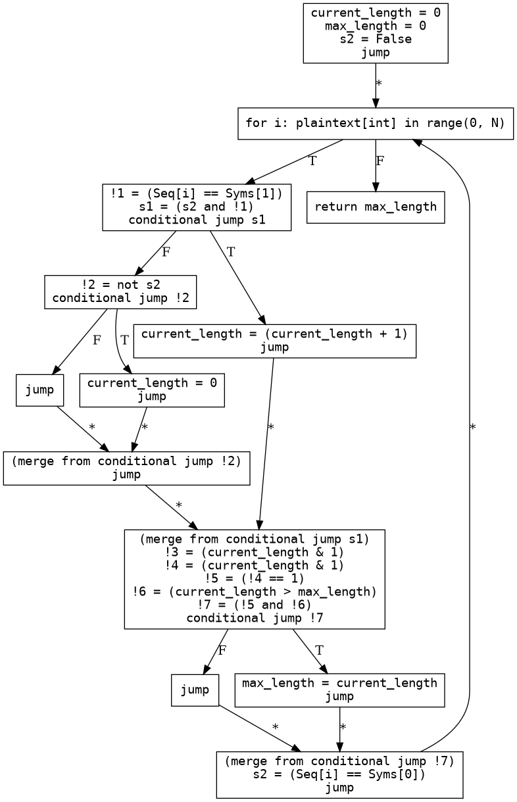
#### SSA
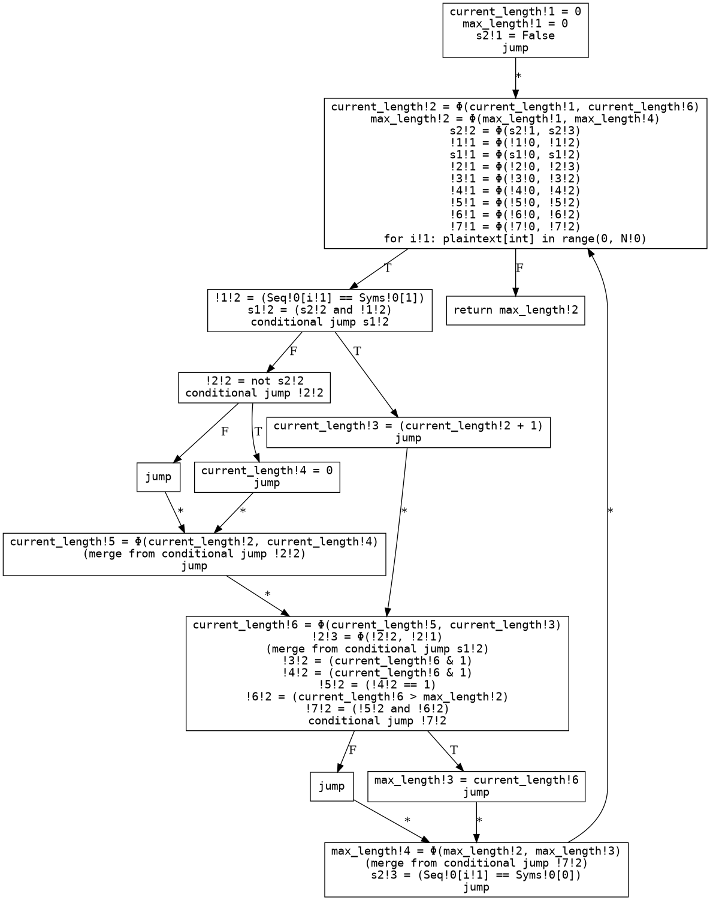
#### SSA ϕ→MUX
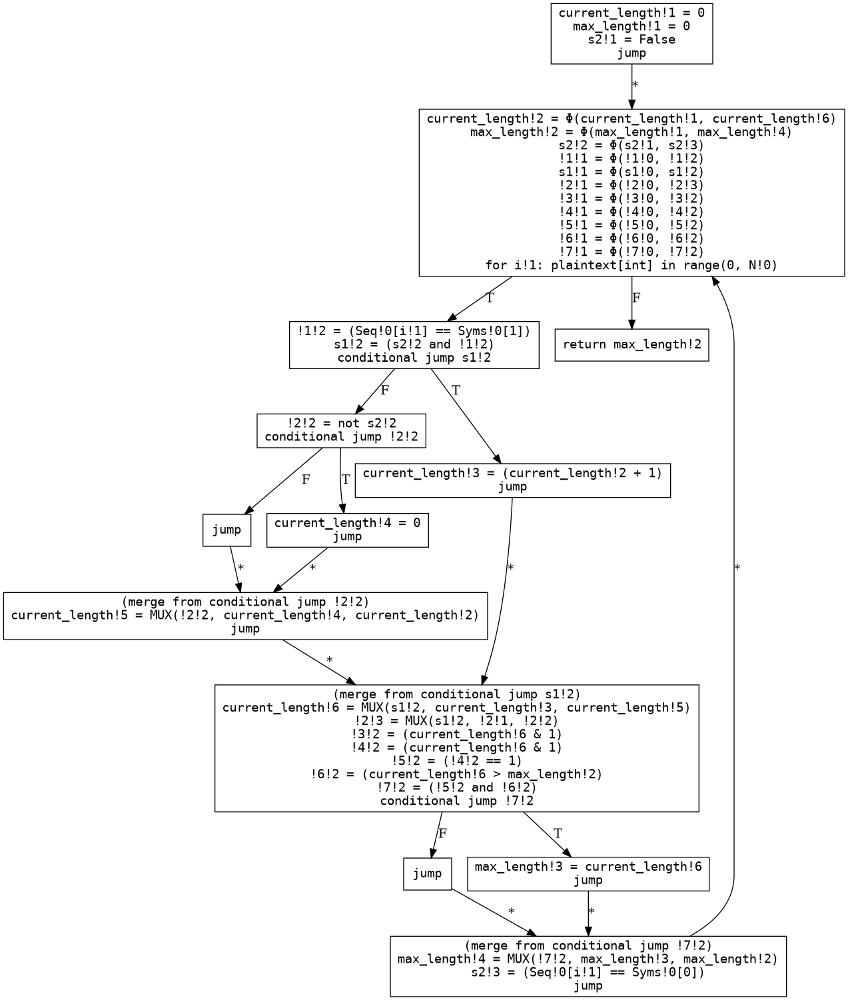
#### Dead code elimination
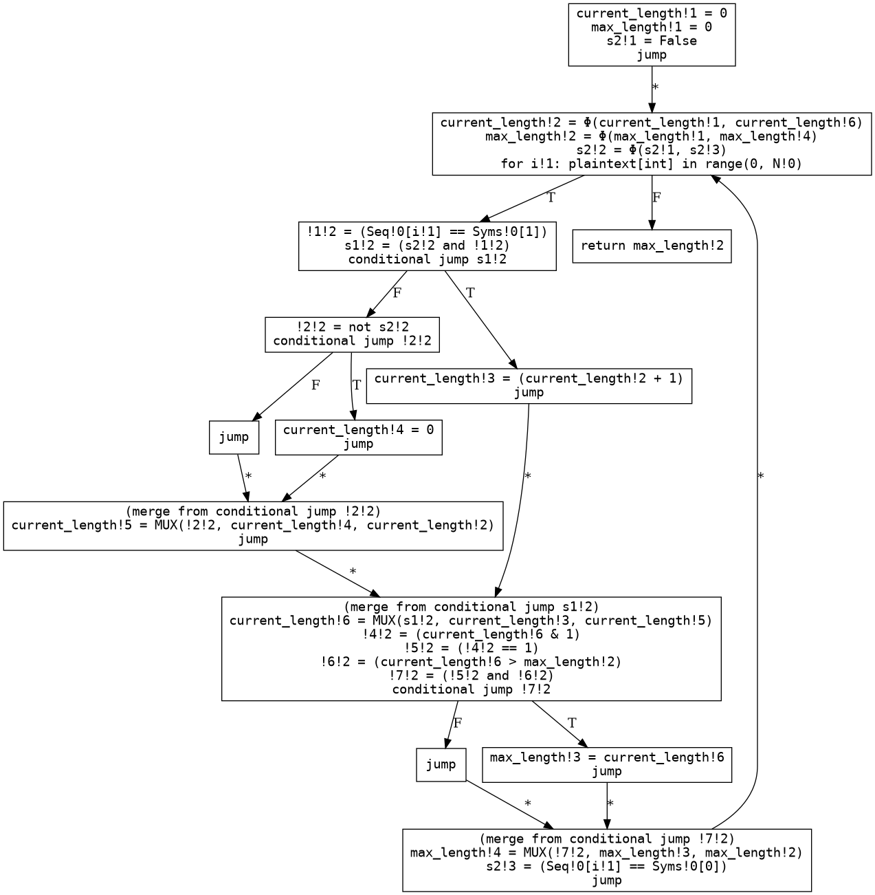
#### Linear code with loops
```python
def longest_odd_10(Seq!0: shared[list[int; ?]], N!0: plaintext[int], Syms!0: shared[list[int; ?]]) -> shared[int]:
    current_length!1 = 0
    max_length!1 = 0
    s2!1 = False
    for i!1 in range(0, N!0):
        current_length!2 = Φ(current_length!1, current_length!6)
        max_length!2 = Φ(max_length!1, max_length!4)
        s2!2 = Φ(s2!1, s2!3)
        !1!2 = (Seq!0[i!1] == Syms!0[1])
        s1!2 = (s2!2 and !1!2)
        !2!2 = not s2!2
        current_length!4 = 0
        current_length!5 = MUX(!2!2, current_length!4, current_length!2)
        current_length!3 = (current_length!2 + 1)
        current_length!6 = MUX(s1!2, current_length!3, current_length!5)
        !4!2 = (current_length!6 & 1)
        !5!2 = (!4!2 == 1)
        !6!2 = (current_length!6 > max_length!2)
        !7!2 = (!5!2 and !6!2)
        max_length!3 = current_length!6
        max_length!4 = MUX(!7!2, max_length!3, max_length!2)
        s2!3 = (Seq!0[i!1] == Syms!0[0])
    return max_length!2
```
#### Dependency graph

#### Removal of infeasible edges
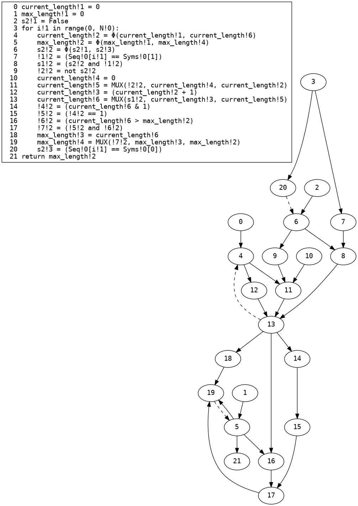
#### Type Environment Before Vectorization
| Variable | Type |
| - | - |
| `Seq!0` | `shared[list[int; ?]]` |
| `N!0` | `plaintext[int]` |
| `Syms!0` | `shared[list[int; ?]]` |
| `i!1` | `plaintext[int]` |
| `s2!3` | `shared[bool]` |
| `s2!2` | `shared[bool]` |
| `!2!2` | `shared[bool]` |
| `current_length!5` | `shared[int]` |
| `current_length!6` | `shared[int]` |
| `max_length!3` | `shared[int]` |
| `max_length!4` | `shared[int]` |
| `max_length!2` | `shared[int]` |
| `!6!2` | `shared[bool]` |
| `!7!2` | `shared[bool]` |
| `!4!2` | `shared[int]` |
| `!5!2` | `shared[bool]` |
| `current_length!2` | `shared[int]` |
| `current_length!3` | `shared[int]` |
| `s1!2` | `shared[bool]` |
| `current_length!4` | `plaintext[int]` |
| `!1!2` | `shared[bool]` |
| `s2!1` | `plaintext[bool]` |
| `max_length!1` | `plaintext[int]` |
| `current_length!1` | `plaintext[int]` |
#### Basic Vectorization Phase 1
```python
def longest_odd_10(Seq!0: shared[list[int; ?]], N!0: plaintext[int], Syms!0: shared[list[int; ?]]) -> shared[int]:
    current_length!1 = 0
    max_length!1 = 0
    s2!1 = False
    !8!0{N!0}[] = lift(current_length!1, (i!1:N!0))
    !9!0{N!0}[] = lift(max_length!1, (i!1:N!0))
    !10!0{N!0}[] = lift(s2!1, (i!1:N!0))
    !11!0{N!0}[] = lift(Seq!0[i!1], (i!1:N!0))
    !12!0{N!0}[] = lift(Syms!0[1], (i!1:N!0))
    !13!0{N!0}[] = lift(Seq!0[i!1], (i!1:N!0))
    !14!0{N!0}[] = lift(Syms!0[0], (i!1:N!0))
    for i!1 in range(0, N!0):
        current_length!2{N!0}[] = Φ(!8!0{N!0}[], current_length!6{N!0}[])
        max_length!2{N!0}[] = Φ(!9!0{N!0}[], max_length!4{N!0}[])
        s2!2{N!0}[] = Φ(!10!0{N!0}[], s2!3{N!0}[])
        !1!2{N!0}[] = (!11!0{N!0}[] == !12!0{N!0}[])
        s1!2{N!0}[] = (s2!2{N!0}[] and !1!2{N!0}[])
        !2!2{N!0}[] = not s2!2{N!0}[]
        current_length!4 = 0
        current_length!5{N!0}[] = MUX(!2!2{N!0}[], current_length!4, current_length!2{N!0}[])
        current_length!3{N!0}[] = (current_length!2{N!0}[] + 1)
        current_length!6{N!0}[] = MUX(s1!2{N!0}[], current_length!3{N!0}[], current_length!5{N!0}[])
        !4!2{N!0}[] = (current_length!6{N!0}[] & 1)
        !5!2{N!0}[] = (!4!2{N!0}[] == 1)
        !6!2{N!0}[] = (current_length!6{N!0}[] > max_length!2{N!0}[])
        !7!2{N!0}[] = (!5!2{N!0}[] and !6!2{N!0}[])
        max_length!3{N!0}[] = current_length!6{N!0}[]
        max_length!4{N!0}[] = MUX(!7!2{N!0}[], max_length!3{N!0}[], max_length!2{N!0}[])
        s2!3{N!0}[] = (!13!0{N!0}[] == !14!0{N!0}[])
    !15!0 = drop_dim(max_length!4{N!0}[])
    return !15!0
```
#### Basic Vectorization Phase 1 (dependence graph)
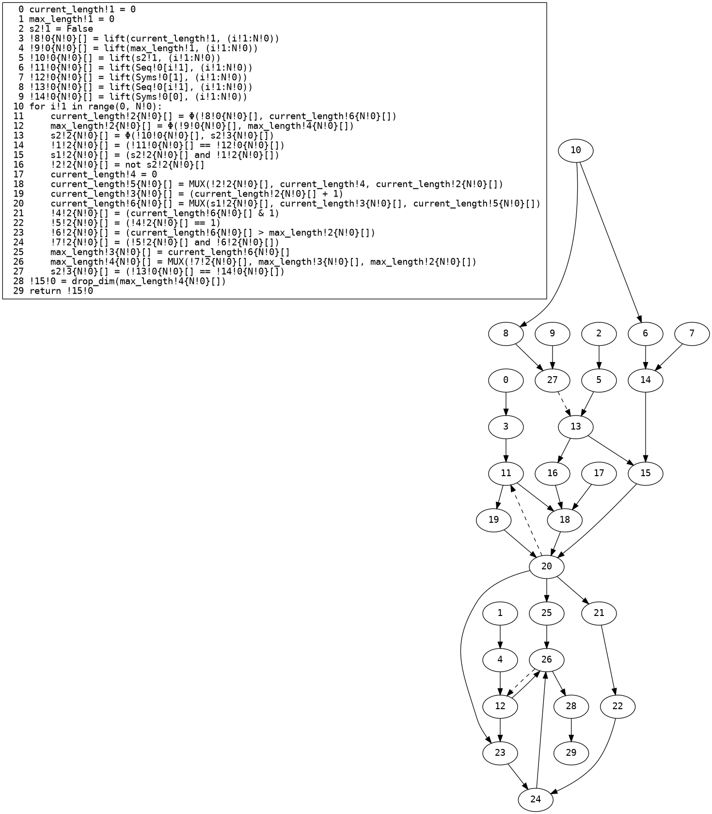
#### Basic Vectorization Phase 2
```python
def longest_odd_10(Seq!0: shared[list[int; ?]], N!0: plaintext[int], Syms!0: shared[list[int; ?]]) -> shared[int]:
    current_length!1 = 0
    max_length!1 = 0
    s2!1 = False
    !11!0{N!0}[] = lift(Seq!0[i!1], (i!1:N!0))
    !12!0{N!0}[] = lift(Syms!0[1], (i!1:N!0))
    !13!0{N!0}[] = lift(Seq!0[i!1], (i!1:N!0))
    !14!0{N!0}[] = lift(Syms!0[0], (i!1:N!0))
    current_length!4 = 0
    !8!0{N!0}[] = lift(current_length!1, (i!1:N!0))
    !9!0{N!0}[] = lift(max_length!1, (i!1:N!0))
    !10!0{N!0}[] = lift(s2!1, (i!1:N!0))
    !1!2{N!0}[] = (!11!0{N!0}[] == !12!0{N!0}[])
    s2!3{N!0}[] = (!13!0{N!0}[] == !14!0{N!0}[])
    for !16!0 in range(0, N!0): (monolithic)
        s2!2{}[!16!0] = Φ(!10!0{}[!16!0], s2!3{}[(!16!0 - 1)])
    s1!2{N!0}[] = (s2!2{N!0}[] and !1!2{N!0}[])
    !2!2{N!0}[] = not s2!2{N!0}[]
    for !17!0 in range(0, N!0): (monolithic)
        current_length!2{}[!17!0] = Φ(!8!0{}[!17!0], current_length!6{}[(!17!0 - 1)])
        current_length!5{}[!17!0] = MUX(!2!2{}[!17!0], current_length!4, current_length!2{}[!17!0])
        current_length!3{}[!17!0] = (current_length!2{}[!17!0] + 1)
        current_length!6{}[!17!0] = MUX(s1!2{}[!17!0], current_length!3{}[!17!0], current_length!5{}[!17!0])
    !4!2{N!0}[] = (current_length!6{N!0}[] & 1)
    max_length!3{N!0}[] = current_length!6{N!0}[]
    !5!2{N!0}[] = (!4!2{N!0}[] == 1)
    for !18!0 in range(0, N!0): (monolithic)
        max_length!2{}[!18!0] = Φ(!9!0{}[!18!0], max_length!4{}[(!18!0 - 1)])
        !6!2{}[!18!0] = (current_length!6{}[!18!0] > max_length!2{}[!18!0])
        !7!2{}[!18!0] = (!5!2{}[!18!0] and !6!2{}[!18!0])
        max_length!4{}[!18!0] = MUX(!7!2{}[!18!0], max_length!3{}[!18!0], max_length!2{}[!18!0])
    !15!0 = drop_dim(max_length!4{N!0}[])
    return !15!0
```
#### Basic Vectorization Phase 2 (dependence graph)
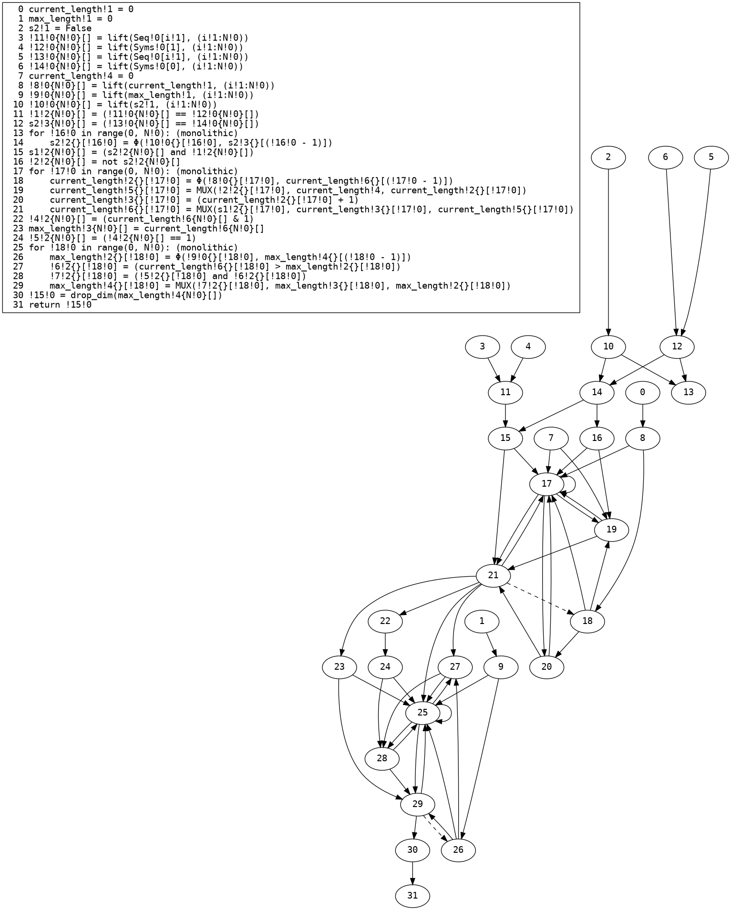
#### Type Environment After Vectorization
| Variable | Type |
| - | - |
| `Seq!0` | `shared[list[int; ?]]` |
| `N!0` | `plaintext[int]` |
| `Syms!0` | `shared[list[int; ?]]` |
| `!16!0` | `plaintext[int]` |
| `!17!0` | `plaintext[int]` |
| `!18!0` | `plaintext[int]` |
| `!15!0` | `shared[int]` |
| `max_length!4` | `shared[list[int; (N!0)]]` |
| `max_length!2` | `shared[list[int; (N!0)]]` |
| `!6!2` | `shared[list[bool; (N!0)]]` |
| `!7!2` | `shared[list[bool; (N!0)]]` |
| `!5!2` | `shared[list[bool; (N!0)]]` |
| `max_length!3` | `shared[list[int; (N!0)]]` |
| `!4!2` | `shared[list[int; (N!0)]]` |
| `current_length!6` | `shared[list[int; (N!0)]]` |
| `current_length!2` | `shared[list[int; (N!0)]]` |
| `current_length!3` | `shared[list[int; (N!0)]]` |
| `current_length!5` | `shared[list[int; (N!0)]]` |
| `!2!2` | `shared[list[bool; (N!0)]]` |
| `s1!2` | `shared[list[bool; (N!0)]]` |
| `s2!2` | `shared[list[bool; (N!0)]]` |
| `s2!3` | `shared[list[bool; (N!0)]]` |
| `!1!2` | `shared[list[bool; (N!0)]]` |
| `!10!0` | `shared[list[bool; (N!0)]]` |
| `!9!0` | `shared[list[int; (N!0)]]` |
| `!8!0` | `shared[list[int; (N!0)]]` |
| `current_length!4` | `plaintext[int]` |
| `!14!0` | `shared[list[int; (N!0)]]` |
| `!13!0` | `shared[list[int; (N!0)]]` |
| `!12!0` | `shared[list[int; (N!0)]]` |
| `!11!0` | `shared[list[int; (N!0)]]` |
| `s2!1` | `plaintext[bool]` |
| `max_length!1` | `plaintext[int]` |
| `current_length!1` | `plaintext[int]` |
#### Copy propagation
```python
def longest_odd_10(Seq!0: shared[list[int; ?]], N!0: plaintext[int], Syms!0: shared[list[int; ?]]) -> shared[int]:
    current_length!1 = 0
    max_length!1 = 0
    s2!1 = False
    !11!0{N!0}[] = lift(Seq!0[i!1], (i!1:N!0))
    !12!0{N!0}[] = lift(Syms!0[1], (i!1:N!0))
    !13!0{N!0}[] = lift(Seq!0[i!1], (i!1:N!0))
    !14!0{N!0}[] = lift(Syms!0[0], (i!1:N!0))
    current_length!4 = 0
    !8!0{N!0}[] = lift(current_length!1, (i!1:N!0))
    !9!0{N!0}[] = lift(max_length!1, (i!1:N!0))
    !10!0{N!0}[] = lift(s2!1, (i!1:N!0))
    !1!2{N!0}[] = (!11!0{N!0}[] == !12!0{N!0}[])
    s2!3{N!0}[] = (!13!0{N!0}[] == !14!0{N!0}[])
    for !16!0 in range(0, N!0): (monolithic)
        s2!2{}[!16!0] = Φ(!10!0{}[!16!0], s2!3{}[(!16!0 - 1)])
    s1!2{N!0}[] = (s2!2{N!0}[] and !1!2{N!0}[])
    !2!2{N!0}[] = not s2!2{N!0}[]
    for !17!0 in range(0, N!0): (monolithic)
        current_length!2{}[!17!0] = Φ(!8!0{}[!17!0], current_length!6{}[(!17!0 - 1)])
        current_length!5{}[!17!0] = MUX(!2!2{}[!17!0], current_length!4, current_length!2{}[!17!0])
        current_length!3{}[!17!0] = (current_length!2{}[!17!0] + 1)
        current_length!6{}[!17!0] = MUX(s1!2{}[!17!0], current_length!3{}[!17!0], current_length!5{}[!17!0])
    !4!2{N!0}[] = (current_length!6{N!0}[] & 1)
    !5!2{N!0}[] = (!4!2{N!0}[] == 1)
    for !18!0 in range(0, N!0): (monolithic)
        max_length!2{}[!18!0] = Φ(!9!0{}[!18!0], max_length!4{}[(!18!0 - 1)])
        !6!2{}[!18!0] = (current_length!6{}[!18!0] > max_length!2{}[!18!0])
        !7!2{}[!18!0] = (!5!2{}[!18!0] and !6!2{}[!18!0])
        max_length!4{}[!18!0] = MUX(!7!2{}[!18!0], current_length!6{}[!18!0], max_length!2{}[!18!0])
    !15!0 = drop_dim(max_length!4{N!0}[])
    return !15!0
```
#### Common subexpression elimination
```python
def longest_odd_10(Seq!0: shared[list[int; ?]], N!0: plaintext[int], Syms!0: shared[list[int; ?]]) -> shared[int]:
    current_length!1 = 0
    max_length!1 = 0
    s2!1 = False
    !11!0{N!0}[] = lift(Seq!0[i!1], (i!1:N!0))
    !12!0{N!0}[] = lift(Syms!0[1], (i!1:N!0))
    !14!0{N!0}[] = lift(Syms!0[0], (i!1:N!0))
    current_length!4 = 0
    !8!0{N!0}[] = lift(current_length!1, (i!1:N!0))
    !9!0{N!0}[] = lift(max_length!1, (i!1:N!0))
    !10!0{N!0}[] = lift(s2!1, (i!1:N!0))
    !1!2{N!0}[] = (!11!0{N!0}[] == !12!0{N!0}[])
    s2!3{N!0}[] = (!11!0{N!0}[] == !14!0{N!0}[])
    for !16!0 in range(0, N!0): (monolithic)
        s2!2{}[!16!0] = Φ(!10!0{}[!16!0], s2!3{}[(!16!0 - 1)])
    s1!2{N!0}[] = (s2!2{N!0}[] and !1!2{N!0}[])
    !2!2{N!0}[] = not s2!2{N!0}[]
    for !17!0 in range(0, N!0): (monolithic)
        current_length!2{}[!17!0] = Φ(!8!0{}[!17!0], current_length!6{}[(!17!0 - 1)])
        current_length!5{}[!17!0] = MUX(!2!2{}[!17!0], current_length!4, current_length!2{}[!17!0])
        current_length!3{}[!17!0] = (current_length!2{}[!17!0] + 1)
        current_length!6{}[!17!0] = MUX(s1!2{}[!17!0], current_length!3{}[!17!0], current_length!5{}[!17!0])
    !4!2{N!0}[] = (current_length!6{N!0}[] & 1)
    !5!2{N!0}[] = (!4!2{N!0}[] == 1)
    for !18!0 in range(0, N!0): (monolithic)
        max_length!2{}[!18!0] = Φ(!9!0{}[!18!0], max_length!4{}[(!18!0 - 1)])
        !6!2{}[!18!0] = (current_length!6{}[!18!0] > max_length!2{}[!18!0])
        !7!2{}[!18!0] = (!5!2{}[!18!0] and !6!2{}[!18!0])
        max_length!4{}[!18!0] = MUX(!7!2{}[!18!0], current_length!6{}[!18!0], max_length!2{}[!18!0])
    !15!0 = drop_dim(max_length!4{N!0}[])
    return !15!0
```
#### MOTION mixed configuration
```Total cost:	0.65870
Input vars:	{Syms!0: ['Y'], Seq!0: ['Y']}
Constants:	{0: ['Y'], False: ['Y'], 1: ['Y']}
Plaintext vars:	{}
Flags:		{}
current_length!1 = 0: _ -> ['Y'] for 0.00000 * 1 = 0.00
max_length!1 = 0: _ -> ['Y'] for 0.00000 * 1 = 0.00
s2!1 = False: _ -> ['Y'] for 0.00000 * 1 = 0.00
!11!0{N!0}[] = lift(Seq!0[i!1], (i!1:N!0)): _ -> ['Y'] for 0.00000 * 1 = 0.00
!12!0{N!0}[] = lift(Syms!0[1], (i!1:N!0)): _ -> ['Y'] for 0.00000 * 1 = 0.00
!14!0{N!0}[] = lift(Syms!0[0], (i!1:N!0)): _ -> ['Y'] for 0.00000 * 1 = 0.00
current_length!4 = 0: _ -> ['Y'] for 0.00000 * 1 = 0.00
!8!0{N!0}[] = lift(current_length!1, (i!1:N!0)): _ -> ['Y'] for 0.00000 * 1 = 0.00
!9!0{N!0}[] = lift(max_length!1, (i!1:N!0)): _ -> ['Y'] for 0.00000 * 1 = 0.00
!10!0{N!0}[] = lift(s2!1, (i!1:N!0)): _ -> ['Y'] for 0.00000 * 1 = 0.00
!1!2{N!0}[] = (!11!0{N!0}[] == !12!0{N!0}[]): Y -> {} for 0.01528 * 1 = 0.02
s2!3{N!0}[] = (!11!0{N!0}[] == !14!0{N!0}[]): Y -> {} for 0.01528 * 1 = 0.02
	s2!2{}[!16!0] = Φ(!10!0{}[!16!0], s2!3{}[(!16!0 - 1)]): Y -> {} for 0.00000 * 8 = 0.00
s1!2{N!0}[] = (s2!2{N!0}[] and !1!2{N!0}[]): Y -> {} for 0.00200 * 1 = 0.00
!2!2{N!0}[] = not s2!2{N!0}[]: Y -> {} for 0.00000 * 1 = 0.00
	current_length!2{}[!17!0] = Φ(!8!0{}[!17!0], current_length!6{}[(!17!0 - 1)]): Y -> {} for 0.00000 * 8 = 0.00
	current_length!5{}[!17!0] = MUX(!2!2{}[!17!0], current_length!4, current_length!2{}[!17!0]): Y -> {} for 0.00597 * 8 = 0.05
	current_length!3{}[!17!0] = (current_length!2{}[!17!0] + 1): Y -> {} for 0.02351 * 8 = 0.19
	current_length!6{}[!17!0] = MUX(s1!2{}[!17!0], current_length!3{}[!17!0], current_length!5{}[!17!0]): Y -> {} for 0.00597 * 8 = 0.05
!4!2{N!0}[] = (current_length!6{N!0}[] & 1): Y -> {} for 0.01024 * 1 = 0.01
!5!2{N!0}[] = (!4!2{N!0}[] == 1): Y -> {} for 0.01528 * 1 = 0.02
	max_length!2{}[!18!0] = Φ(!9!0{}[!18!0], max_length!4{}[(!18!0 - 1)]): Y -> {} for 0.00000 * 8 = 0.00
	!6!2{}[!18!0] = (current_length!6{}[!18!0] > max_length!2{}[!18!0]): Y -> {} for 0.03120 * 8 = 0.25
	!7!2{}[!18!0] = (!5!2{}[!18!0] and !6!2{}[!18!0]): Y -> {} for 0.00245 * 8 = 0.02
	max_length!4{}[!18!0] = MUX(!7!2{}[!18!0], current_length!6{}[!18!0], max_length!2{}[!18!0]): Y -> {} for 0.00597 * 8 = 0.05
!15!0 = drop_dim(max_length!4{N!0}[]): _ -> ['Y'] for 0.00000 * 1 = 0.00
return !15!0
Output vars:	{!15!0: ['Y']}

```
#### MOTION code
```cpp
template <encrypto::motion::MpcProtocol Protocol>
encrypto::motion::SecureUnsignedInteger longest_odd_10(
    encrypto::motion::PartyPointer &party,
    std::vector<encrypto::motion::SecureUnsignedInteger> Seq_0,
    std::uint32_t _MPC_PLAINTEXT_N_0,
    std::vector<encrypto::motion::SecureUnsignedInteger> Syms_0
) {
    // Shared variable declarations
    std::vector<encrypto::motion::ShareWrapper> _1_2((_MPC_PLAINTEXT_N_0));
    std::vector<encrypto::motion::ShareWrapper> _10_0((_MPC_PLAINTEXT_N_0));
    std::vector<encrypto::motion::SecureUnsignedInteger> _11_0((_MPC_PLAINTEXT_N_0));
    std::vector<encrypto::motion::SecureUnsignedInteger> _12_0((_MPC_PLAINTEXT_N_0));
    std::vector<encrypto::motion::SecureUnsignedInteger> _14_0((_MPC_PLAINTEXT_N_0));
    encrypto::motion::SecureUnsignedInteger _15_0;
    encrypto::motion::SecureUnsignedInteger _16_0;
    encrypto::motion::SecureUnsignedInteger _17_0;
    encrypto::motion::SecureUnsignedInteger _18_0;
    std::vector<encrypto::motion::ShareWrapper> _2_2((_MPC_PLAINTEXT_N_0));
    std::vector<encrypto::motion::SecureUnsignedInteger> _4_2((_MPC_PLAINTEXT_N_0));
    std::vector<encrypto::motion::ShareWrapper> _5_2((_MPC_PLAINTEXT_N_0));
    std::vector<encrypto::motion::ShareWrapper> _6_2((_MPC_PLAINTEXT_N_0));
    std::vector<encrypto::motion::ShareWrapper> _7_2((_MPC_PLAINTEXT_N_0));
    std::vector<encrypto::motion::SecureUnsignedInteger> _8_0((_MPC_PLAINTEXT_N_0));
    std::vector<encrypto::motion::SecureUnsignedInteger> _9_0((_MPC_PLAINTEXT_N_0));
    encrypto::motion::SecureUnsignedInteger N_0;
    encrypto::motion::SecureUnsignedInteger current_length_1;
    std::vector<encrypto::motion::SecureUnsignedInteger> current_length_2((_MPC_PLAINTEXT_N_0));
    std::vector<encrypto::motion::SecureUnsignedInteger> current_length_3((_MPC_PLAINTEXT_N_0));
    encrypto::motion::SecureUnsignedInteger current_length_4;
    std::vector<encrypto::motion::SecureUnsignedInteger> current_length_5((_MPC_PLAINTEXT_N_0));
    std::vector<encrypto::motion::SecureUnsignedInteger> current_length_6((_MPC_PLAINTEXT_N_0));
    encrypto::motion::SecureUnsignedInteger max_length_1;
    std::vector<encrypto::motion::SecureUnsignedInteger> max_length_2((_MPC_PLAINTEXT_N_0));
    std::vector<encrypto::motion::SecureUnsignedInteger> max_length_4((_MPC_PLAINTEXT_N_0));
    std::vector<encrypto::motion::ShareWrapper> s1_2((_MPC_PLAINTEXT_N_0));
    encrypto::motion::ShareWrapper s2_1;
    std::vector<encrypto::motion::ShareWrapper> s2_2((_MPC_PLAINTEXT_N_0));
    std::vector<encrypto::motion::ShareWrapper> s2_3((_MPC_PLAINTEXT_N_0));

    // Plaintext variable declarations
    std::uint32_t _MPC_PLAINTEXT__16_0;
    std::uint32_t _MPC_PLAINTEXT__17_0;
    std::uint32_t _MPC_PLAINTEXT__18_0;
    std::uint32_t _MPC_PLAINTEXT_current_length_1;
    std::uint32_t _MPC_PLAINTEXT_current_length_4;
    std::uint32_t _MPC_PLAINTEXT_max_length_1;
    bool _MPC_PLAINTEXT_s2_1;

    // Constant initializations
    encrypto::motion::SecureUnsignedInteger _MPC_CONSTANT_0 = party->In<Protocol>(encrypto::motion::ToInput(std::uint32_t(0)), 0);
    encrypto::motion::SecureUnsignedInteger _MPC_CONSTANT_1 = party->In<Protocol>(encrypto::motion::ToInput(std::uint32_t(1)), 0);
    encrypto::motion::ShareWrapper _MPC_CONSTANT_false = party->In<Protocol>(encrypto::motion::BitVector(1, false), 0);

    // Plaintext parameter assignments
    N_0 = party->In<Protocol>(encrypto::motion::ToInput(_MPC_PLAINTEXT_N_0), 0);

    // Function body
    current_length_1 = _MPC_CONSTANT_0;
    _MPC_PLAINTEXT_current_length_1 = std::uint32_t(0);
    max_length_1 = _MPC_CONSTANT_0;
    _MPC_PLAINTEXT_max_length_1 = std::uint32_t(0);
    s2_1 = _MPC_CONSTANT_false;
    _MPC_PLAINTEXT_s2_1 = false;
    vectorized_assign(_11_0, {_MPC_PLAINTEXT_N_0}, {true}, {}, lift(std::function([&](const std::vector<std::uint32_t> &indices){return Seq_0[indices[0]];}), {_MPC_PLAINTEXT_N_0}));
    vectorized_assign(_12_0, {_MPC_PLAINTEXT_N_0}, {true}, {}, lift(std::function([&](const std::vector<std::uint32_t> &indices){return Syms_0[std::uint32_t(1)];}), {_MPC_PLAINTEXT_N_0}));
    vectorized_assign(_14_0, {_MPC_PLAINTEXT_N_0}, {true}, {}, lift(std::function([&](const std::vector<std::uint32_t> &indices){return Syms_0[std::uint32_t(0)];}), {_MPC_PLAINTEXT_N_0}));
    current_length_4 = _MPC_CONSTANT_0;
    _MPC_PLAINTEXT_current_length_4 = std::uint32_t(0);
    vectorized_assign(_8_0, {_MPC_PLAINTEXT_N_0}, {true}, {}, lift(std::function([&](const std::vector<std::uint32_t> &indices){return current_length_1;}), {_MPC_PLAINTEXT_N_0}));
    vectorized_assign(_9_0, {_MPC_PLAINTEXT_N_0}, {true}, {}, lift(std::function([&](const std::vector<std::uint32_t> &indices){return max_length_1;}), {_MPC_PLAINTEXT_N_0}));
    vectorized_assign(_10_0, {_MPC_PLAINTEXT_N_0}, {true}, {}, lift(std::function([&](const std::vector<std::uint32_t> &indices){return s2_1;}), {_MPC_PLAINTEXT_N_0}));
    vectorized_assign(_1_2, {_MPC_PLAINTEXT_N_0}, {true}, {}, (to_share_wrapper(vectorized_access(_11_0, {_MPC_PLAINTEXT_N_0}, {true}, {})) == to_share_wrapper(vectorized_access(_12_0, {_MPC_PLAINTEXT_N_0}, {true}, {}))));
    vectorized_assign(s2_3, {_MPC_PLAINTEXT_N_0}, {true}, {}, (to_share_wrapper(vectorized_access(_11_0, {_MPC_PLAINTEXT_N_0}, {true}, {})) == to_share_wrapper(vectorized_access(_14_0, {_MPC_PLAINTEXT_N_0}, {true}, {}))));

    // Initialize loop counter
    _MPC_PLAINTEXT__16_0 = std::uint32_t(0);
    // Initialize phi values
    s2_2[_MPC_PLAINTEXT__16_0] = _10_0[_MPC_PLAINTEXT__16_0];
    for (; _MPC_PLAINTEXT__16_0 < _MPC_PLAINTEXT_N_0; _MPC_PLAINTEXT__16_0++) {
        // Update phi values
        if (_MPC_PLAINTEXT__16_0 != std::uint32_t(0)) {
            s2_2[_MPC_PLAINTEXT__16_0] = s2_3[(_MPC_PLAINTEXT__16_0 - std::uint32_t(1))];
        }


    }

    vectorized_assign(s1_2, {_MPC_PLAINTEXT_N_0}, {true}, {}, (to_share_wrapper(vectorized_access(s2_2, {_MPC_PLAINTEXT_N_0}, {true}, {})) & to_share_wrapper(vectorized_access(_1_2, {_MPC_PLAINTEXT_N_0}, {true}, {}))));
    vectorized_assign(_2_2, {_MPC_PLAINTEXT_N_0}, {true}, {}, (~vectorized_access(s2_2, {_MPC_PLAINTEXT_N_0}, {true}, {})));

    // Initialize loop counter
    _MPC_PLAINTEXT__17_0 = std::uint32_t(0);
    // Initialize phi values
    current_length_2[_MPC_PLAINTEXT__17_0] = _8_0[_MPC_PLAINTEXT__17_0];
    for (; _MPC_PLAINTEXT__17_0 < _MPC_PLAINTEXT_N_0; _MPC_PLAINTEXT__17_0++) {
        // Update phi values
        if (_MPC_PLAINTEXT__17_0 != std::uint32_t(0)) {
            current_length_2[_MPC_PLAINTEXT__17_0] = current_length_6[(_MPC_PLAINTEXT__17_0 - std::uint32_t(1))];
        }

        current_length_5[_MPC_PLAINTEXT__17_0] = _2_2[_MPC_PLAINTEXT__17_0].Mux(current_length_4.Get(), current_length_2[_MPC_PLAINTEXT__17_0].Get());
        current_length_3[_MPC_PLAINTEXT__17_0] = (current_length_2[_MPC_PLAINTEXT__17_0] + _MPC_CONSTANT_1);
        current_length_6[_MPC_PLAINTEXT__17_0] = s1_2[_MPC_PLAINTEXT__17_0].Mux(current_length_3[_MPC_PLAINTEXT__17_0].Get(), current_length_5[_MPC_PLAINTEXT__17_0].Get());

    }

    vectorized_assign(_4_2, {_MPC_PLAINTEXT_N_0}, {true}, {}, (to_share_wrapper(vectorized_access(current_length_6, {_MPC_PLAINTEXT_N_0}, {true}, {})) & to_share_wrapper(decltype(_MPC_CONSTANT_1)::Simdify(lift(std::function([&](const std::vector<std::uint32_t> &indices){return _MPC_CONSTANT_1;}), {_MPC_PLAINTEXT_N_0})))));
    vectorized_assign(_5_2, {_MPC_PLAINTEXT_N_0}, {true}, {}, (to_share_wrapper(vectorized_access(_4_2, {_MPC_PLAINTEXT_N_0}, {true}, {})) == to_share_wrapper(decltype(_MPC_CONSTANT_1)::Simdify(lift(std::function([&](const std::vector<std::uint32_t> &indices){return _MPC_CONSTANT_1;}), {_MPC_PLAINTEXT_N_0})))));

    // Initialize loop counter
    _MPC_PLAINTEXT__18_0 = std::uint32_t(0);
    // Initialize phi values
    max_length_2[_MPC_PLAINTEXT__18_0] = _9_0[_MPC_PLAINTEXT__18_0];
    for (; _MPC_PLAINTEXT__18_0 < _MPC_PLAINTEXT_N_0; _MPC_PLAINTEXT__18_0++) {
        // Update phi values
        if (_MPC_PLAINTEXT__18_0 != std::uint32_t(0)) {
            max_length_2[_MPC_PLAINTEXT__18_0] = max_length_4[(_MPC_PLAINTEXT__18_0 - std::uint32_t(1))];
        }

        _6_2[_MPC_PLAINTEXT__18_0] = (current_length_6[_MPC_PLAINTEXT__18_0] > max_length_2[_MPC_PLAINTEXT__18_0]);
        _7_2[_MPC_PLAINTEXT__18_0] = (to_share_wrapper(_5_2[_MPC_PLAINTEXT__18_0]) & to_share_wrapper(_6_2[_MPC_PLAINTEXT__18_0]));
        max_length_4[_MPC_PLAINTEXT__18_0] = _7_2[_MPC_PLAINTEXT__18_0].Mux(current_length_6[_MPC_PLAINTEXT__18_0].Get(), max_length_2[_MPC_PLAINTEXT__18_0].Get());

    }

    _15_0 = drop_dim_monoreturn(vectorized_access(max_length_4, {_MPC_PLAINTEXT_N_0}, {true}, {}).Unsimdify(), {_MPC_PLAINTEXT_N_0});
    return _15_0;

}
```
#### MOTION mixed code
```cpp
encrypto::motion::SecureUnsignedInteger longest_odd_10(
    encrypto::motion::PartyPointer &party,
    std::vector<encrypto::motion::SecureUnsignedInteger> Seq_0,
    std::uint32_t _MPC_PLAINTEXT_N_0,
    std::vector<encrypto::motion::SecureUnsignedInteger> Syms_0
) {
    // Shared variable declarations
    std::vector<encrypto::motion::ShareWrapper> _1_2((_MPC_PLAINTEXT_N_0));
    std::vector<encrypto::motion::ShareWrapper> _10_0((_MPC_PLAINTEXT_N_0));
    std::vector<encrypto::motion::SecureUnsignedInteger> _11_0((_MPC_PLAINTEXT_N_0));
    std::vector<encrypto::motion::SecureUnsignedInteger> _12_0((_MPC_PLAINTEXT_N_0));
    std::vector<encrypto::motion::SecureUnsignedInteger> _14_0((_MPC_PLAINTEXT_N_0));
    encrypto::motion::SecureUnsignedInteger _15_0;
    encrypto::motion::SecureUnsignedInteger _16_0;
    encrypto::motion::SecureUnsignedInteger _17_0;
    encrypto::motion::SecureUnsignedInteger _18_0;
    std::vector<encrypto::motion::ShareWrapper> _2_2((_MPC_PLAINTEXT_N_0));
    std::vector<encrypto::motion::SecureUnsignedInteger> _4_2((_MPC_PLAINTEXT_N_0));
    std::vector<encrypto::motion::ShareWrapper> _5_2((_MPC_PLAINTEXT_N_0));
    std::vector<encrypto::motion::ShareWrapper> _6_2((_MPC_PLAINTEXT_N_0));
    std::vector<encrypto::motion::ShareWrapper> _7_2((_MPC_PLAINTEXT_N_0));
    std::vector<encrypto::motion::SecureUnsignedInteger> _8_0((_MPC_PLAINTEXT_N_0));
    std::vector<encrypto::motion::SecureUnsignedInteger> _9_0((_MPC_PLAINTEXT_N_0));
    encrypto::motion::SecureUnsignedInteger N_0;
    encrypto::motion::SecureUnsignedInteger current_length_1;
    std::vector<encrypto::motion::SecureUnsignedInteger> current_length_2((_MPC_PLAINTEXT_N_0));
    std::vector<encrypto::motion::SecureUnsignedInteger> current_length_3((_MPC_PLAINTEXT_N_0));
    encrypto::motion::SecureUnsignedInteger current_length_4;
    std::vector<encrypto::motion::SecureUnsignedInteger> current_length_5((_MPC_PLAINTEXT_N_0));
    std::vector<encrypto::motion::SecureUnsignedInteger> current_length_6((_MPC_PLAINTEXT_N_0));
    encrypto::motion::SecureUnsignedInteger max_length_1;
    std::vector<encrypto::motion::SecureUnsignedInteger> max_length_2((_MPC_PLAINTEXT_N_0));
    std::vector<encrypto::motion::SecureUnsignedInteger> max_length_4((_MPC_PLAINTEXT_N_0));
    std::vector<encrypto::motion::ShareWrapper> s1_2((_MPC_PLAINTEXT_N_0));
    encrypto::motion::ShareWrapper s2_1;
    std::vector<encrypto::motion::ShareWrapper> s2_2((_MPC_PLAINTEXT_N_0));
    std::vector<encrypto::motion::ShareWrapper> s2_3((_MPC_PLAINTEXT_N_0));

    // Plaintext variable declarations
    std::uint32_t _MPC_PLAINTEXT__16_0;
    std::uint32_t _MPC_PLAINTEXT__17_0;
    std::uint32_t _MPC_PLAINTEXT__18_0;
    std::uint32_t _MPC_PLAINTEXT_current_length_1;
    std::uint32_t _MPC_PLAINTEXT_current_length_4;
    std::uint32_t _MPC_PLAINTEXT_max_length_1;
    bool _MPC_PLAINTEXT_s2_1;

    // Constant initializations
    encrypto::motion::SecureUnsignedInteger _MPC_CONSTANT_0 = party->In<encrypto::motion::MpcProtocol::kBmr>(encrypto::motion::ToInput(std::uint32_t(0)), 0);
    encrypto::motion::SecureUnsignedInteger _MPC_CONSTANT_1 = party->In<encrypto::motion::MpcProtocol::kBmr>(encrypto::motion::ToInput(std::uint32_t(1)), 0);
    encrypto::motion::ShareWrapper _MPC_CONSTANT_false = party->In<encrypto::motion::MpcProtocol::kBmr>(encrypto::motion::BitVector(1, false), 0);

    // Input Protocol Convertions

    // Plaintext parameter assignments

    // Function body
    current_length_1 = _MPC_CONSTANT_0;
    _MPC_PLAINTEXT_current_length_1 = std::uint32_t(0);
    max_length_1 = _MPC_CONSTANT_0;
    _MPC_PLAINTEXT_max_length_1 = std::uint32_t(0);
    s2_1 = _MPC_CONSTANT_false;
    _MPC_PLAINTEXT_s2_1 = false;
    vectorized_assign(_11_0, {_MPC_PLAINTEXT_N_0}, {true}, {}, lift(std::function([&](const std::vector<std::uint32_t> &indices){return Seq_0[indices[0]];}), {_MPC_PLAINTEXT_N_0}));
    vectorized_assign(_12_0, {_MPC_PLAINTEXT_N_0}, {true}, {}, lift(std::function([&](const std::vector<std::uint32_t> &indices){return Syms_0[std::uint32_t(1)];}), {_MPC_PLAINTEXT_N_0}));
    vectorized_assign(_14_0, {_MPC_PLAINTEXT_N_0}, {true}, {}, lift(std::function([&](const std::vector<std::uint32_t> &indices){return Syms_0[std::uint32_t(0)];}), {_MPC_PLAINTEXT_N_0}));
    current_length_4 = _MPC_CONSTANT_0;
    _MPC_PLAINTEXT_current_length_4 = std::uint32_t(0);
    vectorized_assign(_8_0, {_MPC_PLAINTEXT_N_0}, {true}, {}, lift(std::function([&](const std::vector<std::uint32_t> &indices){return current_length_1;}), {_MPC_PLAINTEXT_N_0}));
    vectorized_assign(_9_0, {_MPC_PLAINTEXT_N_0}, {true}, {}, lift(std::function([&](const std::vector<std::uint32_t> &indices){return max_length_1;}), {_MPC_PLAINTEXT_N_0}));
    vectorized_assign(_10_0, {_MPC_PLAINTEXT_N_0}, {true}, {}, lift(std::function([&](const std::vector<std::uint32_t> &indices){return s2_1;}), {_MPC_PLAINTEXT_N_0}));
    vectorized_assign(_1_2, {_MPC_PLAINTEXT_N_0}, {true}, {}, (to_share_wrapper(vectorized_access(_11_0, {_MPC_PLAINTEXT_N_0}, {true}, {})) == to_share_wrapper(vectorized_access(_12_0, {_MPC_PLAINTEXT_N_0}, {true}, {}))));
    vectorized_assign(s2_3, {_MPC_PLAINTEXT_N_0}, {true}, {}, (to_share_wrapper(vectorized_access(_11_0, {_MPC_PLAINTEXT_N_0}, {true}, {})) == to_share_wrapper(vectorized_access(_14_0, {_MPC_PLAINTEXT_N_0}, {true}, {}))));

    // Initialize loop counter
    _MPC_PLAINTEXT__16_0 = std::uint32_t(0);
    // Initialize phi values
    s2_2[_MPC_PLAINTEXT__16_0] = _10_0[_MPC_PLAINTEXT__16_0];
    for (; _MPC_PLAINTEXT__16_0 < _MPC_PLAINTEXT_N_0; _MPC_PLAINTEXT__16_0++) {
        // Update phi values
        if (_MPC_PLAINTEXT__16_0 != std::uint32_t(0)) {
            s2_2[_MPC_PLAINTEXT__16_0] = s2_3[(_MPC_PLAINTEXT__16_0 - std::uint32_t(1))];
        }


    }

    vectorized_assign(s1_2, {_MPC_PLAINTEXT_N_0}, {true}, {}, (to_share_wrapper(vectorized_access(s2_2, {_MPC_PLAINTEXT_N_0}, {true}, {})) & to_share_wrapper(vectorized_access(_1_2, {_MPC_PLAINTEXT_N_0}, {true}, {}))));
    vectorized_assign(_2_2, {_MPC_PLAINTEXT_N_0}, {true}, {}, (~vectorized_access(s2_2, {_MPC_PLAINTEXT_N_0}, {true}, {})));

    // Initialize loop counter
    _MPC_PLAINTEXT__17_0 = std::uint32_t(0);
    // Initialize phi values
    current_length_2[_MPC_PLAINTEXT__17_0] = _8_0[_MPC_PLAINTEXT__17_0];
    for (; _MPC_PLAINTEXT__17_0 < _MPC_PLAINTEXT_N_0; _MPC_PLAINTEXT__17_0++) {
        // Update phi values
        if (_MPC_PLAINTEXT__17_0 != std::uint32_t(0)) {
            current_length_2[_MPC_PLAINTEXT__17_0] = current_length_6[(_MPC_PLAINTEXT__17_0 - std::uint32_t(1))];
        }

        current_length_5[_MPC_PLAINTEXT__17_0] = _2_2[_MPC_PLAINTEXT__17_0].Mux(current_length_4.Get(), current_length_2[_MPC_PLAINTEXT__17_0].Get());
        current_length_3[_MPC_PLAINTEXT__17_0] = (current_length_2[_MPC_PLAINTEXT__17_0] + _MPC_CONSTANT_1);
        current_length_6[_MPC_PLAINTEXT__17_0] = s1_2[_MPC_PLAINTEXT__17_0].Mux(current_length_3[_MPC_PLAINTEXT__17_0].Get(), current_length_5[_MPC_PLAINTEXT__17_0].Get());

    }

    vectorized_assign(_4_2, {_MPC_PLAINTEXT_N_0}, {true}, {}, (to_share_wrapper(vectorized_access(current_length_6, {_MPC_PLAINTEXT_N_0}, {true}, {})) & to_share_wrapper(decltype(_MPC_CONSTANT_1)::Simdify(lift(std::function([&](const std::vector<std::uint32_t> &indices){return _MPC_CONSTANT_1;}), {_MPC_PLAINTEXT_N_0})))));
    vectorized_assign(_5_2, {_MPC_PLAINTEXT_N_0}, {true}, {}, (to_share_wrapper(vectorized_access(_4_2, {_MPC_PLAINTEXT_N_0}, {true}, {})) == to_share_wrapper(decltype(_MPC_CONSTANT_1)::Simdify(lift(std::function([&](const std::vector<std::uint32_t> &indices){return _MPC_CONSTANT_1;}), {_MPC_PLAINTEXT_N_0})))));

    // Initialize loop counter
    _MPC_PLAINTEXT__18_0 = std::uint32_t(0);
    // Initialize phi values
    max_length_2[_MPC_PLAINTEXT__18_0] = _9_0[_MPC_PLAINTEXT__18_0];
    for (; _MPC_PLAINTEXT__18_0 < _MPC_PLAINTEXT_N_0; _MPC_PLAINTEXT__18_0++) {
        // Update phi values
        if (_MPC_PLAINTEXT__18_0 != std::uint32_t(0)) {
            max_length_2[_MPC_PLAINTEXT__18_0] = max_length_4[(_MPC_PLAINTEXT__18_0 - std::uint32_t(1))];
        }

        _6_2[_MPC_PLAINTEXT__18_0] = (current_length_6[_MPC_PLAINTEXT__18_0] > max_length_2[_MPC_PLAINTEXT__18_0]);
        _7_2[_MPC_PLAINTEXT__18_0] = (to_share_wrapper(_5_2[_MPC_PLAINTEXT__18_0]) & to_share_wrapper(_6_2[_MPC_PLAINTEXT__18_0]));
        max_length_4[_MPC_PLAINTEXT__18_0] = _7_2[_MPC_PLAINTEXT__18_0].Mux(current_length_6[_MPC_PLAINTEXT__18_0].Get(), max_length_2[_MPC_PLAINTEXT__18_0].Get());

    }

    _15_0 = drop_dim_monoreturn(vectorized_access(max_length_4, {_MPC_PLAINTEXT_N_0}, {true}, {}).Unsimdify(), {_MPC_PLAINTEXT_N_0});
    return _15_0;

}
```
#### MP-SPDZ mixed configuration
```Total cost:	0.00033
Input vars:	{Syms!0: ['B'], Seq!0: ['B']}
Constants:	{0: ['B'], False: ['B'], 1: ['B']}
Plaintext vars:	{}
Flags:		{X}
current_length!1 = 0: _ -> ['B'] for 0.00000 * 1 = 0.00
max_length!1 = 0: _ -> ['B'] for 0.00000 * 1 = 0.00
s2!1 = False: _ -> ['B'] for 0.00000 * 1 = 0.00
!11!0{N!0}[] = lift(Seq!0[i!1], (i!1:N!0)): _ -> ['B'] for 0.00000 * 1 = 0.00
!12!0{N!0}[] = lift(Syms!0[1], (i!1:N!0)): _ -> ['B'] for 0.00000 * 1 = 0.00
!14!0{N!0}[] = lift(Syms!0[0], (i!1:N!0)): _ -> ['B'] for 0.00000 * 1 = 0.00
current_length!4 = 0: _ -> ['B'] for 0.00000 * 1 = 0.00
!8!0{N!0}[] = lift(current_length!1, (i!1:N!0)): _ -> ['B'] for 0.00000 * 1 = 0.00
!9!0{N!0}[] = lift(max_length!1, (i!1:N!0)): _ -> ['B'] for 0.00000 * 1 = 0.00
!10!0{N!0}[] = lift(s2!1, (i!1:N!0)): _ -> ['B'] for 0.00000 * 1 = 0.00
!1!2{N!0}[] = (!11!0{N!0}[] == !12!0{N!0}[]): B -> {} for 0.00003 * 1 = 0.00
s2!3{N!0}[] = (!11!0{N!0}[] == !14!0{N!0}[]): B -> {} for 0.00003 * 1 = 0.00
	s2!2{}[!16!0] = Φ(!10!0{}[!16!0], s2!3{}[(!16!0 - 1)]): B -> {} for 0.00000 * 8 = 0.00
s1!2{N!0}[] = (s2!2{N!0}[] and !1!2{N!0}[]): B -> {} for 0.00000 * 1 = 0.00
!2!2{N!0}[] = not s2!2{N!0}[]: B -> {} for 0.00000 * 1 = 0.00
	current_length!2{}[!17!0] = Φ(!8!0{}[!17!0], current_length!6{}[(!17!0 - 1)]): B -> {} for 0.00000 * 8 = 0.00
	current_length!5{}[!17!0] = MUX(!2!2{}[!17!0], current_length!4, current_length!2{}[!17!0]): B -> {} for 0.00000 * 8 = 0.00
	current_length!3{}[!17!0] = (current_length!2{}[!17!0] + 1): B -> {} for 0.00001 * 8 = 0.00
	current_length!6{}[!17!0] = MUX(s1!2{}[!17!0], current_length!3{}[!17!0], current_length!5{}[!17!0]): B -> {} for 0.00000 * 8 = 0.00
!4!2{N!0}[] = (current_length!6{N!0}[] & 1): B -> {} for 0.00005 * 1 = 0.00
!5!2{N!0}[] = (!4!2{N!0}[] == 1): B -> {} for 0.00003 * 1 = 0.00
	max_length!2{}[!18!0] = Φ(!9!0{}[!18!0], max_length!4{}[(!18!0 - 1)]): B -> {} for 0.00000 * 8 = 0.00
	!6!2{}[!18!0] = (current_length!6{}[!18!0] > max_length!2{}[!18!0]): B -> {} for 0.00001 * 8 = 0.00
	!7!2{}[!18!0] = (!5!2{}[!18!0] and !6!2{}[!18!0]): B -> {} for 0.00000 * 8 = 0.00
	max_length!4{}[!18!0] = MUX(!7!2{}[!18!0], current_length!6{}[!18!0], max_length!2{}[!18!0]): B -> {} for 0.00000 * 8 = 0.00
!15!0 = drop_dim(max_length!4{N!0}[]): _ -> ['B'] for 0.00000 * 1 = 0.00
return !15!0
Output vars:	{!15!0: ['B']}

```
#### MP-SPDZ code
```py
def longest_odd_10(Seq_0, N_0, Syms_0):
    # Shared array declarations
    _1_2 = [None] * (N_0)
    _10_0 = [None] * (N_0)
    _11_0 = [None] * (N_0)
    _12_0 = [None] * (N_0)
    _14_0 = [None] * (N_0)
    _2_2 = [None] * (N_0)
    _4_2 = [None] * (N_0)
    _5_2 = [None] * (N_0)
    _6_2 = [None] * (N_0)
    _7_2 = [None] * (N_0)
    _8_0 = [None] * (N_0)
    _9_0 = [None] * (N_0)
    current_length_2 = [None] * (N_0)
    current_length_3 = [None] * (N_0)
    current_length_5 = [None] * (N_0)
    current_length_6 = [None] * (N_0)
    max_length_2 = [None] * (N_0)
    max_length_4 = [None] * (N_0)
    s1_2 = [None] * (N_0)
    s2_2 = [None] * (N_0)
    s2_3 = [None] * (N_0)
    # Function body
    current_length_1 = sint(0)
    max_length_1 = sint(0)
    s2_1 = _v.sbool(False)
    _11_0 = _v.lift(lambda indices: (Seq_0[indices[0]]), [N_0])
    _12_0 = _v.lift(lambda indices: (Syms_0[1]), [N_0])
    _14_0 = _v.lift(lambda indices: (Syms_0[0]), [N_0])
    current_length_4 = sint(0)
    _8_0 = _v.lift(lambda indices: current_length_1, [N_0])
    _9_0 = _v.lift(lambda indices: max_length_1, [N_0])
    _10_0 = _v.lift(lambda indices: s2_1, [N_0])
    _v.vectorized_assign(_1_2, [N_0], [None], (_v.vectorized_access_simd(_11_0, [N_0], [None]) == _v.vectorized_access_simd(_12_0, [N_0], [None])))
    _v.vectorized_assign(s2_3, [N_0], [None], (_v.vectorized_access_simd(_11_0, [N_0], [None]) == _v.vectorized_access_simd(_14_0, [N_0], [None])))
    for _16_0 in range(0, N_0):
        # Set ϕ value
        if _16_0 == 0:
            _v.vectorized_assign(s2_2, [N_0], [_16_0], _v.vectorized_access(_10_0, [N_0], [_16_0]))
        else:
            _v.vectorized_assign(s2_2, [N_0], [_16_0], _v.vectorized_access(s2_3, [N_0], [(_16_0 - 1)]))
    # Loop exit ϕ values
    _v.vectorized_assign(s2_2, [N_0], [_16_0], _v.vectorized_access(s2_3, [N_0], [(_16_0 - 1)]))
    _v.vectorized_assign(s1_2, [N_0], [None], _v.vectorized_access_simd(s2_2, [N_0], [None]).bit_and(_v.vectorized_access_simd(_1_2, [N_0], [None])))
    _v.vectorized_assign(_2_2, [N_0], [None], (_v.vectorized_access_simd(s2_2, [N_0], [None]).bit_not()))
    for _17_0 in range(0, N_0):
        # Set ϕ value
        if _17_0 == 0:
            _v.vectorized_assign(current_length_2, [N_0], [_17_0], _v.vectorized_access(_8_0, [N_0], [_17_0]))
        else:
            _v.vectorized_assign(current_length_2, [N_0], [_17_0], _v.vectorized_access(current_length_6, [N_0], [(_17_0 - 1)]))
        _v.iterative_mux(current_length_5,_2_2,current_length_4,current_length_2,[N_0],[_17_0])
        _v.vectorized_assign(current_length_3, [N_0], [_17_0], (_v.vectorized_access_simd(current_length_2, [N_0], [_17_0]) + sint(1)))
        _v.iterative_mux(current_length_6,s1_2,current_length_3,current_length_5,[N_0],[_17_0])
    # Loop exit ϕ values
    _v.vectorized_assign(current_length_2, [N_0], [_17_0], _v.vectorized_access(current_length_6, [N_0], [(_17_0 - 1)]))
    _v.vectorized_assign(_4_2, [N_0], [None], _v.vectorized_access_simd(current_length_6, [N_0], [None]).bit_and(sint(1)))
    _v.vectorized_assign(_5_2, [N_0], [None], (_v.vectorized_access_simd(_4_2, [N_0], [None]) == sint(1)))
    for _18_0 in range(0, N_0):
        # Set ϕ value
        if _18_0 == 0:
            _v.vectorized_assign(max_length_2, [N_0], [_18_0], _v.vectorized_access(_9_0, [N_0], [_18_0]))
        else:
            _v.vectorized_assign(max_length_2, [N_0], [_18_0], _v.vectorized_access(max_length_4, [N_0], [(_18_0 - 1)]))
        _v.vectorized_assign(_6_2, [N_0], [_18_0], (_v.vectorized_access_simd(current_length_6, [N_0], [_18_0]) > _v.vectorized_access_simd(max_length_2, [N_0], [_18_0])))
        _v.vectorized_assign(_7_2, [N_0], [_18_0], _v.vectorized_access_simd(_5_2, [N_0], [_18_0]).bit_and(_v.vectorized_access_simd(_6_2, [N_0], [_18_0])))
        _v.iterative_mux(max_length_4,_7_2,current_length_6,max_length_2,[N_0],[_18_0])
    # Loop exit ϕ values
    _v.vectorized_assign(max_length_2, [N_0], [_18_0], _v.vectorized_access(max_length_4, [N_0], [(_18_0 - 1)]))
    _15_0 = _v.drop_dim(max_length_4, [N_0])
    return _15_0
```
#### MP-SPDZ mixed code
```py
program.options.binary = 32
program.use_dabit = True
def longest_odd_10(Seq_0, N_0, Syms_0):
    # Convertion functions
    siv32 = sbitintvec.get_type(32)
    sb32 = sbits.get_type(32)
    
    
    # Shared array declarations
    _1_2 = [None] * (N_0)
    _10_0 = [None] * (N_0)
    _11_0 = [None] * (N_0)
    _12_0 = [None] * (N_0)
    _14_0 = [None] * (N_0)
    _2_2 = [None] * (N_0)
    _4_2 = [None] * (N_0)
    _5_2 = [None] * (N_0)
    _6_2 = [None] * (N_0)
    _7_2 = [None] * (N_0)
    _8_0 = [None] * (N_0)
    _9_0 = [None] * (N_0)
    current_length_2 = [None] * (N_0)
    current_length_3 = [None] * (N_0)
    current_length_5 = [None] * (N_0)
    current_length_6 = [None] * (N_0)
    max_length_2 = [None] * (N_0)
    max_length_4 = [None] * (N_0)
    s1_2 = [None] * (N_0)
    s2_2 = [None] * (N_0)
    s2_3 = [None] * (N_0)
    # Shared array convertion declarations
    
    # Function body
    current_length_1 = siv32(0)
    max_length_1 = siv32(0)
    s2_1 = sbit(0)
    _11_0 = _v.lift(lambda indices: (Seq_0[indices[0]]), [N_0])
    _12_0 = _v.lift(lambda indices: (Syms_0[1]), [N_0])
    _14_0 = _v.lift(lambda indices: (Syms_0[0]), [N_0])
    current_length_4 = siv32(0)
    _8_0 = _v.lift(lambda indices: current_length_1, [N_0])
    _9_0 = _v.lift(lambda indices: max_length_1, [N_0])
    _10_0 = _v.lift(lambda indices: s2_1, [N_0])
    _v.vectorized_assign(_1_2, [N_0], [None], (_v.vectorized_access_simd(_11_0, [N_0], [None]) == _v.vectorized_access_simd(_12_0, [N_0], [None])))
    _v.vectorized_assign(s2_3, [N_0], [None], (_v.vectorized_access_simd(_11_0, [N_0], [None]) == _v.vectorized_access_simd(_14_0, [N_0], [None])))
    for _16_0 in range(0, N_0):
        # Set ϕ value
        if _16_0 == 0:
            _v.vectorized_assign(s2_2, [N_0], [_16_0], _v.vectorized_access(_10_0, [N_0], [_16_0]))
        else:
            _v.vectorized_assign(s2_2, [N_0], [_16_0], _v.vectorized_access(s2_3, [N_0], [(_16_0 - 1)]))
    # Loop exit ϕ values
    _v.vectorized_assign(s2_2, [N_0], [_16_0], _v.vectorized_access(s2_3, [N_0], [(_16_0 - 1)]))
    _v.vectorized_assign(s1_2, [N_0], [None], _v.vectorized_access_simd(s2_2, [N_0], [None]).bit_and(_v.vectorized_access_simd(_1_2, [N_0], [None])))
    _v.vectorized_assign(_2_2, [N_0], [None], (_v.vectorized_access_simd(s2_2, [N_0], [None]).bit_not()))
    for _17_0 in range(0, N_0):
        # Set ϕ value
        if _17_0 == 0:
            _v.vectorized_assign(current_length_2, [N_0], [_17_0], _v.vectorized_access(_8_0, [N_0], [_17_0]))
        else:
            _v.vectorized_assign(current_length_2, [N_0], [_17_0], _v.vectorized_access(current_length_6, [N_0], [(_17_0 - 1)]))
        _v.iterative_mux(current_length_5,_2_2,current_length_4,current_length_2,[N_0],[_17_0])
        _v.vectorized_assign(current_length_3, [N_0], [_17_0], (_v.vectorized_access_simd(current_length_2, [N_0], [_17_0]) + siv32(1)))
        _v.iterative_mux(current_length_6,s1_2,current_length_3,current_length_5,[N_0],[_17_0])
    # Loop exit ϕ values
    _v.vectorized_assign(current_length_2, [N_0], [_17_0], _v.vectorized_access(current_length_6, [N_0], [(_17_0 - 1)]))
    _v.vectorized_assign(_4_2, [N_0], [None], _v.vectorized_access_simd(current_length_6, [N_0], [None]).bit_and(siv32(1)))
    _v.vectorized_assign(_5_2, [N_0], [None], (_v.vectorized_access_simd(_4_2, [N_0], [None]) == siv32(1)))
    for _18_0 in range(0, N_0):
        # Set ϕ value
        if _18_0 == 0:
            _v.vectorized_assign(max_length_2, [N_0], [_18_0], _v.vectorized_access(_9_0, [N_0], [_18_0]))
        else:
            _v.vectorized_assign(max_length_2, [N_0], [_18_0], _v.vectorized_access(max_length_4, [N_0], [(_18_0 - 1)]))
        _v.vectorized_assign(_6_2, [N_0], [_18_0], (_v.vectorized_access_simd(current_length_6, [N_0], [_18_0]) > _v.vectorized_access_simd(max_length_2, [N_0], [_18_0])))
        _v.vectorized_assign(_7_2, [N_0], [_18_0], _v.vectorized_access_simd(_5_2, [N_0], [_18_0]).bit_and(_v.vectorized_access_simd(_6_2, [N_0], [_18_0])))
        _v.iterative_mux(max_length_4,_7_2,current_length_6,max_length_2,[N_0],[_18_0])
    # Loop exit ϕ values
    _v.vectorized_assign(max_length_2, [N_0], [_18_0], _v.vectorized_access(max_length_4, [N_0], [(_18_0 - 1)]))
    _15_0 = _v.drop_dim(max_length_4, [N_0])
    return _15_0
```
### `max_dist_between_syms`
#### Input
```python
from UTIL import shared


def max_dist_between_syms(
    Seq: shared[list[int]], N: int, Sym: shared[int]
) -> shared[int]:
    max_dist = 0
    current_dist = 0
    for i in range(0, N):
        if not (Seq[i] == Sym):
            current_dist = current_dist + 1
        else:
            current_dist = 0

        if current_dist > max_dist:
            max_dist = current_dist
    return max_dist


Seq = [1, 2, 1, 1, 2, 3, 4, 1]
N = 8
Sym = 1
print(max_dist_between_syms(Seq, N, Sym))

```
#### Restricted AST
```python
def max_dist_between_syms(Seq: shared[list[int; ?]], N: plaintext[int], Sym: shared[int]) -> shared[int]:
    max_dist = 0
    current_dist = 0
    for i: plaintext[int] in range(0, N):
        if not (Seq[i] == Sym):
            current_dist = (current_dist + 1)
        else:
            current_dist = 0
        if (current_dist > max_dist):
            max_dist = current_dist
    return max_dist
```
#### Three-address code CFG
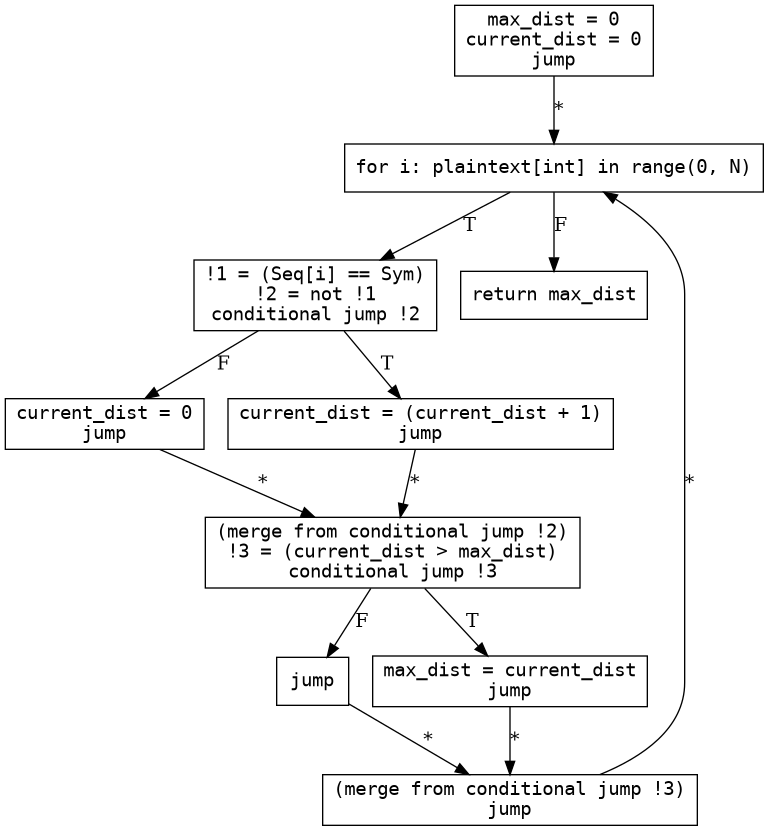
#### SSA
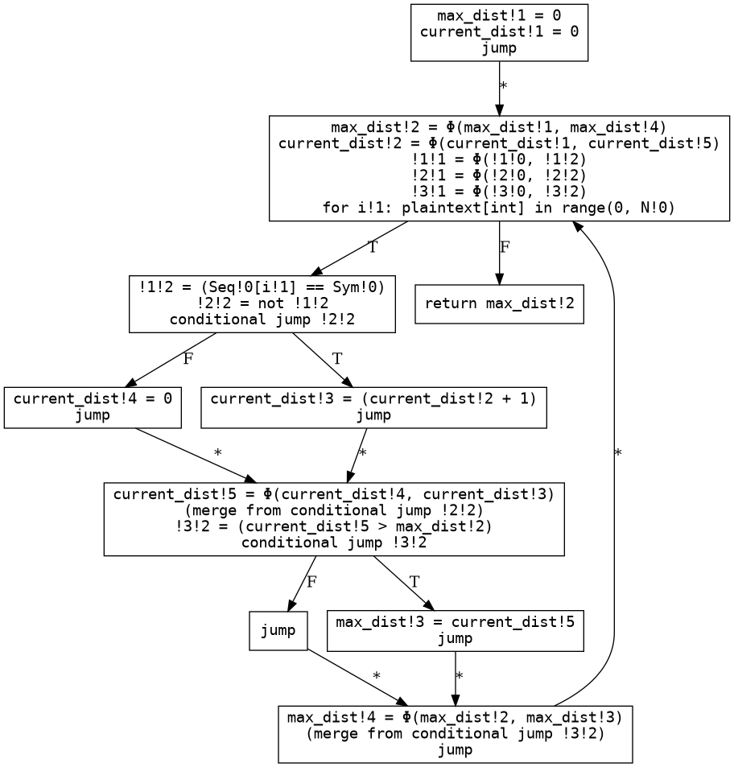
#### SSA ϕ→MUX
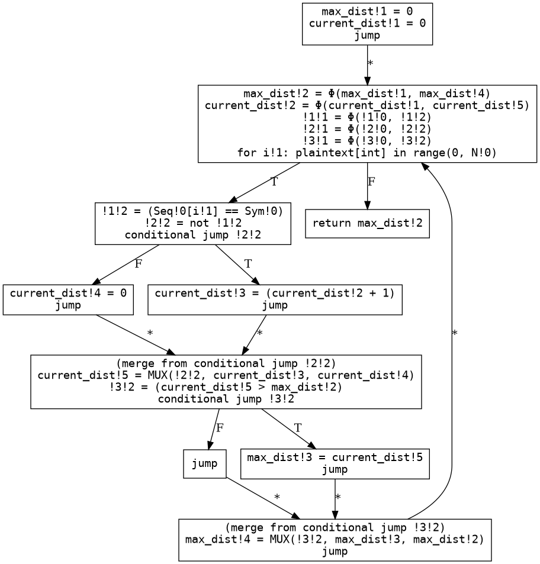
#### Dead code elimination
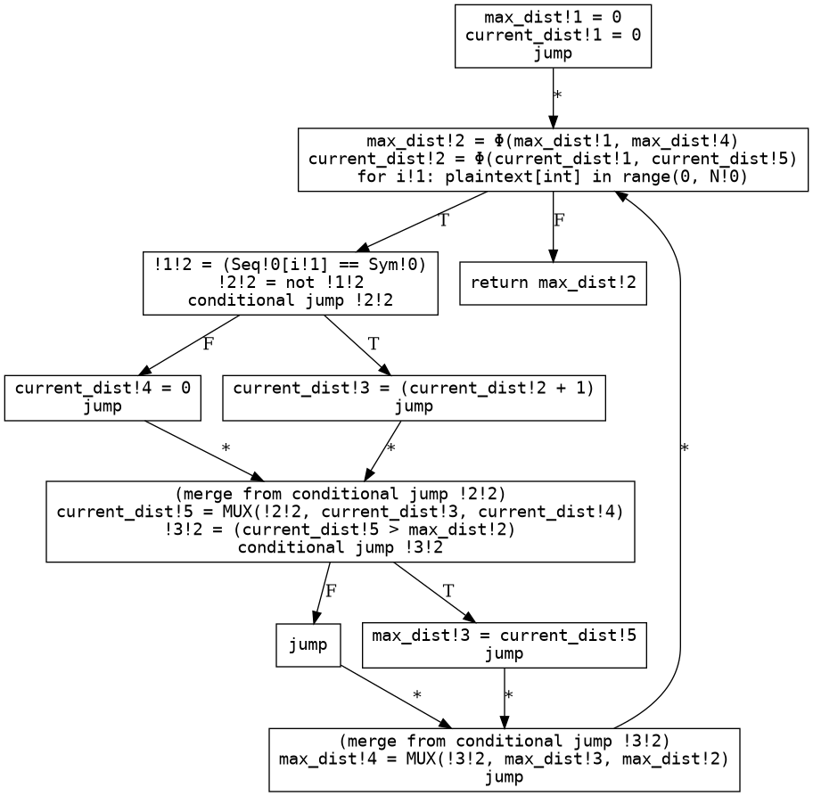
#### Linear code with loops
```python
def max_dist_between_syms(Seq!0: shared[list[int; ?]], N!0: plaintext[int], Sym!0: shared[int]) -> shared[int]:
    max_dist!1 = 0
    current_dist!1 = 0
    for i!1 in range(0, N!0):
        max_dist!2 = Φ(max_dist!1, max_dist!4)
        current_dist!2 = Φ(current_dist!1, current_dist!5)
        !1!2 = (Seq!0[i!1] == Sym!0)
        !2!2 = not !1!2
        current_dist!4 = 0
        current_dist!3 = (current_dist!2 + 1)
        current_dist!5 = MUX(!2!2, current_dist!3, current_dist!4)
        !3!2 = (current_dist!5 > max_dist!2)
        max_dist!3 = current_dist!5
        max_dist!4 = MUX(!3!2, max_dist!3, max_dist!2)
    return max_dist!2
```
#### Dependency graph

#### Removal of infeasible edges
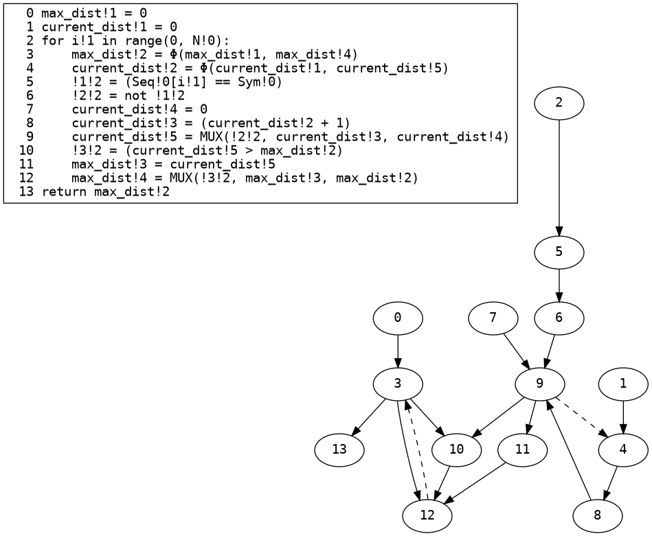
#### Type Environment Before Vectorization
| Variable | Type |
| - | - |
| `Seq!0` | `shared[list[int; ?]]` |
| `N!0` | `plaintext[int]` |
| `Sym!0` | `shared[int]` |
| `i!1` | `plaintext[int]` |
| `max_dist!4` | `shared[int]` |
| `max_dist!2` | `shared[int]` |
| `!3!2` | `shared[bool]` |
| `max_dist!3` | `shared[int]` |
| `current_dist!5` | `shared[int]` |
| `current_dist!2` | `shared[int]` |
| `current_dist!3` | `shared[int]` |
| `current_dist!4` | `plaintext[int]` |
| `!2!2` | `shared[bool]` |
| `!1!2` | `shared[bool]` |
| `current_dist!1` | `plaintext[int]` |
| `max_dist!1` | `plaintext[int]` |
#### Basic Vectorization Phase 1
```python
def max_dist_between_syms(Seq!0: shared[list[int; ?]], N!0: plaintext[int], Sym!0: shared[int]) -> shared[int]:
    max_dist!1 = 0
    current_dist!1 = 0
    !4!0{N!0}[] = lift(max_dist!1, (i!1:N!0))
    !5!0{N!0}[] = lift(current_dist!1, (i!1:N!0))
    !6!0{N!0}[] = lift(Seq!0[i!1], (i!1:N!0))
    !7!0{N!0}[] = lift(Sym!0, (i!1:N!0))
    for i!1 in range(0, N!0):
        max_dist!2{N!0}[] = Φ(!4!0{N!0}[], max_dist!4{N!0}[])
        current_dist!2{N!0}[] = Φ(!5!0{N!0}[], current_dist!5{N!0}[])
        !1!2{N!0}[] = (!6!0{N!0}[] == !7!0{N!0}[])
        !2!2{N!0}[] = not !1!2{N!0}[]
        current_dist!4 = 0
        current_dist!3{N!0}[] = (current_dist!2{N!0}[] + 1)
        current_dist!5{N!0}[] = MUX(!2!2{N!0}[], current_dist!3{N!0}[], current_dist!4)
        !3!2{N!0}[] = (current_dist!5{N!0}[] > max_dist!2{N!0}[])
        max_dist!3{N!0}[] = current_dist!5{N!0}[]
        max_dist!4{N!0}[] = MUX(!3!2{N!0}[], max_dist!3{N!0}[], max_dist!2{N!0}[])
    !8!0 = drop_dim(max_dist!4{N!0}[])
    return !8!0
```
#### Basic Vectorization Phase 1 (dependence graph)
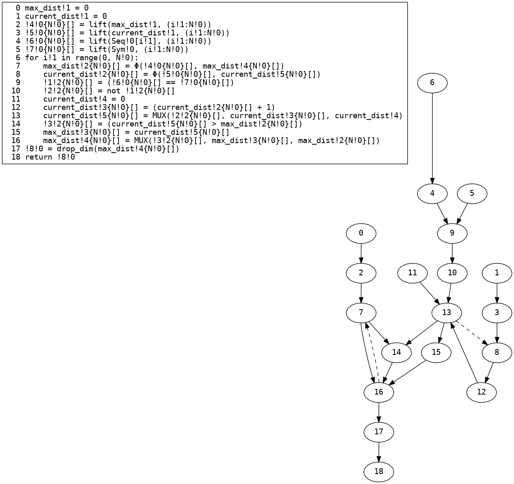
#### Basic Vectorization Phase 2
```python
def max_dist_between_syms(Seq!0: shared[list[int; ?]], N!0: plaintext[int], Sym!0: shared[int]) -> shared[int]:
    max_dist!1 = 0
    current_dist!1 = 0
    !6!0{N!0}[] = lift(Seq!0[i!1], (i!1:N!0))
    !7!0{N!0}[] = lift(Sym!0, (i!1:N!0))
    current_dist!4 = 0
    !4!0{N!0}[] = lift(max_dist!1, (i!1:N!0))
    !5!0{N!0}[] = lift(current_dist!1, (i!1:N!0))
    !1!2{N!0}[] = (!6!0{N!0}[] == !7!0{N!0}[])
    !2!2{N!0}[] = not !1!2{N!0}[]
    for !9!0 in range(0, N!0): (monolithic)
        current_dist!2{}[!9!0] = Φ(!5!0{}[!9!0], current_dist!5{}[(!9!0 - 1)])
        current_dist!3{}[!9!0] = (current_dist!2{}[!9!0] + 1)
        current_dist!5{}[!9!0] = MUX(!2!2{}[!9!0], current_dist!3{}[!9!0], current_dist!4)
    max_dist!3{N!0}[] = current_dist!5{N!0}[]
    for !10!0 in range(0, N!0): (monolithic)
        max_dist!2{}[!10!0] = Φ(!4!0{}[!10!0], max_dist!4{}[(!10!0 - 1)])
        !3!2{}[!10!0] = (current_dist!5{}[!10!0] > max_dist!2{}[!10!0])
        max_dist!4{}[!10!0] = MUX(!3!2{}[!10!0], max_dist!3{}[!10!0], max_dist!2{}[!10!0])
    !8!0 = drop_dim(max_dist!4{N!0}[])
    return !8!0
```
#### Basic Vectorization Phase 2 (dependence graph)
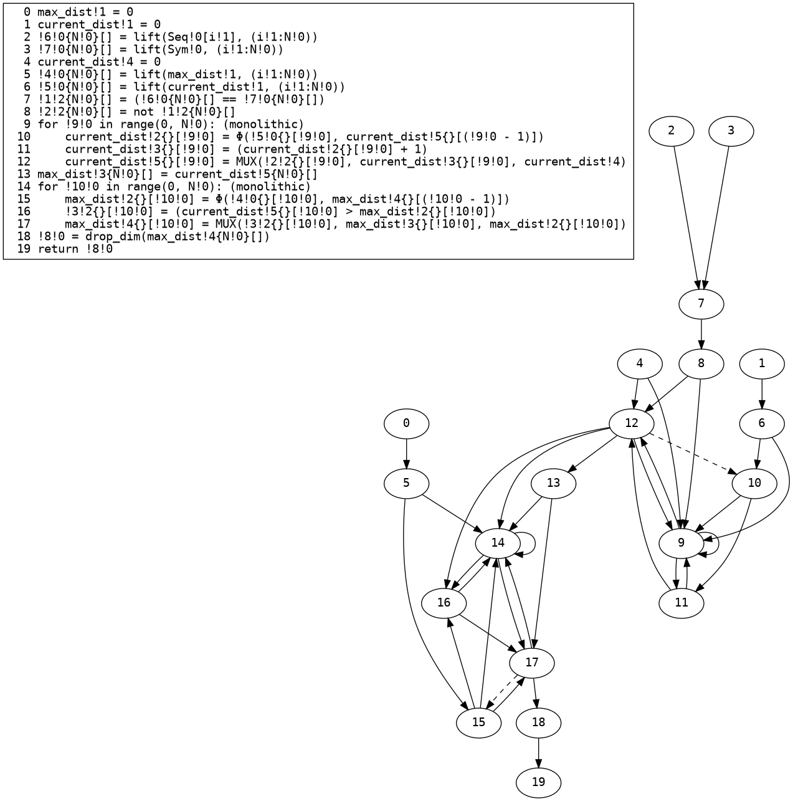
#### Type Environment After Vectorization
| Variable | Type |
| - | - |
| `Seq!0` | `shared[list[int; ?]]` |
| `N!0` | `plaintext[int]` |
| `Sym!0` | `shared[int]` |
| `!9!0` | `plaintext[int]` |
| `!10!0` | `plaintext[int]` |
| `!8!0` | `shared[int]` |
| `max_dist!4` | `shared[list[int; (N!0)]]` |
| `max_dist!2` | `shared[list[int; (N!0)]]` |
| `!3!2` | `shared[list[bool; (N!0)]]` |
| `max_dist!3` | `shared[list[int; (N!0)]]` |
| `current_dist!5` | `shared[list[int; (N!0)]]` |
| `current_dist!2` | `shared[list[int; (N!0)]]` |
| `current_dist!3` | `shared[list[int; (N!0)]]` |
| `!2!2` | `shared[list[bool; (N!0)]]` |
| `!1!2` | `shared[list[bool; (N!0)]]` |
| `!5!0` | `shared[list[int; (N!0)]]` |
| `!4!0` | `shared[list[int; (N!0)]]` |
| `current_dist!4` | `plaintext[int]` |
| `!7!0` | `shared[list[int; (N!0)]]` |
| `!6!0` | `shared[list[int; (N!0)]]` |
| `current_dist!1` | `plaintext[int]` |
| `max_dist!1` | `plaintext[int]` |
#### Copy propagation
```python
def max_dist_between_syms(Seq!0: shared[list[int; ?]], N!0: plaintext[int], Sym!0: shared[int]) -> shared[int]:
    max_dist!1 = 0
    current_dist!1 = 0
    !6!0{N!0}[] = lift(Seq!0[i!1], (i!1:N!0))
    !7!0{N!0}[] = lift(Sym!0, (i!1:N!0))
    current_dist!4 = 0
    !4!0{N!0}[] = lift(max_dist!1, (i!1:N!0))
    !5!0{N!0}[] = lift(current_dist!1, (i!1:N!0))
    !1!2{N!0}[] = (!6!0{N!0}[] == !7!0{N!0}[])
    !2!2{N!0}[] = not !1!2{N!0}[]
    for !9!0 in range(0, N!0): (monolithic)
        current_dist!2{}[!9!0] = Φ(!5!0{}[!9!0], current_dist!5{}[(!9!0 - 1)])
        current_dist!3{}[!9!0] = (current_dist!2{}[!9!0] + 1)
        current_dist!5{}[!9!0] = MUX(!2!2{}[!9!0], current_dist!3{}[!9!0], current_dist!4)
    for !10!0 in range(0, N!0): (monolithic)
        max_dist!2{}[!10!0] = Φ(!4!0{}[!10!0], max_dist!4{}[(!10!0 - 1)])
        !3!2{}[!10!0] = (current_dist!5{}[!10!0] > max_dist!2{}[!10!0])
        max_dist!4{}[!10!0] = MUX(!3!2{}[!10!0], current_dist!5{}[!10!0], max_dist!2{}[!10!0])
    !8!0 = drop_dim(max_dist!4{N!0}[])
    return !8!0
```
#### Common subexpression elimination
```python
def max_dist_between_syms(Seq!0: shared[list[int; ?]], N!0: plaintext[int], Sym!0: shared[int]) -> shared[int]:
    max_dist!1 = 0
    current_dist!1 = 0
    !6!0{N!0}[] = lift(Seq!0[i!1], (i!1:N!0))
    !7!0{N!0}[] = lift(Sym!0, (i!1:N!0))
    current_dist!4 = 0
    !4!0{N!0}[] = lift(max_dist!1, (i!1:N!0))
    !5!0{N!0}[] = lift(current_dist!1, (i!1:N!0))
    !1!2{N!0}[] = (!6!0{N!0}[] == !7!0{N!0}[])
    !2!2{N!0}[] = not !1!2{N!0}[]
    for !9!0 in range(0, N!0): (monolithic)
        current_dist!2{}[!9!0] = Φ(!5!0{}[!9!0], current_dist!5{}[(!9!0 - 1)])
        current_dist!3{}[!9!0] = (current_dist!2{}[!9!0] + 1)
        current_dist!5{}[!9!0] = MUX(!2!2{}[!9!0], current_dist!3{}[!9!0], current_dist!4)
    for !10!0 in range(0, N!0): (monolithic)
        max_dist!2{}[!10!0] = Φ(!4!0{}[!10!0], max_dist!4{}[(!10!0 - 1)])
        !3!2{}[!10!0] = (current_dist!5{}[!10!0] > max_dist!2{}[!10!0])
        max_dist!4{}[!10!0] = MUX(!3!2{}[!10!0], current_dist!5{}[!10!0], max_dist!2{}[!10!0])
    !8!0 = drop_dim(max_dist!4{N!0}[])
    return !8!0
```
#### MOTION mixed configuration
```Total cost:	0.54854
Input vars:	{Sym!0: ['Y'], Seq!0: ['Y']}
Constants:	{0: ['Y'], 1: ['Y']}
Plaintext vars:	{}
Flags:		{}
max_dist!1 = 0: _ -> ['Y'] for 0.00000 * 1 = 0.00
current_dist!1 = 0: _ -> ['Y'] for 0.00000 * 1 = 0.00
!6!0{N!0}[] = lift(Seq!0[i!1], (i!1:N!0)): _ -> ['Y'] for 0.00000 * 1 = 0.00
!7!0{N!0}[] = lift(Sym!0, (i!1:N!0)): _ -> ['Y'] for 0.00000 * 1 = 0.00
current_dist!4 = 0: _ -> ['Y'] for 0.00000 * 1 = 0.00
!4!0{N!0}[] = lift(max_dist!1, (i!1:N!0)): _ -> ['Y'] for 0.00000 * 1 = 0.00
!5!0{N!0}[] = lift(current_dist!1, (i!1:N!0)): _ -> ['Y'] for 0.00000 * 1 = 0.00
!1!2{N!0}[] = (!6!0{N!0}[] == !7!0{N!0}[]): Y -> {} for 0.01528 * 1 = 0.02
!2!2{N!0}[] = not !1!2{N!0}[]: Y -> {} for 0.00000 * 1 = 0.00
	current_dist!2{}[!9!0] = Φ(!5!0{}[!9!0], current_dist!5{}[(!9!0 - 1)]): Y -> {} for 0.00000 * 8 = 0.00
	current_dist!3{}[!9!0] = (current_dist!2{}[!9!0] + 1): Y -> {} for 0.02351 * 8 = 0.19
	current_dist!5{}[!9!0] = MUX(!2!2{}[!9!0], current_dist!3{}[!9!0], current_dist!4): Y -> {} for 0.00597 * 8 = 0.05
	max_dist!2{}[!10!0] = Φ(!4!0{}[!10!0], max_dist!4{}[(!10!0 - 1)]): Y -> {} for 0.00000 * 8 = 0.00
	!3!2{}[!10!0] = (current_dist!5{}[!10!0] > max_dist!2{}[!10!0]): Y -> {} for 0.03120 * 8 = 0.25
	max_dist!4{}[!10!0] = MUX(!3!2{}[!10!0], current_dist!5{}[!10!0], max_dist!2{}[!10!0]): Y -> {} for 0.00597 * 8 = 0.05
!8!0 = drop_dim(max_dist!4{N!0}[]): _ -> ['Y'] for 0.00000 * 1 = 0.00
return !8!0
Output vars:	{!8!0: ['Y']}

```
#### MOTION code
```cpp
template <encrypto::motion::MpcProtocol Protocol>
encrypto::motion::SecureUnsignedInteger max_dist_between_syms(
    encrypto::motion::PartyPointer &party,
    std::vector<encrypto::motion::SecureUnsignedInteger> Seq_0,
    std::uint32_t _MPC_PLAINTEXT_N_0,
    encrypto::motion::SecureUnsignedInteger Sym_0
) {
    // Shared variable declarations
    std::vector<encrypto::motion::ShareWrapper> _1_2((_MPC_PLAINTEXT_N_0));
    encrypto::motion::SecureUnsignedInteger _10_0;
    std::vector<encrypto::motion::ShareWrapper> _2_2((_MPC_PLAINTEXT_N_0));
    std::vector<encrypto::motion::ShareWrapper> _3_2((_MPC_PLAINTEXT_N_0));
    std::vector<encrypto::motion::SecureUnsignedInteger> _4_0((_MPC_PLAINTEXT_N_0));
    std::vector<encrypto::motion::SecureUnsignedInteger> _5_0((_MPC_PLAINTEXT_N_0));
    std::vector<encrypto::motion::SecureUnsignedInteger> _6_0((_MPC_PLAINTEXT_N_0));
    std::vector<encrypto::motion::SecureUnsignedInteger> _7_0((_MPC_PLAINTEXT_N_0));
    encrypto::motion::SecureUnsignedInteger _8_0;
    encrypto::motion::SecureUnsignedInteger _9_0;
    encrypto::motion::SecureUnsignedInteger N_0;
    encrypto::motion::SecureUnsignedInteger current_dist_1;
    std::vector<encrypto::motion::SecureUnsignedInteger> current_dist_2((_MPC_PLAINTEXT_N_0));
    std::vector<encrypto::motion::SecureUnsignedInteger> current_dist_3((_MPC_PLAINTEXT_N_0));
    encrypto::motion::SecureUnsignedInteger current_dist_4;
    std::vector<encrypto::motion::SecureUnsignedInteger> current_dist_5((_MPC_PLAINTEXT_N_0));
    encrypto::motion::SecureUnsignedInteger max_dist_1;
    std::vector<encrypto::motion::SecureUnsignedInteger> max_dist_2((_MPC_PLAINTEXT_N_0));
    std::vector<encrypto::motion::SecureUnsignedInteger> max_dist_4((_MPC_PLAINTEXT_N_0));

    // Plaintext variable declarations
    std::uint32_t _MPC_PLAINTEXT__10_0;
    std::uint32_t _MPC_PLAINTEXT__9_0;
    std::uint32_t _MPC_PLAINTEXT_current_dist_1;
    std::uint32_t _MPC_PLAINTEXT_current_dist_4;
    std::uint32_t _MPC_PLAINTEXT_max_dist_1;

    // Constant initializations
    encrypto::motion::SecureUnsignedInteger _MPC_CONSTANT_0 = party->In<Protocol>(encrypto::motion::ToInput(std::uint32_t(0)), 0);
    encrypto::motion::SecureUnsignedInteger _MPC_CONSTANT_1 = party->In<Protocol>(encrypto::motion::ToInput(std::uint32_t(1)), 0);

    // Plaintext parameter assignments
    N_0 = party->In<Protocol>(encrypto::motion::ToInput(_MPC_PLAINTEXT_N_0), 0);

    // Function body
    max_dist_1 = _MPC_CONSTANT_0;
    _MPC_PLAINTEXT_max_dist_1 = std::uint32_t(0);
    current_dist_1 = _MPC_CONSTANT_0;
    _MPC_PLAINTEXT_current_dist_1 = std::uint32_t(0);
    vectorized_assign(_6_0, {_MPC_PLAINTEXT_N_0}, {true}, {}, lift(std::function([&](const std::vector<std::uint32_t> &indices){return Seq_0[indices[0]];}), {_MPC_PLAINTEXT_N_0}));
    vectorized_assign(_7_0, {_MPC_PLAINTEXT_N_0}, {true}, {}, lift(std::function([&](const std::vector<std::uint32_t> &indices){return Sym_0;}), {_MPC_PLAINTEXT_N_0}));
    current_dist_4 = _MPC_CONSTANT_0;
    _MPC_PLAINTEXT_current_dist_4 = std::uint32_t(0);
    vectorized_assign(_4_0, {_MPC_PLAINTEXT_N_0}, {true}, {}, lift(std::function([&](const std::vector<std::uint32_t> &indices){return max_dist_1;}), {_MPC_PLAINTEXT_N_0}));
    vectorized_assign(_5_0, {_MPC_PLAINTEXT_N_0}, {true}, {}, lift(std::function([&](const std::vector<std::uint32_t> &indices){return current_dist_1;}), {_MPC_PLAINTEXT_N_0}));
    vectorized_assign(_1_2, {_MPC_PLAINTEXT_N_0}, {true}, {}, (to_share_wrapper(vectorized_access(_6_0, {_MPC_PLAINTEXT_N_0}, {true}, {})) == to_share_wrapper(vectorized_access(_7_0, {_MPC_PLAINTEXT_N_0}, {true}, {}))));
    vectorized_assign(_2_2, {_MPC_PLAINTEXT_N_0}, {true}, {}, (~vectorized_access(_1_2, {_MPC_PLAINTEXT_N_0}, {true}, {})));

    // Initialize loop counter
    _MPC_PLAINTEXT__9_0 = std::uint32_t(0);
    // Initialize phi values
    current_dist_2[_MPC_PLAINTEXT__9_0] = _5_0[_MPC_PLAINTEXT__9_0];
    for (; _MPC_PLAINTEXT__9_0 < _MPC_PLAINTEXT_N_0; _MPC_PLAINTEXT__9_0++) {
        // Update phi values
        if (_MPC_PLAINTEXT__9_0 != std::uint32_t(0)) {
            current_dist_2[_MPC_PLAINTEXT__9_0] = current_dist_5[(_MPC_PLAINTEXT__9_0 - std::uint32_t(1))];
        }

        current_dist_3[_MPC_PLAINTEXT__9_0] = (current_dist_2[_MPC_PLAINTEXT__9_0] + _MPC_CONSTANT_1);
        current_dist_5[_MPC_PLAINTEXT__9_0] = _2_2[_MPC_PLAINTEXT__9_0].Mux(current_dist_3[_MPC_PLAINTEXT__9_0].Get(), current_dist_4.Get());

    }


    // Initialize loop counter
    _MPC_PLAINTEXT__10_0 = std::uint32_t(0);
    // Initialize phi values
    max_dist_2[_MPC_PLAINTEXT__10_0] = _4_0[_MPC_PLAINTEXT__10_0];
    for (; _MPC_PLAINTEXT__10_0 < _MPC_PLAINTEXT_N_0; _MPC_PLAINTEXT__10_0++) {
        // Update phi values
        if (_MPC_PLAINTEXT__10_0 != std::uint32_t(0)) {
            max_dist_2[_MPC_PLAINTEXT__10_0] = max_dist_4[(_MPC_PLAINTEXT__10_0 - std::uint32_t(1))];
        }

        _3_2[_MPC_PLAINTEXT__10_0] = (current_dist_5[_MPC_PLAINTEXT__10_0] > max_dist_2[_MPC_PLAINTEXT__10_0]);
        max_dist_4[_MPC_PLAINTEXT__10_0] = _3_2[_MPC_PLAINTEXT__10_0].Mux(current_dist_5[_MPC_PLAINTEXT__10_0].Get(), max_dist_2[_MPC_PLAINTEXT__10_0].Get());

    }

    _8_0 = drop_dim_monoreturn(vectorized_access(max_dist_4, {_MPC_PLAINTEXT_N_0}, {true}, {}).Unsimdify(), {_MPC_PLAINTEXT_N_0});
    return _8_0;

}
```
#### MOTION mixed code
```cpp
encrypto::motion::SecureUnsignedInteger max_dist_between_syms(
    encrypto::motion::PartyPointer &party,
    std::vector<encrypto::motion::SecureUnsignedInteger> Seq_0,
    std::uint32_t _MPC_PLAINTEXT_N_0,
    encrypto::motion::SecureUnsignedInteger Sym_0
) {
    // Shared variable declarations
    std::vector<encrypto::motion::ShareWrapper> _1_2((_MPC_PLAINTEXT_N_0));
    encrypto::motion::SecureUnsignedInteger _10_0;
    std::vector<encrypto::motion::ShareWrapper> _2_2((_MPC_PLAINTEXT_N_0));
    std::vector<encrypto::motion::ShareWrapper> _3_2((_MPC_PLAINTEXT_N_0));
    std::vector<encrypto::motion::SecureUnsignedInteger> _4_0((_MPC_PLAINTEXT_N_0));
    std::vector<encrypto::motion::SecureUnsignedInteger> _5_0((_MPC_PLAINTEXT_N_0));
    std::vector<encrypto::motion::SecureUnsignedInteger> _6_0((_MPC_PLAINTEXT_N_0));
    std::vector<encrypto::motion::SecureUnsignedInteger> _7_0((_MPC_PLAINTEXT_N_0));
    encrypto::motion::SecureUnsignedInteger _8_0;
    encrypto::motion::SecureUnsignedInteger _9_0;
    encrypto::motion::SecureUnsignedInteger N_0;
    encrypto::motion::SecureUnsignedInteger current_dist_1;
    std::vector<encrypto::motion::SecureUnsignedInteger> current_dist_2((_MPC_PLAINTEXT_N_0));
    std::vector<encrypto::motion::SecureUnsignedInteger> current_dist_3((_MPC_PLAINTEXT_N_0));
    encrypto::motion::SecureUnsignedInteger current_dist_4;
    std::vector<encrypto::motion::SecureUnsignedInteger> current_dist_5((_MPC_PLAINTEXT_N_0));
    encrypto::motion::SecureUnsignedInteger max_dist_1;
    std::vector<encrypto::motion::SecureUnsignedInteger> max_dist_2((_MPC_PLAINTEXT_N_0));
    std::vector<encrypto::motion::SecureUnsignedInteger> max_dist_4((_MPC_PLAINTEXT_N_0));

    // Plaintext variable declarations
    std::uint32_t _MPC_PLAINTEXT__10_0;
    std::uint32_t _MPC_PLAINTEXT__9_0;
    std::uint32_t _MPC_PLAINTEXT_current_dist_1;
    std::uint32_t _MPC_PLAINTEXT_current_dist_4;
    std::uint32_t _MPC_PLAINTEXT_max_dist_1;

    // Constant initializations
    encrypto::motion::SecureUnsignedInteger _MPC_CONSTANT_0 = party->In<encrypto::motion::MpcProtocol::kBmr>(encrypto::motion::ToInput(std::uint32_t(0)), 0);
    encrypto::motion::SecureUnsignedInteger _MPC_CONSTANT_1 = party->In<encrypto::motion::MpcProtocol::kBmr>(encrypto::motion::ToInput(std::uint32_t(1)), 0);

    // Input Protocol Convertions

    // Plaintext parameter assignments

    // Function body
    max_dist_1 = _MPC_CONSTANT_0;
    _MPC_PLAINTEXT_max_dist_1 = std::uint32_t(0);
    current_dist_1 = _MPC_CONSTANT_0;
    _MPC_PLAINTEXT_current_dist_1 = std::uint32_t(0);
    vectorized_assign(_6_0, {_MPC_PLAINTEXT_N_0}, {true}, {}, lift(std::function([&](const std::vector<std::uint32_t> &indices){return Seq_0[indices[0]];}), {_MPC_PLAINTEXT_N_0}));
    vectorized_assign(_7_0, {_MPC_PLAINTEXT_N_0}, {true}, {}, lift(std::function([&](const std::vector<std::uint32_t> &indices){return Sym_0;}), {_MPC_PLAINTEXT_N_0}));
    current_dist_4 = _MPC_CONSTANT_0;
    _MPC_PLAINTEXT_current_dist_4 = std::uint32_t(0);
    vectorized_assign(_4_0, {_MPC_PLAINTEXT_N_0}, {true}, {}, lift(std::function([&](const std::vector<std::uint32_t> &indices){return max_dist_1;}), {_MPC_PLAINTEXT_N_0}));
    vectorized_assign(_5_0, {_MPC_PLAINTEXT_N_0}, {true}, {}, lift(std::function([&](const std::vector<std::uint32_t> &indices){return current_dist_1;}), {_MPC_PLAINTEXT_N_0}));
    vectorized_assign(_1_2, {_MPC_PLAINTEXT_N_0}, {true}, {}, (to_share_wrapper(vectorized_access(_6_0, {_MPC_PLAINTEXT_N_0}, {true}, {})) == to_share_wrapper(vectorized_access(_7_0, {_MPC_PLAINTEXT_N_0}, {true}, {}))));
    vectorized_assign(_2_2, {_MPC_PLAINTEXT_N_0}, {true}, {}, (~vectorized_access(_1_2, {_MPC_PLAINTEXT_N_0}, {true}, {})));

    // Initialize loop counter
    _MPC_PLAINTEXT__9_0 = std::uint32_t(0);
    // Initialize phi values
    current_dist_2[_MPC_PLAINTEXT__9_0] = _5_0[_MPC_PLAINTEXT__9_0];
    for (; _MPC_PLAINTEXT__9_0 < _MPC_PLAINTEXT_N_0; _MPC_PLAINTEXT__9_0++) {
        // Update phi values
        if (_MPC_PLAINTEXT__9_0 != std::uint32_t(0)) {
            current_dist_2[_MPC_PLAINTEXT__9_0] = current_dist_5[(_MPC_PLAINTEXT__9_0 - std::uint32_t(1))];
        }

        current_dist_3[_MPC_PLAINTEXT__9_0] = (current_dist_2[_MPC_PLAINTEXT__9_0] + _MPC_CONSTANT_1);
        current_dist_5[_MPC_PLAINTEXT__9_0] = _2_2[_MPC_PLAINTEXT__9_0].Mux(current_dist_3[_MPC_PLAINTEXT__9_0].Get(), current_dist_4.Get());

    }


    // Initialize loop counter
    _MPC_PLAINTEXT__10_0 = std::uint32_t(0);
    // Initialize phi values
    max_dist_2[_MPC_PLAINTEXT__10_0] = _4_0[_MPC_PLAINTEXT__10_0];
    for (; _MPC_PLAINTEXT__10_0 < _MPC_PLAINTEXT_N_0; _MPC_PLAINTEXT__10_0++) {
        // Update phi values
        if (_MPC_PLAINTEXT__10_0 != std::uint32_t(0)) {
            max_dist_2[_MPC_PLAINTEXT__10_0] = max_dist_4[(_MPC_PLAINTEXT__10_0 - std::uint32_t(1))];
        }

        _3_2[_MPC_PLAINTEXT__10_0] = (current_dist_5[_MPC_PLAINTEXT__10_0] > max_dist_2[_MPC_PLAINTEXT__10_0]);
        max_dist_4[_MPC_PLAINTEXT__10_0] = _3_2[_MPC_PLAINTEXT__10_0].Mux(current_dist_5[_MPC_PLAINTEXT__10_0].Get(), max_dist_2[_MPC_PLAINTEXT__10_0].Get());

    }

    _8_0 = drop_dim_monoreturn(vectorized_access(max_dist_4, {_MPC_PLAINTEXT_N_0}, {true}, {}).Unsimdify(), {_MPC_PLAINTEXT_N_0});
    return _8_0;

}
```
#### MP-SPDZ mixed configuration
```Total cost:	0.00020
Input vars:	{Sym!0: ['B'], Seq!0: ['B']}
Constants:	{0: ['B'], 1: ['B']}
Plaintext vars:	{}
Flags:		{X}
max_dist!1 = 0: _ -> ['B'] for 0.00000 * 1 = 0.00
current_dist!1 = 0: _ -> ['B'] for 0.00000 * 1 = 0.00
!6!0{N!0}[] = lift(Seq!0[i!1], (i!1:N!0)): _ -> ['B'] for 0.00000 * 1 = 0.00
!7!0{N!0}[] = lift(Sym!0, (i!1:N!0)): _ -> ['B'] for 0.00000 * 1 = 0.00
current_dist!4 = 0: _ -> ['B'] for 0.00000 * 1 = 0.00
!4!0{N!0}[] = lift(max_dist!1, (i!1:N!0)): _ -> ['B'] for 0.00000 * 1 = 0.00
!5!0{N!0}[] = lift(current_dist!1, (i!1:N!0)): _ -> ['B'] for 0.00000 * 1 = 0.00
!1!2{N!0}[] = (!6!0{N!0}[] == !7!0{N!0}[]): B -> {} for 0.00003 * 1 = 0.00
!2!2{N!0}[] = not !1!2{N!0}[]: B -> {} for 0.00000 * 1 = 0.00
	current_dist!2{}[!9!0] = Φ(!5!0{}[!9!0], current_dist!5{}[(!9!0 - 1)]): B -> {} for 0.00000 * 8 = 0.00
	current_dist!3{}[!9!0] = (current_dist!2{}[!9!0] + 1): B -> {} for 0.00001 * 8 = 0.00
	current_dist!5{}[!9!0] = MUX(!2!2{}[!9!0], current_dist!3{}[!9!0], current_dist!4): B -> {} for 0.00000 * 8 = 0.00
	max_dist!2{}[!10!0] = Φ(!4!0{}[!10!0], max_dist!4{}[(!10!0 - 1)]): B -> {} for 0.00000 * 8 = 0.00
	!3!2{}[!10!0] = (current_dist!5{}[!10!0] > max_dist!2{}[!10!0]): B -> {} for 0.00001 * 8 = 0.00
	max_dist!4{}[!10!0] = MUX(!3!2{}[!10!0], current_dist!5{}[!10!0], max_dist!2{}[!10!0]): B -> {} for 0.00000 * 8 = 0.00
!8!0 = drop_dim(max_dist!4{N!0}[]): _ -> ['B'] for 0.00000 * 1 = 0.00
return !8!0
Output vars:	{!8!0: ['B']}

```
#### MP-SPDZ code
```py
def max_dist_between_syms(Seq_0, N_0, Sym_0):
    # Shared array declarations
    _1_2 = [None] * (N_0)
    _2_2 = [None] * (N_0)
    _3_2 = [None] * (N_0)
    _4_0 = [None] * (N_0)
    _5_0 = [None] * (N_0)
    _6_0 = [None] * (N_0)
    _7_0 = [None] * (N_0)
    current_dist_2 = [None] * (N_0)
    current_dist_3 = [None] * (N_0)
    current_dist_5 = [None] * (N_0)
    max_dist_2 = [None] * (N_0)
    max_dist_4 = [None] * (N_0)
    # Function body
    max_dist_1 = sint(0)
    current_dist_1 = sint(0)
    _6_0 = _v.lift(lambda indices: (Seq_0[indices[0]]), [N_0])
    _7_0 = _v.lift(lambda indices: Sym_0, [N_0])
    current_dist_4 = sint(0)
    _4_0 = _v.lift(lambda indices: max_dist_1, [N_0])
    _5_0 = _v.lift(lambda indices: current_dist_1, [N_0])
    _v.vectorized_assign(_1_2, [N_0], [None], (_v.vectorized_access_simd(_6_0, [N_0], [None]) == _v.vectorized_access_simd(_7_0, [N_0], [None])))
    _v.vectorized_assign(_2_2, [N_0], [None], (_v.vectorized_access_simd(_1_2, [N_0], [None]).bit_not()))
    for _9_0 in range(0, N_0):
        # Set ϕ value
        if _9_0 == 0:
            _v.vectorized_assign(current_dist_2, [N_0], [_9_0], _v.vectorized_access(_5_0, [N_0], [_9_0]))
        else:
            _v.vectorized_assign(current_dist_2, [N_0], [_9_0], _v.vectorized_access(current_dist_5, [N_0], [(_9_0 - 1)]))
        _v.vectorized_assign(current_dist_3, [N_0], [_9_0], (_v.vectorized_access_simd(current_dist_2, [N_0], [_9_0]) + sint(1)))
        _v.iterative_mux(current_dist_5,_2_2,current_dist_3,current_dist_4,[N_0],[_9_0])
    # Loop exit ϕ values
    _v.vectorized_assign(current_dist_2, [N_0], [_9_0], _v.vectorized_access(current_dist_5, [N_0], [(_9_0 - 1)]))
    for _10_0 in range(0, N_0):
        # Set ϕ value
        if _10_0 == 0:
            _v.vectorized_assign(max_dist_2, [N_0], [_10_0], _v.vectorized_access(_4_0, [N_0], [_10_0]))
        else:
            _v.vectorized_assign(max_dist_2, [N_0], [_10_0], _v.vectorized_access(max_dist_4, [N_0], [(_10_0 - 1)]))
        _v.vectorized_assign(_3_2, [N_0], [_10_0], (_v.vectorized_access_simd(current_dist_5, [N_0], [_10_0]) > _v.vectorized_access_simd(max_dist_2, [N_0], [_10_0])))
        _v.iterative_mux(max_dist_4,_3_2,current_dist_5,max_dist_2,[N_0],[_10_0])
    # Loop exit ϕ values
    _v.vectorized_assign(max_dist_2, [N_0], [_10_0], _v.vectorized_access(max_dist_4, [N_0], [(_10_0 - 1)]))
    _8_0 = _v.drop_dim(max_dist_4, [N_0])
    return _8_0
```
#### MP-SPDZ mixed code
```py
program.options.binary = 32
program.use_dabit = True
def max_dist_between_syms(Seq_0, N_0, Sym_0):
    # Convertion functions
    siv32 = sbitintvec.get_type(32)
    sb32 = sbits.get_type(32)
    
    
    # Shared array declarations
    _1_2 = [None] * (N_0)
    _2_2 = [None] * (N_0)
    _3_2 = [None] * (N_0)
    _4_0 = [None] * (N_0)
    _5_0 = [None] * (N_0)
    _6_0 = [None] * (N_0)
    _7_0 = [None] * (N_0)
    current_dist_2 = [None] * (N_0)
    current_dist_3 = [None] * (N_0)
    current_dist_5 = [None] * (N_0)
    max_dist_2 = [None] * (N_0)
    max_dist_4 = [None] * (N_0)
    # Shared array convertion declarations
    
    # Function body
    max_dist_1 = siv32(0)
    current_dist_1 = siv32(0)
    _6_0 = _v.lift(lambda indices: (Seq_0[indices[0]]), [N_0])
    _7_0 = _v.lift(lambda indices: Sym_0, [N_0])
    current_dist_4 = siv32(0)
    _4_0 = _v.lift(lambda indices: max_dist_1, [N_0])
    _5_0 = _v.lift(lambda indices: current_dist_1, [N_0])
    _v.vectorized_assign(_1_2, [N_0], [None], (_v.vectorized_access_simd(_6_0, [N_0], [None]) == _v.vectorized_access_simd(_7_0, [N_0], [None])))
    _v.vectorized_assign(_2_2, [N_0], [None], (_v.vectorized_access_simd(_1_2, [N_0], [None]).bit_not()))
    for _9_0 in range(0, N_0):
        # Set ϕ value
        if _9_0 == 0:
            _v.vectorized_assign(current_dist_2, [N_0], [_9_0], _v.vectorized_access(_5_0, [N_0], [_9_0]))
        else:
            _v.vectorized_assign(current_dist_2, [N_0], [_9_0], _v.vectorized_access(current_dist_5, [N_0], [(_9_0 - 1)]))
        _v.vectorized_assign(current_dist_3, [N_0], [_9_0], (_v.vectorized_access_simd(current_dist_2, [N_0], [_9_0]) + siv32(1)))
        _v.iterative_mux(current_dist_5,_2_2,current_dist_3,current_dist_4,[N_0],[_9_0])
    # Loop exit ϕ values
    _v.vectorized_assign(current_dist_2, [N_0], [_9_0], _v.vectorized_access(current_dist_5, [N_0], [(_9_0 - 1)]))
    for _10_0 in range(0, N_0):
        # Set ϕ value
        if _10_0 == 0:
            _v.vectorized_assign(max_dist_2, [N_0], [_10_0], _v.vectorized_access(_4_0, [N_0], [_10_0]))
        else:
            _v.vectorized_assign(max_dist_2, [N_0], [_10_0], _v.vectorized_access(max_dist_4, [N_0], [(_10_0 - 1)]))
        _v.vectorized_assign(_3_2, [N_0], [_10_0], (_v.vectorized_access_simd(current_dist_5, [N_0], [_10_0]) > _v.vectorized_access_simd(max_dist_2, [N_0], [_10_0])))
        _v.iterative_mux(max_dist_4,_3_2,current_dist_5,max_dist_2,[N_0],[_10_0])
    # Loop exit ϕ values
    _v.vectorized_assign(max_dist_2, [N_0], [_10_0], _v.vectorized_access(max_dist_4, [N_0], [(_10_0 - 1)]))
    _8_0 = _v.drop_dim(max_dist_4, [N_0])
    return _8_0
```
### `max_sum_between_syms`
#### Input
```python
from UTIL import shared


def max_sum_between_syms(
    Seq: shared[list[int]], N: int, Sym: shared[int]
) -> shared[int]:
    max_sum = 0
    current_sum = 0
    for i in range(0, N):
        if not (Seq[i] == Sym):
            current_sum = current_sum + Seq[i]
        else:
            current_sum = 0

        if current_sum > max_sum:
            max_sum = current_sum
    return max_sum


Seq = [1, 2, 1, 1, 2, 3, 4, 1]
N = 8
Sym = 1
print(max_sum_between_syms(Seq, N, Sym))

```
#### Restricted AST
```python
def max_sum_between_syms(Seq: shared[list[int; ?]], N: plaintext[int], Sym: shared[int]) -> shared[int]:
    max_sum = 0
    current_sum = 0
    for i: plaintext[int] in range(0, N):
        if not (Seq[i] == Sym):
            current_sum = (current_sum + Seq[i])
        else:
            current_sum = 0
        if (current_sum > max_sum):
            max_sum = current_sum
    return max_sum
```
#### Three-address code CFG
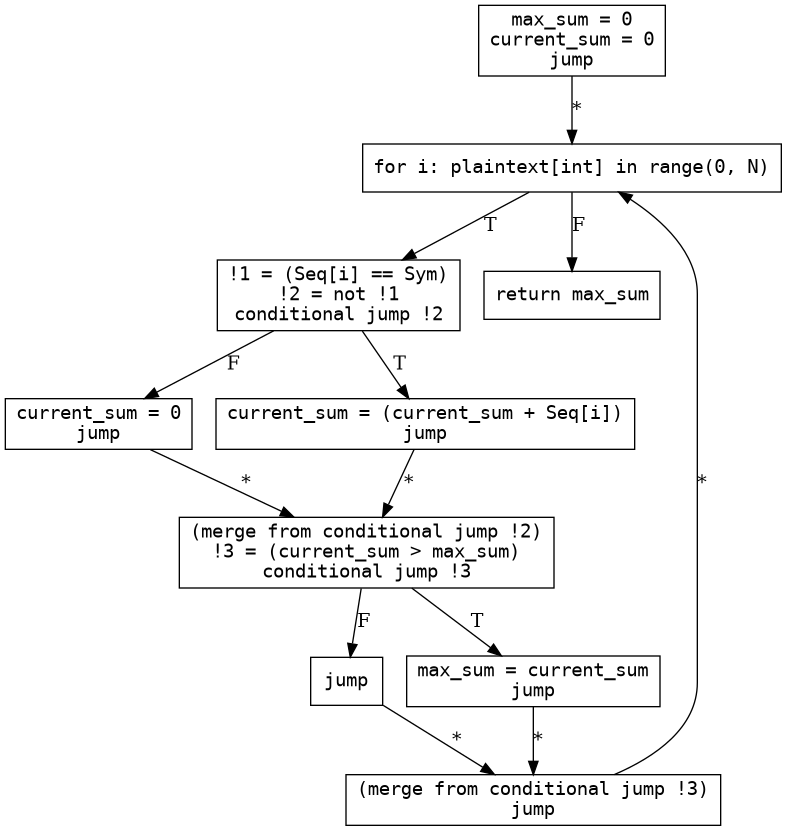
#### SSA
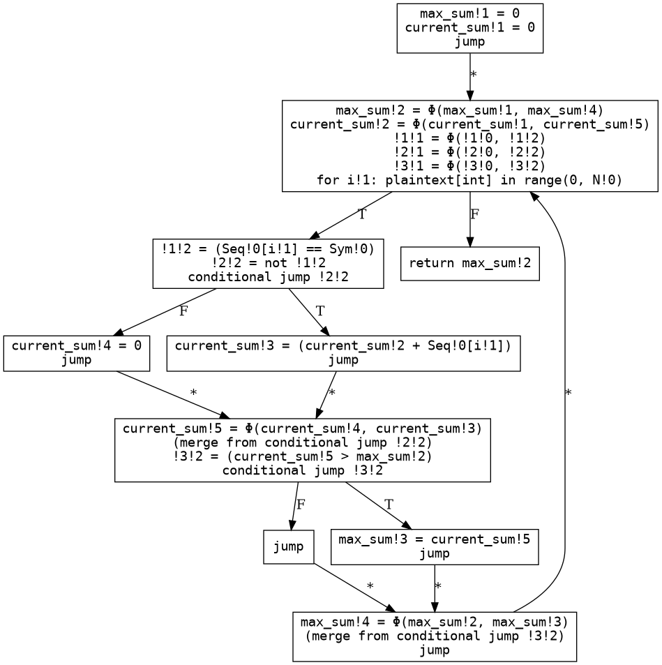
#### SSA ϕ→MUX
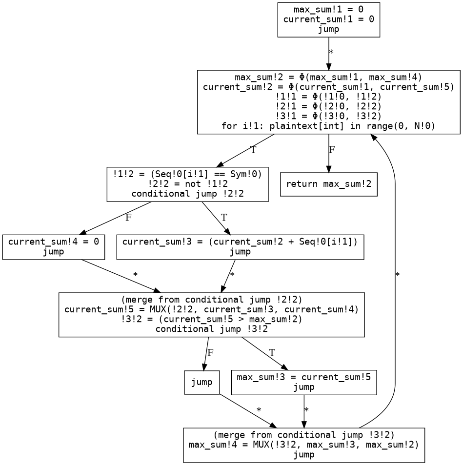
#### Dead code elimination
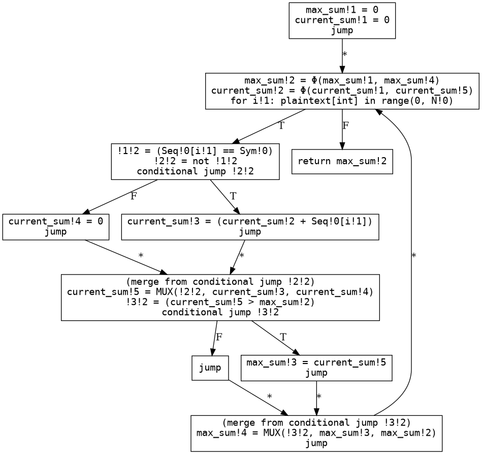
#### Linear code with loops
```python
def max_sum_between_syms(Seq!0: shared[list[int; ?]], N!0: plaintext[int], Sym!0: shared[int]) -> shared[int]:
    max_sum!1 = 0
    current_sum!1 = 0
    for i!1 in range(0, N!0):
        max_sum!2 = Φ(max_sum!1, max_sum!4)
        current_sum!2 = Φ(current_sum!1, current_sum!5)
        !1!2 = (Seq!0[i!1] == Sym!0)
        !2!2 = not !1!2
        current_sum!4 = 0
        current_sum!3 = (current_sum!2 + Seq!0[i!1])
        current_sum!5 = MUX(!2!2, current_sum!3, current_sum!4)
        !3!2 = (current_sum!5 > max_sum!2)
        max_sum!3 = current_sum!5
        max_sum!4 = MUX(!3!2, max_sum!3, max_sum!2)
    return max_sum!2
```
#### Dependency graph
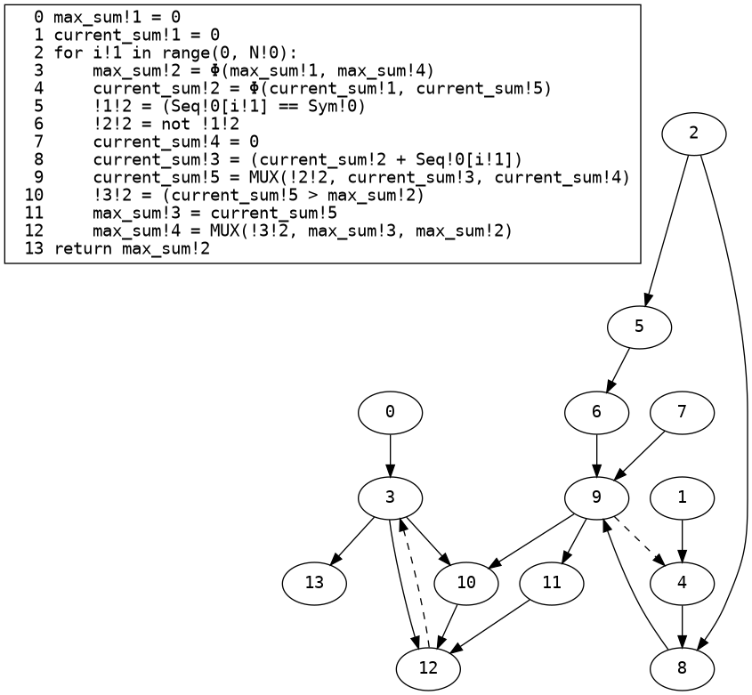
#### Removal of infeasible edges

#### Type Environment Before Vectorization
| Variable | Type |
| - | - |
| `Seq!0` | `shared[list[int; ?]]` |
| `N!0` | `plaintext[int]` |
| `Sym!0` | `shared[int]` |
| `i!1` | `plaintext[int]` |
| `max_sum!4` | `shared[int]` |
| `max_sum!2` | `shared[int]` |
| `!3!2` | `shared[bool]` |
| `max_sum!3` | `shared[int]` |
| `current_sum!5` | `shared[int]` |
| `current_sum!2` | `shared[int]` |
| `current_sum!3` | `shared[int]` |
| `current_sum!4` | `plaintext[int]` |
| `!2!2` | `shared[bool]` |
| `!1!2` | `shared[bool]` |
| `current_sum!1` | `plaintext[int]` |
| `max_sum!1` | `plaintext[int]` |
#### Basic Vectorization Phase 1
```python
def max_sum_between_syms(Seq!0: shared[list[int; ?]], N!0: plaintext[int], Sym!0: shared[int]) -> shared[int]:
    max_sum!1 = 0
    current_sum!1 = 0
    !4!0{N!0}[] = lift(max_sum!1, (i!1:N!0))
    !5!0{N!0}[] = lift(current_sum!1, (i!1:N!0))
    !6!0{N!0}[] = lift(Seq!0[i!1], (i!1:N!0))
    !7!0{N!0}[] = lift(Sym!0, (i!1:N!0))
    !8!0{N!0}[] = lift(Seq!0[i!1], (i!1:N!0))
    for i!1 in range(0, N!0):
        max_sum!2{N!0}[] = Φ(!4!0{N!0}[], max_sum!4{N!0}[])
        current_sum!2{N!0}[] = Φ(!5!0{N!0}[], current_sum!5{N!0}[])
        !1!2{N!0}[] = (!6!0{N!0}[] == !7!0{N!0}[])
        !2!2{N!0}[] = not !1!2{N!0}[]
        current_sum!4 = 0
        current_sum!3{N!0}[] = (current_sum!2{N!0}[] + !8!0{N!0}[])
        current_sum!5{N!0}[] = MUX(!2!2{N!0}[], current_sum!3{N!0}[], current_sum!4)
        !3!2{N!0}[] = (current_sum!5{N!0}[] > max_sum!2{N!0}[])
        max_sum!3{N!0}[] = current_sum!5{N!0}[]
        max_sum!4{N!0}[] = MUX(!3!2{N!0}[], max_sum!3{N!0}[], max_sum!2{N!0}[])
    !9!0 = drop_dim(max_sum!4{N!0}[])
    return !9!0
```
#### Basic Vectorization Phase 1 (dependence graph)
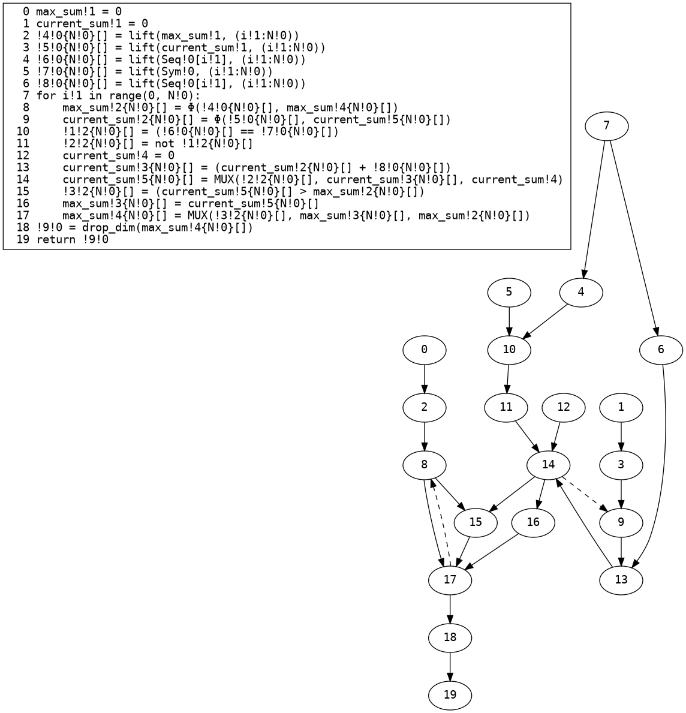
#### Basic Vectorization Phase 2
```python
def max_sum_between_syms(Seq!0: shared[list[int; ?]], N!0: plaintext[int], Sym!0: shared[int]) -> shared[int]:
    max_sum!1 = 0
    current_sum!1 = 0
    !6!0{N!0}[] = lift(Seq!0[i!1], (i!1:N!0))
    !7!0{N!0}[] = lift(Sym!0, (i!1:N!0))
    !8!0{N!0}[] = lift(Seq!0[i!1], (i!1:N!0))
    current_sum!4 = 0
    !4!0{N!0}[] = lift(max_sum!1, (i!1:N!0))
    !5!0{N!0}[] = lift(current_sum!1, (i!1:N!0))
    !1!2{N!0}[] = (!6!0{N!0}[] == !7!0{N!0}[])
    !2!2{N!0}[] = not !1!2{N!0}[]
    for !10!0 in range(0, N!0): (monolithic)
        current_sum!2{}[!10!0] = Φ(!5!0{}[!10!0], current_sum!5{}[(!10!0 - 1)])
        current_sum!3{}[!10!0] = (current_sum!2{}[!10!0] + !8!0{}[!10!0])
        current_sum!5{}[!10!0] = MUX(!2!2{}[!10!0], current_sum!3{}[!10!0], current_sum!4)
    max_sum!3{N!0}[] = current_sum!5{N!0}[]
    for !11!0 in range(0, N!0): (monolithic)
        max_sum!2{}[!11!0] = Φ(!4!0{}[!11!0], max_sum!4{}[(!11!0 - 1)])
        !3!2{}[!11!0] = (current_sum!5{}[!11!0] > max_sum!2{}[!11!0])
        max_sum!4{}[!11!0] = MUX(!3!2{}[!11!0], max_sum!3{}[!11!0], max_sum!2{}[!11!0])
    !9!0 = drop_dim(max_sum!4{N!0}[])
    return !9!0
```
#### Basic Vectorization Phase 2 (dependence graph)
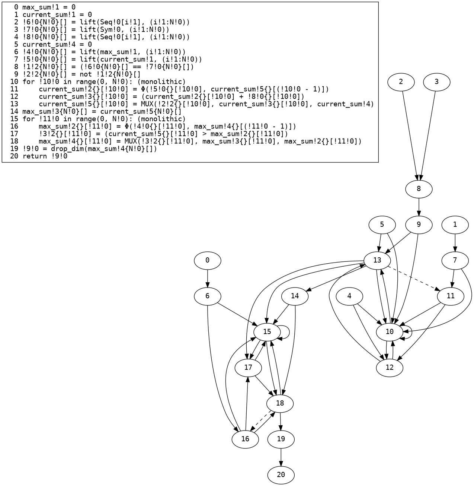
#### Type Environment After Vectorization
| Variable | Type |
| - | - |
| `Seq!0` | `shared[list[int; ?]]` |
| `N!0` | `plaintext[int]` |
| `Sym!0` | `shared[int]` |
| `!10!0` | `plaintext[int]` |
| `!11!0` | `plaintext[int]` |
| `!9!0` | `shared[int]` |
| `max_sum!4` | `shared[list[int; (N!0)]]` |
| `max_sum!2` | `shared[list[int; (N!0)]]` |
| `!3!2` | `shared[list[bool; (N!0)]]` |
| `max_sum!3` | `shared[list[int; (N!0)]]` |
| `current_sum!5` | `shared[list[int; (N!0)]]` |
| `current_sum!2` | `shared[list[int; (N!0)]]` |
| `current_sum!3` | `shared[list[int; (N!0)]]` |
| `!2!2` | `shared[list[bool; (N!0)]]` |
| `!1!2` | `shared[list[bool; (N!0)]]` |
| `!5!0` | `shared[list[int; (N!0)]]` |
| `!4!0` | `shared[list[int; (N!0)]]` |
| `current_sum!4` | `plaintext[int]` |
| `!8!0` | `shared[list[int; (N!0)]]` |
| `!7!0` | `shared[list[int; (N!0)]]` |
| `!6!0` | `shared[list[int; (N!0)]]` |
| `current_sum!1` | `plaintext[int]` |
| `max_sum!1` | `plaintext[int]` |
#### Copy propagation
```python
def max_sum_between_syms(Seq!0: shared[list[int; ?]], N!0: plaintext[int], Sym!0: shared[int]) -> shared[int]:
    max_sum!1 = 0
    current_sum!1 = 0
    !6!0{N!0}[] = lift(Seq!0[i!1], (i!1:N!0))
    !7!0{N!0}[] = lift(Sym!0, (i!1:N!0))
    !8!0{N!0}[] = lift(Seq!0[i!1], (i!1:N!0))
    current_sum!4 = 0
    !4!0{N!0}[] = lift(max_sum!1, (i!1:N!0))
    !5!0{N!0}[] = lift(current_sum!1, (i!1:N!0))
    !1!2{N!0}[] = (!6!0{N!0}[] == !7!0{N!0}[])
    !2!2{N!0}[] = not !1!2{N!0}[]
    for !10!0 in range(0, N!0): (monolithic)
        current_sum!2{}[!10!0] = Φ(!5!0{}[!10!0], current_sum!5{}[(!10!0 - 1)])
        current_sum!3{}[!10!0] = (current_sum!2{}[!10!0] + !8!0{}[!10!0])
        current_sum!5{}[!10!0] = MUX(!2!2{}[!10!0], current_sum!3{}[!10!0], current_sum!4)
    for !11!0 in range(0, N!0): (monolithic)
        max_sum!2{}[!11!0] = Φ(!4!0{}[!11!0], max_sum!4{}[(!11!0 - 1)])
        !3!2{}[!11!0] = (current_sum!5{}[!11!0] > max_sum!2{}[!11!0])
        max_sum!4{}[!11!0] = MUX(!3!2{}[!11!0], current_sum!5{}[!11!0], max_sum!2{}[!11!0])
    !9!0 = drop_dim(max_sum!4{N!0}[])
    return !9!0
```
#### Common subexpression elimination
```python
def max_sum_between_syms(Seq!0: shared[list[int; ?]], N!0: plaintext[int], Sym!0: shared[int]) -> shared[int]:
    max_sum!1 = 0
    current_sum!1 = 0
    !6!0{N!0}[] = lift(Seq!0[i!1], (i!1:N!0))
    !7!0{N!0}[] = lift(Sym!0, (i!1:N!0))
    current_sum!4 = 0
    !4!0{N!0}[] = lift(max_sum!1, (i!1:N!0))
    !5!0{N!0}[] = lift(current_sum!1, (i!1:N!0))
    !1!2{N!0}[] = (!6!0{N!0}[] == !7!0{N!0}[])
    !2!2{N!0}[] = not !1!2{N!0}[]
    for !10!0 in range(0, N!0): (monolithic)
        current_sum!2{}[!10!0] = Φ(!5!0{}[!10!0], current_sum!5{}[(!10!0 - 1)])
        current_sum!3{}[!10!0] = (current_sum!2{}[!10!0] + !6!0{}[!10!0])
        current_sum!5{}[!10!0] = MUX(!2!2{}[!10!0], current_sum!3{}[!10!0], current_sum!4)
    for !11!0 in range(0, N!0): (monolithic)
        max_sum!2{}[!11!0] = Φ(!4!0{}[!11!0], max_sum!4{}[(!11!0 - 1)])
        !3!2{}[!11!0] = (current_sum!5{}[!11!0] > max_sum!2{}[!11!0])
        max_sum!4{}[!11!0] = MUX(!3!2{}[!11!0], current_sum!5{}[!11!0], max_sum!2{}[!11!0])
    !9!0 = drop_dim(max_sum!4{N!0}[])
    return !9!0
```
#### MOTION mixed configuration
```Total cost:	0.54854
Input vars:	{Sym!0: ['Y'], Seq!0: ['Y']}
Constants:	{0: ['Y']}
Plaintext vars:	{}
Flags:		{}
max_sum!1 = 0: _ -> ['Y'] for 0.00000 * 1 = 0.00
current_sum!1 = 0: _ -> ['Y'] for 0.00000 * 1 = 0.00
!6!0{N!0}[] = lift(Seq!0[i!1], (i!1:N!0)): _ -> ['Y'] for 0.00000 * 1 = 0.00
!7!0{N!0}[] = lift(Sym!0, (i!1:N!0)): _ -> ['Y'] for 0.00000 * 1 = 0.00
current_sum!4 = 0: _ -> ['Y'] for 0.00000 * 1 = 0.00
!4!0{N!0}[] = lift(max_sum!1, (i!1:N!0)): _ -> ['Y'] for 0.00000 * 1 = 0.00
!5!0{N!0}[] = lift(current_sum!1, (i!1:N!0)): _ -> ['Y'] for 0.00000 * 1 = 0.00
!1!2{N!0}[] = (!6!0{N!0}[] == !7!0{N!0}[]): Y -> {} for 0.01528 * 1 = 0.02
!2!2{N!0}[] = not !1!2{N!0}[]: Y -> {} for 0.00000 * 1 = 0.00
	current_sum!2{}[!10!0] = Φ(!5!0{}[!10!0], current_sum!5{}[(!10!0 - 1)]): Y -> {} for 0.00000 * 8 = 0.00
	current_sum!3{}[!10!0] = (current_sum!2{}[!10!0] + !6!0{}[!10!0]): Y -> {} for 0.02351 * 8 = 0.19
	current_sum!5{}[!10!0] = MUX(!2!2{}[!10!0], current_sum!3{}[!10!0], current_sum!4): Y -> {} for 0.00597 * 8 = 0.05
	max_sum!2{}[!11!0] = Φ(!4!0{}[!11!0], max_sum!4{}[(!11!0 - 1)]): Y -> {} for 0.00000 * 8 = 0.00
	!3!2{}[!11!0] = (current_sum!5{}[!11!0] > max_sum!2{}[!11!0]): Y -> {} for 0.03120 * 8 = 0.25
	max_sum!4{}[!11!0] = MUX(!3!2{}[!11!0], current_sum!5{}[!11!0], max_sum!2{}[!11!0]): Y -> {} for 0.00597 * 8 = 0.05
!9!0 = drop_dim(max_sum!4{N!0}[]): _ -> ['Y'] for 0.00000 * 1 = 0.00
return !9!0
Output vars:	{!9!0: ['Y']}

```
#### MOTION code
```cpp
template <encrypto::motion::MpcProtocol Protocol>
encrypto::motion::SecureUnsignedInteger max_sum_between_syms(
    encrypto::motion::PartyPointer &party,
    std::vector<encrypto::motion::SecureUnsignedInteger> Seq_0,
    std::uint32_t _MPC_PLAINTEXT_N_0,
    encrypto::motion::SecureUnsignedInteger Sym_0
) {
    // Shared variable declarations
    std::vector<encrypto::motion::ShareWrapper> _1_2((_MPC_PLAINTEXT_N_0));
    encrypto::motion::SecureUnsignedInteger _10_0;
    encrypto::motion::SecureUnsignedInteger _11_0;
    std::vector<encrypto::motion::ShareWrapper> _2_2((_MPC_PLAINTEXT_N_0));
    std::vector<encrypto::motion::ShareWrapper> _3_2((_MPC_PLAINTEXT_N_0));
    std::vector<encrypto::motion::SecureUnsignedInteger> _4_0((_MPC_PLAINTEXT_N_0));
    std::vector<encrypto::motion::SecureUnsignedInteger> _5_0((_MPC_PLAINTEXT_N_0));
    std::vector<encrypto::motion::SecureUnsignedInteger> _6_0((_MPC_PLAINTEXT_N_0));
    std::vector<encrypto::motion::SecureUnsignedInteger> _7_0((_MPC_PLAINTEXT_N_0));
    encrypto::motion::SecureUnsignedInteger _9_0;
    encrypto::motion::SecureUnsignedInteger N_0;
    encrypto::motion::SecureUnsignedInteger current_sum_1;
    std::vector<encrypto::motion::SecureUnsignedInteger> current_sum_2((_MPC_PLAINTEXT_N_0));
    std::vector<encrypto::motion::SecureUnsignedInteger> current_sum_3((_MPC_PLAINTEXT_N_0));
    encrypto::motion::SecureUnsignedInteger current_sum_4;
    std::vector<encrypto::motion::SecureUnsignedInteger> current_sum_5((_MPC_PLAINTEXT_N_0));
    encrypto::motion::SecureUnsignedInteger max_sum_1;
    std::vector<encrypto::motion::SecureUnsignedInteger> max_sum_2((_MPC_PLAINTEXT_N_0));
    std::vector<encrypto::motion::SecureUnsignedInteger> max_sum_4((_MPC_PLAINTEXT_N_0));

    // Plaintext variable declarations
    std::uint32_t _MPC_PLAINTEXT__10_0;
    std::uint32_t _MPC_PLAINTEXT__11_0;
    std::uint32_t _MPC_PLAINTEXT_current_sum_1;
    std::uint32_t _MPC_PLAINTEXT_current_sum_4;
    std::uint32_t _MPC_PLAINTEXT_max_sum_1;

    // Constant initializations
    encrypto::motion::SecureUnsignedInteger _MPC_CONSTANT_0 = party->In<Protocol>(encrypto::motion::ToInput(std::uint32_t(0)), 0);

    // Plaintext parameter assignments
    N_0 = party->In<Protocol>(encrypto::motion::ToInput(_MPC_PLAINTEXT_N_0), 0);

    // Function body
    max_sum_1 = _MPC_CONSTANT_0;
    _MPC_PLAINTEXT_max_sum_1 = std::uint32_t(0);
    current_sum_1 = _MPC_CONSTANT_0;
    _MPC_PLAINTEXT_current_sum_1 = std::uint32_t(0);
    vectorized_assign(_6_0, {_MPC_PLAINTEXT_N_0}, {true}, {}, lift(std::function([&](const std::vector<std::uint32_t> &indices){return Seq_0[indices[0]];}), {_MPC_PLAINTEXT_N_0}));
    vectorized_assign(_7_0, {_MPC_PLAINTEXT_N_0}, {true}, {}, lift(std::function([&](const std::vector<std::uint32_t> &indices){return Sym_0;}), {_MPC_PLAINTEXT_N_0}));
    current_sum_4 = _MPC_CONSTANT_0;
    _MPC_PLAINTEXT_current_sum_4 = std::uint32_t(0);
    vectorized_assign(_4_0, {_MPC_PLAINTEXT_N_0}, {true}, {}, lift(std::function([&](const std::vector<std::uint32_t> &indices){return max_sum_1;}), {_MPC_PLAINTEXT_N_0}));
    vectorized_assign(_5_0, {_MPC_PLAINTEXT_N_0}, {true}, {}, lift(std::function([&](const std::vector<std::uint32_t> &indices){return current_sum_1;}), {_MPC_PLAINTEXT_N_0}));
    vectorized_assign(_1_2, {_MPC_PLAINTEXT_N_0}, {true}, {}, (to_share_wrapper(vectorized_access(_6_0, {_MPC_PLAINTEXT_N_0}, {true}, {})) == to_share_wrapper(vectorized_access(_7_0, {_MPC_PLAINTEXT_N_0}, {true}, {}))));
    vectorized_assign(_2_2, {_MPC_PLAINTEXT_N_0}, {true}, {}, (~vectorized_access(_1_2, {_MPC_PLAINTEXT_N_0}, {true}, {})));

    // Initialize loop counter
    _MPC_PLAINTEXT__10_0 = std::uint32_t(0);
    // Initialize phi values
    current_sum_2[_MPC_PLAINTEXT__10_0] = _5_0[_MPC_PLAINTEXT__10_0];
    for (; _MPC_PLAINTEXT__10_0 < _MPC_PLAINTEXT_N_0; _MPC_PLAINTEXT__10_0++) {
        // Update phi values
        if (_MPC_PLAINTEXT__10_0 != std::uint32_t(0)) {
            current_sum_2[_MPC_PLAINTEXT__10_0] = current_sum_5[(_MPC_PLAINTEXT__10_0 - std::uint32_t(1))];
        }

        current_sum_3[_MPC_PLAINTEXT__10_0] = (current_sum_2[_MPC_PLAINTEXT__10_0] + _6_0[_MPC_PLAINTEXT__10_0]);
        current_sum_5[_MPC_PLAINTEXT__10_0] = _2_2[_MPC_PLAINTEXT__10_0].Mux(current_sum_3[_MPC_PLAINTEXT__10_0].Get(), current_sum_4.Get());

    }


    // Initialize loop counter
    _MPC_PLAINTEXT__11_0 = std::uint32_t(0);
    // Initialize phi values
    max_sum_2[_MPC_PLAINTEXT__11_0] = _4_0[_MPC_PLAINTEXT__11_0];
    for (; _MPC_PLAINTEXT__11_0 < _MPC_PLAINTEXT_N_0; _MPC_PLAINTEXT__11_0++) {
        // Update phi values
        if (_MPC_PLAINTEXT__11_0 != std::uint32_t(0)) {
            max_sum_2[_MPC_PLAINTEXT__11_0] = max_sum_4[(_MPC_PLAINTEXT__11_0 - std::uint32_t(1))];
        }

        _3_2[_MPC_PLAINTEXT__11_0] = (current_sum_5[_MPC_PLAINTEXT__11_0] > max_sum_2[_MPC_PLAINTEXT__11_0]);
        max_sum_4[_MPC_PLAINTEXT__11_0] = _3_2[_MPC_PLAINTEXT__11_0].Mux(current_sum_5[_MPC_PLAINTEXT__11_0].Get(), max_sum_2[_MPC_PLAINTEXT__11_0].Get());

    }

    _9_0 = drop_dim_monoreturn(vectorized_access(max_sum_4, {_MPC_PLAINTEXT_N_0}, {true}, {}).Unsimdify(), {_MPC_PLAINTEXT_N_0});
    return _9_0;

}
```
#### MOTION mixed code
```cpp
encrypto::motion::SecureUnsignedInteger max_sum_between_syms(
    encrypto::motion::PartyPointer &party,
    std::vector<encrypto::motion::SecureUnsignedInteger> Seq_0,
    std::uint32_t _MPC_PLAINTEXT_N_0,
    encrypto::motion::SecureUnsignedInteger Sym_0
) {
    // Shared variable declarations
    std::vector<encrypto::motion::ShareWrapper> _1_2((_MPC_PLAINTEXT_N_0));
    encrypto::motion::SecureUnsignedInteger _10_0;
    encrypto::motion::SecureUnsignedInteger _11_0;
    std::vector<encrypto::motion::ShareWrapper> _2_2((_MPC_PLAINTEXT_N_0));
    std::vector<encrypto::motion::ShareWrapper> _3_2((_MPC_PLAINTEXT_N_0));
    std::vector<encrypto::motion::SecureUnsignedInteger> _4_0((_MPC_PLAINTEXT_N_0));
    std::vector<encrypto::motion::SecureUnsignedInteger> _5_0((_MPC_PLAINTEXT_N_0));
    std::vector<encrypto::motion::SecureUnsignedInteger> _6_0((_MPC_PLAINTEXT_N_0));
    std::vector<encrypto::motion::SecureUnsignedInteger> _7_0((_MPC_PLAINTEXT_N_0));
    encrypto::motion::SecureUnsignedInteger _9_0;
    encrypto::motion::SecureUnsignedInteger N_0;
    encrypto::motion::SecureUnsignedInteger current_sum_1;
    std::vector<encrypto::motion::SecureUnsignedInteger> current_sum_2((_MPC_PLAINTEXT_N_0));
    std::vector<encrypto::motion::SecureUnsignedInteger> current_sum_3((_MPC_PLAINTEXT_N_0));
    encrypto::motion::SecureUnsignedInteger current_sum_4;
    std::vector<encrypto::motion::SecureUnsignedInteger> current_sum_5((_MPC_PLAINTEXT_N_0));
    encrypto::motion::SecureUnsignedInteger max_sum_1;
    std::vector<encrypto::motion::SecureUnsignedInteger> max_sum_2((_MPC_PLAINTEXT_N_0));
    std::vector<encrypto::motion::SecureUnsignedInteger> max_sum_4((_MPC_PLAINTEXT_N_0));

    // Plaintext variable declarations
    std::uint32_t _MPC_PLAINTEXT__10_0;
    std::uint32_t _MPC_PLAINTEXT__11_0;
    std::uint32_t _MPC_PLAINTEXT_current_sum_1;
    std::uint32_t _MPC_PLAINTEXT_current_sum_4;
    std::uint32_t _MPC_PLAINTEXT_max_sum_1;

    // Constant initializations
    encrypto::motion::SecureUnsignedInteger _MPC_CONSTANT_0 = party->In<encrypto::motion::MpcProtocol::kBmr>(encrypto::motion::ToInput(std::uint32_t(0)), 0);

    // Input Protocol Convertions

    // Plaintext parameter assignments

    // Function body
    max_sum_1 = _MPC_CONSTANT_0;
    _MPC_PLAINTEXT_max_sum_1 = std::uint32_t(0);
    current_sum_1 = _MPC_CONSTANT_0;
    _MPC_PLAINTEXT_current_sum_1 = std::uint32_t(0);
    vectorized_assign(_6_0, {_MPC_PLAINTEXT_N_0}, {true}, {}, lift(std::function([&](const std::vector<std::uint32_t> &indices){return Seq_0[indices[0]];}), {_MPC_PLAINTEXT_N_0}));
    vectorized_assign(_7_0, {_MPC_PLAINTEXT_N_0}, {true}, {}, lift(std::function([&](const std::vector<std::uint32_t> &indices){return Sym_0;}), {_MPC_PLAINTEXT_N_0}));
    current_sum_4 = _MPC_CONSTANT_0;
    _MPC_PLAINTEXT_current_sum_4 = std::uint32_t(0);
    vectorized_assign(_4_0, {_MPC_PLAINTEXT_N_0}, {true}, {}, lift(std::function([&](const std::vector<std::uint32_t> &indices){return max_sum_1;}), {_MPC_PLAINTEXT_N_0}));
    vectorized_assign(_5_0, {_MPC_PLAINTEXT_N_0}, {true}, {}, lift(std::function([&](const std::vector<std::uint32_t> &indices){return current_sum_1;}), {_MPC_PLAINTEXT_N_0}));
    vectorized_assign(_1_2, {_MPC_PLAINTEXT_N_0}, {true}, {}, (to_share_wrapper(vectorized_access(_6_0, {_MPC_PLAINTEXT_N_0}, {true}, {})) == to_share_wrapper(vectorized_access(_7_0, {_MPC_PLAINTEXT_N_0}, {true}, {}))));
    vectorized_assign(_2_2, {_MPC_PLAINTEXT_N_0}, {true}, {}, (~vectorized_access(_1_2, {_MPC_PLAINTEXT_N_0}, {true}, {})));

    // Initialize loop counter
    _MPC_PLAINTEXT__10_0 = std::uint32_t(0);
    // Initialize phi values
    current_sum_2[_MPC_PLAINTEXT__10_0] = _5_0[_MPC_PLAINTEXT__10_0];
    for (; _MPC_PLAINTEXT__10_0 < _MPC_PLAINTEXT_N_0; _MPC_PLAINTEXT__10_0++) {
        // Update phi values
        if (_MPC_PLAINTEXT__10_0 != std::uint32_t(0)) {
            current_sum_2[_MPC_PLAINTEXT__10_0] = current_sum_5[(_MPC_PLAINTEXT__10_0 - std::uint32_t(1))];
        }

        current_sum_3[_MPC_PLAINTEXT__10_0] = (current_sum_2[_MPC_PLAINTEXT__10_0] + _6_0[_MPC_PLAINTEXT__10_0]);
        current_sum_5[_MPC_PLAINTEXT__10_0] = _2_2[_MPC_PLAINTEXT__10_0].Mux(current_sum_3[_MPC_PLAINTEXT__10_0].Get(), current_sum_4.Get());

    }


    // Initialize loop counter
    _MPC_PLAINTEXT__11_0 = std::uint32_t(0);
    // Initialize phi values
    max_sum_2[_MPC_PLAINTEXT__11_0] = _4_0[_MPC_PLAINTEXT__11_0];
    for (; _MPC_PLAINTEXT__11_0 < _MPC_PLAINTEXT_N_0; _MPC_PLAINTEXT__11_0++) {
        // Update phi values
        if (_MPC_PLAINTEXT__11_0 != std::uint32_t(0)) {
            max_sum_2[_MPC_PLAINTEXT__11_0] = max_sum_4[(_MPC_PLAINTEXT__11_0 - std::uint32_t(1))];
        }

        _3_2[_MPC_PLAINTEXT__11_0] = (current_sum_5[_MPC_PLAINTEXT__11_0] > max_sum_2[_MPC_PLAINTEXT__11_0]);
        max_sum_4[_MPC_PLAINTEXT__11_0] = _3_2[_MPC_PLAINTEXT__11_0].Mux(current_sum_5[_MPC_PLAINTEXT__11_0].Get(), max_sum_2[_MPC_PLAINTEXT__11_0].Get());

    }

    _9_0 = drop_dim_monoreturn(vectorized_access(max_sum_4, {_MPC_PLAINTEXT_N_0}, {true}, {}).Unsimdify(), {_MPC_PLAINTEXT_N_0});
    return _9_0;

}
```
#### MP-SPDZ mixed configuration
```Total cost:	0.00020
Input vars:	{Sym!0: ['B'], Seq!0: ['B']}
Constants:	{0: ['B']}
Plaintext vars:	{}
Flags:		{X}
max_sum!1 = 0: _ -> ['B'] for 0.00000 * 1 = 0.00
current_sum!1 = 0: _ -> ['B'] for 0.00000 * 1 = 0.00
!6!0{N!0}[] = lift(Seq!0[i!1], (i!1:N!0)): _ -> ['B'] for 0.00000 * 1 = 0.00
!7!0{N!0}[] = lift(Sym!0, (i!1:N!0)): _ -> ['B'] for 0.00000 * 1 = 0.00
current_sum!4 = 0: _ -> ['B'] for 0.00000 * 1 = 0.00
!4!0{N!0}[] = lift(max_sum!1, (i!1:N!0)): _ -> ['B'] for 0.00000 * 1 = 0.00
!5!0{N!0}[] = lift(current_sum!1, (i!1:N!0)): _ -> ['B'] for 0.00000 * 1 = 0.00
!1!2{N!0}[] = (!6!0{N!0}[] == !7!0{N!0}[]): B -> {} for 0.00003 * 1 = 0.00
!2!2{N!0}[] = not !1!2{N!0}[]: B -> {} for 0.00000 * 1 = 0.00
	current_sum!2{}[!10!0] = Φ(!5!0{}[!10!0], current_sum!5{}[(!10!0 - 1)]): B -> {} for 0.00000 * 8 = 0.00
	current_sum!3{}[!10!0] = (current_sum!2{}[!10!0] + !6!0{}[!10!0]): B -> {} for 0.00001 * 8 = 0.00
	current_sum!5{}[!10!0] = MUX(!2!2{}[!10!0], current_sum!3{}[!10!0], current_sum!4): B -> {} for 0.00000 * 8 = 0.00
	max_sum!2{}[!11!0] = Φ(!4!0{}[!11!0], max_sum!4{}[(!11!0 - 1)]): B -> {} for 0.00000 * 8 = 0.00
	!3!2{}[!11!0] = (current_sum!5{}[!11!0] > max_sum!2{}[!11!0]): B -> {} for 0.00001 * 8 = 0.00
	max_sum!4{}[!11!0] = MUX(!3!2{}[!11!0], current_sum!5{}[!11!0], max_sum!2{}[!11!0]): B -> {} for 0.00000 * 8 = 0.00
!9!0 = drop_dim(max_sum!4{N!0}[]): _ -> ['B'] for 0.00000 * 1 = 0.00
return !9!0
Output vars:	{!9!0: ['B']}

```
#### MP-SPDZ code
```py
def max_sum_between_syms(Seq_0, N_0, Sym_0):
    # Shared array declarations
    _1_2 = [None] * (N_0)
    _2_2 = [None] * (N_0)
    _3_2 = [None] * (N_0)
    _4_0 = [None] * (N_0)
    _5_0 = [None] * (N_0)
    _6_0 = [None] * (N_0)
    _7_0 = [None] * (N_0)
    current_sum_2 = [None] * (N_0)
    current_sum_3 = [None] * (N_0)
    current_sum_5 = [None] * (N_0)
    max_sum_2 = [None] * (N_0)
    max_sum_4 = [None] * (N_0)
    # Function body
    max_sum_1 = sint(0)
    current_sum_1 = sint(0)
    _6_0 = _v.lift(lambda indices: (Seq_0[indices[0]]), [N_0])
    _7_0 = _v.lift(lambda indices: Sym_0, [N_0])
    current_sum_4 = sint(0)
    _4_0 = _v.lift(lambda indices: max_sum_1, [N_0])
    _5_0 = _v.lift(lambda indices: current_sum_1, [N_0])
    _v.vectorized_assign(_1_2, [N_0], [None], (_v.vectorized_access_simd(_6_0, [N_0], [None]) == _v.vectorized_access_simd(_7_0, [N_0], [None])))
    _v.vectorized_assign(_2_2, [N_0], [None], (_v.vectorized_access_simd(_1_2, [N_0], [None]).bit_not()))
    for _10_0 in range(0, N_0):
        # Set ϕ value
        if _10_0 == 0:
            _v.vectorized_assign(current_sum_2, [N_0], [_10_0], _v.vectorized_access(_5_0, [N_0], [_10_0]))
        else:
            _v.vectorized_assign(current_sum_2, [N_0], [_10_0], _v.vectorized_access(current_sum_5, [N_0], [(_10_0 - 1)]))
        _v.vectorized_assign(current_sum_3, [N_0], [_10_0], (_v.vectorized_access_simd(current_sum_2, [N_0], [_10_0]) + _v.vectorized_access_simd(_6_0, [N_0], [_10_0])))
        _v.iterative_mux(current_sum_5,_2_2,current_sum_3,current_sum_4,[N_0],[_10_0])
    # Loop exit ϕ values
    _v.vectorized_assign(current_sum_2, [N_0], [_10_0], _v.vectorized_access(current_sum_5, [N_0], [(_10_0 - 1)]))
    for _11_0 in range(0, N_0):
        # Set ϕ value
        if _11_0 == 0:
            _v.vectorized_assign(max_sum_2, [N_0], [_11_0], _v.vectorized_access(_4_0, [N_0], [_11_0]))
        else:
            _v.vectorized_assign(max_sum_2, [N_0], [_11_0], _v.vectorized_access(max_sum_4, [N_0], [(_11_0 - 1)]))
        _v.vectorized_assign(_3_2, [N_0], [_11_0], (_v.vectorized_access_simd(current_sum_5, [N_0], [_11_0]) > _v.vectorized_access_simd(max_sum_2, [N_0], [_11_0])))
        _v.iterative_mux(max_sum_4,_3_2,current_sum_5,max_sum_2,[N_0],[_11_0])
    # Loop exit ϕ values
    _v.vectorized_assign(max_sum_2, [N_0], [_11_0], _v.vectorized_access(max_sum_4, [N_0], [(_11_0 - 1)]))
    _9_0 = _v.drop_dim(max_sum_4, [N_0])
    return _9_0
```
#### MP-SPDZ mixed code
```py
program.options.binary = 32
program.use_dabit = True
def max_sum_between_syms(Seq_0, N_0, Sym_0):
    # Convertion functions
    siv32 = sbitintvec.get_type(32)
    sb32 = sbits.get_type(32)
    
    
    # Shared array declarations
    _1_2 = [None] * (N_0)
    _2_2 = [None] * (N_0)
    _3_2 = [None] * (N_0)
    _4_0 = [None] * (N_0)
    _5_0 = [None] * (N_0)
    _6_0 = [None] * (N_0)
    _7_0 = [None] * (N_0)
    current_sum_2 = [None] * (N_0)
    current_sum_3 = [None] * (N_0)
    current_sum_5 = [None] * (N_0)
    max_sum_2 = [None] * (N_0)
    max_sum_4 = [None] * (N_0)
    # Shared array convertion declarations
    
    # Function body
    max_sum_1 = siv32(0)
    current_sum_1 = siv32(0)
    _6_0 = _v.lift(lambda indices: (Seq_0[indices[0]]), [N_0])
    _7_0 = _v.lift(lambda indices: Sym_0, [N_0])
    current_sum_4 = siv32(0)
    _4_0 = _v.lift(lambda indices: max_sum_1, [N_0])
    _5_0 = _v.lift(lambda indices: current_sum_1, [N_0])
    _v.vectorized_assign(_1_2, [N_0], [None], (_v.vectorized_access_simd(_6_0, [N_0], [None]) == _v.vectorized_access_simd(_7_0, [N_0], [None])))
    _v.vectorized_assign(_2_2, [N_0], [None], (_v.vectorized_access_simd(_1_2, [N_0], [None]).bit_not()))
    for _10_0 in range(0, N_0):
        # Set ϕ value
        if _10_0 == 0:
            _v.vectorized_assign(current_sum_2, [N_0], [_10_0], _v.vectorized_access(_5_0, [N_0], [_10_0]))
        else:
            _v.vectorized_assign(current_sum_2, [N_0], [_10_0], _v.vectorized_access(current_sum_5, [N_0], [(_10_0 - 1)]))
        _v.vectorized_assign(current_sum_3, [N_0], [_10_0], (_v.vectorized_access_simd(current_sum_2, [N_0], [_10_0]) + _v.vectorized_access_simd(_6_0, [N_0], [_10_0])))
        _v.iterative_mux(current_sum_5,_2_2,current_sum_3,current_sum_4,[N_0],[_10_0])
    # Loop exit ϕ values
    _v.vectorized_assign(current_sum_2, [N_0], [_10_0], _v.vectorized_access(current_sum_5, [N_0], [(_10_0 - 1)]))
    for _11_0 in range(0, N_0):
        # Set ϕ value
        if _11_0 == 0:
            _v.vectorized_assign(max_sum_2, [N_0], [_11_0], _v.vectorized_access(_4_0, [N_0], [_11_0]))
        else:
            _v.vectorized_assign(max_sum_2, [N_0], [_11_0], _v.vectorized_access(max_sum_4, [N_0], [(_11_0 - 1)]))
        _v.vectorized_assign(_3_2, [N_0], [_11_0], (_v.vectorized_access_simd(current_sum_5, [N_0], [_11_0]) > _v.vectorized_access_simd(max_sum_2, [N_0], [_11_0])))
        _v.iterative_mux(max_sum_4,_3_2,current_sum_5,max_sum_2,[N_0],[_11_0])
    # Loop exit ϕ values
    _v.vectorized_assign(max_sum_2, [N_0], [_11_0], _v.vectorized_access(max_sum_4, [N_0], [(_11_0 - 1)]))
    _9_0 = _v.drop_dim(max_sum_4, [N_0])
    return _9_0
```
### `minimal_points`
#### Input
```python
from UTIL import shared

# requires: result_Y and result_X are arrays of dummy values (0's)
def minimal_points(
    X_coords: shared[list[int]], Y_coords: shared[list[int]], N: int, result_X: shared[list[int]], result_Y: shared[list[int]]
) -> tuple[shared[list[int]], shared[list[int]]]:
    min_X: list[int] = []
    min_Y: list[int] = []

    # dummy: int = 0
    for i in range(0, N):
        bx = False
        for j in range(0, N):
            bx = bx or (X_coords[j] < X_coords[i] and Y_coords[j] < Y_coords[i])
        val_X: int = result_X[i]
        val_Y: int = result_Y[i]    
        if not bx:
            val_X = X_coords[i]
            val_Y = Y_coords[i]
        result_X[i] = val_X
        result_Y[i] = val_Y
        
    return (result_X, result_Y)


X_coords = [1, 2, 3]
Y_coords = [4, 5, 6]
result_X = [0 for i in range(len(X_coords))]
result_Y = [0 for i in range(len(Y_coords))]
N = 3
print(minimal_points(X_coords, Y_coords, N, result_X, result_Y))

```
#### Restricted AST
```python
def minimal_points(X_coords: shared[list[int; ?]], Y_coords: shared[list[int; ?]], N: plaintext[int], result_X: shared[list[int; ?]], result_Y: shared[list[int; ?]]) -> tuple[shared[list[int; ?]], shared[list[int; ?]]]:
    min_X = []
    min_Y = []
    for i: plaintext[int] in range(0, N):
        bx = False
        for j: plaintext[int] in range(0, N):
            bx = (bx or ((X_coords[j] < X_coords[i]) and (Y_coords[j] < Y_coords[i])))
        val_X = result_X[i]
        val_Y = result_Y[i]
        if not bx:
            val_X = X_coords[i]
            val_Y = Y_coords[i]
        result_X[i] = val_X
        result_Y[i] = val_Y
    return (result_X, result_Y)
```
#### Three-address code CFG
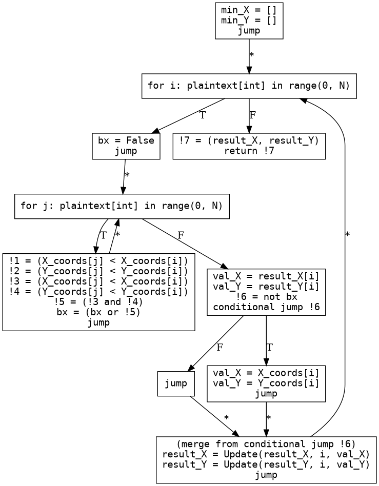
#### SSA
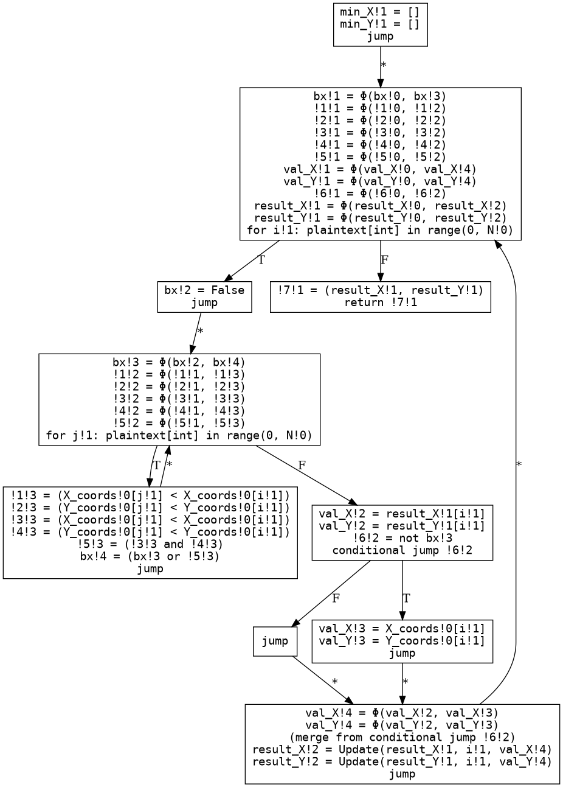
#### SSA ϕ→MUX
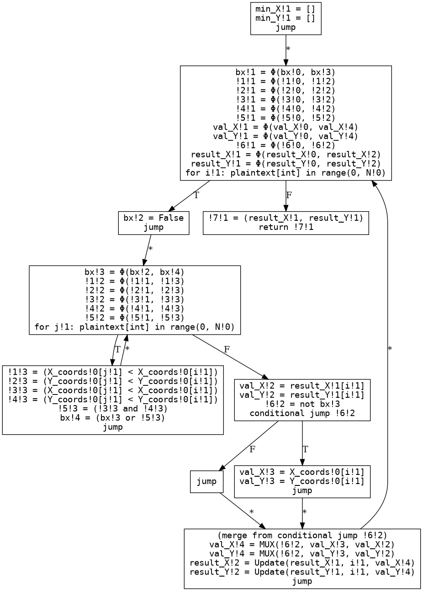
#### Dead code elimination
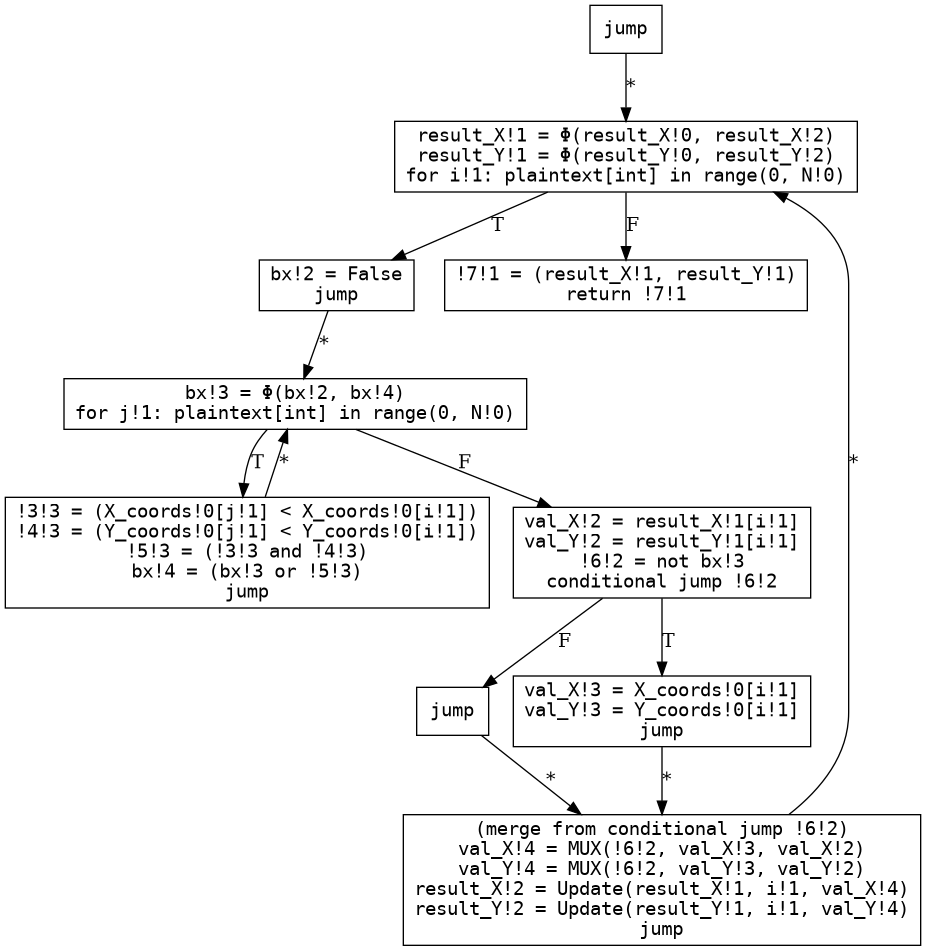
#### Linear code with loops
```python
def minimal_points(X_coords!0: shared[list[int; ?]], Y_coords!0: shared[list[int; ?]], N!0: plaintext[int], result_X!0: shared[list[int; ?]], result_Y!0: shared[list[int; ?]]) -> tuple[shared[list[int; ?]], shared[list[int; ?]]]:
    for i!1 in range(0, N!0):
        result_X!1 = Φ(result_X!0, result_X!2)
        result_Y!1 = Φ(result_Y!0, result_Y!2)
        bx!2 = False
        for j!1 in range(0, N!0):
            bx!3 = Φ(bx!2, bx!4)
            !3!3 = (X_coords!0[j!1] < X_coords!0[i!1])
            !4!3 = (Y_coords!0[j!1] < Y_coords!0[i!1])
            !5!3 = (!3!3 and !4!3)
            bx!4 = (bx!3 or !5!3)
        val_X!2 = result_X!1[i!1]
        val_Y!2 = result_Y!1[i!1]
        !6!2 = not bx!3
        val_X!3 = X_coords!0[i!1]
        val_Y!3 = Y_coords!0[i!1]
        val_X!4 = MUX(!6!2, val_X!3, val_X!2)
        val_Y!4 = MUX(!6!2, val_Y!3, val_Y!2)
        result_X!2 = Update(result_X!1, i!1, val_X!4)
        result_Y!2 = Update(result_Y!1, i!1, val_Y!4)
    !7!1 = (result_X!1, result_Y!1)
    return !7!1
```
#### Dependency graph
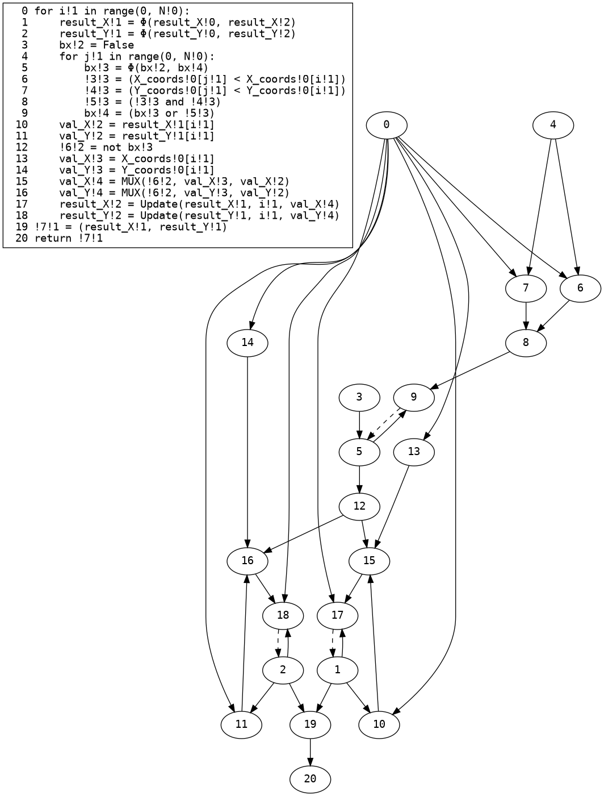
#### Removal of infeasible edges
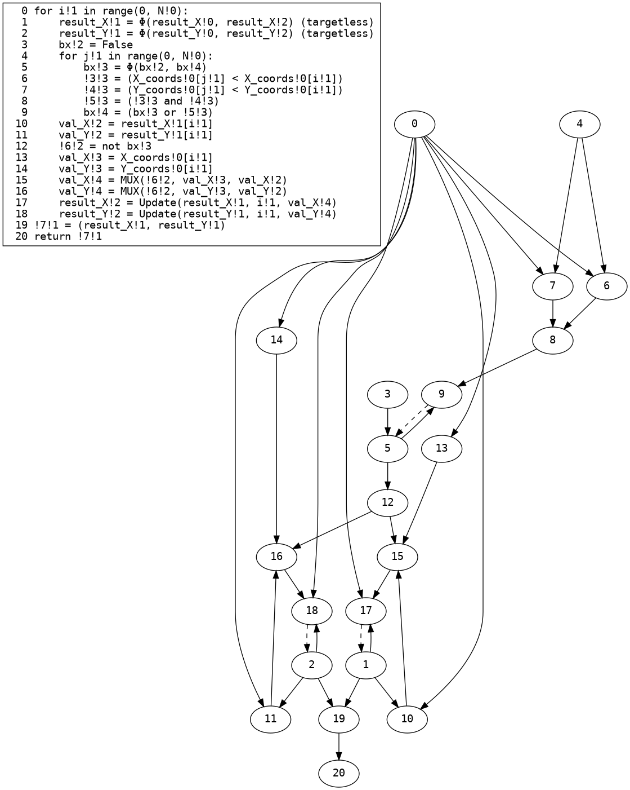
#### Type Environment Before Vectorization
| Variable | Type |
| - | - |
| `X_coords!0` | `shared[list[int; ?]]` |
| `Y_coords!0` | `shared[list[int; ?]]` |
| `N!0` | `plaintext[int]` |
| `result_X!0` | `shared[list[int; ?]]` |
| `result_Y!0` | `shared[list[int; ?]]` |
| `i!1` | `plaintext[int]` |
| `j!1` | `plaintext[int]` |
| `!7!1` | `tuple[shared[list[int; (N!0)]], shared[list[int; (N!0)]]]` |
| `result_Y!2` | `shared[list[int; (N!0)]]` |
| `result_Y!1` | `shared[list[int; (N!0)]]` |
| `val_Y!2` | `shared[int]` |
| `val_Y!4` | `shared[int]` |
| `result_X!2` | `shared[list[int; (N!0)]]` |
| `result_X!1` | `shared[list[int; (N!0)]]` |
| `val_X!2` | `shared[int]` |
| `val_X!4` | `shared[int]` |
| `val_Y!3` | `shared[int]` |
| `val_X!3` | `shared[int]` |
| `!6!2` | `shared[bool]` |
| `bx!4` | `shared[bool]` |
| `bx!3` | `shared[bool]` |
| `!5!3` | `shared[bool]` |
| `!4!3` | `shared[bool]` |
| `!3!3` | `shared[bool]` |
| `bx!2` | `plaintext[bool]` |
#### Basic Vectorization Phase 1
```python
def minimal_points(X_coords!0: shared[list[int; ?]], Y_coords!0: shared[list[int; ?]], N!0: plaintext[int], result_X!0: shared[list[int; ?]], result_Y!0: shared[list[int; ?]]) -> tuple[shared[list[int; ?]], shared[list[int; ?]]]:
    !8!0{N!0}[] = lift(result_X!0, (i!1:N!0))
    !9!0{N!0}[] = lift(result_Y!0, (i!1:N!0))
    !16!0{N!0}[] = lift(X_coords!0[i!1], (i!1:N!0))
    !17!0{N!0}[] = lift(Y_coords!0[i!1], (i!1:N!0))
    for i!1 in range(0, N!0):
        result_X!1{N!0}[] = Φ(!8!0{N!0}[], result_X!2{N!0}[]) (targetless)
        result_Y!1{N!0}[] = Φ(!9!0{N!0}[], result_Y!2{N!0}[]) (targetless)
        bx!2 = False
        !10!0{N!0, N!0}[] = lift(bx!2, (i!1:N!0, j!1:N!0))
        !11!0{N!0, N!0}[] = lift(X_coords!0[j!1], (i!1:N!0, j!1:N!0))
        !12!0{N!0, N!0}[] = lift(X_coords!0[i!1], (i!1:N!0, j!1:N!0))
        !13!0{N!0, N!0}[] = lift(Y_coords!0[j!1], (i!1:N!0, j!1:N!0))
        !14!0{N!0, N!0}[] = lift(Y_coords!0[i!1], (i!1:N!0, j!1:N!0))
        for j!1 in range(0, N!0):
            bx!3{N!0, N!0}[] = Φ(!10!0{N!0, N!0}[], bx!4{N!0, N!0}[])
            !3!3{N!0, N!0}[] = (!11!0{N!0, N!0}[] < !12!0{N!0, N!0}[])
            !4!3{N!0, N!0}[] = (!13!0{N!0, N!0}[] < !14!0{N!0, N!0}[])
            !5!3{N!0, N!0}[] = (!3!3{N!0, N!0}[] and !4!3{N!0, N!0}[])
            bx!4{N!0, N!0}[] = (bx!3{N!0, N!0}[] or !5!3{N!0, N!0}[])
        val_X!2{N!0}[] = result_X!1{N!0}[]
        val_Y!2{N!0}[] = result_Y!1{N!0}[]
        !15!0{N!0}[] = drop_dim(bx!4{N!0, N!0}[])
        !6!2{N!0}[] = not !15!0{N!0}[]
        val_X!3{N!0}[] = !16!0{N!0}[]
        val_Y!3{N!0}[] = !17!0{N!0}[]
        val_X!4{N!0}[] = MUX(!6!2{N!0}[], val_X!3{N!0}[], val_X!2{N!0}[])
        val_Y!4{N!0}[] = MUX(!6!2{N!0}[], val_Y!3{N!0}[], val_Y!2{N!0}[])
        result_X!2{N!0}[] = VectorizedUpdate(result_X!1{N!0}[], [I!1], val_X!4{N!0}[])
        result_Y!2{N!0}[] = VectorizedUpdate(result_Y!1{N!0}[], [I!1], val_Y!4{N!0}[])
    !7!1 = (result_X!1, result_Y!1)
    return !7!1
```
#### Basic Vectorization Phase 1 (dependence graph)
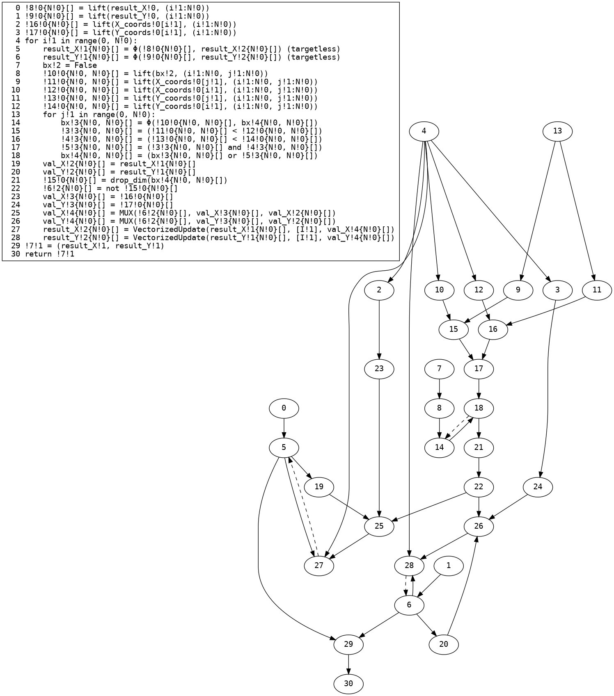
#### Basic Vectorization Phase 2
```python
def minimal_points(X_coords!0: shared[list[int; ?]], Y_coords!0: shared[list[int; ?]], N!0: plaintext[int], result_X!0: shared[list[int; ?]], result_Y!0: shared[list[int; ?]]) -> tuple[shared[list[int; ?]], shared[list[int; ?]]]:
    !8!0{N!0}[] = lift(result_X!0, (i!1:N!0))
    !9!0{N!0}[] = lift(result_Y!0, (i!1:N!0))
    !16!0{N!0}[] = lift(X_coords!0[i!1], (i!1:N!0))
    !17!0{N!0}[] = lift(Y_coords!0[i!1], (i!1:N!0))
    bx!2 = False
    !11!0{N!0, N!0}[] = lift(X_coords!0[j!1], (i!1:N!0, j!1:N!0))
    !12!0{N!0, N!0}[] = lift(X_coords!0[i!1], (i!1:N!0, j!1:N!0))
    !13!0{N!0, N!0}[] = lift(Y_coords!0[j!1], (i!1:N!0, j!1:N!0))
    !14!0{N!0, N!0}[] = lift(Y_coords!0[i!1], (i!1:N!0, j!1:N!0))
    val_X!2{N!0}[] = !8!0{N!0}[]
    val_Y!2{N!0}[] = !9!0{N!0}[]
    val_X!3{N!0}[] = !16!0{N!0}[]
    val_Y!3{N!0}[] = !17!0{N!0}[]
    !10!0{N!0, N!0}[] = lift(bx!2, (i!1:N!0, j!1:N!0))
    !3!3{N!0, N!0}[] = (!11!0{N!0, N!0}[] < !12!0{N!0, N!0}[])
    !4!3{N!0, N!0}[] = (!13!0{N!0, N!0}[] < !14!0{N!0, N!0}[])
    !5!3{N!0, N!0}[] = (!3!3{N!0, N!0}[] and !4!3{N!0, N!0}[])
    for !18!0 in range(0, N!0): (monolithic)
        bx!3{N!0}[!18!0] = Φ(!10!0{N!0}[!18!0], bx!4{N!0}[(!18!0 - 1)])
        bx!4{N!0}[!18!0] = (bx!3{N!0}[!18!0] or !5!3{N!0}[!18!0])
    !15!0{N!0}[] = drop_dim(bx!4{N!0, N!0}[])
    !6!2{N!0}[] = not !15!0{N!0}[]
    val_X!4{N!0}[] = MUX(!6!2{N!0}[], val_X!3{N!0}[], val_X!2{N!0}[])
    val_Y!4{N!0}[] = MUX(!6!2{N!0}[], val_Y!3{N!0}[], val_Y!2{N!0}[])
    result_X!2{N!0}[] = VectorizedUpdate(!8!0{N!0}[], [I!1], val_X!4{N!0}[])
    result_Y!2{N!0}[] = VectorizedUpdate(!9!0{N!0}[], [I!1], val_Y!4{N!0}[])
    !7!1 = (result_X!2, result_Y!2)
    return !7!1
```
#### Basic Vectorization Phase 2 (dependence graph)
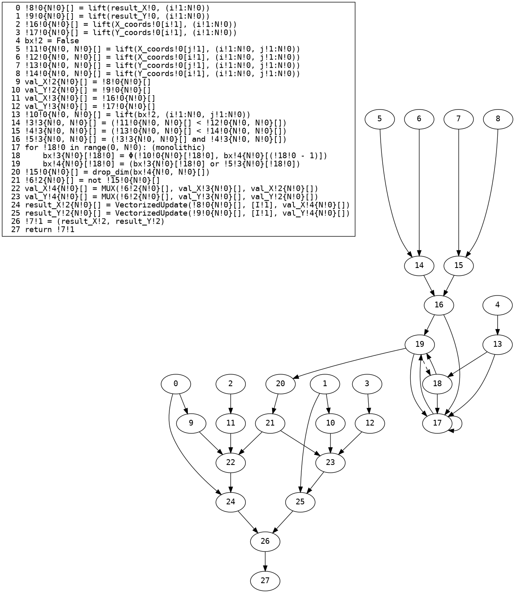
#### Type Environment After Vectorization
| Variable | Type |
| - | - |
| `X_coords!0` | `shared[list[int; ?]]` |
| `Y_coords!0` | `shared[list[int; ?]]` |
| `N!0` | `plaintext[int]` |
| `result_X!0` | `shared[list[int; ?]]` |
| `result_Y!0` | `shared[list[int; ?]]` |
| `!18!0` | `plaintext[int]` |
| `!7!1` | `tuple[shared[list[int; (N!0)]], shared[list[int; (N!0)]]]` |
| `result_Y!2` | `shared[list[int; (N!0)]]` |
| `result_X!2` | `shared[list[int; (N!0)]]` |
| `val_Y!4` | `shared[list[int; (N!0)]]` |
| `val_X!4` | `shared[list[int; (N!0)]]` |
| `!6!2` | `shared[list[bool; (N!0)]]` |
| `!15!0` | `shared[list[bool; (N!0)]]` |
| `bx!4` | `shared[list[list[bool; (N!0)]; (N!0)]]` |
| `bx!3` | `shared[list[list[bool; (N!0)]; (N!0)]]` |
| `!5!3` | `shared[list[list[bool; (N!0)]; (N!0)]]` |
| `!4!3` | `shared[list[list[bool; (N!0)]; (N!0)]]` |
| `!3!3` | `shared[list[list[bool; (N!0)]; (N!0)]]` |
| `!10!0` | `shared[list[list[bool; (N!0)]; (N!0)]]` |
| `val_Y!3` | `shared[list[int; (N!0)]]` |
| `val_X!3` | `shared[list[int; (N!0)]]` |
| `val_Y!2` | `shared[list[int; (N!0)]]` |
| `val_X!2` | `shared[list[int; (N!0)]]` |
| `!14!0` | `shared[list[list[int; (N!0)]; (N!0)]]` |
| `!13!0` | `shared[list[list[int; (N!0)]; (N!0)]]` |
| `!12!0` | `shared[list[list[int; (N!0)]; (N!0)]]` |
| `!11!0` | `shared[list[list[int; (N!0)]; (N!0)]]` |
| `bx!2` | `plaintext[bool]` |
| `!17!0` | `shared[list[int; (N!0)]]` |
| `!16!0` | `shared[list[int; (N!0)]]` |
| `!9!0` | `shared[list[int; (N!0)]]` |
| `!8!0` | `shared[list[int; (N!0)]]` |
#### Copy propagation
```python
def minimal_points(X_coords!0: shared[list[int; ?]], Y_coords!0: shared[list[int; ?]], N!0: plaintext[int], result_X!0: shared[list[int; ?]], result_Y!0: shared[list[int; ?]]) -> tuple[shared[list[int; ?]], shared[list[int; ?]]]:
    !8!0{N!0}[] = lift(result_X!0, (i!1:N!0))
    !9!0{N!0}[] = lift(result_Y!0, (i!1:N!0))
    !16!0{N!0}[] = lift(X_coords!0[i!1], (i!1:N!0))
    !17!0{N!0}[] = lift(Y_coords!0[i!1], (i!1:N!0))
    bx!2 = False
    !11!0{N!0, N!0}[] = lift(X_coords!0[j!1], (i!1:N!0, j!1:N!0))
    !12!0{N!0, N!0}[] = lift(X_coords!0[i!1], (i!1:N!0, j!1:N!0))
    !13!0{N!0, N!0}[] = lift(Y_coords!0[j!1], (i!1:N!0, j!1:N!0))
    !14!0{N!0, N!0}[] = lift(Y_coords!0[i!1], (i!1:N!0, j!1:N!0))
    !10!0{N!0, N!0}[] = lift(bx!2, (i!1:N!0, j!1:N!0))
    !3!3{N!0, N!0}[] = (!11!0{N!0, N!0}[] < !12!0{N!0, N!0}[])
    !4!3{N!0, N!0}[] = (!13!0{N!0, N!0}[] < !14!0{N!0, N!0}[])
    !5!3{N!0, N!0}[] = (!3!3{N!0, N!0}[] and !4!3{N!0, N!0}[])
    for !18!0 in range(0, N!0): (monolithic)
        bx!3{N!0}[!18!0] = Φ(!10!0{N!0}[!18!0], bx!4{N!0}[(!18!0 - 1)])
        bx!4{N!0}[!18!0] = (bx!3{N!0}[!18!0] or !5!3{N!0}[!18!0])
    !15!0{N!0}[] = drop_dim(bx!4{N!0, N!0}[])
    !6!2{N!0}[] = not !15!0{N!0}[]
    val_X!4{N!0}[] = MUX(!6!2{N!0}[], !16!0{N!0}[], !8!0{N!0}[])
    val_Y!4{N!0}[] = MUX(!6!2{N!0}[], !17!0{N!0}[], !9!0{N!0}[])
    result_X!2{N!0}[] = VectorizedUpdate(!8!0{N!0}[], [I!1], val_X!4{N!0}[])
    result_Y!2{N!0}[] = VectorizedUpdate(!9!0{N!0}[], [I!1], val_Y!4{N!0}[])
    !7!1 = (result_X!2, result_Y!2)
    return !7!1
```
#### Common subexpression elimination
```python
def minimal_points(X_coords!0: shared[list[int; ?]], Y_coords!0: shared[list[int; ?]], N!0: plaintext[int], result_X!0: shared[list[int; ?]], result_Y!0: shared[list[int; ?]]) -> tuple[shared[list[int; ?]], shared[list[int; ?]]]:
    !8!0{N!0}[] = lift(result_X!0, (i!1:N!0))
    !9!0{N!0}[] = lift(result_Y!0, (i!1:N!0))
    !16!0{N!0}[] = lift(X_coords!0[i!1], (i!1:N!0))
    !17!0{N!0}[] = lift(Y_coords!0[i!1], (i!1:N!0))
    bx!2 = False
    !11!0{N!0, N!0}[] = lift(X_coords!0[j!1], (i!1:N!0, j!1:N!0))
    !12!0{N!0, N!0}[] = lift(X_coords!0[i!1], (i!1:N!0, j!1:N!0))
    !13!0{N!0, N!0}[] = lift(Y_coords!0[j!1], (i!1:N!0, j!1:N!0))
    !14!0{N!0, N!0}[] = lift(Y_coords!0[i!1], (i!1:N!0, j!1:N!0))
    !10!0{N!0, N!0}[] = lift(bx!2, (i!1:N!0, j!1:N!0))
    !3!3{N!0, N!0}[] = (!11!0{N!0, N!0}[] < !12!0{N!0, N!0}[])
    !4!3{N!0, N!0}[] = (!13!0{N!0, N!0}[] < !14!0{N!0, N!0}[])
    !5!3{N!0, N!0}[] = (!3!3{N!0, N!0}[] and !4!3{N!0, N!0}[])
    for !18!0 in range(0, N!0): (monolithic)
        bx!3{N!0}[!18!0] = Φ(!10!0{N!0}[!18!0], bx!4{N!0}[(!18!0 - 1)])
        bx!4{N!0}[!18!0] = (bx!3{N!0}[!18!0] or !5!3{N!0}[!18!0])
    !15!0{N!0}[] = drop_dim(bx!4{N!0, N!0}[])
    !6!2{N!0}[] = not !15!0{N!0}[]
    val_X!4{N!0}[] = MUX(!6!2{N!0}[], !16!0{N!0}[], !8!0{N!0}[])
    val_Y!4{N!0}[] = MUX(!6!2{N!0}[], !17!0{N!0}[], !9!0{N!0}[])
    result_X!2{N!0}[] = VectorizedUpdate(!8!0{N!0}[], [I!1], val_X!4{N!0}[])
    result_Y!2{N!0}[] = VectorizedUpdate(!9!0{N!0}[], [I!1], val_Y!4{N!0}[])
    !7!1 = (result_X!2, result_Y!2)
    return !7!1
```
#### MOTION mixed configuration
```Total cost:	0.09735
Input vars:	{Y_coords!0: ['A', 'Y'], X_coords!0: ['A', 'Y'], result_Y!0: ['Y'], result_X!0: ['Y']}
Constants:	{False: ['Y']}
Plaintext vars:	{}
Flags:		{}
!8!0{N!0}[] = lift(result_X!0, (i!1:N!0)): _ -> ['Y'] for 0.00000 * 1 = 0.00
!9!0{N!0}[] = lift(result_Y!0, (i!1:N!0)): _ -> ['Y'] for 0.00000 * 1 = 0.00
!16!0{N!0}[] = lift(X_coords!0[i!1], (i!1:N!0)): _ -> ['A', 'Y'] for 0.00000 * 1 = 0.00
!17!0{N!0}[] = lift(Y_coords!0[i!1], (i!1:N!0)): _ -> ['A', 'Y'] for 0.00000 * 1 = 0.00
bx!2 = False: _ -> ['Y'] for 0.00000 * 1 = 0.00
!11!0{N!0, N!0}[] = lift(X_coords!0[j!1], (i!1:N!0, j!1:N!0)): _ -> ['A'] for 0.00000 * 1 = 0.00
!12!0{N!0, N!0}[] = lift(X_coords!0[i!1], (i!1:N!0, j!1:N!0)): _ -> ['A'] for 0.00000 * 1 = 0.00
!13!0{N!0, N!0}[] = lift(Y_coords!0[j!1], (i!1:N!0, j!1:N!0)): _ -> ['A'] for 0.00000 * 1 = 0.00
!14!0{N!0, N!0}[] = lift(Y_coords!0[i!1], (i!1:N!0, j!1:N!0)): _ -> ['A'] for 0.00000 * 1 = 0.00
!10!0{N!0, N!0}[] = lift(bx!2, (i!1:N!0, j!1:N!0)): _ -> ['Y'] for 0.00000 * 1 = 0.00
!3!3{N!0, N!0}[] = (!11!0{N!0, N!0}[] < !12!0{N!0, N!0}[]): A -> ['Y'] for 0.03844 * 1 = 0.04 (A->Y)
!4!3{N!0, N!0}[] = (!13!0{N!0, N!0}[] < !14!0{N!0, N!0}[]): A -> ['Y'] for 0.03844 * 1 = 0.04 (A->Y)
!5!3{N!0, N!0}[] = (!3!3{N!0, N!0}[] and !4!3{N!0, N!0}[]): Y -> {} for 0.00233 * 1 = 0.00
	bx!3{N!0}[!18!0] = Φ(!10!0{N!0}[!18!0], bx!4{N!0}[(!18!0 - 1)]): Y -> {} for 0.00000 * 3 = 0.00
	bx!4{N!0}[!18!0] = (bx!3{N!0}[!18!0] or !5!3{N!0}[!18!0]): Y -> {} for 0.00211 * 3 = 0.01
!15!0{N!0}[] = drop_dim(bx!4{N!0, N!0}[]): _ -> ['Y'] for 0.00000 * 1 = 0.00
!6!2{N!0}[] = not !15!0{N!0}[]: Y -> {} for 0.00000 * 1 = 0.00
val_X!4{N!0}[] = MUX(!6!2{N!0}[], !16!0{N!0}[], !8!0{N!0}[]): Y -> {} for 0.00591 * 1 = 0.01
val_Y!4{N!0}[] = MUX(!6!2{N!0}[], !17!0{N!0}[], !9!0{N!0}[]): Y -> {} for 0.00591 * 1 = 0.01
result_X!2{N!0}[] = VectorizedUpdate(!8!0{N!0}[], [I!1], val_X!4{N!0}[]): Y -> {} for 0.00000 * 1 = 0.00
result_Y!2{N!0}[] = VectorizedUpdate(!9!0{N!0}[], [I!1], val_Y!4{N!0}[]): Y -> {} for 0.00000 * 1 = 0.00
!7!1 = (result_X!2, result_Y!2)
return !7!1
Output vars:	{result_Y!2: ['Y'], result_X!2: ['Y']}

```
#### MOTION code
```cpp
template <encrypto::motion::MpcProtocol Protocol>
std::tuple<std::vector<encrypto::motion::SecureUnsignedInteger>, std::vector<encrypto::motion::SecureUnsignedInteger>> minimal_points(
    encrypto::motion::PartyPointer &party,
    std::vector<encrypto::motion::SecureUnsignedInteger> X_coords_0,
    std::vector<encrypto::motion::SecureUnsignedInteger> Y_coords_0,
    std::uint32_t _MPC_PLAINTEXT_N_0,
    std::vector<encrypto::motion::SecureUnsignedInteger> result_X_0,
    std::vector<encrypto::motion::SecureUnsignedInteger> result_Y_0
) {
    // Shared variable declarations
    std::vector<encrypto::motion::ShareWrapper> _10_0((_MPC_PLAINTEXT_N_0) * (_MPC_PLAINTEXT_N_0));
    std::vector<encrypto::motion::SecureUnsignedInteger> _11_0((_MPC_PLAINTEXT_N_0) * (_MPC_PLAINTEXT_N_0));
    std::vector<encrypto::motion::SecureUnsignedInteger> _12_0((_MPC_PLAINTEXT_N_0) * (_MPC_PLAINTEXT_N_0));
    std::vector<encrypto::motion::SecureUnsignedInteger> _13_0((_MPC_PLAINTEXT_N_0) * (_MPC_PLAINTEXT_N_0));
    std::vector<encrypto::motion::SecureUnsignedInteger> _14_0((_MPC_PLAINTEXT_N_0) * (_MPC_PLAINTEXT_N_0));
    std::vector<encrypto::motion::ShareWrapper> _15_0((_MPC_PLAINTEXT_N_0));
    std::vector<encrypto::motion::SecureUnsignedInteger> _16_0((_MPC_PLAINTEXT_N_0));
    std::vector<encrypto::motion::SecureUnsignedInteger> _17_0((_MPC_PLAINTEXT_N_0));
    encrypto::motion::SecureUnsignedInteger _18_0;
    std::vector<encrypto::motion::ShareWrapper> _3_3((_MPC_PLAINTEXT_N_0) * (_MPC_PLAINTEXT_N_0));
    std::vector<encrypto::motion::ShareWrapper> _4_3((_MPC_PLAINTEXT_N_0) * (_MPC_PLAINTEXT_N_0));
    std::vector<encrypto::motion::ShareWrapper> _5_3((_MPC_PLAINTEXT_N_0) * (_MPC_PLAINTEXT_N_0));
    std::vector<encrypto::motion::ShareWrapper> _6_2((_MPC_PLAINTEXT_N_0));
    std::tuple<std::vector<encrypto::motion::SecureUnsignedInteger>, std::vector<encrypto::motion::SecureUnsignedInteger>> _7_1;
    std::vector<encrypto::motion::SecureUnsignedInteger> _8_0((_MPC_PLAINTEXT_N_0));
    std::vector<encrypto::motion::SecureUnsignedInteger> _9_0((_MPC_PLAINTEXT_N_0));
    encrypto::motion::SecureUnsignedInteger N_0;
    encrypto::motion::ShareWrapper bx_2;
    std::vector<encrypto::motion::ShareWrapper> bx_3((_MPC_PLAINTEXT_N_0) * (_MPC_PLAINTEXT_N_0));
    std::vector<encrypto::motion::ShareWrapper> bx_4((_MPC_PLAINTEXT_N_0) * (_MPC_PLAINTEXT_N_0));
    std::vector<encrypto::motion::SecureUnsignedInteger> result_X_2((_MPC_PLAINTEXT_N_0));
    std::vector<encrypto::motion::SecureUnsignedInteger> result_Y_2((_MPC_PLAINTEXT_N_0));
    std::vector<encrypto::motion::SecureUnsignedInteger> val_X_4((_MPC_PLAINTEXT_N_0));
    std::vector<encrypto::motion::SecureUnsignedInteger> val_Y_4((_MPC_PLAINTEXT_N_0));

    // Plaintext variable declarations
    std::uint32_t _MPC_PLAINTEXT__18_0;
    std::tuple<std::vector<std::uint32_t>, std::vector<std::uint32_t>> _MPC_PLAINTEXT__7_1;
    bool _MPC_PLAINTEXT_bx_2;

    // Constant initializations
    encrypto::motion::ShareWrapper _MPC_CONSTANT_false = party->In<Protocol>(encrypto::motion::BitVector(1, false), 0);

    // Plaintext parameter assignments
    N_0 = party->In<Protocol>(encrypto::motion::ToInput(_MPC_PLAINTEXT_N_0), 0);

    // Function body
    vectorized_assign(_8_0, {_MPC_PLAINTEXT_N_0}, {true}, {}, lift(std::function([&](const std::vector<std::uint32_t> &indices){return result_X_0;}), {_MPC_PLAINTEXT_N_0}));
    vectorized_assign(_9_0, {_MPC_PLAINTEXT_N_0}, {true}, {}, lift(std::function([&](const std::vector<std::uint32_t> &indices){return result_Y_0;}), {_MPC_PLAINTEXT_N_0}));
    vectorized_assign(_16_0, {_MPC_PLAINTEXT_N_0}, {true}, {}, lift(std::function([&](const std::vector<std::uint32_t> &indices){return X_coords_0[indices[0]];}), {_MPC_PLAINTEXT_N_0}));
    vectorized_assign(_17_0, {_MPC_PLAINTEXT_N_0}, {true}, {}, lift(std::function([&](const std::vector<std::uint32_t> &indices){return Y_coords_0[indices[0]];}), {_MPC_PLAINTEXT_N_0}));
    bx_2 = _MPC_CONSTANT_false;
    _MPC_PLAINTEXT_bx_2 = false;
    vectorized_assign(_11_0, {_MPC_PLAINTEXT_N_0, _MPC_PLAINTEXT_N_0}, {true, true}, {}, lift(std::function([&](const std::vector<std::uint32_t> &indices){return X_coords_0[indices[1]];}), {_MPC_PLAINTEXT_N_0, _MPC_PLAINTEXT_N_0}));
    vectorized_assign(_12_0, {_MPC_PLAINTEXT_N_0, _MPC_PLAINTEXT_N_0}, {true, true}, {}, lift(std::function([&](const std::vector<std::uint32_t> &indices){return X_coords_0[indices[0]];}), {_MPC_PLAINTEXT_N_0, _MPC_PLAINTEXT_N_0}));
    vectorized_assign(_13_0, {_MPC_PLAINTEXT_N_0, _MPC_PLAINTEXT_N_0}, {true, true}, {}, lift(std::function([&](const std::vector<std::uint32_t> &indices){return Y_coords_0[indices[1]];}), {_MPC_PLAINTEXT_N_0, _MPC_PLAINTEXT_N_0}));
    vectorized_assign(_14_0, {_MPC_PLAINTEXT_N_0, _MPC_PLAINTEXT_N_0}, {true, true}, {}, lift(std::function([&](const std::vector<std::uint32_t> &indices){return Y_coords_0[indices[0]];}), {_MPC_PLAINTEXT_N_0, _MPC_PLAINTEXT_N_0}));
    vectorized_assign(_10_0, {_MPC_PLAINTEXT_N_0, _MPC_PLAINTEXT_N_0}, {true, true}, {}, lift(std::function([&](const std::vector<std::uint32_t> &indices){return bx_2;}), {_MPC_PLAINTEXT_N_0, _MPC_PLAINTEXT_N_0}));
    vectorized_assign(_3_3, {_MPC_PLAINTEXT_N_0, _MPC_PLAINTEXT_N_0}, {true, true}, {}, (vectorized_access(_12_0, {_MPC_PLAINTEXT_N_0, _MPC_PLAINTEXT_N_0}, {true, true}, {}) > vectorized_access(_11_0, {_MPC_PLAINTEXT_N_0, _MPC_PLAINTEXT_N_0}, {true, true}, {})));
    vectorized_assign(_4_3, {_MPC_PLAINTEXT_N_0, _MPC_PLAINTEXT_N_0}, {true, true}, {}, (vectorized_access(_14_0, {_MPC_PLAINTEXT_N_0, _MPC_PLAINTEXT_N_0}, {true, true}, {}) > vectorized_access(_13_0, {_MPC_PLAINTEXT_N_0, _MPC_PLAINTEXT_N_0}, {true, true}, {})));
    vectorized_assign(_5_3, {_MPC_PLAINTEXT_N_0, _MPC_PLAINTEXT_N_0}, {true, true}, {}, (to_share_wrapper(vectorized_access(_3_3, {_MPC_PLAINTEXT_N_0, _MPC_PLAINTEXT_N_0}, {true, true}, {})) & to_share_wrapper(vectorized_access(_4_3, {_MPC_PLAINTEXT_N_0, _MPC_PLAINTEXT_N_0}, {true, true}, {}))));

    // Initialize loop counter
    _MPC_PLAINTEXT__18_0 = std::uint32_t(0);
    // Initialize phi values
    vectorized_assign(bx_3, {_MPC_PLAINTEXT_N_0, _MPC_PLAINTEXT_N_0}, {true, false}, {_MPC_PLAINTEXT__18_0}, vectorized_access(_10_0, {_MPC_PLAINTEXT_N_0, _MPC_PLAINTEXT_N_0}, {true, false}, {_MPC_PLAINTEXT__18_0}));
    for (; _MPC_PLAINTEXT__18_0 < _MPC_PLAINTEXT_N_0; _MPC_PLAINTEXT__18_0++) {
        // Update phi values
        if (_MPC_PLAINTEXT__18_0 != std::uint32_t(0)) {
            vectorized_assign(bx_3, {_MPC_PLAINTEXT_N_0, _MPC_PLAINTEXT_N_0}, {true, false}, {_MPC_PLAINTEXT__18_0}, vectorized_access(bx_4, {_MPC_PLAINTEXT_N_0, _MPC_PLAINTEXT_N_0}, {true, false}, {(_MPC_PLAINTEXT__18_0 - std::uint32_t(1))}));
        }

        vectorized_assign(bx_4, {_MPC_PLAINTEXT_N_0, _MPC_PLAINTEXT_N_0}, {true, false}, {_MPC_PLAINTEXT__18_0}, (to_share_wrapper(vectorized_access(bx_3, {_MPC_PLAINTEXT_N_0, _MPC_PLAINTEXT_N_0}, {true, false}, {_MPC_PLAINTEXT__18_0})) | to_share_wrapper(vectorized_access(_5_3, {_MPC_PLAINTEXT_N_0, _MPC_PLAINTEXT_N_0}, {true, false}, {_MPC_PLAINTEXT__18_0}))));

    }

    vectorized_assign(_15_0, {_MPC_PLAINTEXT_N_0}, {true}, {}, drop_dim(vectorized_access(bx_4, {_MPC_PLAINTEXT_N_0, _MPC_PLAINTEXT_N_0}, {true, true}, {}).Unsimdify(), {_MPC_PLAINTEXT_N_0, _MPC_PLAINTEXT_N_0}));
    vectorized_assign(_6_2, {_MPC_PLAINTEXT_N_0}, {true}, {}, (~vectorized_access(_15_0, {_MPC_PLAINTEXT_N_0}, {true}, {})));
    vectorized_assign(val_X_4, {_MPC_PLAINTEXT_N_0}, {true}, {}, vectorized_access(_6_2, {_MPC_PLAINTEXT_N_0}, {true}, {}).Mux(vectorized_access(_16_0, {_MPC_PLAINTEXT_N_0}, {true}, {}).Get(), vectorized_access(_8_0, {_MPC_PLAINTEXT_N_0}, {true}, {}).Get()));
    vectorized_assign(val_Y_4, {_MPC_PLAINTEXT_N_0}, {true}, {}, vectorized_access(_6_2, {_MPC_PLAINTEXT_N_0}, {true}, {}).Mux(vectorized_access(_17_0, {_MPC_PLAINTEXT_N_0}, {true}, {}).Get(), vectorized_access(_9_0, {_MPC_PLAINTEXT_N_0}, {true}, {}).Get()));
    vectorized_assign(result_X_2, {_MPC_PLAINTEXT_N_0}, {true}, {}, vectorized_update(_8_0, {_MPC_PLAINTEXT_N_0}, {true}, {}, vectorized_access(val_X_4, {_MPC_PLAINTEXT_N_0}, {true}, {})));
    vectorized_assign(result_Y_2, {_MPC_PLAINTEXT_N_0}, {true}, {}, vectorized_update(_9_0, {_MPC_PLAINTEXT_N_0}, {true}, {}, vectorized_access(val_Y_4, {_MPC_PLAINTEXT_N_0}, {true}, {})));
    _7_1 = std::make_tuple(result_X_2, result_Y_2);
    return _7_1;

}
```
#### MOTION mixed code
```cpp
std::tuple<std::vector<encrypto::motion::SecureUnsignedInteger>, std::vector<encrypto::motion::SecureUnsignedInteger>> minimal_points(
    encrypto::motion::PartyPointer &party,
    std::vector<encrypto::motion::SecureUnsignedInteger> X_coords_0,
    std::vector<encrypto::motion::SecureUnsignedInteger> Y_coords_0,
    std::uint32_t _MPC_PLAINTEXT_N_0,
    std::vector<encrypto::motion::SecureUnsignedInteger> result_X_0,
    std::vector<encrypto::motion::SecureUnsignedInteger> result_Y_0
) {
    // Shared variable declarations
    std::vector<encrypto::motion::ShareWrapper> _10_0((_MPC_PLAINTEXT_N_0) * (_MPC_PLAINTEXT_N_0));
    std::vector<encrypto::motion::SecureUnsignedInteger> _11_0((_MPC_PLAINTEXT_N_0) * (_MPC_PLAINTEXT_N_0));
    std::vector<encrypto::motion::SecureUnsignedInteger> _12_0((_MPC_PLAINTEXT_N_0) * (_MPC_PLAINTEXT_N_0));
    std::vector<encrypto::motion::SecureUnsignedInteger> _13_0((_MPC_PLAINTEXT_N_0) * (_MPC_PLAINTEXT_N_0));
    std::vector<encrypto::motion::SecureUnsignedInteger> _14_0((_MPC_PLAINTEXT_N_0) * (_MPC_PLAINTEXT_N_0));
    std::vector<encrypto::motion::ShareWrapper> _15_0((_MPC_PLAINTEXT_N_0));
    std::vector<encrypto::motion::SecureUnsignedInteger> _16_0((_MPC_PLAINTEXT_N_0));
    std::vector<encrypto::motion::SecureUnsignedInteger> _17_0((_MPC_PLAINTEXT_N_0));
    encrypto::motion::SecureUnsignedInteger _18_0;
    std::vector<encrypto::motion::ShareWrapper> _3_3((_MPC_PLAINTEXT_N_0) * (_MPC_PLAINTEXT_N_0));
    std::vector<encrypto::motion::ShareWrapper> _4_3((_MPC_PLAINTEXT_N_0) * (_MPC_PLAINTEXT_N_0));
    std::vector<encrypto::motion::ShareWrapper> _5_3((_MPC_PLAINTEXT_N_0) * (_MPC_PLAINTEXT_N_0));
    std::vector<encrypto::motion::ShareWrapper> _6_2((_MPC_PLAINTEXT_N_0));
    std::tuple<std::vector<encrypto::motion::SecureUnsignedInteger>, std::vector<encrypto::motion::SecureUnsignedInteger>> _7_1;
    std::vector<encrypto::motion::SecureUnsignedInteger> _8_0((_MPC_PLAINTEXT_N_0));
    std::vector<encrypto::motion::SecureUnsignedInteger> _9_0((_MPC_PLAINTEXT_N_0));
    encrypto::motion::SecureUnsignedInteger N_0;
    encrypto::motion::ShareWrapper bx_2;
    std::vector<encrypto::motion::ShareWrapper> bx_3((_MPC_PLAINTEXT_N_0) * (_MPC_PLAINTEXT_N_0));
    std::vector<encrypto::motion::ShareWrapper> bx_4((_MPC_PLAINTEXT_N_0) * (_MPC_PLAINTEXT_N_0));
    std::vector<encrypto::motion::SecureUnsignedInteger> result_X_2((_MPC_PLAINTEXT_N_0));
    std::vector<encrypto::motion::SecureUnsignedInteger> result_Y_2((_MPC_PLAINTEXT_N_0));
    std::vector<encrypto::motion::SecureUnsignedInteger> val_X_4((_MPC_PLAINTEXT_N_0));
    std::vector<encrypto::motion::SecureUnsignedInteger> val_Y_4((_MPC_PLAINTEXT_N_0));

    // Plaintext variable declarations
    std::uint32_t _MPC_PLAINTEXT__18_0;
    std::tuple<std::vector<std::uint32_t>, std::vector<std::uint32_t>> _MPC_PLAINTEXT__7_1;
    bool _MPC_PLAINTEXT_bx_2;

    // Constant initializations
    encrypto::motion::ShareWrapper _MPC_CONSTANT_false = party->In<encrypto::motion::MpcProtocol::kBmr>(encrypto::motion::BitVector(1, false), 0);

    // Input Protocol Convertions
    std::vector<encrypto::motion::SecureUnsignedInteger> Y_coords_0_Y(Y_coords_0.size());
    vectorized_assign(Y_coords_0_Y, {Y_coords_0.size()}, {true}, {}, (vectorized_access(Y_coords_0, {Y_coords_0.size()}, {true}, {}).Get().Convert<encrypto::motion::MpcProtocol::kBmr>()));
    std::vector<encrypto::motion::SecureUnsignedInteger> X_coords_0_Y(X_coords_0.size());
    vectorized_assign(X_coords_0_Y, {X_coords_0.size()}, {true}, {}, (vectorized_access(X_coords_0, {X_coords_0.size()}, {true}, {}).Get().Convert<encrypto::motion::MpcProtocol::kBmr>()));

    // Plaintext parameter assignments

    // Function body
    vectorized_assign(_8_0, {_MPC_PLAINTEXT_N_0}, {true}, {}, lift(std::function([&](const std::vector<std::uint32_t> &indices){return result_X_0;}), {_MPC_PLAINTEXT_N_0}));
    vectorized_assign(_9_0, {_MPC_PLAINTEXT_N_0}, {true}, {}, lift(std::function([&](const std::vector<std::uint32_t> &indices){return result_Y_0;}), {_MPC_PLAINTEXT_N_0}));
    vectorized_assign(_16_0, {_MPC_PLAINTEXT_N_0}, {true}, {}, lift(std::function([&](const std::vector<std::uint32_t> &indices){return X_coords_0[indices[0]];}), {_MPC_PLAINTEXT_N_0}));std::vector<encrypto::motion::SecureUnsignedInteger> _16_0_Y((_MPC_PLAINTEXT_N_0));
    vectorized_assign(_16_0_Y, {_MPC_PLAINTEXT_N_0}, {true}, {}, lift(std::function([&](const std::vector<std::uint32_t> &indices){return X_coords_0_Y[indices[0]];}), {_MPC_PLAINTEXT_N_0}));
    vectorized_assign(_17_0, {_MPC_PLAINTEXT_N_0}, {true}, {}, lift(std::function([&](const std::vector<std::uint32_t> &indices){return Y_coords_0[indices[0]];}), {_MPC_PLAINTEXT_N_0}));std::vector<encrypto::motion::SecureUnsignedInteger> _17_0_Y((_MPC_PLAINTEXT_N_0));
    vectorized_assign(_17_0_Y, {_MPC_PLAINTEXT_N_0}, {true}, {}, lift(std::function([&](const std::vector<std::uint32_t> &indices){return Y_coords_0_Y[indices[0]];}), {_MPC_PLAINTEXT_N_0}));
    bx_2 = _MPC_CONSTANT_false;
    _MPC_PLAINTEXT_bx_2 = false;
    vectorized_assign(_11_0, {_MPC_PLAINTEXT_N_0, _MPC_PLAINTEXT_N_0}, {true, true}, {}, lift(std::function([&](const std::vector<std::uint32_t> &indices){return X_coords_0[indices[1]];}), {_MPC_PLAINTEXT_N_0, _MPC_PLAINTEXT_N_0}));
    vectorized_assign(_12_0, {_MPC_PLAINTEXT_N_0, _MPC_PLAINTEXT_N_0}, {true, true}, {}, lift(std::function([&](const std::vector<std::uint32_t> &indices){return X_coords_0[indices[0]];}), {_MPC_PLAINTEXT_N_0, _MPC_PLAINTEXT_N_0}));
    vectorized_assign(_13_0, {_MPC_PLAINTEXT_N_0, _MPC_PLAINTEXT_N_0}, {true, true}, {}, lift(std::function([&](const std::vector<std::uint32_t> &indices){return Y_coords_0[indices[1]];}), {_MPC_PLAINTEXT_N_0, _MPC_PLAINTEXT_N_0}));
    vectorized_assign(_14_0, {_MPC_PLAINTEXT_N_0, _MPC_PLAINTEXT_N_0}, {true, true}, {}, lift(std::function([&](const std::vector<std::uint32_t> &indices){return Y_coords_0[indices[0]];}), {_MPC_PLAINTEXT_N_0, _MPC_PLAINTEXT_N_0}));
    vectorized_assign(_10_0, {_MPC_PLAINTEXT_N_0, _MPC_PLAINTEXT_N_0}, {true, true}, {}, lift(std::function([&](const std::vector<std::uint32_t> &indices){return bx_2;}), {_MPC_PLAINTEXT_N_0, _MPC_PLAINTEXT_N_0}));
    vectorized_assign(_3_3, {_MPC_PLAINTEXT_N_0, _MPC_PLAINTEXT_N_0}, {true, true}, {}, (vectorized_access(_12_0, {_MPC_PLAINTEXT_N_0, _MPC_PLAINTEXT_N_0}, {true, true}, {}) > vectorized_access(_11_0, {_MPC_PLAINTEXT_N_0, _MPC_PLAINTEXT_N_0}, {true, true}, {})));
    std::vector<encrypto::motion::ShareWrapper> _3_3_Y((_MPC_PLAINTEXT_N_0) * (_MPC_PLAINTEXT_N_0));
    vectorized_assign(_3_3_Y, {_MPC_PLAINTEXT_N_0, _MPC_PLAINTEXT_N_0}, {true, true}, {}, (vectorized_access(_3_3, {_MPC_PLAINTEXT_N_0, _MPC_PLAINTEXT_N_0}, {true, true}, {}).Convert<encrypto::motion::MpcProtocol::kBmr>()));

    vectorized_assign(_4_3, {_MPC_PLAINTEXT_N_0, _MPC_PLAINTEXT_N_0}, {true, true}, {}, (vectorized_access(_14_0, {_MPC_PLAINTEXT_N_0, _MPC_PLAINTEXT_N_0}, {true, true}, {}) > vectorized_access(_13_0, {_MPC_PLAINTEXT_N_0, _MPC_PLAINTEXT_N_0}, {true, true}, {})));
    std::vector<encrypto::motion::ShareWrapper> _4_3_Y((_MPC_PLAINTEXT_N_0) * (_MPC_PLAINTEXT_N_0));
    vectorized_assign(_4_3_Y, {_MPC_PLAINTEXT_N_0, _MPC_PLAINTEXT_N_0}, {true, true}, {}, (vectorized_access(_4_3, {_MPC_PLAINTEXT_N_0, _MPC_PLAINTEXT_N_0}, {true, true}, {}).Convert<encrypto::motion::MpcProtocol::kBmr>()));

    vectorized_assign(_5_3, {_MPC_PLAINTEXT_N_0, _MPC_PLAINTEXT_N_0}, {true, true}, {}, (to_share_wrapper(vectorized_access(_3_3_Y, {_MPC_PLAINTEXT_N_0, _MPC_PLAINTEXT_N_0}, {true, true}, {})) & to_share_wrapper(vectorized_access(_4_3_Y, {_MPC_PLAINTEXT_N_0, _MPC_PLAINTEXT_N_0}, {true, true}, {}))));

    // Initialize loop counter
    _MPC_PLAINTEXT__18_0 = std::uint32_t(0);
    // Initialize phi values
    vectorized_assign(bx_3, {_MPC_PLAINTEXT_N_0, _MPC_PLAINTEXT_N_0}, {true, false}, {_MPC_PLAINTEXT__18_0}, vectorized_access(_10_0, {_MPC_PLAINTEXT_N_0, _MPC_PLAINTEXT_N_0}, {true, false}, {_MPC_PLAINTEXT__18_0}));
    for (; _MPC_PLAINTEXT__18_0 < _MPC_PLAINTEXT_N_0; _MPC_PLAINTEXT__18_0++) {
        // Update phi values
        if (_MPC_PLAINTEXT__18_0 != std::uint32_t(0)) {
            vectorized_assign(bx_3, {_MPC_PLAINTEXT_N_0, _MPC_PLAINTEXT_N_0}, {true, false}, {_MPC_PLAINTEXT__18_0}, vectorized_access(bx_4, {_MPC_PLAINTEXT_N_0, _MPC_PLAINTEXT_N_0}, {true, false}, {(_MPC_PLAINTEXT__18_0 - std::uint32_t(1))}));
        }

        vectorized_assign(bx_4, {_MPC_PLAINTEXT_N_0, _MPC_PLAINTEXT_N_0}, {true, false}, {_MPC_PLAINTEXT__18_0}, (to_share_wrapper(vectorized_access(bx_3, {_MPC_PLAINTEXT_N_0, _MPC_PLAINTEXT_N_0}, {true, false}, {_MPC_PLAINTEXT__18_0})) | to_share_wrapper(vectorized_access(_5_3, {_MPC_PLAINTEXT_N_0, _MPC_PLAINTEXT_N_0}, {true, false}, {_MPC_PLAINTEXT__18_0}))));

    }

    vectorized_assign(_15_0, {_MPC_PLAINTEXT_N_0}, {true}, {}, drop_dim(vectorized_access(bx_4, {_MPC_PLAINTEXT_N_0, _MPC_PLAINTEXT_N_0}, {true, true}, {}).Unsimdify(), {_MPC_PLAINTEXT_N_0, _MPC_PLAINTEXT_N_0}));
    vectorized_assign(_6_2, {_MPC_PLAINTEXT_N_0}, {true}, {}, (~vectorized_access(_15_0, {_MPC_PLAINTEXT_N_0}, {true}, {})));
    vectorized_assign(val_X_4, {_MPC_PLAINTEXT_N_0}, {true}, {}, vectorized_access(_6_2, {_MPC_PLAINTEXT_N_0}, {true}, {}).Mux(vectorized_access(_16_0_Y, {_MPC_PLAINTEXT_N_0}, {true}, {}).Get(), vectorized_access(_8_0, {_MPC_PLAINTEXT_N_0}, {true}, {}).Get()));
    vectorized_assign(val_Y_4, {_MPC_PLAINTEXT_N_0}, {true}, {}, vectorized_access(_6_2, {_MPC_PLAINTEXT_N_0}, {true}, {}).Mux(vectorized_access(_17_0_Y, {_MPC_PLAINTEXT_N_0}, {true}, {}).Get(), vectorized_access(_9_0, {_MPC_PLAINTEXT_N_0}, {true}, {}).Get()));
    vectorized_assign(result_X_2, {_MPC_PLAINTEXT_N_0}, {true}, {}, vectorized_update(_8_0, {_MPC_PLAINTEXT_N_0}, {true}, {}, vectorized_access(val_X_4, {_MPC_PLAINTEXT_N_0}, {true}, {})));
    vectorized_assign(result_Y_2, {_MPC_PLAINTEXT_N_0}, {true}, {}, vectorized_update(_9_0, {_MPC_PLAINTEXT_N_0}, {true}, {}, vectorized_access(val_Y_4, {_MPC_PLAINTEXT_N_0}, {true}, {})));
    _7_1 = std::make_tuple(result_X_2, result_Y_2);
    return _7_1;

}
```
#### MP-SPDZ mixed configuration
```Total cost:	0.00024
Input vars:	{Y_coords!0: ['B'], X_coords!0: ['B'], result_Y!0: ['B'], result_X!0: ['B']}
Constants:	{False: ['B']}
Plaintext vars:	{}
Flags:		{X}
!8!0{N!0}[] = lift(result_X!0, (i!1:N!0)): _ -> ['B'] for 0.00000 * 1 = 0.00
!9!0{N!0}[] = lift(result_Y!0, (i!1:N!0)): _ -> ['B'] for 0.00000 * 1 = 0.00
!16!0{N!0}[] = lift(X_coords!0[i!1], (i!1:N!0)): _ -> ['B'] for 0.00000 * 1 = 0.00
!17!0{N!0}[] = lift(Y_coords!0[i!1], (i!1:N!0)): _ -> ['B'] for 0.00000 * 1 = 0.00
bx!2 = False: _ -> ['B'] for 0.00000 * 1 = 0.00
!11!0{N!0, N!0}[] = lift(X_coords!0[j!1], (i!1:N!0, j!1:N!0)): _ -> ['B'] for 0.00000 * 1 = 0.00
!12!0{N!0, N!0}[] = lift(X_coords!0[i!1], (i!1:N!0, j!1:N!0)): _ -> ['B'] for 0.00000 * 1 = 0.00
!13!0{N!0, N!0}[] = lift(Y_coords!0[j!1], (i!1:N!0, j!1:N!0)): _ -> ['B'] for 0.00000 * 1 = 0.00
!14!0{N!0, N!0}[] = lift(Y_coords!0[i!1], (i!1:N!0, j!1:N!0)): _ -> ['B'] for 0.00000 * 1 = 0.00
!10!0{N!0, N!0}[] = lift(bx!2, (i!1:N!0, j!1:N!0)): _ -> ['B'] for 0.00000 * 1 = 0.00
!3!3{N!0, N!0}[] = (!11!0{N!0, N!0}[] < !12!0{N!0, N!0}[]): B -> {} for 0.00010 * 1 = 0.00
!4!3{N!0, N!0}[] = (!13!0{N!0, N!0}[] < !14!0{N!0, N!0}[]): B -> {} for 0.00010 * 1 = 0.00
!5!3{N!0, N!0}[] = (!3!3{N!0, N!0}[] and !4!3{N!0, N!0}[]): B -> {} for 0.00000 * 1 = 0.00
	bx!3{N!0}[!18!0] = Φ(!10!0{N!0}[!18!0], bx!4{N!0}[(!18!0 - 1)]): B -> {} for 0.00000 * 3 = 0.00
	bx!4{N!0}[!18!0] = (bx!3{N!0}[!18!0] or !5!3{N!0}[!18!0]): B -> {} for 0.00001 * 3 = 0.00
!15!0{N!0}[] = drop_dim(bx!4{N!0, N!0}[]): _ -> ['B'] for 0.00000 * 1 = 0.00
!6!2{N!0}[] = not !15!0{N!0}[]: B -> {} for 0.00000 * 1 = 0.00
val_X!4{N!0}[] = MUX(!6!2{N!0}[], !16!0{N!0}[], !8!0{N!0}[]): B -> {} for 0.00000 * 1 = 0.00
val_Y!4{N!0}[] = MUX(!6!2{N!0}[], !17!0{N!0}[], !9!0{N!0}[]): B -> {} for 0.00000 * 1 = 0.00
result_X!2{N!0}[] = VectorizedUpdate(!8!0{N!0}[], [I!1], val_X!4{N!0}[]): B -> {} for 0.00000 * 1 = 0.00
result_Y!2{N!0}[] = VectorizedUpdate(!9!0{N!0}[], [I!1], val_Y!4{N!0}[]): B -> {} for 0.00000 * 1 = 0.00
!7!1 = (result_X!2, result_Y!2)
return !7!1
Output vars:	{result_Y!2: ['B'], result_X!2: ['B']}

```
#### MP-SPDZ code
```py
def minimal_points(X_coords_0, Y_coords_0, N_0, result_X_0, result_Y_0):
    # Shared array declarations
    _10_0 = [None] * (N_0 * N_0)
    _11_0 = [None] * (N_0 * N_0)
    _12_0 = [None] * (N_0 * N_0)
    _13_0 = [None] * (N_0 * N_0)
    _14_0 = [None] * (N_0 * N_0)
    _15_0 = [None] * (N_0)
    _16_0 = [None] * (N_0)
    _17_0 = [None] * (N_0)
    _3_3 = [None] * (N_0 * N_0)
    _4_3 = [None] * (N_0 * N_0)
    _5_3 = [None] * (N_0 * N_0)
    _6_2 = [None] * (N_0)
    _8_0 = [None] * (N_0)
    _9_0 = [None] * (N_0)
    bx_3 = [None] * (N_0 * N_0)
    bx_4 = [None] * (N_0 * N_0)
    result_X_2 = [None] * (N_0)
    result_Y_2 = [None] * (N_0)
    val_X_4 = [None] * (N_0)
    val_Y_4 = [None] * (N_0)
    # Function body
    _8_0 = _v.lift(lambda indices: result_X_0, [N_0])
    _9_0 = _v.lift(lambda indices: result_Y_0, [N_0])
    _16_0 = _v.lift(lambda indices: (X_coords_0[indices[0]]), [N_0])
    _17_0 = _v.lift(lambda indices: (Y_coords_0[indices[0]]), [N_0])
    bx_2 = _v.sbool(False)
    _11_0 = _v.lift(lambda indices: (X_coords_0[indices[1]]), [N_0, N_0])
    _12_0 = _v.lift(lambda indices: (X_coords_0[indices[0]]), [N_0, N_0])
    _13_0 = _v.lift(lambda indices: (Y_coords_0[indices[1]]), [N_0, N_0])
    _14_0 = _v.lift(lambda indices: (Y_coords_0[indices[0]]), [N_0, N_0])
    _10_0 = _v.lift(lambda indices: bx_2, [N_0, N_0])
    _v.vectorized_assign(_3_3, [N_0, N_0], [None, None], (_v.vectorized_access_simd(_11_0, [N_0, N_0], [None, None]) < _v.vectorized_access_simd(_12_0, [N_0, N_0], [None, None])))
    _v.vectorized_assign(_4_3, [N_0, N_0], [None, None], (_v.vectorized_access_simd(_13_0, [N_0, N_0], [None, None]) < _v.vectorized_access_simd(_14_0, [N_0, N_0], [None, None])))
    _v.vectorized_assign(_5_3, [N_0, N_0], [None, None], _v.vectorized_access_simd(_3_3, [N_0, N_0], [None, None]).bit_and(_v.vectorized_access_simd(_4_3, [N_0, N_0], [None, None])))
    for _18_0 in range(0, N_0):
        # Set ϕ value
        if _18_0 == 0:
            _v.vectorized_assign(bx_3, [N_0, N_0], [None, _18_0], _v.vectorized_access(_10_0, [N_0, N_0], [None, _18_0]))
        else:
            _v.vectorized_assign(bx_3, [N_0, N_0], [None, _18_0], _v.vectorized_access(bx_4, [N_0, N_0], [None, (_18_0 - 1)]))
        _v.vectorized_assign(bx_4, [N_0, N_0], [None, _18_0], OR(_v.vectorized_access_simd(bx_3, [N_0, N_0], [None, _18_0]), _v.vectorized_access_simd(_5_3, [N_0, N_0], [None, _18_0])))
    # Loop exit ϕ values
    _v.vectorized_assign(bx_3, [N_0, N_0], [None, _18_0], _v.vectorized_access(bx_4, [N_0, N_0], [None, (_18_0 - 1)]))
    _v.vectorized_assign(_15_0, [N_0], [None], _v.drop_dim(bx_4, [N_0, N_0]))
    _v.vectorized_assign(_6_2, [N_0], [None], (_v.vectorized_access_simd(_15_0, [N_0], [None]).bit_not()))
    _v.iterative_mux(val_X_4,_6_2,_16_0,_8_0,[N_0],[None])
    _v.iterative_mux(val_Y_4,_6_2,_17_0,_9_0,[N_0],[None])
    _v.vectorized_assign(_8_0, [N_0], [None], _v.vectorized_access(val_X_4, [N_0], [None])); _v.vectorized_assign(result_X_2, [N_0], [None], _v.vectorized_access(_8_0, [N_0], [None]))
    _v.vectorized_assign(_9_0, [N_0], [None], _v.vectorized_access(val_Y_4, [N_0], [None])); _v.vectorized_assign(result_Y_2, [N_0], [None], _v.vectorized_access(_9_0, [N_0], [None]))
    _7_1 = (result_X_2,result_Y_2,)
    return _7_1
```
#### MP-SPDZ mixed code
```py
program.options.binary = 32
program.use_dabit = True
def minimal_points(X_coords_0, Y_coords_0, N_0, result_X_0, result_Y_0):
    # Convertion functions
    siv32 = sbitintvec.get_type(32)
    sb32 = sbits.get_type(32)
    
    
    # Shared array declarations
    _10_0 = [None] * (N_0 * N_0)
    _11_0 = [None] * (N_0 * N_0)
    _12_0 = [None] * (N_0 * N_0)
    _13_0 = [None] * (N_0 * N_0)
    _14_0 = [None] * (N_0 * N_0)
    _15_0 = [None] * (N_0)
    _16_0 = [None] * (N_0)
    _17_0 = [None] * (N_0)
    _3_3 = [None] * (N_0 * N_0)
    _4_3 = [None] * (N_0 * N_0)
    _5_3 = [None] * (N_0 * N_0)
    _6_2 = [None] * (N_0)
    _8_0 = [None] * (N_0)
    _9_0 = [None] * (N_0)
    bx_3 = [None] * (N_0 * N_0)
    bx_4 = [None] * (N_0 * N_0)
    result_X_2 = [None] * (N_0)
    result_Y_2 = [None] * (N_0)
    val_X_4 = [None] * (N_0)
    val_Y_4 = [None] * (N_0)
    # Shared array convertion declarations
    
    # Function body
    _8_0 = _v.lift(lambda indices: result_X_0, [N_0])
    _9_0 = _v.lift(lambda indices: result_Y_0, [N_0])
    _16_0 = _v.lift(lambda indices: (X_coords_0[indices[0]]), [N_0])
    _17_0 = _v.lift(lambda indices: (Y_coords_0[indices[0]]), [N_0])
    bx_2 = sbit(0)
    _11_0 = _v.lift(lambda indices: (X_coords_0[indices[1]]), [N_0, N_0])
    _12_0 = _v.lift(lambda indices: (X_coords_0[indices[0]]), [N_0, N_0])
    _13_0 = _v.lift(lambda indices: (Y_coords_0[indices[1]]), [N_0, N_0])
    _14_0 = _v.lift(lambda indices: (Y_coords_0[indices[0]]), [N_0, N_0])
    _10_0 = _v.lift(lambda indices: bx_2, [N_0, N_0])
    _v.vectorized_assign(_3_3, [N_0, N_0], [None, None], (_v.vectorized_access_simd(_11_0, [N_0, N_0], [None, None]) < _v.vectorized_access_simd(_12_0, [N_0, N_0], [None, None])))
    _v.vectorized_assign(_4_3, [N_0, N_0], [None, None], (_v.vectorized_access_simd(_13_0, [N_0, N_0], [None, None]) < _v.vectorized_access_simd(_14_0, [N_0, N_0], [None, None])))
    _v.vectorized_assign(_5_3, [N_0, N_0], [None, None], _v.vectorized_access_simd(_3_3, [N_0, N_0], [None, None]).bit_and(_v.vectorized_access_simd(_4_3, [N_0, N_0], [None, None])))
    for _18_0 in range(0, N_0):
        # Set ϕ value
        if _18_0 == 0:
            _v.vectorized_assign(bx_3, [N_0, N_0], [None, _18_0], _v.vectorized_access(_10_0, [N_0, N_0], [None, _18_0]))
        else:
            _v.vectorized_assign(bx_3, [N_0, N_0], [None, _18_0], _v.vectorized_access(bx_4, [N_0, N_0], [None, (_18_0 - 1)]))
        _v.vectorized_assign(bx_4, [N_0, N_0], [None, _18_0], OR(_v.vectorized_access_simd(bx_3, [N_0, N_0], [None, _18_0]), _v.vectorized_access_simd(_5_3, [N_0, N_0], [None, _18_0])))
    # Loop exit ϕ values
    _v.vectorized_assign(bx_3, [N_0, N_0], [None, _18_0], _v.vectorized_access(bx_4, [N_0, N_0], [None, (_18_0 - 1)]))
    _v.vectorized_assign(_15_0, [N_0], [None], _v.drop_dim(bx_4, [N_0, N_0]))
    _v.vectorized_assign(_6_2, [N_0], [None], (_v.vectorized_access_simd(_15_0, [N_0], [None]).bit_not()))
    _v.iterative_mux(val_X_4,_6_2,_16_0,_8_0,[N_0],[None])
    _v.iterative_mux(val_Y_4,_6_2,_17_0,_9_0,[N_0],[None])
    _v.vectorized_assign(_8_0, [N_0], [None], _v.vectorized_access(val_X_4, [N_0], [None])); _v.vectorized_assign(result_X_2, [N_0], [None], _v.vectorized_access(_8_0, [N_0], [None]))
    _v.vectorized_assign(_9_0, [N_0], [None], _v.vectorized_access(val_Y_4, [N_0], [None])); _v.vectorized_assign(result_Y_2, [N_0], [None], _v.vectorized_access(_9_0, [N_0], [None]))
    _7_1 = (result_X_2,result_Y_2,)
    return _7_1
```
### `mnist_relu`
#### Input
```python
from UTIL import shared

# input is a 2-d matrix of shared integer values and
# OUTPUT_res is the result 2-d matrix of non-negative values
# It turns all negative values in input matrix into 0s

# requires: len(input)==len(OUTPUT_res)==len_outer*len_inner
# OUTPUT_res is array of 0's
def mnist_relu(
    input: shared[list[int]],
    OUTPUT_res: list[int],
    len_outer: int,
    len_inner: int,
) -> shared[list[int]]:
    for i in range(len_outer):
        for j in range(len_inner):
            val = 1
            if input[i * len_inner + j] > val:
                val = input[i * len_inner + j]
            OUTPUT_res[i * len_inner + j] = val
    return OUTPUT_res


len_inner = 10
len_outer = 20
input = [i if i % 2 == 0 else 0 for i in range(len_inner * len_outer)]
OUTPUT_res = [0 for i in range(len_inner * len_outer)]
print(mnist_relu(input, OUTPUT_res, len_outer, len_inner))

```
#### Restricted AST
```python
def mnist_relu(input: shared[list[int; ?]], OUTPUT_res: plaintext[list[int; ?]], len_outer: plaintext[int], len_inner: plaintext[int]) -> shared[list[int; ?]]:
    for i: plaintext[int] in range(0, len_outer):
        for j: plaintext[int] in range(0, len_inner):
            val = 1
            if (input[((i * len_inner) + j)] > val):
                val = input[((i * len_inner) + j)]
            OUTPUT_res[((i * len_inner) + j)] = val
    return OUTPUT_res
```
#### Three-address code CFG
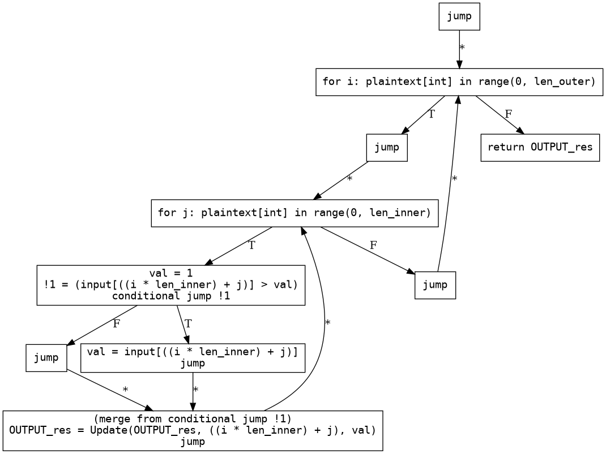
#### SSA
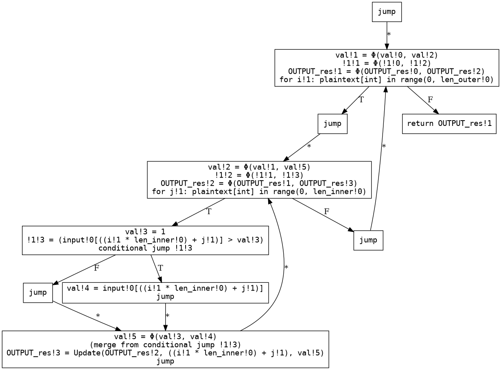
#### SSA ϕ→MUX
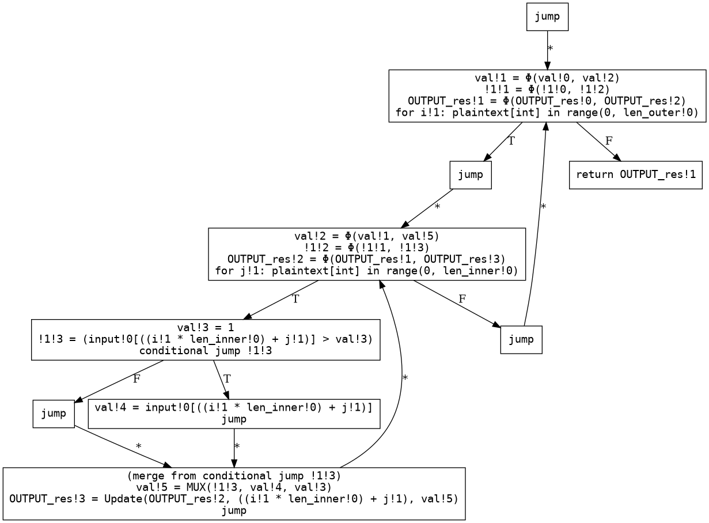
#### Dead code elimination
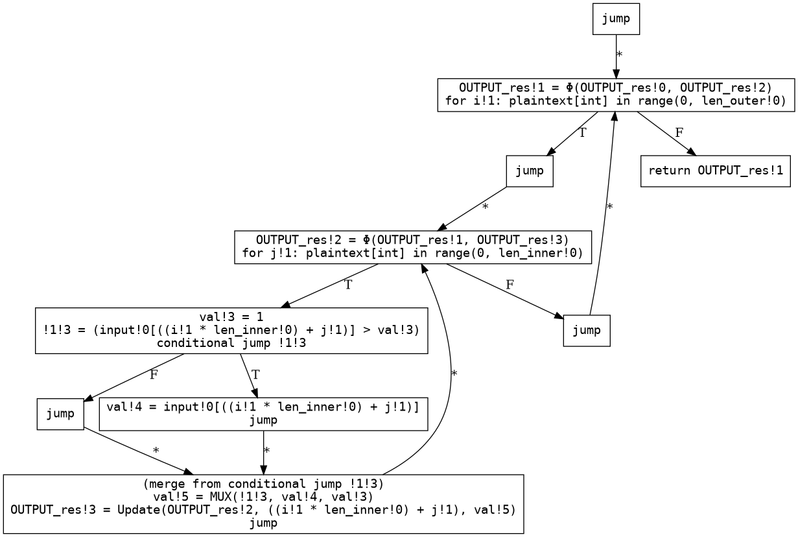
#### Linear code with loops
```python
def mnist_relu(input!0: shared[list[int; ?]], OUTPUT_res!0: plaintext[list[int; ?]], len_outer!0: plaintext[int], len_inner!0: plaintext[int]) -> shared[list[int; ?]]:
    for i!1 in range(0, len_outer!0):
        OUTPUT_res!1 = Φ(OUTPUT_res!0, OUTPUT_res!2)
        for j!1 in range(0, len_inner!0):
            OUTPUT_res!2 = Φ(OUTPUT_res!1, OUTPUT_res!3)
            val!3 = 1
            !1!3 = (input!0[((i!1 * len_inner!0) + j!1)] > val!3)
            val!4 = input!0[((i!1 * len_inner!0) + j!1)]
            val!5 = MUX(!1!3, val!4, val!3)
            OUTPUT_res!3 = Update(OUTPUT_res!2, ((i!1 * len_inner!0) + j!1), val!5)
    return OUTPUT_res!1
```
#### Dependency graph
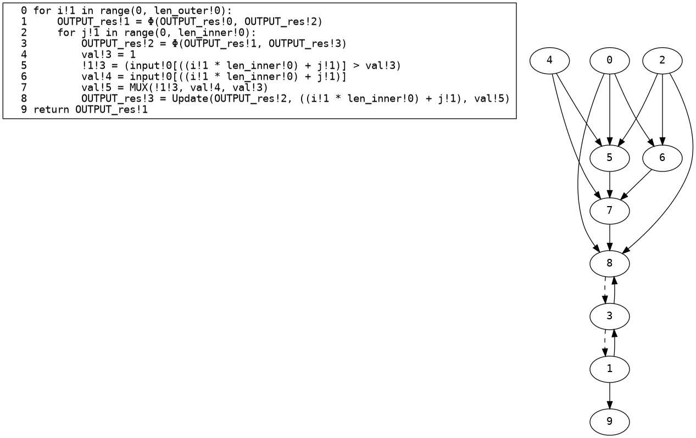
#### Removal of infeasible edges
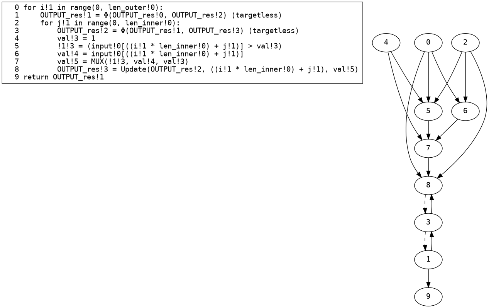
#### Type Environment Before Vectorization
| Variable | Type |
| - | - |
| `input!0` | `shared[list[int; ?]]` |
| `OUTPUT_res!0` | `plaintext[list[int; ?]]` |
| `len_outer!0` | `plaintext[int]` |
| `len_inner!0` | `plaintext[int]` |
| `i!1` | `plaintext[int]` |
| `j!1` | `plaintext[int]` |
| `OUTPUT_res!3` | `shared[list[list[int; (len_outer!0)]; (len_inner!0)]]` |
| `OUTPUT_res!2` | `shared[list[list[int; (len_outer!0)]; (len_inner!0)]]` |
| `OUTPUT_res!1` | `shared[list[list[int; (len_outer!0)]; (len_inner!0)]]` |
| `val!5` | `shared[int]` |
| `val!4` | `shared[int]` |
| `!1!3` | `shared[bool]` |
| `val!3` | `plaintext[int]` |
#### Basic Vectorization Phase 1
```python
def mnist_relu(input!0: shared[list[int; ?]], OUTPUT_res!0: plaintext[list[int; ?]], len_outer!0: plaintext[int], len_inner!0: plaintext[int]) -> shared[list[int; ?]]:
    !2!0{LEN_OUTER!0, LEN_INNER!0}[] = lift(OUTPUT_res!0, (_:len_outer!0, _:len_inner!0))
    for i!1 in range(0, len_outer!0):
        OUTPUT_res!1{LEN_OUTER!0, LEN_INNER!0}[] = Φ(!2!0{LEN_OUTER!0, LEN_INNER!0}[], OUTPUT_res!2{LEN_OUTER!0, LEN_INNER!0}[]) (targetless)
        !3!0{LEN_OUTER!0, LEN_INNER!0}[] = lift(OUTPUT_res!1{LEN_OUTER!0, LEN_INNER!0}[], (i!1:len_outer!0, j!1:len_inner!0))
        !4!0{LEN_OUTER!0, LEN_INNER!0}[] = lift(input!0[((i!1 * len_inner!0) + j!1)], (i!1:len_outer!0, j!1:len_inner!0))
        !5!0{LEN_OUTER!0, LEN_INNER!0}[] = lift(input!0[((i!1 * len_inner!0) + j!1)], (i!1:len_outer!0, j!1:len_inner!0))
        for j!1 in range(0, len_inner!0):
            OUTPUT_res!2{LEN_OUTER!0, LEN_INNER!0}[] = Φ(!3!0{LEN_OUTER!0, LEN_INNER!0}[], OUTPUT_res!3{LEN_OUTER!0, LEN_INNER!0}[]) (targetless)
            val!3 = 1
            !1!3{LEN_OUTER!0, LEN_INNER!0}[] = (!4!0{LEN_OUTER!0, LEN_INNER!0}[] > val!3)
            val!4{LEN_OUTER!0, LEN_INNER!0}[] = !5!0{LEN_OUTER!0, LEN_INNER!0}[]
            val!5{LEN_OUTER!0, LEN_INNER!0}[] = MUX(!1!3{LEN_OUTER!0, LEN_INNER!0}[], val!4{LEN_OUTER!0, LEN_INNER!0}[], val!3)
            OUTPUT_res!3{LEN_OUTER!0, LEN_INNER!0}[] = VectorizedUpdate(OUTPUT_res!2{LEN_OUTER!0, LEN_INNER!0}[], [I!1, J!1], val!5{LEN_OUTER!0, LEN_INNER!0}[])
    return OUTPUT_res!1
```
#### Basic Vectorization Phase 1 (dependence graph)
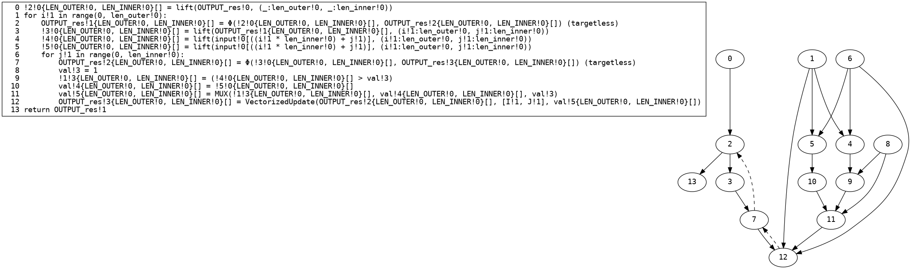
#### Basic Vectorization Phase 2
```python
def mnist_relu(input!0: shared[list[int; ?]], OUTPUT_res!0: plaintext[list[int; ?]], len_outer!0: plaintext[int], len_inner!0: plaintext[int]) -> shared[list[int; ?]]:
    !2!0{LEN_OUTER!0, LEN_INNER!0}[] = lift(OUTPUT_res!0, (_:len_outer!0, _:len_inner!0))
    !4!0{LEN_OUTER!0, LEN_INNER!0}[] = lift(input!0[((i!1 * len_inner!0) + j!1)], (i!1:len_outer!0, j!1:len_inner!0))
    !5!0{LEN_OUTER!0, LEN_INNER!0}[] = lift(input!0[((i!1 * len_inner!0) + j!1)], (i!1:len_outer!0, j!1:len_inner!0))
    val!3 = 1
    !3!0{LEN_OUTER!0, LEN_INNER!0}[] = lift(!2!0{LEN_OUTER!0, LEN_INNER!0}[], (i!1:len_outer!0, j!1:len_inner!0))
    val!4{LEN_OUTER!0, LEN_INNER!0}[] = !5!0{LEN_OUTER!0, LEN_INNER!0}[]
    !1!3{LEN_OUTER!0, LEN_INNER!0}[] = (!4!0{LEN_OUTER!0, LEN_INNER!0}[] > val!3)
    val!5{LEN_OUTER!0, LEN_INNER!0}[] = MUX(!1!3{LEN_OUTER!0, LEN_INNER!0}[], val!4{LEN_OUTER!0, LEN_INNER!0}[], val!3)
    OUTPUT_res!3{LEN_OUTER!0, LEN_INNER!0}[] = VectorizedUpdate(!3!0{LEN_OUTER!0, LEN_INNER!0}[], [I!1, J!1], val!5{LEN_OUTER!0, LEN_INNER!0}[])
    return OUTPUT_res!3
```
#### Basic Vectorization Phase 2 (dependence graph)
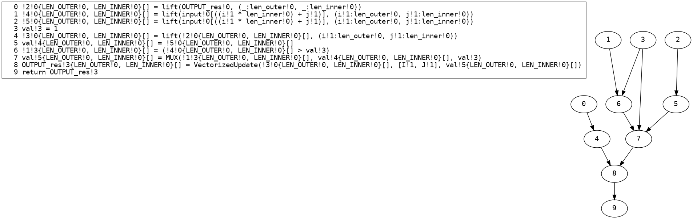
#### Type Environment After Vectorization
| Variable | Type |
| - | - |
| `input!0` | `shared[list[int; ?]]` |
| `OUTPUT_res!0` | `plaintext[list[int; ?]]` |
| `len_outer!0` | `plaintext[int]` |
| `len_inner!0` | `plaintext[int]` |
| `OUTPUT_res!3` | `shared[list[list[int; (len_outer!0)]; (len_inner!0)]]` |
| `val!5` | `shared[list[list[int; (len_outer!0)]; (len_inner!0)]]` |
| `!1!3` | `shared[list[list[bool; (len_outer!0)]; (len_inner!0)]]` |
| `val!4` | `shared[list[list[int; (len_outer!0)]; (len_inner!0)]]` |
| `!3!0` | `shared[list[list[int; (len_outer!0)]; (len_inner!0)]]` |
| `val!3` | `plaintext[int]` |
| `!5!0` | `shared[list[list[int; (len_outer!0)]; (len_inner!0)]]` |
| `!4!0` | `shared[list[list[int; (len_outer!0)]; (len_inner!0)]]` |
| `!2!0` | `shared[list[list[int; (len_outer!0)]; (len_inner!0)]]` |
#### Copy propagation
```python
def mnist_relu(input!0: shared[list[int; ?]], OUTPUT_res!0: plaintext[list[int; ?]], len_outer!0: plaintext[int], len_inner!0: plaintext[int]) -> shared[list[int; ?]]:
    !2!0{LEN_OUTER!0, LEN_INNER!0}[] = lift(OUTPUT_res!0, (_:len_outer!0, _:len_inner!0))
    !4!0{LEN_OUTER!0, LEN_INNER!0}[] = lift(input!0[((i!1 * len_inner!0) + j!1)], (i!1:len_outer!0, j!1:len_inner!0))
    !5!0{LEN_OUTER!0, LEN_INNER!0}[] = lift(input!0[((i!1 * len_inner!0) + j!1)], (i!1:len_outer!0, j!1:len_inner!0))
    val!3 = 1
    !3!0{LEN_OUTER!0, LEN_INNER!0}[] = lift(!2!0{LEN_OUTER!0, LEN_INNER!0}[], (i!1:len_outer!0, j!1:len_inner!0))
    !1!3{LEN_OUTER!0, LEN_INNER!0}[] = (!4!0{LEN_OUTER!0, LEN_INNER!0}[] > val!3)
    val!5{LEN_OUTER!0, LEN_INNER!0}[] = MUX(!1!3{LEN_OUTER!0, LEN_INNER!0}[], !5!0{LEN_OUTER!0, LEN_INNER!0}[], val!3)
    OUTPUT_res!3{LEN_OUTER!0, LEN_INNER!0}[] = VectorizedUpdate(!3!0{LEN_OUTER!0, LEN_INNER!0}[], [I!1, J!1], val!5{LEN_OUTER!0, LEN_INNER!0}[])
    return OUTPUT_res!3
```
#### Common subexpression elimination
```python
def mnist_relu(input!0: shared[list[int; ?]], OUTPUT_res!0: plaintext[list[int; ?]], len_outer!0: plaintext[int], len_inner!0: plaintext[int]) -> shared[list[int; ?]]:
    !2!0{LEN_OUTER!0, LEN_INNER!0}[] = lift(OUTPUT_res!0, (_:len_outer!0, _:len_inner!0))
    !4!0{LEN_OUTER!0, LEN_INNER!0}[] = lift(input!0[((i!1 * len_inner!0) + j!1)], (i!1:len_outer!0, j!1:len_inner!0))
    val!3 = 1
    !3!0{LEN_OUTER!0, LEN_INNER!0}[] = lift(!2!0{LEN_OUTER!0, LEN_INNER!0}[], (i!1:len_outer!0, j!1:len_inner!0))
    !1!3{LEN_OUTER!0, LEN_INNER!0}[] = (!4!0{LEN_OUTER!0, LEN_INNER!0}[] > val!3)
    val!5{LEN_OUTER!0, LEN_INNER!0}[] = MUX(!1!3{LEN_OUTER!0, LEN_INNER!0}[], !4!0{LEN_OUTER!0, LEN_INNER!0}[], val!3)
    OUTPUT_res!3{LEN_OUTER!0, LEN_INNER!0}[] = VectorizedUpdate(!3!0{LEN_OUTER!0, LEN_INNER!0}[], [I!1, J!1], val!5{LEN_OUTER!0, LEN_INNER!0}[])
    return OUTPUT_res!3
```
#### MOTION mixed configuration
```Total cost:	0.12173
Input vars:	{input!0: ['B', 'Y']}
Constants:	{1: ['B', 'Y']}
Plaintext vars:	{OUTPUT_res!0: ['B']}
Flags:		{}
!2!0{LEN_OUTER!0, LEN_INNER!0}[] = lift(OUTPUT_res!0, (_:len_outer!0, _:len_inner!0)): _ -> ['B'] for 0.00000 * 1 = 0.00
!4!0{LEN_OUTER!0, LEN_INNER!0}[] = lift(input!0[((i!1 * len_inner!0) + j!1)], (i!1:len_outer!0, j!1:len_inner!0)): _ -> ['B', 'Y'] for 0.00000 * 1 = 0.00
val!3 = 1: _ -> ['B', 'Y'] for 0.00000 * 1 = 0.00
!3!0{LEN_OUTER!0, LEN_INNER!0}[] = lift(!2!0{LEN_OUTER!0, LEN_INNER!0}[], (i!1:len_outer!0, j!1:len_inner!0)): _ -> ['B'] for 0.00000 * 1 = 0.00
!1!3{LEN_OUTER!0, LEN_INNER!0}[] = (!4!0{LEN_OUTER!0, LEN_INNER!0}[] > val!3): Y -> ['B'] for 0.11647 * 1 = 0.12 (Y->B)
val!5{LEN_OUTER!0, LEN_INNER!0}[] = MUX(!1!3{LEN_OUTER!0, LEN_INNER!0}[], !4!0{LEN_OUTER!0, LEN_INNER!0}[], val!3): B -> {} for 0.00527 * 1 = 0.01
OUTPUT_res!3{LEN_OUTER!0, LEN_INNER!0}[] = VectorizedUpdate(!3!0{LEN_OUTER!0, LEN_INNER!0}[], [I!1, J!1], val!5{LEN_OUTER!0, LEN_INNER!0}[]): B -> {} for 0.00000 * 1 = 0.00
return OUTPUT_res!3
Output vars:	{OUTPUT_res!3: ['B']}

```
#### MOTION code
```cpp
template <encrypto::motion::MpcProtocol Protocol>
std::vector<encrypto::motion::SecureUnsignedInteger> mnist_relu(
    encrypto::motion::PartyPointer &party,
    std::vector<encrypto::motion::SecureUnsignedInteger> input_0,
    std::vector<std::uint32_t> _MPC_PLAINTEXT_OUTPUT_res_0,
    std::uint32_t _MPC_PLAINTEXT_len_outer_0,
    std::uint32_t _MPC_PLAINTEXT_len_inner_0
) {
    // Shared variable declarations
    std::vector<encrypto::motion::ShareWrapper> _1_3((_MPC_PLAINTEXT_len_outer_0) * (_MPC_PLAINTEXT_len_inner_0));
    std::vector<encrypto::motion::SecureUnsignedInteger> _2_0((_MPC_PLAINTEXT_len_outer_0) * (_MPC_PLAINTEXT_len_inner_0));
    std::vector<encrypto::motion::SecureUnsignedInteger> _3_0((_MPC_PLAINTEXT_len_outer_0) * (_MPC_PLAINTEXT_len_inner_0));
    std::vector<encrypto::motion::SecureUnsignedInteger> _4_0((_MPC_PLAINTEXT_len_outer_0) * (_MPC_PLAINTEXT_len_inner_0));
    std::vector<encrypto::motion::SecureUnsignedInteger> OUTPUT_res_0;
    std::vector<encrypto::motion::SecureUnsignedInteger> OUTPUT_res_3((_MPC_PLAINTEXT_len_outer_0) * (_MPC_PLAINTEXT_len_inner_0));
    encrypto::motion::SecureUnsignedInteger len_inner_0;
    encrypto::motion::SecureUnsignedInteger len_outer_0;
    encrypto::motion::SecureUnsignedInteger val_3;
    std::vector<encrypto::motion::SecureUnsignedInteger> val_5((_MPC_PLAINTEXT_len_outer_0) * (_MPC_PLAINTEXT_len_inner_0));

    // Plaintext variable declarations
    std::uint32_t _MPC_PLAINTEXT_val_3;

    // Constant initializations
    encrypto::motion::SecureUnsignedInteger _MPC_CONSTANT_1 = party->In<Protocol>(encrypto::motion::ToInput(std::uint32_t(1)), 0);

    // Plaintext parameter assignments
    OUTPUT_res_0.clear();
    std::transform(_MPC_PLAINTEXT_OUTPUT_res_0.begin(), _MPC_PLAINTEXT_OUTPUT_res_0.end(), std::back_inserter(OUTPUT_res_0), [&](const auto &val) { return party->In<Protocol>(encrypto::motion::ToInput(val), 0); });
    len_inner_0 = party->In<Protocol>(encrypto::motion::ToInput(_MPC_PLAINTEXT_len_inner_0), 0);
    len_outer_0 = party->In<Protocol>(encrypto::motion::ToInput(_MPC_PLAINTEXT_len_outer_0), 0);

    // Function body
    vectorized_assign(_2_0, {_MPC_PLAINTEXT_len_outer_0, _MPC_PLAINTEXT_len_inner_0}, {true, true}, {}, lift(std::function([&](const std::vector<std::uint32_t> &indices){return OUTPUT_res_0;}), {_MPC_PLAINTEXT_len_outer_0, _MPC_PLAINTEXT_len_inner_0}));
    vectorized_assign(_4_0, {_MPC_PLAINTEXT_len_outer_0, _MPC_PLAINTEXT_len_inner_0}, {true, true}, {}, lift(std::function([&](const std::vector<std::uint32_t> &indices){return input_0[((indices[0] * _MPC_PLAINTEXT_len_inner_0) + indices[1])];}), {_MPC_PLAINTEXT_len_outer_0, _MPC_PLAINTEXT_len_inner_0}));
    val_3 = _MPC_CONSTANT_1;
    _MPC_PLAINTEXT_val_3 = std::uint32_t(1);
    vectorized_assign(_3_0, {_MPC_PLAINTEXT_len_outer_0, _MPC_PLAINTEXT_len_inner_0}, {true, true}, {}, lift(std::function([&](const std::vector<std::uint32_t> &indices){return vectorized_access(_2_0, {_MPC_PLAINTEXT_len_outer_0, _MPC_PLAINTEXT_len_inner_0}, {true, true}, {}).Unsimdify();}), {_MPC_PLAINTEXT_len_outer_0, _MPC_PLAINTEXT_len_inner_0}));
    vectorized_assign(_1_3, {_MPC_PLAINTEXT_len_outer_0, _MPC_PLAINTEXT_len_inner_0}, {true, true}, {}, (vectorized_access(_4_0, {_MPC_PLAINTEXT_len_outer_0, _MPC_PLAINTEXT_len_inner_0}, {true, true}, {}) > decltype(val_3)::Simdify(lift(std::function([&](const std::vector<std::uint32_t> &indices){return val_3;}), {_MPC_PLAINTEXT_len_outer_0, _MPC_PLAINTEXT_len_inner_0}))));
    vectorized_assign(val_5, {_MPC_PLAINTEXT_len_outer_0, _MPC_PLAINTEXT_len_inner_0}, {true, true}, {}, vectorized_access(_1_3, {_MPC_PLAINTEXT_len_outer_0, _MPC_PLAINTEXT_len_inner_0}, {true, true}, {}).Mux(vectorized_access(_4_0, {_MPC_PLAINTEXT_len_outer_0, _MPC_PLAINTEXT_len_inner_0}, {true, true}, {}).Get(), decltype(val_3)::Simdify(lift(std::function([&](const std::vector<std::uint32_t> &indices){return val_3;}), {_MPC_PLAINTEXT_len_outer_0, _MPC_PLAINTEXT_len_inner_0})).Get()));
    vectorized_assign(OUTPUT_res_3, {_MPC_PLAINTEXT_len_outer_0, _MPC_PLAINTEXT_len_inner_0}, {true, true}, {}, vectorized_update(_3_0, {_MPC_PLAINTEXT_len_outer_0, _MPC_PLAINTEXT_len_inner_0}, {true, true}, {}, vectorized_access(val_5, {_MPC_PLAINTEXT_len_outer_0, _MPC_PLAINTEXT_len_inner_0}, {true, true}, {})));
    return OUTPUT_res_3;

}
```
#### MOTION mixed code
```cpp
std::vector<encrypto::motion::SecureUnsignedInteger> mnist_relu(
    encrypto::motion::PartyPointer &party,
    std::vector<encrypto::motion::SecureUnsignedInteger> input_0,
    std::vector<std::uint32_t> _MPC_PLAINTEXT_OUTPUT_res_0,
    std::uint32_t _MPC_PLAINTEXT_len_outer_0,
    std::uint32_t _MPC_PLAINTEXT_len_inner_0
) {
    // Shared variable declarations
    std::vector<encrypto::motion::ShareWrapper> _1_3((_MPC_PLAINTEXT_len_outer_0) * (_MPC_PLAINTEXT_len_inner_0));
    std::vector<encrypto::motion::SecureUnsignedInteger> _2_0((_MPC_PLAINTEXT_len_outer_0) * (_MPC_PLAINTEXT_len_inner_0));
    std::vector<encrypto::motion::SecureUnsignedInteger> _3_0((_MPC_PLAINTEXT_len_outer_0) * (_MPC_PLAINTEXT_len_inner_0));
    std::vector<encrypto::motion::SecureUnsignedInteger> _4_0((_MPC_PLAINTEXT_len_outer_0) * (_MPC_PLAINTEXT_len_inner_0));
    std::vector<encrypto::motion::SecureUnsignedInteger> OUTPUT_res_0;
    std::vector<encrypto::motion::SecureUnsignedInteger> OUTPUT_res_3((_MPC_PLAINTEXT_len_outer_0) * (_MPC_PLAINTEXT_len_inner_0));
    encrypto::motion::SecureUnsignedInteger len_inner_0;
    encrypto::motion::SecureUnsignedInteger len_outer_0;
    encrypto::motion::SecureUnsignedInteger val_3;
    std::vector<encrypto::motion::SecureUnsignedInteger> val_5((_MPC_PLAINTEXT_len_outer_0) * (_MPC_PLAINTEXT_len_inner_0));

    // Plaintext variable declarations
    std::uint32_t _MPC_PLAINTEXT_val_3;

    // Constant initializations
    encrypto::motion::SecureUnsignedInteger _MPC_CONSTANT_1 = party->In<encrypto::motion::MpcProtocol::kBooleanGmw>(encrypto::motion::ToInput(std::uint32_t(1)), 0);
    encrypto::motion::SecureUnsignedInteger _MPC_CONSTANT_1_Y = party->In<encrypto::motion::MpcProtocol::kBmr>(encrypto::motion::ToInput(std::uint32_t(1)), 0);

    // Input Protocol Convertions
    std::vector<encrypto::motion::SecureUnsignedInteger> input_0_Y(input_0.size());
    vectorized_assign(input_0_Y, {input_0.size()}, {true}, {}, (vectorized_access(input_0, {input_0.size()}, {true}, {}).Get().Convert<encrypto::motion::MpcProtocol::kBmr>()));

    // Plaintext parameter assignments
    OUTPUT_res_0.clear();
    std::transform(_MPC_PLAINTEXT_OUTPUT_res_0.begin(), _MPC_PLAINTEXT_OUTPUT_res_0.end(), std::back_inserter(OUTPUT_res_0), [&](const auto &val) { return party->In<encrypto::motion::MpcProtocol::kBooleanGmw>(encrypto::motion::ToInput(val), 0); });

    // Function body
    vectorized_assign(_2_0, {_MPC_PLAINTEXT_len_outer_0, _MPC_PLAINTEXT_len_inner_0}, {true, true}, {}, lift(std::function([&](const std::vector<std::uint32_t> &indices){return OUTPUT_res_0;}), {_MPC_PLAINTEXT_len_outer_0, _MPC_PLAINTEXT_len_inner_0}));
    vectorized_assign(_4_0, {_MPC_PLAINTEXT_len_outer_0, _MPC_PLAINTEXT_len_inner_0}, {true, true}, {}, lift(std::function([&](const std::vector<std::uint32_t> &indices){return input_0[((indices[0] * _MPC_PLAINTEXT_len_inner_0) + indices[1])];}), {_MPC_PLAINTEXT_len_outer_0, _MPC_PLAINTEXT_len_inner_0}));std::vector<encrypto::motion::SecureUnsignedInteger> _4_0_Y((_MPC_PLAINTEXT_len_outer_0) * (_MPC_PLAINTEXT_len_inner_0));
    vectorized_assign(_4_0_Y, {_MPC_PLAINTEXT_len_outer_0, _MPC_PLAINTEXT_len_inner_0}, {true, true}, {}, lift(std::function([&](const std::vector<std::uint32_t> &indices){return input_0_Y[((indices[0] * _MPC_PLAINTEXT_len_inner_0) + indices[1])];}), {_MPC_PLAINTEXT_len_outer_0, _MPC_PLAINTEXT_len_inner_0}));
    val_3 = _MPC_CONSTANT_1;
    encrypto::motion::SecureUnsignedInteger val_3_Y;
    val_3_Y = _MPC_CONSTANT_1_Y;
    _MPC_PLAINTEXT_val_3 = std::uint32_t(1);
    vectorized_assign(_3_0, {_MPC_PLAINTEXT_len_outer_0, _MPC_PLAINTEXT_len_inner_0}, {true, true}, {}, lift(std::function([&](const std::vector<std::uint32_t> &indices){return vectorized_access(_2_0, {_MPC_PLAINTEXT_len_outer_0, _MPC_PLAINTEXT_len_inner_0}, {true, true}, {}).Unsimdify();}), {_MPC_PLAINTEXT_len_outer_0, _MPC_PLAINTEXT_len_inner_0}));
    vectorized_assign(_1_3, {_MPC_PLAINTEXT_len_outer_0, _MPC_PLAINTEXT_len_inner_0}, {true, true}, {}, (vectorized_access(_4_0_Y, {_MPC_PLAINTEXT_len_outer_0, _MPC_PLAINTEXT_len_inner_0}, {true, true}, {}) > decltype(val_3_Y)::Simdify(lift(std::function([&](const std::vector<std::uint32_t> &indices){return val_3_Y;}), {_MPC_PLAINTEXT_len_outer_0, _MPC_PLAINTEXT_len_inner_0}))));
    std::vector<encrypto::motion::ShareWrapper> _1_3_B((_MPC_PLAINTEXT_len_outer_0) * (_MPC_PLAINTEXT_len_inner_0));
    vectorized_assign(_1_3_B, {_MPC_PLAINTEXT_len_outer_0, _MPC_PLAINTEXT_len_inner_0}, {true, true}, {}, (vectorized_access(_1_3, {_MPC_PLAINTEXT_len_outer_0, _MPC_PLAINTEXT_len_inner_0}, {true, true}, {}).Convert<encrypto::motion::MpcProtocol::kBooleanGmw>()));

    vectorized_assign(val_5, {_MPC_PLAINTEXT_len_outer_0, _MPC_PLAINTEXT_len_inner_0}, {true, true}, {}, vectorized_access(_1_3_B, {_MPC_PLAINTEXT_len_outer_0, _MPC_PLAINTEXT_len_inner_0}, {true, true}, {}).Mux(vectorized_access(_4_0, {_MPC_PLAINTEXT_len_outer_0, _MPC_PLAINTEXT_len_inner_0}, {true, true}, {}).Get(), decltype(val_3)::Simdify(lift(std::function([&](const std::vector<std::uint32_t> &indices){return val_3;}), {_MPC_PLAINTEXT_len_outer_0, _MPC_PLAINTEXT_len_inner_0})).Get()));
    vectorized_assign(OUTPUT_res_3, {_MPC_PLAINTEXT_len_outer_0, _MPC_PLAINTEXT_len_inner_0}, {true, true}, {}, vectorized_update(_3_0, {_MPC_PLAINTEXT_len_outer_0, _MPC_PLAINTEXT_len_inner_0}, {true, true}, {}, vectorized_access(val_5, {_MPC_PLAINTEXT_len_outer_0, _MPC_PLAINTEXT_len_inner_0}, {true, true}, {})));
    return OUTPUT_res_3;

}
```
#### MP-SPDZ mixed configuration
```Total cost:	0.00179
Input vars:	{input!0: ['B']}
Constants:	{1: ['B']}
Plaintext vars:	{OUTPUT_res!0: ['B']}
Flags:		{X}
!2!0{LEN_OUTER!0, LEN_INNER!0}[] = lift(OUTPUT_res!0, (_:len_outer!0, _:len_inner!0)): _ -> ['B'] for 0.00000 * 1 = 0.00
!4!0{LEN_OUTER!0, LEN_INNER!0}[] = lift(input!0[((i!1 * len_inner!0) + j!1)], (i!1:len_outer!0, j!1:len_inner!0)): _ -> ['B'] for 0.00000 * 1 = 0.00
val!3 = 1: _ -> ['B'] for 0.00000 * 1 = 0.00
!3!0{LEN_OUTER!0, LEN_INNER!0}[] = lift(!2!0{LEN_OUTER!0, LEN_INNER!0}[], (i!1:len_outer!0, j!1:len_inner!0)): _ -> ['B'] for 0.00000 * 1 = 0.00
!1!3{LEN_OUTER!0, LEN_INNER!0}[] = (!4!0{LEN_OUTER!0, LEN_INNER!0}[] > val!3): B -> {} for 0.00179 * 1 = 0.00
val!5{LEN_OUTER!0, LEN_INNER!0}[] = MUX(!1!3{LEN_OUTER!0, LEN_INNER!0}[], !4!0{LEN_OUTER!0, LEN_INNER!0}[], val!3): B -> {} for 0.00000 * 1 = 0.00
OUTPUT_res!3{LEN_OUTER!0, LEN_INNER!0}[] = VectorizedUpdate(!3!0{LEN_OUTER!0, LEN_INNER!0}[], [I!1, J!1], val!5{LEN_OUTER!0, LEN_INNER!0}[]): B -> {} for 0.00000 * 1 = 0.00
return OUTPUT_res!3
Output vars:	{OUTPUT_res!3: ['B']}

```
#### MP-SPDZ code
```py
def mnist_relu(input_0, OUTPUT_res_0, len_outer_0, len_inner_0):
    # Shared array declarations
    _1_3 = [None] * (len_outer_0 * len_inner_0)
    _2_0 = [None] * (len_outer_0 * len_inner_0)
    _3_0 = [None] * (len_outer_0 * len_inner_0)
    _4_0 = [None] * (len_outer_0 * len_inner_0)
    OUTPUT_res_3 = [None] * (len_outer_0 * len_inner_0)
    val_5 = [None] * (len_outer_0 * len_inner_0)
    # Function body
    _2_0 = _v.lift(lambda indices: OUTPUT_res_0, [len_outer_0, len_inner_0])
    _4_0 = _v.lift(lambda indices: (input_0[((indices[0] * len_inner_0) + indices[1])]), [len_outer_0, len_inner_0])
    val_3 = sint(1)
    _3_0 = _v.lift(lambda indices: _v.vectorized_access(_2_0, [len_outer_0, len_inner_0], [None, None]), [len_outer_0, len_inner_0])
    _v.vectorized_assign(_1_3, [len_outer_0, len_inner_0], [None, None], (_v.vectorized_access_simd(_4_0, [len_outer_0, len_inner_0], [None, None]) > val_3))
    _v.iterative_mux(val_5,_1_3,_4_0,val_3,[len_outer_0, len_inner_0],[None, None])
    _v.vectorized_assign(_3_0, [len_outer_0, len_inner_0], [None, None], _v.vectorized_access(val_5, [len_outer_0, len_inner_0], [None, None])); _v.vectorized_assign(OUTPUT_res_3, [len_outer_0, len_inner_0], [None, None], _v.vectorized_access(_3_0, [len_outer_0, len_inner_0], [None, None]))
    return OUTPUT_res_3
```
#### MP-SPDZ mixed code
```py
program.options.binary = 32
program.use_dabit = True
def mnist_relu(input_0, OUTPUT_res_0, len_outer_0, len_inner_0):
    # Convertion functions
    siv32 = sbitintvec.get_type(32)
    sb32 = sbits.get_type(32)
    OUTPUT_res_0 = [elem for elem in sint(OUTPUT_res_0)]


    
    # Shared array declarations
    _1_3 = [None] * (len_outer_0 * len_inner_0)
    _2_0 = [None] * (len_outer_0 * len_inner_0)
    _3_0 = [None] * (len_outer_0 * len_inner_0)
    _4_0 = [None] * (len_outer_0 * len_inner_0)
    OUTPUT_res_3 = [None] * (len_outer_0 * len_inner_0)
    val_5 = [None] * (len_outer_0 * len_inner_0)
    # Shared array convertion declarations
    
    # Function body
    _2_0 = _v.lift(lambda indices: OUTPUT_res_0, [len_outer_0, len_inner_0])
    _4_0 = _v.lift(lambda indices: (input_0[((indices[0] * len_inner_0) + indices[1])]), [len_outer_0, len_inner_0])
    val_3 = siv32(1)
    _3_0 = _v.lift(lambda indices: _v.vectorized_access(_2_0, [len_outer_0, len_inner_0], [None, None]), [len_outer_0, len_inner_0])
    _v.vectorized_assign(_1_3, [len_outer_0, len_inner_0], [None, None], (_v.vectorized_access_simd(_4_0, [len_outer_0, len_inner_0], [None, None]) > val_3))
    _v.iterative_mux(val_5,_1_3,_4_0,val_3,[len_outer_0, len_inner_0],[None, None])
    _v.vectorized_assign(_3_0, [len_outer_0, len_inner_0], [None, None], _v.vectorized_access(val_5, [len_outer_0, len_inner_0], [None, None])); _v.vectorized_assign(OUTPUT_res_3, [len_outer_0, len_inner_0], [None, None], _v.vectorized_access(_3_0, [len_outer_0, len_inner_0], [None, None]))
    return OUTPUT_res_3
```
### `psi`
#### Input
```python
from UTIL import shared

# returns a list[int] which is the intersection of privite sets of integers A and B
# requires: no repetition of elements in either A or B
# requires: len(A) = D, len(B) = R
# requires: result is an array of 0's len(result) >= min(len(A),len(B))
def psi(
    A: shared[list[int]], D: int, B: shared[list[int]], R: int, result: shared[list[int]]
) -> shared[list[int]]:
    #dummy: int = 0
    #result: list[int] = []
    for i in range(0, D):
        flag: bool = False
        for j in range(0, R):
            if A[i] == B[j]:
                flag = True
        val: int = result[i]
        if flag:
            val = A[i]
        # overloaded +. This is append actually.
        result[i] = val
    return result


A = [4, 2, 3, 1, 10]
B = [2, 10, 3, 4, 5, 6, 7]
result = [0 for i in range(len(A))]
D = 5
R = 7
print(psi(A, D, B, R, result))

```
#### Restricted AST
```python
def psi(A: shared[list[int; ?]], D: plaintext[int], B: shared[list[int; ?]], R: plaintext[int], result: shared[list[int; ?]]) -> shared[list[int; ?]]:
    for i: plaintext[int] in range(0, D):
        flag = False
        for j: plaintext[int] in range(0, R):
            if (A[i] == B[j]):
                flag = True
        val = result[i]
        if flag:
            val = A[i]
        result[i] = val
    return result
```
#### Three-address code CFG
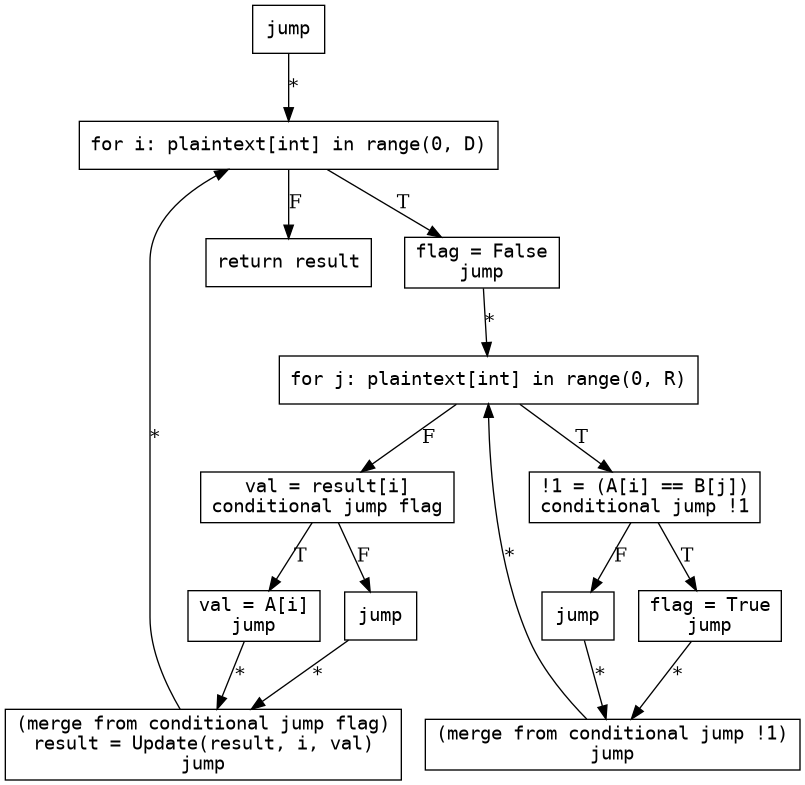
#### SSA
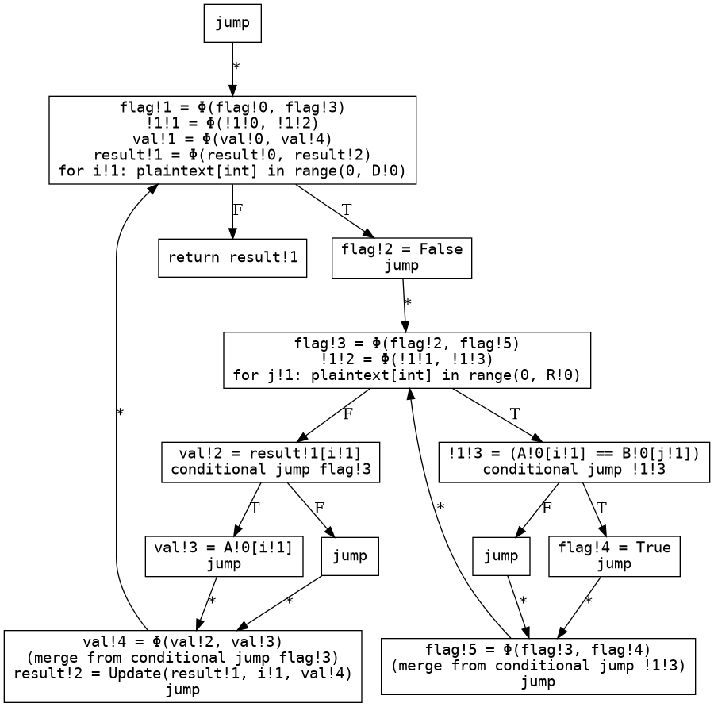
#### SSA ϕ→MUX

#### Dead code elimination
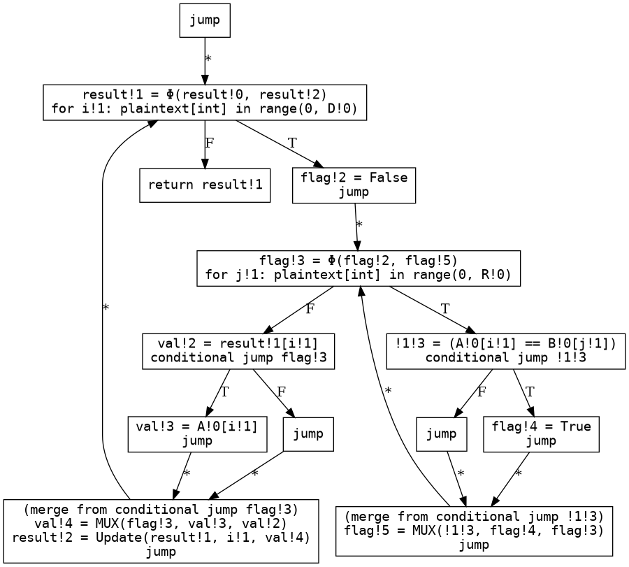
#### Linear code with loops
```python
def psi(A!0: shared[list[int; ?]], D!0: plaintext[int], B!0: shared[list[int; ?]], R!0: plaintext[int], result!0: shared[list[int; ?]]) -> shared[list[int; ?]]:
    for i!1 in range(0, D!0):
        result!1 = Φ(result!0, result!2)
        flag!2 = False
        for j!1 in range(0, R!0):
            flag!3 = Φ(flag!2, flag!5)
            !1!3 = (A!0[i!1] == B!0[j!1])
            flag!4 = True
            flag!5 = MUX(!1!3, flag!4, flag!3)
        val!2 = result!1[i!1]
        val!3 = A!0[i!1]
        val!4 = MUX(flag!3, val!3, val!2)
        result!2 = Update(result!1, i!1, val!4)
    return result!1
```
#### Dependency graph
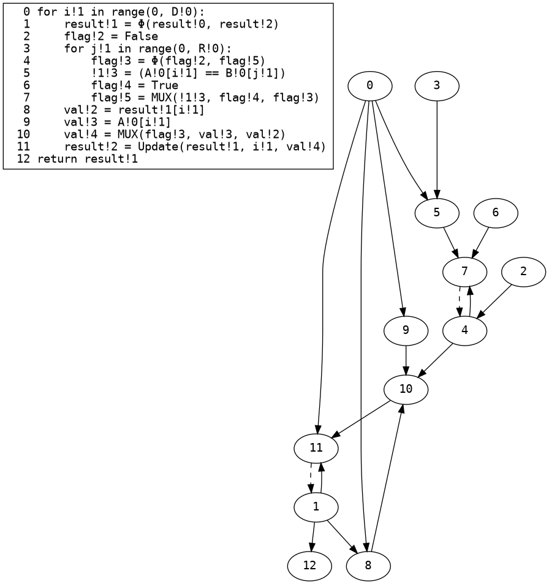
#### Removal of infeasible edges
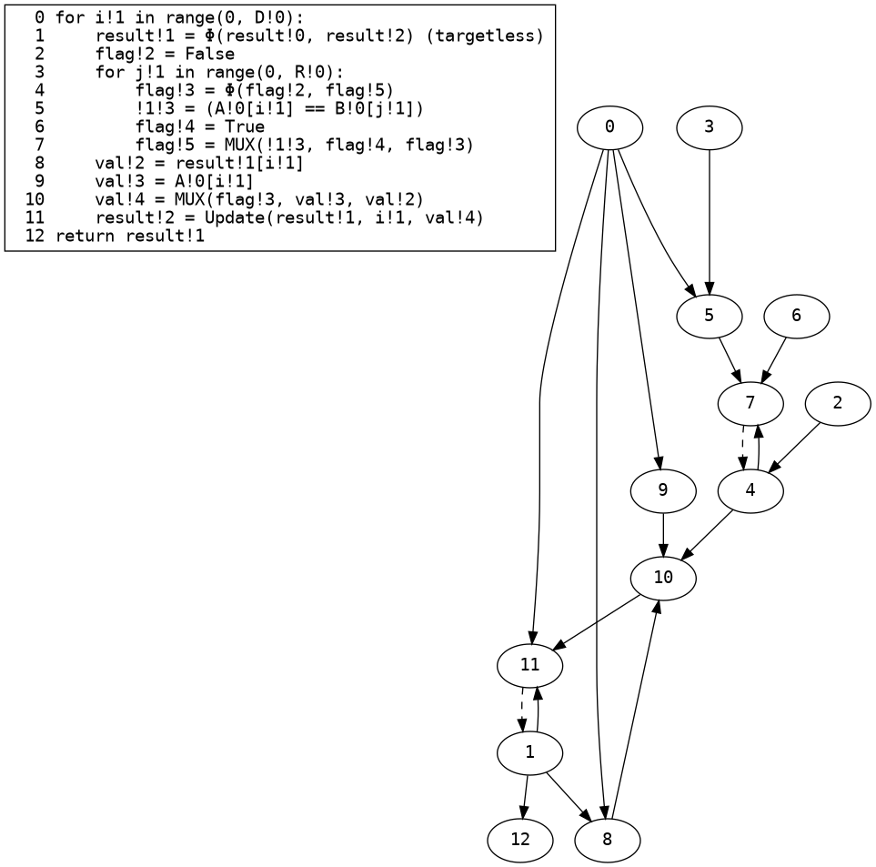
#### Type Environment Before Vectorization
| Variable | Type |
| - | - |
| `A!0` | `shared[list[int; ?]]` |
| `D!0` | `plaintext[int]` |
| `B!0` | `shared[list[int; ?]]` |
| `R!0` | `plaintext[int]` |
| `result!0` | `shared[list[int; ?]]` |
| `i!1` | `plaintext[int]` |
| `j!1` | `plaintext[int]` |
| `result!2` | `shared[list[int; (D!0)]]` |
| `result!1` | `shared[list[int; (D!0)]]` |
| `val!2` | `shared[int]` |
| `val!4` | `shared[int]` |
| `val!3` | `shared[int]` |
| `flag!5` | `shared[bool]` |
| `flag!3` | `shared[bool]` |
| `flag!4` | `plaintext[bool]` |
| `!1!3` | `shared[bool]` |
| `flag!2` | `plaintext[bool]` |
#### Basic Vectorization Phase 1
```python
def psi(A!0: shared[list[int; ?]], D!0: plaintext[int], B!0: shared[list[int; ?]], R!0: plaintext[int], result!0: shared[list[int; ?]]) -> shared[list[int; ?]]:
    !2!0{D!0}[] = lift(result!0, (i!1:D!0))
    !6!0{D!0}[] = lift(A!0[i!1], (i!1:D!0))
    for i!1 in range(0, D!0):
        result!1{D!0}[] = Φ(!2!0{D!0}[], result!2{D!0}[]) (targetless)
        flag!2 = False
        !3!0{D!0, R!0}[] = lift(flag!2, (i!1:D!0, j!1:R!0))
        !4!0{D!0, R!0}[] = lift(A!0[i!1], (i!1:D!0, j!1:R!0))
        !5!0{D!0, R!0}[] = lift(B!0[j!1], (i!1:D!0, j!1:R!0))
        for j!1 in range(0, R!0):
            flag!3{D!0, R!0}[] = Φ(!3!0{D!0, R!0}[], flag!5{D!0, R!0}[])
            !1!3{D!0, R!0}[] = (!4!0{D!0, R!0}[] == !5!0{D!0, R!0}[])
            flag!4 = True
            flag!5{D!0, R!0}[] = MUX(!1!3{D!0, R!0}[], flag!4, flag!3{D!0, R!0}[])
        val!2{D!0}[] = result!1{D!0}[]
        val!3{D!0}[] = !6!0{D!0}[]
        !7!0{D!0}[] = drop_dim(flag!5{D!0, R!0}[])
        val!4{D!0}[] = MUX(!7!0{D!0}[], val!3{D!0}[], val!2{D!0}[])
        result!2{D!0}[] = VectorizedUpdate(result!1{D!0}[], [I!1], val!4{D!0}[])
    return result!1
```
#### Basic Vectorization Phase 1 (dependence graph)
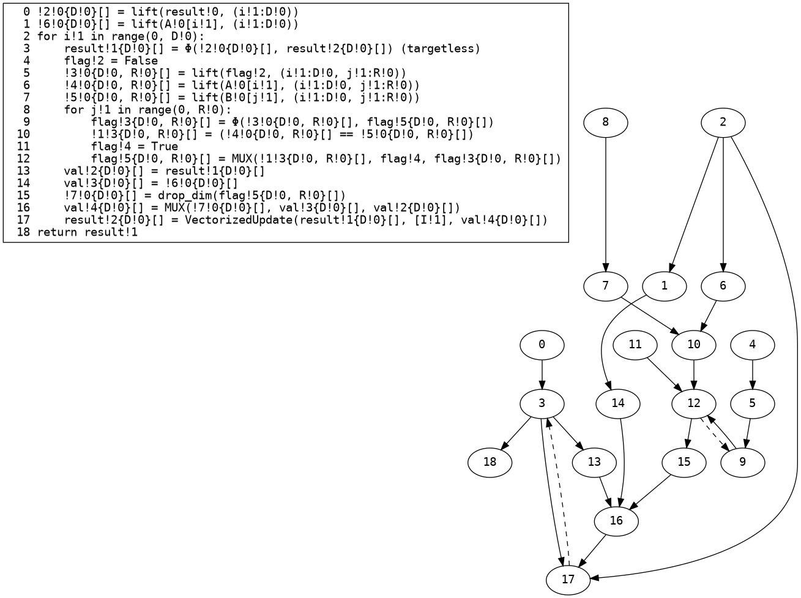
#### Basic Vectorization Phase 2
```python
def psi(A!0: shared[list[int; ?]], D!0: plaintext[int], B!0: shared[list[int; ?]], R!0: plaintext[int], result!0: shared[list[int; ?]]) -> shared[list[int; ?]]:
    !2!0{D!0}[] = lift(result!0, (i!1:D!0))
    !6!0{D!0}[] = lift(A!0[i!1], (i!1:D!0))
    flag!2 = False
    !4!0{D!0, R!0}[] = lift(A!0[i!1], (i!1:D!0, j!1:R!0))
    !5!0{D!0, R!0}[] = lift(B!0[j!1], (i!1:D!0, j!1:R!0))
    flag!4 = True
    val!2{D!0}[] = !2!0{D!0}[]
    val!3{D!0}[] = !6!0{D!0}[]
    !3!0{D!0, R!0}[] = lift(flag!2, (i!1:D!0, j!1:R!0))
    !1!3{D!0, R!0}[] = (!4!0{D!0, R!0}[] == !5!0{D!0, R!0}[])
    for !8!0 in range(0, R!0): (monolithic)
        flag!3{D!0}[!8!0] = Φ(!3!0{D!0}[!8!0], flag!5{D!0}[(!8!0 - 1)])
        flag!5{D!0}[!8!0] = MUX(!1!3{D!0}[!8!0], flag!4, flag!3{D!0}[!8!0])
    !7!0{D!0}[] = drop_dim(flag!5{D!0, R!0}[])
    val!4{D!0}[] = MUX(!7!0{D!0}[], val!3{D!0}[], val!2{D!0}[])
    result!2{D!0}[] = VectorizedUpdate(!2!0{D!0}[], [I!1], val!4{D!0}[])
    return result!2
```
#### Basic Vectorization Phase 2 (dependence graph)
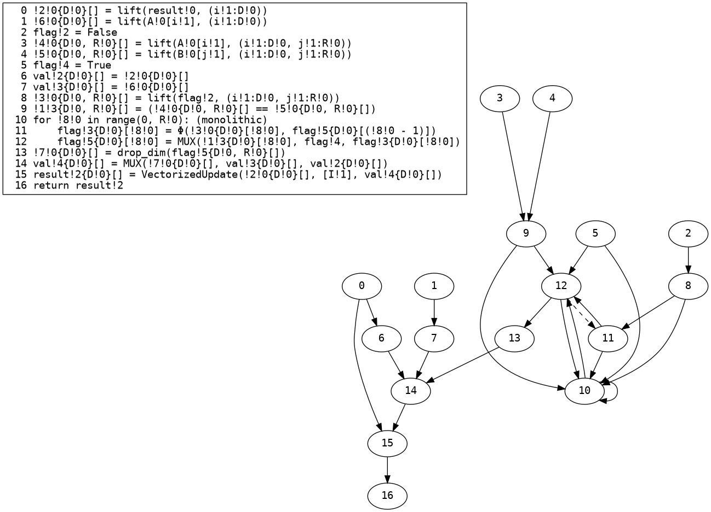
#### Type Environment After Vectorization
| Variable | Type |
| - | - |
| `A!0` | `shared[list[int; ?]]` |
| `D!0` | `plaintext[int]` |
| `B!0` | `shared[list[int; ?]]` |
| `R!0` | `plaintext[int]` |
| `result!0` | `shared[list[int; ?]]` |
| `!8!0` | `plaintext[int]` |
| `result!2` | `shared[list[int; (D!0)]]` |
| `val!4` | `shared[list[int; (D!0)]]` |
| `!7!0` | `shared[list[bool; (D!0)]]` |
| `flag!5` | `shared[list[list[bool; (D!0)]; (R!0)]]` |
| `flag!3` | `shared[list[list[bool; (D!0)]; (R!0)]]` |
| `!1!3` | `shared[list[list[bool; (D!0)]; (R!0)]]` |
| `!3!0` | `shared[list[list[bool; (D!0)]; (R!0)]]` |
| `val!3` | `shared[list[int; (D!0)]]` |
| `val!2` | `shared[list[int; (D!0)]]` |
| `flag!4` | `plaintext[bool]` |
| `!5!0` | `shared[list[list[int; (D!0)]; (R!0)]]` |
| `!4!0` | `shared[list[list[int; (D!0)]; (R!0)]]` |
| `flag!2` | `plaintext[bool]` |
| `!6!0` | `shared[list[int; (D!0)]]` |
| `!2!0` | `shared[list[int; (D!0)]]` |
#### Copy propagation
```python
def psi(A!0: shared[list[int; ?]], D!0: plaintext[int], B!0: shared[list[int; ?]], R!0: plaintext[int], result!0: shared[list[int; ?]]) -> shared[list[int; ?]]:
    !2!0{D!0}[] = lift(result!0, (i!1:D!0))
    !6!0{D!0}[] = lift(A!0[i!1], (i!1:D!0))
    flag!2 = False
    !4!0{D!0, R!0}[] = lift(A!0[i!1], (i!1:D!0, j!1:R!0))
    !5!0{D!0, R!0}[] = lift(B!0[j!1], (i!1:D!0, j!1:R!0))
    flag!4 = True
    !3!0{D!0, R!0}[] = lift(flag!2, (i!1:D!0, j!1:R!0))
    !1!3{D!0, R!0}[] = (!4!0{D!0, R!0}[] == !5!0{D!0, R!0}[])
    for !8!0 in range(0, R!0): (monolithic)
        flag!3{D!0}[!8!0] = Φ(!3!0{D!0}[!8!0], flag!5{D!0}[(!8!0 - 1)])
        flag!5{D!0}[!8!0] = MUX(!1!3{D!0}[!8!0], flag!4, flag!3{D!0}[!8!0])
    !7!0{D!0}[] = drop_dim(flag!5{D!0, R!0}[])
    val!4{D!0}[] = MUX(!7!0{D!0}[], !6!0{D!0}[], !2!0{D!0}[])
    result!2{D!0}[] = VectorizedUpdate(!2!0{D!0}[], [I!1], val!4{D!0}[])
    return result!2
```
#### Common subexpression elimination
```python
def psi(A!0: shared[list[int; ?]], D!0: plaintext[int], B!0: shared[list[int; ?]], R!0: plaintext[int], result!0: shared[list[int; ?]]) -> shared[list[int; ?]]:
    !2!0{D!0}[] = lift(result!0, (i!1:D!0))
    !6!0{D!0}[] = lift(A!0[i!1], (i!1:D!0))
    flag!2 = False
    !4!0{D!0, R!0}[] = lift(A!0[i!1], (i!1:D!0, j!1:R!0))
    !5!0{D!0, R!0}[] = lift(B!0[j!1], (i!1:D!0, j!1:R!0))
    flag!4 = True
    !3!0{D!0, R!0}[] = lift(flag!2, (i!1:D!0, j!1:R!0))
    !1!3{D!0, R!0}[] = (!4!0{D!0, R!0}[] == !5!0{D!0, R!0}[])
    for !8!0 in range(0, R!0): (monolithic)
        flag!3{D!0}[!8!0] = Φ(!3!0{D!0}[!8!0], flag!5{D!0}[(!8!0 - 1)])
        flag!5{D!0}[!8!0] = MUX(!1!3{D!0}[!8!0], flag!4, flag!3{D!0}[!8!0])
    !7!0{D!0}[] = drop_dim(flag!5{D!0, R!0}[])
    val!4{D!0}[] = MUX(!7!0{D!0}[], !6!0{D!0}[], !2!0{D!0}[])
    result!2{D!0}[] = VectorizedUpdate(!2!0{D!0}[], [I!1], val!4{D!0}[])
    return result!2
```
#### MOTION mixed configuration
```Total cost:	0.08021
Input vars:	{B!0: ['Y'], A!0: ['Y'], result!0: ['Y']}
Constants:	{False: ['Y'], True: ['Y']}
Plaintext vars:	{}
Flags:		{}
!2!0{D!0}[] = lift(result!0, (i!1:D!0)): _ -> ['Y'] for 0.00000 * 1 = 0.00
!6!0{D!0}[] = lift(A!0[i!1], (i!1:D!0)): _ -> ['Y'] for 0.00000 * 1 = 0.00
flag!2 = False: _ -> ['Y'] for 0.00000 * 1 = 0.00
!4!0{D!0, R!0}[] = lift(A!0[i!1], (i!1:D!0, j!1:R!0)): _ -> ['Y'] for 0.00000 * 1 = 0.00
!5!0{D!0, R!0}[] = lift(B!0[j!1], (i!1:D!0, j!1:R!0)): _ -> ['Y'] for 0.00000 * 1 = 0.00
flag!4 = True: _ -> ['Y'] for 0.00000 * 1 = 0.00
!3!0{D!0, R!0}[] = lift(flag!2, (i!1:D!0, j!1:R!0)): _ -> ['Y'] for 0.00000 * 1 = 0.00
!1!3{D!0, R!0}[] = (!4!0{D!0, R!0}[] == !5!0{D!0, R!0}[]): Y -> {} for 0.02453 * 1 = 0.02
	flag!3{D!0}[!8!0] = Φ(!3!0{D!0}[!8!0], flag!5{D!0}[(!8!0 - 1)]): Y -> {} for 0.00000 * 7 = 0.00
	flag!5{D!0}[!8!0] = MUX(!1!3{D!0}[!8!0], flag!4, flag!3{D!0}[!8!0]): Y -> {} for 0.00696 * 7 = 0.05
!7!0{D!0}[] = drop_dim(flag!5{D!0, R!0}[]): _ -> ['Y'] for 0.00000 * 1 = 0.00
val!4{D!0}[] = MUX(!7!0{D!0}[], !6!0{D!0}[], !2!0{D!0}[]): Y -> {} for 0.00696 * 1 = 0.01
result!2{D!0}[] = VectorizedUpdate(!2!0{D!0}[], [I!1], val!4{D!0}[]): Y -> {} for 0.00000 * 1 = 0.00
return result!2
Output vars:	{result!2: ['Y']}

```
#### MOTION code
```cpp
template <encrypto::motion::MpcProtocol Protocol>
std::vector<encrypto::motion::SecureUnsignedInteger> psi(
    encrypto::motion::PartyPointer &party,
    std::vector<encrypto::motion::SecureUnsignedInteger> A_0,
    std::uint32_t _MPC_PLAINTEXT_D_0,
    std::vector<encrypto::motion::SecureUnsignedInteger> B_0,
    std::uint32_t _MPC_PLAINTEXT_R_0,
    std::vector<encrypto::motion::SecureUnsignedInteger> result_0
) {
    // Shared variable declarations
    std::vector<encrypto::motion::ShareWrapper> _1_3((_MPC_PLAINTEXT_D_0) * (_MPC_PLAINTEXT_R_0));
    std::vector<encrypto::motion::SecureUnsignedInteger> _2_0((_MPC_PLAINTEXT_D_0));
    std::vector<encrypto::motion::ShareWrapper> _3_0((_MPC_PLAINTEXT_D_0) * (_MPC_PLAINTEXT_R_0));
    std::vector<encrypto::motion::SecureUnsignedInteger> _4_0((_MPC_PLAINTEXT_D_0) * (_MPC_PLAINTEXT_R_0));
    std::vector<encrypto::motion::SecureUnsignedInteger> _5_0((_MPC_PLAINTEXT_D_0) * (_MPC_PLAINTEXT_R_0));
    std::vector<encrypto::motion::SecureUnsignedInteger> _6_0((_MPC_PLAINTEXT_D_0));
    std::vector<encrypto::motion::ShareWrapper> _7_0((_MPC_PLAINTEXT_D_0));
    encrypto::motion::SecureUnsignedInteger _8_0;
    encrypto::motion::SecureUnsignedInteger D_0;
    encrypto::motion::SecureUnsignedInteger R_0;
    encrypto::motion::ShareWrapper flag_2;
    std::vector<encrypto::motion::ShareWrapper> flag_3((_MPC_PLAINTEXT_D_0) * (_MPC_PLAINTEXT_R_0));
    encrypto::motion::ShareWrapper flag_4;
    std::vector<encrypto::motion::ShareWrapper> flag_5((_MPC_PLAINTEXT_D_0) * (_MPC_PLAINTEXT_R_0));
    std::vector<encrypto::motion::SecureUnsignedInteger> result_2((_MPC_PLAINTEXT_D_0));
    std::vector<encrypto::motion::SecureUnsignedInteger> val_4((_MPC_PLAINTEXT_D_0));

    // Plaintext variable declarations
    std::uint32_t _MPC_PLAINTEXT__8_0;
    bool _MPC_PLAINTEXT_flag_2;
    bool _MPC_PLAINTEXT_flag_4;

    // Constant initializations
    encrypto::motion::ShareWrapper _MPC_CONSTANT_false = party->In<Protocol>(encrypto::motion::BitVector(1, false), 0);
    encrypto::motion::ShareWrapper _MPC_CONSTANT_true = party->In<Protocol>(encrypto::motion::BitVector(1, true), 0);

    // Plaintext parameter assignments
    D_0 = party->In<Protocol>(encrypto::motion::ToInput(_MPC_PLAINTEXT_D_0), 0);
    R_0 = party->In<Protocol>(encrypto::motion::ToInput(_MPC_PLAINTEXT_R_0), 0);

    // Function body
    vectorized_assign(_2_0, {_MPC_PLAINTEXT_D_0}, {true}, {}, lift(std::function([&](const std::vector<std::uint32_t> &indices){return result_0;}), {_MPC_PLAINTEXT_D_0}));
    vectorized_assign(_6_0, {_MPC_PLAINTEXT_D_0}, {true}, {}, lift(std::function([&](const std::vector<std::uint32_t> &indices){return A_0[indices[0]];}), {_MPC_PLAINTEXT_D_0}));
    flag_2 = _MPC_CONSTANT_false;
    _MPC_PLAINTEXT_flag_2 = false;
    vectorized_assign(_4_0, {_MPC_PLAINTEXT_D_0, _MPC_PLAINTEXT_R_0}, {true, true}, {}, lift(std::function([&](const std::vector<std::uint32_t> &indices){return A_0[indices[0]];}), {_MPC_PLAINTEXT_D_0, _MPC_PLAINTEXT_R_0}));
    vectorized_assign(_5_0, {_MPC_PLAINTEXT_D_0, _MPC_PLAINTEXT_R_0}, {true, true}, {}, lift(std::function([&](const std::vector<std::uint32_t> &indices){return B_0[indices[1]];}), {_MPC_PLAINTEXT_D_0, _MPC_PLAINTEXT_R_0}));
    flag_4 = _MPC_CONSTANT_true;
    _MPC_PLAINTEXT_flag_4 = true;
    vectorized_assign(_3_0, {_MPC_PLAINTEXT_D_0, _MPC_PLAINTEXT_R_0}, {true, true}, {}, lift(std::function([&](const std::vector<std::uint32_t> &indices){return flag_2;}), {_MPC_PLAINTEXT_D_0, _MPC_PLAINTEXT_R_0}));
    vectorized_assign(_1_3, {_MPC_PLAINTEXT_D_0, _MPC_PLAINTEXT_R_0}, {true, true}, {}, (to_share_wrapper(vectorized_access(_4_0, {_MPC_PLAINTEXT_D_0, _MPC_PLAINTEXT_R_0}, {true, true}, {})) == to_share_wrapper(vectorized_access(_5_0, {_MPC_PLAINTEXT_D_0, _MPC_PLAINTEXT_R_0}, {true, true}, {}))));

    // Initialize loop counter
    _MPC_PLAINTEXT__8_0 = std::uint32_t(0);
    // Initialize phi values
    vectorized_assign(flag_3, {_MPC_PLAINTEXT_D_0, _MPC_PLAINTEXT_R_0}, {true, false}, {_MPC_PLAINTEXT__8_0}, vectorized_access(_3_0, {_MPC_PLAINTEXT_D_0, _MPC_PLAINTEXT_R_0}, {true, false}, {_MPC_PLAINTEXT__8_0}));
    for (; _MPC_PLAINTEXT__8_0 < _MPC_PLAINTEXT_R_0; _MPC_PLAINTEXT__8_0++) {
        // Update phi values
        if (_MPC_PLAINTEXT__8_0 != std::uint32_t(0)) {
            vectorized_assign(flag_3, {_MPC_PLAINTEXT_D_0, _MPC_PLAINTEXT_R_0}, {true, false}, {_MPC_PLAINTEXT__8_0}, vectorized_access(flag_5, {_MPC_PLAINTEXT_D_0, _MPC_PLAINTEXT_R_0}, {true, false}, {(_MPC_PLAINTEXT__8_0 - std::uint32_t(1))}));
        }

        vectorized_assign(flag_5, {_MPC_PLAINTEXT_D_0, _MPC_PLAINTEXT_R_0}, {true, false}, {_MPC_PLAINTEXT__8_0}, vectorized_access(_1_3, {_MPC_PLAINTEXT_D_0, _MPC_PLAINTEXT_R_0}, {true, false}, {_MPC_PLAINTEXT__8_0}).Mux(decltype(flag_4)::Simdify(lift(std::function([&](const std::vector<std::uint32_t> &indices){return flag_4;}), {_MPC_PLAINTEXT_D_0})).Get(), vectorized_access(flag_3, {_MPC_PLAINTEXT_D_0, _MPC_PLAINTEXT_R_0}, {true, false}, {_MPC_PLAINTEXT__8_0}).Get()));

    }

    vectorized_assign(_7_0, {_MPC_PLAINTEXT_D_0}, {true}, {}, drop_dim(vectorized_access(flag_5, {_MPC_PLAINTEXT_D_0, _MPC_PLAINTEXT_R_0}, {true, true}, {}).Unsimdify(), {_MPC_PLAINTEXT_D_0, _MPC_PLAINTEXT_R_0}));
    vectorized_assign(val_4, {_MPC_PLAINTEXT_D_0}, {true}, {}, vectorized_access(_7_0, {_MPC_PLAINTEXT_D_0}, {true}, {}).Mux(vectorized_access(_6_0, {_MPC_PLAINTEXT_D_0}, {true}, {}).Get(), vectorized_access(_2_0, {_MPC_PLAINTEXT_D_0}, {true}, {}).Get()));
    vectorized_assign(result_2, {_MPC_PLAINTEXT_D_0}, {true}, {}, vectorized_update(_2_0, {_MPC_PLAINTEXT_D_0}, {true}, {}, vectorized_access(val_4, {_MPC_PLAINTEXT_D_0}, {true}, {})));
    return result_2;

}
```
#### MOTION mixed code
```cpp
std::vector<encrypto::motion::SecureUnsignedInteger> psi(
    encrypto::motion::PartyPointer &party,
    std::vector<encrypto::motion::SecureUnsignedInteger> A_0,
    std::uint32_t _MPC_PLAINTEXT_D_0,
    std::vector<encrypto::motion::SecureUnsignedInteger> B_0,
    std::uint32_t _MPC_PLAINTEXT_R_0,
    std::vector<encrypto::motion::SecureUnsignedInteger> result_0
) {
    // Shared variable declarations
    std::vector<encrypto::motion::ShareWrapper> _1_3((_MPC_PLAINTEXT_D_0) * (_MPC_PLAINTEXT_R_0));
    std::vector<encrypto::motion::SecureUnsignedInteger> _2_0((_MPC_PLAINTEXT_D_0));
    std::vector<encrypto::motion::ShareWrapper> _3_0((_MPC_PLAINTEXT_D_0) * (_MPC_PLAINTEXT_R_0));
    std::vector<encrypto::motion::SecureUnsignedInteger> _4_0((_MPC_PLAINTEXT_D_0) * (_MPC_PLAINTEXT_R_0));
    std::vector<encrypto::motion::SecureUnsignedInteger> _5_0((_MPC_PLAINTEXT_D_0) * (_MPC_PLAINTEXT_R_0));
    std::vector<encrypto::motion::SecureUnsignedInteger> _6_0((_MPC_PLAINTEXT_D_0));
    std::vector<encrypto::motion::ShareWrapper> _7_0((_MPC_PLAINTEXT_D_0));
    encrypto::motion::SecureUnsignedInteger _8_0;
    encrypto::motion::SecureUnsignedInteger D_0;
    encrypto::motion::SecureUnsignedInteger R_0;
    encrypto::motion::ShareWrapper flag_2;
    std::vector<encrypto::motion::ShareWrapper> flag_3((_MPC_PLAINTEXT_D_0) * (_MPC_PLAINTEXT_R_0));
    encrypto::motion::ShareWrapper flag_4;
    std::vector<encrypto::motion::ShareWrapper> flag_5((_MPC_PLAINTEXT_D_0) * (_MPC_PLAINTEXT_R_0));
    std::vector<encrypto::motion::SecureUnsignedInteger> result_2((_MPC_PLAINTEXT_D_0));
    std::vector<encrypto::motion::SecureUnsignedInteger> val_4((_MPC_PLAINTEXT_D_0));

    // Plaintext variable declarations
    std::uint32_t _MPC_PLAINTEXT__8_0;
    bool _MPC_PLAINTEXT_flag_2;
    bool _MPC_PLAINTEXT_flag_4;

    // Constant initializations
    encrypto::motion::ShareWrapper _MPC_CONSTANT_false = party->In<encrypto::motion::MpcProtocol::kBmr>(encrypto::motion::BitVector(1, false), 0);
    encrypto::motion::ShareWrapper _MPC_CONSTANT_true = party->In<encrypto::motion::MpcProtocol::kBmr>(encrypto::motion::BitVector(1, true), 0);

    // Input Protocol Convertions

    // Plaintext parameter assignments

    // Function body
    vectorized_assign(_2_0, {_MPC_PLAINTEXT_D_0}, {true}, {}, lift(std::function([&](const std::vector<std::uint32_t> &indices){return result_0;}), {_MPC_PLAINTEXT_D_0}));
    vectorized_assign(_6_0, {_MPC_PLAINTEXT_D_0}, {true}, {}, lift(std::function([&](const std::vector<std::uint32_t> &indices){return A_0[indices[0]];}), {_MPC_PLAINTEXT_D_0}));
    flag_2 = _MPC_CONSTANT_false;
    _MPC_PLAINTEXT_flag_2 = false;
    vectorized_assign(_4_0, {_MPC_PLAINTEXT_D_0, _MPC_PLAINTEXT_R_0}, {true, true}, {}, lift(std::function([&](const std::vector<std::uint32_t> &indices){return A_0[indices[0]];}), {_MPC_PLAINTEXT_D_0, _MPC_PLAINTEXT_R_0}));
    vectorized_assign(_5_0, {_MPC_PLAINTEXT_D_0, _MPC_PLAINTEXT_R_0}, {true, true}, {}, lift(std::function([&](const std::vector<std::uint32_t> &indices){return B_0[indices[1]];}), {_MPC_PLAINTEXT_D_0, _MPC_PLAINTEXT_R_0}));
    flag_4 = _MPC_CONSTANT_true;
    _MPC_PLAINTEXT_flag_4 = true;
    vectorized_assign(_3_0, {_MPC_PLAINTEXT_D_0, _MPC_PLAINTEXT_R_0}, {true, true}, {}, lift(std::function([&](const std::vector<std::uint32_t> &indices){return flag_2;}), {_MPC_PLAINTEXT_D_0, _MPC_PLAINTEXT_R_0}));
    vectorized_assign(_1_3, {_MPC_PLAINTEXT_D_0, _MPC_PLAINTEXT_R_0}, {true, true}, {}, (to_share_wrapper(vectorized_access(_4_0, {_MPC_PLAINTEXT_D_0, _MPC_PLAINTEXT_R_0}, {true, true}, {})) == to_share_wrapper(vectorized_access(_5_0, {_MPC_PLAINTEXT_D_0, _MPC_PLAINTEXT_R_0}, {true, true}, {}))));

    // Initialize loop counter
    _MPC_PLAINTEXT__8_0 = std::uint32_t(0);
    // Initialize phi values
    vectorized_assign(flag_3, {_MPC_PLAINTEXT_D_0, _MPC_PLAINTEXT_R_0}, {true, false}, {_MPC_PLAINTEXT__8_0}, vectorized_access(_3_0, {_MPC_PLAINTEXT_D_0, _MPC_PLAINTEXT_R_0}, {true, false}, {_MPC_PLAINTEXT__8_0}));
    for (; _MPC_PLAINTEXT__8_0 < _MPC_PLAINTEXT_R_0; _MPC_PLAINTEXT__8_0++) {
        // Update phi values
        if (_MPC_PLAINTEXT__8_0 != std::uint32_t(0)) {
            vectorized_assign(flag_3, {_MPC_PLAINTEXT_D_0, _MPC_PLAINTEXT_R_0}, {true, false}, {_MPC_PLAINTEXT__8_0}, vectorized_access(flag_5, {_MPC_PLAINTEXT_D_0, _MPC_PLAINTEXT_R_0}, {true, false}, {(_MPC_PLAINTEXT__8_0 - std::uint32_t(1))}));
        }

        vectorized_assign(flag_5, {_MPC_PLAINTEXT_D_0, _MPC_PLAINTEXT_R_0}, {true, false}, {_MPC_PLAINTEXT__8_0}, vectorized_access(_1_3, {_MPC_PLAINTEXT_D_0, _MPC_PLAINTEXT_R_0}, {true, false}, {_MPC_PLAINTEXT__8_0}).Mux(decltype(flag_4)::Simdify(lift(std::function([&](const std::vector<std::uint32_t> &indices){return flag_4;}), {_MPC_PLAINTEXT_D_0})).Get(), vectorized_access(flag_3, {_MPC_PLAINTEXT_D_0, _MPC_PLAINTEXT_R_0}, {true, false}, {_MPC_PLAINTEXT__8_0}).Get()));

    }

    vectorized_assign(_7_0, {_MPC_PLAINTEXT_D_0}, {true}, {}, drop_dim(vectorized_access(flag_5, {_MPC_PLAINTEXT_D_0, _MPC_PLAINTEXT_R_0}, {true, true}, {}).Unsimdify(), {_MPC_PLAINTEXT_D_0, _MPC_PLAINTEXT_R_0}));
    vectorized_assign(val_4, {_MPC_PLAINTEXT_D_0}, {true}, {}, vectorized_access(_7_0, {_MPC_PLAINTEXT_D_0}, {true}, {}).Mux(vectorized_access(_6_0, {_MPC_PLAINTEXT_D_0}, {true}, {}).Get(), vectorized_access(_2_0, {_MPC_PLAINTEXT_D_0}, {true}, {}).Get()));
    vectorized_assign(result_2, {_MPC_PLAINTEXT_D_0}, {true}, {}, vectorized_update(_2_0, {_MPC_PLAINTEXT_D_0}, {true}, {}, vectorized_access(val_4, {_MPC_PLAINTEXT_D_0}, {true}, {})));
    return result_2;

}
```
#### MP-SPDZ mixed configuration
```Total cost:	0.00021
Input vars:	{B!0: ['B'], A!0: ['B'], result!0: ['B']}
Constants:	{False: ['B'], True: ['B']}
Plaintext vars:	{}
Flags:		{X}
!2!0{D!0}[] = lift(result!0, (i!1:D!0)): _ -> ['B'] for 0.00000 * 1 = 0.00
!6!0{D!0}[] = lift(A!0[i!1], (i!1:D!0)): _ -> ['B'] for 0.00000 * 1 = 0.00
flag!2 = False: _ -> ['B'] for 0.00000 * 1 = 0.00
!4!0{D!0, R!0}[] = lift(A!0[i!1], (i!1:D!0, j!1:R!0)): _ -> ['B'] for 0.00000 * 1 = 0.00
!5!0{D!0, R!0}[] = lift(B!0[j!1], (i!1:D!0, j!1:R!0)): _ -> ['B'] for 0.00000 * 1 = 0.00
flag!4 = True: _ -> ['B'] for 0.00000 * 1 = 0.00
!3!0{D!0, R!0}[] = lift(flag!2, (i!1:D!0, j!1:R!0)): _ -> ['B'] for 0.00000 * 1 = 0.00
!1!3{D!0, R!0}[] = (!4!0{D!0, R!0}[] == !5!0{D!0, R!0}[]): B -> {} for 0.00020 * 1 = 0.00
	flag!3{D!0}[!8!0] = Φ(!3!0{D!0}[!8!0], flag!5{D!0}[(!8!0 - 1)]): B -> {} for 0.00000 * 7 = 0.00
	flag!5{D!0}[!8!0] = MUX(!1!3{D!0}[!8!0], flag!4, flag!3{D!0}[!8!0]): B -> {} for 0.00000 * 7 = 0.00
!7!0{D!0}[] = drop_dim(flag!5{D!0, R!0}[]): _ -> ['B'] for 0.00000 * 1 = 0.00
val!4{D!0}[] = MUX(!7!0{D!0}[], !6!0{D!0}[], !2!0{D!0}[]): B -> {} for 0.00000 * 1 = 0.00
result!2{D!0}[] = VectorizedUpdate(!2!0{D!0}[], [I!1], val!4{D!0}[]): B -> {} for 0.00000 * 1 = 0.00
return result!2
Output vars:	{result!2: ['B']}

```
#### MP-SPDZ code
```py
def psi(A_0, D_0, B_0, R_0, result_0):
    # Shared array declarations
    _1_3 = [None] * (D_0 * R_0)
    _2_0 = [None] * (D_0)
    _3_0 = [None] * (D_0 * R_0)
    _4_0 = [None] * (D_0 * R_0)
    _5_0 = [None] * (D_0 * R_0)
    _6_0 = [None] * (D_0)
    _7_0 = [None] * (D_0)
    flag_3 = [None] * (D_0 * R_0)
    flag_5 = [None] * (D_0 * R_0)
    result_2 = [None] * (D_0)
    val_4 = [None] * (D_0)
    # Function body
    _2_0 = _v.lift(lambda indices: result_0, [D_0])
    _6_0 = _v.lift(lambda indices: (A_0[indices[0]]), [D_0])
    flag_2 = _v.sbool(False)
    _4_0 = _v.lift(lambda indices: (A_0[indices[0]]), [D_0, R_0])
    _5_0 = _v.lift(lambda indices: (B_0[indices[1]]), [D_0, R_0])
    flag_4 = _v.sbool(True)
    _3_0 = _v.lift(lambda indices: flag_2, [D_0, R_0])
    _v.vectorized_assign(_1_3, [D_0, R_0], [None, None], (_v.vectorized_access_simd(_4_0, [D_0, R_0], [None, None]) == _v.vectorized_access_simd(_5_0, [D_0, R_0], [None, None])))
    for _8_0 in range(0, R_0):
        # Set ϕ value
        if _8_0 == 0:
            _v.vectorized_assign(flag_3, [D_0, R_0], [None, _8_0], _v.vectorized_access(_3_0, [D_0, R_0], [None, _8_0]))
        else:
            _v.vectorized_assign(flag_3, [D_0, R_0], [None, _8_0], _v.vectorized_access(flag_5, [D_0, R_0], [None, (_8_0 - 1)]))
        _v.iterative_mux(flag_5,_1_3,flag_4,flag_3,[D_0, R_0],[None, _8_0])
    # Loop exit ϕ values
    _v.vectorized_assign(flag_3, [D_0, R_0], [None, _8_0], _v.vectorized_access(flag_5, [D_0, R_0], [None, (_8_0 - 1)]))
    _v.vectorized_assign(_7_0, [D_0], [None], _v.drop_dim(flag_5, [D_0, R_0]))
    _v.iterative_mux(val_4,_7_0,_6_0,_2_0,[D_0],[None])
    _v.vectorized_assign(_2_0, [D_0], [None], _v.vectorized_access(val_4, [D_0], [None])); _v.vectorized_assign(result_2, [D_0], [None], _v.vectorized_access(_2_0, [D_0], [None]))
    return result_2
```
#### MP-SPDZ mixed code
```py
program.options.binary = 32
program.use_dabit = True
def psi(A_0, D_0, B_0, R_0, result_0):
    # Convertion functions
    siv32 = sbitintvec.get_type(32)
    sb32 = sbits.get_type(32)
    
    
    # Shared array declarations
    _1_3 = [None] * (D_0 * R_0)
    _2_0 = [None] * (D_0)
    _3_0 = [None] * (D_0 * R_0)
    _4_0 = [None] * (D_0 * R_0)
    _5_0 = [None] * (D_0 * R_0)
    _6_0 = [None] * (D_0)
    _7_0 = [None] * (D_0)
    flag_3 = [None] * (D_0 * R_0)
    flag_5 = [None] * (D_0 * R_0)
    result_2 = [None] * (D_0)
    val_4 = [None] * (D_0)
    # Shared array convertion declarations
    
    # Function body
    _2_0 = _v.lift(lambda indices: result_0, [D_0])
    _6_0 = _v.lift(lambda indices: (A_0[indices[0]]), [D_0])
    flag_2 = sbit(0)
    _4_0 = _v.lift(lambda indices: (A_0[indices[0]]), [D_0, R_0])
    _5_0 = _v.lift(lambda indices: (B_0[indices[1]]), [D_0, R_0])
    flag_4 = sbit(1)
    _3_0 = _v.lift(lambda indices: flag_2, [D_0, R_0])
    _v.vectorized_assign(_1_3, [D_0, R_0], [None, None], (_v.vectorized_access_simd(_4_0, [D_0, R_0], [None, None]) == _v.vectorized_access_simd(_5_0, [D_0, R_0], [None, None])))
    for _8_0 in range(0, R_0):
        # Set ϕ value
        if _8_0 == 0:
            _v.vectorized_assign(flag_3, [D_0, R_0], [None, _8_0], _v.vectorized_access(_3_0, [D_0, R_0], [None, _8_0]))
        else:
            _v.vectorized_assign(flag_3, [D_0, R_0], [None, _8_0], _v.vectorized_access(flag_5, [D_0, R_0], [None, (_8_0 - 1)]))
        _v.iterative_mux(flag_5,_1_3,flag_4,flag_3,[D_0, R_0],[None, _8_0])
    # Loop exit ϕ values
    _v.vectorized_assign(flag_3, [D_0, R_0], [None, _8_0], _v.vectorized_access(flag_5, [D_0, R_0], [None, (_8_0 - 1)]))
    _v.vectorized_assign(_7_0, [D_0], [None], _v.drop_dim(flag_5, [D_0, R_0]))
    _v.iterative_mux(val_4,_7_0,_6_0,_2_0,[D_0],[None])
    _v.vectorized_assign(_2_0, [D_0], [None], _v.vectorized_access(val_4, [D_0], [None])); _v.vectorized_assign(result_2, [D_0], [None], _v.vectorized_access(_2_0, [D_0], [None]))
    return result_2
```
